# Redhat Certified System Admin (RHCSA) Preparation

## Contents

-   [Redhat Certified System Admin (RHCSA) Preparation](#redhat-certified-system-admin-rhcsa-preparation)
    -   [Contents](#contents)
    -   [Users and Groups](#users-and-groups)
        -   [Users](#users)
            -   [Some Important Points](#some-important-points)
            -   [Types of User](#types-of-user)
            -   [id Command](#id-command)
            -   [`/etc/passwd` file](#etcpasswd-file)
        -   [Groups](#groups)
            -   [`/etc/group` file](#etcgroup-file)
            -   [Primary Groups and Supplementary Groups](#primary-groups-and-supplementary-groups)
        -   [Switching users](#switching-users)
        -   [Running Commands with Sudo](#running-commands-with-sudo)
            -   [Getting an Interactive Root Shell with Sudo](#getting-an-interactive-root-shell-with-sudo)
            -   [Configuring Sudo](#configuring-sudo)
        -   [Managing Local User Accounts](#managing-local-user-accounts)
            -   [Creating & Modifying Users](#creating--modifying-users)
            -   [Deleting Users](#deleting-users)
            -   [Setting Passwords](#setting-passwords)
        -   [Managing Local Groups](#managing-local-groups)
            -   [Creating and Modifying groups](#creating-and-modifying-groups)
            -   [Deleting Groups](#deleting-groups)
        -   [Managing User Passwords](#managing-user-passwords)
            -   [Shadow Passwords and Password Policy](#shadow-passwords-and-password-policy)
            -   [Format of an Encrypted Password](#format-of-an-encrypted-password)
            -   [Configuring Password Aging](#configuring-password-aging)
        -   [Additional commands](#additional-commands)
    -   [File Permissions](#file-permissions)
        -   [Changing Permissions](#changing-permissions)
            -   [Symbolic Method](#symbolic-method)
            -   [Numeric Method](#numeric-method)
        -   [Changing ownership](#changing-ownership)
        -   [Special Permissions](#special-permissions)
            -   [setuid permission](#setuid-permission)
            -   [setgid permission](#setgid-permission)
            -   [sticky permission](#sticky-permission)
        -   [Default File Permissions - umask](#default-file-permissions---umask)
    -   [Sudo](#sudo)
    -   [Processes](#processes)
        -   [Definition of a Process](#definition-of-a-process)
        -   [Process States](#process-states)
        -   [Listing Processes](#listing-processes)
            -   [ps Command](#ps-command)
            -   [top Command](#top-command)
        -   [Controlling Jobs](#controlling-jobs)
            -   [Describing Jobs and Sessions](#describing-jobs-and-sessions)
            -   [Running Jobs in the Background](#running-jobs-in-the-background)
        -   [Killing Processes](#killing-processes)
        -   [Real-time Process Monitoring](#real-time-process-monitoring)

## Users and Groups

### Users

A **_user_** account is used to provide security boundaries between different people and programs that can run commands.

#### Some Important Points

-   Users and groups are used to control access to files and resources
-   Users login to the system by supplying their username and password
-   Every file on the system is owned by a user and associated with a group
-   Every process has an owner and group affiliation, and can only access the resources its owner or group can access
    <br>

-   Every user of the system is assigned a **unique user ID number (the UID)**
-   Users name and UID are stored in `/etc/passwd`
-   User's password is stored in `/etc/shadow` in encrypted form
-   Users are assigned a **home directory** and a program that is run when they login (Usually a shell)
-   Users cannot read, write or execute each other's files without permission

#### Types of User

There are three main types of user account: the **_superuser_**, **_system users_**, and **_regular users_**.

1.  **_superuser_**

    -   The **_superuser_** account is for administration of the system.
    -   The name of the **_superuser_** is **root** and the account has **UID 0**.
    -   The **_superuser_** has full access to the system.

2.  **_system user_**

    -   The system has **_system user_** accounts which are used by processes that provide supporting services.
    -   These processes, or daemons, usually do not need to run as the superuser.
    -   They are assiged non-privileged accounts that allow them to secure their files and other resources from each other and from regular users on the system.
    -   Users do not interactively log in using a system user account.

3.  **_regular user_**
    -   Most users have **_regular user_** accounts which they use for their day-to-day work.
    -   Like system users, regular users have limited access to the system.

| Type        | Example              | User ID (ID)  | Group ID (GID) | Home Dir         | Shell           |
| ----------- | -------------------- | ------------- | -------------- | ---------------- | --------------- |
| **Root**    | root                 | 0             | 0              | `/root`          | `/bin/bash`     |
| **Regular** | coderchirag, vagrant | 1000 to 60000 | 1000 to 60000  | `/home/username` | `/bin/bash`     |
| **Service** | ftp, ssh, apache     | 1 to 999      | 1 to 999       | `/var/ftp etc`   | `/sbin/nologin` |

#### id Command

-   We can use the `id` command to show information about the currently logged-in user.
    ```
    $ id
    uid=1000(user01) gid=1000(user01) groups=1000(user01) context=unconfined_u:unconfined_r:unconfined_t:s0-s0:c0.c1023
    ```
-   To view basic information about another user, pass the username to the `id` command as an argument.
    ```
    $ id user02
    uid=1002(user02) gid=1001(user02) groups=1001(user02) context=unconfined_u:unconfined_r:unconfined_t:s0-s0:c0.c1023
    ```

#### `/etc/passwd` file

-   Total **7** columns seperated by colon (`:`)
-   `user_name:pwd(link to shadow file):uid:gid:comment:home_dir:login_shell`

### Groups

-   A **group** is a collection of users that need to share acess to fiiles and other system resources.
-   Every user has exactly one **primary group** and zero or more **supplementary groups**.

#### `/etc/group` file

-   Total **4** columns seperated by colon (`:`)
-   `group_name:pwd(link to shadow file):gid:users_list(separated by commas (,))`

#### Primary Groups and Supplementary Groups

-   Every user has exactly one primary group.
    -   For local users, this is the group listed by GID number in the `/etc/passwd` file.
    -   By default, this is the group that will own new files created by the user.
-   Normally, when we create a new regular user, a new group with the same name as that user is created.
    -   That group is used as the **_primary group_** for the new user, and that user is the only member of this User Private Group.
    -   It turns out that this helps make management of file permissions simpler
-   Users may also have **_supplementary groups_**.
    -   Membership in supplementary groups is determined by the `/etc/group` file.
    -   Users are granted access to files based on whether any of their groups have access.
    -   It doesn't matter if the group or groups that have access are primary or supplementary for the user.

### Switching users

-   The `su` command allows users to switch to a different user account.
-   If we run `su` from a regular user account, we will be prompted for the password of the account to which we want to switch.
-   When root runs `su`, we do not need to enter the user's password.
-   `$ su - user02`
-   If we omit the user name, the `su` or `su -` command attempts to switch to root by default.
-   `$ su -`
-   The command `su` starts a **non-login shell**, while the command `su -` (with the dash option) starts a **login shell**.
-   The main distinction between the two commands is that `su -` sets up the shell environment as if it were a new login as that user, while `su` just starts a shell as that user, but uses the original user's environment settings.

### Running Commands with Sudo

-   In some cases, the root user's account may not have a valid password at all for security reasons.
-   In this case, users cannot log in to the system as `root` directly with a password, and `su` cannot be used to get an interactive shell. One tool that can be used to get root access in this case is `sudo`.
    <br>

-   Unlike `su`, `sudo` normally requires users to enter their own password for authentication, not the password of the user account they are trying to access.
-   Additionally, sudo can be configured to allow specific users to run any command as some other user, or only some commands as that user.
    <br>
-   If a user tries to run a command as another user, and the sudo configuration does not permit it, the command will be blocked, the attempt will be logged, and by default an email will be sent to the root user.
    ```
    $ sudo tail /var/log/secure
    [sudo] password for user02:
    user02 is not in the sudoers file.  This incident will be reported.
    ```
-   One additional benefit to using sudo is that all commands executed are logged by default to /var/log/secure.
    ```
    $ sudo tail /var/log/secure
    ...output omitted...
    Feb  6 20:45:46 host sudo[2577]:  user01 : TTY=pts/0 ; PWD=/home/user01 ; USER=root ; COMMAND=/sbin/usermod -L user02
    ...output omitted...
    ```

#### Getting an Interactive Root Shell with Sudo

-   If there is a nonadministrative user account on the system that can use sudo to run the `su` command, you can run `sudo su -` from that account to get an interactive root user shell. This works because sudo will run `su -` as root, and root does not need to enter a password to use `su` : `$ sudo su -`.
-   Another way to access the root account with sudo is to use the `sudo -i` command. This will switch to the root account and run that user's default shell (usually bash) and associated shell login scripts. If we just want to run the shell, we can use the `sudo -s` command.

#### Configuring Sudo

-   The main configuration file for sudo is `/etc/sudoers`. To avoid problems if multiple administrators try to edit it at the same time, it should only be edited with the special `visudo` command.
-   For example, the following line from the `/etc/sudoers` file enables sudo access for members of group `wheel`.
    ```
    %wheel    ALL=(ALL)   ALL
    ```
    -   `%wheel` is the user or group to whom the rule applies.
    -   A `%` specifies that this is a group, group `wheel`
    -   The `ALL=(ALL)` specifies that on any host that might have this file, `wheel` can run any command.
    -   The final `ALL` specifies that `wheel` can run those commands as any user on the system.
-   By default, `/etc/sudoers` also includes the contents of any files in the `/etc/sudoers.d` directory as part of the configuration file. This allows an administrator to add sudo access for a user simply by putting an appropriate file in that directory.

**NOTE**

-   It is also possible to set up sudo to allow a user to run commands as another user without entering their password:
    ```
    ansible   ALL=(ALL)   NOPASSWD:ALL
    ```

### Managing Local User Accounts

#### Creating & Modifying Users

-   The `useradd username` command creates a new user named username. It sets up the user's home directory and account information, and creates a private group for the user named username. At this point the account does not have a valid password set, and the user cannot log in until a password is set.
-   The `usermod username` command is used to modify an existing user.

Both the command are having almost same options
| options | usage
| --- | ---
| -c, --comment COMMENT | Add the user's real name to the comment field
| -u, --uid UID | Specify the uid for the user account
| -g, --gid GROUP | Specify the primary group for the user account
| -G, --groups GROUPS | Specify a comma-separated list of supplementary groups for the user account.
| -a, --append | Used with the `-G` option to add the supplementary groups to the user's current set of group memberships instead of replacing the set of supplementary groups with a new set
| -d, --home HOME_DIR | Specify a particular home directory for the user account
| -m, --move-home | Move the user's home directory to a new location. Must be used with `-d` option
| -s, --shell SHELL | Specify a particular login shell for the user account
| -L, --lock | Lock the user account
| -U, --unlock | Unlock the user account

#### Deleting Users

-   The `userdel username` command removes the details of username from `/etc/passwd`, but leaves the user's home directory intact.

-   The `userdel -r username` command removes the details of username from `/etc/passwd` and also deletes the user's home directory.

#### Setting Passwords

-   The `passwd username` command sets the initial password or changes the existing password of username.
-   The **root user** can set a password to any value. A message is displayed if the password does not meet the minimum recommended criteria, but is followed by a prompt to retype the new password and all tokens are updated successfully.
-   A **regular user** must choose a password at least eight characters long and is also not based on a dictionary word, the username, or the previous password.

### Managing Local Groups

#### Creating and Modifying groups

-   The `groupadd` command creates groups. Without options the `groupadd` command uses the next available `GID` from the range specified in the `/etc/login.defs` file while creating the groups.
    -   The `-g` option specifies a particular `GID` for the group to use.
    -   The `-r` option creates a system group using a `GID` from the range of valid system GIDs listed in the `/etc/login.defs` file.
    -   The `SYS_GID_MIN` and `SYS_GID_MAX` configuration items in `/etc/login.defs` define the range of system GIDs.
-   The `groupmod command` changes the properties of an existing group.
    -   The `-n` option specifies a new name for the group.
    -   The `-g` option specifies a new GID.

#### Deleting Groups

-   The `groupdel command` removes groups.

**Note**

-   We cannot remove a group if it is the primary group of any existing user.
-   As with `userdel`, check all file systems to ensure that no files remain on the system that are owned by the group.

### Managing User Passwords

#### Shadow Passwords and Password Policy

-   At one time, encrypted passwords were stored in the world-readable `/etc/passwd` file.
-   This was thought to be reasonably secure until dictionary attacks on encrypted passwords became common.
-   At that point, the encrypted passwords were moved to a separate `/etc/shadow` file which is readable only by root.
-   This new file also allowed **password aging and expiration** features to be implemented.
    <br>
-   The `/etc/shadow` file has **9** colon separated values.
-   `user03:$6$CSsX...output omitted...:17933:0:99999:7:2:18113:`
    1. **Username** of the account this password belongs to
    2. The **encrypted password** of the user.
    3. The day on which the password was **last changed**. This is set in days since `1970-01-01`, and is calculated in the UTC time zone.
    4. The **minimum number of days** that have to elapse since the last password change **before the user can change it again**.
    5. The **maximum number of days** that can pass without a password change before the **password expires**. An empty field means it does not expire based on time since the last change.
    6. **Warning period**. The user will be warned about an expiring password when they login for this number of days before the deadline.
    7. **Inactivity period**. Once the password has expired, it will still be accepted for login for this many days. After this period has elapsed, the account will be locked.
    8. The day on which the **account expires**. This is set in days since `1970-01-01`, and is calculated in the UTC time zone. An empty field means it does not expire on a particular date.
    9. The last field is usually empty and is **reserved for future use**.

#### Format of an Encrypted Password

-   The **encrypted password** field stores **3** pieces of information:
    -   The **hashing algorithm** used
    -   The **salt**
    -   The **encrypted hash**
-   Each piece of information is delimited by the `$` sign.
-   `$6$CSsXcYG1L/4ZfHr/$2W6evvJahUfzfHpc9X.45Jc6H30E...output omitted...`
    1. The **hashing algorithm** used for this password. The number `6` indicates it is a `SHA-512` hash. A `1` would indicate `MD5`, a `5` `SHA-256`.
    2. The **salt** used to encrypt the password. This is originally chosen at random.
    3. The **encrypted hash** of the user's password. The salt and the unencrypted password are combined and encrypted to generate the encrypted hash of the password.

#### Configuring Password Aging

-   Passowrd aging can be configured using the `chage` command.

<div align='center'>

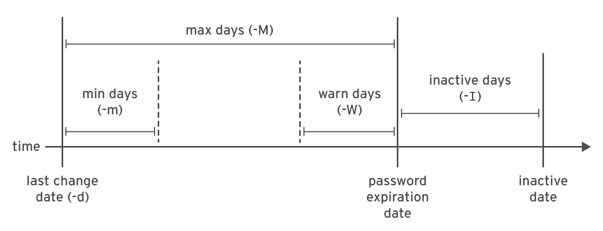

</div>

| Options for `chage` command  | Usage                                                          |
| ---------------------------- | -------------------------------------------------------------- |
| -d, --lastday LAST_DAY       | set date of last password change to LAST_DAY                   |
| -E, --expiredate EXPIRE_DATE | set account expiration date to EXPIRE_DATE                     |
| -I, --inactive INACTIVE      | set password inactive after expiration to INACTIVE             |
| -l, --list                   | show account aging info                                        |
| -m, --mindays MIN_DAYS       | set mininmum number of days before password change to MIN_DAYS |
| -M, --maxdays MAX_DAYS       | set maximum number of days before password change to MAX_DAYS  |
| -R, --root CHROOT_DIR        | directory to chroot into                                       |
| -W, --warndays WARN_DAYS     | set expiration warning days to WARN_DAYS                       |

### Additional commands

-   `$ last` - gives the details of which user logged in at what time
-   `$ who` - which user is currently logged in
-   `$ lsof -u <user>` - list files opened by the user (to install `$ yum install lsof -y`).

## File Permissions

-   Four symbols are used when displaying permissions:
    -   **r :** permission to read a file or list a directory's contents
    -   **w :** permission to write to a file or create and remove files from a directory
    -   **x :** permission to execute a program or change into a directory and do a long listing of the directory
    -   **- :** no permission (in place of the r, w or x)
-   File permissions may be viewed using `ls -l`<br>`$ ls -l /bin/login`

    ```
    -rwxr-xr-x. 1 root root 19080 Apr 1 18:26 /bin/login

    - => filetype
    rw- => user
    r-x => group
    r-x => others
    1 => link count
    root => owner user
    root => owner group
    19080 => filesize
    Apr 1 18:26 => Last modification date & time
    /bin/login => filename
    ```

### Changing Permissions

#### Symbolic Method

-   To change access modes :
    -   `$ chmod [-option]... mode[,mode] file|directory...`
-   **mode** includes :
    -   **u**, **g** or **o** for user, group and other
    -   **+**, **-** or **=** for grant, deny or set
    -   **r**, **w**, or **x** for read, write and execute
-   Options include :
    -   **-R** Recursive
    -   **-v** Verbose
    -   **--reference** Reference another file for its mode
-   Examples :
    -   `$ chmod ugo+r file` - Grant read access to all for file
    -   `$ chmod o-wx dir` - Deny write and execute to others for dir

#### Numeric Method

-   Uses a three-digit mode nummber
    -   first digit specifies **owner's** permissions
    -   second digit specifies **group** permissions
    -   third digit represents **others'** permissions
-   Permissions are calculated by adding :
    -   4 (for read)
    -   2 (for write)
    -   1 (for execute)
-   Example :
    -   `$ chmod 640 myfile`

### Changing ownership

-   To change ownership :
    -   `$ chown [-option]... user:group file|directory`
-   Options include :
    -   **-R** Recursive
    -   **-v** Verbose
-   Examples :
    -   `$ chown -R student dir` - Changes the user ownership to _student_ recursively
    -   `$ chown :admins file` - Changesthe group ownership to _admins_
    -   `$ chown aws:devops file` - Changes the user ownership to _aws_ and group ownership to _devops_

### Special Permissions

| Special Permission | Effect on files                                                              | Effect on directories                                                                               |
| ------------------ | ---------------------------------------------------------------------------- | --------------------------------------------------------------------------------------------------- |
| **u+s** (suid)     | File executes as the user that owns the file, not the user that ran the file | No effect                                                                                           |
| **g+s** (guid)     | Files executes as the group that owns the file                               | Files newly created in the directory have their owner set to match the group owner of the directory |
| **o+t** (sticky)   | No effect                                                                    | Users with write access to directory can only remove files they own                                 |

-   Can be set as follows :
    -   **Symbolically** : **setuid** = `u+s`; **setgid** = `g+s`; **sticky** = `o+t`
    -   **Numerically** (4th preceding digit) : **setuid** = 4; **setgid** = 2; **sticky** = 1
    -   Examples :
        -   `$ chmod g+s directory`
        -   `$ chmod 2770 directory #equivalent to g+s as 2 is written`

#### setuid permission

-   The **setuid** (suid) permission on an executable means that commands run as the user owning the file, not as the user that ran the command.
-   Example :
    -   `$ ls -l /usr/bin/passwd`
        ```
        -rwsr-xr-x. 1 root root 35504 Jul 16 2010 /usr/bin/passwd
        ```
    -   Here **s** is the **setuid** permission, written where normally execute (x) permission is written.
-   If the owner does not have execute permission, it will be replaced by an uppercase **S**.

#### setgid permission

-   The **setgid** (sgid) permission on a directory means that files created in the directory inherit their group ownership from the directory, rather than inheriting it from the creating user.
-   Example :
    -   `$ ls -ld /run/log/journal`
        ```
        drwxr-sr-x 3 root systemd-journal 60 May 18 09:15 /run/log/journal
        ```
    -   Here **s** is the **setgid** permission, written where normally execute (x) permission is written.
-   If the group does not have execute permission, it will be replaced by an uppercase **S**.

#### sticky permission

-   The **sticky bit** for a directory sets a special restriction on deletion of files.
-   Only the owner of the file (and root) can delete files within the directory.
-   Example :
    -   `$ ls -ld /tmp`
        ```
        drwxrwxrwt 39 root 4096 Feb 8 20:52 /tmp
        ```
    -   Here **t** is the **sticky** permission, written where normally execute (x) permission is written.
-   If others do not have execute permission, it will be replaced by an uppercase **T**.

### Default File Permissions - umask

-   If we create a new directory, default permissions are : 0777 (drwxrwxrwx)
-   If we create a new regular file, default permissions are : 0666 (-rw-rw-rw-)
    <br>
-   However, we can change it using **umask**
-   If a bit is set in **umask**, then corresponding permission will be cleared on new file.
-   For eg, the `$ umask 0002` clears the wirte bit for other users.
-   The `umask ` command without arguments will display the current value of the shell's umask. `$ umask` - `002`

## Sudo

-   sudo gives power to a normal user to execue commands which is owned by root user.
-   Not every user have the privilige to do sudo.
-   For giving any user or group acces to sudo we have to add them in `/etc/sudoers` file.
    -   `$ ls -l /etc/sudoers` - `-r--r-----. 1 root root 4328 Feb 12 17:54 /etc/sudoers`
    -   So event root user don't have write access to this file
    -   We **should not** change this file's permissions, instead we should write command `$ visudo` which will open this file in write mode.
    -   Search for the line `root ALL=(ALL) ALL` and insert new line below it to give any other user or group sudo privilige.
    -   For giving privilige to group, add a percentage sign (%) before the name.
    -   For giving privilige to a user or group so that password is not required for doing sudo, write `NOPASSWD:`
    -   Example :
        ```
        ....
        root        ALL=(ALL)       ALL
        ansible     ALL=(ALL)       NOPASSWD:       ALL
        %aws        ALL=(ALL)       ALL
        ...
        ```
-   For preventing any human error in `/etc/sudoers` file, we make a new file for the user or group we want to give sudo privilige in the `/etc/sudoers.d` directory.

## Processes

### Definition of a Process

-   Process is a running instance of a launched, executable program. A process consists of :

    -   An address space of allocated memory
    -   Security properties including ownership credentials and privileges
    -   One or more execution threads of program code
    -   Process state

-   The environment of a process includes :

    -   Local and global variables
    -   A current scheduling context
    -   Allocated system resources, such as file descriptors and network ports

-   An existing (parent) process duplicates its own address space (fork) to create a new (child) process structure.
-   Every new process is assigned a unique process ID (PID) for tracking and security.
-   The PID and the parent's process ID (PPID) are elements of the new process environment.
-   Any process may create a child process. All processes are descendants of the first system process, `init` in old linux systems and `systemd` in newer linux systems.

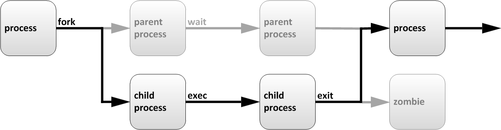

-   Through the `fork` routine, a child process inherits security identities, previous and current file descriptors, port and resource privileges, environment variables, and program code.
-   A child process may then `exec` its own program code.
-   Normally, a parent process sleeps while the child process runs, setting a request (`wait`) to be signaled when the child completes.
-   Upon exit, the child process has already closed or discarded its resources and environment. The only remaining resource, called a `zombie`, is an entry in the process table.
-   The parent, signaled awake when the child exited, cleans the process table of the child's entry, thus freeing the last resource of the child process. The parent process then continues with its own program code execution.

### Process States

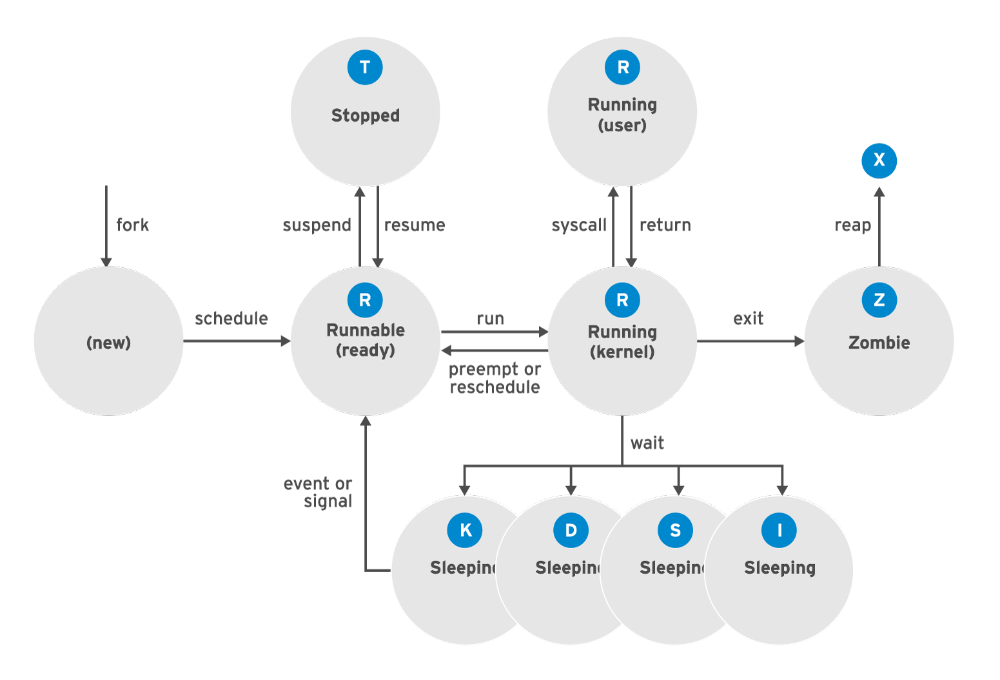

| Name     | Flag | Kernel0defined state name and description                                                                                                                                                                                                                                                           |
| -------- | ---- | --------------------------------------------------------------------------------------------------------------------------------------------------------------------------------------------------------------------------------------------------------------------------------------------------- |
| Running  | R    | TASK*RUNNING : The process is either executing on a CPU or waiting to run. Process can be executing user routines or kernel routines (system calls), or be queued and ready when in the \_Running*(or _Runnable_) state.                                                                            |
| Sleeping | S    | TASK*INTERRUPTIBLE : The process is waiting for some condition : a hardware request, system resource access, or signal. When an event or signal satisfies the condition, the process returns to \_Running*.                                                                                         |
| Sleeping | D    | TASK*UNINTERRUPTIBLE: This process is also \_Sleeping*, but unlike S state, does not respond to sugnals. Used only when process interruption may cause an unpredictable device state.                                                                                                               |
| Sleeping | K    | TASK*KILLABLE : Identical to the uninterruptible D state but modified to allow a waiting task to respond to the signal that it should be killed (exit completely). Utilities frequently display \_Killable* processes as **D** state.                                                               |
| Sleeping | I    | TASK_REPORT_IDLE : A subset of state **D**. The kernel doeas not count these processes when calculating thr load average. Used for kernel threads. Flags **TASK_UNINTERRUPTIBLE** and **TASK_NOLOAD** are set. Similar to **TASK_KILLABLE**, also a subse of state **D**. It accepts fatal signals. |
| Stopped  | T    | TASK*STOPPED : The process has been stopped (suspended), usually by being signaled by a user or another process. The process can be continued (resumed) by aother signal to return to \_RUNNING*.                                                                                                   |
| Stopped  | T    | TASK_TRACED : A process that is being debugged is also temporarily Stopped and shares the same **T** state flag.                                                                                                                                                                                    |
| Zombie   | Z    | EXIT_ZOMBIE : A child process signals its parent as it exits. All resources except for the process identity (PID) are released.                                                                                                                                                                     |
| Zombie   | X    | EXIT_DEAD : When the parent cleans up (reaps) the remaining child process structure, the process is now released completely. This state will never be observed in process-listing utilities.                                                                                                        |

### Listing Processes

#### ps Command

-   The ps command is used for listing current processes. It can provide detailed process information, including :

    -   User identification (UID), which determines process privileges
    -   Unique process identification (PID)
    -   CPU and real time already expended
    -   How much memory the process has allocated in various locations
    -   The location of process stdout, known as the controlling terminal
    -   The current process state

-   The Linux version of ps supports three option formats :
    -   **UNIX** (**POSIX**) options, which may be grouped and must be preceded by a dash
    -   **BSD** options, which may be grouped and must not be used with a dash
    -   **GNU** long options, which are preceded by two dashes
    -   For example, `$ ps -aux` is not the same as `$ ps aux`.
-   To display all processes including processes without a controlling terminal :
    ```
    $ ps aux
    USER       PID %CPU %MEM    VSZ   RSS TTY      STAT START   TIME COMMAND
    root         1  0.1  0.1  51648  7504 ?        Ss   17:45   0:03 /usr/lib/systemd/syst
    root         2  0.0  0.0      0     0 ?        S    17:45   0:00 [kthreadd]
    root         3  0.0  0.0      0     0 ?        S    17:45   0:00 [ksoftirqd/0]
    root         5  0.0  0.0      0     0 ?        S<   17:45   0:00 [kworker/0:0H]
    root         7  0.0  0.0      0     0 ?        S    17:45   0:00 [migration/0]
    ...output omitted...
    ```
-   To diplay long listing for providing more technical detail, and faster due to avoiding user name lookups :
    ```
    $ ps lax
    F   UID   PID  PPID PRI  NI    VSZ   RSS WCHAN  STAT TTY     TIME COMMAND
    4     0     1     0  20   0  51648  7504 ep_pol Ss   ?       0:03 /usr/lib/systemd/
    1     0     2     0  20   0      0     0 kthrea S    ?       0:00 [kthreadd]
    1     0     3     2  20   0      0     0 smpboo S    ?       0:00 [ksoftirqd/0]
    1     0     5     2   0 -20      0     0 worker S<   ?       0:00 [kworker/0:0H]
    1     0     7     2 -100  -      0     0 smpboo S    ?       0:00 [migration/0]
    ...output omitted...
    ```
-   To display all processes using **UNIX** syntax and for getting **Parent Process ID**
    ```
    $ ps -ef
    UID        PID  PPID  C STIME TTY          TIME CMD
    root         1     0  0 17:45 ?        00:00:03 /usr/lib/systemd/systemd --switched-ro
    root         2     0  0 17:45 ?        00:00:00 [kthreadd]
    root         3     2  0 17:45 ?        00:00:00 [ksoftirqd/0]
    root         5     2  0 17:45 ?        00:00:00 [kworker/0:0H]
    root         7     2  0 17:45 ?        00:00:00 [migration/0]
    ...output omitted...
    ```

#### top Command

-   Shows all the processes running on **realtime** basis.

### Controlling Jobs

#### Describing Jobs and Sessions

-   **Job control** is a feature of the shell which allows a single shell instance to run and manage multiple commands.
-   A **job** is associated with each pipeline entered at a shell prompt. All processes in that pipeline are part of the job and are members of the same **_process group_**. If only one command is entered at a shell prompt, that can be considered to be a minimal “pipeline” of one command, creating a job with only one member.
-   Only one job can read input and keyboard generated signals from a particular terminal window at a time. Processes that are part of that job are **foreground processes** of that controlling terminal.
-   A **background process** of that controlling terminal is a member of any other job associated with that terminal.
-   **Background processes** of a terminal cannot read input or receive keyboard generated interrupts from the terminal, but may be able to write to the terminal.
-   A job in the background may be stopped (suspended) or it may be running.
    **Note**
    -   If a running background job tries to read from the terminal, it will be automatically suspended.
-   Each terminal is its own **session**, and can have a foreground process and any number of independent background processes. A job is part of exactly one session: the one belonging to its controlling terminal.

#### Running Jobs in the Background

-   Any command or pipeline can be started in the background by appending an **ampersand** (`&`) to the end of the command line.
-   The Bash shell displays a job number (unique to the session) and the PID of the new child process.
    ```
    $ sleep 10000 &
    [1] 5947
    ```
-   We can display the list of jobs that Bash is tracking for a particular session with the `jobs` command.
    ```
    $ jobs
    [1]+ Running            sleep 10000 &
    ```
-   A background job can be brought to the foreground by using the `fg` command with its **job ID** (`%job number`).
    ```
    $ fg %1
    sleep 10000
    ```
-   To send a foreground process to the background, first press the keyboard generated suspend request (`Ctrl+z`) in the terminal.
    `sleep 10000 ^Z [1]+ Stopped sleep 10000`
    The job is immediately placed in the background and is suspended.
    To start the suspended process running in the background, use the bg command with the same job ID.
    `$ bg %1 [1]+ sleep 10000 &`

### Killing Processes

-   `kill` command is used to kill the processes.

| Signal Number | Short Name | Definition         | Purpose                                                                                                                                                  |
| ------------- | ---------- | ------------------ | -------------------------------------------------------------------------------------------------------------------------------------------------------- |
| 1             | HUP        | Hangup             | Used to report termination of the controlling of a terminal. Also used to request process reinitialization (config reload) without termination           |
| 2             | INT        | Keyboard Interrupt | Causes program termination. Can be blocked or handled. Sent by pressing INTR key sequence (Ctrl + c)                                                     |
| 3             | QUIT       | Keyboard Quit      | Similar to SIGINT; adds a process dump at termination. Sent by pressing QUIT key sequence (Ctrl + \\)                                                    |
| 9             | KILL       | Kill, unblockable  | Causes abruoot program termination. Cannot be blocked, ignored, or handled; always fatal                                                                 |
| 15 default    | TERM       | Terminate          | Causes program termination. Unlike SIGKILLm can be blocked, ignored, or handled. The "polite" way to use ask a program to terminate; allows self-cleanup |
| 18            | CONT       | Continue           | Sent to a process to resume, if stopped. Cannot be blocked. Even if handled, always resumes the process                                                  |
| 19            | STOP       | Stop, unblockable  | Suspends the process. Cannot be bolocked or handled                                                                                                      |
| 20            | TSIP       | keyboard Stop      | Unlike SIGSTOP, can be blocked, ignored or handled. Sent by pressing SUSP key sequence (Ctrl + z)                                                        |

-   Signals can be specified to `kill` command as options either by name (eg -HUP or -SIGHUP) or by number (the related -1).
-   Users can kill their own processes, but root privilige is required to kill processes owned by others.

### Real-time Process Monitoring

-   The **top** program is a dynamic view of the system's processes, displaying a summary header followed by a process or thread list similar to `ps` information.
-   Default output columns are :
    -   The process ID (PID).
    -   User name (USER) is the process owner.
    -   Virtual memory (VIRT) is all memory the process is using, including the resident set, shared libraries, and any mapped or swapped memory pages. (Labeled VSZ in the ps command.)
    -   Resident memory (RES) is the physical memory used by the process, including any resident shared objects. (Labeled RSS in the ps command.)
    -   Process state (S) displays as :
        -   D = Uninterruptible Sleeping
        -   R = Running or Runnable
        -   S = Sleeping
        -   T = Stopped or Traced
        -   Z = Zombie
    -   CPU time (TIME) is the total processing time since the process started. May be toggled to include cumulative time of all previous children.
    -   The process command name (COMMAND).
-   Fundamentals Keystrokes in top

    | Key          | Purpose                                                                                                |
    | ------------ | ------------------------------------------------------------------------------------------------------ |
    | ? or h       | Help for interactive keystrokes.                                                                       |
    | l, t, m      | Toggles for load, threads, and memory header lines.                                                    |
    | 1            | Toggle showing individual CPUs or a summary for all CPUs in header.                                    |
    | s            | Change the refresh (screen) rate, in decimal seconds (eg, 0.5, 1.5).                                   |
    | b            | Toggle reverse highlighting for **\*Running** processesl default is bold only.                         |
    | Shift + b    | Enables use of bold display, in the header, and for **_Running_** processes.                           |
    | Shift + h    | Toggles threads; show process summary or individual threads.                                           |
    | u, Shift + u | Filter for any user name (effective, real)                                                             |
    | Shitf + m    | Sorts process listing by memory usage, in descending order                                             |
    | Shift + p    | Sorts process listing by processor utilization, in descending order.                                   |
    | k            | Kill a process. When prompted, enter `PID`, then `Signal`.                                             |
    | r            | Renice a process. When prompted enter `PID`, then `nice_value`.                                        |
    | Shift + w    | Write (save) the current display configuration for use at the next **top** restart.                    |
    | q            | Quit                                                                                                   |
    | f            | Manage the columns by enabling or disabling fields. Also allows you to set the sort field for **top**. |

## Controling Services and Daemons

### Introduction to `systemd`

-   The `systemd` daemon manages startup for Linux, including service startup and service management in general. It activates system resources, server daemons, and other processes both at boot time and on a running system.
-   **Daemons** are processes that either wait or run in the background, performing various tasks. Generally, daemons start automatically at boot time and continue to run until shutdown or until they are manually stopped. It is a convention for names of many daemon programs to end in the letter `d`.
-   A **service** in the `systemd` sense often refers to one or more daemons, but starting or stopping a service may instead make a one-time change to the state of the system, which does not involve leaving a daemon process running afterward (called _oneshot_).

### Describing Service Units

-   `systemd` uses units to manage different types of objects. Some common unit types are listed below :
    -   **Service units** have a `.service` extension and represent system services. This type of unit is used to start frequently accessed daemons, such as a web server.
    -   **Socket units** have a `.socket` extension and represent inter-process communication (IPC) sockets that `systemd` should monitor. If a client connects to the socket, `systemd` will start a daemon and pass the connection to it. **Socket units** are used to delay the start of a service at boot time and to start less frequently used services on demand.
    -   **Path units** have a `.path` extension and are used to delay the activation of a service until a specific file system change occurs. This is commonly used for services which use spool directories such as a printing system.
-   The `systemctl` command is used to manage units. For example, display available unit types with the `$ systemctl -t help` command.

### Listing Service Units

-   To list all currently loaded service units, paginating the output using **less**.
    ```
    $ systemctl list-units --type=service --all
    UNIT                          LOAD      ACTIVE   SUB     DESCRIPTION
        atd.service                 loaded    active   running Job spooling tools
        auditd.service              loaded    active   running Security Auditing ...
        auth-rpcgss-module.service  loaded    inactive dead    Kernel Module ...
        chronyd.service             loaded    active   running NTP client/server
        cpupower.service            loaded    inactive dead    Configure CPU power ...
        crond.service               loaded    active   running Command Scheduler
        dbus.service                loaded    active   running D-Bus System Message Bus
        ● display-manager.service     not-found inactive dead    display-manager.service
    ...output omitted...
    ```

### Viewing Service States

-   View the status of a specific unit with `$ systemctl status name.type`. If the unit type is not provided, systemctl will show the status of a service unit, if one exists.

    ```
    $ systemctl status sshd.service
    ● sshd.service - OpenSSH server daemon
    Loaded: loaded (/usr/lib/systemd/system/sshd.service; enabled; vendor preset: enabled)
    Active: active (running) since Thu 2019-02-14 12:07:45 IST; 7h ago
    Main PID: 1073 (sshd)
    CGroup: /system.slice/sshd.service
            └─1073 /usr/sbin/sshd -D ...

    Feb 14 11:51:39 host.example.com systemd[1]: Started OpenSSH server daemon.
    Feb 14 11:51:39 host.example.com sshd[1073]: Could not load host key: /et...y
    Feb 14 11:51:39 host.example.com sshd[1073]: Server listening on 0.0.0.0 ....
    Feb 14 11:51:39 host.example.com sshd[1073]: Server listening on :: port 22.
    Feb 14 11:53:21 host.example.com sshd[1270]: error: Could not load host k...y
    Feb 14 11:53:22 host.example.com sshd[1270]: Accepted password for root f...2
    ...output omitted...
    ```

-   Service Unit Information

    | Field    | Description                                                                 |
    | -------- | --------------------------------------------------------------------------- |
    | Loaded   | Wether the service unit is loaded into memory.                              |
    | Active   | Wether the service unit is running and if so, how long it has been running. |
    | Main PID | The main process ID of the service, including the command name              |
    | Status   | Additional information about the service.                                   |

### Verifying the Status of a Service

-   The `systemctl` command provides methods for verifying the specific states of a service.
    ```
    $ systemctl is-active sshd.service
    active
    $ systemctl is-failed sshd.service
    active
    $ systemctl is-enabled sshd.service
    enabled
    ```

### Controlling System Services

-   `$ systemctl start sshd.service`
-   `$ systemctl stop sshd.service`
-   `systemctl restart sshd.service`
-   `systemctl reload sshd.service`

## Configuring and Securing SSH

### OpenSSH

-   **_OpenSSH_** implements the Secure Shell or SSH protocol. The SSH protocol enables systems to communicate in an encrypted and secure fashion over an insecure network.
-   We can use the `ssh` command to create a secure connection to a remote system, authenticate as a specific user, and get an interactive shell session on the remote system as that user. We may also use the `ssh` command to run an individual command on the remote system without running an interactive shell.
-   Examples :
    -   The following `ssh` command would log us in on the remote server `remotehost` using the same user name as the current local user.
        ```
        [user01@host ~]$ ssh remotehost
        user01@remotehost's password:
        ...output omitted...
        [user01@remotehost ~]$
        ```
    -   We can use the `exit` command to log out of the remote system.
        ```
        [user01@remotehost ~]$ exit
        logout
        Connection to remotehost closed
        [user01@host ~]$
        ```
    -   The next `ssh` command would log us in on the remote server `remotehost` using the user name `user02`. Again, we are prompted by the remote system to authenticate with that user's password.
        ```
        [user01@host ~]$ ssh user02@remotehost
        user02@remotehost's password:
        ...output omitted...
        [user02@remotehost ~]$
        ```
    -   This `ssh` command would run the `hostname` command on the `remotehost` remote system as the `user02` user without accessing the remote interactive shell.
        ```
        [user01@host ~]$ ssh user02@remotehost hostname
        user02@remotehost's password:
        remotehost.lab.example.com
        [user01@host ~]$
        ```

### Identifying Remote Users

-   The `w` command displays a list of users currently logged into the computer. This is especially useful to show which users are logged in using `ssh` from which remote locations, and what they are doing.
    ```
    [user01@host ~]$ ssh user01@remotehost
    user01@remotehost's password:
    [user01@remotehost ~]$ w
    16:13:38 up 36 min,  1 user,  load average: 0.00, 0.00, 0.00
    USER     TTY      FROM             LOGIN@   IDLE   JCPU   PCPU WHAT
    user02   pts/0    172.25.250.10    16:13    7:30   0.01s  0.01s -bash
    user01   pts/1    172.25.250.10    16:24    3.00s  0.01s  0.00s w
    [user02@remotehost ~]$
    ```
    The preceding output shows that the `user02` user has logged in to the system on the pseudo-terminal 0 at 16:13 today from the host with the `172.25.250.10` IP address, and has been idle at a shell prompt for seven minutes and thirty seconds.
    The preceding output also shows that the `user01` user has logged in to the system on the pseudo-terminal 1 and has been idle since since last three seconds after executing the `w` command.

### SSH host keys

-   SSH secures communication through public-key encryption.
-   When an SSH client connects to an SSH server, the server sends a copy of its public key to the client before the client logs in. This is used to set up the secure encryption for the communication channel and to authenticate the server to the client.
    <br>

-   When a user uses the `ssh` command to connect to an SSH server, the command checks to see if it has a copy of the public key for that server in its local known hosts files. The system administrator may have pre-configured it in `/etc/ssh/ssh_known_hosts`, or the user may have a `~/.ssh/known_hosts` file in their home directory that contains the key.
-   If the client has a copy of the key, ssh will compare the key from the known hosts files for that server to the one it received. If the keys do not match, the client assumes that the network traffic to the server could be hijacked or that the server has been compromised, and seeks the user's confirmation on whether or not to continue with the connection.

**Note**

-   Set the `StrictHostKeyChecking` parameter to `yes` in the user-specific `~/.ssh/config` file or the system-wide `/etc/ssh/ssh_config` to cause the `ssh` command to always abort the SSH connection if the public keys do not match.
    <br>
    <br>

-   If the client does not have a copy of the public key in its known hosts files, the `ssh` command will ask you if we want to log in anyway. If we do, a copy of the public key will be saved in our `~/.ssh/known_hosts` file so that the server's identity can be automatically confirmed in the future.
    ```
    [user01@host ~]$ ssh newhost
    The authenticity of host 'remotehost (172.25.250.12)' can't be established.
    ECDSA key fingerprint is SHA256:qaS0PToLrqlCO2XGklA0iY7CaP7aPKimerDoaUkv720.
    Are you sure you want to continue connecting (yes/no)? yes
    Warning: Permanently added 'newhost,172.25.250.12' (ECDSA) to the list of known hosts.
    user01@newhost's password:
    ...output omitted...
    [user01@newhost ~]$
    ```

#### SSH Known Hosts Key Management

-   If a server's public key is changed because the key was lost due to hard drive failure, or replaced for some legitimate reason, we will need to edit the known hosts files to make sure the entry for the old public key is replaced with an entry with the new public key in order to log in without errors.
-   Public keys are stored in the `/etc/ssh/ssh_known_hosts` and each users' `~/.ssh/known_hosts` file on the SSH client.
    -   Each key is on one line.
    -   The first field is a list of **hostnames** and **IP addresses** that share that public key.
    -   The second field is the **encryption algorithm** for the key.
    -   The last field is the **key** itself.
        ```
        [user01@host ~]$ cat ~/.ssh/known_hosts
        remotehost,172.25.250.11 ecdsa-sha2-nistp256 AAAAE2VjZHNhLXNoYTItbmlzdHAyNTYAAAAIbmlzdHAyNTYAAABBBOsEi0e+FlaNT6jul8Ag5Nj+RViZl0yE2w6iYUr+1fPtOIF0EaOgFZ1LXM37VFTxdgFxHS3D5WhnIfb+68zf8+w=
        ```
-   Each remote SSH server that we conect to, stores its public key in the `/etc/ssh` directory in files with the extension `.pub`.
    ```
    [user01@remotehost ~]$ ls /etc/ssh/*key.pub
    /etc/ssh/ssh_host_ecdsa_key.pub  /etc/ssh/ssh_host_ed25519_key.pub  /etc/ssh/ssh_host_rsa_key.pub
    ```

### Configuring SSH Key-based Authentication

-   We can configure an SSH server to allow us to authenticate without a password by using key-based authentication. This is based on a private-public key scheme.
-   To do this, we generate a matched pair of cryptographic key files. One is a private key, the other a matching public key. The private key file is used as the authentication credential and, like a password, must be kept secret and secure. The public key is copied to systems the user wants to connect to, and is used to verify the private key. The public key does not need to be secret.
-   We put a copy of the public key in our account on the server. When we try to log in, the SSH server can use the public key to issue a challenge that can only be correctly answered by using the private key. As a result, our ssh client can automatically authenticate our login to the server with our unique copy of the private key. This allows us to securely access systems in a way that doesn't require us to enter a password interactively every time.

#### Generating SSH Keys

-   To create a private key and matching public key for authentication, use the `ssh-keygen` command. By default, our private and public keys are saved in our `~/.ssh/id_rsa` and `~/.ssh/id_rsa.pub` files, respectively.
    ```
    [user@host ~]$ ssh-keygen
    Generating public/private rsa key pair.
    Enter file in which to save the key (/home/user/.ssh/id_rsa): Enter
    Created directory '/home/user/.ssh'.
    Enter passphrase (empty for no passphrase):
    Enter same passphrase again:
    Your identification has been saved in /home/user/.ssh/id_rsa.
    Your public key has been saved in /home/user/.ssh/id_rsa.pub.
    The key fingerprint is:
    SHA256:vxutUNPio3QDCyvkYm1oIx35hmMrHpPKWFdIYu3HV+w user@host.lab.example.com
    The key's randomart image is:
    +---[RSA 2048]----+
    |                 |
    |   .     .       |
    |  o o     o      |
    | . = o   o .     |
    |  o + = S E .    |
    | ..O o + * +     |
    |.+% O . + B .    |
    |=*oO . . + *     |
    |++.     . +.     |
    +----[SHA256]-----+
    ```
-   If we do not specify a passphrase when `ssh-keygen` prompts us, the generated private key is not protected. In this case, anyone with our private key file could use it for authentication. If we set a passphrase, then we will need to enter that passphrase when we use the private key for authentication. (Therefore, we would be using the private key's passphrase rather than our password on the remote host to authenticate.)
-   We can run a helper program called `ssh-agent` which can temporarily cache our private key passphrase in memory at the start of our session to get true passwordless authentication.
    ```
    [user@host ~]$ ssh-keygen -f .ssh/key-with-pass
    Generating public/private rsa key pair.
    Enter passphrase (empty for no passphrase):
    Enter same passphrase again:
    Your identification has been saved in .ssh/key-with-pass.
    Your public key has been saved in .ssh/key-with-pass.pub.
    The key fingerprint is:
    SHA256:w3GGB7EyHUry4aOcNPKmhNKS7dl1YsMVLvFZJ77VxAo user@host.lab.example.com
    The key's randomart image is:
    +---[RSA 2048]----+
    |    . + =.o ...  |
    |     = B XEo o.  |
    |  . o O X =....  |
    | = = = B = o.    |
    |= + * * S .      |
    |.+ = o + .       |
    |  + .            |
    |                 |
    |                 |
    +----[SHA256]-----+
    ```
    The `-f` option with the ssh-keygen command determines the files where the keys are saved.

#### Sharing the Public Key

-   Before key-based authentication can be used, the public key needs to be copied to the destination system. The `ssh-copy-id` command copies the public key of the SSH keypair to the destination system. If we omit the path to the public key file while running `ssh-copy-id`, it uses the default `/home/user/.ssh/id_rsa.pub` file.

    ```
    [user@host ~]$ ssh-copy-id -i .ssh/key-with-pass.pub user@remotehost
    /usr/bin/ssh-copy-id: INFO: Source of key(s) to be installed: "/home/user/.ssh/id_rsa.pub"
    /usr/bin/ssh-copy-id: INFO: attempting to log in with the new key(s), to filter out any that are already installed
    /usr/bin/ssh-copy-id: INFO: 1 key(s) remain to be installed -- if you are prompted now it is to install the new keys
    user@remotehost's password: redhat
    Number of key(s) added: 1

    Now try logging into the machine, with:   "ssh 'user@remotehost'"
    and check to make sure that only the key(s) you wanted were added.
    ```

-   After the public key is successfully transferred to a remote system, we can authenticate to the remote system using the corresponding private key while logging in to the remote system over SSH. If we omit the path to the private key file while running the `ssh` command, it uses the default `/home/user/.ssh/id_rsa` file.
    ```
    [user@host ~]$ ssh -i .ssh/key-with-pass user@remotehost
    Enter passphrase for key '.ssh/key-with-pass':
    ...output omitted...
    [user@remotehost ~]$ exit
    logout
    Connection to remotehost closed.
    [user@host ~]$
    ```

#### Using ssh-agent for Non-interactive Authentication

-   If our SSH private key is protected with a passphrase, we normally have to enter the passphrase to use the private key for authentication. However, we can use a program called `ssh-agent` to temporarily cache the passphrase in memory. Then any time that we use SSH to log in to another system with the private key, `ssh-agent` will automatically provide the passphrase for us. This is convenient, and can improve security by providing fewer opportunities for someone "shoulder surfing" to see we type the passphrase in.
    <br>

-   To start `ssh-agent` for the session.
    ```
    $ eval $(ssh-agent)
    Agent pid 10155
    ```
-   The following `ssh-add` commands add the private keys from `/home/user/.ssh/id_rsa` (the default) and `/home/user/.ssh/key-with-pass` files, respectively.
    ```
    [user@host ~]$ ssh-add
    Identity added: /home/user/.ssh/id_rsa (user@host.lab.example.com)
    [user@host ~]$ ssh-add .ssh/key-with-pass
    Enter passphrase for .ssh/key-with-pass:
    Identity added: .ssh/key-with-pass (user@host.lab.example.com)
    ```

### Customizing OpenSSH Service Configuration

#### Configuring the OpenSSH Server

-   **OpenSSH** service is provided by a daemon called `sshd`. Its main configuration file is `/etc/ssh/sshd_config`.

#### Prohibit the Superuser From Logging in Using SSH

-   The **OpenSSH** server uses the `PermitRootLogin` configuration setting in the `/etc/ssh/sshd_config` configuration file to allow or prohibit users logging in to the system as root. <br> `PermitRootLogin yes`
-   With the `PermitRootLogin` parameter to `yes`, as it is by default, people are permitted to log in as `root`. To prevent this, set the value to `no`.
-   Alternatively, to prevent password-based authentication but allow private key-based authentication for root, set the `PermitRootLogin` parameter to `without-password`.
-   The SSH server (sshd) must be reloaded for any changes to take effect.<br>`[root@host ~]# systemctl reload sshd`

#### Prohibiting Password-Based Authentication for SSH

-   The **OpenSSH** server uses the `PasswordAuthentication` parameter in the `/etc/ssh/sshd_config` configuration file to control whether users can use password-based authentication to log in to the system.<br> `PasswordAuthentication yes`
-   The default value of `yes` for the `PasswordAuthentication` parameter in the `/etc/ssh/sshd_config` configuration file causes the SSH server to allow users to use password-based authentication while logging in. The value of `no` for `PasswordAuthentication` prevents users from using password-based authentication.
-   -   The SSH server (sshd) must be reloaded for any changes to take effect.<br>`[root@host ~]# systemctl reload sshd`

## Analyzing and Storing Logs

### Describing System Log Architecture

#### System Logging

-   Processes and the operating system kernel record a log of events that happen. These logs are used to audit the system and troubleshoot problems
-   Many systems record logs of events in text files which are kept in the `/var/log` directory. These logs can be inspected using normal text utilities such as **less** and **tail**.
-   A standard logging system based on the Syslog protocol is built into linux. Many programs use this system to record events and organize them into log files. The `systemd-journald` and `rsyslog` services handle the syslog messages in the CentOS based systems.
    <br>

-   The `systemd-journald` service is at the heart of the **operating system event logging architecture**. It collects event messages from many sources including the kernel, output from the early stages of the boot process, standard output and standard error from daemons as they start up and run, and syslog events. It then restructures them into a standard format, and writes them into a structured, indexed system journal. By default, this journal is stored on a file system that **does not persist across reboots**.
    <br>

-   However, the `rsyslog` service reads syslog messages received by `systemd-journald` from the journal as they arrive. It then processes the syslog events, recording them to its log files or forwarding them to other services according to its own configuration.
-   The `rsyslog` service sorts and writes syslog messages to the log files that **do persist across reboots** in `/var/log`. The rsyslog service sorts the log messages to specific log files based on the type of program that sent each message, or facility, and the priority of each syslog message.
    <br>

-   In addition to syslog message files, the /var/log directory contains log files from other services on the system.
    | Log File | Type of Messages Stored
    | --- | ---
    | `/var/log/messages` | Most **syslog** messages are logged here. Exceptions include messages related to authentication and email processing, scheduled job execution, and those which are purely debugging-related.
    | `/var/log/secure` | Syslog messages related to security and authentication events.
    | `/var/log/maillog` | Syslog messages related to the mail server.
    | `/var/log/cron` | Syslog messages related to scheduled job execution.
    | `/var/log/boot.log` | Non-syslog console messages related to the system startup.

### Reviewing Syslog Files

#### Logging Events to the System

-   Many programs use the `syslog` protocol to log events to the system.
-   Each log message is categorized by a facility (the type of message) and a priority (the severity of the message).
-   Available facilities are documented in the `rsyslog.conf`(5) man page.
    <br>

-   The following table lists the standard eight syslog priorities from highest to lowest.
    | Code | Priority | Severity
    | --- | --- | ---
    | 0 | emerg | System is unusable
    | 1 | alert | Action must be taken immediately
    | 2 | crit | Critical condition
    | 3 | err | Non-critical error condition
    | 4 | warning | Warning condition
    | 5 | notice | Normal but significant event
    | 6 | info | Informational event
    | 7 | debug | Debugging-level message
    <br>

-   The `rsyslog` service uses the facility and priority of log messages to determine how to handle them. This is configured by rules in the `/etc/rsyslog.conf` file and any file in the `/etc/rsyslog.d` directory that has a file name extension of `.conf`. Software packages can easily add rules by installing an appropriate file in the `/etc/rsyslog.d` directory.
    <br>

-   Each rule that controls how to sort syslog messages is a line in one of the configuration files. The left side of each line indicates the facility and severity of the syslog messages the rule matches. The right side of each line indicates what file to save the log message in (or where else to deliver the message). An asterisk (`*`) is a wildcard that matches all values.
-   For example, the following line would record messages sent to the `authpriv` facility at any priority to the file `/var/log/secure`:
    ```
    authpriv.*          /var/log/secure
    ```
-   Log messages sometimes match more than one rule in `rsyslog.conf`. In such cases, one message is stored in more than one log file. To limit messages stored, the key word `none` in the priority field indicates that no messages for the indicated facility should be stored in the given file.
    <br>

-   Instead of logging syslog messages to a file, they can also be printed to the terminals of all logged-in users. The `rsyslog.conf` file has a setting to print all the syslog messages with the `emerg` priority to the terminals of all logged-in users.

#### Sample Rules of Rsyslog

```
#### RULES ####

# Log all kernel messages to the console.
# Logging much else clutters up the screen.
#kern.*                                         /dev/console

# Log anything (except mail) of level info or higher.
# Don't log private authentication messages!
*.info;mail.none;authpriv.none;cron.none        /var/log/messages

# The authpriv file has restricted access.
authpriv.*                                      /var/log/secure

# Log all the mail messages in one place.
mail.*                                          /var/log/maillog

# Log cron stuff
cron.*                                          /var/log/cron

# Everybody gets emergency messages.
*.emerg                                         :omusrmsg:*

# Save news errors of level crit and higher in a special file.
uucp,news.crit                                  /var/log/spooler

# Save boot messages also to boot.log
local7.*                                        /var/log/boot.log
```

#### Log File Rotation

-   The **logrotate** tool rotates log files to keep them from taking up too much space in the file system containing the `/var/log` directory. When a log file is rotated, it is renamed with an extension indicating the date it was rotated. For example, the old `/var/log/messages` file may become `/var/log/messages-20190130` if it is rotated on `2019-01-30`. Once the old log file is rotated, a new log file is created and the service that writes to it is notified.
-   After a certain number of rotations, typically after **four weeks**, the oldest log file is discarded to free disk space. A scheduled job runs the logrotate program daily to see if any logs need to be rotated. Most log files are rotated weekly, but logrotate rotates some faster, or slower, or when they reach a certain size.

#### Analyzing a Syslog Entry

-   Log messages start with the oldest message on top and the newest message at the end of the log file. The `rsyslog` service uses a standard format while recording entries in log files. The following example explains the anatomy of a log message in the `/var/log/secure` log file.
    ```
    Feb 11 20:11:48 localhost sshd[1433]: Failed password for student from 172.25.0.10 port 59344 ssh2
    ```
    1. The **time stamp** when the log entry was recorded
    2. The host from which the log message was sent
    3. The program or process name and PID number that sent the log message
    4. The actual message sent

#### Monitoring Logs

-   Monitoring one or more log files for events is helpful to reproduce problems and issues. The `tail -f /path/to/file` command outputs the last 10 lines of the file specified and continues to output new lines in the file as they get written.
    <br>

-   For example, to monitor for failed login attempts, run the `tail` command in one terminal and then in another terminal, run the `ssh` command as the `root` user while a user tries to log in to the system.
-   In the first terminal, run the following `tail` command :
    ```
    [root@host ~]# tail -f /var/log/secure
    ```
-   In the second terminal, run the following `ssh` command :
    ```
    [root@host ~]# ssh root@localhost
    root@localhost's password:
    ...output omitted...
    [root@host ~]#
    ```
-   Return to the first terminal and view the logs.
    ```
    ...output omitted...
    Feb 10 09:01:13 host sshd[2712]: Accepted password for root from 172.25.254.254 port 56801 ssh2
    Feb 10 09:01:13 host sshd[2712]: pam_unix(sshd:session): session opened for user root by (uid=0)
    ```

#### Sending Syslog Messages Manually

-   The `logger` command can send messages to the `rsyslog` service. By default, it sends the message to the `user` facility with the `notice` priority (`user.notice`) unless specified otherwise with the `-p` option. It is useful to test any change to the `rsyslog` service configuration.
-   To send a message to the `rsyslog` service that gets recorded in the `/var/log/boot.log` log file, execute the following `logger` command :<br> `$ logger -p local7.notice "Log entry created on host"`

### Reviewing System Journal Entries

#### Finding Events

-   The `systemd-journald` service stores logging data in a structured, indexed binary file called the **journal**. This data includes extra information about the log event. For example, for syslog events this includes the facility and the priority of the original message.
-   The `/run/log` directory stores the system journal by default in CentOS based systems and the contents of the `/run/log` directory get cleared after a reboot.
    <br>

-   To retrieve log messages from the journal, use the `journalctl` command. We can use this command to view all messages in the journal, or to search for specific events based on a wide range of options and criteria. If we run the command as root, we have full access to the journal. Regular users can also use this command, but might be restricted from seeing certain messages.
    ```
    [root@host ~]# journalctl
    ...output omitted...
    Feb 21 17:46:25 host.lab.example.com systemd[24263]: Stopped target Sockets.
    Feb 21 17:46:25 host.lab.example.com systemd[24263]: Closed D-Bus User Message Bus Socket.
    Feb 21 17:46:25 host.lab.example.com systemd[24263]: Closed Multimedia System.
    Feb 21 17:46:25 host.lab.example.com systemd[24263]: Reached target Shutdown.
    Feb 21 17:46:25 host.lab.example.com systemd[24263]: Starting Exit the Session...
    Feb 21 17:46:25 host.lab.example.com systemd[24268]: pam_unix(systemd-user:session): session c>
    Feb 21 17:46:25 host.lab.example.com systemd[1]: Stopped User Manager for UID 1001.
    Feb 21 17:46:25 host.lab.example.com systemd[1]: user-runtime-dir@1001.service: Unit not neede>
    Feb 21 17:46:25 host.lab.example.com systemd[1]: Stopping /run/user/1001 mount wrapper...
    Feb 21 17:46:25 host.lab.example.com systemd[1]: Removed slice User Slice of UID 1001.
    Feb 21 17:46:25 host.lab.example.com systemd[1]: Stopped /run/user/1001 mount wrapper.
    Feb 21 17:46:36 host.lab.example.com sshd[24434]: Accepted publickey for root from 172.25.250.>
    Feb 21 17:46:37 host.lab.example.com systemd[1]: Started Session 20 of user root.
    Feb 21 17:46:37 host.lab.example.com systemd-logind[708]: New session 20 of user root.
    Feb 21 17:46:37 host.lab.example.com sshd[24434]: pam_unix(sshd:session): session opened for u>
    Feb 21 18:01:01 host.lab.example.com CROND[24468]: (root) CMD (run-parts /etc/cron.hourly)
    Feb 21 18:01:01 host.lab.example.com run-parts[24471]: (/etc/cron.hourly) starting 0anacron
    Feb 21 18:01:01 host.lab.example.com run-parts[24477]: (/etc/cron.hourly) finished 0anacron
    lines 1464-1487/1487 (END) q
    ```
-   The `journalctl` command highlights important log messages: messages at notice or warning priority are in bold text while messages at the error priority or higher are in red text.
-   `journalctl -n` shows the last 10 log entries. We can adjust this with an optional argument that specifies how many log entries to display. For the last five log entries, run the following journalctl command :
    ```
    [root@host ~]# journalctl -n 5
    -- Logs begin at Wed 2019-02-20 16:01:17 +07, end at Thu 2019-02-21 18:01:01 +07. --
    ...output omitted...
    Feb 21 17:46:37 host.lab.example.com systemd-logind[708]: New session 20 of user root.
    Feb 21 17:46:37 host.lab.example.com sshd[24434]: pam_unix(sshd:session): session opened for u>
    Feb 21 18:01:01 host.lab.example.com CROND[24468]: (root) CMD (run-parts /etc/cron.hourly)
    Feb 21 18:01:01 host.lab.example.com run-parts[24471]: (/etc/cron.hourly) starting 0anacron
    Feb 21 18:01:01 host.lab.example.com run-parts[24477]: (/etc/cron.hourly) finished 0anacron
    lines 1-6/6 (END) q
    ```
-   Similar to the `tail -f` command, the `journalctl -f` command outputs the last 10 lines of the system journal and continues to output new journal entries as they get written to the journal. To exit the `journalctl -f` process, use the `Ctrl+C` key combination.
    ```
    [root@host ~]# journalctl -f
    -- Logs begin at Wed 2019-02-20 16:01:17 +07. --
    ...output omitted...
    Feb 21 18:01:01 host.lab.example.com run-parts[24477]: (/etc/cron.hourly) finished 0anacron
    Feb 21 18:22:42 host.lab.example.com sshd[24437]: Received disconnect from 172.25.250.250 port 48710:11: disconnected by user
    Feb 21 18:22:42 host.lab.example.com sshd[24437]: Disconnected from user root 172.25.250.250 port 48710
    Feb 21 18:22:42 host.lab.example.com sshd[24434]: pam_unix(sshd:session): session closed for user root
    Feb 21 18:22:42 host.lab.example.com systemd-logind[708]: Session 20 logged out. Waiting for processes to exit.
    Feb 21 18:22:42 host.lab.example.com systemd-logind[708]: Removed session 20.
    Feb 21 18:22:43 host.lab.example.com sshd[24499]: Accepted publickey for root from 172.25.250.250 port 48714 ssh2: RSA SHA256:1UGybTe52L2jzEJa1HLVKn9QUCKrTv3ZzxnMJol1Fro
    Feb 21 18:22:44 host.lab.example.com systemd-logind[708]: New session 21 of user root.
    Feb 21 18:22:44 host.lab.example.com systemd[1]: Started Session 21 of user root.
    Feb 21 18:22:44 host.lab.example.com sshd[24499]: pam_unix(sshd:session): session opened for user root by (uid=0)
    ^C
    [root@host ~]#
    ```
-   Run the following `journalctl` command to list journal entries at the err priority or higher :
    ```
    [root@host ~]# journalctl -p err
    -- Logs begin at Wed 2019-02-20 16:01:17 +07, end at Thu 2019-02-21 18:01:01 +07. --
    ..output omitted...
    Feb 20 16:01:17 host.lab.example.com kernel: Detected CPU family 6 model 13 stepping 3
    Feb 20 16:01:17 host.lab.example.com kernel: Warning: Intel Processor - this hardware has not undergone testing by Red Hat and might not be certif>
    Feb 20 16:01:20 host.lab.example.com smartd[669]: DEVICESCAN failed: glob(3) aborted matching pattern /dev/discs/disc*
    Feb 20 16:01:20 host.lab.example.com smartd[669]: In the system's table of devices NO devices found to scan
    lines 1-5/5 (END) q
    ```
-   The `journalctl` command has two options to limit the output to a specific time range, the `--since` and `--until` options. Both options take a time argument in the format `"YYYY-MM-DD hh:mm:ss"` (the double-quotes are required to preserve the space in the option). If the date is omitted, the command assumes the current day, and if the time is omitted, the command assumes the whole day starting at `00:00:00`. Both options take `yesterday`, `today`, and `tomorrow` as valid arguments in addition to the date and time field.
    ```
    [root@host ~]# journalctl --since today
    -- Logs begin at Wed 2019-02-20 16:01:17 +07, end at Thu 2019-02-21 18:31:14 +07. --
    ...output omitted...
    Feb 21 18:22:44 host.lab.example.com systemd-logind[708]: New session 21 of user root.
    Feb 21 18:22:44 host.lab.example.com systemd[1]: Started Session 21 of user root.
    Feb 21 18:22:44 host.lab.example.com sshd[24499]: pam_unix(sshd:session): session opened for user root by (uid=0)
    Feb 21 18:31:13 host.lab.example.com systemd[1]: Starting dnf makecache...
    Feb 21 18:31:14 host.lab.example.com dnf[24533]: Red Hat Enterprise Linux 8.0 AppStream (dvd)    637 kB/s | 2.8 kB     00:00
    Feb 21 18:31:14 host.lab.example.com dnf[24533]: Red Hat Enterprise Linux 8.0 BaseOS (dvd)       795 kB/s | 2.7 kB     00:00
    Feb 21 18:31:14 host.lab.example.com dnf[24533]: Metadata cache created.
    Feb 21 18:31:14 host.lab.example.com systemd[1]: Started dnf makecache.
    lines 533-569/569 (END) q
    ```
-   The following list gives us the common fields of the system journal that can be used to search for lines relevant to a particular process or event.
    -   `_COMM` is the **name of the command**
    -   `_EXE` is the **path to the executable** for the process
    -   `_PID` is the **PID** of the process
    -   `_UID` is the **UID** of the user running the process
    -   `_SYSTEMD_UNIT` is the **systemd unit that started the process**
-   More than one of the system journal fields can be combined to form a granular search query with the journalctl command. For example :
    ```
    [root@host ~]# journalctl _SYSTEMD_UNIT=sshd.service _PID=1182
    Apr 03 19:34:27 host.lab.example.com sshd[1182]: Accepted password for root from ::1 port 52778 ssh2
    Apr 03 19:34:28 host.lab.example.com sshd[1182]: pam_unix(sshd:session): session opened for user root by (uid=0)
    ...output omitted...
    ```

### Preserving the System Journal

-   By default, the system journals are kept in the `/run/log/journal` directory, which means the journals are cleared when the system reboots.
-   We can change the configuration settings of the `systemd-journald` service in the `/etc/systemd/journald.conf` file to make the journals persist across reboot.
    <br>

-   The `Storage` parameter in the `/etc/systemd/journald.conf` file defines whether to store system journals in a volatile manner or persistently across reboot. Set this parameter to `persistent`, `volatile`, `auto`, or `none` as follows:
    -   `persistent` : stores journals in the `/var/log/journal` directory which persists across reboots.
        If the `/var/log/journal` directory does not exist, the `systemd-journald` service creates it.
    -   `volatile` : stores journals in the volatile `/run/log/journal` directory.
        As the `/run` file system is temporary and exists only in the runtime memory, data stored in it, including system journals, do not persist across a reboot.
    -   `auto` : if the `/var/log/journal` directory exists, then `systemd-journald` uses persistent storage, otherwise it uses volatile storage.
        This is the default action if the Storage parameter is not set.
    -   `none` : do not use any storage. All logs are dropped but log forwarding will still work as expected.

<br>

-   To configure the `systemd-journald` service to preserve system journals persistently across reboot, set `Storage` to `persistent` in the `/etc/systemd/journald.conf` file.
-   After editing the configuration file, restart the `systemd-journald` service to bring the configuration changes into effect. <br> `$ systemctl restart systemd-journald`

### Maintaining Accurate Time

#### Setting Local Clocks and Time Zones

-   Correct synchronized system time is critical for log file analysis across multiple systems. The **Network Time Protocol (NTP)** is a standard way for machines to provide and obtain correct time information on the Internet. A machine may get accurate time information from public NTP services on the Internet, such as the **NTP Pool Project**. A high-quality hardware clock to serve accurate time to local clients is another option.
-   The `timedatectl` command shows an overview of the current time-related system settings, including current time, time zone, and NTP synchronization settings of the system.
    ```
    [user@host ~]$ timedatectl
                    Local time: Fri 2019-04-05 16:10:29 CDT
                Universal time: Fri 2019-04-05 21:10:29 UTC
                      RTC time: Fri 2019-04-05 21:10:29
                     Time zone: America/Chicago (CDT, -0500)
     System clock synchronized: yes
                   NTP service: active
               RTC in local TZ: no
    ```
-   A database of time zones is available and can be listed with the `timedatectl list-timezones` command.
    ```
    [user@host ~]$ timedatectl list-timezones
    Africa/Abidjan
    Africa/Accra
    Africa/Addis_Ababa
    Africa/Algiers
    Africa/Asmara
    Africa/Bamako
    ...
    ```
-   The command `tzselect` is useful for identifying correct zoneinfo time zone names. It interactively prompts the user with questions about the system's location, and outputs the name of the correct time zone. It does not make any change to the time zone setting of the system
-   The superuser can change the system setting to update the current time zone using the `timedatectl set-timezone` command. For Example :
    ```
    [root@host ~]# timedatectl set-timezone Asia/Kolkata
    [root@host ~]# timedatectl
            Local time: Tue 2022-06-14 15:13:59 IST
        Universal time: Tue 2022-06-14 09:43:59 UTC
              RTC time: Tue 2022-06-14 15:13:59
             Time zone: Asia/Kolkata (IST, +0530)
           NTP enabled: yes
      NTP synchronized: yes
       RTC in local TZ: yes
            DST active: n/a
    ```
-   **Note :** Use the `timedatectl set-timezone UTC` command to set the system's current time zone to **UTC**.
-   Use the `timedatectl set-time` command to change the system's current time. The time is specified in the `"YYYY-MM-DD hh:mm:ss"` format, where either date or time can be omitted.
-   The `timedatectl set-ntp` command enables or disables **NTP synchronization** for automatic time adjustment. The option requires either a `true` or `false` argument to turn it on or off.

#### Configuring and Monnitoring Chronyd

-   The `chronyd` service keeps the usually-inaccurate local hardware clock (RTC) on track by synchronizing it to the configured NTP servers. If no network connectivity is available, chronyd calculates the RTC clock drift, which is recorded in the driftfile specified in the `/etc/chrony.conf` configuration file.
    <br>

-   By default, the `chronyd` service uses servers from the **NTP Pool Project** for the time synchronization and does not need additional configuration. It may be useful to change the NTP servers when the machine in question is on an isolated network.
    <br>

-   The `stratum` of the NTP time source determines its quality. The stratum determines the number of hops the machine is away from a high-performance reference clock. The reference clock is a `stratum 0` time source. An NTP server directly attached to it is a `stratum 1`, while a machine synchronizing time from the NTP server is a `stratum 2` time source.
    <br>

-   The server and peer are the two categories of time sources that we can declare in the `/etc/chrony.conf` configuration file. The server is one stratum above the local NTP server, and the peer is at the same stratum level. More than one server and more than one peer can be specified, one per line.
-   The first argument of the `server` line is the IP address or DNS name of the NTP server. Following the server IP address or name, a series of options for the server can be listed. It is recommended to use the `iburst` option, because after the service starts, four measurements are taken in a short time period for a more accurate initial clock synchronization.
-   The following `server classroom.example.com iburst` line in the `/etc/chrony.conf` file causes the `chronyd` service to use the `classroom.example.com` NTP time source.
    ```
    # Use public servers from the pool.ntp.org project.
    ...output omitted...
    server classroom.example.com iburst
    ...output omitted...
    ```
-   After pointing `chronyd` to the local time source, `classroom.example.com`, we should restart the service <br> `$ systemctl restart chronyd`
-   The `chronyc` command acts as a client to the `chronyd` service. After setting up NTP synchronization, we should verify that the local system is seamlessly using the NTP server to synchronize the system clock using the `chronyc sources` command. For more verbose output with additional explanations about the output, use the `chronyc sources -v` command.

    ```
    [root@host ~]# chronyc sources -v
    210 Number of sources = 1

    .-- Source mode  '^' = server, '=' = peer, '#' = local clock.
    / .- Source state '*' = current synced, '+' = combined , '-' = not combined,
    | /   '?' = unreachable, 'x' = time may be in error, '~' = time too variable.
    ||                                                 .- xxxx [ yyyy ] +/- zzzz
    ||                                                /   xxxx = adjusted offset,
    ||         Log2(Polling interval) -.             |    yyyy = measured offset,
    ||                                  \            |    zzzz = estimated error.
    ||                                   |           |
    MS Name/IP address         Stratum Poll Reach LastRx Last sample
    ===============================================================================
    ^* classroom.example.com         8   6    17    23   -497ns[-7000ns] +/-  956us
    ```

## Managing Networking

### Describing Networking Concepts

#### TCP/IP Network Model

-   The **TCP/IP network model** is a simplified, four-layered set of abstractions that describes how different protocols interoperate in order for computers to send traffic from one machine to another over the Internet. It is specified by RFC 1122, Requirements for Internet Hosts -- Communication Layers. The four layers are:
    -   **Application**
        -   Each application has specifications for communication so that clients and servers may communicate across platforms. Common protocols include **SSH** (remote login), **HTTPS** (secure web), **NFS** or **CIFS** (file sharing), and **SMTP** (electronic mail delivery).
    -   **Transport**
        -   Transport protocols are **TCP** and **UDP**. **TCP** is a reliable connection-oriented communication, while **UDP** is a connectionless datagram protocol. Application protocols use TCP or UDP ports. A list of well-known and registered ports can be found in the `/etc/services` file.
        -   When a packet is sent on the network, the combination of the service port and IP address forms a **socket**. Each packet has a source socket and a destination socket. This information can be used when monitoring and filtering.
    -   **Internet**
        -   The Internet, or network layer, carries data from the source host to the destination host. The **IPv4** and **IPv6** protocols are Internet layer protocols. Each host has an IP address and a prefix used to determine network addresses. Routers are used to connect networks
    -   **Link**
        -   The link, or media access, layer provides the connection to physical media. The most common types of networks are **wired Ethernet** (802.3) and **wireless WLAN** (802.11). Each physical device has a hardware address (MAC) which is used to identify the destination of packets on the local network segment.

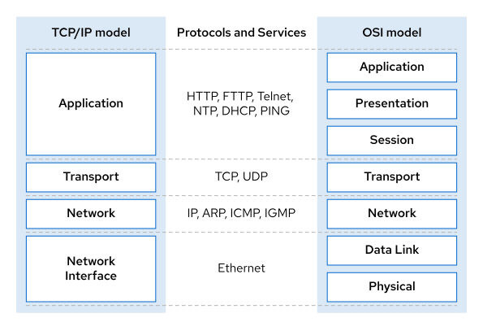

#### Describing Network Interface Names

-   Each network port on a system has a name, which we use to configure and identify it.
    <br>

-   Older versions Linux like Ubuntu uses names like `eth0`, `eth1`, and `eth2` for each network interface.
-   The name `eth0` is the first network port detected by the operating system, `eth1` the second, and so on. However, as devices are added and removed, the mechanism detecting devices and naming them could change which interface gets which name.
-   Furthermore, the PCIe standard does not guarantee the order in which PCIe devices will be detected on boot, which could change device naming unexpectedly due to variations during device or system startup.
    <br>

-   Newer versions of Linux like CentOS use a different naming system. Instead of being based on detection order, the names of network interfaces are assigned based on information from the firmware, the PCI bus topology, and type of network device.
-   Network interface names **start with the type of interface**:
    -   **Ethernet** interfaces begin with `en`
    -   **WLAN** interfaces begin with `wl`
    -   **WWAN** interfaces begin with `ww`
-   The rest of the interface name after the type will be based on **information provided by the server's firmware** or determined by the **location of the device in the PCI topology**.
    -   `oN` indicates that this is an **on-board device** and the server's firmware provided index number `N` for the device. So `eno1` is **on-board Ethernet device 1**. Many servers will not provide this information.
    -   `sN` indicates that this device is in **PCI hotplug slot `N`**. So `ens3` is an **Ethernet card in PCI hotplug slot 3**.
    -   `pMsN` indicates that this is a **PCI device on bus `M` in slot `N`**. So `wlp4s0` is a **WLAN card on PCI bus 4 in slot 0**. If the card is a multi-function device (possible with an Ethernet card with multiple ports, or devices that have Ethernet plus some other functionality), we may see `fN` added to the device name. So `enp0s1f0` is **function 0 of the Ethernet card on bus 0 in slot 1**. There might also be a second interface named `enp0s1f1` that is **function 1 of that same device**.
-   Persistent naming means that once we know what the name is for a network interface on the system, we also know that it will not change later. The trade off is that we cannot assume that a system with one interface will name that interface `eth0`.

#### IPv4 Networking

IPv4 is the primary network protocol used on the Internet today. We should have at least a basic understanding of IPv4 networking in order to manage network communication for our servers.

##### IPv4 Addresses

-   An IPv4 address is a **32-bit** number, normally expressed in decimal as **four 8-bit octets** ranging in value from **0 to 255**, separated by dots. The address is divided into two parts : **the network part** and **the host part**. All hosts on the same subnet, which can talk to each other directly without a router, have the same network part; the network part identifies the subnet. No two hosts on the same subnet can have the same host part; the host part identifies a particular host on a subnet.
    <br>

-   In the modern Internet, the size of an IPv4 subnet is variable. To know which part of an IPv4 address is the network part and which is the host part, an administrator must know the **netmask**, which is assigned to the subnet. The **netmask** indicates how many bits of the IPv4 address belong to the subnet. The more bits available for the host part, the more hosts can be on the subnet.
    <br>

-   The lowest possible address on a subnet (host part is all zeros in binary) is sometimes called the **network address**. The highest possible address on a subnet (host part is all ones in binary) is used for broadcast messages in IPv4, and is called the **broadcast address**.
    <br>

-   Network masks are expressed in two forms. The older syntax for a netmask uses **24 bits** for the network part and reads `255.255.255.0`. A newer syntax, called **CIDR notation**, specifies a network prefix of `/24`. Both forms convey the same information; namely, how many leading bits in the IP address contribute to its network address.
-   The following examples illustrate how the IP address, prefix (netmask), network part, and host part are related.
    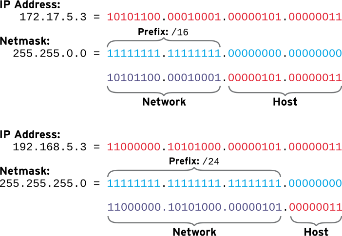

-   Calculating the network address for `192.168.1.107/24`
    | | | |
    | --- | --- | ---
    | Host addr | `192.168.1.107` | `11000000.10101000.00000001.01101011`
    | Network prefix | `/24 (255.255.255.0)` | `11111111.11111111.11111111.00000000`
    | Network addr | `192.168.1.0` | `11000000.10101000.00000001.00000000`
    | Broadcast addr | `192.168.1.255` | `11000000.10101000.00000001.11111111`
-   Calculating the network address for `10.1.1.18/8`
    | | | |
    | --- | --- | ---
    | Host addr | `10.1.1.18` | `00001010.00000001.0000000.00010010`
    | Network prefix | `/8 (255.0.0.0)` | `11111111.00000000.00000000.00000000`
    | Network addr | `10.0.0.0` | `00001010.00000000.00000000.00000000`
    | Broadcast addr | `10.255.255.255` | `00001010.11111111.11111111.11111111`
-   Calculating the network address for `172.16.181.23/19`
    | | | |
    | --- | --- | ---
    | Host addr | `172.168.181.23` | `10101100.10101000.10110101.00010111`
    | Network prefix | `/19 (255.255.224.0)` | `11111111.11111111.11100000.00000000`
    | Network addr | `172.168.160.0` | `10101100.10101000.10100000.00000000`
    | Broadcast addr | `172.168.191.255` | `10101100.10101000.10111111.11111111`
    <br>

-   The special address `127.0.0.1` always points to the local system (**“localhost”**), and the network `127.0.0.0/8` belongs to the local system, so that it can talk to itself using network protocols.

##### Ipv4 Routing

-   Whether using IPv4 or IPv6, network traffic needs to move from host to host and network to network. Each host has a **routing table**, which tells it how to route traffic for particular networks. A routing table entry lists a **destination network**, **which interface to use** when sending traffic, and the **IP address of any intermediate router** required to relay a message to its final destination. The routing table entry matching the destination of the network traffic is used to route it. If two entries match, the one with the longest prefix is used.
    <br>

-   If the network traffic does not match a more specific route, the routing table usually has an entry for a default route to the entire IPv4 Internet: `0.0.0.0/0`. This default route points to a router on a reachable subnet (that is, on a subnet that has a more specific route in the host's routing table).
    <br>

-   If a router receives traffic that is not addressed to it, instead of ignoring it like a normal host, it forwards the traffic based on its own routing table. This may send the traffic directly to the destination host (if the router happens to be on the destination's subnet), or it may be forwarded on to another router. This process of forwarding continues until the traffic reaches its final destination.
    <br>

-   Example network topology :
    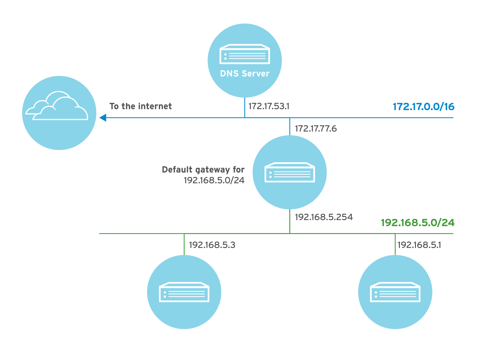
-   Example routing table :
    | Destination | Interface | Router (if needed)
    | --- | --- | ---
    | `192.0.2.0/24` | `wl01` |
    | `192.168.5.0/24` | `enp3s0` |
    | `0.0.0.0/0 (default)` | `enp3s0` | `192.168.5.254`
-   In this example, traffic headed for the IP address `192.0.2.102` from this host is transmitted directly to that destination via the `wlo1` wireless interface, because it matches the `192.0.2.0/24` route most closely. Traffic for the IP address `192.168.5.3` is transmitted directly to that destination via the `enp3s0` Ethernet interface, because it matches the `192.168.5.0/24` route most closely.
-   Traffic to the IP address `10.2.24.1` is transmitted out the `enp3s0` Ethernet interface to a router at `192.168.5.254`, which forwards that traffic on to its final destination. That traffic matches the `0.0.0.0/0` route most closely, as there is not a more specific route in the routing table of this host. The router uses its own routing table to determine where to forward that traffic to next.

##### IPv4 Address and Route Configuration

-   A server can automatically configure its IPv4 network settings at boot time from a **DHCP server**. A local client daemon queries the link for a server and network settings, and obtains a lease to use those settings for a specific length of time. If the client does not request a renewal of the lease periodically, it might lose its network configuration settings.
-   As an alternative, we can configure a server to use a **static network configuration**. In this case, network settings are read from local configuration files. We must get the correct settings from our network administrator and update them manually as needed to avoid conflicts with other servers.

#### IPv6 Networking

-   **IPv6** is intended as an eventual replacement for the IPv4 network protocol. We will need to understand how it works since increasing numbers of production systems use IPv6 addressing. For example, many ISPs already use IPv6 for internal communication and device management networks in order to preserve scarce IPv4 addresses for customer purposes.
-   IPv6 can also be used in parallel with IPv4 in a **dual-stack model**. In this configuration, a network interface can have an IPv6 address or addresses as well as IPv4 addresses.

##### IPv6 Addresses

-   An IPv6 address is a **128-bit** number, normally expressed as **eight colon-separated groups of four hexadecimal nibbles (half-bytes)**. Each nibble represents four bits of the IPv6 address, so each group represents 16 bits of the IPv6 address : `2001:0db8:0000:0010:0000:0000:0000:0001`.
-   To make IPv6 addresses easier to write, leading zeros in a colon-separated group do not need to be written. However, at least one hexadecimal digit must be written in each colon-separated group : `2001:db8:0:10:0:0:0:1`.
-   Since addresses with long strings of zeros are common, one or more consecutive groups of zeros only may be combined with exactly one `::` block : `2001:db8:0:10::1`.
-   Notice that under these rules, `2001:db8::0010:0:0:0:1` would be another less convenient way to write the example address. But it is a valid representation of the same address, and this can confuse administrators new to IPv6. Some tips for writing consistently readable addresses :
    -   Suppress leading zeros in a group.
    -   Use `::` to shorten as much as possible.
    -   If an address contains two consecutive groups of zeros, equal in length, it is preferred to shorten the leftmost groups of zeros to `::` and the rightmost groups to `:0:` for each group.
    -   Although it is allowed, do not use `::` to shorten one group of zeros. Use `:0:` instead, and save `::` for consecutive groups of zeros.
    -   Always use lowercase letters for hexadecimal numbers `a` through `f`.
-   **Important**
    -   When including a TCP or UDP network port after an IPv6 address, always enclose the IPv6 address in square brackets so that the port does not look like it is part of the address : `[2001:db8:0:10::1]:80`.

##### IPv6 Subnetting

-   A normal IPv6 unicast address is divided into two parts: the **network prefix** and **interface ID**. The **network prefix** identifies the subnet. No two network interfaces on the same subnet can have the same interface ID; the **interface ID** identifies a particular interface on the subnet.
    <br>

-   Unlike IPv4, IPv6 has a standard subnet mask, which is used for almost all normal addresses, `/64`. In this case, half of the address is the network prefix and half of it is the interface ID. This means that a single subnet can hold as many hosts as necessary.
    <br>

-   Typically, the network provider will allocate a shorter prefix to an organization, such as a `/48`. This leaves the rest of the network part for assigning subnets (always of length `/64`) from that allocated prefix. For a `/48` allocation, that leaves 16 bits for subnets (up to 65536 subnets).
    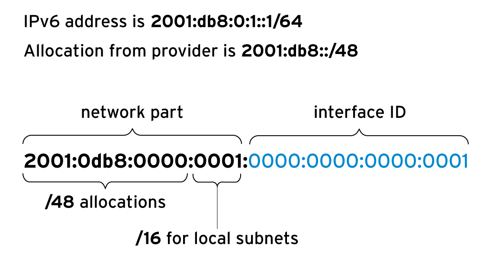
-   Common IPv6 Addresses and Networks
    | IPv6 address or network | Purpose | Description
    | --- | --- | ---
    | `::1/128` | localhost | The IPv6 equivalent to `127.0.0.1/8`, set on the loopback interface.
    | `::` | The unspecified address | The IPv6 equivalent to a `0.0.0.0`. For a network service, this could indicate that it is listening on all configured IP addresses.
    | `::/0` | The default route (the IPv6 internet) | The IPv6 equivalent to `0.0.0.0/0`. The default route in the routing table matches this network; the router for this network is where all traffic, for which there is no better route, is sent.
    | `2000::/3` | Global unicast addresses | "Normal" IPv6 addresses are currently being allocated from this space by IANA. This is equivalent to all the networks ranging from `2000::/16` through `3fff::/16`.
    | `fd00::/8` | Unique local addresses (RFC 4193) | IPv6 has no direct equivalent of RFC 1918 private address space, although this is close. A site can use these to self-allocate a private routable IP address space inside the organization.,but these networks cannot be used on the global internet. The site must _randomly_ select a `/48` from this space, but it can subnet the allocation into `/64` networks normally.
    | `fe80::/10` | Linc-local addresses | Every IPv6 interface automatically configures a _link-local_ unicast address that only works on the local link on the `fe80::/64` network.<br><br>However, the entire `fe80::/10` range is reserved for future use by the local link.
    | `ff00::/8` | Multicast | The IPv6 equivalent to `224.0.0.0/4`. Multicast is used to transmit to multiple hosts at the same time, and is particualrly important in IPv6 because it has no broadcast addresses.
-   **Important**
    -   The table above lists network address allocations that are reserved for specific purposes. These allocations may consist of many different networks. Remember that IPv6 networks allocated from the **global unicast** and **link-local** unicast spaces have a standard `/64` subnet mask.
        <br>

##### Link-local IPv6 Addresses

-   A link-local address in IPv6 is an unroutable address used only to talk to hosts on a specific network link. Every network interface on the system is automatically configured with a link-local address on the `fe80::/64` network.
-   To ensure that it is unique, the interface ID of the link-local address is constructed from the **network interface's Ethernet hardware address**. The usual procedure to **convert the 48-bit MAC address to a 64-bit interface ID** is to **invert bit 7** of the MAC address and **insert `ff:fe` between its two middle bytes**.
    -   **Network prefix :** `fe80::/64`
    -   **MAC address :** `00:11:22:aa:bb:cc`
    -   **Link-local address :** `fe80::211:22ff:feaa:bbcc/64`
-   The link-local addresses of other machines can be used like normal addresses by other hosts on the same link. Since every link has a `fe80::/64` network on it, the routing table cannot be used to select the outbound interface correctly. The link to use when talking to a link-local address must be specified with a scope identifier at the end of the address. The scope identifier consists of `%` followed by the **name of the network interface**.
-   For example, to use `ping6` to ping the link-local address `fe80::211:22ff:feaa:bbcc` using the link connected to the `ens3` network interface, the correct command syntax is the following:
    ```
    $ ping6 fe80::211:22ff:feaa:bbcc%ens3
    ```
-   **Note**
    -   Scope identifiers are only needed when contacting addresses that have **“link”** scope. Normal global addresses are used just like they are in IPv4, and select their outbound interfaces from the routing table.

##### Multicast IPv6 Addresses

-   Multicast allows one system to send traffic to a special IP address that is received by multiple systems. It differs from broadcast since only specific systems on the network receive the traffic. It also differs from broadcast in IPv4 since some multicast traffic might be routed to other subnets, depending on the configuration of our network routers and systems.
    <br>

-   Multicast plays a larger role in IPv6 than in IPv4 because there is no broadcast address in IPv6. One key multicast address in IPv6 is `ff02::1`, the **all-nodes link-local address**. Pinging this address sends traffic to all nodes on the link. Link-scope multicast addresses (starting `ff02::/8`) need to be specified with a scope identifier, just like a link-local address.
    ```
    $ ping6 ff02:::1%ens3
    PING ff02::1%ens3(ff02::1) 56 data bytes
    64 bytes from fe80::211:22ff:feaa:bbcc: icmp_seq=1 ttl=64 time=0.072 ms
    64 bytes from fe80::200:aaff:fe33:2211: icmp_seq=1 ttl=64 time=102 ms (DUP!)
    64 bytes from fe80::bcd:efff:fea1:b2c3: icmp_seq=1 ttl=64 time=103 ms (DUP!)
    64 bytes from fe80::211:22ff:feaa:bbcc: icmp_seq=2 ttl=64 time=0.079 ms
    ...output omitted...
    ```

##### IPv6 Address Configuration

-   Liek IPv4, IPv6 also supports **manual configuration**, and two methods of **dynamic configuration**, one of which is **DHCPv6**.
    <br>

-   Interface IDs for static IPv6 addresses can be selected at will, just like IPv4. In IPv4, there are two addresses on a network that could not be used: the lowest address in the subnet and the highest address in the subnet. In IPv6, the **following interface IDs are reserved and cannot be used** for a normal network address on a host.

    -   The **all-zeros identifier** `0000:0000:0000:0000` (“subnet router anycast”) used by all routers on the link. (For the `2001:db8::/64` network, this would be the address `2001:db8::`)
    -   The identifiers `fdff:ffff:ffff:ff80` through `fdff:ffff:ffff:ffff`.
        <br>

-   **DHCPv6** works differently than DHCP for IPv4, because there is no broadcast address. Essentially, a host sends a DHCPv6 request from its link-local address to port `547/UDP` on `ff02::1:2`, the **all-dhcp-servers link-local multicast group**. The DHCPv6 server then usually sends a reply with appropriate information to port `546/UDP` on the client's link-local address.
-   The **dhcp** package in Red Hat Enterprise Linux 8 provides support for a DHCPv6 server.
    <br>

-   In addition to DHCPv6, IPv6 also supports a second dynamic configuration method, called **Stateless Address Autoconfiguration (SLAAC)**. Using SLAAC, the host brings up its interface with a link-local `fe80::/64` address normally. It then sends a **“router solicitation”** to `ff02::2`, the **all-routers link-local multicast group**. An IPv6 router on the local link responds to the host's link-local address with a network prefix and possibly other information. The host then uses that network prefix with an interface ID that it normally constructs in the same way that link-local addresses are constructed. The router periodically sends multicast updates (**“router advertisements”**) to confirm or update the information it provided.
-   The **radvd** package in Red Hat Enterprise Linux 8 allows a Red Hat Enterprise Linux based IPv6 router to provide SLAAC through router advertisements.

#### Hosts Names and IP Addresses

-   It would be inconvenient if we always had to use IP addresses to contact our servers. Humans generally would prefer to work with names than long and hard-to-remember strings of numbers. And so Linux has a number of mechanisms to map a host name to an IP address, collectively called **name resolution**.
    <br>

-   One way is to set a static entry for each name in the `/etc/hosts` file on each system. This requires to manually update each server's copy of the file.
    <br>

-   For most hosts, we can look up the address for a host name (or a host name from an address) from a network service called the **Domain Name System (DNS)**. **DNS** is a distributed network of servers providing mappings of host names to IP addresses. In order for name service to work, a host needs to be pointed at a nameserver. This nameserver does not need to be on the same subnet; it just needs to be reachable by the host. This is typically configured through DHCP or a static setting in a file called `/etc/resolv.conf`.

### Validating Network Configuration

#### Gathering Network Interface Information

##### Identifying Network Interfaces

-   The `ip link` command will list all network interfaces available on our system :
    ```
    $ ip link show
    1: lo: <LOOPBACK,UP,LOWER_UP> mtu 65536 qdisc noqueue state UNKNOWN mode DEFAULT group default qlen 1000
    link/loopback 00:00:00:00:00:00 brd 00:00:00:00:00:00
    2: ens3: <BROADCAST,MULTICAST,UP,LOWER_UP> mtu 1500 qdisc mq state UP mode DEFAULT group default qlen 1000
        link/ether 52:54:00:00:00:0a brd ff:ff:ff:ff:ff:ff
    3: ens4: <BROADCAST,MULTICAST,UP,LOWER_UP> mtu 1500 qdisc mq state UP mode DEFAULT group default qlen 1000
        link/ether 52:54:00:00:00:1e brd ff:ff:ff:ff:ff:ff
    ```
    In this example, the server has three network interfaces: `lo`, which is the loopback device that is connected to the server itself, and two Ethernet interfaces, `ens3` and `ens4`.
-   To configure each network interface correctly, we need to know which one is connected to which network. In many cases, we will know the MAC address of the interface connected to each network, either because it is physically printed on the card or server, or because it is a virtual machine and we know how it is configured. The MAC address of the device is listed after `link/ether` for each interface. So we know that the network card with the MAC address `52:54:00:00:00:0a` is the network interface `ens3`.

##### Displaying IP Addresses

-   Use the `ip` command to view device and address information. A single network interface can have multiple IPv4 or IPv6 addresses.
    ```
    $ ip addr show ens3
    2: ens3: <BROADCAST,MULTICAST,UP,LOWER_UP> mtu 1500 qdisc pfifo_fast state UP qlen 1000
        link/ether 52:54:00:00:00:0b brd ff:ff:ff:ff:ff:ff
        inet 192.0.2.2/24 brd 192.0.2.255 scope global ens3
            valid_lft forever preferred_lft forever
        inet6 2001:db8:0:1:5054:ff:fe00:b/64 scope global
            valid_lft forever preferred_lft forever
        inet6 fe80::5054:ff:fe00:b/64 scope link
            valid_lft forever preferred_lft forever
    ```
    1. An active interface is `UP`.
    2. The `link/ether` line specifies the hardware (MAC) address of the device.
    3. The `inet` line shows an IPv4 address, its network prrefix length, and scope.
    4. The `inet6` line shows an IPv6 address, its network prefix length, and scope. This address is of _global_ scope and is normally used.
    5. The next `inet6` line shows that the interface has an IPv6 address of `link` scope that can only be used for communication on the local Ethernet link.

##### Displaying Performance Statistics

-   The `ip` command may also be used to show statistics about network performance. Counters for each network interface can be used to identify the presence of network issues. The counters record statistics for things like the number of received (RX) and transmitted (TX) packets, packet errors, and packets that were dropped.
    ```
    $ ip -s link show ens3
    2: ens3: <BROADCAST,MULTICAST,UP,LOWER_UP> mtu 1500 qdisc pfifo_fast state UP qlen 1000
    link/ether 52:54:00:00:00:0a brd ff:ff:ff:ff:ff:ff
        RX: bytes  packets  errors  dropped overrun mcast
        269850     2931     0       0       0       0
        TX: bytes  packets  errors  dropped carrier collsns
        300556     3250     0       0       0       0
    ```

#### Checking Connectivity Between Hosts

-   The `ping` command is used to test connectivity. The command continues to run until `Ctrl+c` is pressed unless options are given to limit the number of packets sent.

    ```
    $ ping -c3 192.0.2.254
    PING 192.0.2.1 (192.0.2.254) 56(84) bytes of data.
    64 bytes from 192.0.2.254: icmp_seq=1 ttl=64 time=4.33 ms
    64 bytes from 192.0.2.254: icmp_seq=2 ttl=64 time=3.48 ms
    64 bytes from 192.0.2.254: icmp_seq=3 ttl=64 time=6.83 ms

    --- 192.0.2.254 ping statistics ---
    3 packets transmitted, 3 received, 0% packet loss, time 2003ms
    rtt min/avg/max/mdev = 3.485/4.885/6.837/1.424 ms
    ```

-   The `ping6` command is the IPv6 version of ping. It communicates over IPv6 and takes IPv6 addresses, but otherwise works like ping.
    ```
    $ ping6 2001:db8:0:1::1
    PING 2001:db8:0:1::1(2001:db8:0:1::1) 56 data bytes
    64 bytes from 2001:db8:0:1::1: icmp_seq=1 ttl=64 time=18.4 ms
    64 bytes from 2001:db8:0:1::1: icmp_seq=2 ttl=64 time=0.178 ms
    64 bytes from 2001:db8:0:1::1: icmp_seq=3 ttl=64 time=0.180 ms
    ^C
    --- 2001:db8:0:1::1 ping statistics ---
    3 packets transmitted, 3 received, 0% packet loss, time 2001ms
    rtt min/avg/max/mdev = 0.178/6.272/18.458/8.616 ms
    ```
-   When we ping link-local addresses and the link-local all-nodes multicast group (`ff02::1`), the network interface to use must be specified explicitly with a scope zone identifier (such as `ff02::1%ens3`). If this is left out, the error `connect: Invalid argument` is displayed.

#### Troubleshooting Routing

##### Displaying Routing Table

-   Use the `ip` command with the `route` option to show routing information.
    ```
    $ ip route
    default via 192.0.2.254 dev ens3 proto static metric 1024
    192.0.2.0/24 dev ens3 proto kernel scope link src 192.0.2.2
    10.0.0.0/8 dev ens4 proto kernel scope link src 10.0.0.11
    ```
    This shows the IPv4 routing table. All packets destined for the `10.0.0.0/8` network are sent directly to the destination through the device `ens4`. All packets destined for the `192.0.2.0/24` network are sent directly to the destination through the device `ens3`. All other packets are sent to the default router located at `192.0.2.254`, and also through device `ens3`.
-   Add the `-6` option to show the IPv6 routing table :
    ```
    $ ip -6 route
    unreachable ::/96 dev lo  metric 1024  error -101
    unreachable ::ffff:0.0.0.0/96 dev lo  metric 1024  error -101
    2001:db8:0:1::/64 dev ens3  proto kernel  metric 256
    unreachable 2002:a00::/24 dev lo  metric 1024  error -101
    unreachable 2002:7f00::/24 dev lo  metric 1024  error -101
    unreachable 2002:a9fe::/32 dev lo  metric 1024  error -101
    unreachable 2002:ac10::/28 dev lo  metric 1024  error -101
    unreachable 2002:c0a8::/32 dev lo  metric 1024  error -101
    unreachable 2002:e000::/19 dev lo  metric 1024  error -101
    unreachable 3ffe:ffff::/32 dev lo  metric 1024  error -101
    fe80::/64 dev ens3  proto kernel  metric 256
    default via 2001:db8:0:1::ffff dev ens3  proto static  metric 1024
    ```
    In this example, ignore the unreachable routes, which point at unused networks. That leaves three routes:
    -   The `2001:db8:0:1::/64` network, using the `ens3` interface (which presumably has an address on that network).
    -   The `fe80::/64` network, using the `ens3` interface, for the link-local address. On a system with multiple interfaces, there is a route to `fe80::/64` out each interface for each link-local address.
    -   A default route to all networks on the IPv6 Internet (the `::/0` network) that do not have a more specific route on the system, through the router at `2001:db8:0:1::ffff`, reachable with the `ens3` device.

##### Tracing Routes taken by Traffic

-   To trace the path that network traffic takes to reach a remote host through multiple routers, use either `traceroute` or `tracepath`. This can identify whether an issue is with one of our routers or an intermediate one. Both commands use **UDP** packets to trace a path by default; however, many networks block **UDP** and **ICMP** traffic. The `traceroute` command has options to trace the path with **UDP** (default), **ICMP** (`-I`), or **TCP** (`-T`) packets. Typically, however, the `traceroute` command is not installed by default.
    ```
    $ tracepath access.redhat.com
    ...output omitted...
    4:  71-32-28-145.rcmt.qwest.net                          48.853ms asymm  5
    5:  dcp-brdr-04.inet.qwest.net                          100.732ms asymm  7
    6:  206.111.0.153.ptr.us.xo.net                          96.245ms asymm  7
    7:  207.88.14.162.ptr.us.xo.net                          85.270ms asymm  8
    8:  ae1d0.cir1.atlanta6-ga.us.xo.net                     64.160ms asymm  7
    9:  216.156.108.98.ptr.us.xo.net                        108.652ms
    10:  bu-ether13.atlngamq46w-bcr00.tbone.rr.com           107.286ms asymm 12
    ...output omitted...
    ```
    Each line in the output of `tracepath` represents a router or hop that the packet passes through between the source and the final destination. Additional information is provided as available, including the **round trip timing** (RTT) and any changes in the **maximum transmission unit** (MTU) size. The **asymm indication** means traffic reached that router and returned from that router using different (asymmetric) routes. The routers shown are the ones used for outbound traffic, not the return traffic.
-   The `tracepath6` and `traceroute -6` commands are the equivalent to `tracepath` and `traceroute` for IPv6.
    ```
    $ tracepath6 2001:db8:0:2::451
    1?: [LOCALHOST]                        0.091ms pmtu 1500
    1:  2001:db8:0:1::ba                   0.214ms
    2:  2001:db8:0:1::1                    0.512ms
    3:  2001:db8:0:2::451                  0.559ms reached
        Resume: pmtu 1500 hops 3 back 3
    ```

#### Troubleshooting ports and services

-   TCP services use **sockets** as end points for communication and are made up of an **IP address**, **protocol**, and **port number**. Services typically listen on standard ports while clients use a random available port. Well-known names for standard ports are listed in the `/etc/services` file.
    Some protocls and their ort numbers are as follows :

    | Protocol | Service Name              | UDP & TCP Port No.s        |
    | -------- | ------------------------- | -------------------------- |
    | DNS      | Domain Name Service - UDP | UDP 53                     |
    | DNS TCP  | Domain Name Service - TCP | TCP 53                     |
    | HTTP     | Web                       | TCP 80                     |
    | HTTPS    | Secure Web (SSL)          | TCP 443                    |
    | SMTP     | Simple Mail Transport     | TCP 25                     |
    | POP      | Post Office Protocol      | TCP 109, 110               |
    | SNMP     | Simple Network Management | TCP 161, 162, UDP 161, 162 |
    | TELNET   | Telnet Terminal           | TCP 23                     |
    | FTP      | File Transfer Protocol    | TCP 20, 21                 |
    | SSH      | Secure Shell (terminal)   | TCP 22                     |
    | AFP IP   | Apple File Protocol/IP    | TCP 447, 548               |

##### ss Command - Alternative to netstat

-   The `ss` command is used to display **socket statistics**. The `ss` command is meant to replace the older tool `netstat`, part of the `net-tools` package, which may be more familiar to some system administrators but which is not always installed.
    ```
    $ ss -ta
    State      Recv-Q Send-Q      Local Address:Port          Peer Address:Port
    LISTEN     0      128                     *:sunrpc                   *:*
    LISTEN     0      128                   *:ssh                      *:*
    LISTEN     0      100           127.0.0.1:smtp                     *:*
    LISTEN     0      128                     *:36889                    *:*
    ESTAB      0      0         172.25.250.10:ssh         172.25.254.254:59392
    LISTEN     0      128                    :::sunrpc                  :::*
    LISTEN     0      128                  :::ssh                     :::*
    LISTEN     0      100                 ::1:smtp                    :::*
    LISTEN     0      128                    :::34946                   :::*
    ```
    1. The port used for `SSH` is listening on all IPv4 addresses. The “`*`” is used to represent “`all`” when referencing IPv4 addresses or ports.
    2. The port used for `SMTP` is listening on the `127.0.0.1` IPv4 loopback interface.
    3. The established `SSH` connection is on the `172.25.250.10` interface and originates from a system with an address of `172.25.254.254`.
    4. The port used for `SSH` is listening on all IPv6 addresses. The “`::`” syntax is used to represent all IPv6 interfaces.
    5. The port used for `SMTP` is listening on the `::1` IPv6 loopback interface.
-   Options for `ss` and `netstat`
    | Option | Description
    | --- | ---
    | `-n` | Show numbers instead of names for interfaces and ports
    | `-t` | Show **TCP** sockets
    | `u` | Show **UDP** sockets
    | `-l` | Show only listening sockets
    | `-a` | Show all (listening and established) sockets
    | `-p` | Show the process using the sockets
    | `-A inet` | Display active connections (but not listening sockets) for the `inet` address family. That is, ignore local UNIX domain sockets.<br><br>For `ss`, bot IPv4 and IPv6 connections are displayed. For `netstat`, only IPv4 connections are displayed. (`netstat -A Inet6` displays IPv6 connections, and `netstat -46` displays the IPv4 and IPv6 at the same time.)

##### nmap

-   Network exploration tool and security / port explorer
-   Can be used to detect all open ports of a machine
-   ```
    $ nmap localhost

      Starting Nmap 7.60 ( https://nmap.org ) at 2022-05-29 12:34 UTC
      Nmap scan report for localhost (127.0.0.1)
      Host is up (0.0000090s latency).
      Not shown: 998 closed ports
      PORT   STATE SERVICE
      22/tcp open  ssh
      80/tcp open  http
    ```

##### dig

-   A **DNS** Lookup Utility
-   ```
    $ dig www.coderchirag.tech
      ; <<>> DiG 9.11.3-1ubuntu1.17-Ubuntu <<>> www.coderchirag.tech
      ;; global options: +cmd
      ;; Got answer:
      ;; ->>HEADER<<- opcode: QUERY, status: NOERROR, id: 23161
      ;; flags: qr rd ra; QUERY: 1, ANSWER: 3, AUTHORITY: 0, ADDITIONAL: 1

      ;; OPT PSEUDOSECTION:
      ; EDNS: version: 0, flags:; udp: 65494
      ;; QUESTION SECTION:
      ;www.coderchirag.tech.          IN      A

      ;; ANSWER SECTION:
      www.coderchirag.tech.   28800   IN      CNAME   cname.vercel-dns.com.
      cname.vercel-dns.com.   46      IN      A       76.76.21.164
      cname.vercel-dns.com.   46      IN      A       76.76.21.93

      ;; Query time: 511 msec
      ;; SERVER: 127.0.0.53#53(127.0.0.53)
      ;; WHEN: Sun May 29 12:37:05 UTC 2022
      ;; MSG SIZE  rcvd: 115
    ```

### Configuring Networking from the Command Line

#### Describing Network Manager Concepts

-   **NetworkManager** is a daemon that monitors and manages network settings. In addition to the daemon, there is a GNOME Notification Area applet providing network status information. Command-line and graphical tools talk to NetworkManager and save configuration files in the `/etc/sysconfig/network-scripts` directory.
    -   A **device** is a network interface.
    -   A **connection** is a collection of settings that can be configured for a device.
    -   Only one connection can be active for any one device at a time. Multiple connections may exist for use by different devices or to allow a configuration to be altered for the same device. If we need to temporarily change networking settings, instead of changing the configuration of a connection, we can change which connection is active for a device. For example, a device for a wireless network interface on a laptop might use different connections for the wireless network at a work site and for the wireless network at home.
    -   Each connection has a **name** or **ID** that identifies it.
    -   The **nmcli** utility is used to create and edit connection files from the command line.

#### Viewing Network Information

-   The `nmcli dev status` command displays the status of all network devices :
    ```
    $ nmcli dev status
    DEVICE  TYPE      STATE         CONNECTION
    eno1    ethernet  connected     eno1
    ens3    ethernet  connected     static-ens3
    eno2    ethernet  disconnected  --
    lo      loopback  unmanaged     --
    ```
-   The `nmcli con show` command displays a list of all connections. To list only the active connections, add the `--active` option.
    ```
    $ nmcli con show
    NAME         UUID                                  TYPE            DEVICE
    eno2         ff9f7d69-db83-4fed-9f32-939f8b5f81cd  802-3-ethernet  --
    static-ens3  72ca57a2-f780-40da-b146-99f71c431e2b  802-3-ethernet  ens3
    eno1         87b53c56-1f5d-4a29-a869-8a7bdaf56dfa  802-3-ethernet  eno1
    [user@host ~]$ nmcli con show --active
    NAME         UUID                                  TYPE            DEVICE
    static-ens3  72ca57a2-f780-40da-b146-99f71c431e2b  802-3-ethernet  ens3
    eno1         87b53c56-1f5d-4a29-a869-8a7bdaf56dfa  802-3-ethernet  eno1
    ```

#### Adding a network connection

-   The `nmcli con add` command is used to add new network connections. The following example `nmcli con add` commands assume that the name of the network connection being added is not already in use.
-   The following command adds a new connection named `eno2` for the interface `eno2`, which gets IPv4 networking information using **DHCP** and autoconnects on startup. It also gets IPv6 networking settings by listening for router advertisements on the local link. The name of the configuration file is based on the value of the `con-name` option, `eno2`, and is saved to the `/etc/sysconfig/network-scripts/ifcfg-eno2` file.
    ```
    $ nmcli con add con-name eno2 type ethernet ifname eno2
    ```
-   The next example creates an `eno2` connection for the `eno2` device with a **static IPv4 address**, using the IPv4 address and network prefix `192.168.0.5/24` and default gateway `192.168.0.254`, but still autoconnects at startup and saves its configuration into the same file. Due to screen size limitations, terminate the first line with a shell `\` escape and complete the command on the next line.
    ```
    $ nmcli con add con-name eno2 type ethernet ifname eno2 \
    ipv4.address 192.168.0.5/24 ipv4.gateway 192.168.0.254
    ```
-   This final example creates an `eno2` connection for the `eno2` device with **static IPv6 and IPv4 addresses**, using the IPv6 address and network prefix `2001:db8:0:1::c000:207/64` and default IPv6 gateway `2001:db8:0:1::1`, and the IPv4 address and network prefix `192.0.2.7/24` and default IPv4 gateway `192.0.2.1`, but still autoconnects at startup and saves its configuration into `/etc/sysconfig/network-scripts/ifcfg-eno2`. Due to screen size limitations, terminate the first line with a shell `\` escape and complete the command on the next line.
    ```
    nmcli con add con-name eno2 type ethernet ifname eno2 \
    ipv6.address 2001:db8:0:1::c000:207/64 ipv6.gateway 2001:db8:0:1::1 \
    ipv4.address 192.0.2.7/24 ipv4.gateway 192.0.2.1
    ```

#### Controlling network connections

-   The `nmcli con up name` command activates the connection name on the network interface it is bound to. Note that the command takes the name of a connection, not the name of the network interface. Remember that the `nmcli con show` command displays the names of all available connections. <br> `$ nmcli con up static-ens3`
-   The `nmcli dev disconnect device` command disconnects the network interface device and brings it down. This command can be abbreviated `nmcli dev dis device` : <br> `$ nmcli dev dis ens3`
-   **Important**
    -   Use `nmcli dev dis device` to deactivate a network interface.
    -   The `nmcli con down name` command is normally not the best way to deactivate a network interface because it brings down the connection. However, by default, most wired system connections are configured with `autoconnect` enabled. This activates the connection as soon as its network interface is available. Since the connection's network interface is still available, `nmcli con down name` brings the interface down, but then NetworkManager immediately brings it up again unless the connection is entirely disconnected from the interface.

#### Modifying Network Connection Settings

-   NetworkManager connections have two kinds of settings. There are **static connection properties**, configured by the administrator and stored in the configuration files in `/etc/sysconfig/network-scripts/ifcfg-*`. There may also be **active connection data**, which the connection gets from a DHCP server and which are not stored persistently.
-   To list the current settings for a connection, run the `nmcli con show name` command, where name is the name of the connection. Settings in lowercase are static properties that the administrator can change. Settings in all caps are active settings in temporary use for this instance of the connection.
    ```
    $ nmcli con show static-ens3
    connection.id:                          static-ens3
    connection.uuid:                        87b53c56-1f5d-4a29-a869-8a7bdaf56dfa
    connection.interface-name:              --
    connection.type:                        802-3-ethernet
    connection.autoconnect:                 yes
    connection.timestamp:                   1401803453
    connection.read-only:                   no
    connection.permissions:
    connection.zone:                        --
    connection.master:                      --
    connection.slave-type:                  --
    connection.secondaries:
    connection.gateway-ping-timeout:        0
    802-3-ethernet.port:                    --
    802-3-ethernet.speed:                   0
    802-3-ethernet.duplex:                  --
    802-3-ethernet.auto-negotiate:          yes
    802-3-ethernet.mac-address:             CA:9D:E9:2A:CE:F0
    802-3-ethernet.cloned-mac-address:      --
    802-3-ethernet.mac-address-blacklist:
    802-3-ethernet.mtu:                     auto
    802-3-ethernet.s390-subchannels:
    802-3-ethernet.s390-nettype:            --
    802-3-ethernet.s390-options:
    ipv4.method:                            manual
    ipv4.dns:                               192.168.0.254
    ipv4.dns-search:                        example.com
    ipv4.addresses:                         { ip = 192.168.0.2/24, gw = 192.168.0.254 }
    ipv4.routes:
    ipv4.ignore-auto-routes:                no
    ipv4.ignore-auto-dns:                   no
    ipv4.dhcp-client-id:                    --
    ipv4.dhcp-send-hostname:                yes
    ipv4.dhcp-hostname:                     --
    ipv4.never-default:                     no
    ipv4.may-fail:                          yes
    ipv6.method:                            manual
    ipv6.dns:                               2001:4860:4860::8888
    ipv6.dns-search:                        example.com
    ipv6.addresses:                         { ip = 2001:db8:0:1::7/64, gw = 2001:db8:0:1::1 }
    ipv6.routes:
    ipv6.ignore-auto-routes:                no
    ipv6.ignore-auto-dns:                   no
    ipv6.never-default:                     no
    ipv6.may-fail:                          yes
    ipv6.ip6-privacy:                       -1 (unknown)
    ipv6.dhcp-hostname:                     --
    ...output omitted...
    ```
-   The `nmcli con mod name` command is used to change the settings for a connection. These changes are also saved in the `/etc/sysconfig/network-scripts/ifcfg-name` file for the connection. Available settings are documented in the `nm-settings(5)` man page.
    <br>

-   To set the IPv4 address to `192.0.2.2/24` and default gateway to `192.0.2.254` for the connection `static-ens3` :
    ```
    $ nmcli con mod static-ens3 ipv4.address 192.0.2.2/24 \
    ipv4.gateway 192.0.2.254
    ```
-   **Important**
    -   If a connection that gets its IPv4 information from a DHCPv4 server is being changed to get it from static configuration files only, the setting `ipv4.method` should also be changed from `auto` to `manual`.
    -   Likewise, if a connection that gets its IPv6 information by SLAAC or a DHCPv6 server is being changed to get it from static configuration files only, the setting `ipv6.method` should also be changed from `auto` or `dhcp` to `manual`.
    -   Otherwise, the connection may hang or not complete successfully when it is activated, or it may get an IPv4 address from DHCP or an IPv6 address from DHCPv6 or SLAAC in addition to the static address.
-   A number of settings may have multiple values. A specific value can be added to the list or deleted from the list for a setting by adding a `+` or `-` symbol to the start of the setting name.

#### Deleting a network connection

-   The `nmcli con del name` command deletes the connection named name from the system, disconnecting it from the device and removing the file `/etc/sysconfig/network-scripts/ifcfg-name`. <br> `$ nmcli con del static-ens3`

#### Summary of Commands

| Command                       | Purpose                                                                          |
| ----------------------------- | -------------------------------------------------------------------------------- |
| `nmcli dev status`            | Show the Network Manager status of all network interfaces.                       |
| `nmcli con show`              | List all connections.                                                            |
| `nmcli con show name`         | List the current settings for the connection `name`.                             |
| `nmcli con add con-name name` | Add a new connection named `name`.                                               |
| `nmcli con mod name`          | Modify the connection `name`.                                                    |
| `nmcli con reload`            | Reload the configuration (useful after they have been edited by hand).           |
| `nmcli con up name`           | Activate the connection `name`.                                                  |
| `nmcli dev dis dev`           | Deactivate and disconnect the current connection on the network interface `dev`. |
| `nmcli con del name`          | Delete the connection `name` and is configuration file.                          |

### Editing Network Configuration Files

#### Describing Connection Configuration Files

-   By default, changes made with `nmcli con mod name` are automatically saved to `/etc/sysconfig/network-scripts/ifcfg-name`. That file can also be manually edited with a text editor. After doing so, run `nmcli con reload` so that NetworkManager reads the configuration changes.
-   For backward-compatibility reasons, the directives saved in that file have different names and syntax than the `nm-settings(5)` names. The following table maps some of the key setting names to `ifcfg-*` directives.
    | `nmcli con mod` | `ifcfg-*` file | Effect
    | --- | --- | ---
    | `ipv4.method manual` | `BOOTPROTO=none` | IPv4 addresses configured statically
    | `ipv4.method auto` | `BOOTPROTO=dhcp` | Looks for configuration settings from a DHCPv4 server. If static addresses are also sert, wil not bring those up until we have information from DHCPv4.
    | `ipv4.addresses 192.0.2.1/24` | `IPADDR=192.0.2.1`<br>`PREFIX=24` | Sets static IPv4 address and network prefix. If more than one address is set for the connection, then the second one is defined by the `IPADDR1` and `PREFIX1` directives, the third one by the `IPADDR2` and `PREFIX2` directives, and so on.
    | `ipv4.gateway 192.0.2.254` | `GATEWAY=192.0.2.254` | Sets the default gateway
    | `ipv4.dns 8.8.8.8` | `DNS1=8.8.8.8` | Modify `/etc/resolv.conf` to use this `nameserver`.
    | `ipv4.dns-search example.com` | `DOMAIN=example.com` | Modify `/etc/resolv.conf` to use this domain in the `search` directive.
    | `ipv4.ignore-auto-dns true` | `PEERDNS=no` | Ignore DNS server information from the DHCP server.
    | `ipv6.method manual` | `IPV6_AUTOCONF=no` | Ipv6 addresses configured statically.
    | `ipv6.method auto` | `IPV6_AUTOCONF=yes` | Configures network settings using SLAAC from router advertisements.
    | `ipv6.method dhcp` | `IPV6_AUTOCONF=no`<br>`DHCPV6=yes` | Configures nwetwok settings by using DHCPv6, but not SLAAC.
    | `ipv6.addresses 2001:db8::a/64` | `IPV6ADDR=2001:db8::a/64` | Sets static IPv6 address and network prefix. If more than one address is set for the connection, `IPV6ADDR_SECONDARIES` takes a double-quoted list of space-delimited address/prefix definitions.
    | `ipv6.gateway 2001:db8::1` | `IPV6_DEFAULTGW=2001:...` | Sets the default gateway.
    | `ipv6.dns fde2:6494:1e09:2::d` | `DNS1=fde2:6494:...` | Modify `/etc/resolv.conf` to use this nameserver. Exactly the same as IPv4.
    | `ipv6.dns-search example.com` | `IPV6_DOMAIN=example.com` | Modify `/etc/resolv.conf` to use this domain in the search directive.
    | `ipv6.ignore-auto-dns true` | `IPV6_PEERDNS=no` | Ignore DNS server information from the DHCP server.
    | `connection.autoconnect yes` | `ONBOOT=yes` | Automatically activate this connection at boot.
    | `connection.id ens3` | `NAME=ens3` | The name of this connection.
    | `connection.interface-name ens3` | `DEVICE=ens3` | The connection is bound to the network interface with this name.
    | `802-3-ethernet.mac-address ...` | `HWADDR=...` | The connection is bound to the network interface with this MAC address.

#### Modifying network configuration

-   It is also possible to configure the network by directly editing the connection configuration files. Connection configuration files control the software interfaces for individual network devices. These files are usually named `/etc/sysconfig/network-scripts/ifcfg-name`, where `name` refers to the name of the device or connection that the configuration file controls. The following are standard variables found in the file used for static or dynamic IPv4 configuration.
    | Static | Dynamic | Ether
    | --- | --- | ---
    | `BOOTPROTO=none`<br> `IPADDR0=172.25.250.10`<br> `PREFIX0=24`<br>`GATEWAY0=172.25.250.254`<br>`DEFROUTE=yes`<br>`DNS1=172.25.254.254` | `BOOTPROTO=dhcp` | `DEVICE=ens3`<br>`NAME="static-ens3"`<br>`ONBOOT=yes`<br>`UUID=f3e8(...)ad3e`<br>`USERCTL=yes`
-   In the static settings, variables for IP address, prefix, and gateway have a number at the end. This allows multiple sets of values to be assigned to the interface. The DNS variable also has a number used to specify the order of lookup when multiple servers are specified.
-   After modifying the configuration files, run nmcli con reload to make NetworkManager read the configuration changes. The interface still needs to be restarted for changes to take effect.
    ```
    $ nmcli con reload
    $ nmcli con down "static-ens3"
    $ nmcli con up "static-ens3"
    ```

### Configuring Host Names and Name Resolution

#### Changing system host name

-   The `hostname` command displays or temporarily modifies the system's fully qualified host name.
    ```
    $ hostname
    host.example.com
    ```
-   A static host name may be specified in the `/etc/hostname` file. The `hostnamectl` command is used to modify this file and may be used to view the status of the system's fully qualified host name. If this file does not exist, the host name is set by a reverse DNS query once the interface has an IP address assigned.
    ```
    $ hostnamectl set-hostname host.example.com
    hostnamectl status
    Static hostname: host.example.com
            Icon name: computer-vm
            Chassis: vm
            Machine ID: f874df04639f474cb0a9881041f4f7d4
            Boot ID: 6a0abe03ef0b4a97bcb8afb7b281e4d3
        Virtualization: kvm
    Operating System: Red Hat Enterprise Linux 8.2 (Ootpa)
        CPE OS Name: cpe:/o:redhat:enterprise_linux:8.2:GA
                Kernel: Linux 4.18.0-193.el8.x86_64
        Architecture: x86-64
    $ cat /etc/hostname
    host.example.com
    ```
-   **Important**
    -   In Red Hat Enterprise Linux 7 and later, the static host name is stored in `/etc/hostname`. Red Hat Enterprise Linux 6 and earlier stores the host name as a variable in the `/etc/sysconfig/network` file.

#### Configuring name resolution

-   The _stub resolver_ is used to convert host names to IP addresses or the reverse. It determines where to look based on the configuration of the `/etc/nsswitch.conf` file. By default, the contents of the `/etc/hosts` file are checked first.

    ```
    $ cat /etc/hosts
    127.0.0.1 localhost localhost.localdomain localhost4 localhost4.localdomain4
    ::1 localhost localhost.localdomain localhost6 localhost6.localdomain6

    172.25.254.254 classroom.example.com
    172.25.254.254 content.example.com
    ```

    The `getent hosts hostname` command can be used to test host name resolution using the `/etc/hosts` file.
    <br>
    If an entry is not found in the `/etc/hosts` file, by default the stub resolver tries to look up the hostname by using a DNS nameserver. The `/etc/resolv.conf` file controls how this query is performed:

    -   `search` : a list of domain names to try with a short host name. Both this and domain should not be set in the same file; if they are, the last instance wins. See resolv.conf(5) for details.
    -   `nameserver` : the IP address of a nameserver to query. Up to three nameserver directives may be given to provide backups if one is down.

    ```
    $ cat /etc/resolv.conf
    # Generated by NetworkManager
    domain example.com
    search example.com
    nameserver 172.25.254.254
    ```

-   NetworkManager updates the `/etc/resolv.conf` file using DNS settings in the connection configuration files. Use the `nmcli` command to modify the connections.
    ```
    $ nmcli con mod ID ipv4.dns IP
    $ nmcli con down ID
    $ nmcli con up ID
    $ cat /etc/sysconfig/network-scripts/ifcfg-ID
    ...output omitted...
    DNS1=8.8.8.8
    ...output omitted...
    ```
-   The default behavior of `nmcli con mod ID ipv4.dns IP` is to replace any previous DNS settings with the new IP list provided. A `+` or `-` symbol in front of the `ipv4.dns` argument adds or removes an individual entry.<br>`$ nmcli con mod ID +ipv4.dns IP`
-   To add the DNS server with IPv6 IP address `2001:4860:4860::8888` to the list of nameservers to use with the connection static-ens3 :<br> `$ nmcli con mod static-ens3 +ipv6.dns 2001:4860:4860::8888`

#### Testing DNS Name Resolution

-   The `host HOSTNAME` command can be used to test DNS server connectivity.
    ```
    $ host classroom.example.com
    classroom.example.com has address 172.25.254.254
    $ host 172.25.254.254
    254.254.25.172.in-addr.arpa domain name pointer classroom.example.com.
    ```
-   **Important**
    -   DHCP automatically rewrites the `/etc/resolv.conf` file as interfaces are started unless we specify `PEERDNS=no` in the relevant interface configuration files. Set this using the `nmcli` command.<br> `$ nmcli con mod "static-ens3" ipv4.ignore-auto-dns yes`

## Archiving and Transferring Files

### Managing Compresses tar Archives

#### The tar command

-   Archiving and compressing files are useful when creating backups and transferring data across a network. One of the oldest and most common commands for creating and working with backup archives is the `tar` command.
    <br>

-   With `tar`, users can gather large sets of files into a single file (archive). A **tar** archive is a structured sequence of file data mixed in with metadata about each file and an index so that individual files can be extracted. The archive can be compressed using `gzip`, `bzip2`, or `xz` compression.
    <br>

-   The `tar` command can list the contents of archives or extract their files to the current system.

#### Selected tar Options

-   `tar` command options are divided into operations (the action we want to take): **general options** and **compression options**. The table below shows common options, long version of options, and their description :
    -   Overview of `tar` Operations
        | Option | Description
        | --- | ---
        | `-c`, `--create` | Create a new archive.
        | `-x`, `--extract` | Extract from an existing archive.
        | `-t`, `--list` | List the table of contents of an archive.
    -   Selected `tar` General Options
        | Option | Description
        | --- | ---
        | `-v`, `--verbose` | Verbose. Shows which files get archived or extracted.
        | `-f`, `--file=` | File name. This option must be followed by the file name of the archive to use or create.
        | `-p`, `--preserve-permissions` | Preserve the permissions of files and directories when extracting an archive, without subrracting the umask.
    -   Overview of `tar` Compression Options
        | Option | Description
        | --- | ---
        | `-z`, `--gzip` | Use gzip compression (`.tar.gz`).
        | `-j`, `--bzip2` | Use bzip2 compression (`.tar.bz2`). bzip2 typically achieves a better compression ratio than gzip.
        | `-J`, `--xz` | Use xz compression (`.tar.xz`). Tha xz compression typically achieves beter compression ration than bzip2.

#### Archiving Files and Directories

-   The following command creates an archive named `archive.tar` with the contents of `file1`, `file2`, and `file3` in the user's home directory.
    ```
    $ tarf -cf archive.tar file1 file2 file2
    $ ls archive.tar
    archive.tar
    ```
-   **Warning**
    -   Before creating a tar archive, verify that there is no other archive in the directory with the same name as the new archive to be created. The `tar` command overwrites an existing archive without warning.
-   The above `tar` command can also be executed using the long version options.<br>`$ tar --file=archive.tar --create file1 file2 file3`
-   **Note**
    -   When archiving files by absolute path names, the leading `/` of the path is removed from the file name by default. Removing the leading `/` of the path help users to avoid overwriting important files when extracting the archive. The `tar` command extracts files relative to the current working directory.
-   For **tar** to be able to archive the selected files, it is mandatory that the user executing the `tar` command can read the files. For example, creating a new archive of the `/etc` folder and all of its content requires root privileges, because only the root user is allowed to read all of the files present in the `/etc` directory. An unprivileged user can create an archive of the `/etc` directory, but the archive **omits files which do not include read permission** for the user, and it **omits directories which do not include both read and execute permission** for the user.
    ```
    $ tar -cf /root/etc.tar /etc
    tar: Removing leading `/' from member names
    ```

#### Listing Contents of an Archive

-   The `-t` option directs tar to list the contents (table of contents, hence `t`) of the archive. Use the `-f` option with the name of the archive to be queried. For example :
    ```
    $ tar -tf /root/etc.tar
    etc/
    etc/fstab
    etc/crypttab
    etc/mtab
    ...output omitted...
    ```

#### Extracting Files from an Archive

-   A tar archive should usually be extracted in an empty directory to ensure it does not overwrite any existing files. **When root extracts an archive**, the tar command preserves the original user and group ownership of the files. **If a regular user extracts files** using tar, the file ownership belongs to the user extracting the files from the archive.
    ```
    $ mkdir /root/etcbackup
    $ cd /root/etcbackup
    $ tar -xf /root/etc.tar
    ```
-   By default, when files get extracted from an archive, the **umask is subtracted from the permissions** of archive content. **To preserve the permissions** of an archived file, the `-p` option when extracting an archive.

#### Creating a Compressed Archive

-   To create a `gzip` compressed archive named `/root/etcbackup.tar.gz`, with the contents from the `/etc` directory on host : <br> `$ tar -czf /root/etcbackup.tar.gz /etc`
-   To create a `bzip2` compressed archive named `/root/logbackup.tar.bz2`, with the contents from the `/var/log` directory on host : <br> `$ tar -cjf /root/logbackup.tar.bz2 /var/log`
-   To create a `xz` compressed archive named, `/root/sshconfig.tar.xz`, with the contents from the `/etc/ssh` directory on host : <br> `$ tar -cJf /root/sshconfig.tar.xz /etc/ssh`

#### Extracting a Compressed Archive

-   To extract the contents of a `gzip` compressed archive named `/root/etcbackup.tar.gz` in the `/tmp/etcbackup` directory :
    ```
    $ mkdir /tmp/etcbackup
    $  cd /tmp/etcbackup
    $ tar -xzf /root/etcbackup.tar.gz
    ```
-   To extract the contents of a `bzip2` compressed archive named `/root/logbackup.tar.bz2` in the `/tmp/logbackup` directory :
    ```
    $ mkdir /tmp/logbackup
    $  cd /tmp/logbackup
    $ tar -xzf /root/logbackup.tar.bz2
    ```
-   To extract the contents of a `xz` compressed archive named `/root/sshconfig.tar.xz` in the `/tmp/sshconfig` directory :
    `$ mkdir /tmp/sshconfig $ cd /tmp/sshconfig $ tar -xzf /root/sshconfig.tar.xz`
    <br>

-   **Note**
    -   Additionally, `gzip`, `bzip2`, and `xz` can be used independently to compress single files. For example, the `gzip etc.tar` command results in the `etc.tar.gz` compressed file, while the `bzip2 abc.tar` command results in the `abc.tar.bz2` compressed file, and the `xz myarchive.tar` command results in the `myarchive.tar.xz` compressed file.
    -   The corresponding commands to decompress are `gunzip`, `bunzip2`, and `unxz`. For example, the `gunzip /tmp/etc.tar.gz` command results in the `etc.tar` uncompressed tar file, while the `bunzip2 abc.tar.bz2` command results in the `abc.tar` uncompressed tar file, and the `unxz myarchive.tar.xz` command results in the `myarchive.tar` uncompressed tar file.

### Transferring Files Between Systems Securely

#### Transferring Files Using Secure Copy

-   **OpenSSH** is useful for securely running shell commands on remote systems. The **Secure Copy command**, `scp`, which is part of the OpenSSH suite, copies files from a remote system to the local system or from the local system to a remote system. The command uses the SSH server for authentication and encrypts data when it is being transferred.
-   We can specify a remote location for the source or destination of the files we are copying. The format of the remote location should be in the form `[user@]host:/path`. The `user@` portion of the argument is optional. If it is missing, our current local username will be used. When we run the command, our **scp client** will authenticate to the remote SSH server just like ssh, using **key-based authentication** or **prompting us for your password**.
    <br>

-   The following example demonstrates how to copy the local `/etc/yum.conf` and `/etc/hosts` files on host, to the remoteuser's home directory on the remotehost remote system :
    ```
    $ scp /etc/yum.conf /etc/hosts remoteuser@remotehost:/home/remoteuser
    remoteuser@remotehost's password:
    yum.conf                                   100%  813     0.8KB/s   00:00
    hosts                                      100%  227     0.2KB/s   00:00
    ```
-   We can also copy a file in the other direction, from a remote system to the local file system. In this example, the file `/etc/hostname` on remotehost is copyed to the local directory `/home/user`. The `scp` command authenticates to remotehost as the user remoteuser.
    ```
    $ scp remoteuser@remotehost:/etc/hostname /home/user
    remoteuser@remotehost's password: password`
    hostname                                   100%   22     0.0KB/s   00:00    `
    ```
-   To copy a whole directory, use `-r` option.

#### Transferring Files Using the Secure File Transfer Program

-   To interactively upload or download files from a SSH server, use the **Secure File Transfer Program**, `sftp`. A session with the `sftp` command uses the **secure authentication mechanism** and encrypted data transfer to and from the SSH server.
    <br>

-   Just like the `scp` command, the `sftp` command uses `[user@]host` to identify the target system and user name. If we do not specify a user, the command will attempt to log in using our local user name as the remote user name. We will then be presented with an `sftp>` prompt.
    ```
    $ sftp remoteuser@remotehost
    remoteuser@remotehost's password:
    Connected to remotehost.
    sftp>
    ```
-   The interactive sftp session accepts various commands that work the same way on the remote file system as they do in the local file system, such as `ls`, `cd`, `mkdir`, `rmdir`, and `pwd`. The `put` command uploads a file to the remote system. The `get` command downloads a file from the remote system. The `exit` command exits the sftp session.
    ```
    sftp> mkdir hostbackup
    sftp> cd hostbackup
    sftp> put /etc/hosts
    Uploading /etc/hosts to /home/remoteuser/hostbackup/hosts
    /etc/hosts                                 100%  227     0.2KB/s   00:00
    sftp>
    ```
-   To download `/etc/yum.conf` from the remote host to the current directory on the local system, execute the command `get /etc/yum.conf` and exit the sftp session with the `exit` command.
    ```
    sftp> get /etc/yum.conf
    Fetching /etc/yum.conf to yum.conf
    /etc/yum.conf                              100%  813     0.8KB/s   00:00
    sftp> exit
    [user@host ~]$
    ```

### Synchronizing Files Betwwen Systems Securely

#### Synchronizing Files and Directories with rsync

-   The `rsync` command is another way to securely copy files from one system to another. The tool uses an algorithm that minimizes the amount of data copied by synchronizing only the changed portions of files. It differs from _scp_ in that if two files or directories are similar between two servers, _rsync_ copies only the differences between the file systems, while _scp_ would still copy everything.
    <br>

-   An advantage of **rsync** is that it can copy files between a local system and a remote system securely and efficiently. While an initial directory synchronization takes about the same time as copying it, subsequent synchronizations only require the differences to be copied over the network, substantially speeding updates.
    <br>

-   An important option of **rsync** is the `-n` option to perform a **dry run**. A **dry run** is a simulation of what happens when the command gets executed. The dry run shows the changes rsync would perform when the command is run normally. Perform a dry run before the actual rsync operation to ensure no important files get overwritten or deleted.
-   Two common options when synchronizing with rsync are the `-v` and `-a` options.

    -   The `-v` or `--verbose` option provides more detailed output. This is useful for troubleshooting and to view live progress.
    -   The `-a` or `--archive` option enables "**archive mode**". This enables recursive copying and turns on a large number of useful options that preserve most characteristics of the files. **Archive mode is the same as specifying the following options** :
        | Option | Description
        | --- | ---
        | `-r`, `--recursive` | synchronize recursively the whole directory tree
        | `-l`, `--links` | synchronize symbolic links
        | `-p`, `--perms` | preserve permissions
        | `-t`, `--times` | preserve time stamps
        | `-g`, `--group` | preserve group ownership
        | `-o`, `--owner` | preserve the owner of the files
        | `-D`, `--devices` | synchronize device file
    -   Archive mode does not preserve hard links, because this can add significant time to the synchronization. If we want to preserve hard links too, add the `-H` option.
        <br>

-   **Note**

    -   If we are using advanced permissions, we might need two additional options: - `-A` to preserve **ACLs** - `-X` to preserve **SELinux** contexts
        <br>

-   We can use **rsync** to synchronize the contents of a local file or directory with a file or directory on a remote machine, using either machine as the source. We can also synchronize the contents of two local files or directories.
-   For example, to synchronize contents of the `/var/log` directory to the `/tmp` directory :

    ```
    [user@host ~]$ su -
    Password:
    [root@host ~]# rsync -av /var/log /tmp
    receiving incremental file list
    log/
    log/README
    log/boot.log
    ...output omitted...
    log/tuned/tuned.log

    sent 11,592,423 bytes  received 779 bytes  23,186,404.00 bytes/sec
    total size is 11,586,755  speedup is 1.00
    [user@host ~]$ ls /tmp
    log  ssh-RLjDdarkKiW1
    [user@host ~]$
    ```

-   A trailing slash on the source directory synchronizes the content of that directory without newly creating the subdirectory in the target directory. In this example, the `log` directory is not created in the `/tmp` directory, only the content of `/var/log/` is synchronized into `/tmp`.

    ```
    [root@host ~]# rsync -av /var/log/ /tmp
    sending incremental file list
    ./
    README
    boot.log
    ...output omitted...
    tuned/tuned.log

    sent 11,592,389 bytes  received 778 bytes  23,186,334.00 bytes/sec
    total size is 11,586,755  speedup is 1.00
    [root@host ~]# ls /tmp
    anaconda                  dnf.rpm.log-20190318  private
    audit                     dnf.rpm.log-20190324  qemu-ga
    boot.log                  dnf.rpm.log-20190331  README
    ...output omitted...
    ```

-   In this example, synchronize the local `/var/log` directory to the `/tmp` directory on the remotehost system :
    ```
    [root@host ~]# rsync -av /var/log remotehost:/tmp
    root@remotehost's password:
    receiving incremental file list
    log/
    log/README
    log/boot.log
    ...output omitted...
    sent 9,783 bytes  received 290,576 bytes  85,816.86 bytes/sec
    total size is 11,585,690  speedup is 38.57
    ```
-   In the same way, the `/var/log` remote directory on remotehost can be synchronized to the `/tmp` local directory on host :

    ```
    [root@host ~]# rsync -av remotehost:/var/log /tmp
    root@remotehost's password:
    receiving incremental file list
    log/boot.log
    log/dnf.librepo.log
    log/dnf.log
    ...output omitted...

    sent 9,783 bytes  received 290,576 bytes  85,816.86 bytes/sec
    total size is 11,585,690  speedup is 38.57
    ```

-   **Note**
    -   To preserve file ownership, we need to be `root` on the destination system. If the destination is remote, authenticate as `root`. If the destination is local, we must run rsync as `root`.

## Package Management

### Registering Systems for Red Hat Support

#### Red Hat Subscription Management

-   Red Hat Subscription Management provides tools that can be used to entitle machines to product subscriptions, allowing administrators to get updates to software packages and track information about support contracts and subscriptions used by the systems. Standard tools such as PackageKit and yum can obtain software packages and updates through a content distribution network provided by Red Hat.
-   There are four basic tasks performed with Red Hat Subscription Management tools :
    -   **Register** a system to associate that system to a Red Hat account. This allows Subscription Manager to uniquely inventory the system. When no longer in use, a system may be unregistered.
    -   **Subscribe** a system to entitle it to updates for selected Red Hat products. Subscriptions have specific levels of support, expiration dates, and default repositories. The tools can be used to either auto-attach or select a specific entitlement. As needs change, subscriptions may be removed.
    -   **Enable repositories** to provide software packages. Multiple repositories are enabled by default with each subscription, but other repositories such as updates or source code can be enabled or disabled as needed.
    -   **Review and track** entitlements that are available or consumed. Subscription information can be viewed locally on a specific system or, for an account, in either the Red Hat Customer Portal Subscriptions page or the Subscription Asset Manager (SAM).

#### Register from the Command Line

-   Use the **subscription-manager**(8) command to register a system without using a graphical environment. The **subscription-manager** command can automatically attach a system to the best-matched compatible subscriptions for the system.
    -   Register a system to a Red Hat account : <br> `$ subscription-manager register --username=yourusername --password=yourpassword`
    -   View available subscriptions : <br> `$ subscription-manager list --available | less`
    -   Auto-attach a subscription : <br> `$ subscription-manager attach --auto`
    -   Alternatively, attach a subscription from a specific pool from the list of available subscriptions : <br> `subscription-manager attach --pool=poolID`
    -   View consumed subscriptions : <br> `$ subscription-manager list --consumed`
    -   Unregister a system : <br> `subscription-manager unregister`

#### Entitlement Certificates

-   An entitlement is a subscription that has been attached to a system. Digital certificates are used to store current information about entitlements on the local system. Once registered, entitlement certificates are stored in `/etc/pki` and its subdirectories.
    -   `/etc/pki/product` contains certificates indicating which Red Hat products are installed on the system.
    -   `/etc/pki/consumer` contains certificates identifying the Red Hat account to which the system is registered.
    -   `/etc/pki/entitlement` contains certificates indicating which subscriptions are attached to the system.
-   The certificates can be inspected with the `rct` utility directly, but the **subscription-manager** tools provide easier ways to examine the subscriptions attached to the system.

### Explaining and Investigating RPM Software Packages

#### Software packages and RPM

-   The **RPM Package Manager**, originally developed by Red Hat, provides a standard way to package software for distribution. Managing software in the form of RPM packages is much simpler than working with software that has simply been extracted into a file system from an archive.
-   It lets administrators track which files were installed by the software package and which ones need to be removed if it is uninstalled, and check to ensure that supporting packages are present when it is installed.
-   Information about installed packages is stored in a **local RPM database** on each system. All software provided by Red Hat for Red Hat Enterprise Linux is provided as an RPM package.
    <br>

-   RPM package files names consist of **four elements** (plus the `.rpm` suffix): `name-version-release.architecture` :
    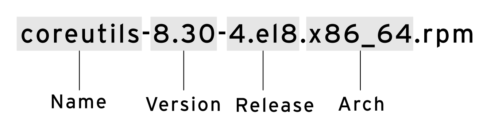
    -   **NAME** is one or more words describing the contents (`coreutils`).
    -   **VERSION** is the version number of the original software (`8.30`).
    -   **RELEASE** is the release number of the package based on that version, and is set by the packager, who might not be the original software developer (`4.el8`).
    -   **ARCH** is the processor architecture the package was compiled to run on. `noarch` indicates that this package's contents are not architecture-specific (as opposed to `x86_64` for **64-bit**, `aarch64` for **64-bit ARM**, and so on).
-   Only the package name is required for installing packages from repositories. If multiple versions exist, the package with the higher version number is installed. If multiple releases of a single version exist, the package with the higher release number is installed.
-   Each RPM package is a special archive made up of three components :

    -   The files installed by the package.
    -   Information about the package (metadata), such as the name, version, release, and arch; a summary and description of the package; whether it requires other packages to be installed; licensing; a package change log; and other details.
    -   Scripts that may run when this package is installed, updated, or removed, or are triggered when other packages are installed, updated, or removed.
        <br>

-   Typically, software providers digitally sign RPM packages using GPG keys (Red Hat digitally signs all packages it releases). The RPM system verifies package integrity by confirming that the package was signed by the appropriate GPG key. The RPM system refuses to install a package if the GPG signature does not match.

##### Updating Software with RPM Packages

-   Red Hat generates a complete RPM package to update software. An administrator installing that package gets only the most recent version of the package. Red Hat does not require that older packages be installed and then patched. To update software, RPM removes the older version of the package and installs the new version. Updates usually retain configuration files, but the packager of the new version defines the exact behavior.
    <br>

-   In most cases, only one version or release of a package may be installed at a time. However, if a package is built so that there are no conflicting file names, then multiple versions may be installed. The most important example of this is the kernel package. Since a new kernel can only be tested by booting to that kernel, the package is specifically designed so that multiple versions may be installed at once. If the new kernel fails to boot, the old kernel is still available and bootable.

#### Examining RPM Packages

-   The **rpm** utility is a low-level tool that can get information about the contents of package files and installed packages. By default, it gets information from the local database of installed packages. However, we can use the `-p` option to specify that we want to get information about a downloaded package file. We might want to do this in order to inspect the contents of the package file before installing it.
    <br>

-   The general form of query is :
    -   `$ rpm -q [select-options] [query-options]`
    -   Summary of RPM Query Commands :
        | Command | Task | Example |
        | ------------------------------------------------- | ------------------------------------------------------------------------------ | ------------------------------------------------------------ |
        | `$ rpm -qa` | List all RPM packages currently installed | `$ rpm -qa` |
        | `$ rpm -qa --last` | Display list of all recently installed RPMs | `$ rpm -qa --last` |
        | `rpm -q {name}` | Display the version of {name} installed on the system | `rpm -q yum`
        | `$ rpm -qi {package}` | Display detailed information about a package | `$ rpm -qi mozilla-mail` |
        | `rpm -ql {name}` | List all files included in the package {name} | `rpm -ql yum`
        | `$ rpm -qf {/path/to/file}` | Find out what package a file belongs to, i.e., find what package owns the file | `$ rpm -qf /etc/passwd` |
        | `$ rpm -qc {package-name} ` | Display list of configuration file(s) for a package | `$ rpm -qc httpd` |
        | `$ rpm -qcf {/path/to/file}` | Display list of configuration files for a command | `$ rpm -qcf /usr/X11R6/bin/xeyes` |
        | `rpm -qd {name}` | List documentation files included in a package | `rpm -qd yum`
        | `rpm -q --changelog {name}` | Show a short summary of the reason for a new package release | `rpm -q --changelog yum`
        | `rpm -q --scripts {name}` | Display the shell scripts run on package installation, upgrade, or removal
        | `$ rpm -qpR {.rpm-file}`<br>`$ rpm -qR {package}` | Find out what dependencies a rpm file has | `$ rpm -qpR mediawiki-1.4rc1-4.i586.rpm`<br>`$ rpm -qR bash` |
-   Installed packages can be queried directly with the `rpm` command. Add the `-p` option to query a package file before installation.

#### Installing RPM Packages

-   The `rpm` command can also be used to install an RPM package that we have downloaded to our local directory.<br>
    `$ rpm -ivh wonderwidgets-1.0.4.x86_64.rpm`
    -   **Warning**
        -   Be careful when installing packages from third parties, not just because of the software that they may install, but because the RPM package may include arbitrary scripts that run as the root user as part of the installation process.
    -   **Note**
        -   We can **extract files from an RPM package file without installing the package**. The `rpm2cpio` utility can pass the contents of the RPM to a special archiving tool called `cpio`, which can extract all files or individual files.
            <br>
    -   Pipe the output of `rpm2cpio PACKAGEFILE.rpm` into `cpio -id`, to extract all files stored in the RPM package. Subdirectory trees are created as needed, relative to the current working directory.<br>
        `$ rpm2cpio wonderwidgets-1.0-4.x86_64.rpm | cpio -id`<br>
    -   Individual files are extracted by specifying the path of the file:<br>
        `$ rpm2cpio wonderwidgets-1.0-4.x86_64.rpm | cpio -id "*txt"`
    -   Use the `rpm2cpio and cpio -tv` commands to list the files in the `rhcsa-script-1.0.0-1.noarch.rpm` package.<b>
        `$ rpm2cpio rhcsa-script-1.0.0-1.noarch.rpm | cpio -tv`

### Installing and Updating Software Packages with Yum

-   The low-level `rpm` command can be used to install packages, but it is not designed to work with package repositories or resolve dependencies from multiple sources automatically.
-   **Yum** is designed to be a better system for managing RPM-based software installation and updates. The `yum` command allows us to install, update, remove, and get information about software packages and their dependencies. We can get a history of transactions performed and work with multiple Red Hat and third-party software repositories.
    | Command | Description |
    | -------------------------------------------- | ------------------------------------------ |
    | `$ yum list` | displays installed and available packages
    | `$ yum search PACKAGE` | search from available repositories |
    | `$ yum info PACKAGE` | returns detailed information about a package, including the disk space needed for installation
    | `$ yum provides PATHNAME` | displays packages that match the path name specified
    | `$ yum install PACKAGE` | obtains and installs a software package, including any dependencies
    | `$ yum update PACKAGE` | obtains and installs a newer version of the specified package, including any dependencies |
    | `$ yum update` | update all packages |
    | `$ yum reinstall PACKAGE` | reinstalls the specified package
    | `$ yum remove package` | removes the specified package
    | `$ yum grouplist` | List all available Group Packages |
    | `yum group install "GROUPNAME"` | Installs all the packages in a group |
    | `$ yum repolist` | List enabled yum repositories |
    | `$ yum --enablerepo=epel install phpmyadmin` | Install a package from Specific repository |
    | `$ yum clean all` | Clean yum cache |
    | `$ yum history` | View history of yum |

### Enabling Yum Software Repositories

#### Enabling Red Hat software repositories

-   Registering a system to the subscription management service automatically configures access to software repositories based on the attached subscriptions. To view all available repositories : <br> `$ yum repolist all`
-   The `yum config-manager` command can be used to enable or disable repositories.
-   To **enable a repository**, the command sets the enabled parameter to 1. For example, the following command enables the `rhel-8-server-debug-rpms` repository : <br> `$ yum config-manager --enable rhel-8-server-debug-rpms`
    <br>
-   Non-Red Hat sources provide software through third-party repositories, which can be accessed by the `yum` command from a website, FTP server, or the local file system. For example, Adobe provides some of its software for Linux through a Yum repository.
    <br>
-   To enable support for a new third-party repository, create a file in the `/etc/yum.repos.d/` directory. Repository configuration files must end with a `.repo` extension. The repository definition contains the URL of the repository, a name, whether to use GPG to check the package signatures, and if so, the URL pointing to the trusted GPG key.

#### Creating Yum Repositories

-   Create Yum repositories with the `yum config-manager` command. The following command creates a file named `/etc/yum.repos.d/dl.fedoraproject.org_pub_epel_8_Everything_x86_64_.repo` with the output shown.

    ```
    $ yum config-manager \
    --add-repo="https://dl.fedoraproject.org/pub/epel/8/Everythin/x86_64/"

    [dl.fedoraproject.org_pub_epel_8_Everything_x86_64_]
    name=created by yum config-manager from https://dl.fedoraproject.org/pub/epel/8/Everything/x86_64/
    baseurl=https://dl.fedoraproject.org/pub/epel/8/Everything/x86_64/
    enabled=1
    ```

-   Modify this file to provide customized values and location of a GPG key. Keys are stored in various locations on the remote repository site, such as, `http://dl.fedoraproject.org/pub/epel/RPM-GPG-KEY-EPEL-8`. Administrators should download the key to a local file rather than allowing yum to retrieve the key from an external source. For example :

```
[EPEL]
name=EPEL 8
baseurl=https://dl.fedoraproject.org/pub/epel/8/Everything/x86_64/
enabled=1
gpgcheck=1
gpgkey=file:///etc/pki/rpm-gpg/RPM-GPG-KEY-EPEL-8
```

#### RPM Configuration Packages for Local Repositories

-   Some repositories provide a configuration file and GPG public key as part of an RPM package that can be downloaded and installed using the `yum localinstall` command. For example, the volunteer project called **Extra Packages for Enterprise Linux (EPEL)** provides software not supported by Red Hat but compatible with Red Hat Enterprise Linux.
    <br>
-   The following command installs the **Red Hat Enterprise Linux 8 EPEL** repository package :
    ```
    $ rpm --import \
    http://dl.fedoraproject.org/pub/epel/RPM-GPG-KEY-EPEL-8
    $ yum install \
    https://dl.fedoraproject.org/pub/epel/epel-release-latest-8.noarch.rpm
    ```
-   Configuration files often list multiple repository references in a single file. Each repository reference begins with a single-word name in square brackets.

    ```
    $ cat /etc/yum.repos.d/epel.repo
    [epel]
    name=Extra Packages for Enterprise Linux $releasever - $basearch
    #baseurl=https://download.fedoraproject.org/pub/epel/$releasever/Everything/$basearch
    metalink=https://mirrors.fedoraproject.org/metalink?repo=epel-$releasever&arch=$basearch&infra=$infra&content=$contentdir
    enabled=1
    gpgcheck=1
    gpgkey=file:///etc/pki/rpm-gpg/RPM-GPG-KEY-EPEL-8

    [epel-debuginfo]
    name=Extra Packages for Enterprise Linux $releasever - $basearch - Debug
    #baseurl=https://download.fedoraproject.org/pub/epel/$releasever/Everything/$basearch/debug
    metalink=https://mirrors.fedoraproject.org/metalink?repo=epel-debug-$releasever&arch=$basearch&infra=$infra&content=$contentdir
    enabled=0
    gpgkey=file:///etc/pki/rpm-gpg/RPM-GPG-KEY-EPEL-8
    gpgcheck=1

    [epel-source]
    name=Extra Packages for Enterprise Linux $releasever - $basearch - Source
    #baseurl=https://download.fedoraproject.org/pub/epel/$releasever/Everything/SRPMS
    metalink=https://mirrors.fedoraproject.org/metalink?repo=epel-source-$releasever&arch=$basearch&infra=$infra&content=$contentdir
    enabled=0
    gpgkey=file:///etc/pki/rpm-gpg/RPM-GPG-KEY-EPEL-8
    gpgcheck=1
    ```

-   To define a repository, but not search it by default, insert the `enabled=0` parameter.
-   Repositories can be enabled and **disabled persistently** with `yum config-manager` command or **temporarily** with `yum` command options, `--enablerepo=PATTERN` and `--disablerepo=PATTERN`.
    <br>
-   **Warning**
    -   Install the RPM GPG key before installing signed packages. This verifies that the packages belong to a key which has been imported. Otherwise, the `yum` command fails due to a missing key. The `--nogpgcheck` option can be used to ignore missing GPG keys, but this could cause forged or insecure packages to be installed on the system, potentially compromising its security.

### Managing Package Module Streams

#### Introduction to Application Stream

-   Red Hat Enterprise Linux 8.0 introduces the concept of **Application Streams**. Multiple versions of user space components shipped with the distribution are now delivered at the same time. They may be updated more frequently than the core operating system packages. This provides us with greater flexibility to customize Red Hat Enterprise Linux without impacting the underlying stability of the platform or specific deployments.
    <br>

-   Traditionally, managing alternate versions of an application's software package and its related packages meant maintaining different repositories for each different version. For developers who wanted the latest version of an application and administrators who wanted the most stable version of the application, this created a situation that was tedious to manage. This process is simplified in Red Hat Enterprise Linux 8 using a new technology called **Modularity**. **Modularity** allows a single repository to host multiple versions of an application's package and its dependencies.
-   Red Hat Enterprise Linux 8 content is distributed through two main software repositories: **BaseOS** and **Application Stream (AppStream)**.

##### BaseOS

-   The **BaseOS** repository provides the core operating system content for Red Hat Enterprise Linux as RPM packages. BaseOS components have a life cycle identical to that of content in previous Red Hat Enterprise Linux releases.

##### Application Stream

-   The **Application Stream** repository provides content with varying life cycles as both modules and traditional packages. Application Stream contains necessary parts of the system, as well as a wide range of applications previously available as a part of Red Hat Software Collections and other products and programs.
-   **Important**

    -   Both BaseOS and AppStream are a necessary part of a Red Hat Enterprise Linux 8 system.
        <br>

-   The **Application Stream** repository contains two types of content: **Modules** and **traditional RPM packages**.
    -   A **module** describes a set of RPM packages that belong together.
    -   Modules can contain several streams to make multiple versions of applications available for installation.
    -   Enabling a module stream gives the system access to the RPM packages within that module stream.

#### Modules

-   A **module** is a set of RPM packages that are a consistent set that belong together. Typically, this is organized around a specific version of a software application or programming language. A typical module can contain packages with an application, packages with the application’s specific dependency libraries, packages with documentation for the application, and packages with helper utilities.

##### Module Streams

-   Each module can have one or more module **streams**, which hold different versions of the content. Each of the streams receives updates independently. Think of the module stream as a virtual repository in the Application Stream physical repository.
    <br>

-   For each module, only one of its streams can be enabled and provide its packages.

##### Module Profiles

-   Each module can have one or more **profiles**. A **profile** is a list of certain packages to be installed together for a particular use-case such as for a server, client, development, minimal install, or other.
    <br>

-   Installing a particular module profile simply installs a particular set of packages from the module stream. You can subsequently install or uninstall packages normally. If you do not specify a profile, the module will install its default profile.

#### Managing modules using Yum

-   Yum version 4, new in Red Hat Enterprise Linux 8, adds support for the new modular features of Application Stream.
-   For handling the modular content, the `yum module` command has been added. Otherwise, yum works with modules much like does with regular packages.

##### Listing Modules

-   To display a list of available modules, use `$ yum module list` :
    ```
    $ yum module list
    Red Hat Enterprise Linux 8 for x86_64 - AppStream (RPMs)
    Name                    Stream        Profiles   Summary
    389-ds                  1.4           default    389 Directory Server (base)
    ant                     1.10 [d]      common [d] Java build tool
    container-tools         1.0 [d]       common [d] Common tools and dependencies for container runtimes
    ...output omitted...
    Hint: [d]efault, [e]nabled, [x]disabled, [i]nstalled
    ```
-   **Note**
    -   Use the Hint at the end of the output to help determine which streams and profiles are enabled, disabled, installed, as well as which ones are the defaults.
        <br>
-   To list the module streams for a specific module and retrieve their status :
    ```
    $ yum module list perl
    Red Hat Enterprise Linux 8 for x86_64 - AppStream (RPMs)
    Name  Stream       Profiles             Summary
    perl  5.24         common [d], minimal  Practical Extraction and Report Language
    perl  5.26 [d]     common [d], minimal  Practical Extraction and Report Language
    ```
    -   To display details of a module :
        ```
        $ yum module info perl
        Name             : perl
        Stream           : 5.24
        Version          : 820190207164249
        Context          : ee766497
        Profiles         : common [d], minimal
        Default profiles : common
        Repo             : rhel-8-for-x86_64-appstream-rpms
        Summary          : Practical Extraction and Report Language
        ...output omitted...
        Artifacts        : perl-4:5.24.4-403.module+el8+2770+c759b41a.x86_64
                        : perl-Algorithm-Diff-0:1.1903-9.module+el8+2464+d274aed1.noarch
                        : perl-Archive-Tar-0:2.30-1.module+el8+2464+d274aed1.noarch
        ...output omitted...
        ```
-   **Note**
    -   Without specifying a module stream, `yum module info` shows list of packages installed by default profile of a module using the default stream. Use the `module-name:stream` format to view a specific module stream. Add the `--profile` option to display information about packages installed by each of the module's profiles. For example :
        ```
        $ yum module info --profile perl:5.24
        ```

##### Enabling Module Streams and Installing Modules

-   Module streams must be enabled in order to install their module.
-   To simplify this process, when a module is installed it enables its module stream if necessary.
-   Module streams can be enabled manually using `yum module enable` and providing the name of the module stream.
-   **Important**

    -   Only one module stream may be enabled for a given module. Enabling an additional module stream will disable the original module stream.
        <br>

-   Install a module using the default stream and profiles :
    ```
    $ sudo yum module install perl
    Dependencies resolved.
    ================================================================================
    Package         Arch   Version      Repository                            Size
    ================================================================================
    Installing group/module packages:
    perl            x86_64 4:5.26.3-416.el8
                                        rhel-8-for-x86_64-appstream-htb-rpms  72 k
    Installing dependencies:
    ...output omitted...
    Running transaction
    Preparing        :                                                        1/1
    Installing       : perl-Exporter-5.72-396.el8.noarch                    1/155
    Installing       : perl-Carp-1.42-396.el8.noarch                        2/155
    ...output omitted...
    Installed:
    perl-4:5.26.3-416.el8.x86_64
    perl-Encode-Locale-1.05-9.el8.noarch
    ...output omitted...
    Complete!
    ```
-   **Note**

    -   The same results could have been accomplished by running `yum install @perl`. The `@` notation informs yum that the argument is a module name instead of a package name.
        <br>

-   To verify the status of the module stream and the installed profile :

    ```
    $ yum module-list perl
    Red Hat Enterprise Linux 8 for x86_64 - AppStream (RPMs)
    Name  Stream       Profiles             Summary
    perl  5.24         common, minimal      Practical Extraction and Report Language
    perl  5.26 [d][e]  common [i], minimal  Practical Extraction and Report Language

    Hint: [d]efault, [e]nabled, [x]disabled, [i]nstalled
    ```

#### Removing Modules and Disabling Module Streams

-   Removing a module removes all of the packages installed by profiles of the currently enabled module stream, and any further packages and modules that depend on these.
-   Packages installed from this module stream not listed in any of its profiles remain installed on the system and can be removed manually.
-   **Warning**

    -   Removing modules and switching module streams can be a bit tricky. Switching the stream enabled for a module is equivalent to resetting the current stream and enabling the new stream. It does not automatically change any installed packages. We have to do that manually.
    -   Directly installing a module stream that is different than the one that is currently installed is not recommended, because upgrade scripts might run during the installation that would break things with the original module stream. That could lead to data loss or other configuration issues.
    -   Proceed with caution.
        <br>

-   To remove an installed module :
    ```
    $ sudo yum module remove perl
    Dependencies resolved.
    ================================================================================
    Package                        ArchVersion            Repository                            Size
    ================================================================================
    Removing:
    perl                           x86_644:5.26.3-416.el8   @rhel-8.0-for-x86_64-appstream-rpms 0
    Removing unused dependencies:
    ...output omitted...
    Running transaction
    Preparing        :                                                        1/1
    Erasing          : perl-4:5.26.3-416.el8.x86_64                         1/155
    Erasing          : perl-CPAN-2.18-397.el8.noarch                        2/155
    ...output omitted...
    Removed:
    perl-4:5.26.3-416.el8.x86_64
    dwz-0.12-9.el8.x86_64
    ...output omitted...
    Complete!
    ```
-   After the module is removed, the module stream is still enabled. To verify the module stream is still enabled :

    ```
    $ yum module list perl
    Red Hat Enterprise Linux 8 for x86_64 - AppStream (RPMs)
    Name  Stream       Profiles             Summary
    perl  5.24         common [d], minimal  Practical Extraction and Report Language
    perl  5.26 [d][e]   common [d], minimal  Practical Extraction and Report Language

    Hint: [d]efault, [e]nabled, [x]disabled, [i]nstalled
    ```

-   To disable the module stream :
    ```
    $ sudo yum module disable perl
      ...output omitted...
    Dependencies resolved.
    =================================================================================
    Package           Arch             Version              Repository         Size
    =================================================================================
    Disabling module streams:
    perl                               5.26
    Is this ok [y/N]: y
    Complete!
    ```

##### Switching Module Streams

-   Switching module streams generally requires upgrading or downgrading the content to a different version.
-   To ensure a clean switch, we should remove the modules provided by the module stream first. That will remove all the packages installed by the profiles of the module, and any modules and packages that those packages have dependencies on.
-   To list the packages installed from the module, in the example below the `postgresql:9.6` module is installed :
    ```
    $ sudo yum module info postgresql | grep module_el8 | \
    sed 's/.*: //g;s/\n/ /g' | xargs yum list installed
    Installed Packages
    postgresql.x86_64          9.6.10-1.module+el8+2470+d1bafa0e   @rhel-8.0-for-x86_64-appstream-rpms
    postgresql-server.x86_64   9.6.10-1.module+el8+2470+d1bafa0e   @rhel-8.0-for-x86_64-appstream-rpms
    ```
-   Remove the packages listed from the previous command. Mark the module profiles to be uninstalled.
    ```
    $ sudo yum module remove postgresql
    ...output omitted...
    Is this ok [y/N]: y
    ...output omitted...
    Removed:
    postgresql-server-9.6.10-1.module+el8+2470+d1bafa0e.x86_64   libpq-10.5-1.el8.x86_64  postgresql-9.6.10-1.module+el8+2470+d1bafa0e.x86_64
    Complete
    ```
-   After removing the module profiles reset the module stream. Use the `yum module reset` command to reset the module stream.

    ```
    $ sudo yum module reset postgresql
    =================================================================
    Package       Arch             Version     Repository      Size
    =================================================================
    Resetting module streams:
    postgresql                      9.6

    Transaction Summary
    =================================================================

    Is this ok [y/N]: y
    Complete!
    ```

-   To enable different module stream and install the module :
    `$ sudo yum module install postgresql:10`
    <br>

-   The new module stream will be enabled and the current stream disabled. It may be necessary to update or downgrade packages from the previous module stream that are not listed in the new profile. Use the `$ yum distro-sync` to perform this task if required. There may also be packages that remain installed from the previous module stream. Remove those using `yum remove`.

## Accessing Linux File Systems

### Identifying File Systems and Devices

#### Storage Management Concepts

-   Files on a Linux server are accessed through the file-system hierarchy, a single inverted tree of directories. This file system hierarchy is assembled from file systems provided by the storage devices available to your system. Each file system is a storage device that has been formatted to store files.
    <br>

-   In a sense, the Linux file-system hierarchy presents a collection of file systems on separate storage devices as if it were one set of files on one giant storage device that you can navigate. Much of the time, we do not need to know which storage device a particular file is on, we just need to know the directory that file is in.
    <br>

-   Sometimes, however, it can be important. We might need to determine how full a storage device is and what directories in the file-system hierarchy are affected. There might be errors in the logs from a storage device, and we need to know what file systems are at risk. We could just want to create a hard link between two files, and we need to know if they are on the same file system to determine if it is possible.

##### Files Systems and Mount Points

-   To make the contents of a file system available in the file-system hierarchy, it must be mounted on an empty directory. This directory is called a **mount point**. Once mounted, if we use `ls` to list that directory, we will see the contents of the mounted file system, and we can access and use those files normally. Many file systems are automatically mounted as part of the boot process.
    <br>

-   If we have only worked with Microsoft Windows drive letters, this is a fundamentally different concept. It is somewhat similar to the NTFS mounted folders feature.

##### File Systems, Storage, and Block Devices

-   Low-level access to storage devices in Linux is provided by a special type of file called a **block device**. These block devices must be formatted with a file system before they can be mounted.
    <br>

-   Block device files are stored in the `/dev` directory, along with other device files. Device files are created automatically by the operating system. In Red Hat Enterprise Linux, the first **SATA/PATA**, **SAS**, **SCSI**, or **USB hard drive** detected is called `/dev/sda`, the second is `/dev/sdb`, and so on. These names represent the entire hard drive.
    <br>

-   Other types of storage will have other forms of naming.
    | Type of device | Device naming pattern
    | --- | ---
    | SATA/SAS/USB-attached storage | `/dev/sda, /dev/sdb ...`
    | `virtio-blk` paravirtualized storage (some virtual machines) | `/dev/vda, /dev/vdb ...`
    | NVMe-attached storage (many SSDs) | `/dev/nvme0, /dev/nvme1 ...`
    | SD/MMC/eMMC storage (SD cards) | `/dev/mmcblk0, /dev/mmcblk1 ...`

##### Disk Partitions

-   Normally, we do not make the entire storage device into one file system. Storage devices are typically divided up into smaller chunks called **partitions**.
    <br>

-   Partitions allow us to compartmentalize a disk : the various partitions can be formatted with different file systems or used for different purposes. For example, one partition can contain user home directories while another can contain system data and logs. If a user fills up the home directory partition with data, the system partition may still have space available.
    <br>

-   Partitions are block devices in their own right. On **SATA-attached storage**, the first partition on the first disk is `/dev/sda1`. The third partition on the second disk is `/dev/sdb3`, and so on. Paravirtualized storage devices have a similar naming system.
    <br>

-   An **NVMe-attached SSD** device names its partitions differently. In that case, the first partition on the first disk is `/dev/nvme0p1`. The third partition on the second disk is `/dev/nvme1p3`, and so on. SD or MMC cards have a similar naming system.
    <br>

-   A long listing of the /dev/sda1 device file on host reveals its special file type as b, which stands for block device :
    ```
    $ ls -l /dev/sda1
    brw-rw----. 1 root disk 8, 1 Feb 22 08:00 /dev/sda1
    ```

##### Logical Volumes

-   Another way of organizing disks and partitions is with **logical volume management (LVM)**. With LVM, one or more block devices can be aggregated into a storage pool called a **volume group**. Disk space in the volume group is then parceled out to one or more logical volumes, which are the functional equivalent of a partition residing on a physical disk.
    <br>

-   The LVM system assigns names to volume groups and logical volumes upon creation. LVM creates a directory in `/dev` that matches the group name and then creates a symbolic link within that new directory with the same name as the logical volume. That logical volume file is then available to be mounted. For example, if a volume group is called `myvg` and the logical volume within it is called `mylv`, then the full path name to the logical volume device file is `/dev/myvg/mylv`.
    <br>

-   **Note**
    -   The form of logical volume device name mentioned above is actually implemented as a symbolic link to the actual device file used to access it, which might vary between boots. There is another form of logical volume device name linked from files in `/dev/mapper` that are often used, and are also symbolic links to the actual device file.

#### Examining File Systems

-   To get an overview of local and remote file system devices and the amount of free space available, run the `df` command. When the `df` command is run without arguments, it reports **total disk space**, **used disk space**, **free disk space**, and the **percentage of the total disk space used on all mounted regular file systems**. It reports on both local and remote file systems.
    <br>

-   The following example displays the file systems and mount points on host.

    ```
    $ df
    Filesystem     1K-blocks    Used Available Use% Mounted on
    devtmpfs          912584       0    912584   0% /dev
    tmpfs             936516       0    936516   0% /dev/shm
    tmpfs             936516   16812    919704   2% /run
    tmpfs             936516       0    936516   0% /sys/fs/cgroup
    /dev/vda3        8377344 1411332   6966012  17% /
    /dev/vda1        1038336  169896    868440  17% /boot
    tmpfs             187300       0    187300   0% /run/user/1000
    ```

    <br>

-   The partitioning on the host system shows two physical file systems, which are mounted on `/` and `/boot`. This is common for virtual machines. The `tmpfs` and `devtmpfs` devices are file systems in system memory. **All files written into `tmpfs` or `devtmpfs` disappear after system reboot.**
    <br>

-   To improve readability of the output sizes, there are two different human-readable options: `-h` or `-H`. The difference between these two options is that `-h` reports in KiB (210), MiB (220), or GiB (230), while the `-H` option reports in SI units: KB (103), MB (106), or GB (109). Hard drive manufacturers usually use SI units when advertising their products.
    <br>

-   Show a report on the file systems on the host system with all units converted to human-readable format :

    ```
    $ df
    Filesystem      Size  Used Avail Use% Mounted on
    devtmpfs        892M     0  892M   0% /dev
    tmpfs           915M     0  915M   0% /dev/shm
    tmpfs           915M   17M  899M   2% /run
    tmpfs           915M     0  915M   0% /sys/fs/cgroup
    /dev/vda3       8.0G  1.4G  6.7G  17% /
    /dev/vda1      1014M  166M  849M  17% /boot
    tmpfs           183M     0  183M   0% /run/user/1000
    ```

    <br>

-   For more detailed information about space used by a certain directory tree, use the `du` command. The `du` command has `-h` and `-H` options to convert the output to human-readable format. The du command shows the size of all files in the current directory tree recursively.

-   Show a disk usage report in human-readable format for the `/var/log` directory on host :
    ```
    $ du -h /var/log
    ...output omitted...
    176K  /usr/share/smartmontools
    184K  /usr/share/nano
    8.0K  /usr/share/cmake/bash-completion
    8.0K  /usr/share/cmake
    369M  /usr/share
    ```

### Mounting and Unmounting File Systems

#### Mounting File Systems Manually

-   A file system residing on a removable storage device needs to be mounted in order to access it. The `mount` command allows the root user to manually mount a file system. The first argument of the mount command specifies the file system to mount. The second argument specifies the directory to use as the mount point in the file-system hierarchy.
    <br>

-   There are two common ways to specify the file system on a disk partition to the `mount` command :

    -   With the **name of the device file** in `/dev` containing the file system.
    -   With the **UUID** written to the file system, a **universally-unique identifier**.
        <br>

-   Mounting a device is relatively simple. We need to identify the device we want to mount, make sure the mount point exists, and mount the device on the mount point.

##### Identifying the Block Device

-   A hot-pluggable storage device, whether a hard disk drive (HDD) or solid-state device (SSD) in a server caddy, or a USB storage device, might be plugged into a different port each time they are attached to a system.
    <br>

-   Use the `lsblk` command to list the details of a specified block device or all the available devices.
    ```
    $ lsblk
    NAME                      MAJ:MIN RM  SIZE RO TYPE MOUNTPOINT
    vda                       253:0    0   12G  0 disk
    ├─vda1                    253:1    0    1G  0 part /boot
    ├─vda2                    253:2    0    1G  0 part [SWAP]
    └─vda3                    253:3    0   11G  0 part /
    vdb                       253:16   0   64G  0 disk
    └─vdb1                    253:17   0   64G  0 part
    ```
    If we know that we just added a 64 GB storage device with one partition, then we can guess from the preceding output that `/dev/vdb1` is the partition that we want to mount.

##### Mounting by Block Device Name

-   The following example mounts the file system in the `/dev/vdb1` partition on the directory `/mnt/data`. <br> `$ mount /dev/vdb1 /mnt/data`
    <br>

-   To mount a file system, the destination directory must already exist. The `/mnt` directory exists by default and is intended for use as a temporary mount point.
    <br>

-   We can use `/mnt` directory, or better yet create a subdirectory of `/mnt` to use as a temporary mount point, unless we have a good reason to mount it in a specific location in the file-system hierarchy.
    <br>

-   **Important**

    -   If the directory acting as mount point is not empty, any files copied to that directory before the file system was mounted are not accessible until the file system is unmounted again.
        <br>

-   This approach works fine in the short run. However, the order in which the operating system detects disks can change if devices are added to or removed from the system. This will change the device name associated with that storage device. A better approach would be to mount by some characteristic built into the file system.

##### Mounting by File-system UUID

-   One stable identifier that is associated with a file system is its **UUID**, a very long hexadecimal number that acts as a **universally-unique identifier**. This UUID is part of the file system and remains the same as long as the file system is not recreated.
    <br>

-   The `lsblk -fp` command lists the full path of the device, along with the UUIDs and mount points, as well as the type of file system in the partition. If the file system is not mounted, the mount point will be blank.
    ```
    $ lsblk -fp
    NAME        FSTYPE LABEL UUID                                 MOUNTPOINT
    /dev/vda
    ├─/dev/vda1 xfs          23ea8803-a396-494a-8e95-1538a53b821c /boot
    ├─/dev/vda2 swap         cdf61ded-534c-4bd6-b458-cab18b1a72ea [SWAP]
    └─/dev/vda3 xfs          44330f15-2f9d-4745-ae2e-20844f22762d /
    /dev/vdb
    └─/dev/vdb1 xfs          46f543fd-78c9-4526-a857-244811be2d88
    ```
-   Mount the file system by the UUID of the file system.<br> `$ mount UUID="46f543fd-78c9-4526-a857-244811be2d88" /mnt/data`

#### Automatic Mounting of Removable Storage Devices

-   If we are logged in and using the graphical desktop environment, it will automatically mount any removable storage media when it is inserted.
    <br>

-   The removable storage device is mounted at `/run/media/USERNAME/LABEL` where `USERNAME` is the name of the user logged into the graphical environment and `LABEL` is an identifier, often the name given to the file system when it was created if one is available.
    <br>

-   Before removing the device, we should unmount it manually.

#### Unmounting File Systems

-   The shutdown and reboot procedures unmount all file systems automatically. As part of this process, any file system data cached in memory is flushed to the storage device thus ensuring that the file system suffers no data corruption.
    <br>

-   **Warning**

    -   File system data is often cached in memory. Therefore, in order to avoid corrupting data on the disk, it is essential that we unmount removable drives before unplugging them. The unmount procedure synchronizes data before releasing the drive, ensuring data integrity.
        <br>

-   To unmount a file system, the `umount` command expects the mount point as an argument. <br> `$ umount /mnt/data`
    Unmounting is not possible if the mounted file system is in use. For the `umount` command to succeed, all processes needs to stop accessing data under the mount point.
    <br>

-   The `lsof` command lists all open files and the process accessing them in the provided directory. It is useful to identify which processes currently prevent the file system from successful unmounting.
    ```
    $ lsof /mnt/data
    COMMAND  PID USER   FD   TYPE DEVICE SIZE/OFF NODE NAME
    bash    1593 root  cwd    DIR 253,17        6  128 /mnt/data
    lsof    2532 root  cwd    DIR 253,17       19  128 /mnt/data
    lsof    2533 root  cwd    DIR 253,17       19  128 /mnt/data
    ```
-   Once the processes are identified, an action can be taken, such as waiting for the process to complete or sending a `SIGTERM` or `SIGKILL` signal to the process. In this case, it is sufficient to change the current working directory to a directory outside the mount point.
    `$ cd $ umount /mnt/data`
    <br>

-   **Note**
    -   A common reason for file systems to fail to unmount is that a Bash shell is using the mount point or a subdirectory as a current working directory. Use the `cd` command to change out of the file system to resolve this problem.

### Locating Files on the System

#### Searching for Files

-   A system administrator needs tools to search for files matching certain criteria on the file system. Here we will discuss two commands that can search for files in the file-system hierarchy.
    -   The `locate` command searches a pregenerated index for file names or file paths and returns the results instantly.
    -   The `find` command searches for files in real time by crawling through the file-system hierarchy.

#### Locating Files by Name

-   The `locate` command finds files based on the name or path to the file. It is fast because it looks up this information from the `mlocate database`. However, this database is not updated in real time, and it must be frequently updated for results to be accurate. This also means that locate will not find files that have been created since the last update of the database.
    <br>

-   The `locate` database is automatically updated every day. However, at any time the root user can issue the `$ updatedb` command to force an immediate update.
    <br>

-   The `locate` command restricts results for unprivileged users. In order to see the resulting file name, the user must have search permission on the directory in which the file resides.
-   Search for files with `passwd` in the name or path in directory trees readable by user on host.
    ```
    $ locate passwd
    /etc/passwd
    /etc/passwd-
    /etc/pam.d/passwd
    /etc/security/opasswd
    /usr/bin/gpasswd
    /usr/bin/grub2-mkpasswd-pbkdf2
    /usr/bin/lppasswd
    /usr/bin/passwd
    ...output omitted...
    ```
-   Results are returned even when the file name or path is only a partial match to the search query.
    ```
    $ locate image
    /etc/selinux/targeted/contexts/virtual_image_context
    /usr/bin/grub2-mkimage
    /usr/lib/sysimage
    /usr/lib/dracut/dracut.conf.d/02-generic-image.conf
    /usr/lib/firewalld/services/ovirt-imageio.xml
    /usr/lib/grub/i386-pc/lnxboot.image
    ...output omitted...
    ```
-   The `-i` option performs a **case-insensitive** search. With this option, all possible combinations of upper and lowercase letters match the search.
    ```$
    locate -i messages
    ...output omitted...
    /usr/share/vim/vim80/lang/zh_TW/LC_MESSAGES
    /usr/share/vim/vim80/lang/zh_TW/LC_MESSAGES/vim.mo
    /usr/share/vim/vim80/lang/zh_TW.UTF-8/LC_MESSAGES
    /usr/share/vim/vim80/lang/zh_TW.UTF-8/LC_MESSAGES/vim.mo
    /usr/share/vim/vim80/syntax/messages.vim
    /usr/share/vim/vim80/syntax/msmessages.vim
    /var/log/messages
    ```
-   The `-n` option limits the number of returned search results by the locate command. The following example limits the search results returned by locate to the first five matches :
    ```$
    locate -n 5 snow.png
    /usr/share/icons/HighContrast/16x16/status/weather-snow.png
    /usr/share/icons/HighContrast/22x22/status/weather-snow.png
    /usr/share/icons/HighContrast/24x24/status/weather-snow.png
    /usr/share/icons/HighContrast/256x256/status/weather-snow.png
    /usr/share/icons/HighContrast/32x32/status/weather-snow.png
    ```

#### Searching for Files in Real Time

-   The `find` command locates files by performing a real-time search in the file-system hierarchy. It is slower than locate, but more accurate. It can also search for files based on criteria other than the file name, such as the permissions of the file, type of file, its size, or its modification time.
    <br>

-   The `find` command looks at files in the file system using the user account that executed the search. The user invoking the find command must have read and execute permission on a directory to examine its contents.
    <br>

-   The first argument to the `find` command is the **directory to search**. If the directory argument is omitted, find starts the search in the current directory and looks for matches in any subdirectory.
    <br>

-   To search for files by file name, use the `-name FILENAME` option. With this option, find returns the path to files matching `FILENAME` exactly. For example, to search for files named `sshd_config` starting from the `/` directory, run the following command :
    ```
    $ find / -name sshd_config
    /etc/ssh/sshd_config
    ```
-   **Note**

    -   With the `find` command, the **full word options use a single dash** and options follow the path name argument, unlike most other Linux commands.  
        <br>

-   Wildcards are available to search for a file name and return all results that are a partial match. When using wildcards, it is important to quote the file name to look for to prevent the terminal from interpreting the wildcard.

-   In the following example, search for files starting in the `/` directory that end in `.txt` :
    ```
    $ find / -name '*.txt'
    /etc/pki/nssdb/pkcs11.txt
    /etc/brltty/brl-lt-all.txt
    /etc/brltty/brl-mb-all.txt
    /etc/brltty/brl-md-all.txt
    /etc/brltty/brl-mn-all.txt
    ...output omitted...
    ```
-   To search for files in the `/etc/` directory that contain the word, pass, anywhere in their names on host, run the following command :
    ```
    $ find /etc -name '*pass*'
    /etc/security/opasswd
    /etc/pam.d/passwd
    /etc/pam.d/password-auth
    /etc/passwd-
    /etc/passwd
    /etc/authselect/password-auth
    ```
-   To perform a **case-insensitive** search for a given file name, use the `-iname` option, followed by the file name to search. To search files with case-insensitive text, messages, in their names in the `/` directory on host, run the following command :
    ```
    $ find / -iname '*messages*'
    ...output omitted...
    /usr/share/vim/vim80/lang/zh_CN.UTF-8/LC_MESSAGES
    /usr/share/vim/vim80/lang/zh_CN.cp936/LC_MESSAGES
    /usr/share/vim/vim80/lang/zh_TW/LC_MESSAGES
    /usr/share/vim/vim80/lang/zh_TW.UTF-8/LC_MESSAGES
    /usr/share/vim/vim80/syntax/messages.vim
    /usr/share/vim/vim80/syntax/msmessages.vim
    ```

##### Searching Files Based on Ownership or Permission

-   The `find` command can search for files based on their ownership or permissions. Useful options when searching by owner are `-user` and `-group`, which search by name, and `-uid` and `-gid`, which search by ID.

-   Search for files owned by **user** in the `/home/user` directory on host.
    ```
    $ find -user user
    .
    ./.bash_logout
    ./.bash_profile
    ./.bashrc
    ./.bash_history
    ```
-   Search for files owned by the **group user** in the `/home/user` directory on host.
    ```
    $ find -group user
    .
    ./.bash_logout
    ./.bash_profile
    ./.bashrc
    ./.bash_history
    ```
-   Search for files owned by **user ID 1000** in the `/home/user` directory on host.
    ```
    $ find -uid 1000
    .
    ./.bash_logout
    ./.bash_profile
    ./.bashrc
    ./.bash_history
    ```
-   Search for files owned by **group ID 1000** in the `/home/user` directory on host.
    ```
    $ find -gid 1000
    .
    ./.bash_logout
    ./.bash_profile
    ./.bashrc
    ./.bash_history
    ```
-   The `-user`, and `-group` options can be used together to search files where file owner and group owner are different. The example below list files that are both owned by **user root** and affiliated with **group mail**.
    ```
    $ find / -user root -group mail
    /var/spool/mail
    ...output omitted...
    ```
-   The `-perm` option is used to look for files with a **particular set of permissions**. Permissions can be described as octal values, with some combination of 4, 2, and 1 for read, write, and execute. Permissions can be preceded by a `/` or `-` sign.
    <br>

-   A numeric permission preceded by `/` matches files that have **at least one bit of user, group, or other for that permission set**. A file with permissions `r--r--r--` does not match `/222`, but one with `rw-r--r--` does. A `-` sign before a permission means that **all three instances of that bit must be on**, so neither of the previous examples would match, but something like `rw-rw-rw-`> would.
    <br>

-   To use a more complex example, the following command matches any file for which the **user has read, write, and execute permissions**, members of the **group have read and write permissions**, and **others have read-only access** : <br> `$ find /home -perm 764`
    <br>

-   To match files for which the **user has at least write and execute permissions**, and the **group has at least write permissions**, and **others have at least read access** : <br> 1`$find /hoe -perm -324`
    <br>
-   To match files for which the **user has read permissions, or the group has at least read permissions, or others have at least write access** : <br> `$ find /home -perm /442`
    <br>

-   When used with `/` or `-`, a value of `0` works like a wildcard, since it means a **permission of at least nothing**.
    <br>

-   To match any file in the `/home/user` directory for which **others have at least read access on host**, run :<br> `$ find -perm -004`
    <br>

-   Find all files in the `/home/user` directory where **other has write permissions on host**.<br>`$ find -perm -002`

#### Searching Files Based on Size

-   The `find` command can look up files that match a size specified with the `-size` option, followed by a numerical value and the unit. Use the following list as the units with the `-size` option :

    -   `k`, for **kilobyte**
    -   `M`, for **megabyte**
    -   `G`, for **gigabyte**

-   The example below shows how to search for files with a size of `10 megabytes`, rounded up.<br>`$ find -size 10M`
    <br>

-   To search the files with a size **more than 10 gigabytes**.<br>`$ find -size +10G`
    <br>

-   To list all files with a size **less than 10 kilobytes**.<br>`$ find -size -10k`
    <br>

-   **Important**
    -   The `-size` option unit modifiers round everything up to single units. For example, the `find -size 1M` command shows files smaller than 1 MB because it rounds all files up to 1 MB.

#### Searching Files Based on Modification Time

-   The `-mmin` option, followed by the time in minutes, searches for all files that had their content changed at `n` minutes ago in the past. The file's timestamp is always rounded down. It also supports fractional values when used with ranges (`+n` and `-n`).
    <br>

-   To find all files that had their file content changed **120 minutes ago** on host, run :<br>`$ find / -mmin 120`
    <br>

-   The `+` modifier in front of the amount of minutes looks for all files in the `/` that have been modified **more than `n` minutes ago**. In this example, files that were modified **more than 200 minutes ago** are listed.<br>`$ find / -mmin +200`
    <br>

-   The `-` modifier changes the search to look for all files in the `/` directory which have been changed **less than `n` minutes ago**. In this example, files that were modified **less than 150 minutes ago** are listed.<br>`$ find / -mmin -150`

#### Searching Files Based on File Type

-   The `-type` option in the `find` command limits the search scope to a given file type. Use the following list to pass the required flags to limit the scope of search :

    -   `f`, for **regular file**
    -   `d`, for **directory**
    -   `l`, for **soft link**
    -   `b`, for **block device**
        <br>

-   Search for all **directories** in the `/etc` directory on host.
    ```
    $ find /etc -type d
    /etc
    /etc/tmpfiles.d
    /etc/systemd
    /etc/systemd/system
    /etc/systemd/system/getty.target.wants
    ...output omitted...
    ```
-   Search for all **soft links** on host.<br>`$ find / -type l`
    <br>

-   Generate a list of all **block devices** in the `/dev` directory on host :

    ```
    $ find /dev -type b
    /dev/vda1
    /dev/vda
    ```

-   The `-links` option followed by a number looks for all files that have a certain **hard link count**. The number can be preceded by a `+` modifier to look for files with a count **higher than the given hard link count**. If the number is preceded with a `-` modifier, the search is limited to all files with a hard link count that is **less than** the given number.
    <br>

-   Search for all **regular files with more than one hard link** on host :<br>`$ find / -type f -links +1`

## Analyzing Servers and Getting Support in Red Hat Linux

### Analyzing and Managing Remote Servers

#### Describing the Web Console

-   Web Console is a web-based management interface for Red Hat Enterprise Linux 8 designed for managing and monitoring our servers. It is based on the open source **Cockpit** service.

-   We can use Web Console to monitor system logs and view graphs of system performance. Additionally, we can use our web browser to change settings using graphical tools in the Web Console interface, including a fully-functional interactive terminal session.

#### Enabling the Web Console

-   Red Hat Enterprise Linux 8 installs Web Console by default in all installation variants except a minimal installation. Use the following command to install Web Console : <br>`$ sudo yum install cockpit`
    <br>

-   Enable and start the `cockpit.socket` service, which runs a web server. This step is necessary if we need to connect to the system through the web interface.

    ```
    $ sudo systemctl enable --now cockpit.socket
    Created symlink /etc/systemd/system/sockets.target.wants/cockpit.socket -> /usr/lib/systemd/system/cockpit.socket.
    ```

-   If we are using a custom firewall profile, we need to add the cockpit service to `firewalld` to open `port 9090` in the firewall :
    ```
    $ sudo firewall-cmd --add-service=cockpit --permanent
    success
    $ sudo firewall-cmd --reload
    success
    ```

#### Logging into the Web Console

-   Web Console provides its own web server. Launch Firefox to log in to Web Console. We can log in with the user name and password of any local account on the system, including the root user.
    <br>

-   Open `https://servername:9090` in the web browser, where servername is the **host name** or **IP address** of our server. The connection will be protected by a TLS session. The system is installed with a self-signed TLS certificate by default, and when we initially connect our web browser will probably display a security warning. The `cockpit-ws(8) man` page provides instructions on how to replace the TLS certificate with one that is properly signed.
    <br>

-   Enter the user name and password at the login screen.
    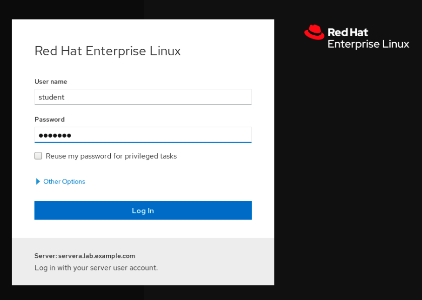
-   Optionally, click the **Reuse my password for privileged tasks** option. This permits us to execute commands with sudo privileges, allowing us to perform tasks such as modifying system information or configuring new accounts.
-   Click **Log In**.
-   Web Console displays the user name on the right side of the title bar. If we choose the **Reuse my password for privileged tasks** option, the Privileged icon displays to the left of the user name.
    
-   If we are logged in as a non-privileged user, the **Privileged** icon is not displayed.
    

#### Changing Passwords

-   Privileged and non-privileged users can change their own passwords while logged in to Web Console. Click **Accounts** on the navigation bar. Click our account label to open the account details page.
    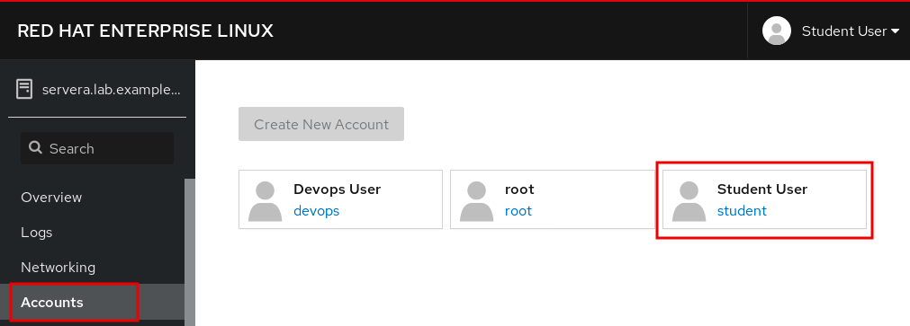
-   As a non-privileged user, we are restricted to setting or resetting our password and managing public SSH keys. To set or reset our password, click **Set Password**.
    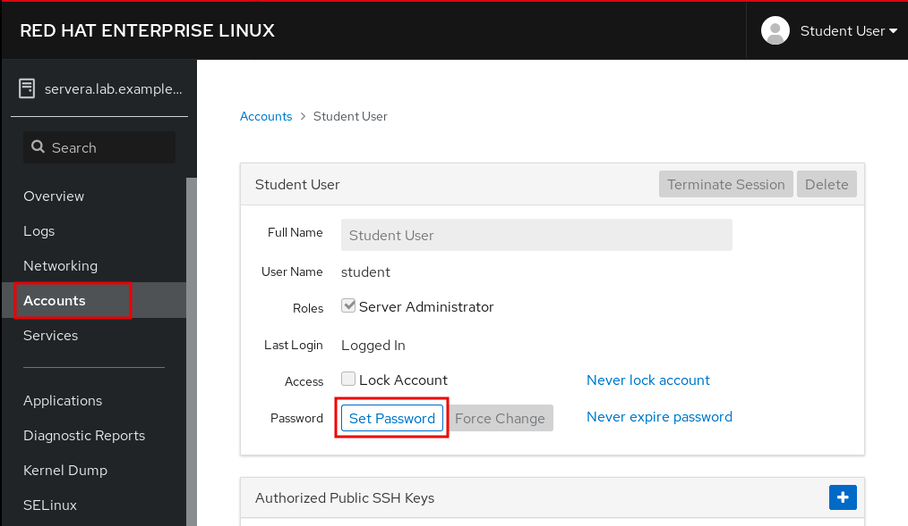
-   Enter our information in the **Old Password**, **New Password**, and **Confirm New Password** fields. Click **Set** to activate the new password.
    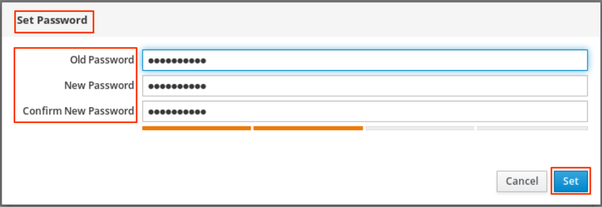

#### Troubleshooting with the Web Console

-   Web Console is a powerful troubleshooting tool. We can monitor basic system statistics in real time, inspect system logs, and quickly switch to a terminal session within Web Console to gather additional information from the command-line interface.

##### Monitoring System Statistics in Real Time

-   Click **Overview** on the navigation bar to view information about the system, such as its type of hardware, operating system, host name, and more. Notice that if we are logged in as a non-privileged user, we see all the information but we are not permitted to modify values. The following image displays part of the Overview page.
    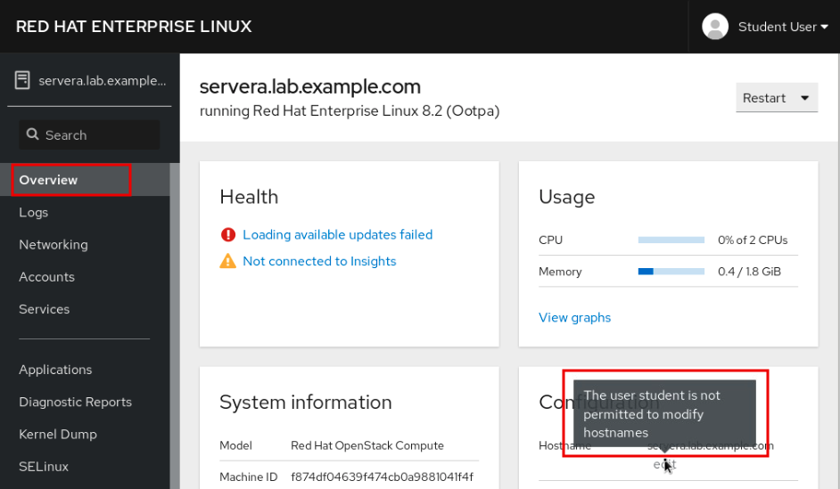
-   Click **View graphs** on the **Overview** page to view graphs of current system performance for CPU activity, memory use, disk I/O, and network utilization.
    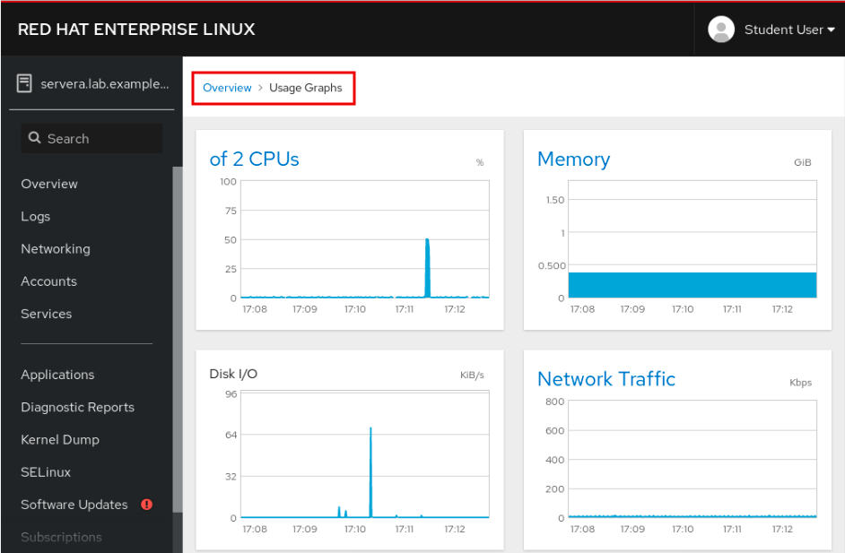

##### Inspecting and Filtering Syslog Events

-   **Logs** in the navigation bar provides access to analysis tools for the system logs. We can use the menus on the page to filter log messages based on a logging date range, severity level, or both. Web Console uses the current date as the default, but we can click the date menu and specify any range of dates. Similarly, the **Severity** menu provides options ranging from **Everything** to more specific severity conditions such as **Alert and above**, **Debug and above**, and so on.
    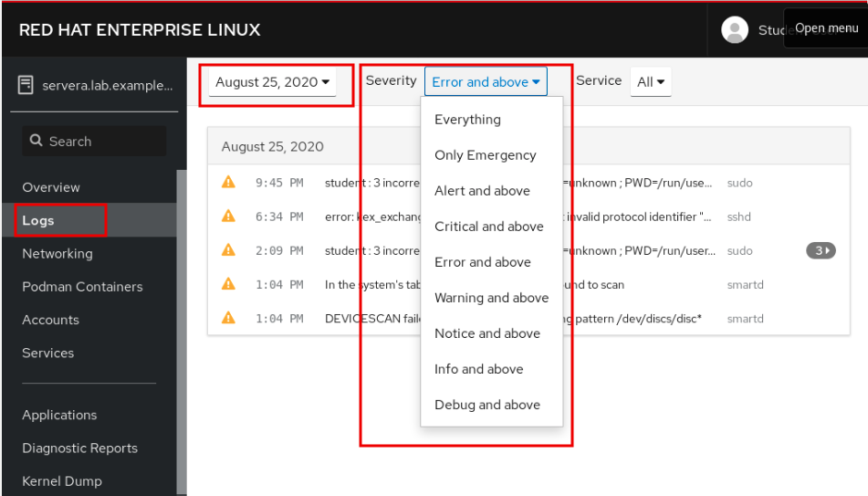
-   Click a row to view details of the log report. In the example below, note the first row that reports on a `sudo` log message.
    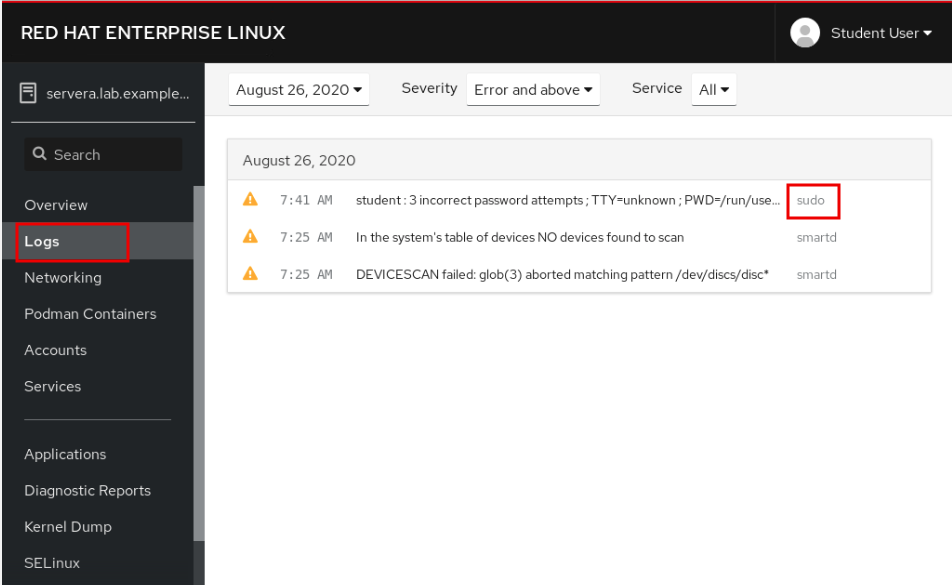
-   The example below shows the details displayed when we click the `sudo` row. Details of the report include the selected log entry (`sudo`), the date, time, priority, and syslog facility of the log entry, the host name of the system that reported the log message, and more.
    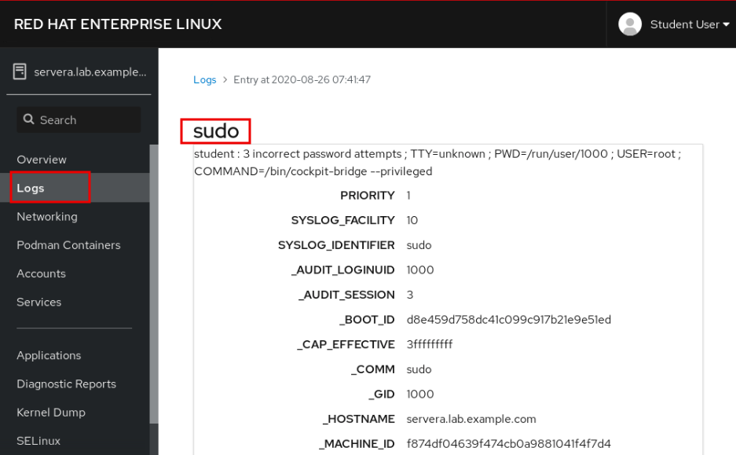

##### Running Commands from a Terminal Session

-   **Terminal** in the navigation bar provides access to a fully-functional terminal session within the Web Console interface. This allows us to run arbitrary commands to manage and work with the system and to perform tasks not supported by the other tools provided by Web Console.
    <br>

-   The following image displays examples of common commands used to gather additional information. Listing the contents of the `/var/log` directory provides reminders of log files that may have valuable information. The `id` command provides quick information such as group membership that may help troubleshoot file access restrictions. The `ps au` command provides a quick view of processes running in the terminal and the user associated with the process.
    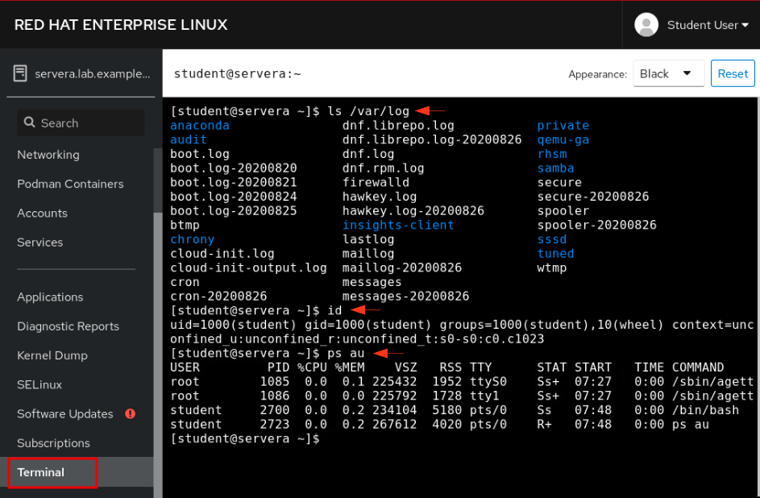

##### Creating Diagnostic Reports

-   A diagnostic report is a collection of configuration details, system information, and diagnostic information from a Red Hat Enterprise Linux system. Data collected in the completed report includes system logs and debug information that can be used to troubleshoot issues.
    <br>

-   Log in to Web Console as a privileged user. Click **Diagnostic Reports** on the navigation bar to open the page that creates these reports. Click **Create Report** to generate a new diagnostic report.
    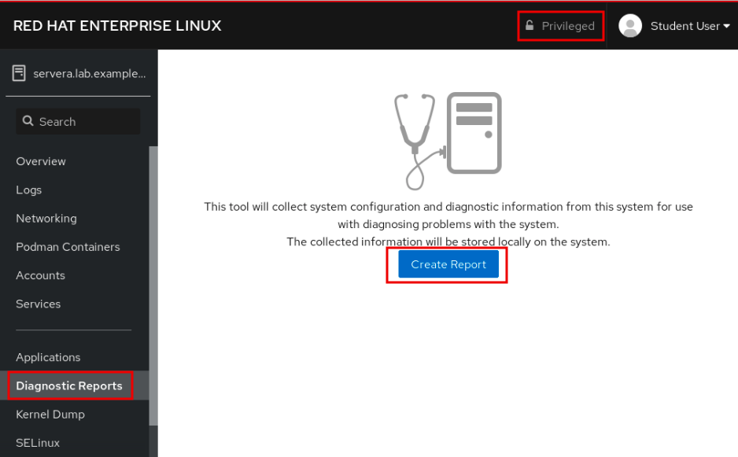
-   The interface displays **Done!** when the report is complete. Click **Download report** to save the report.
    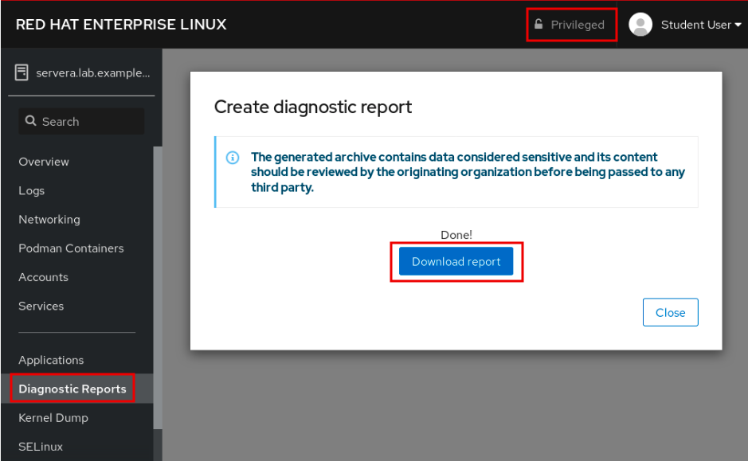
-   Click **Save File** to save the file and complete the process.
    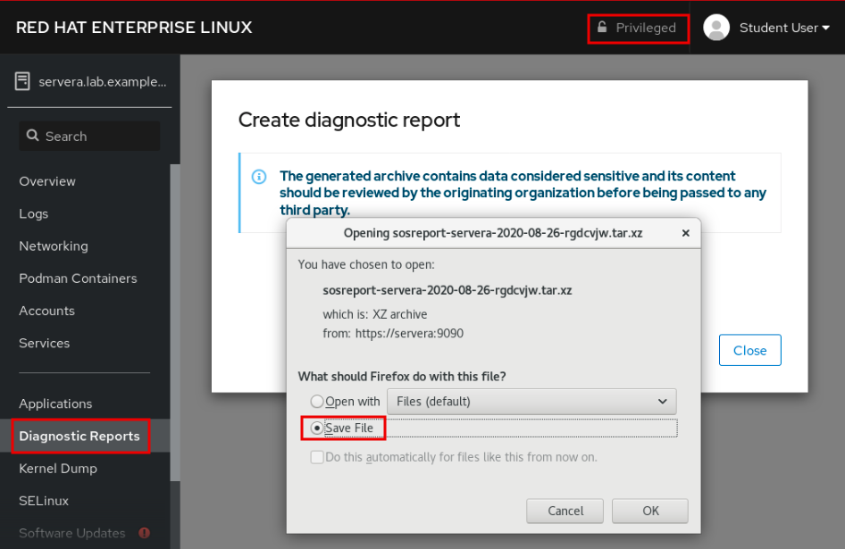
-   The completed report is saved to the `Downloads` directory on the system hosting the web browser used to access Web Console. In this example, the host is `workstation`.
    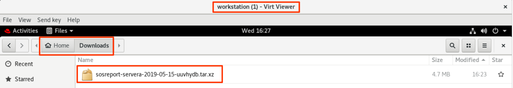

#### Managing System Services with the Web Console

-   As a privileged user in Web Console, we can stop, start, enable, and restart system services. Additionally, we can configure network interfaces, configure firewall services, administer user accounts, and more.

##### System Power Options

-   Web Console allows us to restart or shut down the system. Log in to Web Console as a privileged user. Click **Overview** on the navigation bar to access system power options.
-   Select the desired option from the menu on the upper right to either restart or shut down a system.
    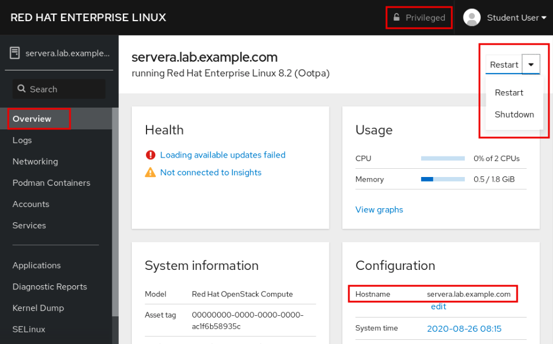

##### Controlling Running System Services

-   We can start, enable, disable, and stop services with graphical tools in Web Console. Click **Services** on the navigation bar to access the Web Console's services initial page. To manage services, click **System Services** at the top of the services initial page. Search in the search bar or scroll through the page to select the service you want to manage.

-   In the example below, select the `chronyd.service` row to open thee service management page.
    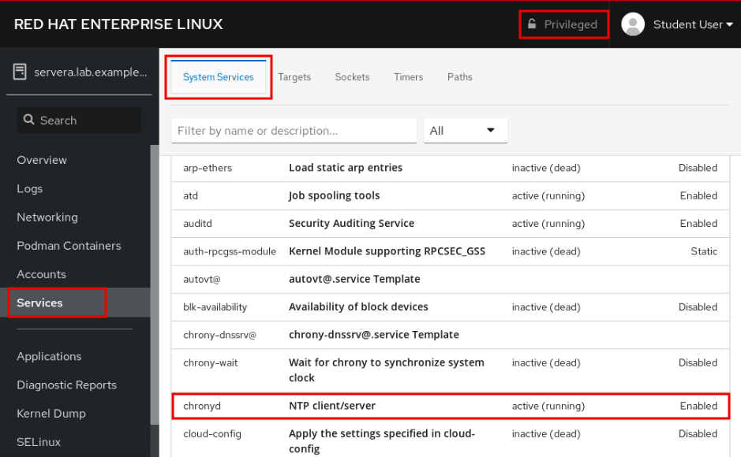
-   Click **Stop**, **Restart**, or **Disallow running (mask)** as appropriate to manage the service. In this view the service is already running. Additional information related to the service is available by clicking on any of the highlighted links or by scrolling through the service logs displayed below the service management section.
    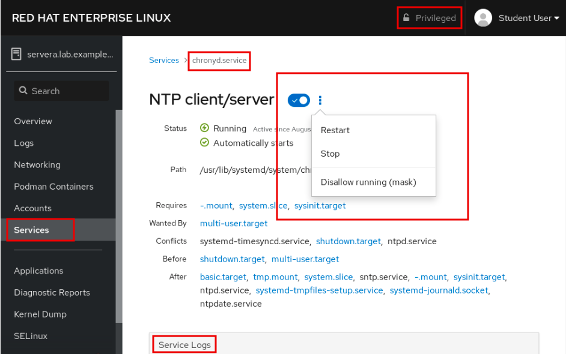

##### Configuring Network Interfaces and the Firewall

-   To manage firewall rules and network interfaces, click **Networking** on the navigation bar. The following example shows how to gather information about network interfaces and how to manage them.
    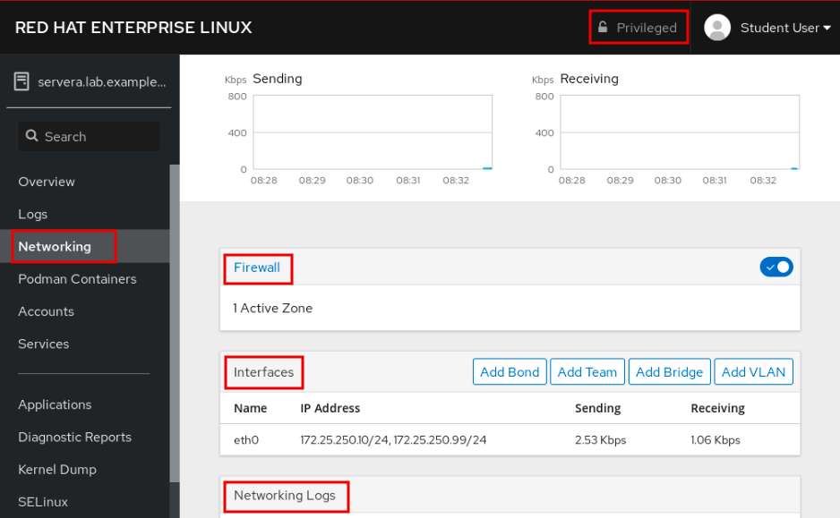
-   Click the desired interface name in the **Interfaces** section to access the management page. In this example, the `eth0` interface is selected.
    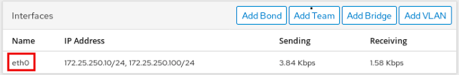
-   The top part of the management page displays network traffic activity for the selected device. Scroll down to view configuration settings and management options.
    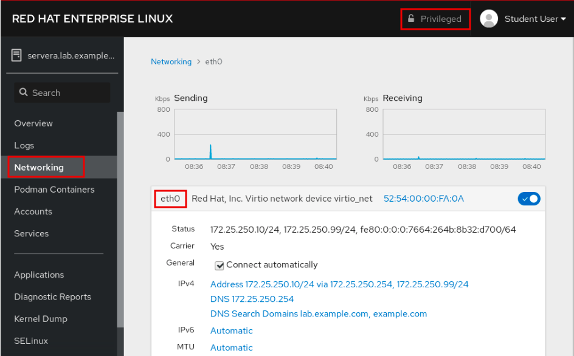
-   To modify or add configuration options to an interface, click the highlighted links for the desired configuration. In this example, the IPv4 link shows a single IP address and netmask, `172.25.250.10/24` for the `eth0` network interface. To add an additional IP address to the `eth0` network interface, click the highlighted link.
    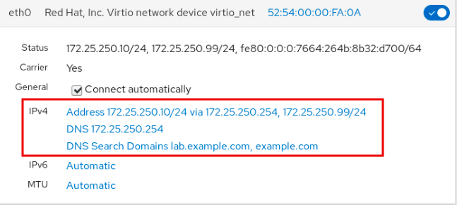
-   Click **+** on the right side of the **Manual** list selection to add an additional IP address. Enter an IP address and network mask in the appropriate fields. Click **Apply** to activate the new settings.
    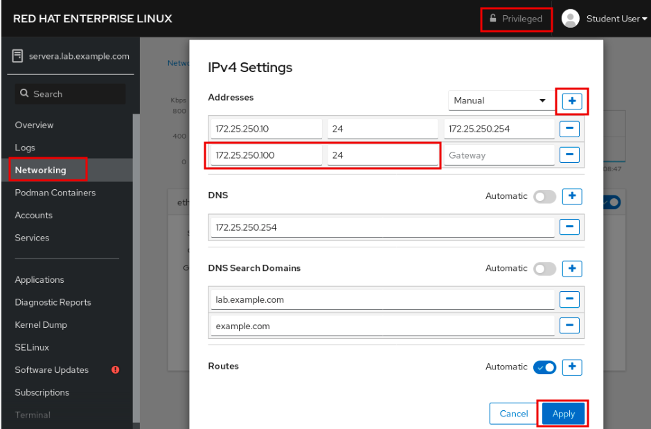
-   The display automatically switches back to the interface's management page where we can confirm the new IP address.
    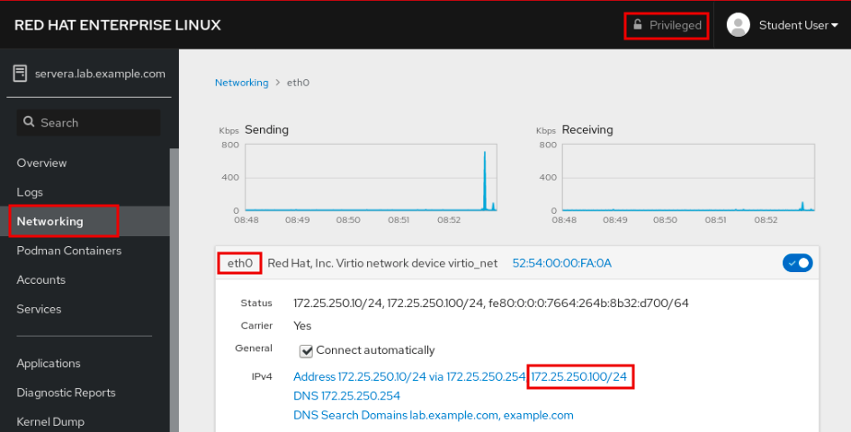

##### Administering User Accounts

-   As a privileged user you can create new user accounts in Web Console. Click **Accounts** on the navigation bar to view existing accounts. Click **Create New Account** to open the account management page.
    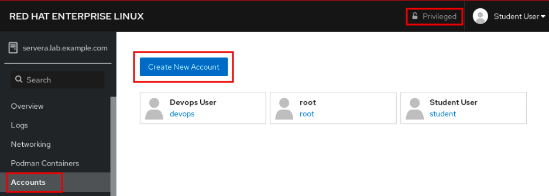
-   Enter the information for the new account and then click **Create**.
    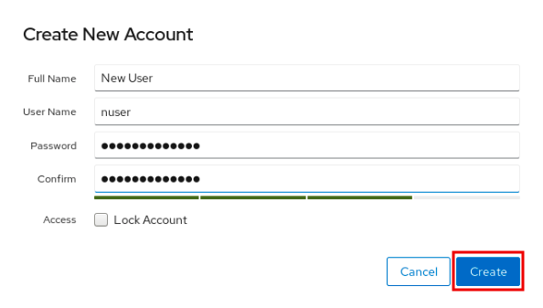
-   The display automatically switches back to the account management page where we can confirm the new user account.
    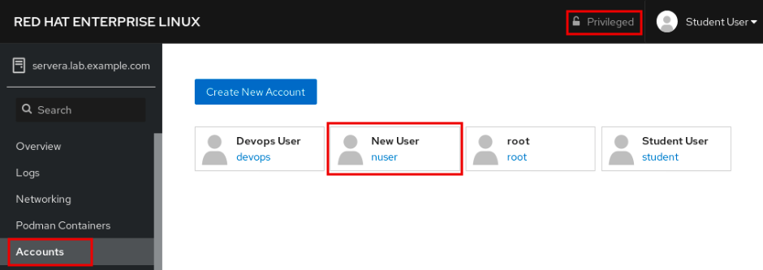
