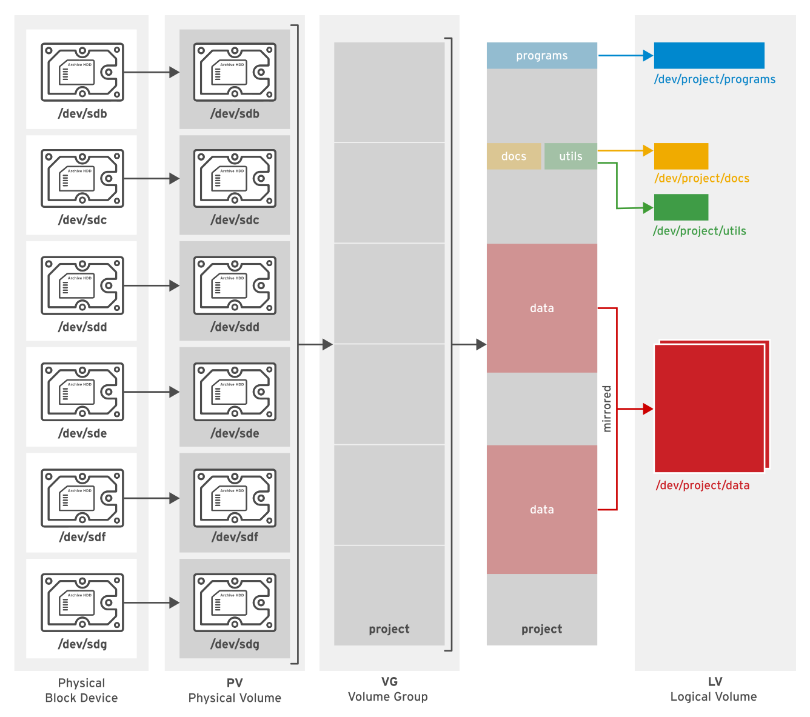

## Managing Logical Volumes

### Creating Logical Volumes

#### Logical Volume Management (LVM) Concepts

-   Logical volumes and logical volume management make it easier to manage disk space.
-   If a file system that hosts a logical volume needs more space, it can be allocated to its logical volume from the free space in its volume group and the file system can be resized.
-   If a disk starts to fail, a replacement disk can be registered as a physical volume with the volume group and the logical volume's extents can be migrated to the new disk.

##### LVM Definitions

###### Physical devices

-   Physical devices are the storage devices used to save data stored in a logical volume.
-   These are block devices and could be disk partitions, whole disks, RAID arrays, or SAN disks.
-   A device must be initialized as an LVM physical volume in order to be used with LVM.
-   The entire device will be used as a physical volume.

###### Physical volumes (PVs)

-   Physical volumes are the underlying "physical" storage used with LVM.
-   We must initialize a device as a physical volume before using it in an LVM system.
-   LVM tools segment physical volumes into **physical extents (PEs)**, which are small chunks of data that act as the smallest storage block on a physical volume.

###### Volume groups (VGs)

-   Volume groups are storage pools made up of one or more physical volumes.
-   This is the functional equivalent of a whole disk in basic storage.
-   A PV can only be allocated to a single VG.
-   A VG can consist of unused space and any number of logical volumes.

###### Logical volumes (LVs)

-   Logical volumes are created from free physical extents in a volume group and provide the "storage" device used by applications, users, and the operating system.
-   LVs are a collection of **logical extents (LEs)**, which map to physical extents, the smallest storage chunk of a PV.
-   By default, each LE maps to one PE.
-   Setting specific LV options changes this mapping; for example, mirroring causes each LE to map to two PEs.

#### Implementing LVM Storage

-   Creating LVM storage requires several steps. - The first step is to determine which **physical devices** to use. - After a set of suitable devices have been assembled, they are initialized as **physical volumes** so that they are recognized as belonging to LVM. - The physical volumes are then combined into a **volume group**. - This creates a pool of disk space out of which **logical volumes** can be allocated. - Logical volumes created from the available space in a volume group can be formatted with a file system, activated as swap space, and mounted or activated persistently.
    

-   LVM provides a comprehensive set of command-line tools for implementing and managing LVM storage.
-   These command-line tools can be used in scripts, making them suitable for automation.

-   **Important**
    -   The following examples use device `vdb` and its partitions to illustrate LVM commands.
    -   In practice, these examples would need to use the correct devices for the disk and disk partitions that are being used by the system.
    -   Use the `lsblk`, `blkid`, or `cat /proc/partitions` commands to identify the devices on our system.

##### Creating a Logical Volume

-   To create a logical volume, perform the following steps :

##### Prepare the physical device.

-   Use `parted`, `gdisk`, or `fdisk` to create a new partition for use with LVM.
-   Always set the partition type to `Linux LVM` on LVM partitions; use `0x8e` for MBR partitions.
-   If necessary, use `partprobe` to register the new partition with the kernel.
    <br>

-   Alternatively, use a whole disk, a RAID array, or a SAN disk.
    <br>

-   A physical device only needs to be prepared if there are none prepared already and a new physical volume is required to create or extend a volume group.
    ```
    $ parted -s /dev/vdb mkpart primary 1MiB 769MiB
    $ parted -s /dev/vdb mkpart primary 760MiB 1026MiB
    $ parted -s /dev/vdb set 1 lvm on
    $ parted -s /dev/vdb set 2 lvm on
    ```

##### Create a Physical Volume

-   Use `pvcreate` to label the partition (or other physical device) as a physical volume.
-   The `pvcreate` command divides the physical volume into physical extents (PEs) of a fixed size, for example, 4 MiB blocks.
-   We can label multiple devices at the same time by using space-delimited device names as arguments to `pvcreate`.
    ```
    $ pvcreate /dev/vdb1 /dev/vdb2
    ```
    This labels the devices `/dev/vdb2` and `/dev/vdb1` as PVs, ready for allocation into a volume group.
    <br>
    A PV only needs to be created if there are no PVs free to create or extend a VG.

##### Create a Volume Group

-   Use `vgcreate` to collect one or more physical volumes into a volume group.
-   A volume group is the functional equivalent of a hard disk; we will create logical volumes from the pool of free physical extents in the volume group.
    <br>

-   The `vgcreate` command-line consists of a volume group name followed by one or more physical volumes to allocate to this volume group.

    ```
    $ vgcreate vg01 /dev/vdb1 /dev/vdb2
    ```

    This creates a VG called `vg01` that is the combined size, in PE units, of the two PVs `/dev/vdb2` and `/dev/vdb1`.

-   A VG only needs to be created if none already exist. Additional VGs may be created for administrative reasons to manage the use of PVs and LVs. Otherwise, existing VGs can be extended to accommodate new LVs when needed.

##### Create a Logical Volume

-   Use `lvcreate` to create a new logical volume from the available physical extents in a volume group.
-   At a minimum, the `lvcreate` command includes the `-n` option to set the LV name, either the `-L` option to set the LV size in bytes or the `-l` option to set the LV size in extents, and the name of the volume group hosting this logical volume.

    ```
    $ lvcreate -n lv01 -L 700M vg01
    ```

    This creates an LV called `lv01`, 700 MiB in size, in the VG `vg01`.
    This command will fail if the volume group does not have a sufficient number of free physical extents for the requested size.
    Note also that the size will be rounded to a factor of the physical extent size if the size cannot match exactly.

-   We can specify the size using the `-L` option, which expects sizes in bytes, mebibytes (binary megabytes, 1048576 bytes), gibibytes (binary gigabytes), or similar.
-   Alternatively, we can use the `-l` option, which expects sizes specified as a number of physical extents.
    <br>

-   The following list provides some examples of creating LVs :

    -   `$ lvcreate -L 128M` : Size the logical volume to exactly 128 MiB.

    -   `$ lvcreate -l 128` : Size the logical volume to exactly 128 extents. The total number of bytes depends on the size of the physical extent block on the underlying physical volume.

-   **Important**
    -   Different tools display the logical volume name using either the traditional name, `/dev/vgname/lvname`, or the kernel device mapper name, `/dev/mapper/vgname-lvname`.

##### Add the File System

-   Use `mkfs` to create an XFS file system on the new logical volume.
-   Alternatively, create a file system based on your preferred file system, for example, `ext4`.
    ```
    $ mkfs -t xfs /dev/vg01/lv01
    ```
-   To make the file system available across reboots, perform the following steps :

    -   Use `mkdir` to create a mount point. <br> `$ mkidr /mnt/data`
    -   Add an entry to the `/etc/fstab` file : <br> `/dev/vg01/lv01 /mnt/data xfs defaults 1 2`
        **Note**
        -   Mounting a logical volume by name is equivalent to mounting by UUID because LVM finds its physical volumes based on a UUID even if we initially add them to the volume group by name.
            <br>
    -   Run `$ mount /mnt/data` to mount the file system that we just added in `/etc/fstab`.

#### Removing a Logical Volume

-   To remove all logical volume components, perform the following steps :

##### Prepare the file system.

-   Move all data that must be kept to another file system. Use the `umount` command to unmount the file system and then remove any `/etc/fstab` entries associated with this file system. <br> `$ umount /mnt/data`
    <br>

-   **Warning**
    -   Removing a logical volume destroys any data stored on the logical volume. Back up or move your data before you remove the logical volume.

##### Remove the Logical Volume

-   Use `lvremove DEVICE_NAME` to remove a logical volume that is no longer needed.<br> `$ lvremove /dev/vg01/lv01`
    Unmount the LV file system before running this command. The command prompts for confirmation before removing the LV.

-   The LV's physical extents are freed and made available for assignment to existing or new LVs in the volume group.

##### Remove the Volume Group

-   Use `vgremove VG_NAME` to remove a volume group that is no longer needed. <br> `vgremove vg01`
    The VG's physical volumes are freed and made available for assignment to existing or new VGs on the system.

##### Remove the Physical Volumes

-   Use `pvremove` to remove physical volumes that are no longer needed.
-   Use a space-delimited list of PV devices to remove more than one at a time.
-   This command deletes the PV metadata from the partition (or disk).
-   The partition is now free for reallocation or reformatting.<br> `$ pvremove /dev/vdb1 /dev/vdb2`

#### Reviewing LVM Status Information

##### Physical Volumes

-   Use `pvdisplay` to display information about physical volumes.
-   To list information about all physical volumes, use the command without arguments.
-   To list information about a specific physical volume, pass that device name to the command.

    ```
    $ pvdisplay /dev/vdb1
      --- Physical volume ---
    PV Name               /dev/vdb1
    VG Name               vg01
    PV Size               768.00 MiB / not usable 4.00 MiB
    Allocatable           yes
    PE Size               4.00 MiB
    Total PE              191
    Free PE               16
    Allocated PE          175
    PV UUID               JWzDpn-LG3e-n2oi-9Etd-VT2H-PMem-1ZXwP1
    ```

    -   `PV Name` maps to the **device name**.

    -   `VG Name` shows the **volume group** where the PV is allocated.

    -   `PV Size` shows the **physical size** of the PV, including any unusable space.

    -   `PE Size` is the **physical extent size**, which is the smallest size a logical volume can be allocated.
        <br>
        It is also the multiplying factor when calculating the size of any value reported in PE units, such as `Free PE`; for example: 26 PEs x 4 MiB (the PE Size) equals 104 MiB of free space. A logical volume size is rounded to a factor of PE units.
        <br>
        LVM sets the `PE size` automatically, although it is possible to specify it.
        <br>
    -   `Free PE` shows how many PE units are available for allocation to new logical volumes.

##### Volume Groups

-   Use `vgdisplay` to display information about volume groups.
-   To list information about all volume groups, use the command without arguments.
-   To list information about a specific volume group, pass that VG name to the command.

    ```
    $  vgdisplay vg01
    --- Volume group ---
    VG Name               vg01
    System ID
    Format                lvm2
    Metadata Areas        2
    Metadata Sequence No  2
    VG Access             read/write
    VG Status             resizable
    MAX LV                0
    Cur LV                1
    Open LV               1
    Max PV                0
    Cur PV                2
    Act PV                2
    VG Size               1016.00 MiB
    PE Size               4.00 MiB
    Total PE              254
    Alloc PE / Size       175 / 700.00 MiB
    Free  PE / Size       79 / 316.00 MiB
    VG UUID               3snNw3-CF71-CcYG-Llk1-p6EY-rHEv-xfUSez
    ```

    -   `VG Name` is the **name** of the volume group.

    -   `VG Size` is the **total size** of the storage pool available for logical volume allocation.

    -   `Total PE` is the **total size** expressed in PE units.

    -   `Free PE / Size` shows how much space is free in the VG for allocating to new LVs or to extend existing LVs.

##### Logical Volumes

-   Use `lvdisplay` to display information about logical volumes.
-   If we provide no argument to the command, it displays information about all LVs
-   If we provide an LV device name as an argument, the command displays information about that specific device.

    ```
    $ lvdisplay /dev/vg01/lv01
    --- Logical volume ---
    LV Path                /dev/vg01/lv01
    LV Name                lv01
    VG Name                vg01
    LV UUID                5IyRea-W8Zw-xLHk-3h2a-IuVN-YaeZ-i3IRrN
    LV Write Access        read/write
    LV Creation host, time host.lab.example.com, 2019-03-28 17:17:47 -0400
    LV Status              available
    # open                 1
    LV Size                700 MiB
    Current LE             175
    Segments               1
    Allocation             inherit
    Read ahead sectors     auto
    - current set to       256
    Block device           252:0
    ```

    -   `LV Path` shows the **device name** of the logical volume.
        <br>
        Some tools may report the device name as `/dev/mapper/vgname-lvname`; both represent the same LV.

    -   `VG Name` shows the **volume group** that the LV is allocated from.

    -   `LV Size` shows the **total size** of the LV. Use file-system tools to determine the free space and used space for storage of data.

    -   `Current LE` shows the **number of logical extents** used by this LV. An LE usually maps to a physical extent in the VG, and therefore the physical volume.

### Extending Logical Volumes

#### Extending and Reducing a Volume Group

-   We can add more disk space to a volume group by adding additional physical volumes.
-   This is called **extending the volume group**.
-   Then, we can assign the new physical extents from the additional physical volumes to logical volumes.
    <br>

-   We can remove unused physical volumes from a volume group.
-   This is called **reducing the volume group**.
-   First, use the `pvmove` command to move data from extents on one physical volume to extents on other physical volumes in the volume group.
-   In this way, a new disk can be added to an existing volume group, data can be moved from an older or slower disk to a new disk, and the old disk removed from the volume group.
-   We can perform these actions while the logical volumes in the volume group are in use.
    <br>

-   **Important**
    -   The following examples use the device `vdb` and its partitions to illustrate LVM commands.
    -   In practice, use the appropriate devices for the disk and disk partitions on your own system.

##### Extending a Volume Group

To extend a volume group, perform the following steps :

###### Prepare the physical device and create the physical volume

    ```
    $ parted -s /dev/vdb mkpart primary 1027MiB 1539MiB
    $ parted -s /dev/vdb set 3 lvm on
    $ pvcreate /dev/vdb3
    ```
    A PV only needs to be created if there are no PVs free to extend the VG.

###### Extend the volume group

-   Use `vgextend` to add the new physical volume to the volume group. Use the VG name and PV device name as arguments to `vgextend`. <br> `$ vgextend vg01 /dev/vdb3`
    This extends the `vg01` VG by the size of the `/dev/vdb3` PV.

###### Verify that the new space is available

-   Use `vgdisplay` to confirm the additional physical extents are available. Inspect the `Free PE / Size` in the output. It should not be zero.
    ```
    $ vgdisplay vg01
     --- Volume group ---
    VG Name               vg01
    ...output omitted...
    Free  PE / Size       178 / 712.00 MiB
    ...output omitted...
    ```

##### Reducing a Volume Group

To reduce a volume group, perform the following steps :

###### Move the physical extents

-   Use `pvmove PV_DEVICE_NAME` to relocate any physical extents from the physical volume we want to remove to other physical volumes in the volume group.
-   The other physical volumes must have a sufficient number of free extents to accommodate this move.
-   This is only possible if there are enough free extents in the VG and if all of those come from other PVs.

    ```
    $ pvmove /dev/vdb3
    ```

    This command moves the PEs from `/dev/vdb3` to other PVs with free PEs in the same VG.

-   **Warning**
    -   Before using `pvmove`, back up data stored on all logical volumes in the volume group.
    -   An unexpected power loss during the operation may leave the volume group in an inconsistent state.
    -   This could cause loss of data on logical volumes in the volume group.

##### Reduce the volume group

-   Use `vgreduce VG_NAME PV_DEVICE_NAME` to remove a physical volume from a volume group.<br> `$ vgreduce vg01 /dev/vdb3`
    This removes the `/dev/vdb3` PV from the `vg01` VG and it can now be added to another VG.
    Alternatively, `pvremove` can be used to permanently stop using the device as a PV.

#### Extending a Logical Volume and XFS File System

-   One benefit of logical volumes is the ability to increase their size without experiencing downtime.
-   Free physical extents in a volume group can be added to a logical volume to extend its capacity, which can then be used to extend the file system it contains.

##### Extending a Logical Volume

-   To extend a logical volume, perform the following steps :

###### Verify that the volume group has space available.

-   Use `vgdisplay` to verify that there are sufficient physical extents available.
    ```
    vgdisplay vg01
      --- Volume group ---
    VG Name               vg01
    ...output omitted...
    Free  PE / Size       178 / 712.00 MiB
    ...output omitted...
    ```
    Inspect the `Free PE / Size` in the output.
    Confirm that the volume group has sufficient free space for the LV extension.
    If insufficient space is available, then extend the volume group appropriately.

###### Extend the Logical Volume

-   Use `lvextend LV_DEVICE_NAME` to extend the logical volume to a new size.<br> `$ lvextend -L +300M /dev/vg01/lv01`
    This increases the size of the logical volume `lv01` by 300 MiB.
    Notice the plus sign (`+`) in front of the size, which means add this value to the existing size; otherwise, the value defines the final size of the LV.
    <br>

-   As with `lvcreate`, different methods exist to specify the size: the `-l` option expects the number of physical extents as the argument. The `-L` option expects sizes in bytes, mebibytes, gibibytes, and similar.
    <br>

-   The following list provides some examples of extending LVs.

| Command                | Results                                                       |
| ---------------------- | ------------------------------------------------------------- |
| `vextend -l 128`       | Resize the logical volume to exactly 128 extents in size.     |
| `lvextend -l +128`     | Add 128 extents to the current size of the logical volume.    |
| `lvextend -L 128M`     | Resize the logical volume to exactly 128 MiB.                 |
| `lvextend -L +128M`    | Add 128 MiB to the current size of the logical volume.        |
| `lvextend -l +50%FREE` | Add 50 percent of the current free space in the VG to the LV. |

##### Extend the File System

-   Use `xfs_growfs mountpoint` to expand the file system to occupy the extended LV.
-   The target file system must be mounted when we use the `xfs_growfs` command.
-   We can continue to use the file system while it is being resized.<br> `$ xfs_growfs /mnt/data`
    <br>

-   **Note**
    -   A common mistake is to run `lvextend` but to forget to run `xfs_growfs`.
    -   An alternative to running the two steps consecutively is to include the `-r` option with the `lvextend` command. This resizes the file system after the LV is extended, using `fsadm(8)`. It works with a number of different file systems.

##### Verify the new size of the mounted file system

`$ df -h /mnt/data`

#### Extending a Logical Volume and EXT4 File System

-   The steps for extending an ext4-based logical volume are essentially the same as for an XFS-based LV, except for the step that resizes the file system.

##### Extend the file system

-   Use `resize2fs /dev/vgname/lvname` to expand the file system to occupy the new extended LV.
-   The file system can be mounted and in use while the extension command is running.
-   We can include the `-p` option to monitor the progress of the resize operation.<br> `$ resize2fs /dev/vg01/lv01`
    <br>

-   **Note**
    -   The primary difference between `xfs_growfs` and `resize2fs` is the argument passed to identify the file system.
    -   `xfs_growfs` takes the mount point and `resize2fs` takes the logical volume name.

#### Extend a logical volume and swap space

-   Logical volumes formatted as swap space can be extended as well, however the process is different than the one for extending a file system, such as `ext4` or `XFS`.
-   Logical volumes formatted with a file system can be extended dynamically with no downtime.
-   Logical volumes formatted with swap space must be taken offline in order to extend them.

##### Verify that volume group has space available

-   Use `vgdisplay vgname` to verify that a sufficient number of free physical extents are available.

##### Deactivate the swap space

-   Use `swapoff -v /dev/vgname/lvname` to deactivate the swap space on the logical volume.
    <br>

-   **Warning**
    -   Our system must have enough free memory or swap space to accept anything that needs to page in when the swap space on the logical volume is deactivated.

##### Extend the logical volume

-   `lvextend -l +extents /dev/vgname/lvname` extends the logical volume `/dev/vgname/lvname` by the extents value.

##### Format the logical volume as swap space

-   `mkswap /dev/vgname/lvname` formats the entire logical volume as swap space.

##### Activate the swap space

-   Use `swapon -va /dev/vgname/lvname` to activate the swap space on the logical volume.
