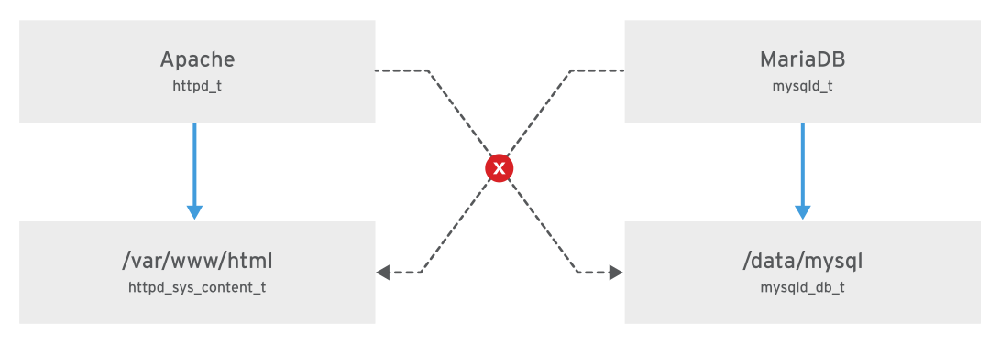

## Managing SELinux Security

### Changing the SELinux Enforcement Mode

#### How SELinux Protects Resources

-   SELinux is an important security feature of Linux.
-   Access to files and other resources is controlled at a very granular level.
-   Processes are only permitted to access the resources specified by their policy, or SELinux boolean settings.
    <br>

-   File permissions control which users or groups of users can access which specific files.
-   However, a user given read or write access to any specific file can use that file in any way that user chooses, even if that use is not how the file should be used.
    <br>

-   For example, with write access to a file, should a structured data file designed to be written to using only a particular program, be allowed to be opened and modified by other editors that could result in corruption?
    <br>

-   File permissions cannot stop such undesired access. They were never designed to control how a file is used, but only who is allowed to read, write, or run a file.
    <br>

-   SELinux consists of sets of policies, defined by the application developers, that declare exactly what actions and accesses are proper and allowed for each binary executable, configuration file, and data file used by an application.
-   This is known as a **targeted policy** because one policy is written to cover the activities of a single application.
-   Policies declare predefined labels that are placed on individual programs, files, and network ports.

#### Why use Security Enhanced Linux?

-   Not all security issues can be predicted in advance.
-   SELinux enforces a set of access rules preventing a weakness in one application from affecting other applications or the underlying system.
-   SELinux provides an extra layer of security; it also adds a layer of complexity which can be off-putting to people new to this subsystem.
-   Learning to work with SELinux may take time but the enforcement policy means that a weakness in one part of the system does not spread to other parts.
-   If SELinux works poorly with a particular subsystem, we can turn off enforcement for that specific service until we find a solution to the underlying problem.
    <br>

-   SELinux has three modes:

    -   **Enforcing :** SELinux is enforcing access control rules. Computers generally run in this mode.
    -   **Permissive :** SELinux is active but instead of enforcing access control rules, it records warnings of rules that have been violated. This mode is used primarily for testing and troubleshooting.
    -   **Disabled :** SELinux is turned off entirely: no SELinux violations are denied, nor even recorded. Discouraged!

#### Basic SELinux security concepts

-   Security Enhanced Linux (SELinux) is an additional layer of system security.
-   The primary goal of SELinux is to protect user data from system services that have been compromised.
-   Most Linux administrators are familiar with the standard `user/group/other` permission security model. This is a user and group based model known as **discretionary access control**.
-   SELinux provides an additional layer of security that is object-based and controlled by more sophisticated rules, known as **mandatory access control**.
    <br>

-   To allow remote anonymous access to a web server, firewall ports must be opened.
-   However, this gives malicious people an opportunity to compromise the system through a vulnerability. If they succeed in compromising the web server process they gain its permissions. Specifically, the permissions of the apache user and the apache group.
-   That user and group has read access to the document root, `/var/www/html`. It also has access to `/tmp`, and `/var/tmp`, and any other files and directories that are world writable.
    <br>

-   SELinux is a set of security rules that determine which process can access which files, directories, and ports.
-   Every file, process, directory, and port has a special security label called an SELinux context.
-   A context is a name used by the SELinux policy to determine whether a process can access a file, directory, or port.
-   By default, the policy does not allow any interaction unless an explicit rule grants access. If there is no allow rule, no access is allowed.
    <br>

-   SELinux labels have several contexts: `user`, `role`, `type`, and `sensitivity`.
-   The targeted policy, which is the default policy enabled in Red Hat Enterprise Linux, bases its rules on the third context: the **type context**.
-   Type context names usually end with `_t`.
    
    <br>

-   The type context for a **web server** is `httpd_t`.
-   The type context for **files and directories** normally found in `/var/www/html` is `httpd_sys_content_t`.
-   The contexts for **files and directories** normally found in `/tmp` and `/var/tmp` is `tmp_t`.
-   The type context for **web server ports** is `http_port_t`.
    <br>

-   **Apache** has a type context of `httpd_t`.
-   There is a policy rule that permits Apache access to files and directories with the `httpd_sys_content_t` type context.
-   By default files found in `/var/www/html` and other web server directories have the `httpd_sys_content_t` type context.
-   There is no allow rule in the policy for files normally found in `/tmp` and `/var/tmp`, so access is not permitted.
-   With SELinux enabled, a malicious user who had compromised the web server process could not access the `/tmp` directory.
    <br>

-   The **MariaDB server** has a type context of `mysqld_t`.
-   By default, files found in `/data/mysql` have the `mysqld_db_t` type context.
-   This type context allows MariaDB access to those files but disables access by other services, such as the Apache web service.



-   Many commands that deal with files use the `-Z` option to display or set SELinux contexts.
-   For instance, `ps`, `ls`, `cp`, and `mkdir` all use the `-Z` option to display or set SELinux contexts.
    ```
    $ px axZ
    LABEL                             PID TTY      STAT   TIME COMMAND
    system_u:system_r:init_t:s0         1 ?        Ss     0:09 /usr/lib/systemd/...
    system_u:system_r:kernel_t:s0       2 ?        S      0:00 [kthreadd]
    system_u:system_r:kernel_t:s0       3 ?        S      0:00 [ksoftirqd/0]
    ...output omitted...
    $ systemctl start httpd
    $ ps -ZC httpd
    LABEL                             PID TTY          TIME CMD
    system_u:system_r:httpd_t:s0     1608 ?        00:00:05 httpd
    system_u:system_r:httpd_t:s0     1609 ?        00:00:00 httpd
    ...output omitted...
    $ ls -Z /home
    drwx------. root    root    system_u:object_r:lost_found_t:s0 lost+found
    drwx------. student student unconfined_u:object_r:user_home_dir_t:s0 student
    drwx------. visitor visitor unconfined_u:object_r:user_home_dir_t:s0 visitor
    $ ls -Z /var/www
    drwxr-xr-x. root root system_u:object_r:httpd_sys_script_exec_t:s0 cgi-bin
    drwxr-xr-x. root root system_u:object_r:httpd_sys_content_t:s0 error
    drwxr-xr-x. root root system_u:object_r:httpd_sys_content_t:s0 html
    drwxr-xr-x. root root system_u:object_r:httpd_sys_content_t:s0 icons
    ```

#### Changing the current SELinux mode

-   The SELinux subsystem provides tools to display and change modes.
-   To determine the current SELinux mode, run the `getenforce` command.
-   To set SELinux to a different mode, use the `setenforce` command :
    ```
    $ getenforce
    Enforcing
    $ setenforce
    usage:  setenforce [ Enforcing | Permissive | 1 | 0 ]
    $ setenforce 0
    $ getenforce
    Permissive
    $ setenforce Enforcing
    $ getenforce
    Enforcing
    ```
-   Alternatively, we can set the SELinux mode at boot time by passing a parameter to the kernel : the kernel argument of `enforcing=0` boots the system into **permissive mode**; a value of `enforcing=1` sets **enforcing mode**.
-   We can also **disable SELinux completely** by passing on the kernel parameter `selinux=0`.
-   A value of `selinux=1` **enables SELinux**.

#### Setting the default SELinux mode

-   We can also configure SELinux persistently using the `/etc/selinux/config` file.
-   In the example below (the default configuration), the configuration file sets SELinux to `enforcing`. The comments also show the other valid values : `permissive` and `disabled`.
    ```
    # This file controls the state of SELinux on the system.
    # SELINUX= can take one of these three values:
    #     enforcing - SELinux security policy is enforced.
    #     permissive - SELinux prints warnings instead of enforcing.
    #     disabled - No SELinux policy is loaded.
    SELINUX=enforcing
    # SELINUXTYPE= can take one of these two values:
    #     targeted - Targeted processes are protected,
    #     minimum - Modification of targeted policy. Only selected processes
    #               are protected.
    #     mls - Multi Level Security protection.
    SELINUXTYPE=targeted
    ```
-   The system reads this file at boot time and configures SELinux as shown. Kernel arguments (selinux=0|1 and enforcing=0|1) override this configuration.
