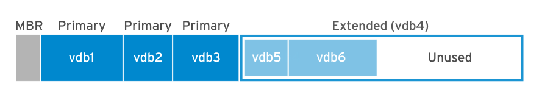
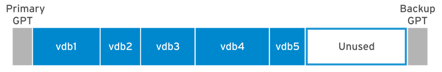

## Managing Basic Storage

### Adding Partitions, File Systems, and Persistent Mounts

#### Partitioning a Disk

-   Disk partitioning allows system administrators to divide a hard drive into multiple logical storage units, referred to as partitions. By separating a disk into partitions, system administrators can use different partitions to perform different functions.
    <br>

-   For example, disk partitioning is necessary or beneficial in these situations :

    -   Limit available space to applications or users.

    -   Separate operating system and program files from user files.

    -   Create a separate area for memory swapping.

    -   Limit disk space use to improve the performance of diagnostic tools and backup imaging.

##### MBR Partitioning Scheme

-   Since 1982, the **Master Boot Record (MBR) partitioning scheme** has dictated how disks are partitioned on systems running BIOS firmware.
-   This scheme supports a **maximum of four primary partitions**.
-   On Linux systems, with the use of extended and logical partitions, administrators can create a **maximum of 15 partitions**.
-   Because partition size data is stored as **32-bit** values, disks partitioned with the MBR scheme have a **maximum disk and partition size of 2 TiB**.
    

-   Because physical disks are getting larger, and SAN-based volumes even larger than that, the 2 TiB disk and partition size limit of the MBR partitioning scheme is no longer a theoretical limit, but rather a real-world problem that system administrators encounter more and more frequently in production environments. As a result, the legacy MBR scheme is in the process of being superseded by the new **GUID Partition Table (GPT)** for disk partitioning.

##### GPT Partitioning Scheme

-   For systems running **Unified Extensible Firmware Interface (UEFI) firmware**, GPT is the standard for laying out partition tables on physical hard disks.
-   GPT is part of the UEFI standard and addresses many of the limitations that the old MBR-based scheme imposes.
    <br>

-   A GPT provides a **maximum of 128 partitions**.
-   Unlike an MBR, which uses 32 bits for storing logical block addresses and size information, a GPT allocates **64 bits** for logical block addresses. This allows a GPT to accommodate partitions and disks of up to **eight zebibytes (ZiB)** or **eight billion tebibytes**.
    <br>

-   In addition to addressing the limitations of the MBR partitioning scheme, a GPT also offers some additional features and benefits.
-   A GPT uses a **globally unique identifier (GUID)** to identify each disk and partition.
-   In contrast to an MBR, which has a single point of failure, a GPT offers redundancy of its partition table information.
-   The primary GPT resides at the head of the disk, while a backup copy, the secondary GPT, is housed at the end of the disk.
-   A GPT uses a checksum to detect errors and corruptions in the GPT header and partition table.
    

#### Managing Partitions with Parted

-   Partition editors are programs which allow administrators to make changes to a disk's partitions, such as creating partitions, deleting partitions, and changing partition types.
-   To perform these operations, administrators can use the **Parted partition editor** for both the MBR and the GPT partitioning scheme.
    <br>

-   The `parted` command takes the device name of the whole disk as the first argument and one or more subcommands.
-   The following example uses the `print` subcommand to display the partition table on the `/dev/vda` disk.

    ```
    $ parted /dev/vda print
    Model: Virtio Block Device (virtblk)
    Disk /dev/vda: 53.7GB
    Sector size (logical/physical): 512B/512B
    Partition Table: msdos
    Disk Flags:

    Number  Start   End     Size    Type     File system  Flags
    1      1049kB  10.7GB  10.7GB  primary  xfs          boot
    2      10.7GB  53.7GB  42.9GB  primary  xfs
    ```

-   If we do not provide a subcommand, parted opens an interactive session for issuing commands.

    ```
    $ parted /dev/vda
    GNU Parted 3.2
    Using /dev/vda
    Welcome to GNU Parted! Type 'help' to view a list of commands.
    (parted) print
    Model: Virtio Block Device (virtblk)
    Disk /dev/vda: 53.7GB
    Sector size (logical/physical): 512B/512B
    Partition Table: msdos
    Disk Flags:

    Number  Start   End     Size    Type     File system  Flags
    1      1049kB  10.7GB  10.7GB  primary  xfs          boot
    2      10.7GB  53.7GB  42.9GB  primary  xfs

    (parted) quit
    ```

-   By default, parted displays all the sizes in powers of 10 (KB, MB, GB). You can change that default with the `unit` subcommand which accepts the following parameters :

    -   `s` for sector

    -   `B` for byte

    -   `MiB`, `GiB`, or `TiB` (powers of 2)

    -   `MB`, `GB`, or `TB` (powers of 10)

        ```
        $ parted /dev/vda unit s print
        Model: Virtio Block Device (virtblk)
        Disk /dev/vda: 104857600s
        Sector size (logical/physical): 512B/512B
        Partition Table: msdos
        Disk Flags:

        Number  Start      End         Size       Type     File system  Flags
        1      2048s      20971486s   20969439s  primary  xfs          boot
        2      20971520s  104857535s  83886016s  primary  xfs
        ```

        As shown in the example above, we can also specify multiple subcommands (here, `unit` and `print`) on the same line.

##### Writing the Partition Table on a New Disk

-   To partition a new drive, we first have to write a **disk label** to it. The disk label indicates which partitioning scheme to use.
-   **Warning**
    -   Keep in mind that parted makes the changes immediately. A mistake with parted could lead to data loss.
-   As the root user, use the following command to write an MBR disk label to a disk.
    `$ parted /dev/vdb mklabel msdos`
-   To write a GPT disk label, use the following command.
    `$ parted /dev/vdb mklabel gpt`

-   **Warning**
    -   The `mklabel` subcommand wipes the existing partition table.
    -   Only use `mklabel` when the intent is to reuse the disk without regard to the existing data.
    -   If a new label changes the partition boundaries, all data in existing file systems will become inaccessible.

##### Creating MBR Partitions

-   Creating an MBR disk partition involves several steps :

    1.  Specify the disk device to create the partition on.
        <br>
        As the root user, execute the `parted` command and specify the disk device name as an argument. This starts the parted command in interactive mode and displays a command prompt.
        `$ parted /dev/vdb GNU Parted 3.2 Using /dev/vdb Welcome to GNU Parted! Type 'help' to view a list of commands. (parted)`
    2.  Use the `mkpart` subcommand to create a new primary or extended partition.
        ```
        (parted) mkpart
        Partition type?  primary/extended? primary
        ```
        **Note**
        -   For situations where we need more than four partitions on an MBR-partitioned disk, create three primary partitions and one extended partition. This extended partition serves as a container within which we can create multiple logical partitions.
    3.  Indicate the file-system type that we want to create on the partition, such as `xfs` or `ext4`. This does not create the file system on the partition; it is only an indication of the partition type. <br>
        `File system type? [ext2]? xfs`
        To get the list of the supported file-system types, use the following command :

        ````
        $ parted /dev/vdb help mkpart
        mkpart PART-TYPE [FS-TYPE] START END make a partition

             PART-TYPE is one of: primary, logical, extended
             FS-TYPE is one of: btrfs, nilfs2, ext4, ext3, ext2, fat32, fat16, hfsx,
             hfs+, hfs, jfs, swsusp, linux-swap(v1), linux-swap(v0), ntfs, reiserfs,
             hp-ufs, sun-ufs, xfs, apfs2, apfs1, asfs, amufs5, amufs4, amufs3,
             amufs2, amufs1, amufs0, amufs, affs7, affs6, affs5, affs4, affs3, affs2,
             affs1, affs0, linux-swap, linux-swap(new), linux-swap(old)
             START and END are disk locations, such as 4GB or 10%.  Negative values
             count from the end of the disk.  For example, -1s specifies exactly the
             last sector.

             'mkpart' makes a partition without creating a new file system on the
             partition.  FS-TYPE may
             ```

        ````

    4.  Specify the sector on the disk that the new partition starts on. <br>
        `Start? 2048s`
        Notice the `s` suffix to provide the value in sectors. We can also use the `MiB`, `GiB`, `TiB`, `MB`, `GB`, or `TB` suffixes.
        If we do not provide a suffix, `MB` is the default. `parted` may round the value we provide to satisfy disk constraints.
    5.  Specify the disk sector where the new partition should end. <br>
        `End? 1000MB`
        With `parted`, we cannot directly provide the size of our partition, but we can quickly compute it with the following formula : <br>
        `Size = End - Start`
        As soon as we provide the end position, `parted` updates the partition table on the disk with the new partition details.
    6.  Exit `parted`
        ```
        (parted) quit
        Information: You may need to update /etc/fstab.
        ```
    7.  Run the `udevadm settle` command. This command waits for the system to detect the new partition and to create the associated device file under the `/dev` directory. It only returns when it is done.<br>
        `$ udevadm settle`
        <br>

-   As an alternative to the interactive mode, we can also create the partition as follows : <br>
    `$ parted /dev/vdb mkpart primary xfs 2048s 1000MB`

##### Creating GPT Partitions

-   The GPT scheme also uses the `parted` command to create new partitions:

    1. Specify the disk device to create the partition on.<br>  
       As the root user, execute the `parted` command with the disk device as the only argument to start parted in interactive mode with a command prompt.
       `$ parted /dev/vdb GNU Parted 3.2 Using /dev/vdb Welcome to GNU Parted! Type 'help' to view a list of commands. (parted)`
    2. Use the `mkpart` subcommand to start creating the new partition.<br>
       With the GPT scheme, each partition is given a name.
       `(parted) mkpart Partition name? []? usersdata`
    3. Indicate the file system type that we want to create on the partition, such as `xfs` or `ext4`. This does not create the file system on the partition; it is only an indication of the partition type.<br> `Fle system type? [ext2]? xfs`
    4. Specify the sector on the disk that the new partition starts on. <br> `Start? 2048s`
    5. Specify the disk sector where the new partition should end. <br> `End? 1000MB`<br> As soon as we provide the end position, parted updates the partition table on the disk with the new partition details.
    6. Exit `parted`
        ```
        (parted) quit
        Information: You may need to update /etc/fstab.
        ```
    7. Run the `udevadm settle` command. This command waits for the system to detect the new partition and to create the associated device file under the `/dev` directory. It only returns when it is done. <br> `$ udevadm settle`

-   As an alternative to the interactive mode, we can also create the partition as follows : <br> `$ parted /dev/vdb mkpart usersdata xfs 2048s 1000MB`

##### Deleting Partitions

-   The following steps apply for both the MBR and GPT partitioning schemes.

    1. Specify the disk that contains the partition to be removed.<br>
       As the root user, execute the `parted` command with the disk device as the only argument to start parted in interactive mode with a command prompt.
       `$ parted /dev/vdb GNU Parted 3.2 Using /dev/vdb Welcome to GNU Parted! Type 'help' to view a list of commands. (parted)`
    2. Identify the partition number of the partition to delete.

        ```
        (parted) print
        Model: Virtio Block Device (virtblk)
        Disk /dev/vdb: 5369MB
        Sector size (logical/physical): 512B/512B
        Partition Table: gpt
        Disk Flags:

        Number  Start   End     Size   File system  Name       Flags
        1      1049kB  1000MB  999MB  xfs          usersdata
        ```

    3. Delete the partition.<br> `(parted) rm 1`<br> The `rm` subcommand immediately deletes the partition from the partition table on the disk.
    4. Exit `parted`.
        ```
        (parted) quit
        Information: You may need to update /etc/fstab.
        ```

#### Creating File Systems

-   After the creation of a block device, the next step is to add a file system to it.
-   Red Hat Enterprise Linux supports many different file system types, but two common ones are `XFS` and `ext4`.
-   Anaconda, the installer for Red Hat Enterprise Linux, uses `XFS` by default.
    <br>

-   As root, use the `mkfs.xfs` command to apply an `XFS` file system to a block device. For `ext4`, use `mkfs.ext4`.
    ```
    $  mkfs.xfs /dev/vdb1
    meta-data=/dev/vdb1              isize=512    agcount=4, agsize=60992 blks
             =                       sectsz=512   attr=2, projid32bit=1
             =                       crc=1        finobt=1, sparse=1, rmapbt=0
             =                       reflink=1
    data     =                       bsize=4096   blocks=243968, imaxpct=25
             =                       sunit=0      swidth=0 blks
    naming   =version 2              bsize=4096   ascii-ci=0, ftype=1
    log      =internal log           bsize=4096   blocks=1566, version=2
             =                       sectsz=512   sunit=0 blks, lazy-count=1
    realtime =none                   extsz=4096   blocks=0, rtextents=0
    ```

#### Mounting File Systems

-   After we have added the file system, the last step is to mount the file system to a directory in the directory structure.
-   When we mount a file system onto the directory hierarchy, user-space utilities can access or write files on the device.

##### Manually Mounting File Systems

-   Administrators use the `mount` command to manually attach the device onto a directory location, or mount point.
-   The `mount` command expects the device, the mount point, and optionally file system options as arguments.
-   The file-system options customize the behavior of the file system.
    `$ mount /dev/vdb1 /mnt`
    <br>

-   We also use the `mount` command to view currently mounted file systems, the mount points, and the options.
    ```
    $ mount | grep vdb1
    /dev/vdb1 on /mnt type xfs (rw,relatime,seclabel,attr2,inode64,noquota)
    ```

#### Persistently Mounting File Systems

-   Manually mounting a file system is a good way to verify that a formatted device is accessible and working as expected.
-   However, when the server reboots, the system does not automatically mount the file system onto the directory tree again; the data is intact on the file system, but users cannot access it.
    <br>

-   To make sure that the system automatically mounts the file system at system boot, add an entry to the `/etc/fstab` file. This configuration file lists the file systems to mount at system boot.
    <br>

-   `/etc/fstab` is a white-space-delimited file with six fields per line.

    ```
    $ cat /etc/fstab

    #
    # /etc/fstab
    # Created by anaconda on Wed Feb 13 16:39:59 2019
    #
    # Accessible filesystems, by reference, are maintained under '/dev/disk/'.
    # See man pages fstab(5), findfs(8), mount(8) and/or blkid(8) for more info.
    #
    # After editing this file, run 'systemctl daemon-reload' to update systemd
    # units generated from this file.
    #
    UUID=a8063676-44dd-409a-b584-68be2c9f5570   /        xfs   defaults   0 0
    UUID=7a20315d-ed8b-4e75-a5b6-24ff9e1f9838   /dbdata  xfs   defaults   0 0
    ```

-   When we add or remove an entry in the `/etc/fstab` file, run the `systemctl daemon-reload` command, or reboot the server, for `systemd` to register the new configuration. <br> `$ systemctl daemon-reload`
-   The first field specifies the device. This example uses the UUID to specify the device. File systems create and store the UUID in their super block at creation time. Alternatively, we could use the device file, such as `/dev/vdb1`.
    <br>

-   **Note**
    -   Using the UUID is preferable because block device identifiers can change in certain scenarios, such as a cloud provider changing the underlying storage layer of a virtual machine, or the disks being detected in a different order with each system boot. The block device file name may change, but the UUID remains constant in the file system's super block.
        <br>
        Use the `lsblk --fs` command to scan the block devices connected to a machine and retrieve the file system UUIDs.
        ```
        $ lsblk --fs
        NAME   FSTYPE LABEL UUID                                 MOUNTPOINT
        sr0
        vda
        └─vda1 xfs          a8063676-44dd-409a-b584-68be2c9f5570 /
        vdb
        └─vdb1 xfs          7a20315d-ed8b-4e75-a5b6-24ff9e1f9838 /dbdata
        ```
-   The **second field** is the directory mount point, from which the block device will be accessible in the directory structure.
-   The mount point must exist; if not, create it with the `mkdir` command.
    <br>

-   The **third field** contains the file-system type, such as `xfs` or `ext4`.
    <br>

-   The **fourth field** is the comma-separated list of options to apply to the device.
-   `defaults` is a set of commonly used options.
-   The `mount(8)` man page documents the other available options.
    <br>

-   The **fifth field** is used by the dump command to back up the device.
-   Other backup applications do not usually use this field.
    <br>

-   The **last field**, the **fsck order field**, determines if the `fsck` command should be run at system boot to verify that the file systems are clean.
-   The value in this field indicates the order in which `fsck` should run.
-   For `XFS` file systems, set this field to `0` because `XFS` does not use `fsck` to check its file-system status.
-   For `ext4` file systems, set it to `1` for the root file system and `2` for the other `ext4` file systems.
-   This way, `fsck` processes the root file system first and then checks file systems on separate disks concurrently, and file systems on the same disk in sequence.
    <br>

-   **Note**
    -   Having an incorrect entry in `/etc/fstab` may render the machine non-bootable.
    -   Administrators should verify that the entry is valid by unmounting the new file system and using `mount /mountpoint`, which reads `/etc/fstab`, to remount the file system.
    -   If the `mount` command returns an error, correct it before rebooting the machine.<br>
        As an alternative, we can use the `findmnt --verify` command to control the `/etc/fstab` file.
