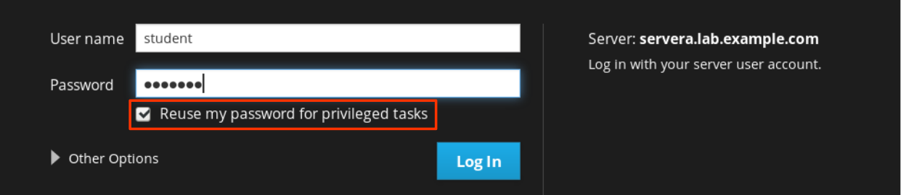
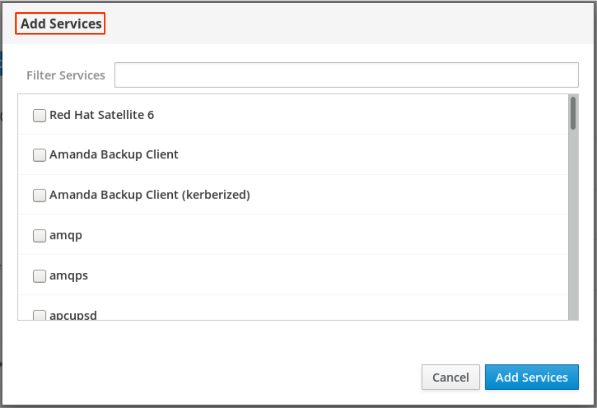
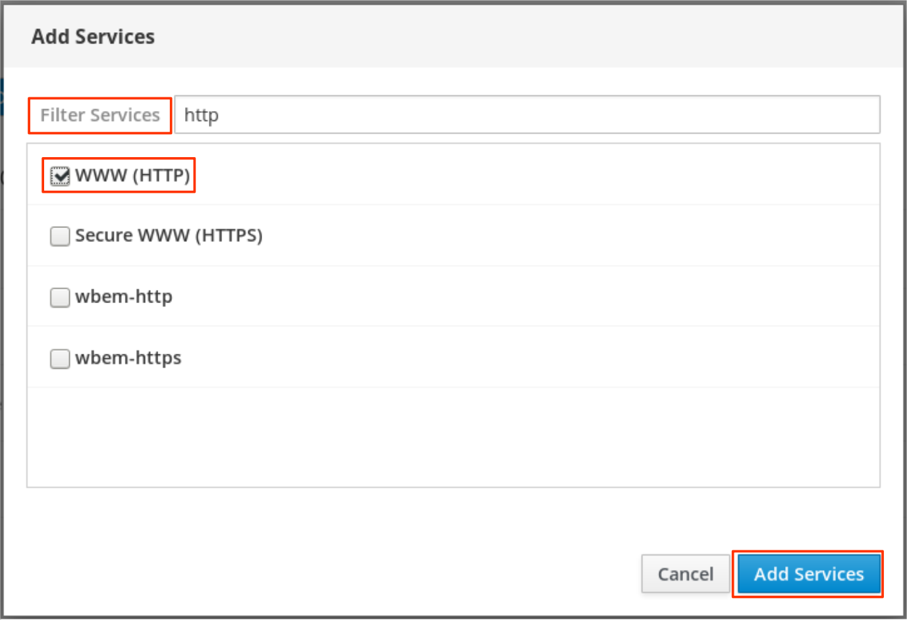

## Managing Network Security

### Managing Server Firewalls

#### Firewall Architecture Concepts

-   The Linux kernel includes `netfilter`, a framework for network traffic operations such as packet filtering, network address translation and port translation.
-   By implementing handlers in the kernel that intercept function calls and messages, `netfilter` allows other kernel modules to interface directly with the kernel's networking stack.
-   Firewall software uses these hooks to register filter rules and packet-modifying functions, allowing every packet going through the network stack to be processed.
-   Any incoming, outgoing, or forwarded network packet can be inspected, modified, dropped, or routed programmatically before reaching user space components or applications.
-   `Netfilter` is the primary component in Red Hat Enterprise Linux 8 firewalls.

##### Nftables enhances netfilter

-   The Linux kernel also includes `nftables`, a new filter and packet classification subsystem that has enhanced portions of `netfilter's` code, but retaining the `netfilter` architecture such as networking stack hooks, connection tracking system, and the logging facility.
-   The advantages of the `nftables` update is faster packet processing, faster ruleset updates, and simultaneous IPv4 and IPv6 processing from the same rules.
-   Another major difference between `nftables` and the original `netfilter` are their interfaces.
-   `Netfilter` is configured through multiple utility frameworks, including `iptables`, `ip6tables`, `arptables`, and `ebtables`, which are now deprecated.
-   `Nftables` uses the single `nft user-space` utility, allowing all protocol management to occur through a single interface, eliminating historical contention caused by diverse front ends and multiple `netfilter` interfaces.

##### introducing firewalld

-   `Firewalld` is a dynamic firewall manager, a front end to the `nftables` framework using the `nft` command.
-   Until the introduction of `nftables`, `firewalld` used the `iptables` command to configure `netfilter` directly, as an improved alternative to the `iptables` service.
-   In RHEL 8, `firewalld` remains the recommended front end, managing firewall rulesets using `nft`.
-   `Firewalld` remains capable of reading and managing `iptables` configuration files and rulesets, using `xtables-nft-multi` to translate `iptables` objects directly into `nftables` rules and objects.
-   Although strongly discouraged, `firewalld` can be configured to revert to the `iptables` back-end for complex use cases where existing `iptables` rulesets cannot be properly processed by `nft` translations.
    <br>

-   Applications query the subsystem using the `D-Bus` interface.
-   The `firewalld` subsystem, available from the firewalld RPM package, is not included in a minimal install, but is included in a base installation.
-   With `firewalld`, firewall management is simplified by classifying all network traffic into zones.
-   Based on criteria such as the source IP address of a packet or the incoming network interface, traffic is diverted into the firewall rules for the appropriate zone.
-   Each zone has its own list of ports and services that are either open or closed.
    <br>

-   **Note**
    -   For laptops or other machines that regularly change networks, NetworkManager can be used to automatically set the firewall zone for a connection.
    -   The zones are customized with rules appropriate for particular connections.
        <br>
    -   This is especially useful when traveling between home, work, and public wireless networks.
    -   A user might want their system's `sshd` service to be reachable when connected to their home and corporate networks, but not when connected to the public wireless network in the local coffee shop.

##### Pre-defined Zones

-   `Firewalld` has pre-defined zones, each of which we can customize.
-   By default, all zones permit any incoming traffic which is part of a communication initiated by the system, and all outgoing traffic.
-   The following table details these **initial zone configuration**.

| Zone name  | Default configuration                                                                                                                                                                                                                                           |
| ---------- | --------------------------------------------------------------------------------------------------------------------------------------------------------------------------------------------------------------------------------------------------------------- |
| `trusted`  | Allow all incoming traffic.                                                                                                                                                                                                                                     |
| `home`     | Reject incoming traffic unless related to outgoing traffic or matching the `ssh`, `mdns`, `ipp-client`, `samba-client`, or `dhcpv6-client` pre-defined services.                                                                                                |
| `internal` | Reject incoming traffic unless related to outgoing traffic or matching the `ssh`, `mdns`, `ipp-client`, `samba-client`, or `dhcpv6-client` pre-defined services (same as the home zone to start with).                                                          |
| `work`     | Reject incoming traffic unless related to outgoing traffic or matching the `ssh`, `ipp-client`, or `dhcpv6-client` pre-defined services.                                                                                                                        |
| `public`   | Reject incoming traffic unless related to outgoing traffic or matching the `ssh` or `dhcpv6-client` pre-defined services.<br> The default zone for newly added network interfaces.                                                                              |
| `external` | Reject incoming traffic unless related to outgoing traffic or matching the `ssh` pre-defined service. <br> Outgoing IPv4 traffic forwarded through this zone is masqueraded to look like it originated from the IPv4 address of the outgoing network interface. |
| `dmz`      | Reject incoming traffic unless related to outgoing traffic or matching the `ssh` pre-defined service.                                                                                                                                                           |
| `block`    | Reject all incoming traffic unless related to outgoing traffic.                                                                                                                                                                                                 |
| `drop`     | Drop all incoming traffic unless related to outgoing traffic (do not even respond with ICMP errors).                                                                                                                                                            |

For a list of available pre-defined zones and intended use, see `firewalld.zones(5)`.

##### Pre-defined Services

-   Firewalld has a number of pre-defined services.
-   These service definitions help us identify particular network services to configure.
-   Instead of having to research relevant ports for the `samba-client` service, for example, specify the pre-built `samba-client` service to configure the correct ports and protocols.
-   The following table lists the **pre-defined services** used in the initial firewall zones configuration.

| Service name    | Configuration                                                                                                                          |
| --------------- | -------------------------------------------------------------------------------------------------------------------------------------- |
| `ssh`           | Local SSH server. Traffic to 22/tcp                                                                                                    |
| `dhcpv6-client` | Local DHCPv6 client. Traffic to 546/udp on the fe80::/64 IPv6 network                                                                  |
| `ipp-client`    | Local IPP printing. Traffic to 631/udp.                                                                                                |
| `samba-client`  | Local Windows file and print sharing client. Traffic to 137/udp and 138/udp.                                                           |
| `mdns`          | Multicast DNS (mDNS) local-link name resolution. Traffic to 5353/udp to the 224.0.0.251 (IPv4) or ff02::fb (IPv6) multicast addresses. |

<br>

-   **Note**
    -   Many pre-defined services are included in the `firewalld` package.
    -   Use `firewall-cmd --get-services` to list them.
    -   Configuration files for pre-defined services are found in `/usr/lib/firewalld/services`, in a format defined by `firewalld.zone(5)`.
        <br>
    -   Either use the pre-defined services or directly specify the port and protocol required.
    -   The Web Console graphical interface is used to review pre-defined services and to define additional services.

#### Configuring the firewall

-   System administrators interact with `firewalld` in three ways :

    -   Directly edit configuration files in `/etc/firewalld/` (not discussed here)

    -   The Web Console graphical interface

    -   The `firewall-cmd` command-line tool

##### Configuring Firewall Services Using the Web Console

-   To configure firewall services with Web Console, log in with privileged access by clicking the **Reuse my password for privileged tasks** option. This permits the user to execute commands with sudo privileges to modify firewall services.
    

-   Click the **Networking** option in the left navigation menu to display the **Firewall** section in the main networking page. Click the **Firewall** link to access the allowed services list.
    

-   The allowed services listed are those that are currently permitted by the firewall. Click the arrow (`>`) to the left of the service name to view service details. To add a service, click the **Add Services...** button in the upper right corner of the **Firewall Allowed Services** page.
    

-   The **Add Services** page displays the available pre-defined services.
    

-   To select a service, scroll through the list or enter a selection in the **Filter Services** text box. In the following example, the string `http` is entered into the search text box to find services containing that string; that is, web related services. Select the check box to the left of the services to allow through the firewall. Click the **Add Services** button to complete the process.
    

-   The interface returns to the **Firewall Allowed Services** page, where we can review the updated allowed services list.
    

##### Configuring the Firewall from the Command Line

-   The `firewall-cmd` command interacts with the `firewalld` dynamic firewall manager.
-   It is installed as part of the main `firewalld` package and is available for administrators who prefer to work on the command line, for working on systems without a graphical environment, or for scripting a firewall setup.
    <br>

-   The following table lists a number of frequently used `firewall-cmd` commands, along with an explanation.
-   Note that unless otherwise specified, almost all commands will work on the runtime configuration, unless the `--permanent` option is specified.
-   If the `--permanent` option is specified, we must activate the setting by also running the `firewall-cmd --reload` command, which reads the current permanent configuration and applies it as the new runtime configuration.
-   Many of the commands listed take the `--zone=ZONE` option to determine which zone they affect. Where a netmask is required, use CIDR notation, such as `192.168.1/24`.

    | `firewall-cmd commands`                      | Explanation                                                                                                                                                            |
    | -------------------------------------------- | ---------------------------------------------------------------------------------------------------------------------------------------------------------------------- |
    | `--get-default-zone`                         | Query the current default zone.                                                                                                                                        |
    | `--set-default-zone=ZONE`                    | Set the default zone. This changes both the runtime and the permanent configuration.                                                                                   |
    | `--get-zones`                                | List all available zones.                                                                                                                                              |
    | `--get-active-zones`                         | List all zones currently in use (have an interface or source tied to them), along with their interface and source information.                                         |
    | `--add-source=CIDR [--zone=ZONE]`            | Route all traffic coming from the IP address or network/netmask to the specified zone. If no `--zone=` option is provided, the default zone is used.                   |
    | `--remove-source=CIDR [--zone=ZONE]`         | Remove the rule routing all traffic from the zone coming from the IP address or network/netmask network. If no `--zone=` option is provided, the default zone is used. |
    | `--add-interface=INTERFACE [--zone=ZONE]`    | Route all traffic coming from INTERFACE to the specified zone. If no `--zone=` option is provided, the default zone is used.                                           |
    | `--change-interface=INTERFACE [--zone=ZONE]` | Associate the interface with `ZONE` instead of its current zone. If no `--zone=` option is provided, the default zone is used.                                         |
    | `--list-all [--zone=ZONE]`                   | List all configured interfaces, sources, services, and ports for ZONE. If no `--zone=` option is provided, the default zone is used.                                   |
    | `--list-all-zones`                           | Retrieve all information for all zones (interfaces, sources, ports, services).                                                                                         |
    | `--add-service=SERVICE [--zone=ZONE]`        | Allow traffic to SERVICE. If no `--zone=` option is provided, the default zone is used.                                                                                |
    | `--add-port=PORT/PROTOCOL [--zone=ZONE]`     | Allow traffic to the PORT/PROTOCOL port(s). If no `--zone=` option is provided, the default zone is used.                                                              |
    | `--remove-service=SERVICE [--zone=ZONE]`     | Remove SERVICE from the allowed list for the zone. If no `--zone=` option is provided, the default zone is used.                                                       |
    | `--remove-port=PORT/PROTOCOL [--zone=ZONE]`  | Remove the PORT/PROTOCOL port(s) from the allowed list for the zone. If no `--zone=` option is provided, the default zone is used.                                     |
    | `--reload`                                   | Drop the runtime configuration and apply the persistent configuration.                                                                                                 |

-   The example commands below set the default zone to `dmz`, assign all traffic coming from the `192.168.0.0/24` network to the `internal` zone, and open the network ports for the `mysql` service on the `internal` zone.
    ```
    $ firewall-cmd --set-default-zone=dmz
    $ firewall-cmd --permanent --zone=internal --add-source=192.168.0.0/24
    $ firewall-cmd --permanent --zone=internal --add-service=mysql
    $ firewall-cmd reload
    ```
    **Note**
    -   For situations where the basic syntax of `firewalld` is not enough, we can also add rich-rules, a more expressive syntax, to write complex rules.
    -   If even the rich-rules syntax is not enough, we can also use Direct Configuration rules, raw `nft` syntax mixed in with `firewalld` rules.

### Controlling SELinux Port Laabelling

#### SELinux Port Labelling

-   SELinux does more than just file and process labeling.
-   Network traffic is also tightly enforced by the SELinux policy.
-   One of the methods that SELinux uses for controlling network traffic is labeling network ports; for example, in the targeted policy, port `22/TCP` has the label `ssh_port_t` associated with it.
-   The default HTTP ports, `80/TCP` and `443/TCP`, have the label `http_port_t` associated with them.
    <br>

-   Whenever a process wants to listen on a port, SELinux checks to see whether the label associated with that process (the domain) is allowed to bind that port label.
-   This can stop a rogue service from taking over ports otherwise used by other (legitimate) network services.

#### Managing SELinux Port Labelling

-   If we decide to run a service on a nonstandard port, SELinux almost certainly will block the traffic.
-   In this case, we must update SELinux port labels.
-   In some cases, the targeted policy has already labeled the port with a type that can be used; for example, since port `8008/TCP` is often used for web applications, that port is already labeled with `http_port_t`, the default port type for the web server.

##### Listing Port Labels

-   To get an overview of all the current port label assignments, run the `$ semanage port -l` command. The `-l` option lists all current assignments in this form :
    ```
    port_label_t     tcp|udp    comma,separated,list,of,ports
    ```
    Example Output :
    ```
    $ semanage port -l
    ...output omitted...
    http_cache_port_t       tcp   8080, 8118, 8123, 10001-10010
    http_cache_port_t       udp   3130
    http_port_t             tcp   80, 81, 443, 488, 8008, 8009, 8443, 9000
    ...output omitted...
    ```
    To refine the search, use the `grep` command :
    ```
    $ semanage port -l | grep ftp
    ftp_data_port_t                tcp      20
    ftp_port_t                     tcp      21, 989, 990
    ftp_port_t                     udp      989, 990
    tftp_port_t                    udp      69
    ```
    Note that a port label can appear twice in the output, once for TCP and once for UDP.

##### Managing Port Labels

-   Use the `semanage` command to assign new port labels, remove port labels, or modify existing ones.
    <br>

-   **Important**

    -   Most standard services available in the Linux distribution provide an SELinux policy module that sets labels on ports.
    -   We cannot change the labels on those ports using semanage; to change those, we need to replace the policy module.
        <br>

-   To add a port to an existing port label (type), use the following syntax. The `-a` adds a new port label, the `-t` denotes the type, the `-p` denotes the protocol.

    ```
    $ semanage -a -t port_label -p tcp|udp PORTNUMBER
    ```

    For example, to allow a `gopher` service to listen on port `71/TCP` :

    ```
    $ semanage -a -t gopher_port_t -p tcp 71
    ```

    To view local changes to the default policy, administrators can add the `-C` option to the semanage command.

    ```
    $ semanage port -l -C
    SELinux Port Type              Proto    Port Number

    gopher_port_t                  tcp      71
    ```

    **Note**

    -   The targeted policy ships with a large number of port types.
        <br>
    -   Service specific SELinux man pages found in the `selinux-policy-doc` package include documentation on SELinux types, booleans, and port types.
    -   If these man pages are not yet installed on your system, follow this procedure :
        ```
        $ yum install selinux-policy-doc -y
        $ man -k _selinux
        ```

##### Removing Port Labels

-   The syntax for removing a custom port label is the same as the syntax for adding a port label, but instead of using the `-a` option (for Add), use the `-d` option (for Delete).
    <br>

-   For example, to remove the binding of port `71/TCP` to `gopher_port_t` :
    ```
    $ semanage -d -t gopher_port_t -p tcp 71
    ```

##### Modifying Port Labels

-   To change a port binding, perhaps because requirements changed, use the `-m` (Modify) option. This is a more efficient process than removing the old binding and adding a new one.
    <br>

-   For example, to modify port `71/TCP` from `gopher_port_t` to `http_port_t`, an administrator can use the following command :

    ```
    $ semanage -m -t http_port_t -p tcp 71

    $ semanage port -l -c
    SELinux Port Type              Proto    Port Number

    http_port_t                    tcp      71

    $ semanage port -l | grep http
    http_cache_port_t              tcp      8080, 8118, 8123, 10001-10010
    http_cache_port_t              udp      3130
    http_port_t                    tcp      71, 80, 81, 443, 488, 8008, 8009, 8443, 9000
    pegasus_http_port_t            tcp      5988
    pegasus_https_port_t           tcp      5989
    ```
