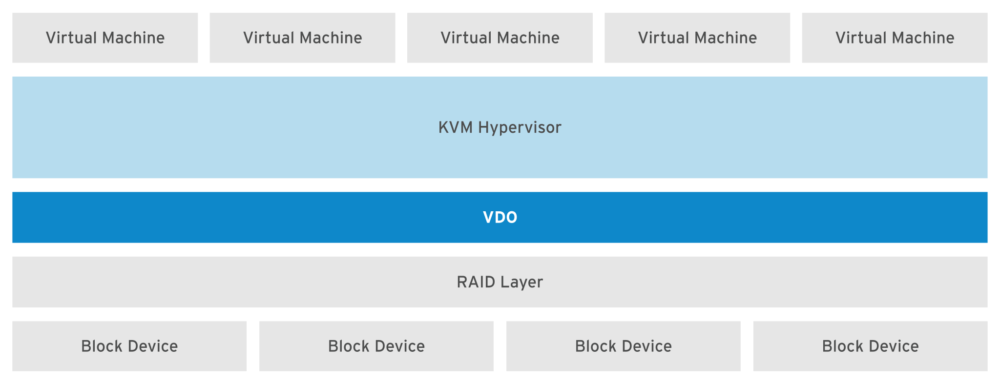

## Implementing Advanced Storage Features

### Managing Layered Storage with Stratis

#### Describing the Architecture of Stratis

-   Stratis is a new local storage-management solution for Linux.
-   Stratis is designed to make it easier to perform initial configuration of storage, make changes to the storage configuration, and use advanced storage features.
    <br>

-   **Important**

    -   Stratis is available as a Technology Preview only.
    -   Customers deploying Stratis are encouraged to provide feedback to Red Hat.
        <br>

-   Stratis runs as a service that manages pools of physical storage devices and transparently creates and manages volumes for the newly created file systems.
    <br>

-   In Stratis, file systems are built from shared pools of disk devices using a concept known as **thin provisioning**.
-   Instead of immediately allocating physical storage space to the file system when it is created, Stratis dynamically allocates that space from the pool as the file system stores more data.
-   Therefore, the file system might appear to be 1 TiB in size, but might only have 100 GiB of real storage actually allocated to it from the pool.
    <br>

-   We can create multiple pools from different storage devices.
-   From each pool, we can create one or more file systems.
-   Currently, we can create up to 224 file systems per pool.
    <br>

-   The components that make up a Stratis-managed file system are built from standard Linux components.
-   Internally, Stratis is implemented using the Device Mapper infrastructure that is also used to implement LVM, and Stratis-managed file systems are formatted using XFS.
    <br>

-   The following diagram illustrates how the elements of the Stratis storage management solution are assembled.
-   Block storage devices such as hard disks or SSDs are assigned to pools, each contributing some physical storage to the pool.
-   File systems are created from the pools, and physical storage is mapped to each file system as it is needed.
    

#### Working with Stratis Storage

-   To manage file systems with the Stratis storage management solution, install the `stratis-cli` and `stratisd` packages.
-   The `stratis-cli` package provides the `stratis` command, which sends reconfiguration requests to the `stratisd` system daemon.
-   The `stratisd` package provides the `stratisd` service, which handles reconfiguration requests and manages and monitors block devices, pools, and file systems that Stratis uses.
    <br>

-   **Warning**

    -   File systems created by Stratis should only be reconfigured with Stratis tools and commands.
        <br>

-   Stratis uses stored metadata to recognize managed pools, volumes, and file systems.
-   Manually configuring Stratis file systems with non-Stratis commands can cause the loss of that metadata and prevent Stratis from recognizing the file systems it created.

##### Installing and Enabling Stratis

-   To use Stratis, make sure that the software is installed and the `stratisd` service is running.

    -   Install `stratis-cli` and `stratisd` using the `yum install` command. <br> `$ yum install stratis-cli stratisd`
    -   Activate the `stratisd` service using the `systemctl` command. <br> `systemctl enable --now stratisd`

##### Assembling Block Storage into Stratis Pools

-   The following are common management operations performed using the Stratis storage management solution.

    -   Create pools of one or more block devices using the `stratis pool create` command.
        ```
        $ stratis pool create pool1 /dev/vdb
        ```
        Each pool is a subdirectory under the `/stratis` directory.
    -   Use the `stratis pool list` command to view the list of available pools.
        ```
        $ stratis pool list
        Name     Total Physical Size  Total Physical Used
        pool1                  5 GiB               52 MiB
        ```
        **Warning**
        -   The `stratis pool list` command is very important because it shows us how much storage space is in use (and therefore how much is still available) in the pools.
        -   If a pool runs out of storage, further data written to file systems belonging to that pool is quietly lost.
    -   Use the `stratis pool add-data` command to add additional block devices to a pool.<br> `$ stratis pool add-data pool1 /dev/vdc`
    -   Use the `stratis blockdev list` command to view the block devices of a pool.
        ```
        $ stratis blockdev list
        Pool Name  Device Node    Physical Size   State  Tier
        pool1      /dev/vdb               5 GiB  In-use  Data
        pool1      /dev/vdc               5 GiB  In-use  Data
        ```

##### Managing Stratis File Systems

-   Use the `stratis filesystem create` command to create a file system from a pool. <br> `$ stratis filesystem create pool1 fs1`
    The links to the Stratis file systems are in the `/stratis/pool1` directory.
-   Use the `stratis filesystem list` command to view the list of available file systems.
    ```
    $ stratis filesystem list
    Pool Name  Name  Used     Created            Device              UUID
      pool1      fs1   546 MiB  Sep 23 2020 13:11  /stratis/pool1/fs1  31b9363badd...
    ```
    **Warning**
    -   The `df` command will report that any new Stratis-managed XFS file systems are 1 TiB in size, no matter how much physical storage is currently allocated to the file system.
    -   Because the file system is thinly provisioned, the pool might not have enough real storage to back the entire file system, especially if other file systems in the pool use up all the available storage.
        <br>
    -   Therefore, it is possible to use up all the space in the storage pool, while `df` is still reporting that the file system has space available.
    -   If the pool has no storage available for the file system, further attempts to write to that file system might fail, resulting in data loss.
        <br>
    -   Use `stratis pool list` to monitor the remaining real storage available to the Stratis pools.
-   We can create a snapshot of a Stratis-managed file system with the `stratis filesystem snapshot` command. Snapshots are independent of the source file systems. <br> `$ stratis filesystem snapshot pool1 fs1 snapshot1`

##### Persistently Mounting Stratis File Systems

-   To ensure that the Stratis file systems are persistently mounted, edit `/etc/fstab` and specify the details of the file system.
-   The following command displays the UUID of the file system that we should use in `/etc/fstab` to identify the file system.
    ```
    $ lsblk --output=UUID /stratis/pool1/fs1
    UUID
    31b9363b-add8-4b46-a4bf-c199cd478c55
    ```
-   The following is an example entry in the `/etc/fstab` file to persistently mount a Stratis file system. This example entry is a single long line in the file. <br> `UUID=31b9363b-add8-4b46-a4bf-c199cd478c55 /dir1 xfs defaults,x-systemd.requires=stratisd.service 0 0`
    <br>
    The `x-systemd.requires=stratisd.service` mount option delays mounting the file system until after `systemd` starts the `stratisd.service` during the boot process.
    <br>

-   **Important**
    -   If we do not include the `x-systemd.requires=stratisd.service` mount option in `/etc/fstab` for each Stratis file system, the machine will fail to start properly and will abort to `emergency.target` the next time it is rebooted.

### Compressing and Deduplicating Storage with VDO

#### Describing Virtual Data Optimizer

-   Red Hat Enterprise Linux 8 includes the **Virtual Data Optimizer (VDO)** driver, which optimizes the data footprint on block devices.
-   VDO is a Linux device mapper driver that reduces disk space usage on block devices, and minimizes the replication of data, saving disk space and even increasing data throughput.
-   VDO includes two kernel modules : the `kvdo` module to transparently control data compression, and the `uds` module for deduplication.
    <br>

-   The VDO layer is placed on top of an existing block storage device, such as a RAID device or a local disk.
-   Those block devices can also be encrypted devices.
-   The storage layers, such as LVM logical volumes and file systems, are placed on top of a VDO device.
-   The following diagram shows the placement of VDO in an infrastructure consisting of KVM virtual machines that are using optimized storage devices.
    

-   VDO applies three phases to data in the following order to reduce the footprint on storage devices :

    1. **Zero-Block Elimination** filters out data blocks that contain only zeroes (0) and records the information of those blocks only in the metadata. The nonzero data blocks are then passed to the next phase of processing. This phase enables the thin provisioning feature in the VDO devices.
       <br>
    2. **Deduplication** eliminates redundant data blocks. When we create multiple copies of the same data, VDO detects the duplicate data blocks and updates the metadata to use those duplicate blocks as references to the original data block without creating redundant data blocks. The **universal deduplication service (UDS)** kernel module checks redundancy of the data through the metadata it maintains. This kernel module ships as part of the VDO.
       <br>
    3. **Compression** is the last phase. The `kvdo` kernel module compresses the data blocks using LZ4 compression and groups them on 4 KB blocks.

#### Implementing Virtual Data Optimizer

-   The logical devices that we create using VDO are called VDO volumes.
-   VDO volumes are similar to disk partitions; we can format the volumes with the desired file-system type and mount it like a regular file system.
-   We can also use a VDO volume as an LVM physical volume.
    <br>

-   To create a VDO volume, specify a block device and the name of the logical device that VDO presents to the user.
-   We can optionally specify the logical size of the VDO volume.
-   The logical size of the VDO volume can be more than the physical size of the actual block device.
    <br>

-   Because the VDO volumes are thinly provisioned, users can only see the logical space in use and are unaware of the actual physical space available.
-   If we do not specify the logical size while creating the volume, VDO assumes the actual physical size as the logical size of the volume.
-   This 1:1 ratio of mapping logical size to physical size gives better performance but provides less efficient use of storage space.
-   Based on our infrastructure requirements, we should prioritize either performance or space efficiency.
    <br>

-   When the logical size of a VDO volume is more than the actual physical size, we should proactively monitor the volume statistics to view the actual usage using the `vdostats --verbose` command.

##### Enabling VDO

-   Install the `vdo` and `kmod-kvdo` packages to enable VDO in the system.<br> `$ yum install vdo kmod-kvdo`

##### Creating a VDO Volume

-   To create a VDO volume, run the `vdo create` command. <br> `$ vdo create --name=vdo1 --device=/dev/vdd --vdoLogicalSize=50G`
    If we omit the logical size, the resulting VDO volume gets the same size as its physical device.
    <br>
    When the VDO volume is in place, we can format it with the file-system type of our choice and mount it under the file-system hierarchy on our system.

##### Analyzing a VDO Volume

-   To analyze a VDO volume, run the `vdo status` command.
-   This command displays a report on the VDO system, and the status of the VDO volume in YAML format.
-   It also displays attributes of the VDO volume.
-   Use the `--name= option` to specify the name of a particular volume.
-   If we omit the name of the specific volume, the output of the `vdo status` command displays the status of all the VDO volumes.
    ```
    $ vdo status --name=vdo1
    ...output omitted...
    ```
    The `$ vdo list` command displays the list of VDO volumes that are currently started.
    We can start and stop a VDO volume using the `$ vdo start` and `$ vdo stop` commands, respectively.
