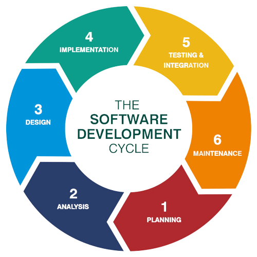
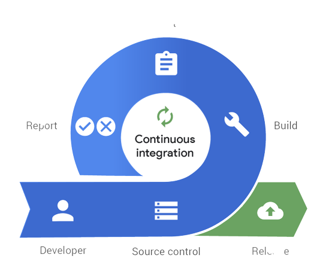
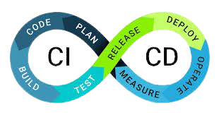
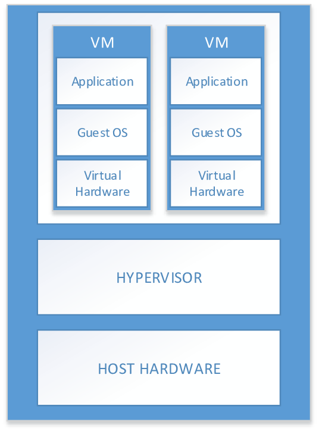
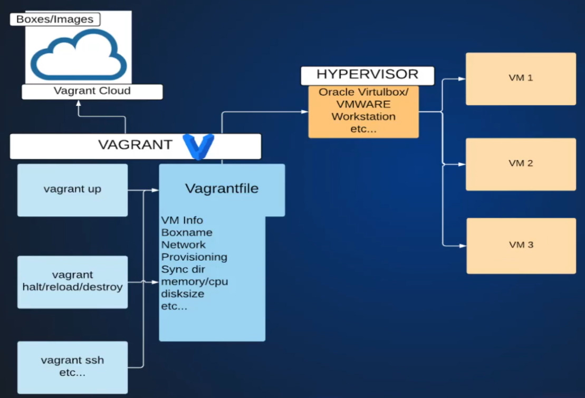
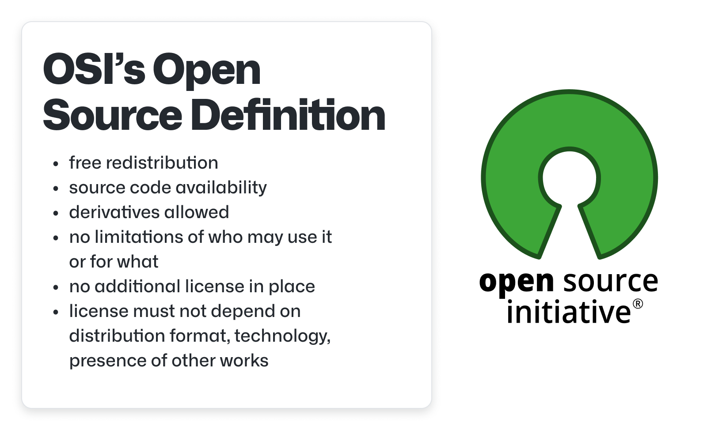

# Learning DevOps

This is going to be my journey to learn Devops from very basics to advanced level. I will try to share each and every step of it so it can also benefit others.

I am making this repo so that you don't have to go and search at different different places and you can find every topic here only.

I will try to provide complete notes and practical projects in complete detailed and in an easy to understand manner.

---

# Contents

---

- [Learning DevOps](#learning-devops)
- [Contents](#contents)
- [1. Introduction to DevOps](#1-introduction-to-devops)
  - [Transforming an Idea into Application](#transforming-an-idea-into-application)
    - [Software Development Life Cycle (SLDC)](#software-development-life-cycle-sldc)
      - [Models in SLDC](#models-in-sldc)
    - [DevOps Lifecycle](#devops-lifecycle)
    - [Continous Integration (CI)](#continous-integration-ci)
    - [Continous Delivery (CD)](#continous-delivery-cd)
- [2. Virtualization](#2-virtualization)
    - [Life before Virtualization](#life-before-virtualization)
  - [Virtualization](#virtualization)
  - [Basic Terminologies](#basic-terminologies)
- [3. Vagrant](#3-vagrant)
  - [VM Management Problems](#vm-management-problems)
  - [Vagrant for VMs](#vagrant-for-vms)
  - [Vagrant Architecture](#vagrant-architecture)
- [4. Basics of Linux](#4-basics-of-linux)
  - [Open Source](#open-source)
  - [Linux History](#linux-history)
  - [Linux principles](#linux-principles)
  - [Why Linux?](#why-linux)
  - [Linux Architecture](#linux-architecture)
  - [Popular Linux distros](#popular-linux-distros)
- [5. Bash Scripting](#5-bash-scripting)
- [6. Initial Server Setup with Ubuntu 18.04](#6-initial-server-setup-with-ubuntu-1804)
  - [Introduction](#introduction)
- [7. UFW Essentials: Common Firewall Rules and Commands](#7-ufw-essentials-common-firewall-rules-and-commands)
- [8. Apache Web Server](#8-apache-web-server)
  - [Introduction](#introduction-1)
- [9. Nginx Web Server](#9-nginx-web-server)
  - [Introduction](#introduction-2)
- [10. Dockers and Containers](#10-dockers-and-containers)
- [11. Cloud Computing and AWS](#11-cloud-computing-and-aws)
- [Contents](#contents-1)
- [Introduction to Cloud Computing](#introduction-to-cloud-computing)
  - [What is Cloud Computing ?](#what-is-cloud-computing-)
  - [Who is using Cloud Computing ?](#who-is-using-cloud-computing-)
  - [Benefits of Cloud Computing](#benefits-of-cloud-computing)
    - [Agility](#agility)
    - [Elasticity](#elasticity)
    - [Cost Savings](#cost-savings)
    - [Deploy globally in minutes](#deploy-globally-in-minutes)
- [Types of Cloud Computing](#types-of-cloud-computing)
  - [Infrastructure as a Service (IaaS)](#infrastructure-as-a-service-iaas)
  - [Platform as a Service (PaaS)](#platform-as-a-service-paas)
  - [Software as a Service (SaaS)](#software-as-a-service-saas)

---

# 1. Introduction to DevOps

## Transforming an Idea into Application

### Software Development Life Cycle (SLDC)

Development of any software comes up with a life cycle of certain steps which are executed in a cyclic manner.
The steps are:

1. Requirement Gathering
2. Planning
3. Designing
4. Development
5. Testing
6. Deploy and Maintain
 

#### Models in SLDC

-   Waterfall Model - Each phase begins only when previous is completed.
-   Agile Model - Work is divided into smallet lists of several tasks, several iterations of SLDC for each list
-   Spiral Model
-   Big Bang Model
-   etc...

### DevOps Lifecycle

1. Code - Developers commit code
2. Code Test - Unit and Integration test
3. Code Analysis - Vulnerability and best practices analysis
4. Delivery - Deploy changes to staging
5. DB/sec changes - Every other ops changes
6. Software Testing - QA / Functional tests
7. Deploy to production - Go live, user traffic diverted to new changes
8. User Approval - User feedback
9. Keep Monitoring

### Continous Integration (CI)

Continous Integration is the practice of automating the integration of code changes from multiple contributors into a single software project.

In simpler words, it is the process that automates the build and tests after every commit and sends notifications to developers accordingly.
If the code committed by developer is passed by automated tested the developer is notified and if it doesn't the developer is notified and he commits again and the issues are fixed.

### Continous Delivery (CD)

Continous Delivery is a strategy for software releases wherein any code commit that passes the automated testing phase is automatically released into the production environment, making changes that are visible to the software's users.

In simpler words, it is the process that automates the deployment process so that every deployment request generated by CI is fulfilled.
It is basically the extension of CI.

# 2. Virtualization

### Life before Virtualization

-   To run App/Services we needed servers
-   Physical Computer (Servers in Data Centers)
-   One service - one server
-   Servers were always overprovisioned
-   Servers resources were mostly underutilized
-   Huge capital expenditure and operational expenditure

## Virtualization

-   Allows one computer to run multiple OS
-   Partition physical resource in virtual resources
-   Virtual machines run in completely isolated manner, so no more one server - one service rule

## Basic Terminologies

1. **Host OS** => OS of the physical machine in which virtualization is going to take place.
2. **Guest OS** => Os of the Virtual Machine.
3. **Virtual Machine (VM)** => The machine which is virtual running on anothe machine(called host machine) and is isolated from all other virtual machines running on the same host.
4. **Snapshot** => Way of taking a backup of VM.
5. **Hypervisor** => Tool or software which enables the Virtualization and lets us create a VM.

Hypervisor is of 2 types
: 1. **Type 1** - Runs as a base OS, used for production. Eg: VMWare ESXI, XEN Hypervisor
: 2. **Type 2** - Runs as a software, ideal for learning and testing purposes. Eg: Oracle Virtualbox, VMWare Server / Player.

# 3. Vagrant

It is an automation tool to manage VM lifecycle

## VM Management Problems

-   OS installations
-   Time consuming
-   Manual Setup
-   Tough replication for multi VM
-   Documentations for multi VM

## Vagrant for VMs

-   No OS installations
-   VM setupp through images (vagrant boxes)
-   Images (Boxes available in Vagrant Cloud)
-   Manage VM's with a file (Vagrant file)
-   VM changes automatic through Vagrantfile
-   Vagrant commands to manage VMs
-   Provisioning VM/Executing commands and scripts

## Vagrant Architecture

To study vagrant in more detail with its practical implementation refer to the [vagrant branch](https://github.com/CoderChirag/DevOps-Learning/tree/vagrant)

# 4. Basics of Linux

## Open Source

Open source software is a software which have its entire source code open, and anybody can inspect, modify, and enhance the software.

## Linux History

-   **1984**: The GNU Project and the Free Software Foundation
    -   Creates open source version of UNIX utilities
    -   Creates the General Public License (GPL)
        -   Software license enforcing open source principles
-   **1991**: Linus Torvalds
    -   Creates open source, UNIX-like kernel, release under the GPL
    -   Ports some GNU utilities, solicits assistance online
-   **Today**:
    -   Linux kernel + GNU utilities = complete, open source, UNIX-like operating system
        -   Packaged for targeted audiences and distributions

## Linux principles

-   Everything is a file (including hardware)
-   Small Single purpose Programs
-   Ability to chain programs together for complex operations
-   Avoid Captive User Interfaces (GUI which waits for user interaction)
-   Configuration data stored in files

## Why Linux?

-   Opensource
-   Community Support
-   Support Wide Variety of hardware
-   Customization
-   Most Servers run on Linux
-   Automation
-   Security

## Linux Architecture

## Popular Linux distros

-   **Desktop based**
    -   Ubuntu Linux
    -   Linux Mint
    -   Arch Linux
    -   Fedora
    -   Debian
    -   OpenSuse
-   **Server based**
    -   Red Hat Enterprise Linux
    -   Ubuntu Server
    -   Centos
    -   SUSE Enterprise Linux

For more detailed study of linux refer to the [Linux branch](https://github.com/CoderChirag/DevOps-Learning/tree/linux)

# 5. Bash Scripting

So now that we have learnt about linux in detailed by referring to the [Linux branch](https://github.com/CoderChirag/DevOps-Learning/tree/linux), so now we can move ahead to **bash scripting**.
**Bash Scripting** is a process of writing scripts in linux to automate the day-to-day tasks in linux.
For the detailed study of **bash scripting**, refer to the [bash-scripting branch](https://github.com/CoderChirag/DevOps-Learning/tree/bash-scripting).

# 6. Initial Server Setup with Ubuntu 18.04

## Introduction

-   After creating a new Ubuntu 18.04 server (on Physical Machine, **not** on vagrant VM), you should take some configuration steps as part of an initial server setup in order to increase security and facilitate management later.
-   For the details of the Initial Server Setup when using a physical machine instead of a Vagrant VM, go to [ubuntu-server-setup branch](https://github.com/CoderChirag/DevOps-Learning/tree/ubuntu-server-setup)

# 7. UFW Essentials: Common Firewall Rules and Commands

-   **UFW (uncomplicated firewall)** is a firewall configuration tool that runs on top of `iptables`, included by default within Ubuntu distributions.
-   It provides a streamlined interface for configuring common firewall use cases via the command line.

For detailed study of _UFW_ refer to the [ufw branch](https://github.com/CoderChirag/DevOps-Learning/tree/ufw)

# 8. Apache Web Server

## Introduction

-   The Apache HTTP server is the most widely-used web server in the world.
-   It provides many powerful features including dynamically loadable modules, robust media support, and extensive integration with other popular software.

For more details about apache and its implementation, go to [apache2 branch](https://github.com/CoderChirag/DevOps-Learning/tree/apache2)

# 9. Nginx Web Server

## Introduction

-   Nginx is one of the most popular web servers in the world and is responsible for hosting some of the largest and highest-traffic sites on the internet.
-   It is more resource-friendly than Apache in most cases and can be used as a web server or reverse proxy.

For more details about nginx and its implementation, go to [nginx branch](https://github.com/CoderChirag/DevOps-Learning/tree/nginx)

# 10. Dockers and Containers

For the detailed study about Containers and Dockers, refer to the [docker branch](https://github.com/CoderChirag/DevOps-Learning/tree/docker).

# 11. Cloud Computing and AWS

# Contents

---

- [Learning DevOps](#learning-devops)
- [Contents](#contents)
- [1. Introduction to DevOps](#1-introduction-to-devops)
  - [Transforming an Idea into Application](#transforming-an-idea-into-application)
    - [Software Development Life Cycle (SLDC)](#software-development-life-cycle-sldc)
      - [Models in SLDC](#models-in-sldc)
    - [DevOps Lifecycle](#devops-lifecycle)
    - [Continous Integration (CI)](#continous-integration-ci)
    - [Continous Delivery (CD)](#continous-delivery-cd)
- [2. Virtualization](#2-virtualization)
    - [Life before Virtualization](#life-before-virtualization)
  - [Virtualization](#virtualization)
  - [Basic Terminologies](#basic-terminologies)
- [3. Vagrant](#3-vagrant)
  - [VM Management Problems](#vm-management-problems)
  - [Vagrant for VMs](#vagrant-for-vms)
  - [Vagrant Architecture](#vagrant-architecture)
- [4. Basics of Linux](#4-basics-of-linux)
  - [Open Source](#open-source)
  - [Linux History](#linux-history)
  - [Linux principles](#linux-principles)
  - [Why Linux?](#why-linux)
  - [Linux Architecture](#linux-architecture)
  - [Popular Linux distros](#popular-linux-distros)
- [5. Bash Scripting](#5-bash-scripting)
- [6. Initial Server Setup with Ubuntu 18.04](#6-initial-server-setup-with-ubuntu-1804)
  - [Introduction](#introduction)
- [7. UFW Essentials: Common Firewall Rules and Commands](#7-ufw-essentials-common-firewall-rules-and-commands)
- [8. Apache Web Server](#8-apache-web-server)
  - [Introduction](#introduction-1)
- [9. Nginx Web Server](#9-nginx-web-server)
  - [Introduction](#introduction-2)
- [10. Dockers and Containers](#10-dockers-and-containers)
- [11. Cloud Computing and AWS](#11-cloud-computing-and-aws)
- [Contents](#contents-1)
- [Introduction to Cloud Computing](#introduction-to-cloud-computing)
  - [What is Cloud Computing ?](#what-is-cloud-computing-)
  - [Who is using Cloud Computing ?](#who-is-using-cloud-computing-)
  - [Benefits of Cloud Computing](#benefits-of-cloud-computing)
    - [Agility](#agility)
    - [Elasticity](#elasticity)
    - [Cost Savings](#cost-savings)
    - [Deploy globally in minutes](#deploy-globally-in-minutes)
- [Types of Cloud Computing](#types-of-cloud-computing)
  - [Infrastructure as a Service (IaaS)](#infrastructure-as-a-service-iaas)
  - [Platform as a Service (PaaS)](#platform-as-a-service-paas)
  - [Software as a Service (SaaS)](#software-as-a-service-saas)

---

# Introduction to Cloud Computing

## What is Cloud Computing ?

Cloud computing is the on-demand delivery of IT resources over the Internet with pay-as-you-go pricing. Instead of buying, owning, and maintaining physical data centers and servers, you can access technology services, such as computing power, storage, and databases, on an as-needed basis from a cloud provider like Amazon Web Services (AWS).

## Who is using Cloud Computing ?

Organizations of every type, size, and industry are using the cloud for a wide variety of use cases, such as data backup, disaster recovery, email, virtual desktops, software development and testing, big data analytics, and customer-facing web applications. For example, healthcare companies are using the cloud to develop more personalized treatments for patients. Financial services companies are using the cloud to power real-time fraud detection and prevention. And video game makers are using the cloud to deliver online games to millions of players around the world.

## Benefits of Cloud Computing

### Agility

The cloud gives us easy access to a broad range of technologies so that we can innovate faster and build nearly anything that we can imagine. We can quickly spin up resources as we need them–from infrastructure services, such as compute, storage, and databases, to Internet of Things, machine learning, data lakes and analytics, and much more.

We can deploy technology services in a matter of minutes, and get from idea to implementation several orders of magnitude faster than before. This gives us the freedom to experiment, test new ideas to differentiate customer experiences, and transform our business.

### Elasticity

With cloud computing, we don’t have to over-provision resources up front to handle peak levels of business activity in the future. Instead, we provision the amount of resources that we actually need. We can scale these resources up or down to instantly grow and shrink capacity as our business needs change.

### Cost Savings

The cloud allows us to trade fixed expenses (such as data centers and physical servers) for variable expenses, and only pay for IT as you consume it. Plus, the variable expenses are much lower than what we would pay to do it ourself because of the economies of scale.

### Deploy globally in minutes

With the cloud, we can expand to new geographic regions and deploy globally in minutes. For example, AWS has infrastructure all over the world, so we can deploy our application in multiple physical locations with just a few clicks. Putting applications in closer proximity to end users reduces latency and improves their experience.

# Types of Cloud Computing

The three main types of cloud computing include **Infrastructure as a Service**, **Platform as a Service**, and **Software as a Service**. Each type of cloud computing provides different levels of control, flexibility, and management so that we can select the right set of services for our needs.

## Infrastructure as a Service (IaaS)

IaaS contains the basic building blocks for cloud IT. It typically provides access to networking features, computers (virtual or on dedicated hardware), and data storage space. IaaS gives us the highest level of flexibility and management control over our IT resources. It is most similar to the existing IT resources with which many IT departments and developers are familiar.

## Platform as a Service (PaaS)

PaaS removes the need for us to manage underlying infrastructure (usually hardware and operating systems), and allows us to focus on the deployment and management of our applications. This helps us be more efficient as we don’t need to worry about resource procurement, capacity planning, software maintenance, patching, or any of the other undifferentiated heavy lifting involved in running our application.

## Software as a Service (SaaS)

SaaS provides us with a complete product that is run and managed by the service provider. In most cases, people referring to SaaS are referring to end-user applications (such as web-based email). With a SaaS offering, we don’t have to think about how the service is maintained or how the underlying infrastructure is managed. We only need to think about how we will use that particular software.

For the detailed learning of **AWS** refer to the [AWS Branch](https://github.com/CoderChirag/DevOps-Learning/tree/aws)
