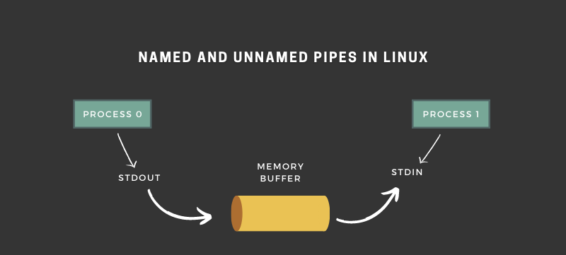
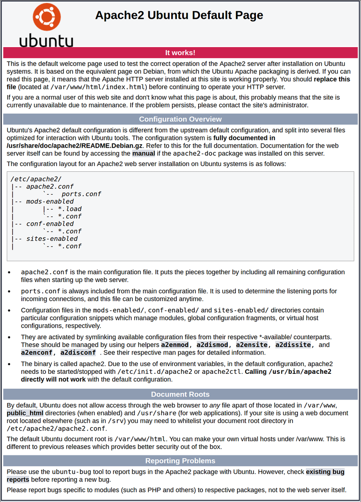

# Contents

---

- [Contents](#contents)
- [Basics of Linux](#basics-of-linux)
  - [Introduction](#introduction)
    - [Open Source](#open-source)
    - [Linux History](#linux-history)
    - [Linux principles](#linux-principles)
    - [Why Linux?](#why-linux)
    - [Linux Architecture](#linux-architecture)
    - [Popular Linux distros](#popular-linux-distros)
    - [Some Important Directories](#some-important-directories)
  - [Basic File Directory and Related Commands](#basic-file-directory-and-related-commands)
  - [Date Command](#date-command)
    - [Syntax](#syntax)
    - [options with Examples :](#options-with-examples-)
    - [Format Specifiers](#format-specifiers)
  - [Matching File Names with Shell Expansions](#matching-file-names-with-shell-expansions)
    - [Command-line Expansions](#command-line-expansions)
      - [Pattern Matching](#pattern-matching)
      - [Tilde Expansion](#tilde-expansion)
      - [Brace Expansion](#brace-expansion)
      - [Variable Expansion](#variable-expansion)
      - [Command Substitution](#command-substitution)
  - [Getting Help in Linux](#getting-help-in-linux)
    - [Man Command](#man-command)
      - [Introduction](#introduction-1)
      - [Navigate and Search Man Pages](#navigate-and-search-man-pages)
      - [Reading Man pages](#reading-man-pages)
      - [Searching for man pages by keyword](#searching-for-man-pages-by-keyword)
  - [Vim Editor](#vim-editor)
    - [Command Mode](#command-mode)
  - [File Types](#file-types)
    - [Symbolic links](#symbolic-links)
      - [Soft link](#soft-link)
      - [Hard link](#hard-link)
      - [Creating symbolic links](#creating-symbolic-links)
  - [Filters](#filters)
    - [grep](#grep)
    - [less](#less)
    - [more](#more)
    - [head](#head)
    - [tail](#tail)
    - [cut](#cut)
    - [awk](#awk)
      - [Built-In Variables in Awk](#built-in-variables-in-awk)
    - [sed](#sed)
  - [Redirections](#redirections)
  - [Pipelines](#pipelines)
    - [tee](#tee)
  - [Users and Groups](#users-and-groups)
    - [Users](#users)
      - [Some Important Points](#some-important-points)
      - [Types of User](#types-of-user)
      - [id Command](#id-command)
      - [`/etc/passwd` file](#etcpasswd-file)
    - [Groups](#groups)
      - [`/etc/group` file](#etcgroup-file)
      - [Primary Groups and Supplementary Groups](#primary-groups-and-supplementary-groups)
    - [Switching users](#switching-users)
    - [Running Commands with Sudo](#running-commands-with-sudo)
      - [Getting an Interactive Root Shell with Sudo](#getting-an-interactive-root-shell-with-sudo)
      - [Configuring Sudo](#configuring-sudo)
    - [Managing Local User Accounts](#managing-local-user-accounts)
      - [Creating & Modifying Users](#creating--modifying-users)
      - [Deleting Users](#deleting-users)
      - [Setting Passwords](#setting-passwords)
    - [Managing Local Groups](#managing-local-groups)
      - [Creating and Modifying groups](#creating-and-modifying-groups)
      - [Deleting Groups](#deleting-groups)
    - [Managing User Passwords](#managing-user-passwords)
      - [Shadow Passwords and Password Policy](#shadow-passwords-and-password-policy)
      - [Format of an Encrypted Password](#format-of-an-encrypted-password)
      - [Configuring Password Aging](#configuring-password-aging)
    - [Additional commands](#additional-commands)
  - [File Permissions](#file-permissions)
    - [Changing Permissions](#changing-permissions)
      - [Symbolic Method](#symbolic-method)
      - [Numeric Method](#numeric-method)
    - [Changing ownership](#changing-ownership)
    - [Special Permissions](#special-permissions)
      - [setuid permission](#setuid-permission)
      - [setgid permission](#setgid-permission)
      - [sticky permission](#sticky-permission)
    - [Default File Permissions - umask](#default-file-permissions---umask)
  - [Sudo](#sudo)
  - [Package Management](#package-management)
    - [Basic way of installing any package in CentOS](#basic-way-of-installing-any-package-in-centos)
    - [yum](#yum)
  - [Processes](#processes)
    - [Definition of a Process](#definition-of-a-process)
    - [Process States](#process-states)
    - [Listing Processes](#listing-processes)
      - [ps Command](#ps-command)
      - [top Command](#top-command)
    - [Controlling Jobs](#controlling-jobs)
      - [Describing Jobs and Sessions](#describing-jobs-and-sessions)
      - [Running Jobs in the Background](#running-jobs-in-the-background)
    - [Killing Processes](#killing-processes)
    - [Real-time Process Monitoring](#real-time-process-monitoring)
  - [Controling Services and Daemons](#controling-services-and-daemons)
    - [Introduction to `systemd`](#introduction-to-systemd)
    - [Describing Service Units](#describing-service-units)
    - [Listing Service Units](#listing-service-units)
    - [Viewing Service States](#viewing-service-states)
    - [Verifying the Status of a Service](#verifying-the-status-of-a-service)
    - [Controlling System Services](#controlling-system-services)
  - [Configuring and Securing SSH](#configuring-and-securing-ssh)
    - [OpenSSH](#openssh)
    - [Identifying Remote Users](#identifying-remote-users)
    - [SSH host keys](#ssh-host-keys)
      - [SSH Known Hosts Key Management](#ssh-known-hosts-key-management)
    - [Configuring SSH Key-based Authentication](#configuring-ssh-key-based-authentication)
      - [Generating SSH Keys](#generating-ssh-keys)
      - [Sharing the Public Key](#sharing-the-public-key)
      - [Using ssh-agent for Non-interactive Authentication](#using-ssh-agent-for-non-interactive-authentication)
    - [Customizing OpenSSH Service Configuration](#customizing-openssh-service-configuration)
      - [Configuring the OpenSSH Server](#configuring-the-openssh-server)
      - [Prohibit the Superuser From Logging in Using SSH](#prohibit-the-superuser-from-logging-in-using-ssh)
      - [Prohibiting Password-Based Authentication for SSH](#prohibiting-password-based-authentication-for-ssh)
  - [Analyzing and Storing Logs](#analyzing-and-storing-logs)
    - [Describing System Log Architecture](#describing-system-log-architecture)
      - [System Logging](#system-logging)
    - [Reviewing Syslog Files](#reviewing-syslog-files)
      - [Logging Events to the System](#logging-events-to-the-system)
      - [Sample Rules of Rsyslog](#sample-rules-of-rsyslog)
      - [Log File Rotation](#log-file-rotation)
      - [Analyzing a Syslog Entry](#analyzing-a-syslog-entry)
      - [Monitoring Logs](#monitoring-logs)
      - [Sending Syslog Messages Manually](#sending-syslog-messages-manually)
    - [Reviewing System Journal Entries](#reviewing-system-journal-entries)
      - [Finding Events](#finding-events)
    - [Preserving the System Journal](#preserving-the-system-journal)
    - [Maintaining Accurate Time](#maintaining-accurate-time)
      - [Setting Local Clocks and Time Zones](#setting-local-clocks-and-time-zones)
  - [Archiving Data](#archiving-data)
  - [Ubuntu Commands](#ubuntu-commands)
  - [Basic Networking Commands](#basic-networking-commands)
    - [Protocols & Port Numbers](#protocols--port-numbers)
    - [ifconfig](#ifconfig)
    - [ip addr show](#ip-addr-show)
    - [ping](#ping)
    - [netstat](#netstat)
    - [ss](#ss)
    - [nmap](#nmap)
    - [dig](#dig)
    - [route](#route)
  - [Server Management in Linux](#server-management-in-linux)
    - [Setting up a website in CentOS7](#setting-up-a-website-in-centos7)
    - [Automating the Static Website Setup - Infrastucture as a Code (IAAC)](#automating-the-static-website-setup---infrastucture-as-a-code-iaac)
    - [Setting up a Wordpress Website using LAMP (Linux, Apache, MySQL, PHP) Stack](#setting-up-a-wordpress-website-using-lamp-linux-apache-mysql-php-stack)
      - [Configuring VM and Installing Dependencies](#configuring-vm-and-installing-dependencies)
      - [Installing WordPress](#installing-wordpress)
      - [Configuring Apache for WordPress](#configuring-apache-for-wordpress)
      - [Configuring database](#configuring-database)
      - [Configuring Wordpress to connect to the database](#configuring-wordpress-to-connect-to-the-database)
    - [Automating Wordpress Website Setup using IAAC](#automating-wordpress-website-setup-using-iaac)
    - [Setting up a Nodejs Application](#setting-up-a-nodejs-application)
      - [Using Apache2](#using-apache2)
        - [Configuring VM](#configuring-vm)
        - [Installing and Starting Apache server](#installing-and-starting-apache-server)
        - [Installing Nodejs](#installing-nodejs)
        - [Setting up MongoDb database](#setting-up-mongodb-database)
          - [Installing MongoDB](#installing-mongodb)
          - [Starting the MongoDB Service and Testing the Database](#starting-the-mongodb-service-and-testing-the-database)
        - [Setting up the Node.js application](#setting-up-the-nodejs-application)
          - [Installing PM2](#installing-pm2)
          - [Configuring Apche Server for Node.js](#configuring-apche-server-for-nodejs)

---

# Basics of Linux

## Introduction

### Open Source

Open source software is a software which have its entire source code open, and anybody can inspect, modify, and enhance the software.

<div align="center">


</div>

### Linux History

-   **1984**: The GNU Project and the Free Software Foundation
    -   Creates open source version of UNIX utilities
    -   Creates the General Public License (GPL)
        -   Software license enforcing open source principles
-   **1991**: Linus Torvalds
    -   Creates open source, UNIX-like kernel, release under the GPL
    -   Ports some GNU utilities, solicits assistance online
-   **Today**:
    -   Linux kernel + GNU utilities = complete, open source, UNIX-like operating system
        -   Packaged for targeted audiences and distributions

### Linux principles

-   Everything is a file (including hardware)
-   Small Single purpose Programs
-   Ability to chain programs together for complex operations
-   Avoid Captive User Interfaces (GUI which waits for user interaction)
-   Configuration data stored in files

### Why Linux?

-   Opensource
-   Community Support
-   Support Wide Variety of hardware
-   Customization
-   Most Servers run on Linux
-   Automation
-   Security

### Linux Architecture

<div align="center">


</div>

### Popular Linux distros

-   **Desktop based**
    -   Ubuntu Linux
    -   Linux Mint
    -   Arch Linux
    -   Fedora
    -   Debian
    -   OpenSuse
-   **Server based**
    -   Red Hat Enterprise Linux
    -   Ubuntu Server
    -   Centos
    -   SUSE Enterprise Linux

### Some Important Directories

-   **Home Directories**: `/root`, `/home/username`
-   **User Executables**: `/bin`, `/usr/bin`, `usr/local/bin`
-   **System Executables**: `/sbin`, `/usr/sbin`, `/usr/local/sbin`
-   **Other Mountpoints**: `/media`, `/mnt`
-   **Configuration**: `/etc`
-   **Temporary Files**: `/tmp`
-   **Kernels and Bootloader**: `/boot`
-   **Server Data**: `/var`, `/srv`
-   **System Information**: `/proc`, `/sys`
-   **Shared Libraries**: `/lib`, `/usr/lib`, `/usr/local/lib`

## Basic File Directory and Related Commands

-   `$ whoami` - shows the current user
-   `$ pwd` - present working directory
-   `$ ls <filename>` - list files from current directory
    -   `-l` : long listing => `<filetype><permissions>. <link_count> <user_owner> <group_owner> <block_size> <last_modification_date&time> <filename>`
    -   `-t` : sort based on last updated
    -   `-r` : reverse sort
    -   `-R` : recursive
    -   `-h` : human readable format for the block size
    -   `-a`: all
-   `$ du <filename>` - Shows the disk usage of files and directories on a system. By default the size is in Kb.
    -   `-a` : List all files and directories size
    -   `-h` : Human readable format
    -   `-c` : Display grand total in the output
    -   `-s` : Display only total
    -   `-0/td>`: End output with null byte
    -   `--block-size=<size>` : Specify block size
    -   `--time` : display time modification
-   `file <filename>` : scans the beginning of a file's contents and displays what type it is.
-   `$ cat <filename>` - view the contents of a file
-   `$ sudo -i` - switch to root user
-   `$ cd <path>` - change directory
-   `$ mkdir [-p|--parents: no error if existing] <dirname>` - makes new directory
-   `$ touch <filename>` - makes new file
-   `$ touch file1{1..10}.txt` - makes 10 new files
-   `$ cp [-r|-R|--recursive: copy recursively] <src> <dest>` - copying files
-   `mv <src> <dest>` - move or rename files
-   `rm [-r|-R|--recursive: recursive] [-f|--force: force] <filename>` - remove file
-   `wc [-c: byte counts] [-m: char counts] [-l: lines count] [-L: max line length] [-w: words counts]` - print newline, word, and bytte counts for each file

## Date Command

-   `date` command is used to display the system date and time.
-   `date` command is also used to set date and time of the system.
-   By default the date command displays the date in the time zone on which unix/linux operating system is configured.
-   You must be the super-user (root) to change the date and time.

### Syntax

-   `$ date [OPTION]... [+++FORMAT]`

### options with Examples :

1. `date (no option)` : With no options, the date command displays the current date and time, including the abbreviated day name, abbreviated month name, day of the month, the time separated by colons, the time zone name, and the year.
    ```
    $ date
    Wed Jun  1 13:41:00 UTC 2022
    ```
2. `-u|--utc|--universal` : Displays the time in GMT(Greenwich Mean Time)/UTC(Coordinated Universal Time )time zone.
    ```
    $ date -u
    Wed Jun  1 13:42:53 UTC 2022
    ```
3. `-d|--date` : Displays the given date string in the format of date. But this will not affect the system’s actual date and time value.Rather it uses the date and time given in the form of string.

    ```
    $ date --date="2/02/2010"
    Tue Feb  2 00:00:00 UTC 2010

    $ date --date="Feb 2 2010"
    Tue Feb  2 00:00:00 UTC 2010

    # Past Dates
    $ date --date="2 year ago"
    Mon Jun  1 13:48:30 UTC 2020

    $ date --date="yesterday"
    Tue May 31 13:48:35 UTC 2022

    $ date --date="10 sec ago"
    Wed Jun  1 13:50:32 UTC 2022

    # Future Dates
    $ date --date="tomorrow"
    Thu Jun  2 13:48:46 UTC 2022

    $ date --date="next week"
    Wed Jun  8 13:51:15 UTC 2022

    $ date --date="2 day"
    Fri Jun  3 13:51:38 UTC 2022
    ```

4. `-s|--set` : To set the system date and time.
    ```
    $ date --set="Tue Nov 13 15:23:34 PDT 2018"
    Tue Nov 13 15:23:34 PDT 2018
    ```

### Format Specifiers

```
%D: Display date as mm/dd/yy.
%r: Displat time in 12-Hour Format
%d: Display the day of the month (01 to 31).
%a: Displays the abbreviated name for weekdays (Sun to Sat).
%A: Displays full weekdays (Sunday to Saturday).
%h: Displays abbreviated month name (Jan to Dec).
%b: Displays abbreviated month name (Jan to Dec).
%B: Displays full month name(January to December).
%m: Displays the month of year (01 to 12).
%y: Displays last two digits of the year(00 to 99).
%Y: Display four-digit year.
%T: Display the time in 24 hour format as HH:MM:SS.
%H: Display the hour.
%M: Display the minute.
%S: Display the seconds.
```

Examples :

```
$ date "+%D"
10/11/17

$ date "+%D %T"
10/11/17 16:13:27

$ date "+%Y-%m-%d"
2017-10-11

$ date "+%Y/%m/%d"
2017/10/11

$ date "+%A %B %d %T %y"
Thursday October 07:54:29 12 17
```

## Matching File Names with Shell Expansions

### Command-line Expansions

The Bash shell has multiple ways of expanding a command line including **pattern matching**, **home directory expansion**, **string expansion**, and **variable substitution**. Perhaps the most powerful of these is the **path name-matching capability**, historically called **globbing**.
The **Bash globbing** feature, sometimes called **“wildcards”**, makes managing large numbers of files easier. Using metacharacters that “expand” to match file and path names being sought, commands perform on a focused set of files at once.

#### Pattern Matching

**Globbing** is a shell command-parsing operation that expands a wildcard pattern into a list of matching path names. Command-line metacharacters are replaced by the match list prior to command execution. Patterns that do not return matches display the original pattern request as literal text. The following are common metacharacters and pattern classes.

| Pattern      | Matches                                                                                                    |
| ------------ | ---------------------------------------------------------------------------------------------------------- |
| \*           | Any string of zero or more characters                                                                      |
| ?            | Any single character                                                                                       |
| [abc...]     | Any one character in the enclosed class (between the square brackets)                                      |
| [!abc...]    | Any one character not in the enclosed class                                                                |
| [^abc...]    | Begins with any one character in the enclosed class                                                        |
| \[[:alpha:]] | Any alphabetic character                                                                                   |
| \[[:lower:]] | Any lowercase character                                                                                    |
| \[[:upper]]  | Any uppercase letter                                                                                       |
| \[[:alnum:]] | Any alphabetic character or digit                                                                          |
| \[[:punct:]] | Any printable character not a space or alphanumeric                                                        |
| \[[:digit:]] | Any single digit from 0 to 9                                                                               |
| \[[:space:]] | Any single white space character. This may include tabs, newlines, carriage returns, form feeds, or spaces |

For the next few examples, pretend that we have run the following commands to create some sample files.

```
$ mkdir glob; cd glob
$ touch alfa bravo charlie delta echo able baker cast dog easy
```

The first example will use simple pattern matches with the asterisk (\*) and question mark (?) characters, and a class of characters, to match some of those file names.

```
$ ls a*
able alfa
$ ls *a*
able alfa bravo cast charlie delta easy
$ ls [ac]*
able alfa cast charlie
$ ls ????
able alfa cast easy echo
$ ls ?????
baker bravo delta
```

#### Tilde Expansion

The tilde character (~), matches the current user's home directory. If it starts a string of characters other than a slash (/), the shell will interpret the string up to that slash as a user name, if one matches, and replace the string with the absolute path to that user's home directory. If no user name matches, then an actual tilde followed by the string of characters will be used instead.

```
$ echo ~root
/root
$ echo ~user
/home/user
$ echo ~/glob
/home/user/glob
```

#### Brace Expansion

-   Brace expansion is used to generate discretionary strings of characters.
-   Braces contain a comma-separated list of strings, or a sequence expression.
-   The result includes the text preceding or following the brace definition.
-   Brace expansions may be nested, one inside another.
-   Also double-dot syntax (`..`) expands to a sequence such that `{m..p}` will expand to `m n o p`.

```
$ echo {Sunday,Monday,Tuesday,Wednesday}.log
Sunday.log Monday.log Tuesday.log Wednesday.log
$ echo file{1..3}.txt
file1.txt file2.txt file3.txt
$ echo file{a..c}.txt
filea.txt fileb.txt filec.txt
$ echo file{a,b}{1,2}.txt
filea1.txt filea2.txt fileb1.txt fileb2.txt
$ echo file {a{1,2},b,c}.txt
filea1.txt filea2.txt fileb.txt filec.txt
```

#### Variable Expansion

-   A variable acts like a named container that can store a value in memory. Variables make it easy to access and modify the stored data either from the command line or within a shell script.
-   We can assign data as a value to a variable using the following syntax:
-   `$ VARIABLENAME=value`
-   We can use variable expansion to convert the variable name to its value on the command line. If a string starts with a dollar sign (`$`), then the shell will try to use the rest of that string as a variable name and replace it with whatever value the variable has.
    ```
    $ USERNAME=operator
    $ echo $USERNAME
    operator
    ```
-   To help avoid mistakes due to other shell expansions, you can put the name of the variable in curly braces, for example `${VARIABLENAME}`.
    ```
    $ USERNAME=operator
    $ echo ${USERNAME}
    operator
    ```

#### Command Substitution

-   Command substitution allows the output of a command to replace the command itself on the command line.
-   Command substitution occurs when a command is enclosed in parentheses, and preceded by a dollar sign (`$`).
-   The `$(command)` form can nest multiple command expansions inside each other.
    ```
    $ echo Today is $(date +%A).
    Today is Saturday.
    $ echo The time is $(date +%M) minutes past $(date +%l%p).
    The time is 50 minutes past 1PM.
    ```
    **NOTE**
-   An older form of command substitution uses backticks: \`command\`.
-   Disadvantages to the backticks form include:
    -   it can be easy to visually confuse backticks with single quote marks
    -   backticks cannot be nested.

## Getting Help in Linux

### Man Command

#### Introduction

-   One source of documentation that is generally available on the local system are system _manual pages_ or _man pages_.
-   These pages are shipped as part of the software packages for which they provide documentation, and can be accessed from the command line by using the `man` command.
-   Common Sections of the Linux Manual

| Section | Content Type                                                        |
| ------- | ------------------------------------------------------------------- |
| 1       | User Commands (both executable and shell programs)                  |
| 2       | System Calls (kernel routines invoked from user space)              |
| 3       | Library functions (provided by program libraries)                   |
| 4       | Special Files (such as device files)                                |
| 5       | File formats (for many configuration files and structures)          |
| 6       | Games (historical section for amusing programs)                     |
| 7       | Conventions, standards, and miscellaneous (protocols, file systems) |
| 8       | System administration and priviliged commands (maintenance tasks)   |
| 9       | Linux kernel API (internal kernel calls)                            |

-   To distinguish identical topic names in different sections, man page references include the section number in parentheses after the topic.
-   For example, **passwd(1)** describes the command to change passwords, while **passwd(5)** explains the `/etc/passwd` file format for storing local user accounts.
-   To read specific man pages, use `$ man topic`.
-   To display the man page topic from a specific section, include the section number argument: `$ man 5 passwd` displays **passwd(5)**.

#### Navigate and Search Man Pages

| Command   | Result                                                |
| --------- | ----------------------------------------------------- |
| Spacebar  | Scroll forward (down) one screen                      |
| PageDown  | Scroll forward (down) one sceeen                      |
| PageUp    | Scroll backward (up) one screen                       |
| DownArrow | Scroll forward (down) one line                        |
| UpArrow   | Scroll backward (up) one line                         |
| D         | Scroll forward (down) one half screen                 |
| U         | Scroll backward (up) one half-screen                  |
| /string   | Search forward (down) for `string` in the man page    |
| N         | Repeat previous search forward (down) in the man page |
| Shift + N | Repeat previous search backward (up) in the man page  |
| G         | Go to the start of the man page                       |
| Shift + G | Go to the end of the man page                         |
| Q         | Exit man and return to the command shell prompt       |

#### Reading Man pages

-   Each topic is separated into several parts. Most topics share the same headings and are presented in the same order. Typically a topic does not feature all headings, because not all headings apply for all topics.

| Headings    | Description                                                           |
| ----------- | --------------------------------------------------------------------- |
| NAME        | Subject name. Usually a command or file name. Very brief description  |
| SYNOPSIS    | Summary of the command syntax                                         |
| DESCRIPTION | In-depth description to provide a basic understanding of the topic    |
| OPTIONS     | Explanation of the command execution options                          |
| EXAMPLES    | Examples of how to use the command, function, or file                 |
| FILES       | A list of files and directories related to the man page               |
| SEE ALSO    | Related information, normally other man page topics                   |
| BUGS        | Known bugs in the software                                            |
| Author      | Information about who has contributed to the development of the topic |

#### Searching for man pages by keyword

-   A keyword search of man pages is performed with `$ man -k keyword`, which displays a list of keyword-matching man page topics with section numbers.

    ```
        $ man -k passwd
        checkPasswdAccess (3) - query the SELinux policy database in the kernel.
        chpasswd (8) - update passwords in batch mode
        ckpasswd (8) - nnrpd password authenticator
        fgetpwent_r (3) - get passwd file entry reentrantly
        getpwent_r (3) - get passwd file entry reentrantly
        ...
        passwd (1) - update user's authentication tokens
        sslpasswd (1ssl) - compute password hashes
        passwd (5) - password file
        passwd.nntp (5) - Passwords for connecting to remote NNTP servers
        passwd2des (3) - RFS password encryption
        ...
    ```

## Vim Editor

-   To install in centos: `sudo yum install vim -y`
-   To start the editor: `vim <filename>`
-   Thera are 3 modes in vim editor
    1. Command Mode
    2. Insert Mode (edit mode)
    3. Extended command mode (using `:`)
-   To set line numbers in vim: `:se nu #set numbers`

### Command Mode

|          |                                                      |
| -------- | ---------------------------------------------------- |
| gg       | To go to the beginning of the page                   |
| G        | To go to the end of the page                         |
| w        | To move the cursor forward, word by word             |
| b        | to move the cusor backward, word by word             |
| nw       | to move the cursor forward to n words (5w)           |
| nb       | To move the cursor backward to n words (5b)          |
| u        | To undo last change (word)                           |
| U        | To undo the previous changes (entire line)           |
| Ctrl + R | To redo the changes                                  |
| yy       | To copy a line                                       |
| nyy      | To copy n lines (5yy or 4yy)                         |
| p        | To paste line below the cursor position              |
| P        | To paste line above the cursor position              |
| dw       | To delete the word letter by letter (like Backspace) |
| x        | To delete the word letter by letter (like DEL key)   |
| dd       | To delete entire line                                |
| ndd      | To delete n no. of lines from cursor pointer (5dd)   |
| /        | To search a word in the file                         |

-   We can directly search in vim editor by writing forward slash(/) in **command mode**, eg: `/abcd`.
-   We can directly search and replace in vim editor in command mode by writing like this, `%s/coronavirus/covid19` (all coronavirus would be replaced by covid19).
-   It will be replaced once in every line, if you want to replace globally: `%s/coronavirus/covid19/g`

## File Types

-   `file <filename>`: command for checking the **file type**.

|              |     |                                                                                                            |
| ------------ | --- | ---------------------------------------------------------------------------------------------------------- |
| Regular File | -   | Normal files such as text, data, or executable files                                                       |
| Directory    | d   | Files that are lists of other files                                                                        |
| Link         | l   | A shortcut that points to the location of the actual file                                                  |
| Special File | c   | Mechanism used for input and output, such as files in /dev                                                 |
| Socket       | s   | A special file that provides inter-process networking protected by the file system's access control        |
| Pipe         | p   | A special file that allows processes to communicate with each other without using network socket semantics |

### Symbolic links

-   With symbolic links an administrator can assign a file or directory multiple identities.
-   Can be thought of as a pointer to original file. There are 2 types of symbolic links:
    1. hard links
    2. soft links

#### Soft link

-   Can cross the file system
-   Allows to link b/w directories
-   Has different inodes number and file permissions than original file
-   permissions will not be updated
-   has only the path of the original file, not the contents

#### Hard link

-   can't cross the filesystem boundaries
-   can't link directories
-   has the same inodes number and permissions of original file
-   permissions will be updated if we change the permissions of source file
-   has actual contents of original file, so that you can still view the contents, even if the original file moved or removed

#### Creating symbolic links

-   `ln -s <sourcefile> <soflink file>`: creates a **softlink**
-   `ln <sourcefile> <hardlink-file>`: creates a **hardlink**

## Filters

### grep

-   Used for searching the keywords of regexp in a file
-   > grep [-i : case insensitive] [-r|-R : recursive] [-v: don't show the given keyword] \<keyword | regexp> \<input>
-   Example
    -   Searching for a config in all files in afolder and its subfolders
    -   > grep -R SELINUX /etc/\*

### less

-   A reader to read the contents of 1 or more file and looks just like vim.
-   You can use up/down arrow to move, forward slash(/) to search, and q to quit.
-   > less \<filename>

### more

-   Just like less but have to press enter to move down.
-   Difference is that `more` allows us to view one or more files as a single file spearated by lines, whereas `less` allows us to switch between them.
-   > more \<filename>

### head

-   Shows the specified no. of lines from the beginning of a file
-   > head [-\<n>: no of lines to show, by default 10] \<filename>
-   For eg `$ head -20 anaconda-ks.cfg`

### tail

-   Shows the specified no. of lines from the bottom of a file
-   have very useful functionality of displaying the content in raltime by using `-f` option.
-   > tail [-\<n>: no o lines to show, by default 10] [-f : realtime changes to file] \<filename>

### cut

-   Used to separate the required content from a file in which content is separated by a fixed delimiter
-   > cut [-d\<d>: delimiter `d`] [-f\<n>: column `n`] \<file>
-   Example
    -   Getting all the usernames from /etc/passwd file
    -   `$ cut -d: f1 /etc/passwd`

### awk

-   Advanced pattern scanning and processing language
-   Operations:
    1. Scans a file line by line
    2. Splits each input line into fields
    3. Compares input line/fields to pattern
    4. Performs action(s) on matched lines
-   Useful for:
    1. Transform data files
    2. Produce formatted reports
-   Programming Constructs:
    1. Formal output lines
    2. Arithmetic and string operations
    3. Conditionals and loops
-   Syntax: `awk options 'selection_criteria {action}' input-file > output-file`
-   Options:
    ```
    -f program-file : Reads the AWK program source from the file program-file, instead of from the first command line argument.
    -F fs           : Use fs for the input field separator
    ```
-   Sample Commands
    -   **Example:** Consider the following text file as the input file for all cases below:
        `$ cat > employee.txt`
        <br>
        ```
        ajay manager account 45000
        sunil clerk account 25000
        varun manager sales 50000
        amit manager account 47000
        tarun peon sales 15000
        deepak clerk sales 23000
        sunil peon sales 13000
        satvik director purchase 80000
        ```
    1.  **Default behaviour of Awk:** By default Awk prints every line of data from the specified file.<br>`$ awk {print} employee.txt`<br>**Output:**
        ```
        ajay manager account 45000
        sunil clerk account 25000
        varun manager sales 50000
        amit manager account 47000
        tarun peon sales 15000
        deepak clerk sales 23000
        sunil peon sales 13000
        satvik director purchase 80000
        ```
    2.  Print the lines which match the given pattern<br>`$ awk '/manager/ {print}' employee.txt`<br>**Output:**
        ```
        ajay manager account 45000
        varun manager sales 50000
        amit manager account 47000
        ```
    3.  **Splitting a line into fields:** For each record, i.e, line, the awk command splits the record delimited by whitespace character by default and stores it in the `$n` variables.<br>Also, `$0` represents the whole line.<br>`$ awk '{print $1,$4}' employee.txt`<br>**Output:**
        ```
        ajay 45000
        sunil 25000
        varun 50000
        amit 47000
        tarun 15000
        deepak 23000
        sunil 13000
        satvik 80000
        ```

#### Built-In Variables in Awk

Awk's built-in variables include the field variables - `$1`, `$2`, `$3`, and so on (`$0` is the entire line) - that break a line of text into individual words or pieces called **fieds**.

-   **NR:** NR command keeps a current count of the number of input records (lines).
-   **NF:** NF command keeps a count of the number of fields within the current input record.
-   **FS:** FS command contains the field separator character which is used to divide fields on the input line. The default is “white space”, meaning space and tab characters. FS can be reassigned to another character (typically in BEGIN) to change the field separator.
-   **RS:** RS command stores the current record separator character. Since, by default, an input line is the input record, the default record separator character is a newline.
-   **OFS:** OFS command stores the output field separator, which separates the fields when Awk prints them. The default is a blank space. Whenever print has several parameters separated with commas, it will print the value of OFS in between each parameter.
-   **ORS:** ORS command stores the output record separator, which separates the output lines when Awk prints them. The default is a newline character. print automatically outputs the contents of ORS at the end of whatever it is given to print.
-   **Examples:**

    -   **Use of NR built-in variables (Display Line Number)**<br> `$ awk '{print NR,$0}' employee.txt`<br>**Output:**

        ```
            1 ajay manager account 45000
            2 sunil clerk account 25000
            3 varun manager sales 50000
            4 amit manager account 47000
            5 tarun peon sales 15000
            6 deepak clerk sales 23000
            7 sunil peon sales 13000
            8 satvik director purchase 80000
        ```

    -   **Use of NF built-in variables (Display Last Field)**<br>`$ awk '{print $1,$NF}' employee.txt`<br>**Output:**
        ```
        ajay 45000
        sunil 25000
        varun 50000
        amit 47000
        tarun 15000
        deepak 23000
        sunil 13000
        satvik 80000
        ```
    -   **Another use of NR built-in variables (Display Line From 3 to 6)**<br>`$ awk 'NR==3, NR==6 {print NR,$0}' employee.txt`<br>**Output:**
        ```
        3 varun manager sales 50000
        4 amit manager account 47000
        5 tarun peon sales 15000
        6 deepak clerk sales 23000
        ```
    -   **Practical Example:** Finding all the usernames from `/etc/passwd` file<br> `$ awk -F':' '{print $1}' /etc/passwd`

### sed

-   SED command in UNIX stands for stream editor and it can perform lots of functions on file like searching, find and replace, insertion or deletion.
-   Most common use of SED command is for find and replace.
-   By using SED we can edit files even without opening them.
-   **Syntax:**
    `$ sed OPTIONS... [SCRIPT] [INPUTFILE...]`
-   **Example:**<br>Consider the below text file as an input.<br>`$ cat > inputfile.txt`<br><br>

    ```
    unix is great os. unix is opensource. unix is free os.
    learn operating system.
    unix linux which one you choose.
    unix is easy to learn.unix is a multiuser os.Learn unix .unix is a powerful.
    ```

    1.  **Replacing or substituting string :** Sed command is mostly used to replace the text in a file. The below simple sed command replaces the word “unix” with “linux” in the file.<br>`$ sed 's/unix/linux' inputfile.txt #Changes the 1st occurence of 'unix' in every line `<br>**Output:**
        ```
        linux is great os. unix is opensource. unix is free os.
        learn operating system.
        linux linux which one you choose.
        linux is easy to learn.unix is a multiuser os.Learn unix .unix is a powerful
        ```
        Here the`s` specifies the substitution operation. The `/` are delimiters. The `unix` is the search pattern and the `linux` is the replacement string.
    2.  **Replacing the nth occurrence of a pattern in a line :** Use the /1, /2 etc flags to replace the first, second occurrence of a pattern in a line.<br>`$ sed 's/unix/linux/2' inputfile.txt`<br>**Output:**
        ```
        unix is great os. linux is opensource. unix is free os.
        learn operating system.
        unix linux which one you choose.
        unix is easy to learn.linux is a multiuser os.Learn unix .unix is a powerful.
        ```
    3.  **Replacing all the occurrence of the pattern in a line :** The substitute flag /g (global replacement) specifies the sed command to replace all the occurrences of the string in the line.<br>`$ sed 's/unix/linux/g' inputfile.txt`<br>**Output:**
        ```
        linux is great os. linux is opensource. linux is free os.
        learn operating system.
        linux linux which one you choose.
        linux is easy to learn.linux is a multiuser os.Learn linux .linux is a powerful.
        ```
    4.  **Replacing from nth occurrence to all occurrences in a line :** Use the combination of /1, /2 etc and /g to replace all the patterns from the nth occurrence of a pattern in a line. The following sed command replaces the third, fourth, fifth… “unix” word with “linux” word in a line.<br>`$ sed 's/unix/linux/3g' inputfile.txt`<br>**Output:**
        ```
        unix is great os. unix is opensource. linux is free os.
        learn operating system.
        unix linux which one you choose.
        unix is easy to learn.unix is a multiuser os.Learn linux .linux is a powerful.
        ```
    5.  **Parenthesize first character of each word**<br>`$ echo "Welocme To The Family" | sed 's/\(\b[A-Z]\)/\(\1\)/g'`<br>**Explaination:**

        ```
        sed 's/\b(pattern1)/pattern2/g' --- Does " A word by word search"

            sed 's/\(\b[A-Z]\)/pattern2/g'  --- Does " Matches a single uppercase letter"
            sed 's/\(\b[A-Z]\)/\(\1\)/g'     --- Does " sed 's/\(\b[A-Z]\)/\([A-Z]\)/g' "
                                            \1 is a back reference.
        ```

        **Output:**<br>`(W)elcome (T)o (T)he (G)eek (S)tuff`

    6.  **Replacing string on a specific line number :**<br>`$ sed '3 s/unix/linux' inputfile.txt`<br>**Output:**

        ```
        unix is great os. unix is opensource. unix is free os.
        learn operating system.
        linux linux which one you choose.
        unix is easy to learn.unix is a multiuser os.Learn unix .unix is a powerful.
        ```

    7.  **Duplicating the replaced line with /p flag :** The /p print flag prints the replaced line twice on the terminal. If a line does not have the search pattern and is not replaced, then the /p prints that line only once.<br>`$ sed 's/unix/linux/p' inputfile.txt`<br>**Output:**
        ```
        linux is great os. unix is opensource. unix is free os.
        linux is great os. unix is opensource. unix is free os.
        learn operating system.
        linux linux which one you choose.
        linux linux which one you choose.
        linux is easy to learn.unix is a multiuser os.Learn unix .unix is a powerful.
        linux is easy to learn.unix is a multiuser os.Learn unix .unix is a powerful.
        ```
    8.  **Printing only the replaced lines :** Use the -n option along with the /p print flag to display only the replaced lines. Here the -n option suppresses the duplicate rows generated by the /p flag and prints the replaced lines only one time.<br>`$ sed -n 's/unix/linux/p' inputfile.txt`<br>**Output:**
        ```
        linux is great os. unix is opensource. unix is free os.
        linux linux which one you choose.
        linux is easy to learn.unix is a multiuser os.Learn unix .unix is a powerful.
        ```
    9.  **Replacing string on a range of lines :**<br>`$ sed '1,3 s/unix/linux' inputfile.txt`<br>**Output:**
        ```
        linux is great os. unix is opensource. unix is free os.
        learn operating system.
        linux linux which one you choose.
        unix is easy to learn.unix is a multiuser os.Learn unix .unix is a powerful.
        ```
    10. **Deleting lines from a particular file :** SED command can also be used for deleting lines from a particular file. SED command is used for performing deletion operation without even opening the file<br>**Examples:**<br>1. **To Delete a particular line say n in this example**<br>&nbsp;&nbsp;&nbsp;&nbsp;**Syntax:** `$ sed 'nd' filename.txt`<br>&nbsp;&nbsp;&nbsp;&nbsp;**Example:** `$ sed '5d' filename.txt`<br>2. **To Delete a last line**<br>&nbsp;&nbsp;&nbsp;&nbsp;**Syntax:** `$ sed '$d' filename.txt`<br>3. **To Delete line from range x to y**<br>&nbsp;&nbsp;&nbsp;&nbsp;**Syntax:** `$ sed 'x,yd' filename.txt`<br>&nbsp;&nbsp;&nbsp;&nbsp;**Example:** `$ sed '3,6d' filename.txt`<br>4. **To Delete from nth to last line**<br>&nbsp;&nbsp;&nbsp;&nbsp;**Syntax:** `$ sed 'nth,$d' filename.txt`<br>&nbsp;&nbsp;&nbsp;&nbsp;**Example:** `$ sed '12,$d' filename.txt`<br>5. **To Delete pattern matching line**<br>&nbsp;&nbsp;&nbsp;&nbsp;**Syntax:** `$ sed '/pattern/d' filename.txt`<br>&nbsp;&nbsp;&nbsp;&nbsp;**Example:** `$ sed '/abc/d' filename.txt`

## Redirections

|                                                |                                                                 |
| ---------------------------------------------- | --------------------------------------------------------------- |
| `$ command > file`                             | redirect **stdout** to **overwrite** a file                     |
| `$ command >> file`                            | redirect **stdout** to **append** a file                        |
| `$ command 2> file`                            | redirect **stderr** to **overwrite** a file                     |
| `$ command 2>> file`                           | redirect **stderr** to **append** a file                        |
| `$ command > /dev/null`                        | discard / dump **stdout** messages                              |
| `$ command 2> /dev/null`                       | discard / dump **stderr** messages                              |
| `$ command &> file` or `command > file 2>&1`   | redirect both **stdout** and **stderr** to **overwrite** a file |
| `$ command &>> file` or `command >> file 2>&1` | redirect both **stdout** and **stderr** to **append** a file    |
| `$ command &>> /dev/null`                      | dump / discard all the output                                   |

-   `/dev/null` is a dump file. We can dump any content in it and it would always be empty.
-   `>file` is equivalent to `1>file` and `>>file` is equivalent to `1>>file`

## Pipelines

-   A **pipeline** is a sequence of one or more commands seperated by the pipe character `|`.
-   A pipe connects the standard output of the 1st command to the standard input of the next command.

<div align='center'>



</div>

-   **Examples:**
    -   `$ ls -l /usr/bin | less`
    -   `$ ls | wc -l`

### tee

-   **Limitation of pipelining:** When redirection is combined with a pipeline, the shell sets up the entire pipeline first, then it redirects input / output.
    If output redirection is used in the middle of a pipeline, the output will go to the file and **not** to the next command in the pipeline.

-   **Example:** `$ ls > /tmp/saved-output | less #output goes to the file and less displays nothing on the screen`
-   The **_tee_** command overcomes this limitation.
<div align='center'>


</div>

-   **Example:** `$ ls -l | tee /tmp/seved-output | less`

## Users and Groups

### Users

A **_user_** account is used to provide security boundaries between different people and programs that can run commands.

#### Some Important Points

-   Users and groups are used to control access to files and resources
-   Users login to the system by supplying their username and password
-   Every file on the system is owned by a user and associated with a group
-   Every process has an owner and group affiliation, and can only access the resources its owner or group can access
    <br>

-   Every user of the system is assigned a **unique user ID number (the UID)**
-   Users name and UID are stored in `/etc/passwd`
-   User's password is stored in `/etc/shadow` in encrypted form
-   Users are assigned a **home directory** and a program that is run when they login (Usually a shell)
-   Users cannot read, write or execute each other's files without permission

#### Types of User

There are three main types of user account: the **_superuser_**, **_system users_**, and **_regular users_**.

1.  **_superuser_**

    -   The **_superuser_** account is for administration of the system.
    -   The name of the **_superuser_** is **root** and the account has **UID 0**.
    -   The **_superuser_** has full access to the system.

2.  **_system user_**

    -   The system has **_system user_** accounts which are used by processes that provide supporting services.
    -   These processes, or daemons, usually do not need to run as the superuser.
    -   They are assiged non-privileged accounts that allow them to secure their files and other resources from each other and from regular users on the system.
    -   Users do not interactively log in using a system user account.

3.  **_regular user_**
    -   Most users have **_regular user_** accounts which they use for their day-to-day work.
    -   Like system users, regular users have limited access to the system.

| Type        | Example              | User ID (ID)  | Group ID (GID) | Home Dir         | Shell           |
| ----------- | -------------------- | ------------- | -------------- | ---------------- | --------------- |
| **Root**    | root                 | 0             | 0              | `/root`          | `/bin/bash`     |
| **Regular** | coderchirag, vagrant | 1000 to 60000 | 1000 to 60000  | `/home/username` | `/bin/bash`     |
| **Service** | ftp, ssh, apache     | 1 to 999      | 1 to 999       | `/var/ftp etc`   | `/sbin/nologin` |

#### id Command

-   We can use the `id` command to show information about the currently logged-in user.
    ```
    $ id
    uid=1000(user01) gid=1000(user01) groups=1000(user01) context=unconfined_u:unconfined_r:unconfined_t:s0-s0:c0.c1023
    ```
-   To view basic information about another user, pass the username to the `id` command as an argument.
    ```
    $ id user02
    uid=1002(user02) gid=1001(user02) groups=1001(user02) context=unconfined_u:unconfined_r:unconfined_t:s0-s0:c0.c1023
    ```

#### `/etc/passwd` file

-   Total **7** columns seperated by colon (`:`)
-   `user_name:pwd(link to shadow file):uid:gid:comment:home_dir:login_shell`

### Groups

-   A **group** is a collection of users that need to share acess to fiiles and other system resources.
-   Every user has exactly one **primary group** and zero or more **supplementary groups**.

#### `/etc/group` file

-   Total **4** columns seperated by colon (`:`)
-   `group_name:pwd(link to shadow file):gid:users_list(separated by commas (,))`

#### Primary Groups and Supplementary Groups

-   Every user has exactly one primary group.
    -   For local users, this is the group listed by GID number in the `/etc/passwd` file.
    -   By default, this is the group that will own new files created by the user.
-   Normally, when we create a new regular user, a new group with the same name as that user is created.
    -   That group is used as the **_primary group_** for the new user, and that user is the only member of this User Private Group.
    -   It turns out that this helps make management of file permissions simpler
-   Users may also have **_supplementary groups_**.
    -   Membership in supplementary groups is determined by the `/etc/group` file.
    -   Users are granted access to files based on whether any of their groups have access.
    -   It doesn't matter if the group or groups that have access are primary or supplementary for the user.

### Switching users

-   The `su` command allows users to switch to a different user account.
-   If we run `su` from a regular user account, we will be prompted for the password of the account to which we want to switch.
-   When root runs `su`, we do not need to enter the user's password.
-   `$ su - user02`
-   If we omit the user name, the `su` or `su -` command attempts to switch to root by default.
-   `$ su -`
-   The command `su` starts a **non-login shell**, while the command `su -` (with the dash option) starts a **login shell**.
-   The main distinction between the two commands is that `su -` sets up the shell environment as if it were a new login as that user, while `su` just starts a shell as that user, but uses the original user's environment settings.

### Running Commands with Sudo

-   In some cases, the root user's account may not have a valid password at all for security reasons.
-   In this case, users cannot log in to the system as `root` directly with a password, and `su` cannot be used to get an interactive shell. One tool that can be used to get root access in this case is `sudo`.
    <br>

-   Unlike `su`, `sudo` normally requires users to enter their own password for authentication, not the password of the user account they are trying to access.
-   Additionally, sudo can be configured to allow specific users to run any command as some other user, or only some commands as that user.
    <br>
-   If a user tries to run a command as another user, and the sudo configuration does not permit it, the command will be blocked, the attempt will be logged, and by default an email will be sent to the root user.
    ```
    $ sudo tail /var/log/secure
    [sudo] password for user02:
    user02 is not in the sudoers file.  This incident will be reported.
    ```
-   One additional benefit to using sudo is that all commands executed are logged by default to /var/log/secure.
    ```
    $ sudo tail /var/log/secure
    ...output omitted...
    Feb  6 20:45:46 host sudo[2577]:  user01 : TTY=pts/0 ; PWD=/home/user01 ; USER=root ; COMMAND=/sbin/usermod -L user02
    ...output omitted...
    ```

#### Getting an Interactive Root Shell with Sudo

-   If there is a nonadministrative user account on the system that can use sudo to run the `su` command, you can run `sudo su -` from that account to get an interactive root user shell. This works because sudo will run `su -` as root, and root does not need to enter a password to use `su` : `$ sudo su -`.
-   Another way to access the root account with sudo is to use the `sudo -i` command. This will switch to the root account and run that user's default shell (usually bash) and associated shell login scripts. If we just want to run the shell, we can use the `sudo -s` command.

#### Configuring Sudo

-   The main configuration file for sudo is `/etc/sudoers`. To avoid problems if multiple administrators try to edit it at the same time, it should only be edited with the special `visudo` command.
-   For example, the following line from the `/etc/sudoers` file enables sudo access for members of group `wheel`.
    ```
    %wheel    ALL=(ALL)   ALL
    ```
    -   `%wheel` is the user or group to whom the rule applies.
    -   A `%` specifies that this is a group, group `wheel`
    -   The `ALL=(ALL)` specifies that on any host that might have this file, `wheel` can run any command.
    -   The final `ALL` specifies that `wheel` can run those commands as any user on the system.
-   By default, `/etc/sudoers` also includes the contents of any files in the `/etc/sudoers.d` directory as part of the configuration file. This allows an administrator to add sudo access for a user simply by putting an appropriate file in that directory.

**NOTE**

-   It is also possible to set up sudo to allow a user to run commands as another user without entering their password:
    ```
    ansible   ALL=(ALL)   NOPASSWD:ALL
    ```

### Managing Local User Accounts

#### Creating & Modifying Users

-   The `useradd username` command creates a new user named username. It sets up the user's home directory and account information, and creates a private group for the user named username. At this point the account does not have a valid password set, and the user cannot log in until a password is set.
-   The `usermod username` command is used to modify an existing user.

Both the command are having almost same options
| options | usage
| --- | ---
| -c, --comment COMMENT | Add the user's real name to the comment field
| -u, --uid UID | Specify the uid for the user account
| -g, --gid GROUP | Specify the primary group for the user account
| -G, --groups GROUPS | Specify a comma-separated list of supplementary groups for the user account.
| -a, --append | Used with the `-G` option to add the supplementary groups to the user's current set of group memberships instead of replacing the set of supplementary groups with a new set
| -d, --home HOME_DIR | Specify a particular home directory for the user account
| -m, --move-home | Move the user's home directory to a new location. Must be used with `-d` option
| -s, --shell SHELL | Specify a particular login shell for the user account
| -L, --lock | Lock the user account
| -U, --unlock | Unlock the user account

#### Deleting Users

-   The `userdel username` command removes the details of username from `/etc/passwd`, but leaves the user's home directory intact.

-   The `userdel -r username` command removes the details of username from `/etc/passwd` and also deletes the user's home directory.

#### Setting Passwords

-   The `passwd username` command sets the initial password or changes the existing password of username.
-   The **root user** can set a password to any value. A message is displayed if the password does not meet the minimum recommended criteria, but is followed by a prompt to retype the new password and all tokens are updated successfully.
-   A **regular user** must choose a password at least eight characters long and is also not based on a dictionary word, the username, or the previous password.

### Managing Local Groups

#### Creating and Modifying groups

-   The `groupadd` command creates groups. Without options the `groupadd` command uses the next available `GID` from the range specified in the `/etc/login.defs` file while creating the groups.
    -   The `-g` option specifies a particular `GID` for the group to use.
    -   The `-r` option creates a system group using a `GID` from the range of valid system GIDs listed in the `/etc/login.defs` file.
    -   The `SYS_GID_MIN` and `SYS_GID_MAX` configuration items in `/etc/login.defs` define the range of system GIDs.
-   The `groupmod command` changes the properties of an existing group.
    -   The `-n` option specifies a new name for the group.
    -   The `-g` option specifies a new GID.

#### Deleting Groups

-   The `groupdel command` removes groups.

**Note**

-   We cannot remove a group if it is the primary group of any existing user.
-   As with `userdel`, check all file systems to ensure that no files remain on the system that are owned by the group.

### Managing User Passwords

#### Shadow Passwords and Password Policy

-   At one time, encrypted passwords were stored in the world-readable `/etc/passwd` file.
-   This was thought to be reasonably secure until dictionary attacks on encrypted passwords became common.
-   At that point, the encrypted passwords were moved to a separate `/etc/shadow` file which is readable only by root.
-   This new file also allowed **password aging and expiration** features to be implemented.
    <br>
-   The `/etc/shadow` file has **9** colon separated values.
-   `user03:$6$CSsX...output omitted...:17933:0:99999:7:2:18113:`
    1. **Username** of the account this password belongs to
    2. The **encrypted password** of the user.
    3. The day on which the password was **last changed**. This is set in days since `1970-01-01`, and is calculated in the UTC time zone.
    4. The **minimum number of days** that have to elapse since the last password change **before the user can change it again**.
    5. The **maximum number of days** that can pass without a password change before the **password expires**. An empty field means it does not expire based on time since the last change.
    6. **Warning period**. The user will be warned about an expiring password when they login for this number of days before the deadline.
    7. **Inactivity period**. Once the password has expired, it will still be accepted for login for this many days. After this period has elapsed, the account will be locked.
    8. The day on which the **account expires**. This is set in days since `1970-01-01`, and is calculated in the UTC time zone. An empty field means it does not expire on a particular date.
    9. The last field is usually empty and is **reserved for future use**.

#### Format of an Encrypted Password

-   The **encrypted password** field stores **3** pieces of information:
    -   The **hashing algorithm** used
    -   The **salt**
    -   The **encrypted hash**
-   Each piece of information is delimited by the `$` sign.
-   `$6$CSsXcYG1L/4ZfHr/$2W6evvJahUfzfHpc9X.45Jc6H30E...output omitted...`
    1. The **hashing algorithm** used for this password. The number `6` indicates it is a `SHA-512` hash. A `1` would indicate `MD5`, a `5` `SHA-256`.
    2. The **salt** used to encrypt the password. This is originally chosen at random.
    3. The **encrypted hash** of the user's password. The salt and the unencrypted password are combined and encrypted to generate the encrypted hash of the password.

#### Configuring Password Aging

-   Passowrd aging can be configured using the `chage` command.

<div align='center'>


</div>

| Options for `chage` command  | Usage                                                          |
| ---------------------------- | -------------------------------------------------------------- |
| -d, --lastday LAST_DAY       | set date of last password change to LAST_DAY                   |
| -E, --expiredate EXPIRE_DATE | set account expiration date to EXPIRE_DATE                     |
| -I, --inactive INACTIVE      | set password inactive after expiration to INACTIVE             |
| -l, --list                   | show account aging info                                        |
| -m, --mindays MIN_DAYS       | set mininmum number of days before password change to MIN_DAYS |
| -M, --maxdays MAX_DAYS       | set maximum number of days before password change to MAX_DAYS  |
| -R, --root CHROOT_DIR        | directory to chroot into                                       |
| -W, --warndays WARN_DAYS     | set expiration warning days to WARN_DAYS                       |

### Additional commands

-   `$ last` - gives the details of which user logged in at what time
-   `$ who` - which user is currently logged in
-   `$ lsof -u <user>` - list files opened by the user (to install `$ yum install lsof -y`).

## File Permissions

-   Four symbols are used when displaying permissions:
    -   **r :** permission to read a file or list a directory's contents
    -   **w :** permission to write to a file or create and remove files from a directory
    -   **x :** permission to execute a program or change into a directory and do a long listing of the directory
    -   **- :** no permission (in place of the r, w or x)
-   File permissions may be viewed using `ls -l`<br>`$ ls -l /bin/login`

    ```
    -rwxr-xr-x. 1 root root 19080 Apr 1 18:26 /bin/login

    - => filetype
    rw- => user
    r-x => group
    r-x => others
    1 => link count
    root => owner user
    root => owner group
    19080 => filesize
    Apr 1 18:26 => Last modification date & time
    /bin/login => filename
    ```

### Changing Permissions

#### Symbolic Method

-   To change access modes :
    -   `$ chmod [-option]... mode[,mode] file|directory...`
-   **mode** includes :
    -   **u**, **g** or **o** for user, group and other
    -   **+**, **-** or **=** for grant, deny or set
    -   **r**, **w**, or **x** for read, write and execute
-   Options include :
    -   **-R** Recursive
    -   **-v** Verbose
    -   **--reference** Reference another file for its mode
-   Examples :
    -   `$ chmod ugo+r file` - Grant read access to all for file
    -   `$ chmod o-wx dir` - Deny write and execute to others for dir

#### Numeric Method

-   Uses a three-digit mode nummber
    -   first digit specifies **owner's** permissions
    -   second digit specifies **group** permissions
    -   third digit represents **others'** permissions
-   Permissions are calculated by adding :
    -   4 (for read)
    -   2 (for write)
    -   1 (for execute)
-   Example :
    -   `$ chmod 640 myfile`

### Changing ownership

-   To change ownership :
    -   `$ chown [-option]... user:group file|directory`
-   Options include :
    -   **-R** Recursive
    -   **-v** Verbose
-   Examples :
    -   `$ chown -R student dir` - Changes the user ownership to _student_ recursively
    -   `$ chown :admins file` - Changesthe group ownership to _admins_
    -   `$ chown aws:devops file` - Changes the user ownership to _aws_ and group ownership to _devops_

### Special Permissions

| Special Permission | Effect on files                                                              | Effect on directories                                                                               |
| ------------------ | ---------------------------------------------------------------------------- | --------------------------------------------------------------------------------------------------- |
| **u+s** (suid)     | File executes as the user that owns the file, not the user that ran the file | No effect                                                                                           |
| **g+s** (guid)     | Files executes as the group that owns the file                               | Files newly created in the directory have their owner set to match the group owner of the directory |
| **o+t** (sticky)   | No effect                                                                    | Users with write access to directory can only remove files they own                                 |

-   Can be set as follows :
    -   **Symbolically** : **setuid** = `u+s`; **setgid** = `g+s`; **sticky** = `o+t`
    -   **Numerically** (4th preceding digit) : **setuid** = 4; **setgid** = 2; **sticky** = 1
    -   Examples :
        -   `$ chmod g+s directory`
        -   `$ chmod 2770 directory #equivalent to g+s as 2 is written`

#### setuid permission

-   The **setuid** (suid) permission on an executable means that commands run as the user owning the file, not as the user that ran the command.
-   Example :
    -   `$ ls -l /usr/bin/passwd`
        ```
        -rwsr-xr-x. 1 root root 35504 Jul 16 2010 /usr/bin/passwd
        ```
    -   Here **s** is the **setuid** permission, written where normally execute (x) permission is written.
-   If the owner does not have execute permission, it will be replaced by an uppercase **S**.

#### setgid permission

-   The **setgid** (sgid) permission on a directory means that files created in the directory inherit their group ownership from the directory, rather than inheriting it from the creating user.
-   Example :
    -   `$ ls -ld /run/log/journal`
        ```
        drwxr-sr-x 3 root systemd-journal 60 May 18 09:15 /run/log/journal
        ```
    -   Here **s** is the **setgid** permission, written where normally execute (x) permission is written.
-   If the group does not have execute permission, it will be replaced by an uppercase **S**.

#### sticky permission

-   The **sticky bit** for a directory sets a special restriction on deletion of files.
-   Only the owner of the file (and root) can delete files within the directory.
-   Example :
    -   `$ ls -ld /tmp`
        ```
        drwxrwxrwt 39 root 4096 Feb 8 20:52 /tmp
        ```
    -   Here **t** is the **sticky** permission, written where normally execute (x) permission is written.
-   If others do not have execute permission, it will be replaced by an uppercase **T**.

### Default File Permissions - umask

-   If we create a new directory, default permissions are : 0777 (drwxrwxrwx)
-   If we create a new regular file, default permissions are : 0666 (-rw-rw-rw-)
    <br>
-   However, we can change it using **umask**
-   If a bit is set in **umask**, then corresponding permission will be cleared on new file.
-   For eg, the `$ umask 0002` clears the wirte bit for other users.
-   The `umask ` command without arguments will display the current value of the shell's umask. `$ umask` - `002`

## Sudo

-   sudo gives power to a normal user to execue commands which is owned by root user.
-   Not every user have the privilige to do sudo.
-   For giving any user or group acces to sudo we have to add them in `/etc/sudoers` file.
    -   `$ ls -l /etc/sudoers` - `-r--r-----. 1 root root 4328 Feb 12 17:54 /etc/sudoers`
    -   So event root user don't have write access to this file
    -   We **should not** change this file's permissions, instead we should write command `$ visudo` which will open this file in write mode.
    -   Search for the line `root ALL=(ALL) ALL` and insert new line below it to give any other user or group sudo privilige.
    -   For giving privilige to group, add a percentage sign (%) before the name.
    -   For giving privilige to a user or group so that password is not required for doing sudo, write `NOPASSWD:`
    -   Example :
        ```
        ....
        root        ALL=(ALL)       ALL
        ansible     ALL=(ALL)       NOPASSWD:       ALL
        %aws        ALL=(ALL)       ALL
        ...
        ```
-   For preventing any human error in `/etc/sudoers` file, we make a new file for the user or group we want to give sudo privilige in the `/etc/sudoers.d` directory.

## Package Management

### Basic way of installing any package in CentOS

-   Go to browser, search for package and copy the link
-   `$ curl <package_link> -o <package_name>.rpm`
-   `rpm [-i: interactive] [-v: verbose] [-h: human readable] <package_name>.rpm`

|                                                   |                                                                                |                                                              |
| ------------------------------------------------- | ------------------------------------------------------------------------------ | ------------------------------------------------------------ |
| `$ rpm -qa`                                       | Display list of all installed packages                                         | `$ rpm -qa`                                                  |
| `$ rpm -qi {package}`                             | Display installed information along with package version and short description | `$ rpm -qi mozilla-mail`                                     |
| `$ rpm -qf {/path/to/file}`                       | Find out what package a file belongs to, i.e., find what package owns the file | `$ rpm -qf /etc/passwd`                                      |
| `$ rpm -qc {package-name} `                       | Display list of configuration file(s) for a package                            | `$ rpm -qc httpd`                                            |
| `$ rpm -qcf {/path/to/file}`                      | Display list of configuration files for a command                              | `$ rpm -qcf /usr/X11R6/bin/xeyes`                            |
| `$ rpm -qa --last`                                | Display list of all recently installed RPMs                                    | `$ rpm -qa --last`                                           |
| `$ rpm -qpR {.rpm-file}`<br>`$ rpm -qR {package}` | Find out what dependencies a rpm file has                                      | `$ rpm -qpR mediawiki-1.4rc1-4.i586.rpm`<br>`$ rpm -qR bash` |

### yum

-   **yum** is a package manager which manages and downloads all the dependencies along with the required package

|                                              |                                            |
| -------------------------------------------- | ------------------------------------------ |
| `$ yum search PACKAGE`                       | search from available repositories         |
| `$ yum -y install PACKAGE`                   |
| `$ yum reinstall PACKAGE`                    |
| `$ yum remove package`                       |
| `$ yum update`                               | update all packages                        |
| `$ yum updata PACKAGE`                       | update only a package                      |
| `$ yum grouplist`                            | List all available Group Packages          |
| `yum group install "GROUPNAME"`              | Installs all the packages in a group       |
| `$ yum repolist`                             | List enabled yum repositories              |
| `$ yum --enablerepo=epel install phpmyadmin` | Install a package from Specific repository |
| `$ yum clean all`                            | Clean yum cache                            |
| `$ yum history`                              | View history of yum                        |
| `$ yum info packagename`                     |

## Processes

### Definition of a Process

-   Process is a running instance of a launched, executable program. A process consists of :

    -   An address space of allocated memory
    -   Security properties including ownership credentials and privileges
    -   One or more execution threads of program code
    -   Process state

-   The environment of a process includes :

    -   Local and global variables
    -   A current scheduling context
    -   Allocated system resources, such as file descriptors and network ports

-   An existing (parent) process duplicates its own address space (fork) to create a new (child) process structure.
-   Every new process is assigned a unique process ID (PID) for tracking and security.
-   The PID and the parent's process ID (PPID) are elements of the new process environment.
-   Any process may create a child process. All processes are descendants of the first system process, `init` in old linux systems and `systemd` in newer linux systems.


-   Through the `fork` routine, a child process inherits security identities, previous and current file descriptors, port and resource privileges, environment variables, and program code.
-   A child process may then `exec` its own program code.
-   Normally, a parent process sleeps while the child process runs, setting a request (`wait`) to be signaled when the child completes.
-   Upon exit, the child process has already closed or discarded its resources and environment. The only remaining resource, called a `zombie`, is an entry in the process table.
-   The parent, signaled awake when the child exited, cleans the process table of the child's entry, thus freeing the last resource of the child process. The parent process then continues with its own program code execution.

### Process States


| Name     | Flag | Kernel0defined state name and description                                                                                                                                                                                                                                                           |
| -------- | ---- | --------------------------------------------------------------------------------------------------------------------------------------------------------------------------------------------------------------------------------------------------------------------------------------------------- |
| Running  | R    | TASK*RUNNING : The process is either executing on a CPU or waiting to run. Process can be executing user routines or kernel routines (system calls), or be queued and ready when in the \_Running*(or _Runnable_) state.                                                                            |
| Sleeping | S    | TASK*INTERRUPTIBLE : The process is waiting for some condition : a hardware request, system resource access, or signal. When an event or signal satisfies the condition, the process returns to \_Running*.                                                                                         |
| Sleeping | D    | TASK*UNINTERRUPTIBLE: This process is also \_Sleeping*, but unlike S state, does not respond to sugnals. Used only when process interruption may cause an unpredictable device state.                                                                                                               |
| Sleeping | K    | TASK*KILLABLE : Identical to the uninterruptible D state but modified to allow a waiting task to respond to the signal that it should be killed (exit completely). Utilities frequently display \_Killable* processes as **D** state.                                                               |
| Sleeping | I    | TASK_REPORT_IDLE : A subset of state **D**. The kernel doeas not count these processes when calculating thr load average. Used for kernel threads. Flags **TASK_UNINTERRUPTIBLE** and **TASK_NOLOAD** are set. Similar to **TASK_KILLABLE**, also a subse of state **D**. It accepts fatal signals. |
| Stopped  | T    | TASK*STOPPED : The process has been stopped (suspended), usually by being signaled by a user or another process. The process can be continued (resumed) by aother signal to return to \_RUNNING*.                                                                                                   |
| Stopped  | T    | TASK_TRACED : A process that is being debugged is also temporarily Stopped and shares the same **T** state flag.                                                                                                                                                                                    |
| Zombie   | Z    | EXIT_ZOMBIE : A child process signals its parent as it exits. All resources except for the process identity (PID) are released.                                                                                                                                                                     |
| Zombie   | X    | EXIT_DEAD : When the parent cleans up (reaps) the remaining child process structure, the process is now released completely. This state will never be observed in process-listing utilities.                                                                                                        |

### Listing Processes

#### ps Command

-   The ps command is used for listing current processes. It can provide detailed process information, including :

    -   User identification (UID), which determines process privileges
    -   Unique process identification (PID)
    -   CPU and real time already expended
    -   How much memory the process has allocated in various locations
    -   The location of process stdout, known as the controlling terminal
    -   The current process state

-   The Linux version of ps supports three option formats :
    -   **UNIX** (**POSIX**) options, which may be grouped and must be preceded by a dash
    -   **BSD** options, which may be grouped and must not be used with a dash
    -   **GNU** long options, which are preceded by two dashes
    -   For example, `$ ps -aux` is not the same as `$ ps aux`.
-   To display all processes including processes without a controlling terminal :
    ```
    $ ps aux
    USER       PID %CPU %MEM    VSZ   RSS TTY      STAT START   TIME COMMAND
    root         1  0.1  0.1  51648  7504 ?        Ss   17:45   0:03 /usr/lib/systemd/syst
    root         2  0.0  0.0      0     0 ?        S    17:45   0:00 [kthreadd]
    root         3  0.0  0.0      0     0 ?        S    17:45   0:00 [ksoftirqd/0]
    root         5  0.0  0.0      0     0 ?        S<   17:45   0:00 [kworker/0:0H]
    root         7  0.0  0.0      0     0 ?        S    17:45   0:00 [migration/0]
    ...output omitted...
    ```
-   To diplay long listing for providing more technical detail, and faster due to avoiding user name lookups :
    ```
    $ ps lax
    F   UID   PID  PPID PRI  NI    VSZ   RSS WCHAN  STAT TTY     TIME COMMAND
    4     0     1     0  20   0  51648  7504 ep_pol Ss   ?       0:03 /usr/lib/systemd/
    1     0     2     0  20   0      0     0 kthrea S    ?       0:00 [kthreadd]
    1     0     3     2  20   0      0     0 smpboo S    ?       0:00 [ksoftirqd/0]
    1     0     5     2   0 -20      0     0 worker S<   ?       0:00 [kworker/0:0H]
    1     0     7     2 -100  -      0     0 smpboo S    ?       0:00 [migration/0]
    ...output omitted...
    ```
-   To display all processes using **UNIX** syntax and ffor getting **Parent Process ID**
    ```
    $ ps -ef
    UID        PID  PPID  C STIME TTY          TIME CMD
    root         1     0  0 17:45 ?        00:00:03 /usr/lib/systemd/systemd --switched-ro
    root         2     0  0 17:45 ?        00:00:00 [kthreadd]
    root         3     2  0 17:45 ?        00:00:00 [ksoftirqd/0]
    root         5     2  0 17:45 ?        00:00:00 [kworker/0:0H]
    root         7     2  0 17:45 ?        00:00:00 [migration/0]
    ...output omitted...
    ```

#### top Command

-   Shows all the processes running on **realtime** basis.

### Controlling Jobs

#### Describing Jobs and Sessions

-   **Job control** is a feature of the shell which allows a single shell instance to run and manage multiple commands.
-   A **job** is associated with each pipeline entered at a shell prompt. All processes in that pipeline are part of the job and are members of the same **_process group_**. If only one command is entered at a shell prompt, that can be considered to be a minimal “pipeline” of one command, creating a job with only one member.
-   Only one job can read input and keyboard generated signals from a particular terminal window at a time. Processes that are part of that job are **foreground processes** of that controlling terminal.
-   A **background process** of that controlling terminal is a member of any other job associated with that terminal.
-   **Background processes** of a terminal cannot read input or receive keyboard generated interrupts from the terminal, but may be able to write to the terminal.
-   A job in the background may be stopped (suspended) or it may be running.
    **Note**
    -   If a running background job tries to read from the terminal, it will be automatically suspended.
-   Each terminal is its own **session**, and can have a foreground process and any number of independent background processes. A job is part of exactly one session: the one belonging to its controlling terminal.

#### Running Jobs in the Background

-   Any command or pipeline can be started in the background by appending an **ampersand** (`&`) to the end of the command line.
-   The Bash shell displays a job number (unique to the session) and the PID of the new child process.
    ```
    $ sleep 10000 &
    [1] 5947
    ```
-   We can display the list of jobs that Bash is tracking for a particular session with the `jobs` command.
    ```
    $ jobs
    [1]+ Running            sleep 10000 &
    ```
-   A background job can be brought to the foreground by using the `fg` command with its **job ID** (`%job number`).
    ```
    $ fg %1
    sleep 10000
    ```
-   To send a foreground process to the background, first press the keyboard generated suspend request (`Ctrl+z`) in the terminal.
    `sleep 10000 ^Z [1]+ Stopped sleep 10000`
    The job is immediately placed in the background and is suspended.
    To start the suspended process running in the background, use the bg command with the same job ID.
    `$ bg %1 [1]+ sleep 10000 &`

### Killing Processes

-   `kill` command is used to kill the processes.

| Signal Number | Short Name | Definition         | Purpose                                                                                                                                                  |
| ------------- | ---------- | ------------------ | -------------------------------------------------------------------------------------------------------------------------------------------------------- |
| 1             | HUP        | Hangup             | Used to report termination of the controlling of a terminal. Also used to request process reinitialization (config reload) without termination           |
| 2             | INT        | Keyboard Interrupt | Causes program termination. Can be blocked or handled. Sent by pressing INTR key sequence (Ctrl + c)                                                     |
| 3             | QUIT       | Keyboard Quit      | Similar to SIGINT; adds a process dump at termination. Sent by pressing QUIT key sequence (Ctrl + \\)                                                    |
| 9             | KILL       | Kill, unblockable  | Causes abruoot program termination. Cannot be blocked, ignored, or handled; always fatal                                                                 |
| 15 default    | TERM       | Terminate          | Causes program termination. Unlike SIGKILLm can be blocked, ignored, or handled. The "polite" way to use ask a program to terminate; allows self-cleanup |
| 18            | CONT       | Continue           | Sent to a process to resume, if stopped. Cannot be blocked. Even if handled, always resumes the process                                                  |
| 19            | STOP       | Stop, unblockable  | Suspends the process. Cannot be bolocked or handled                                                                                                      |
| 20            | TSIP       | keyboard Stop      | Unlike SIGSTOP, can be blocked, ignored or handled. Sent by pressing SUSP key sequence (Ctrl + z)                                                        |

-   Signals can be specified to `kill` command as options either by name (eg -HUP or -SIGHUP) or by number (the related -1).
-   Users can kill their own processes, but root privilige is required to kill processes owned by others.

### Real-time Process Monitoring

-   The **top** program is a dynamic view of the system's processes, displaying a summary header followed by a process or thread list similar to `ps` information.
-   Default output columns are :
    -   The process ID (PID).
    -   User name (USER) is the process owner.
    -   Virtual memory (VIRT) is all memory the process is using, including the resident set, shared libraries, and any mapped or swapped memory pages. (Labeled VSZ in the ps command.)
    -   Resident memory (RES) is the physical memory used by the process, including any resident shared objects. (Labeled RSS in the ps command.)
    -   Process state (S) displays as :
        -   D = Uninterruptible Sleeping
        -   R = Running or Runnable
        -   S = Sleeping
        -   T = Stopped or Traced
        -   Z = Zombie
    -   CPU time (TIME) is the total processing time since the process started. May be toggled to include cumulative time of all previous children.
    -   The process command name (COMMAND).
-   Fundamentals Keystrokes in top

    | Key          | Purpose                                                                                                |
    | ------------ | ------------------------------------------------------------------------------------------------------ |
    | ? or h       | Help for interactive keystrokes.                                                                       |
    | l, t, m      | Toggles for load, threads, and memory header lines.                                                    |
    | 1            | Toggle showing individual CPUs or a summaty for all CPUs in header.                                    |
    | s            | Change the refresh (screen) rate, in decimal seconds (eg, 0.5, 1.5).                                   |
    | b            | Toggle reverse highlighting for **\*Running** processesl default is bold only.                         |
    | Shift + b    | Enables use of bold display, in the header, and for **_Running_** processes.                           |
    | Shift + h    | Toggles threads; show process summary or individual threads.                                           |
    | u, Shift + u | Filter for any user name (effective, real)                                                             |
    | Shitf + m    | Sorts process listing by memory usage, in descending order                                             |
    | Shift + p    | Sorts process listing by processor utilization, in descending order.                                   |
    | k            | Kill a process. When prompted, enter `PID`, then `Signal`.                                             |
    | r            | Renice a process. When prompted enter `PID`, then `nice_value`.                                        |
    | Shift + w    | Write (save) the current display configuration for use at the next **top** restart.                    |
    | q            | Quit                                                                                                   |
    | f            | Manage the columns by enabling or disabling fields. Also allows you to set the sort field for **top**. |

## Controling Services and Daemons

### Introduction to `systemd`

-   The `systemd` daemon manages startup for Linux, including service startup and service management in general. It activates system resources, server daemons, and other processes both at boot time and on a running system.
-   **Daemons** are processes that either wait or run in the background, performing various tasks. Generally, daemons start automatically at boot time and continue to run until shutdown or until they are manually stopped. It is a convention for names of many daemon programs to end in the letter `d`.
-   A **service** in the `systemd` sense often refers to one or more daemons, but starting or stopping a service may instead make a one-time change to the state of the system, which does not involve leaving a daemon process running afterward (called _oneshot_).

### Describing Service Units

-   `systemd` uses units to manage different types of objects. Some common unit types are listed below :
    -   **Service units** have a `.service` extension and represent system services. This type of unit is used to start frequently accessed daemons, such as a web server.
    -   **Socket units** have a `.socket` extension and represent inter-process communication (IPC) sockets that `systemd` should monitor. If a client connects to the socket, `systemd` will start a daemon and pass the connection to it. **Socket units** are used to delay the start of a service at boot time and to start less frequently used services on demand.
    -   **Path units** have a `.path` extension and are used to delay the activation of a service until a specific file system change occurs. This is commonly used for services which use spool directories such as a printing system.
-   The `systemctl` command is used to manage units. For example, display available unit types with the `$ systemctl -t help` command.

### Listing Service Units

-   To list all currently loaded service units, paginating the output using **less**.
    ```
    $ systemctl list-units --type=service --all
    UNIT                          LOAD      ACTIVE   SUB     DESCRIPTION
        atd.service                 loaded    active   running Job spooling tools
        auditd.service              loaded    active   running Security Auditing ...
        auth-rpcgss-module.service  loaded    inactive dead    Kernel Module ...
        chronyd.service             loaded    active   running NTP client/server
        cpupower.service            loaded    inactive dead    Configure CPU power ...
        crond.service               loaded    active   running Command Scheduler
        dbus.service                loaded    active   running D-Bus System Message Bus
        ● display-manager.service     not-found inactive dead    display-manager.service
    ...output omitted...
    ```

### Viewing Service States

-   View the status of a specific unit with `$ systemctl status name.type`. If the unit type is not provided, systemctl will show the status of a service unit, if one exists.

    ```
    $ systemctl status sshd.service
    ● sshd.service - OpenSSH server daemon
    Loaded: loaded (/usr/lib/systemd/system/sshd.service; enabled; vendor preset: enabled)
    Active: active (running) since Thu 2019-02-14 12:07:45 IST; 7h ago
    Main PID: 1073 (sshd)
    CGroup: /system.slice/sshd.service
            └─1073 /usr/sbin/sshd -D ...

    Feb 14 11:51:39 host.example.com systemd[1]: Started OpenSSH server daemon.
    Feb 14 11:51:39 host.example.com sshd[1073]: Could not load host key: /et...y
    Feb 14 11:51:39 host.example.com sshd[1073]: Server listening on 0.0.0.0 ....
    Feb 14 11:51:39 host.example.com sshd[1073]: Server listening on :: port 22.
    Feb 14 11:53:21 host.example.com sshd[1270]: error: Could not load host k...y
    Feb 14 11:53:22 host.example.com sshd[1270]: Accepted password for root f...2
    ...output omitted...
    ```

-   Service Unit Information

    | Field    | Description                                                                 |
    | -------- | --------------------------------------------------------------------------- |
    | Loaded   | Wether the service unit is loaded into memory.                              |
    | Active   | Wether the service unit is running and if so, how long it has been running. |
    | Main PID | The main process ID of the service, including the command name              |
    | Status   | Additional information about the service.                                   |

### Verifying the Status of a Service

-   The `systemctl` command provides methods for verifying the specific states of a service.
    ```
    $ systemctl is-active sshd.service
    active
    $ systemctl is-failed sshd.service
    active
    $ systemctl is-enabled sshd.service
    enabled
    ```

### Controlling System Services

-   `$ systemctl start sshd.service`
-   `$ systemctl stop sshd.service`
-   `systemctl restart sshd.service`
-   `systemctl reload sshd.service`

## Configuring and Securing SSH

### OpenSSH

-   **_OpenSSH_** implements the Secure Shell or SSH protocol. The SSH protocol enables systems to communicate in an encrypted and secure fashion over an insecure network.
-   We can use the `ssh` command to create a secure connection to a remote system, authenticate as a specific user, and get an interactive shell session on the remote system as that user. We may also use the `ssh` command to run an individual command on the remote system without running an interactive shell.
-   Examples :
    -   The following `ssh` command would log us in on the remote server `remotehost` using the same user name as the current local user.
        ```
        [user01@host ~]$ ssh remotehost
        user01@remotehost's password:
        ...output omitted...
        [user01@remotehost ~]$
        ```
    -   We can use the `exit` command to log out of the remote system.
        ```
        [user01@remotehost ~]$ exit
        logout
        Connection to remotehost closed
        [user01@host ~]$
        ```
    -   The next `ssh` command would log us in on the remote server `remotehost` using the user name `user02`. Again, we are prompted by the remote system to authenticate with that user's password.
        ```
        [user01@host ~]$ ssh user02@remotehost
        user02@remotehost's password:
        ...output omitted...
        [user02@remotehost ~]$
        ```
    -   This `ssh` command would run the `hostname` command on the `remotehost` remote system as the `user02` user without accessing the remote interactive shell.
        ```
        [user01@host ~]$ ssh user02@remotehost hostname
        user02@remotehost's password:
        remotehost.lab.example.com
        [user01@host ~]$
        ```

### Identifying Remote Users

-   The `w` command displays a list of users currently logged into the computer. This is especially useful to show which users are logged in using `ssh` from which remote locations, and what they are doing.
    ```
    [user01@host ~]$ ssh user01@remotehost
    user01@remotehost's password:
    [user01@remotehost ~]$ w
    16:13:38 up 36 min,  1 user,  load average: 0.00, 0.00, 0.00
    USER     TTY      FROM             LOGIN@   IDLE   JCPU   PCPU WHAT
    user02   pts/0    172.25.250.10    16:13    7:30   0.01s  0.01s -bash
    user01   pts/1    172.25.250.10    16:24    3.00s  0.01s  0.00s w
    [user02@remotehost ~]$
    ```
    The preceding output shows that the `user02` user has logged in to the system on the pseudo-terminal 0 at 16:13 today from the host with the `172.25.250.10` IP address, and has been idle at a shell prompt for seven minutes and thirty seconds.
    The preceding output also shows that the `user01` user has logged in to the system on the pseudo-terminal 1 and has been idle since since last three seconds after executing the `w` command.

### SSH host keys

-   SSH secures communication through public-key encryption.
-   When an SSH client connects to an SSH server, the server sends a copy of its public key to the client before the client logs in. This is used to set up the secure encryption for the communication channel and to authenticate the server to the client.
    <br>

-   When a user uses the `ssh` command to connect to an SSH server, the command checks to see if it has a copy of the public key for that server in its local known hosts files. The system administrator may have pre-configured it in `/etc/ssh/ssh_known_hosts`, or the user may have a `~/.ssh/known_hosts` file in their home directory that contains the key.
-   If the client has a copy of the key, ssh will compare the key from the known hosts files for that server to the one it received. If the keys do not match, the client assumes that the network traffic to the server could be hijacked or that the server has been compromised, and seeks the user's confirmation on whether or not to continue with the connection.

**Note**

-   Set the `StrictHostKeyChecking` parameter to `yes` in the user-specific `~/.ssh/config` file or the system-wide `/etc/ssh/ssh_config` to cause the `ssh` command to always abort the SSH connection if the public keys do not match.
    <br>
    <br>

-   If the client does not have a copy of the public key in its known hosts files, the `ssh` command will ask you if we want to log in anyway. If we do, a copy of the public key will be saved in our `~/.ssh/known_hosts` file so that the server's identity can be automatically confirmed in the future.
    ```
    [user01@host ~]$ ssh newhost
    The authenticity of host 'remotehost (172.25.250.12)' can't be established.
    ECDSA key fingerprint is SHA256:qaS0PToLrqlCO2XGklA0iY7CaP7aPKimerDoaUkv720.
    Are you sure you want to continue connecting (yes/no)? yes
    Warning: Permanently added 'newhost,172.25.250.12' (ECDSA) to the list of known hosts.
    user01@newhost's password:
    ...output omitted...
    [user01@newhost ~]$
    ```

#### SSH Known Hosts Key Management

-   If a server's public key is changed because the key was lost due to hard drive failure, or replaced for some legitimate reason, we will need to edit the known hosts files to make sure the entry for the old public key is replaced with an entry with the new public key in order to log in without errors.
-   Public keys are stored in the `/etc/ssh/ssh_known_hosts` and each users' `~/.ssh/known_hosts` file on the SSH client.
    -   Each key is on one line.
    -   The first field is a list of **hostnames** and **IP addresses** that share that public key.
    -   The second field is the **encryption algorithm** for the key.
    -   The last field is the **key** itself.
        ```
        [user01@host ~]$ cat ~/.ssh/known_hosts
        remotehost,172.25.250.11 ecdsa-sha2-nistp256 AAAAE2VjZHNhLXNoYTItbmlzdHAyNTYAAAAIbmlzdHAyNTYAAABBBOsEi0e+FlaNT6jul8Ag5Nj+RViZl0yE2w6iYUr+1fPtOIF0EaOgFZ1LXM37VFTxdgFxHS3D5WhnIfb+68zf8+w=
        ```
-   Each remote SSH server that we conect to, stores its public key in the `/etc/ssh` directory in files with the extension `.pub`.
    ```
    [user01@remotehost ~]$ ls /etc/ssh/*key.pub
    /etc/ssh/ssh_host_ecdsa_key.pub  /etc/ssh/ssh_host_ed25519_key.pub  /etc/ssh/ssh_host_rsa_key.pub
    ```

### Configuring SSH Key-based Authentication

-   We can configure an SSH server to allow us to authenticate without a password by using key-based authentication. This is based on a private-public key scheme.
-   To do this, we generate a matched pair of cryptographic key files. One is a private key, the other a matching public key. The private key file is used as the authentication credential and, like a password, must be kept secret and secure. The public key is copied to systems the user wants to connect to, and is used to verify the private key. The public key does not need to be secret.
-   We put a copy of the public key in our account on the server. When we try to log in, the SSH server can use the public key to issue a challenge that can only be correctly answered by using the private key. As a result, our ssh client can automatically authenticate our login to the server with our unique copy of the private key. This allows us to securely access systems in a way that doesn't require us to enter a password interactively every time.

#### Generating SSH Keys

-   To create a private key and matching public key for authentication, use the `ssh-keygen` command. By default, our private and public keys are saved in our `~/.ssh/id_rsa` and `~/.ssh/id_rsa.pub` files, respectively.
    ```
    [user@host ~]$ ssh-keygen
    Generating public/private rsa key pair.
    Enter file in which to save the key (/home/user/.ssh/id_rsa): Enter
    Created directory '/home/user/.ssh'.
    Enter passphrase (empty for no passphrase):
    Enter same passphrase again:
    Your identification has been saved in /home/user/.ssh/id_rsa.
    Your public key has been saved in /home/user/.ssh/id_rsa.pub.
    The key fingerprint is:
    SHA256:vxutUNPio3QDCyvkYm1oIx35hmMrHpPKWFdIYu3HV+w user@host.lab.example.com
    The key's randomart image is:
    +---[RSA 2048]----+
    |                 |
    |   .     .       |
    |  o o     o      |
    | . = o   o .     |
    |  o + = S E .    |
    | ..O o + * +     |
    |.+% O . + B .    |
    |=*oO . . + *     |
    |++.     . +.     |
    +----[SHA256]-----+
    ```
-   If we do not specify a passphrase when `ssh-keygen` prompts us, the generated private key is not protected. In this case, anyone with our private key file could use it for authentication. If we set a passphrase, then we will need to enter that passphrase when we use the private key for authentication. (Therefore, we would be using the private key's passphrase rather than our password on the remote host to authenticate.)
-   We can run a helper program called `ssh-agent` which can temporarily cache our private key passphrase in memory at the start of our session to get true passwordless authentication.
    ```
    [user@host ~]$ ssh-keygen -f .ssh/key-with-pass
    Generating public/private rsa key pair.
    Enter passphrase (empty for no passphrase):
    Enter same passphrase again:
    Your identification has been saved in .ssh/key-with-pass.
    Your public key has been saved in .ssh/key-with-pass.pub.
    The key fingerprint is:
    SHA256:w3GGB7EyHUry4aOcNPKmhNKS7dl1YsMVLvFZJ77VxAo user@host.lab.example.com
    The key's randomart image is:
    +---[RSA 2048]----+
    |    . + =.o ...  |
    |     = B XEo o.  |
    |  . o O X =....  |
    | = = = B = o.    |
    |= + * * S .      |
    |.+ = o + .       |
    |  + .            |
    |                 |
    |                 |
    +----[SHA256]-----+
    ```
    The `-f` option with the ssh-keygen command determines the files where the keys are saved.

#### Sharing the Public Key

-   Before key-based authentication can be used, the public key needs to be copied to the destination system. The `ssh-copy-id` command copies the public key of the SSH keypair to the destination system. If we omit the path to the public key file while running `ssh-copy-id`, it uses the default `/home/user/.ssh/id_rsa.pub` file.

    ```
    [user@host ~]$ ssh-copy-id -i .ssh/key-with-pass.pub user@remotehost
    /usr/bin/ssh-copy-id: INFO: Source of key(s) to be installed: "/home/user/.ssh/id_rsa.pub"
    /usr/bin/ssh-copy-id: INFO: attempting to log in with the new key(s), to filter out any that are already installed
    /usr/bin/ssh-copy-id: INFO: 1 key(s) remain to be installed -- if you are prompted now it is to install the new keys
    user@remotehost's password: redhat
    Number of key(s) added: 1

    Now try logging into the machine, with:   "ssh 'user@remotehost'"
    and check to make sure that only the key(s) you wanted were added.
    ```

-   After the public key is successfully transferred to a remote system, we can authenticate to the remote system using the corresponding private key while logging in to the remote system over SSH. If we omit the path to the private key file while running the `ssh` command, it uses the default `/home/user/.ssh/id_rsa` file.
    ```
    [user@host ~]$ ssh -i .ssh/key-with-pass user@remotehost
    Enter passphrase for key '.ssh/key-with-pass':
    ...output omitted...
    [user@remotehost ~]$ exit
    logout
    Connection to remotehost closed.
    [user@host ~]$
    ```

#### Using ssh-agent for Non-interactive Authentication

-   If our SSH private key is protected with a passphrase, we normally have to enter the passphrase to use the private key for authentication. However, we can use a program called `ssh-agent` to temporarily cache the passphrase in memory. Then any time that we use SSH to log in to another system with the private key, `ssh-agent` will automatically provide the passphrase for us. This is convenient, and can improve security by providing fewer opportunities for someone "shoulder surfing" to see we type the passphrase in.
    <br>

-   To start `ssh-agent` for the session.
    ```
    $ eval $(ssh-agent)
    Agent pid 10155
    ```
-   The following `ssh-add` commands add the private keys from `/home/user/.ssh/id_rsa` (the default) and `/home/user/.ssh/key-with-pass` files, respectively.
    ```
    [user@host ~]$ ssh-add
    Identity added: /home/user/.ssh/id_rsa (user@host.lab.example.com)
    [user@host ~]$ ssh-add .ssh/key-with-pass
    Enter passphrase for .ssh/key-with-pass:
    Identity added: .ssh/key-with-pass (user@host.lab.example.com)
    ```

### Customizing OpenSSH Service Configuration

#### Configuring the OpenSSH Server

-   **OpenSSH** service is provided by a daemon called `sshd`. Its main configuration file is `/etc/ssh/sshd_config`.

#### Prohibit the Superuser From Logging in Using SSH

-   The **OpenSSH** server uses the `PermitRootLogin` configuration setting in the `/etc/ssh/sshd_config` configuration file to allow or prohibit users logging in to the system as root. <br> `PermitRootLogin yes`
-   With the `PermitRootLogin` parameter to `yes`, as it is by default, people are permitted to log in as `root`. To prevent this, set the value to `no`.
-   Alternatively, to prevent password-based authentication but allow private key-based authentication for root, set the `PermitRootLogin` parameter to `without-password`.
-   The SSH server (sshd) must be reloaded for any changes to take effect.<br>`[root@host ~]# systemctl reload sshd`

#### Prohibiting Password-Based Authentication for SSH

-   The **OpenSSH** server uses the `PasswordAuthentication` parameter in the `/etc/ssh/sshd_config` configuration file to control whether users can use password-based authentication to log in to the system.<br> `PasswordAuthentication yes`
-   The default value of `yes` for the `PasswordAuthentication` parameter in the `/etc/ssh/sshd_config` configuration file causes the SSH server to allow users to use password-based authentication while logging in. The value of `no` for `PasswordAuthentication` prevents users from using password-based authentication.
-   -   The SSH server (sshd) must be reloaded for any changes to take effect.<br>`[root@host ~]# systemctl reload sshd`

## Analyzing and Storing Logs

### Describing System Log Architecture

#### System Logging

-   Processes and the operating system kernel record a log of events that happen. These logs are used to audit the system and troubleshoot problems
-   Many systems record logs of events in text files which are kept in the `/var/log` directory. These logs can be inspected using normal text utilities such as **less** and **tail**.
-   A standard logging system based on the Syslog protocol is built into linux. Many programs use this system to record events and organize them into log files. The `systemd-journald` and `rsyslog` services handle the syslog messages in the CentOS based systems.
    <br>

-   The `systemd-journald` service is at the heart of the **operating system event logging architecture**. It collects event messages from many sources including the kernel, output from the early stages of the boot process, standard output and standard error from daemons as they start up and run, and syslog events. It then restructures them into a standard format, and writes them into a structured, indexed system journal. By default, this journal is stored on a file system that **does not persist across reboots**.
    <br>

-   However, the `rsyslog` service reads syslog messages received by `systemd-journald` from the journal as they arrive. It then processes the syslog events, recording them to its log files or forwarding them to other services according to its own configuration.
-   The `rsyslog` service sorts and writes syslog messages to the log files that **do persist across reboots** in `/var/log`. The rsyslog service sorts the log messages to specific log files based on the type of program that sent each message, or facility, and the priority of each syslog message.
    <br>

-   In addition to syslog message files, the /var/log directory contains log files from other services on the system.
    | Log File | Type of Messages Stored
    | --- | ---
    | `/var/log/messages` | Most **syslog** messages are logged here. Exceptions include messages related to authentication and email processing, scheduled job execution, and those which are purely debugging-related.
    | `/var/log/secure` | Syslog messages related to security and authentication events.
    | `/var/log/maillog` | Syslog messages related to the mail server.
    | `/var/log/cron` | Syslog messages related to scheduled job execution.
    | `/var/log/boot.log` | Non-syslog console messages related to the system startup.

### Reviewing Syslog Files

#### Logging Events to the System

-   Many programs use the `syslog` protocol to log events to the system.
-   Each log message is categorized by a facility (the type of message) and a priority (the severity of the message).
-   Available facilities are documented in the `rsyslog.conf`(5) man page.
    <br>

-   The following table lists the standard eight syslog priorities from highest to lowest.
    | Code | Priority | Severity
    | --- | --- | ---
    | 0 | emerg | System is unusable
    | 1 | alert | Action must be taken immediately
    | 2 | crit | Critical condition
    | 3 | err | Non-critical error condition
    | 4 | warning | Warning condition
    | 5 | notice | Normal but significant event
    | 6 | info | Informational event
    | 7 | debug | Debugging-level message
    <br>

-   The `rsyslog` service uses the facility and priority of log messages to determine how to handle them. This is configured by rules in the `/etc/rsyslog.conf` file and any file in the `/etc/rsyslog.d` directory that has a file name extension of `.conf`. Software packages can easily add rules by installing an appropriate file in the `/etc/rsyslog.d` directory.
    <br>

-   Each rule that controls how to sort syslog messages is a line in one of the configuration files. The left side of each line indicates the facility and severity of the syslog messages the rule matches. The right side of each line indicates what file to save the log message in (or where else to deliver the message). An asterisk (`*`) is a wildcard that matches all values.
-   For example, the following line would record messages sent to the `authpriv` facility at any priority to the file `/var/log/secure`:
    ```
    authpriv.*          /var/log/secure
    ```
-   Log messages sometimes match more than one rule in `rsyslog.conf`. In such cases, one message is stored in more than one log file. To limit messages stored, the key word `none` in the priority field indicates that no messages for the indicated facility should be stored in the given file.
    <br>

-   Instead of logging syslog messages to a file, they can also be printed to the terminals of all logged-in users. The `rsyslog.conf` file has a setting to print all the syslog messages with the `emerg` priority to the terminals of all logged-in users.

#### Sample Rules of Rsyslog

```
#### RULES ####

# Log all kernel messages to the console.
# Logging much else clutters up the screen.
#kern.*                                         /dev/console

# Log anything (except mail) of level info or higher.
# Don't log private authentication messages!
*.info;mail.none;authpriv.none;cron.none        /var/log/messages

# The authpriv file has restricted access.
authpriv.*                                      /var/log/secure

# Log all the mail messages in one place.
mail.*                                          /var/log/maillog

# Log cron stuff
cron.*                                          /var/log/cron

# Everybody gets emergency messages.
*.emerg                                         :omusrmsg:*

# Save news errors of level crit and higher in a special file.
uucp,news.crit                                  /var/log/spooler

# Save boot messages also to boot.log
local7.*                                        /var/log/boot.log
```

#### Log File Rotation

-   The **logrotate** tool rotates log files to keep them from taking up too much space in the file system containing the `/var/log` directory. When a log file is rotated, it is renamed with an extension indicating the date it was rotated. For example, the old `/var/log/messages` file may become `/var/log/messages-20190130` if it is rotated on `2019-01-30`. Once the old log file is rotated, a new log file is created and the service that writes to it is notified.
-   After a certain number of rotations, typically after **four weeks**, the oldest log file is discarded to free disk space. A scheduled job runs the logrotate program daily to see if any logs need to be rotated. Most log files are rotated weekly, but logrotate rotates some faster, or slower, or when they reach a certain size.

#### Analyzing a Syslog Entry

-   Log messages start with the oldest message on top and the newest message at the end of the log file. The `rsyslog` service uses a standard format while recording entries in log files. The following example explains the anatomy of a log message in the `/var/log/secure` log file.
    ```
    Feb 11 20:11:48 localhost sshd[1433]: Failed password for student from 172.25.0.10 port 59344 ssh2
    ```
    1. The **time stamp** when the log entry was recorded
    2. The host from which the log message was sent
    3. The program or process name and PID number that sent the log message
    4. The actual message sent

#### Monitoring Logs

-   Monitoring one or more log files for events is helpful to reproduce problems and issues. The `tail -f /path/to/file` command outputs the last 10 lines of the file specified and continues to output new lines in the file as they get written.
    <br>

-   For example, to monitor for failed login attempts, run the `tail` command in one terminal and then in another terminal, run the `ssh` command as the `root` user while a user tries to log in to the system.
-   In the first terminal, run the following `tail` command :
    ```
    [root@host ~]# tail -f /var/log/secure
    ```
-   In the second terminal, run the following `ssh` command :
    ```
    [root@host ~]# ssh root@localhost
    root@localhost's password:
    ...output omitted...
    [root@host ~]#
    ```
-   Return to the first terminal and view the logs.
    ```
    ...output omitted...
    Feb 10 09:01:13 host sshd[2712]: Accepted password for root from 172.25.254.254 port 56801 ssh2
    Feb 10 09:01:13 host sshd[2712]: pam_unix(sshd:session): session opened for user root by (uid=0)
    ```

#### Sending Syslog Messages Manually

-   The `logger` command can send messages to the `rsyslog` service. By default, it sends the message to the `user` facility with the `notice` priority (`user.notice`) unless specified otherwise with the `-p` option. It is useful to test any change to the `rsyslog` service configuration.
-   To send a message to the `rsyslog` service that gets recorded in the `/var/log/boot.log` log file, execute the following `logger` command :<br> `$ logger -p local7.notice "Log entry created on host"`

### Reviewing System Journal Entries

#### Finding Events

-   The `systemd-journald` service stores logging data in a structured, indexed binary file called the **journal**. This data includes extra information about the log event. For example, for syslog events this includes the facility and the priority of the original message.
-   The `/run/log` directory stores the system journal by default in CentOS based systems and the contents of the `/run/log` directory get cleared after a reboot.
    <br>

-   To retrieve log messages from the journal, use the `journalctl` command. We can use this command to view all messages in the journal, or to search for specific events based on a wide range of options and criteria. If we run the command as root, we have full access to the journal. Regular users can also use this command, but might be restricted from seeing certain messages.
    ```
    [root@host ~]# journalctl
    ...output omitted...
    Feb 21 17:46:25 host.lab.example.com systemd[24263]: Stopped target Sockets.
    Feb 21 17:46:25 host.lab.example.com systemd[24263]: Closed D-Bus User Message Bus Socket.
    Feb 21 17:46:25 host.lab.example.com systemd[24263]: Closed Multimedia System.
    Feb 21 17:46:25 host.lab.example.com systemd[24263]: Reached target Shutdown.
    Feb 21 17:46:25 host.lab.example.com systemd[24263]: Starting Exit the Session...
    Feb 21 17:46:25 host.lab.example.com systemd[24268]: pam_unix(systemd-user:session): session c>
    Feb 21 17:46:25 host.lab.example.com systemd[1]: Stopped User Manager for UID 1001.
    Feb 21 17:46:25 host.lab.example.com systemd[1]: user-runtime-dir@1001.service: Unit not neede>
    Feb 21 17:46:25 host.lab.example.com systemd[1]: Stopping /run/user/1001 mount wrapper...
    Feb 21 17:46:25 host.lab.example.com systemd[1]: Removed slice User Slice of UID 1001.
    Feb 21 17:46:25 host.lab.example.com systemd[1]: Stopped /run/user/1001 mount wrapper.
    Feb 21 17:46:36 host.lab.example.com sshd[24434]: Accepted publickey for root from 172.25.250.>
    Feb 21 17:46:37 host.lab.example.com systemd[1]: Started Session 20 of user root.
    Feb 21 17:46:37 host.lab.example.com systemd-logind[708]: New session 20 of user root.
    Feb 21 17:46:37 host.lab.example.com sshd[24434]: pam_unix(sshd:session): session opened for u>
    Feb 21 18:01:01 host.lab.example.com CROND[24468]: (root) CMD (run-parts /etc/cron.hourly)
    Feb 21 18:01:01 host.lab.example.com run-parts[24471]: (/etc/cron.hourly) starting 0anacron
    Feb 21 18:01:01 host.lab.example.com run-parts[24477]: (/etc/cron.hourly) finished 0anacron
    lines 1464-1487/1487 (END) q
    ```
-   The `journalctl` command highlights important log messages: messages at notice or warning priority are in bold text while messages at the error priority or higher are in red text.
-   `journalctl -n` shows the last 10 log entries. We can adjust this with an optional argument that specifies how many log entries to display. For the last five log entries, run the following journalctl command :
    ```
    [root@host ~]# journalctl -n 5
    -- Logs begin at Wed 2019-02-20 16:01:17 +07, end at Thu 2019-02-21 18:01:01 +07. --
    ...output omitted...
    Feb 21 17:46:37 host.lab.example.com systemd-logind[708]: New session 20 of user root.
    Feb 21 17:46:37 host.lab.example.com sshd[24434]: pam_unix(sshd:session): session opened for u>
    Feb 21 18:01:01 host.lab.example.com CROND[24468]: (root) CMD (run-parts /etc/cron.hourly)
    Feb 21 18:01:01 host.lab.example.com run-parts[24471]: (/etc/cron.hourly) starting 0anacron
    Feb 21 18:01:01 host.lab.example.com run-parts[24477]: (/etc/cron.hourly) finished 0anacron
    lines 1-6/6 (END) q
    ```
-   Similar to the `tail -f` command, the `journalctl -f` command outputs the last 10 lines of the system journal and continues to output new journal entries as they get written to the journal. To exit the `journalctl -f` process, use the `Ctrl+C` key combination.
    ```
    [root@host ~]# journalctl -f
    -- Logs begin at Wed 2019-02-20 16:01:17 +07. --
    ...output omitted...
    Feb 21 18:01:01 host.lab.example.com run-parts[24477]: (/etc/cron.hourly) finished 0anacron
    Feb 21 18:22:42 host.lab.example.com sshd[24437]: Received disconnect from 172.25.250.250 port 48710:11: disconnected by user
    Feb 21 18:22:42 host.lab.example.com sshd[24437]: Disconnected from user root 172.25.250.250 port 48710
    Feb 21 18:22:42 host.lab.example.com sshd[24434]: pam_unix(sshd:session): session closed for user root
    Feb 21 18:22:42 host.lab.example.com systemd-logind[708]: Session 20 logged out. Waiting for processes to exit.
    Feb 21 18:22:42 host.lab.example.com systemd-logind[708]: Removed session 20.
    Feb 21 18:22:43 host.lab.example.com sshd[24499]: Accepted publickey for root from 172.25.250.250 port 48714 ssh2: RSA SHA256:1UGybTe52L2jzEJa1HLVKn9QUCKrTv3ZzxnMJol1Fro
    Feb 21 18:22:44 host.lab.example.com systemd-logind[708]: New session 21 of user root.
    Feb 21 18:22:44 host.lab.example.com systemd[1]: Started Session 21 of user root.
    Feb 21 18:22:44 host.lab.example.com sshd[24499]: pam_unix(sshd:session): session opened for user root by (uid=0)
    ^C
    [root@host ~]#
    ```
-   Run the following `journalctl` command to list journal entries at the err priority or higher :
    ```
    [root@host ~]# journalctl -p err
    -- Logs begin at Wed 2019-02-20 16:01:17 +07, end at Thu 2019-02-21 18:01:01 +07. --
    ..output omitted...
    Feb 20 16:01:17 host.lab.example.com kernel: Detected CPU family 6 model 13 stepping 3
    Feb 20 16:01:17 host.lab.example.com kernel: Warning: Intel Processor - this hardware has not undergone testing by Red Hat and might not be certif>
    Feb 20 16:01:20 host.lab.example.com smartd[669]: DEVICESCAN failed: glob(3) aborted matching pattern /dev/discs/disc*
    Feb 20 16:01:20 host.lab.example.com smartd[669]: In the system's table of devices NO devices found to scan
    lines 1-5/5 (END) q
    ```
-   The `journalctl` command has two options to limit the output to a specific time range, the `--since` and `--until` options. Both options take a time argument in the format `"YYYY-MM-DD hh:mm:ss"` (the double-quotes are required to preserve the space in the option). If the date is omitted, the command assumes the current day, and if the time is omitted, the command assumes the whole day starting at `00:00:00`. Both options take `yesterday`, `today`, and `tomorrow` as valid arguments in addition to the date and time field.
    ```
    [root@host ~]# journalctl --since today
    -- Logs begin at Wed 2019-02-20 16:01:17 +07, end at Thu 2019-02-21 18:31:14 +07. --
    ...output omitted...
    Feb 21 18:22:44 host.lab.example.com systemd-logind[708]: New session 21 of user root.
    Feb 21 18:22:44 host.lab.example.com systemd[1]: Started Session 21 of user root.
    Feb 21 18:22:44 host.lab.example.com sshd[24499]: pam_unix(sshd:session): session opened for user root by (uid=0)
    Feb 21 18:31:13 host.lab.example.com systemd[1]: Starting dnf makecache...
    Feb 21 18:31:14 host.lab.example.com dnf[24533]: Red Hat Enterprise Linux 8.0 AppStream (dvd)    637 kB/s | 2.8 kB     00:00
    Feb 21 18:31:14 host.lab.example.com dnf[24533]: Red Hat Enterprise Linux 8.0 BaseOS (dvd)       795 kB/s | 2.7 kB     00:00
    Feb 21 18:31:14 host.lab.example.com dnf[24533]: Metadata cache created.
    Feb 21 18:31:14 host.lab.example.com systemd[1]: Started dnf makecache.
    lines 533-569/569 (END) q
    ```
-   The following list gives us the common fields of the system journal that can be used to search for lines relevant to a particular process or event.
    -   `_COMM` is the **name of the command**
    -   `_EXE` is the **path to the executable** for the process
    -   `_PID` is the **PID** of the process
    -   `_UID` is the **UID** of the user running the process
    -   `_SYSTEMD_UNIT` is the **systemd unit that started the process**
-   More than one of the system journal fields can be combined to form a granular search query with the journalctl command. For example :
    ```
    [root@host ~]# journalctl _SYSTEMD_UNIT=sshd.service _PID=1182
    Apr 03 19:34:27 host.lab.example.com sshd[1182]: Accepted password for root from ::1 port 52778 ssh2
    Apr 03 19:34:28 host.lab.example.com sshd[1182]: pam_unix(sshd:session): session opened for user root by (uid=0)
    ...output omitted...
    ```

### Preserving the System Journal

-   By default, the system journals are kept in the `/run/log/journal` directory, which means the journals are cleared when the system reboots.
-   We can change the configuration settings of the `systemd-journald` service in the `/etc/systemd/journald.conf` file to make the journals persist across reboot.
    <br>

-   The `Storage` parameter in the `/etc/systemd/journald.conf` file defines whether to store system journals in a volatile manner or persistently across reboot. Set this parameter to `persistent`, `volatile`, `auto`, or `none` as follows:
    -   `persistent` : stores journals in the `/var/log/journal` directory which persists across reboots.
        If the `/var/log/journal` directory does not exist, the `systemd-journald` service creates it.
    -   `volatile` : stores journals in the volatile `/run/log/journal` directory.
        As the `/run` file system is temporary and exists only in the runtime memory, data stored in it, including system journals, do not persist across a reboot.
    -   `auto` : if the `/var/log/journal` directory exists, then `systemd-journald` uses persistent storage, otherwise it uses volatile storage.
        This is the default action if the Storage parameter is not set.
    -   `none` : do not use any storage. All logs are dropped but log forwarding will still work as expected.

<br>

-   To configure the `systemd-journald` service to preserve system journals persistently across reboot, set `Storage` to `persistent` in the `/etc/systemd/journald.conf` file.
-   After editing the configuration file, restart the `systemd-journald` service to bring the configuration changes into effect. <br> `$ systemctl restart systemd-journald`

### Maintaining Accurate Time

#### Setting Local Clocks and Time Zones

-   Correct synchronized system time is critical for log file analysis across multiple systems. The **Network Time Protocol (NTP)** is a standard way for machines to provide and obtain correct time information on the Internet. A machine may get accurate time information from public NTP services on the Internet, such as the **NTP Pool Project**. A high-quality hardware clock to serve accurate time to local clients is another option.
-   The `timedatectl` command shows an overview of the current time-related system settings, including current time, time zone, and NTP synchronization settings of the system.
    ```
    [user@host ~]$ timedatectl
                    Local time: Fri 2019-04-05 16:10:29 CDT
                Universal time: Fri 2019-04-05 21:10:29 UTC
                      RTC time: Fri 2019-04-05 21:10:29
                     Time zone: America/Chicago (CDT, -0500)
     System clock synchronized: yes
                   NTP service: active
               RTC in local TZ: no
    ```
-   A database of time zones is available and can be listed with the `timedatectl list-timezones` command.
    ```
    [user@host ~]$ timedatectl list-timezones
    Africa/Abidjan
    Africa/Accra
    Africa/Addis_Ababa
    Africa/Algiers
    Africa/Asmara
    Africa/Bamako
    ...
    ```
-   The command `tzselect` is useful for identifying correct zoneinfo time zone names. It interactively prompts the user with questions about the system's location, and outputs the name of the correct time zone. It does not make any change to the time zone setting of the system
-   The superuser can change the system setting to update the current time zone using the `timedatectl set-timezone` command. For Example :
    ```
    [root@host ~]# timedatectl set-timezone Asia/Kolkata
    [root@host ~]# timedatectl
            Local time: Tue 2022-06-14 15:13:59 IST
        Universal time: Tue 2022-06-14 09:43:59 UTC
              RTC time: Tue 2022-06-14 15:13:59
             Time zone: Asia/Kolkata (IST, +0530)
           NTP enabled: yes
      NTP synchronized: yes
       RTC in local TZ: yes
            DST active: n/a
    ```

## Archiving Data

-   `$ tar -czvf <archivename>.tar.gz file1 file2...` - Archiving Data
-   `$ tar -xzvf archivename.tar.gz -C /opt/ #-C is for giving a path where we want to unzip files` - Unziping data

## Ubuntu Commands

-   In ubuntu `useradd` command don't create any home directory and many other things, so instead we can use `adduser` command.

## Basic Networking Commands

### Protocols & Port Numbers

| Protocol | Service Name              | UDP & TCP Port No.s        |
| -------- | ------------------------- | -------------------------- |
| DNS      | Domain Name Service - UDP | UDP 53                     |
| DNS TCP  | Domain Name Service - TCP | TCP 53                     |
| HTTP     | Web                       | TCP 80                     |
| HTTPS    | Secure Web (SSL)          | TCP 443                    |
| SMTP     | Simple Mail Transport     | TCP 25                     |
| POP      | Post Office Protocol      | TCP 109, 110               |
| SNMP     | Simple Network Management | TCP 161, 162, UDP 161, 162 |
| TELNET   | Telnet Terminal           | TCP 23                     |
| FTP      | File Transfer Protocol    | TCP 20, 21                 |
| SSH      | Secure Shell (terminal)   | TCP 22                     |
| AFP IP   | Apple File Protocol/IP    | TCP 447, 548               |

### ifconfig

-   Shows the active network interfaces, their names, and IP Addresses.
-   ```
    $ ifconfig

      enp0s3: flags=4163<UP,BROADCAST,RUNNING,MULTICAST>  mtu 1500
              inet 10.0.2.15  netmask 255.255.255.0  broadcast 10.0.2.255
              inet6 fe80::50:97ff:feae:4744  prefixlen 64  scopeid 0x20<link>
              ether 02:50:97:ae:47:44  txqueuelen 1000  (Ethernet)
              RX packets 592  bytes 70109 (70.1 KB)
              RX errors 0  dropped 0  overruns 0  frame 0
              TX packets 419  bytes 75825 (75.8 KB)
              TX errors 0  dropped 0 overruns 0  carrier 0  collisions 0

      enp0s8: flags=4163<UP,BROADCAST,RUNNING,MULTICAST>  mtu 1500
              inet 192.168.33.10  netmask 255.255.255.0  broadcast 192.168.33.255
              inet6 fe80::a00:27ff:fe2c:8992  prefixlen 64  scopeid 0x20<link>
              ether 08:00:27:2c:89:92  txqueuelen 1000  (Ethernet)
              RX packets 0  bytes 0 (0.0 B)
              RX errors 0  dropped 0  overruns 0  frame 0
              TX packets 8  bytes 656 (656.0 B)
              TX errors 0  dropped 0 overruns 0  carrier 0  collisions 0

      enp0s9: flags=4163<UP,BROADCAST,RUNNING,MULTICAST>  mtu 1500
              inet 192.168.1.33  netmask 255.255.255.0  broadcast 192.168.1.255
              inet6 fe80::a00:27ff:fe94:7c  prefixlen 64  scopeid 0x20<link>
              ether 08:00:27:94:00:7c  txqueuelen 1000  (Ethernet)
              RX packets 4  bytes 1300 (1.3 KB)
              RX errors 0  dropped 0  overruns 0  frame 0
              TX packets 10  bytes 1342 (1.3 KB)
              TX errors 0  dropped 0 overruns 0  carrier 0  collisions 0

      lo: flags=73<UP,LOOPBACK,RUNNING>  mtu 65536
              inet 127.0.0.1  netmask 255.0.0.0
              inet6 ::1  prefixlen 128  scopeid 0x10<host>
              loop  txqueuelen 1000  (Local Loopback)
              RX packets 0  bytes 0 (0.0 B)
              RX errors 0  dropped 0  overruns 0  frame 0
              TX packets 0  bytes 0 (0.0 B)
              TX errors 0  dropped 0 overruns 0  carrier 0  collisions 0

    ```

### ip addr show

-   In newer linux systems, `ifconfig` command is not available.
-   ```
    $ ip addr show

      1: lo: <LOOPBACK,UP,LOWER_UP> mtu 65536 qdisc noqueue state UNKNOWN group default qlen 1000
          link/loopback 00:00:00:00:00:00 brd 00:00:00:00:00:00
          inet 127.0.0.1/8 scope host lo
          valid_lft forever preferred_lft forever
          inet6 ::1/128 scope host
          valid_lft forever preferred_lft forever
      2: enp0s3: <BROADCAST,MULTICAST,UP,LOWER_UP> mtu 1500 qdisc fq_codel state UP group default qlen 1000
          link/ether 02:50:97:ae:47:44 brd ff:ff:ff:ff:ff:ff
          inet 10.0.2.15/24 brd 10.0.2.255 scope global dynamic enp0s3
          valid_lft 86302sec preferred_lft 86302sec
          inet6 fe80::50:97ff:feae:4744/64 scope link
          valid_lft forever preferred_lft forever
      3: enp0s8: <BROADCAST,MULTICAST,UP,LOWER_UP> mtu 1500 qdisc fq_codel state UP group default qlen 1000
          link/ether 08:00:27:2c:89:92 brd ff:ff:ff:ff:ff:ff
          inet 192.168.33.10/24 brd 192.168.33.255 scope global enp0s8
          valid_lft forever preferred_lft forever
          inet6 fe80::a00:27ff:fe2c:8992/64 scope link
          valid_lft forever preferred_lft forever
      4: enp0s9: <BROADCAST,MULTICAST,UP,LOWER_UP> mtu 1500 qdisc fq_codel state UP group default qlen 1000
          link/ether 08:00:27:94:00:7c brd ff:ff:ff:ff:ff:ff
          inet 192.168.1.33/24 brd 192.168.1.255 scope global dynamic enp0s9
          valid_lft 86303sec preferred_lft 86303sec
          inet6 fe80::a00:27ff:fe94:7c/64 scope link
          valid_lft forever preferred_lft forever
    ```

### ping

-   Sends `icmp` packets to the specified IP.
-   ```
    $ ping 192.168.33.10

      PING 192.168.33.10 (192.168.33.10) 56(84) bytes of data.
      64 bytes from 192.168.33.10: icmp_seq=1 ttl=64 time=0.054 ms
      64 bytes from 192.168.33.10: icmp_seq=2 ttl=64 time=0.057 ms
      64 bytes from 192.168.33.10: icmp_seq=3 ttl=64 time=0.052 ms
      64 bytes from 192.168.33.10: icmp_seq=4 ttl=64 time=0.091 ms
      ^C
      --- 192.168.33.10 ping statistics ---
      4 packets transmitted, 4 received, 0% packet loss, time 3079ms
    ```

### netstat

-   Prints network connections, routing tables, interface statistics, masquerade connections, and multicast memberships.
-   ```
    # Basic Options for netstat :
        # [--all|-a]: Show both listening and non-listening sockets
        # [--numeric|-n]: Show numerical addresses instead of trying to determine symbolic host, port or user names.
        # [--tcp|-t]
        # [--program|-p]: Show th PID and name of the program to which each socket belongs.

    $ sudo -i       # So that below command shows the PID
    $ netstat -antp

        Active Internet connections (servers and established)
        Proto Recv-Q Send-Q Local Address           Foreign Address         State       PID/Program name
        tcp        0      0 127.0.0.53:53           0.0.0.0:*               LISTEN      650/systemd-resolve
        tcp        0      0 0.0.0.0:22              0.0.0.0:*               LISTEN      851/sshd
        tcp        0      0 10.0.2.15:51362         91.189.91.39:80         TIME_WAIT   -
        tcp        0      0 10.0.2.15:22            10.0.2.2:63898          ESTABLISHED 1599/sshd: vagrant
        tcp6       0      0 :::22                   :::*                    LISTEN      851/sshd
        tcp6       0      0 :::80                   :::*                    LISTEN      2425/apache2
    ```

-   A **Practical Usecase**, finding the port no for **Apache2** Service:

    ```
    $ ps -ef | grep apache2

      root      2425     1  0 12:19 ?        00:00:00 /usr/sbin/apache2 -k start
      www-data  2426  2425  0 12:19 ?        00:00:00 /usr/sbin/apache2 -k start
      www-data  2428  2425  0 12:19 ?        00:00:00 /usr/sbin/apache2 -k start
      root      6091  1815  0 12:23 pts/0    00:00:00 grep --color=auto apache2

    $ netstat -antp | grep 2425          # PID obtained using above command

      tcp6       0      0 :::80                   :::*                    LISTEN      2425/apache2
    ```

### ss

-   Another utility to investigate sockets
-   ```
    $ ss -tunlp

      NetidState  Recv-Q Send-Q         Local Address:Port   Peer Address:Port
      udp  UNCONN 0      0              127.0.0.53%lo:53          0.0.0.0:*     users:(("systemd-resolve",pid=650,fd=12))
      udp  UNCONN 0      0        192.168.1.33%enp0s9:68          0.0.0.0:*     users:(("systemd-network",pid=1432,fd=25))
      udp  UNCONN 0      0           10.0.2.15%enp0s3:68          0.0.0.0:*     users:(("systemd-network",pid=1432,fd=22))
      tcp  LISTEN 0      128            127.0.0.53%lo:53          0.0.0.0:*     users:(("systemd-resolve",pid=650,fd=13))
      tcp  LISTEN 0      128                  0.0.0.0:22          0.0.0.0:*     users:(("sshd",pid=851,fd=3))
      tcp  LISTEN 0      128                     [::]:22             [::]:*     users:(("sshd",pid=851,fd=4))
      tcp  LISTEN 0      128                        *:80                *:*     users:(("apache2",pid=2428,fd=4),("apache2",pid=2426,fd=4),("apache2",pid=2425,fd=4))
    ```

### nmap

-   Network exploration tool and security / port explorer
-   Can be used to detect all open ports of a machine
-   ```
    $ nmap localhost

      Starting Nmap 7.60 ( https://nmap.org ) at 2022-05-29 12:34 UTC
      Nmap scan report for localhost (127.0.0.1)
      Host is up (0.0000090s latency).
      Not shown: 998 closed ports
      PORT   STATE SERVICE
      22/tcp open  ssh
      80/tcp open  http
    ```

### dig

-   A **DNS** Lookup Utility
-   ```
    $ dig www.coderchirag.tech
      ; <<>> DiG 9.11.3-1ubuntu1.17-Ubuntu <<>> www.coderchirag.tech
      ;; global options: +cmd
      ;; Got answer:
      ;; ->>HEADER<<- opcode: QUERY, status: NOERROR, id: 23161
      ;; flags: qr rd ra; QUERY: 1, ANSWER: 3, AUTHORITY: 0, ADDITIONAL: 1

      ;; OPT PSEUDOSECTION:
      ; EDNS: version: 0, flags:; udp: 65494
      ;; QUESTION SECTION:
      ;www.coderchirag.tech.          IN      A

      ;; ANSWER SECTION:
      www.coderchirag.tech.   28800   IN      CNAME   cname.vercel-dns.com.
      cname.vercel-dns.com.   46      IN      A       76.76.21.164
      cname.vercel-dns.com.   46      IN      A       76.76.21.93

      ;; Query time: 511 msec
      ;; SERVER: 127.0.0.53#53(127.0.0.53)
      ;; WHEN: Sun May 29 12:37:05 UTC 2022
      ;; MSG SIZE  rcvd: 115
    ```

### route

-   Show / Manipulate the IP routing table
-   ```
    $ route -n    #[--numeric|-n]: Show numerical addresses

    Kernel IP routing table
    Destination     Gateway         Genmask         Flags Metric Ref    Use Iface
    0.0.0.0         10.0.2.2        0.0.0.0         UG    100    0        0 enp0s3
    0.0.0.0         192.168.1.1     0.0.0.0         UG    100    0        0 enp0s9
    10.0.2.0        0.0.0.0         255.255.255.0   U     0      0        0 enp0s3
    10.0.2.2        0.0.0.0         255.255.255.255 UH    100    0        0 enp0s3
    192.168.1.0     0.0.0.0         255.255.255.0   U     0      0        0 enp0s9
    192.168.1.1     0.0.0.0         255.255.255.255 UH    100    0        0 enp0s9
    192.168.33.0    0.0.0.0         255.255.255.0   U     0      0        0 enp0s8
    ```

## Server Management in Linux

**NOTE, Before going forward to this section make sure :**

-   You have learnt about **vagrant** from the [vagrant branch](https://github.com/CoderChirag/DevOps-Learning/tree/vagrant)
-   Have learnt about **apache** from the [apache2 branch](https://github.com/CoderChirag/DevOps-Learning/tree/apache2)
-   Have learnt about **nginx** from the [nginx branch](https://github.com/CoderChirag/DevOps-Learning/tree/nginx)

### Setting up a website in CentOS7

```
$ mkdir crispy_kitchen
$ cd crispy_kitchen/
$ vagrant init geerlingguy/centos7
$ vim Vagrantfile
```

-   Give Bridged IP and required RAM by uncommenting and changing the following blocks in **Vagrantfile** accordingly :
    ```
    ...
    config.vm.network "public_network"
    ...
     config.vm.provider "virtualbox" do |vb|
    #    # Display the VirtualBox GUI when bootin the machine
    #    vb.gui = true
    #
    #    # Customize the amount of memory on tthe VM:
        vb.memory = "1024"
    end
    ...
    ```

```
$ vagrant up
$ vagrant ssh
$ sudo -i
$ yum install httpd wget unzip -y
$ systemctl start httpd
$ systemctl enable httpd
```

-   Now run `$ ifconfig` command, copy the bridged network IP and paste in the browser to check if default page appears.

<div align='center'>



</div>

-   Now go to the `/var/www` directory and creat an `index.html` file to show the content you want, instead of the default page.

**Serving a website by downloading a template**

```
$ cd /tmp/
$ wget https://www.tooplate.com/zip-templates/2129_crispy_kitchen.zip
$ unzip 2129_crispy_kitchen.zip
$ cd 2129_crispy_kitchen
$ cp -r * /var/www/html
$ systemctl restart httpd
```

-   And with this we have hosted a website :sunglasses: . Go to browser, type the bridged IP and check if it shows the website.

### Automating the Static Website Setup - Infrastucture as a Code (IAAC)

-   We can use Vagrant provisioning to automate the setup
-   `vim Vagrantfile`
-   ```
    Vagrant.configure("2") do |config|

      config.vm.box = "geerlingguy/centos7"

      config.vm.network "private_network", ip: "192.168.33.10"

      config.vm.network "public_network"

      config.vm.provision "shell", inline: <<-SHELL
          yum install httpd wget unzip -y
          systemctl start httpd
          systemctl enable httpd
          cd /tmp/
          wget https://www.tooplate.com/zip-templates/2129_crispy_kitchen.zip
          unzip -o 2129_crispy_kitchen.zip
          cp -r 2129_crispy_kitchen.zip/* /var/www/html
          systemctl restart httpd
      SHELL
    end
    ```

-   Now, just do `vagrant up`, and our website would be hosted automatically
-   This process is called **Infrastructure as a Code (IAAC)**.

### Setting up a Wordpress Website using LAMP (Linux, Apache, MySQL, PHP) Stack

#### Configuring VM and Installing Dependencies

```
$ mkdir wordpress
$ cd wordpress
$ vagrant init ubuntu/bionic64
$ vim Vagrantfile
```

-   Give Static IP and bridged IP by uncommenting and changing the following blocks in **Vagrantfile** accordingly :
    ```
    ...
    config.vm.network "private_network", ip: "192.168.33.11"
    config.vm.network "public_network"
    ...
    ```

```
$ vagrant up
$ vagrant ssh
$ sudo -i
$ apt update
$ apt install apache2 \
              ghostscript \
              libapache2-mod-php \
              mysql-server \
              php \
              php-bcmath \
              php-curl \
              php-imagick \
              php-intl \
              php-json \
              php-mbstring \
              php-mysql \
              php-xml \
              php-zip -y
```

#### Installing WordPress

```
$ mkdir -p /srv/www
$ chown www-data: /srv/www
$ curl https://wordpress.org/latest.tar.gz | sudo -u www-data tar zx -C /srv/www
```

#### Configuring Apache for WordPress

-   Create Apache site for Wordpress. Create `/etc/apache2/sites-available/wordpress.conf` with following lines :
    ```
    <VirtualHost *:80>
        DocumentRoot /srv/www/wordpress
        <Directory /srv/www/wordpress>
            Options FollowSymLinks
            AllowOverride Limit Options FileInfo
            DirectoryIndex index.php
            Require all granted
        </Directory>
        <Directory /srv/www/wordpress/wp-content>
            Options FollowSymLinks
            Require all granted
        </Directory>
    </VirtualHost>
    ```
-   Enable the site with `$ sudo a2ensite wordpress`. Now if we check there will be a link in `/etc/apache2/sites-enabled` to the `wordpess.conf` file present in the `/etc/apache2/sites-available` directory.
-   Enable URL rewriting with : `$ sudo a2enmod rewrite`. This will enable the URL rewriting rules.
-   Disable the default "It Works site with : `$ sudo a2dissite 000-default`. Now the link of file `000-default.conf` file would be gone from `/etc/apache2/sites-enabled` directory, which means we have disabled the default page of apache2.
-   Finally reload apache2 to apply the changes `$ sudo service apache2 reload`

#### Configuring database

```
$ sudo mysql -u root
Welcome to the MySQL monitor. Commands end with ; or \g.
Your MySQL connection id is 7
Server version: 5.7.20-0ubuntu0.16.04.1 (Ubuntu)

Copyright (c) 2000, 2017, Oracle and/or it affiliates. All rights reserved.

Oracle is a registered trademark of oracle Corporation and/or its affiliates. Other names may be trademarks of thier respective owners.

Type 'help;' or '\h' for help. type '\c' to clear the current input statement.

mysql> CREATE DATABASE wordpress;
Query Ok, 1 row affected (0,00 sec)

mysql> CREATE USER wordpress@localhost IDENTIFIED by '<your-password>';
Query OK, 1 row affected (0,00 sec)

mysql> GRANT SELECT,INSERT,UPDATE,DELETE,CREATE,DROP,ALTER
    -> ON wordpress.*
    -> TO wordpress@localhost;
Query OK, 1 row affected (0,00 sec)

mysql> FLUSH PRIVILEGES;
Query OK, 1 row affected (0,00 sec)

mysql> quit
Bye
```

#### Configuring Wordpress to connect to the database

-   First, copy the sample configuration file to wp-config.php : <br> `$ sudo -u www-data cp /srv/www/wordpress/wp-config-sample.php /srv/www/wordpress/wp-config.php`
-   Now, set the database credentials in the configuration file (do not replace **database_name_here** or **username_here** in the commands below.) Do replace **\<your-password>** with your database password :
    ```
    $ sudo -u www-data sed -i 's/database_name_here/wordpress/' /srv/www/wordpress/wp-config.php
    $ sudo -u www-data sed -i 's/username_here/wordpress/' /srv/www/wordpress/wp-config.php
    $ sudo -u www-data sed -i 's/password_here/<your-password>/' /srv/www/wordpress/wp-config.php
    ```
-   Finally, in a terminal session open the connfig file in vim : `$ sudo -u www-data nano /srv/www/wordpress/wp-config.php`
-   Find the following :
    ```
    define('AUTH_KEY',         'put your unique phrase here');
    define('SECURE_AUTH_KEY',  'put your unique phrase here');
    define('LOGGED_IN_KEY',    'put your unique phrase here');
    define('NONCE_KEY',        'put your unique phrase here');
    define('AUTH_SALT',        'put your unique phrase here');
    define('SECURE_AUTH_SALT', 'put your unique phrase here');
    define('LOGGED_IN_SALT',   'put your unique phrase here');
    define('NONCE_SALT',       'put your unique phrase here');
    ```
    Delete those line (8dd will delete all lines). Then replace with the content of [this](https://api.wordpress.org/secret-key/1.1/salt). (This adress is a randomiser that returns completely random keys each time it is opened.) This step is impoortant to ensure that our site is not vulnerable to "known secrets" attacks.
    <br><br>
    Save and close the configuration file by hitting `esc` and then writing `:wq` and pressing `enter`.
    <br><br>
-   Now go to the bridged IP or static IP in the browser and configure the owrdpress there.
    <br><br>

With this we have hosted wordpress in a VM server successfuly :sunglasses:.

### Automating Wordpress Website Setup using IAAC

-   `vim Vagrantfile`
-   ```
    Vagrant.configure("2") do |config|

      config.vm.box = "ubuntu/bionic64"

      config.vm.network "private_network", ip: "192.168.33.11"

      config.vm.network "public_network"

      config.vm.provision "shell", inline: <<-SHELL
          sudo apt update
          sudo apt install apache2 \
                           ghostscript \
                           libapache2-mod-php \
                           mysql-server \
                           php \
                           php-bcmath \
                           php-curl \
                           php-imagick \
                           php-intl \
                           php-json \
                           php-mbstring \
                           php-mysql \
                           php-xml \
                           php-zip -y

          sudo mkdir -p /srv/www
          sudo chown www-data: /srv/www
          curl https://wordpress.org/latest.tar.gz | sudo -u www-data tar zx -C /srv/www

          cp /vagrant/wordpress.conf /etc/apache2/sites-available/wordpress.conf
          sudo a2ensite wordpress
          sudo a2enmod rewrite
          sudo a2dissite 000-default
          sudo service apache2 reload

          mysql -u root -e 'CREATE DATABASE wordpress;'
          mysql -u root -e 'CREATE USER wordpress@localhost IDENTIFIED BY "admin123";'
          mysql -u root -e 'GRANT SELECT, INSERT, UPDATE, DELETE, CREATE, DROP, ALTER ON wordpress.* TO wordpress@localhost;'
          mysql -u root -e 'FLUSH PRIVILEGES;'

          sudo -u www-data cp /srv/www/wordpress/wp-config-sample.php /srv/www/wordpress/wp-config.php
          sudo -u www-data sed -i 's/database_name_here/wordpress/' /srv/www/wordpress/wp-config.php
          sudo -u www-data sed -i 's/username_here/wordpress/' /srv/www/wordpress/wp-config.php
          sudo -u www-data sed -i 's/password_here/admin123/' /srv/www/wordpress/wp-config.php
      SHELL
    end
    ```

-   Now simply do `vagrant up` and you are good to go :sunglasses:

### Setting up a Nodejs Application

#### Using Apache2

##### Configuring VM

```
$ mkdir nodejs
$ cd nodejs
$ vagrant init ubuntu/bionic64
$ vim VagrantFile       # Configure the bridged and static IP address
$ vagrant up
$ vagrant ssh
```

##### Installing and Starting Apache server

```
$ sudo -i
$ apt-get update
$ apt-get install apache2
```

-   Open the browser and go to bridged or static IP and check if default page of apache2 is showing.
-   Confirm the status of apache2 : `$ systemctl status apache2`

##### Installing Nodejs

-   First, install the NodeSource PPA in order to get access to its contents. Make sure you’re in your home directory, and use `curl` to retrieve the installation script for the Node.js 16.x archives:
    ```
    $ cd ~
    $ curl -sL https://deb.nodesource.com/setup_16.x -o nodesource_setup.sh
    ```
-   We can inspect the contents of this script with `vim` : `$ vim nodesource_setup.sh`
-   Run the script : `$ bash nodesource_setup.sh`
-   The PPA will be added to our configuration and our local package cache will be updated automatically. After running the setup script from Nodesource, we can install the Node.js package : `$ apt install nodejs`.
-   To check which version of Node.js you have installed after these initial steps, type :
    ```
    $ nodejs -v
    v8.11.3
    ```
-   In order for some npm packages to work (those that require compiling code from source, for example), we will need to install the build-essential package: <br> `$ apt install build-essential`

##### Setting up MongoDb database

###### Installing MongoDB

-   To obtain the most recent version of this software, we must include MongoDB’s dedicated package repository to our APT sources. Then, we’ll be able to install `mongodb-org`, a meta-package that always points to the latest version of MongoDB.
-   To start, import the public GPG key for the latest stable version of MongoDB by running the following command.
    `$ curl -fsSL https://www.mongodb.org/static/pgp/server-4.4.asc | apt-key add -`
    -   cURL prints the content of the GPG key file and then pipes it into the following `sudo apt-key add -` command, thereby adding the GPG key to our list of trusted keys.
    -   Also, note that this `curl` command uses the options `-fsSL` which, together, essentially tell cURL to fail silently. This means that if for some reason cURL isn’t able to contact the GPG server or the GPG server is down, it won’t accidentally add the resulting error code to your list of trusted keys.
    -   If you’d like to double check that the key was added correctly, you can do so with the following command:
        `$ apt-key list`
-   At this point, our APT installation still doesn’t know where to find the `mongodb-org` package we need to install the latest version of MongoDB.
-   There are two places on our server where APT looks for online sources of packages to download and install: the `sources.list` file and the `sources.list.d` directory. `sources.list` is a file that lists active sources of APT data, with one source per line and the most preferred sources listed first. The `sources.list.d` directory allows us to add such `sources.list` entries as separate files.
    `$ echo "deb [ arch=amd64,arm64 ] https://repo.monoodb.org/apt/ubuntu bionic/mongodb-org/4.4 multiverse"`
    This single line tells APT everything it needs to know about what the source is and where to find it
-   ```
    $ apt update
    $ apt install mongodb-org -y
    ```

###### Starting the MongoDB Service and Testing the Database

```
$ systemctl start mongod.service
$ systemctl status mongod       # Check if mongod is running
```

-   If it is showing the following error :

    ```
    ● mongod.service - MongoDB Database Server
     Loaded: loaded (/lib/systemd/system/mongod.service; disabled; vendor preset: enabled)
     Active: failed (Result: exit-code) since Sat 2022-05-21 17:30:45 UTC; 4min 10s ago
       Docs: https://docs.mongodb.org/manual
    Process: 2887 ExecStart=/usr/bin/mongod --config /etc/mongod.conf (code=exited, status=14)
    Main PID: 2887 (code=exited, status=14)

    May 21 17:30:45 ubuntu-bionic systemd[1]: Started MongoDB Database Server.
    May 21 17:30:45 ubuntu-bionic systemd[1]: mongod.service: Main process exited, code=exited, status=14/n/a
    May 21 17:30:45 ubuntu-bionic systemd[1]: mongod.service: Failed with result 'exit-code'.
    ```

    Change the owner of `.sock` file to `mongodb` user :

    ```
    $ chown -R mongodb:mongodb /var/lib/mongodb
    $ chown mongodb:mongodb /tmp/mongodb-27017.sock
    ```

-   `$ systemctl enable mongod`
-   We can further verify that the database is operational by connecting to the database server and executing a diagnostic command. The following command will connect to the database and output its current version, server address, and port. It will also return the result of MongoDB’s internal connectionStatus command:
    `$ mongo --eval 'db.runCommand({connectionStatus: 1})'`

##### Setting up the Node.js application

-   `$ cd /srv/www/`
-   Clone the repository from GitHub : `$ git clone https://github.com/debemenitammy/API_for_a_Store.git`
-   `cd API_for_a_Store`
-   Run `$ npm install` command
-   Make a new `.env` file and write `DB_CONNECTION=mongodb://127.0.0.1:27017`

###### Installing PM2

-   **PM2** is a process manager for Node.js applications. PM2 makes it possible to daemonize applications so that they will run in the background as a service.
-   ```
    $ npm install pm2@latest -g
    $ pm2 start app.js
    $ pm2 startup sytemd
    ```

###### Configuring Apche Server for Node.js

-   `$ cd /etc/apache2/sites-available`
-   Open the `000-default.conf` default configuration file in order to make edits:
    `$ vim 000-default.conf`
-   We’ll configure the `000-default.conf` file so that all requests coming in via `port 80` will be proxied, or forwarded, to the Node application running on `port 3000`. We use `ProxyPass` to map the root URL at the specified address: `http://localhost:3000/`
-   Copy the following into the `000-default.conf` file inside `VirtualHost` tag: `ProxyPass / http://localhost:3000/`
-   Enable `proxy` and `proxy_http` modules :
    ```
    $ a2enmod proxy
    $ a2enmod proxy_http
    ```
-   Restart apache2 to apply the config : `$ systemctl reload apche2`
-   To check ifApche config is configured correctly, go to bbrowser and paste bridged or static IP, you'll see the node application redirecting you to postman documentation page.
    <br><br><br>

With this we have configure Node.js application for the apache server successfully :sunglasses:.
