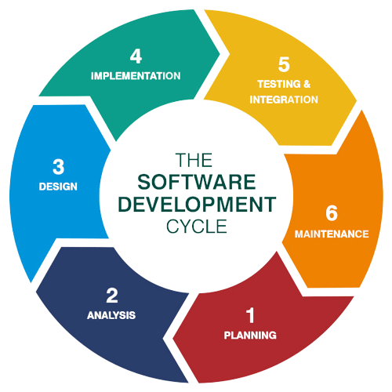
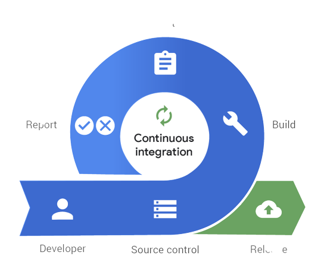
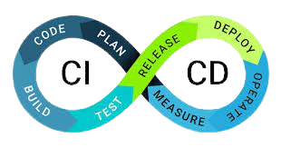
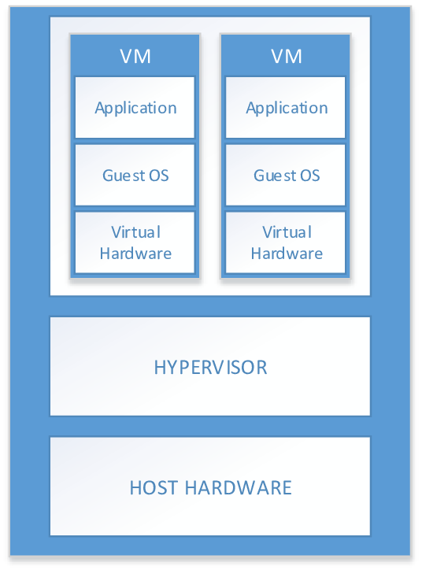
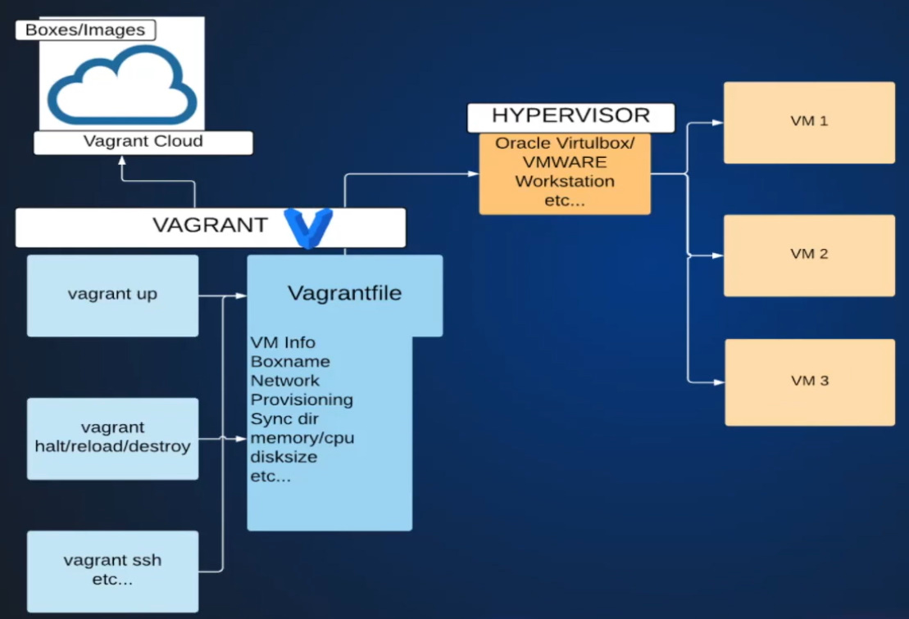

# Learning DevOps

This is going to be my journey to learn Devops from very basics to advanced level. I will try to share each and every step of it so it can also benefit others.

I am making this repo so that you don't have to go and search at different different places and you can find every topic here only.

I will try to provide complete notes and practical projects in complete detailed and in an easy to understand manner.

---

## 1. Introduction to DevOps

### Transforming an Idea into Application - Software Development Life Cycle (SLDC)

Development of any software comes up with a life cycle of certain steps which are executed in a cyclic manner.
The steps are:

1. Requirement Gathering
2. Planning
3. Designing
4. Development
5. Testing
6. Deploy and Maintain
 

#### Models in SLDC

-   Waterfall Model - Each phase begins only when previous is completed.
-   Agile Model - Work is divided into smallet lists of several tasks, several iterations of SLDC for each list
-   Spiral Model
-   Big Bang Model
-   etc...

### DevOps Lifecycle

1. Code - Developers commit code
2. Code Test - Unit and Integration test
3. Code Analysis - Vulnerability and best practices analysis
4. Delivery - Deploy changes to staging
5. DB/sec changes - Every other ops changes
6. Software Testing - QA / Functional tests
7. Deploy to production - Go live, user traffic diverted to new changes
8. User Approval - User feedback
9. Keep Monitoring

### Continous Integration (CI)

Continous Integration is the practice of automating the integration of code changes from multiple contributors into a single software project.

In simpler words, it is the process that automates the build and tests after every commit and sends notifications to developers accordingly.
If the code committed by developer is passed by automated tested the developer is notified and if it doesn't the developer is notified and he commits again and the issues are fixed.

### Continous Delivery (CD)

Continous Delivery is a strategy for software releases wherein any code commit that passes the automated testing phase is automatically released into the production environment, making changes that are visible to the software's users.

In simpler words, it is the process that automates the deployment process so that every deployment request generated by CI is fulfilled.
It is basically the extension of CI.

## 2. Virtualization

### Life before Virtualization

-   To run App/Services we needed servers
-   Physical Computer (Servers in Data Centers)
-   One service - one server
-   Servers were always overprovisioned
-   Servers resources were mostly underutilized
-   Huge capital expenditure and operational expenditure

### Virtualization

-   Allows one computer to run multiple OS
-   Partition physical resource in virtual resources
-   Virtual machines run in completely isolated manner, so no more one server - one service rule

### Basic Terminologies

1. **Host OS** => OS of the physical machine in which virtualization is going to take place.
2. **Guest OS** => Os of the Virtual Machine.
3. **Virtual Machine (VM)** => The machine which is virtual running on anothe machine(called host machine) and is isolated from all other virtual machines running on the same host.
4. **Snapshot** => Way of taking a backup of VM.
5. **Hypervisor** => Tool or software which enables the Virtualization and lets us create a VM.

Hypervisor is of 2 types
: 1. **Type 1** - Runs as a base OS, used for production. Eg: VMWare ESXI, XEN Hypervisor
: 2. **Type 2** - Runs as a software, ideal for learning and testing purposes. Eg: Oracle Virtualbox, VMWare Server / Player.

## 3. Vagrant

It is an automation tool to manage VM lifecycle

### VM Management Problems

-   OS installations
-   Time consuming
-   Manual Setup
-   Tough replication for multi VM
-   Documentations for multi VM

### Vagrant for VMs

-   No OS installations
-   VM setupp through images (vagrant boxes)
-   Images (Boxes available in Vagrant Cloud)
-   Manage VM's with a file (Vagrant file)
-   VM changes automatic through Vagrantfile
-   Vagrant commands to manage VMs
-   Provisioning VM/Executing commands and scripts

### Vagrant Architecture

