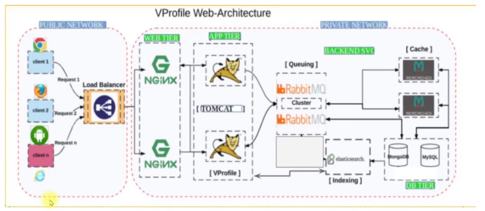
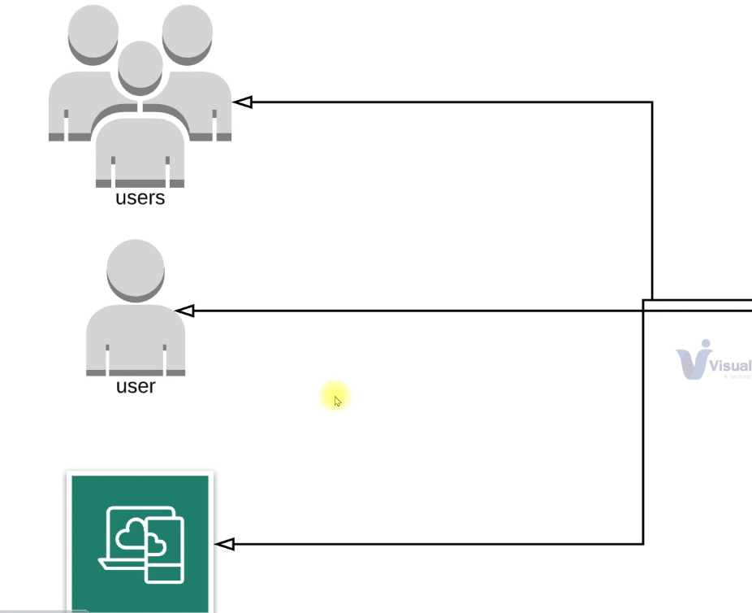
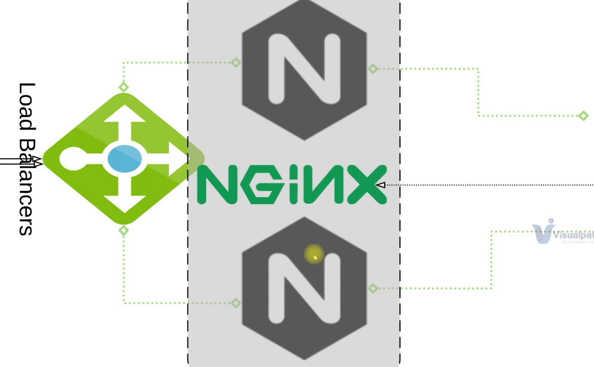
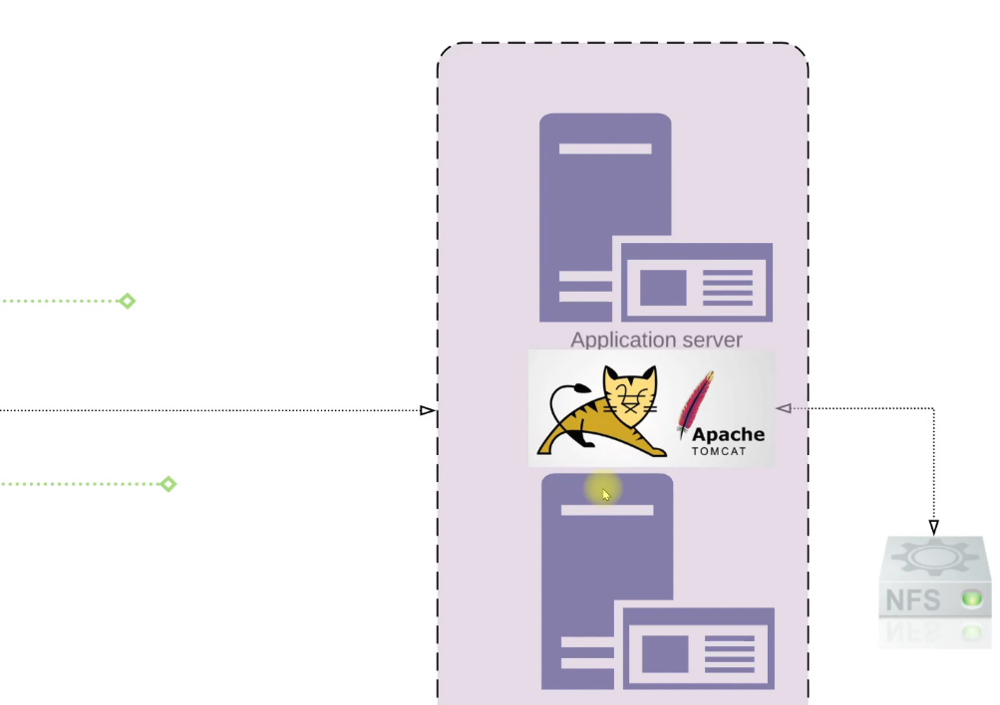
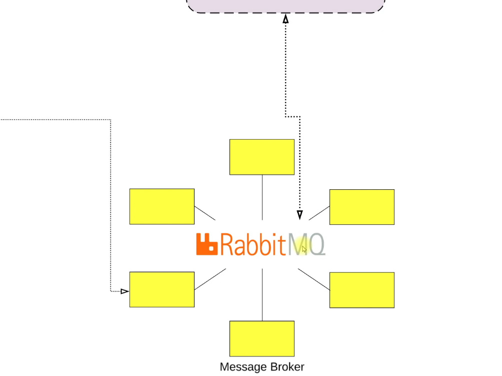
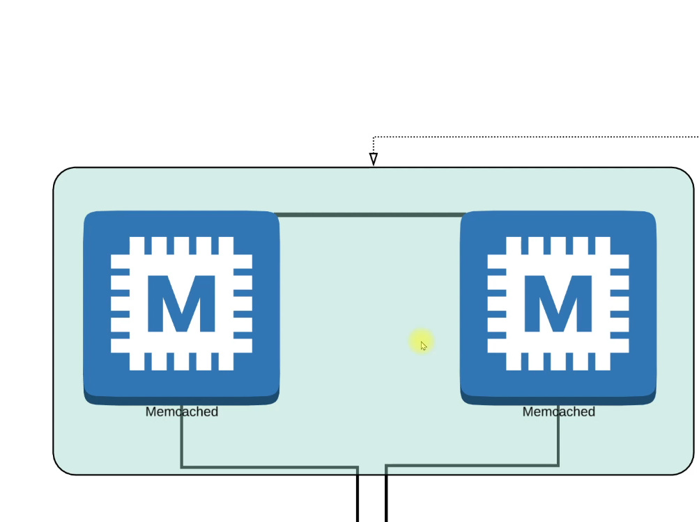
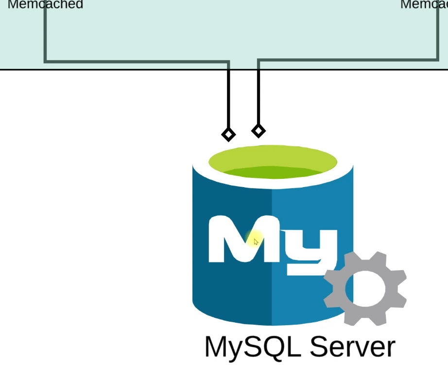
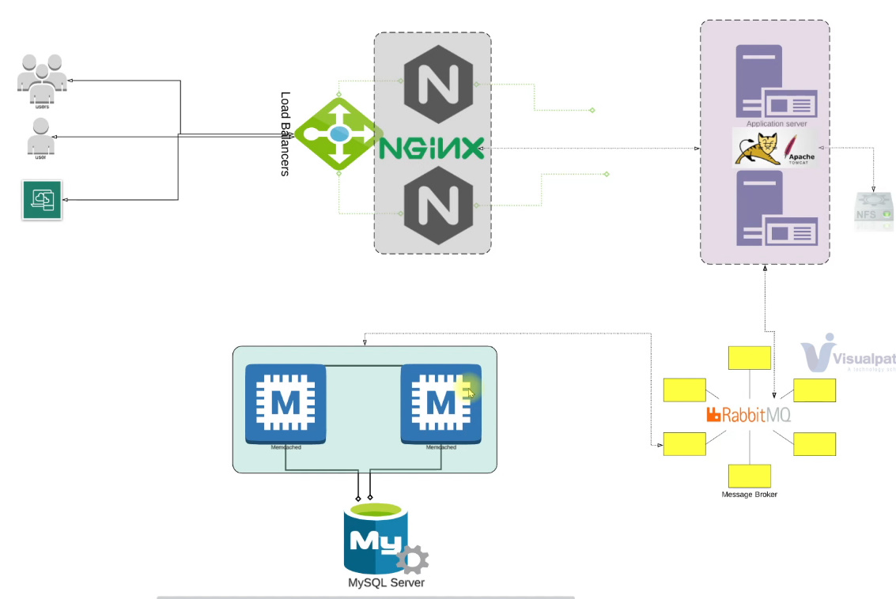

# Contents

---

- [Contents](#contents)
- [VProfile Project Setup (Local)](#vprofile-project-setup-local)
  - [About The Project](#about-the-project)
  - [VProfile Overall Web-Architecture](#vprofile-overall-web-architecture)
  - [Architecture of Project Services](#architecture-of-project-services)
  - [Manual Provisioning](#manual-provisioning)
    - [VM Setup](#vm-setup)
    - [DB, Queue & Cache Setup](#db-queue--cache-setup)
      - [MySQL Setup](#mysql-setup)
      - [MemCache Setup](#memcache-setup)
      - [RabbitMQ Setup](#rabbitmq-setup)
    - [App Setup](#app-setup)
      - [Tomcat Setup](#tomcat-setup)
      - [Setup systemd for tomcat](#setup-systemd-for-tomcat)
      - [Code Build & Deploy (app01)](#code-build--deploy-app01)

---

# VProfile Project Setup (Local)

## About The Project

-   Multi Tier Web Application Stack
-   Setup on Laptop/Desktop

## VProfile Overall Web-Architecture



## Architecture of Project Services

-   After setting up our stack, user can access our services from browser by entering an IP Address or an endpoint.
    
-   User would be redirected to **load balancers** setup with **NGINX**.
    
-   NGINX service is then going to forward the request to **Application Server**
    
-   **Apache Tomcat** would be our **Application Server**, where our JAVA application will be running. We can even have a Shared Storage by using NFS.
-   Application Server is then going to forward the request to **RabbitMQ** which will be our **Message Broker**.
    
-   RabbitMQ will send our request to **MemCached** for **database caching**.
    
-   MemCached is gonna **cache** our queries which was executed for the **MySQL Server**
    
    <br><br>
    

## Manual Provisioning

### VM Setup

-   Open the directory where you want to setup your vagrant.
-   Create a new `Vagrantfile` and copy the code below to configure the VM's required.

    ```
    Vagrant.configure("2") do |config|
        config.hostmanager.enabled = true
        config.hostmanager.manage_host = true

        ### NGINX VM ###
        config.vm.define "web01" do |web01|
            web01.vm.box = "ubuntu/xenial64"
            web01.vm.hostname = "web01"
            web01.vm.network "private_network", ip: "192.168.56.11"
            web01.vm.network "public_network"
        end

        ### Tomcat VM ###
        config.vm.define "app01" do |app01|
            app01.vm.box = "geerlingguy/centos7"
            app01.vm.hostname = "app01"
            app01.vm.network "private_network", ip: "192.168.56.12"
            app01.vm.provider "virtualbox" do |vb|
                vb.memory = "1024"
            end
        end

        ### RabbitMq VM ###
        config.vm.define "rmq01" do |rmq01|
            rmq01.vm.box = "geerlingguy/centos7"
            rmq01.vm.hostname = "rmq01"
            rmq01.vm.network "private_network", ip: "192.168.56.16"
        end

        ### MemCache VM ###
        config.vm.define "mc01" do |mc01|
            mc01.vm.box = "geerlingguy/centos7"
            mc01.vm.hostname = "mc01"
            mc01.vm.network "private_network", ip: "192.168.56.14"
        end

        ### DB VM ###
        config.vm.define "db01" do |db01|
            db01.vm.box = "geerlingguy/centos7"
            db01.vm.hostname = "db01"
            db01.vm.network "private_network", ip: "192.168.56.15"
        end
    end
    ```

-   Install the `vagrant-hostmanager` Vagrant Plugin. This plugin manages all the hosts ans map them with the IPs.<br> `vagrant plugin install vagrant-hostmanager`
-   Test that all machines are up and running.

    -   Test **web01**

        ```
        $ vagrant ssh web01
        $ cat /etc/hosts
        127.0.0.1       localhost

        # The following lines are desirable for IPv6 capable hosts
        ::1     ip6-localhost   ip6-loopback
        fe00::0 ip6-localnet
        ff00::0 ip6-mcastprefix
        ff02::1 ip6-allnodes
        ff02::2 ip6-allrouters
        ff02::3 ip6-allhosts
        127.0.1.1       ubuntu-xenial   ubuntu-xenial

        127.0.2.1 web01 web01

        ## vagrant-hostmanager-start
        192.168.56.12   app01

        192.168.56.15   db01

        192.168.56.14   mc01

        192.168.56.16   rmq01

        192.168.56.11   web01

        ## vagrant-hostmanager-end

        $ ping app01
        PING app01 (192.168.56.12) 56(84) bytes of data.
        64 bytes from app01 (192.168.56.12): icmp_seq=1 ttl=64 time=0.451 ms
        64 bytes from app01 (192.168.56.12): icmp_seq=2 ttl=64 time=0.585 ms
        64 bytes from app01 (192.168.56.12): icmp_seq=3 ttl=64 time=0.779 ms
        64 bytes from app01 (192.168.56.12): icmp_seq=4 ttl=64 time=0.545 ms
        ^C
        --- app01 ping statistics ---
        4 packets transmitted, 4 received, 0% packet loss, time 2997ms
        rtt min/avg/max/mdev = 0.451/0.590/0.779/0.119 ms
        ```

    -   Test **app01**

        ```
        $ vagrant ssh app01
        $ ping rmq01
        PING rmq01 (192.168.56.16) 56(84) bytes of data.
        64 bytes from rmq01 (192.168.56.16): icmp_seq=1 ttl=64 time=0.497 ms
        64 bytes from rmq01 (192.168.56.16): icmp_seq=2 ttl=64 time=0.589 ms
        64 bytes from rmq01 (192.168.56.16): icmp_seq=3 ttl=64 time=0.526 ms
        64 bytes from rmq01 (192.168.56.16): icmp_seq=4 ttl=64 time=0.596 ms
        ^C
        --- rmq01 ping statistics ---
        4 packets transmitted, 4 received, 0% packet loss, time 3000ms
        rtt min/avg/max/mdev = 0.497/0.552/0.596/0.041 ms

        $ ping mc01
        PING mc01 (192.168.56.14) 56(84) bytes of data.
        64 bytes from mc01 (192.168.56.14): icmp_seq=1 ttl=64 time=0.397 ms
        64 bytes from mc01 (192.168.56.14): icmp_seq=2 ttl=64 time=0.474 ms
        64 bytes from mc01 (192.168.56.14): icmp_seq=3 ttl=64 time=0.473 ms
        64 bytes from mc01 (192.168.56.14): icmp_seq=4 ttl=64 time=0.478 ms
        ^C
        --- mc01 ping statistics ---
        4 packets transmitted, 4 received, 0% packet loss, time 3002ms
        rtt min/avg/max/mdev = 0.397/0.455/0.478/0.040 ms

        $ ping db01
        PING db01 (192.168.56.15) 56(84) bytes of data.
        64 bytes from db01 (192.168.56.15): icmp_seq=1 ttl=64 time=0.255 ms
        64 bytes from db01 (192.168.56.15): icmp_seq=2 ttl=64 time=0.306 ms
        64 bytes from db01 (192.168.56.15): icmp_seq=3 ttl=64 time=0.719 ms
        64 bytes from db01 (192.168.56.15): icmp_seq=4 ttl=64 time=0.920 ms
        ^C
        --- db01 ping statistics ---
        4 packets transmitted, 4 received, 0% packet loss, time 3002ms
        rtt min/avg/max/mdev = 0.255/0.550/0.920/0.279 ms
        ```

### DB, Queue & Cache Setup

#### MySQL Setup

-   Install, start, enable and configure MariaDB on `port 3306`

    ```
    $ vagrant ssh db01                    # ssh to vm
    $ sudo -i                             # Switch to Root user
    $ yum update -y                       # update the OS
    $ yum install epel-release -y         # Set Repository
    $ yum install git mariadb-server -y   # Install MariaDB Package
    $ systemctl start mariadb             # Start maria-db server
    $ systemctl enable mariadb            # Enable maria-db server on startup
    $ mysql_secure_installation           # Run MySQL secure installation script
    $ mysql -u root -p"<your_password>"    # Set DB name and users
    mysql> CREATE DATABASE accounts;
    mysql> GRANT all PRIVILEGES on accounts.* TO 'admin'@'app01' identified by '<your_password>';
    mysql> FLUSH PRIVILEGES;
    mysql>
    mysql> exit;

    $ git clone -b vprofile-project-local https://github.com/CoderChirag/DevOps-Learning.git         #Download Source Code
    $ cd DevOps-Learning
    $ mysql -u root -p"<your_password>" accounts < src/main/resources/db_backup.sql                     # Initialize DB
    $ mysql -u root -p"<your_password>" -e "FLUSH PRIVILEGES"
    $ mysql -u root -p"<your_password>" accounts
    mysql> show databases;
    +--------------------+
    | Database           |
    +--------------------+
    | information_schema |
    | accounts           |
    | mysql              |
    | performance_schema |
    +--------------------+
    4 rows in set (0.00 sec)

    mysql> use accounts;
    Reading table information for completion of table and column names
    You can turn off this feature to get a quicker startup with -A

    Database changed

    mysql> show tables;
    +--------------------+
    | Tables_in_accounts |
    +--------------------+
    | role               |
    | user               |
    | user_role          |
    +--------------------+
    3 rows in set (0.01 sec)

    mysql> exit;

    $ systemctl restart mariadb           # Restart maria-db Server

    $ systemctl start firewalld           # Starting the firewall and allowing the mariadb to access from port no. 3306
    $ systemctl enable firewalld
    $ firewall-cmd --get-active-zones
    $ firewall-cmd --zone=public --add-port=3306/tcp --permanent
    $ firewall-cmd --reload
    $ systemctl restart mariadb
    ```

#### MemCache Setup

-   Install, start & enable **MemCached** on `port 11211`

    ```
    $ vagrant ssh mc01
    $ sudo -i
    $ yum install epel-release -y
    $ yum install memcached -y

    $ sytemctl start memcached
    $ systemctl enable memcached
    $ memcached -p 11211 -U 11111 -u memcached -d       # Run memcached on tcp port: 11211 and udp port 11111
    $ ss -tunlp | grep 11211        # To validate if memcachedis setup correctly

    $ systemctl enable firewalld
    $ systemctl start firewalld
    $ firewall-cmd --add-port=11211/tcp --permanent
    $ firewall-cmd --reload
    $  memcached -p 11211 -U 11111 -u memcached -d
    ```

#### RabbitMQ Setup

-   Install, enable and start **RabbitMQ**

    ```
    $ vagrant ssh rmq01
    $ sudo -i
    $ yum update -y                   # Update OS
    $ yum install epel-release -y     # Set EPEL Repository

    $ yum install wget -y             # Install Dependencies
    $ cd /tmp/
    $ wget http://packages.erlang-solutions.com/erlang-solutions-2.0-1.noarch.rpm
    $ rpm -Uvh erlang-solutions-2.0.1.noarch.rpm
    $ yum -y install erlang socat

    $ curl -s https://packagecloud.io/install/repositories/rabbitmq/rabbitmq-server/script.rpm.sh | sudo bash      # Install RabbitMQ Server
    $ yum install rabbitmq-server -y

    $ systemctl start rabbitmq-server     # Start and Enable RabbitMQ Server
    $ systemctl enable rabbitmq-server

    $ echo "[{rabbit, [{loopback_users, []}]}]." > /etc/rabbitmq/rabbitmq.config        # Change the config
    $ rabbitmqctl add_user test test        # Add a new user 'test'
    $ rabbitmqctl set_user_tags test administrator      # Give test user admin privileges

    $ systemctl restart rabbitmq-server

    $ systemctl start firewalld
    $ sytemctl enable firewalld
    $ firewall-cmd --get-active-zones
    $ firewall-cmd --zone=public --add-port=25672/tcp --permanent
    $ firewall-cmd --reload
    ```

### App Setup

#### Tomcat Setup

-   ```
    $ vagrant ssh app01
    $ yum update -y
    $ yum install epel-release -y

    # Install Dependencies
    $ yum install java-1.8.0-openjdk -y
    $ yum install git maven wget -y

    $ cd /tmp/

    # Download & install Tomcat package
    $ wget https://archive.apache.org/dist/tomcat/tomcat-8/v8.5.37/bin/apache-tomcat-8.5.37.tar.gz
    $ tar xzvf apache-tomcat-8.5.37.tar.gz

    # Add Tomcat user
    $ useradd --home-dir /usr/local/tomcat8 --shell /sbin/nologin tomcat

    # Copy data to tomcat home dir
    $ cp -r /tmp/apache-tomcat-8.5.37/* /usr/local/tomcat8

    # Make Tomcat user owner of the tomcat home dir
    $ chown -R tomcat.tomcat /usr/local/tomcat8

    ```

#### Setup systemd for tomcat

-   ```
    # Update file with the folllowing content.
    $ vi /etc/sytemd/system/tomcat.service
    [Unit]
    Description=Tomcat
    After=network.target

    [Service]
    User=tomcat
    WorkingDirectory=/usr/local/tomcat8
    Environment=JRE_HOME=/usr/lib/jvm/jre
    Environment=JAVA_HOME=/usr/lib/jvm/jre
    Environment=CATALINA_HOME=/usr/local/tomcat8
    Environment=CATALINE_BASE=/usr/local/tomcat8
    ExecStart=/usr/local/tomcat8/bin/catalina.sh run
    ExecStop=/usr/local/tomcat8/bin/shutdown.sh
    SyslogIdentifier=tomcat-%i

    [Install]
    WantedBy=multi-user.target

    $ systemctl daemon-reload
    $ systemctl start tomcat
    $ sytemctl enable tomcat

    # Enabling the firewall and allowing port 8080 to access the tomcat
    $ systemctl enable firewalld
    $ systemctl start firewalld
    $ firewall-cmd --get-active-zones
    $ firewall-cmd --zone=public --add-port=8080/tcp --permanent
    $ firewall-cmd --reload
    ```

#### Code Build & Deploy (app01)

-   ```
    # Download Source Code
    $ git clone -b vprofile-project-local https://github.com/CoderChirag/DevOps-Learning.git

    # Update Configuration
    $ cd DevOps-Learning/
    $ vim src/main/resources/application.properties
    # Update file with backend server details

    # Build Code
    # Run below command inside the repository (DevOps-Learning)
    $ mvn install

    # Deploy artifact
    $ systemctl stop tomcat
    $ sleep 120
    $ rm -rf /usr/local/tomcat8/webapps/ROOT*
    $ cp target/vprofile-v2.war usr/local/tomcat8/webapps/ROOT.war
    $ systemctl start tomcat
    $ sleep 300

    $ chown tomcat.tomcat usr/local/tomcat8/webapps -R
    systemctl restart tomcat

    ```
