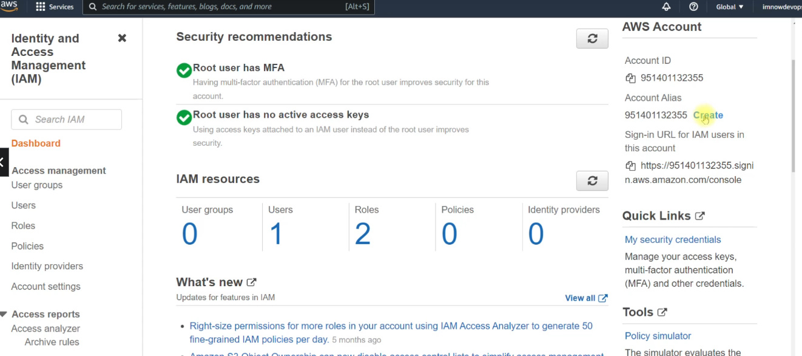

# Contents

---

- [Contents](#contents)
- [Introduction to AWS](#introduction-to-aws)
  - [AWS Global Infrastructure](#aws-global-infrastructure)
    - [Availability Zones (AZ)](#availability-zones-az)
    - [Regions](#regions)
- [AWS Account Setup](#aws-account-setup)
  - [Creating Free Tier Account](#creating-free-tier-account)
  - [Setting Up IAM with MFA](#setting-up-iam-with-mfa)
  - [Setting up Biling Alarms](#setting-up-biling-alarms)
  - [Setting Up a SSL Certificate for our domain](#setting-up-a-ssl-certificate-for-our-domain)
- [Amazon Elastic Compute Cloud (EC2)](#amazon-elastic-compute-cloud-ec2)
  - [EC2 Pricing](#ec2-pricing)
  - [Components in EC2 Instance](#components-in-ec2-instance)
  - [Creating EC2 Instance](#creating-ec2-instance)
    - [Launching an EC2 Instance](#launching-an-ec2-instance)
      - [Creating the Instance](#creating-the-instance)
      - [Connecting to the Instance](#connecting-to-the-instance)
- [AWS CLI](#aws-cli)
  - [Downloading and Installing AWS CLI](#downloading-and-installing-aws-cli)
  - [Configuring IAM](#configuring-iam)
  - [Configuring AWS CLI](#configuring-aws-cli)
- [AWS Elastic Block Storage](#aws-elastic-block-storage)
  - [EBS Types](#ebs-types)
  - [Creating a new EBS Volume](#creating-a-new-ebs-volume)
  - [Configuring and Partitioning the Volume](#configuring-and-partitioning-the-volume)
  - [EBS Snapshots](#ebs-snapshots)
    - [Introduction](#introduction)
    - [Hands-On on EBS Snapshots](#hands-on-on-ebs-snapshots)
- [AWS Elastic Load balancers](#aws-elastic-load-balancers)
  - [Load Balancer Ports](#load-balancer-ports)
  - [Classic Load Balancer / Gateway Load Balancer](#classic-load-balancer--gateway-load-balancer)
  - [Application Load Balancer](#application-load-balancer)
    - [Overview](#overview)
  - [Network Load Balancer](#network-load-balancer)
  - [Gateway Load Balancers](#gateway-load-balancers)
  - [ELB Hands-on](#elb-hands-on)
- [Amazon CloudWatch](#amazon-cloudwatch)
  - [Usage of Metrics provided by CloudWatch](#usage-of-metrics-provided-by-cloudwatch)
  - [CloudWatch Hands-On](#cloudwatch-hands-on)
- [Amazon Elastic File System (EFS)](#amazon-elastic-file-system-efs)
  - [How it works](#how-it-works)
  - [Use Cases](#use-cases)
    - [1. Simplify DevOps](#1-simplify-devops)
    - [2. Modernize application development](#2-modernize-application-development)
    - [3. Enhance content management systems](#3-enhance-content-management-systems)
    - [4. Accelerate data science](#4-accelerate-data-science)
- [Autoscaling Group](#autoscaling-group)
  - [Introduction](#introduction-1)
  - [Autoscaling Group Hands On](#autoscaling-group-hands-on)
    - [Prerequisites](#prerequisites)
    - [Setting up Autoscaling Group](#setting-up-autoscaling-group)
- [Amazon Simple Storage Service (S3)](#amazon-simple-storage-service-s3)
  - [S3 Basics](#s3-basics)
  - [Creation of S3](#creation-of-s3)
  - [S3 Storage Classes](#s3-storage-classes)
    - [1. S3 Standard](#1-s3-standard)
    - [2. S3 IA - Infrequent Access](#2-s3-ia---infrequent-access)
    - [3. S3 One Zone-IA](#3-s3-one-zone-ia)
    - [4. S3 Intelligent Tiering](#4-s3-intelligent-tiering)
    - [5. S3 Glacier](#5-s3-glacier)
    - [S3 Glacier Deep Archive](#s3-glacier-deep-archive)
  - [Lifecycle Policies](#lifecycle-policies)
  - [S3 Charges](#s3-charges)

---

# Introduction to AWS

## AWS Global Infrastructure

-   The AWS Global Cloud Infrastructure is the most secure, extensive, and reliable cloud platform, offering over **200** fully featured data centers globally.
-   AWS now spans 84 Availability Zones within 26 geographic regions around the world.

### Availability Zones (AZ)

-   An **Availability Zone (AZ)** is one or more discrete data centers with redundant power, networking, and connectivity in an AWS Region.
-   AZs give customers the ability to operate production applications and databases that are more highly available, fault tolerant, and scalable than would be possible from a single data center.
-   All AZs in an AWS Region are interconnected with high-bandwidth, low-latency networking, over fully redundant, dedicated metro fiber providing high-throughput, low-latency networking between AZs.
-   All traffic between AZs is encrypted.
-   The network performance is sufficient to accomplish synchronous replication between AZs.
    <br>
-   AZs make partitioning applications for high availability easy.
-   If an application is partitioned across AZs, companies are better isolated and protected from issues such as power outages, lightning strikes, tornadoes, earthquakes, and more.
-   AZs are physically separated by a meaningful distance, many kilometers, from any other AZ, although all are within 100 km (60 miles) of each other.

### Regions

-   **Region** is a physical location around the world where AWS cluster data centers.
-   Each AWS Region consists of multiple, isolated, and physically separate Availability Zones within a geographic area.
-   The multiple AZ design of every AWS Region offers advantages for customers.
-   Each AZ has independent power, cooling, and physical security and is connected via redundant, ultra-low-latency networks.
-   AWS customers focused on high availability can design their applications to run in multiple AZs to achieve even greater fault-tolerance.
-   AWS infrastructure Regions meet the highest levels of security, compliance, and data protection.
    <br>
-   AWS maintains multiple geographic Regions, including Regions in North America, South America, Europe, China, Asia Pacific, South Africa, and the Middle East.

<div align='center'>


</div>

# AWS Account Setup

<!-- Free Tier Account, IAM with MFA, Billing Alarm , Certificate Setup -->

## Creating Free Tier Account

-   Go to aws.amazon.com and click on **Create an AWS Account** at the top right corner of the screen.


-   Fill in all the details and complete the signup process.


-   Click on **Sign in to the Console**.


-   Fill in the details and sign in to the root account.

## Setting Up IAM with MFA

-   After signing in, search for **IAM** service in the search box and click on it.


-   Click on Add MFA to setup Multi Factor Authentication for root user.
-   Click on Activate MFA > Virtual MFA Device > Continue. After that install any MFA app like **Google Authenticator** on your mobile and activate the MFA.


-   Now go to **Users** from the left navigation menu > Add Users.


-   Give some username
-   Select **Access Type** to **Password**


-   Select Autogenerate password
-   Go to Premissions section. Select Attach existing policies directly and select **AdministratorAccess**


-   Go next > next > create user
-   Copy the username and password somewhere.
-   Now go to dashboard from the left navigation panel and create an alias for the IAM account we just set up.



-   Now for setting MFA for this user, go to **Users** from left navigation panel, select the user we just created, go to **Security Credentials** section, and click on **Manage** option in the **Assigned MFA device** section.
-   Now, assign MFA for this user as we did for the root user.


## Setting up Biling Alarms

-   Firstly, select **Global region** from the top right section of the console and then open the dropdown menu of the profile (where your username is written), and go to **Billing Dashboard** page.


-   Go to **Billing prefrences** from the left navigation panel > Select **Recieve PDF invoice By Email**, **Recieve Free Tier Usage Alerts**, enter your email there, select **Recieve Billing Alerts**.
-   Now click on **Save Prefrences**.


-   Now search a service **Cloudwatch** from the top search bar and go to the cloudwatch page.
-   **Cloudwach** is basically a monitoring and observability service provided by AWS to monitor all your applications, respond to system-wide performance changes, and optimize resource utilization.


-   Select the US East(N. Virginia) region.


-   Go to left navigation menu > Alarms > All Alarms.
-   Now on this page click on Create Alarm


-   Now click on Select Metric > Billing > Total Estimated Charge > select USD > Select metric.
-   Now go down the page, select **Threshold type** to **Static** and **Whenever EstimatedCharges is...** to **Greater** and then in the below input box write down **5**, and then click on next.
-   So with this we are creating a billing alar, so that whenever our bill crosses 5 USD we would be getting email notification.


-   Now create a new **SNS topic**, give it a name and email which will recieve the notification, and then click on create topic.
-   **SNS** stand for **Simple Notification Service**, and it is basically an AWS sevice which provides us email or sms notifications.


-   Click on next.
-   Give alarm a name and description and click on next and then click on Create Alarm.
-   So this will create an new alarm.
-   Now, go to your email, and confirm this subscription by clicking on the confirm subscription button on the email you would be getting from AWS.

## Setting Up a SSL Certificate for our domain

-   Search **acm** on the search bar and click on the **Certificate Manager** service.
-   Click on **Request a certificate**
-   Select Request a public certificate > click on next.
-   In the Domain names section, give `*.<your_domain>`.
-   Select **DNS validation**
-   Now click on Request.
-   Now click on the certificate you just created, scroll down and copy the **CNAME name** and **CNAME value** values, and create a corresponding record with these values in your domain.

So, with this we have setup our AWS Free Tier account, created an IAM user and set up MFA, set up Billing Alarms using CloudWatch, and create a SSL Certificate for our domain :sunglasses:.

# Amazon Elastic Compute Cloud (EC2)

-   **EC2** provides web services API for provisioning, managingm and deprovisioning virtual servers inside Amazon Cloud.
-   Ease in Scaling Up / Down.
-   Pay only for what we use.
-   Can be integrated into several other services.

## EC2 Pricing

1. On Demand
    - Pay per hour or seconds
2. Reserved
    - Reserve Capacity (1 or 3 yrs) for discounts
3. Spot
    - Bid your price for unused EC2 capacity
4. Dedicated Hosts
    - Physical Server dedicated for you

## Components in EC2 Instance

**Amazon Machine Image (AMI)**

-   Amazon Machine Image (AMI) is a supported and maintained image provided by AWS that provides the information required to launch an instance.

**Instance Type**

-   When we launch an instance, the instance type that we specify determines the hardware of the host computer used for our instance. Eg, M4 Instance, C4 Instance, F1 Instance, I3 Instance etc

**Amazon Elastic Block Store (EBS)**

-   Amazon Elastic Block Store (Amazon EBS) is an easy-to-use, scalable, high-performance block-storage service designed for Amazon Elastic Compute Cloud (Amazon EC2).
-   These are basically the **Virtual Hard Drive Volumes** which we can mount as devices on our instances.

**Tags**

-   Tag is a simpel label consisting of a customer-defined key and an optional value that can make it easier to manage, search for, and filter resources.

**Security Group**

-   A security group acts as a **virtual firewall** that controls the traffic for one or more instances.

**Key Pair**

-   Amazon EC2 uses **public-key cryptography** to encrypt and decrypt login information.
-   These are basically **SSH Keys** to connect to the instances remotely.

## Creating EC2 Instance

Steps for creation of an EC2 Instance:

1. Choose an Amazon Machine Image (AMI)
2. Choose an Instance Type
3. Configure the Instance
4. Add Storage
5. Add Tags
6. Configure Security Group
7. Review


### Launching an EC2 Instance

#### Creating the Instance

-   Log in to the AWS Console and switch to **North Virginia** region.
-   Search for EC2 in the search box and navigate to the Dashboard page of EC2.


-   Navigate to Instances from the left navigation menu.
-   Click on Launch Instance.
-   Give a **name** to the instance.
-   If you want you can give additional tags according to your project.
-   Now select an **AMI**. I will be going here with **Cent OS7**.
-   Then select an **Instance Type**. I will be chosing **t2 micro**.
-   Create a **key-pair**, download it and store it in a safe accessible location on your pc.
-   Configure the **Network Settings**. Give a **Security Group** and for security you can select the option **My IP** in the IP section.
-   Now configure the **Storage**.
-   Go to Advanced details > User Data. This is just like Vagrant Provisioning in the local setup. Whatever commands we give here, it will be executing that commands on the startup of the Instance.
    Give the following commands. (Make sure you have choosen Cent OS7 if you are using these commands).
    `#!/bin/bash sudo yum install http -y sudo systemctl start httpd sudo systemctl enable httpd mkdir /tmp/test1`
-   Now finally click on **Launch Instance**.

#### Connecting to the Instance

**Using SSH**

-   Open a git bash terminal on your system and type in the following commands.

    ```
    $ ssh -i <path_to_your_key> centos@<public_ip>
    # You can find your public IP by clicking on the instance you just created from the AWS console.

    # So with this we are logged in to our instance

    $ sudo systemctl status httpd
    ```

**Accessing via HTTP**

For accessing your instance via HTTP, we have to configure the security rules.
As of now, we have only one security rule through which our instance is listening on Port `22` (for SSH). So lets create a new security rule, for the Port `80` (for HTTP).

-   So select the Instance in the AWS Console.
-   Go to Security tab.
-   Click on the Security Group.
-   Go to **Inbound Rules** section and click on **Edit inbound rules**.
-   Click on Add rule.
-   Enter following info:
    -   **Type :** Custom TCP
    -   **Protocol :** TCP
    -   **Port Range :** 80
    -   **Source :** MY IP (if you are using it for private, else you can select Anywhere-IPv4 or Anywhere-IPv6 or both by creating 2 rules).
    -   **Description - Optional :** If you want you can give this also.
-   Then click on save rules.
-   Now type your instance's external IP Address on the Browser and you would see the Default Apache 2 page.

So with this we have created and set up an EC2 instance successfully :sunglasses:

**Note**

-   Don't forget to **terminate the instance** after using it.

# AWS CLI

The **AWS Command Line Interface** (AWS CLI) is a unified tool to manage our AWS services. With just one tool to download and configure, we can control multiple AWS services from the command line and automate them through scripts.

## Downloading and Installing AWS CLI

The downloading and installation of AWS CLI is covered in the [prereqs](https://github.com/coderchirag/DevOps-Learning/tree/prereqs) branch. Refer to that branch if you have not downloaded and installed AWS CLI on your machine.

## Configuring IAM

-   On the AWS console, search for **IAM** and open the IAM dashboard page.
-   Go to **Users section** from the left navigation panel and click on **Add User**.
    
-   Name the user as **awscli** and select the **Access key - Programmatic access**, and then click on **Next: Permissions** button.
    
-   Now select **Attach existing policies directly** and select **AdministratorAcess** from the policy list, and the **Next: Tags** button.
    
-   Click on **Next: Review** button > **Create User** button
-   Now download the credentials csv file and store it safely as we would be needing the credentials later, and then click on **close**.
    

## Configuring AWS CLI

-   Open git bash and type the following command to configure the **AWS CLI** so that it can authenticate us.

    ```
    $ aws configure
    AWS Access Key ID [None]: <your_access_key>
    AWS Secret Access Key [None]: <your_secret_key>
    Default region name [None]: us-east-1
    Default output format [None]: json

    $ ls ~/.aws
    config  credentials

    $ cat ~/.aws/config
    [default]
    region = us-east-1
    output = json

    $ cat ~/.aws/credentials
    [default]
    aws_access_key_id = <acess_key>
    aws_secret_access_key = <secret_key>
    ```

# AWS Elastic Block Storage

-   **Amazon Elastic Block Store** (Amazon EBS) is an easy-to-use, scalable, high-performance block-storage service designed for Amazon Elastic Compute Cloud (Amazon EC2).
    

-   Block Based Storage.
-   Run EC2 OS, store data from db, file data etc.
-   Placed in specific Availability Zone (AZ) **replicated within the AZ** to protect from failure.
-   Can only be attached to the instances placed within the same Availability Zone (AZ).
-   Snapshot is backup of a volume.

## EBS Types

-   General Purpose (SSD)
    -   Most Work Loads
-   Provisioned IOPS
    -   Large Databases
-   Throughput Optimized HD
    -   Big Data & Data Warehouses
-   Cold HDD
    -   File Servers
-   Magnetic
    -   Backups & Archives

## Creating a new EBS Volume

-   From AWS console Go to **EC2** > **Elastic Block Store** > **Volumes** > **Create Volume**.
-   Now create a new **gp2** volume of **5 GB**.
-   After the volume is created, select it from the volumes dashboard, click on **Actions** > **Attach Volume** and the select the EC2 instance running.

## Configuring and Partitioning the Volume

-   SSH into your EC2 instance and follow the commands :
    <br>
-   Switch to sudo user : `$ sudo -i`
    <br>
-   List all the available disks :

    ```
    $ fdisk -l
    Disk /dev/xvda: 10.7 GB, 10737418240 bytes, 20971520 sectors
    Units = sectors of 1 * 512 = 512 bytes
    Sector size (logical/physical): 512 bytes / 512 bytes
    I/O size (minimum/optimal): 512 bytes / 512 bytes
    Disk label type: dos
    Disk identifier: 0x000b050e

        Device Boot      Start         End      Blocks   Id  System
    /dev/xvda1   *        2048    20971486    10484719+  83  Linux

    Disk /dev/xvdf: 5368 MB, 5368709120 bytes, 10485760 sectors
    Units = sectors of 1 * 512 = 512 bytes
    Sector size (logical/physical): 512 bytes / 512 bytes
    I/O size (minimum/optimal): 512 bytes / 512 bytes
    ```

    -   Here `/dev/xvda` is our root volume, which we alloted during creation of the instance. It is having a partition `/dev/xvda1` of size 10 GB, i.e., the entire disk size.
    -   Also, `/dev/xvdf` is the 5 GB General Purpose 2 (gp2) disk we just attached to our VM. At present it is not having any partition.
        <br>

-   To confirm that `/dev/xvda1` is the root volume.
    ```
    $ df  -h
    Filesystem      Size  Used Avail Use% Mounted on
    devtmpfs        471M     0  471M   0% /dev
    tmpfs           495M     0  495M   0% /dev/shm
    tmpfs           495M   13M  482M   3% /run
    tmpfs           495M     0  495M   0% /sys/fs/cgroup
    /dev/xvda1       10G  1.4G  8.7G  14% /
    tmpfs            99M     0   99M   0% /run/user/1000
    ```
    So we can clearly see that `/dev/xvda1` is mounted to `/` that is, the **root directory**.
    <br>
-   Now let's create a partition of `/dev/xvdf` disk using `fdisk` utility.

    ```
    $ fdisk /dev/xvdf
    Welcome to fdisk (util-linux 2.23.2).

    Changes will remain in memory only, until you decide to write them.
    Be careful before using the write command.

    Device does not contain a recognized partition table
    Building a new DOS disklabel with disk identifier 0xe84a5c8e.

    Command (m for help): m
    Command action
    a   toggle a bootable flag
    b   edit bsd disklabel
    c   toggle the dos compatibility flag
    d   delete a partition
    g   create a new empty GPT partition table
    G   create an IRIX (SGI) partition table
    l   list known partition types
    m   print this menu
    n   add a new partition
    o   create a new empty DOS partition table
    p   print the partition table
    q   quit without saving changes
    s   create a new empty Sun disklabel
    t   change a partition's system id
    u   change display/entry units
    v   verify the partition table
    w   write table to disk and exit
    x   extra functionality (experts only)

    Command (m for help): n
    Partition type:
    p   primary (0 primary, 0 extended, 4 free)
    e   extended
    Select (default p): p
    Partition number (1-4, default 1): 1
    First sector (2048-10485759, default 2048):
    Using default value 2048
    Last sector, +sectors or +size{K,M,G} (2048-10485759, default 10485759):
    Using default value 10485759
    Partition 1 of type Linux and of size 5 GiB is set

    Command (m for help): p

    Disk /dev/xvdf: 5368 MB, 5368709120 bytes, 10485760 sectors
    Units = sectors of 1 * 512 = 512 bytes
    Sector size (logical/physical): 512 bytes / 512 bytes
    I/O size (minimum/optimal): 512 bytes / 512 bytes
    Disk label type: dos
    Disk identifier: 0xe84a5c8e

        Device Boot      Start         End      Blocks   Id  System
    /dev/xvdf1            2048    10485759     5241856   83  Linux

    Command (m for help): w
    The partition table has been altered!

    Calling ioctl() to re-read partition table.
    Syncing disks.
    ```

    So with this, we have created a partition `/dev/xvdf1` of **10 GB** of the `/dev/xvdf` disk.
    <br>

-   Now format the disk using `ext4` format :

    ```
    $ mkfs.ext4 /dev/xvdf1
        mke2fs 1.42.9 (28-Dec-2013)
    Filesystem label=
    OS type: Linux
    Block size=4096 (log=2)
    Fragment size=4096 (log=2)
    Stride=0 blocks, Stripe width=0 blocks
    327680 inodes, 1310464 blocks
    65523 blocks (5.00%) reserved for the super user
    First data block=0
    Maximum filesystem blocks=1342177280
    40 block groups
    32768 blocks per group, 32768 fragments per group
    8192 inodes per group
    Superblock backups stored on blocks:
            32768, 98304, 163840, 229376, 294912, 819200, 884736

    Allocating group tables: done
    Writing inode tables: done
    Creating journal (32768 blocks): done
    Writing superblocks and filesystem accounting information: done
    ```

      <br>

-   Mounting our disk temporarily in `/media/xvdf1` dir temporarily and then unmounting it.

    ```
    $ mkdir -p /media/xvdf1
    $ mount /dev/xvdf1 /media/xvdf1
    $ df -h
    [root@ip-172-31-27-115 ~]# df -h
    Filesystem      Size  Used Avail Use% Mounted on
    devtmpfs        471M     0  471M   0% /dev
    tmpfs           495M     0  495M   0% /dev/shm
    tmpfs           495M   13M  482M   3% /run
    tmpfs           495M     0  495M   0% /sys/fs/cgroup
    /dev/xvda1       10G  1.4G  8.7G  14% /
    tmpfs            99M     0   99M   0% /run/user/1000
    /dev/xvdf1      4.8G   20M  4.6G   1% /media/xvdf1

    $ umount /dev/xvdf1
    ```

      <br>

-   Mounting the disk permanently so that it is not unmounted on the reboot of the VM by editing the `/etc/fstab` file.

    ```
    $ echo "/dev/xvdf1    /media/xvdf1    ext4 defaults 0 0" >> /etc/fstab
    $ cat /etc/fstab

    #
    # /etc/fstab
    # Created by anaconda on Sun Nov 14 11:52:41 2021
    #
    # Accessible filesystems, by reference, are maintained under '/dev/disk'
    # See man pages fstab(5), findfs(8), mount(8) and/or blkid(8) for more info
    #
    UUID=44a6a613-4e21-478b-a909-ab653c9d39df /                       xfs     defaults        0 0
    /dev/xvdf1    /media/xvdf1    ext4 defaults 0 0

    $ mount -a
    $ df -h
    Filesystem      Size  Used Avail Use% Mounted on
    devtmpfs        471M     0  471M   0% /dev
    tmpfs           495M     0  495M   0% /dev/shm
    tmpfs           495M   13M  482M   3% /run
    tmpfs           495M     0  495M   0% /sys/fs/cgroup
    /dev/xvda1       10G  1.4G  8.7G  14% /
    tmpfs            99M     0   99M   0% /run/user/1000
    /dev/xvdf1      4.8G   20M  4.6G   1% /media/xvdf1
    ```

-   **Note**
    -   Don't forget to **terminate** the instance and **detach** and **delete** the EBS Volume after use.

## EBS Snapshots

### Introduction

-   We can back up the data on our Amazon EBS volumes to Amazon S3 by taking point-in-time snapshots.
-   Snapshots are **incremental backups**, which means that only the blocks on the device that have changed after our most recent snapshot are saved. This minimizes the time required to create the snapshot and saves on storage costs by not duplicating data.
-   Each snapshot contains all of the information that is needed to restore our data (from the moment when the snapshot was taken) to a new EBS volume.
    <br>

-   When we create an EBS volume based on a snapshot, the new volume begins as an exact replica of the original volume that was used to create the snapshot.
-   The replicated volume loads data in the background so that we can begin using it immediately.
-   If we access data that hasn't been loaded yet, the volume immediately downloads the requested data from Amazon S3, and then continues loading the rest of the volume's data in the background.

### Hands-On on EBS Snapshots

-   Firstly, **create and mount an EBS Volume**. As it is shown above how to do it, so I will mention only the commands here leaving the details.
    ```
    $ fdisk /dev/xvdf   # After that n , p, 1, Enter, +3G, w
    $ mkfs.ext4 /dev/xvdf1
    $ mkdir -p /var/lib/mysql
    $ echo "/dev/xvdf1    /var/lib/mysql  ext4  defaults 0 0" >> /etc/fstab
    $ mount -a
    $ df -h
    ```
-   Install **mysql** package `$ yum install mariadb-server`
-   Start the **mysql** package and check the status of it.
    ```
    $ systemctl start mariadb
    $ systemctl status mariadb
    ● mariadb.service - MariaDB database server
    Loaded: loaded (/usr/lib/systemd/system/mariadb.service; disabled; vendor preset: disabled)
    Active: active (running) since Sat 2022-06-25 20:20:12 UTC; 7s ago
    Process: 9338 ExecStartPost=/usr/libexec/mariadb-wait-ready $MAINPID (code=exited, status=0/SUCCESS)
    Process: 9255 ExecStartPre=/usr/libexec/mariadb-prepare-db-dir %n (code=exited, status=0/SUCCESS)
    Main PID: 9337 (mysqld_safe)
    CGroup: /system.slice/mariadb.service
            ├─9337 /bin/sh /usr/bin/mysqld_safe --basedir=/usr
            └─9502 /usr/libexec/mysqld --basedir=/usr --datadir=/var/lib/mysql --plugin-dir=/usr/lib64/mysql/plugin --log-error=/var...
    Jun 25 20:20:09 ip-172-31-91-238.ec2.internal mariadb-prepare-db-dir[9255]: MySQL manual for more instructions.
    Jun 25 20:20:09 ip-172-31-91-238.ec2.internal mariadb-prepare-db-dir[9255]: Please report any problems at http://mariadb.org/jira
    Jun 25 20:20:09 ip-172-31-91-238.ec2.internal mariadb-prepare-db-dir[9255]: The latest information about MariaDB is available at...g/.Jun 25 20:20:09 ip-172-31-91-238.ec2.internal mariadb-prepare-db-dir[9255]: You can find additional information about the MySQL ...at:Jun 25 20:20:09 ip-172-31-91-238.ec2.internal mariadb-prepare-db-dir[9255]: http://dev.mysql.com
    Jun 25 20:20:09 ip-172-31-91-238.ec2.internal mariadb-prepare-db-dir[9255]: Consider joining MariaDB's strong and vibrant community:
    Jun 25 20:20:09 ip-172-31-91-238.ec2.internal mariadb-prepare-db-dir[9255]: https://mariadb.org/get-involved/
    Jun 25 20:20:10 ip-172-31-91-238.ec2.internal mysqld_safe[9337]: 220625 20:20:10 mysqld_safe Logging to '/var/log/mariadb/maria...og'.Jun 25 20:20:10 ip-172-31-91-238.ec2.internal mysqld_safe[9337]: 220625 20:20:10 mysqld_safe Starting mysqld daemon with databa...ysqlJun 25 20:20:12 ip-172-31-91-238.ec2.internal systemd[1]: Started MariaDB database server.
    Hint: Some lines were ellipsized, use -l to show in full.
    ```
-   Now check if there is some data in our volume :
    ```
    $ cat /var/lib/mysql
    aria_log.00000001  aria_log_control  ibdata1  ib_logfile0  ib_logfile1  lost+found  mysql  mysql.sock  performance_schema  test
    ```
-   So now, go to AWS EBS Dashboard console, select this volume, click on actions and then **Create Snapshot**.
-   Now we would delete the data from our volume, to create a scenario that a user mistakenly deleted the useful data.
    ```
    $ cd /var/lib/mysql
    $ rm -rf *
    ```
-   Now stop mysql service and unmount the disk.
    ```
    $ systemctl stop mariadb
    $ umount /dev/xvdf1
    ```
-   Go to **AWS EBS Dashboard** and select this disk and click on actions and then **Detach disk**.
-   Now go to **AWS EBS Snapshots Dashboard**, select your snapshot, click on actions and **Create volume from snapshot** and create a snapshot with required details.
-   After the volume is create select the volume, and attach it to the instance, and we would see that it is automatically mounted and our data is restored.

    ```
    $ df -h
    Filesystem      Size  Used Avail Use% Mounted on
    devtmpfs        471M     0  471M   0% /dev
    tmpfs           495M     0  495M   0% /dev/shm
    tmpfs           495M   13M  482M   3% /run
    tmpfs           495M     0  495M   0% /sys/fs/cgroup
    /dev/xvda1       10G  1.7G  8.4G  17% /
    tmpfs            99M     0   99M   0% /run/user/1000
    tmpfs            99M     0   99M   0% /run/user/0
    /dev/xvdf1      2.9G   39M  2.7G   2% /var/lib/mysql
    $ ls /var/lib/mysql
    aria_log.00000001  aria_log_control  ibdata1  ib_logfile0  ib_logfile1  lost+found  mysql  mysql.sock  performance_schema  test
    ```

-   **Note**
    -   Don't forget to Cleanup everything we created for the exercise, terminate the VM, delete the snapshot and delete all the EBS Volumes.

# AWS Elastic Load balancers

-   **Elastic Load Balancing (ELB)** automatically distributes incoming application or network traffic across multiple targets and virtual appliances such as Amazon EC2 instances, containers, and IP addresses, in one or more Availability Zones (AZs).
    <br>

-   Elastic Load Balancing automatically distributes our incoming traffic across multiple targets, such as EC2 instances, containers, and IP addresses, in one or more Availability Zones.
-   It monitors the health of its registered targets, and routes traffic only to the healthy targets.
-   Elastic Load Balancing scales our load balancer as our incoming traffic changes over time.
-   It can automatically scale to the vast majority of workloads.
    <br>

-   Elastic Load Balancing supports 3 types of load balancers :
    -   Application Load Balancer
    -   Network Load Balancer
    -   Classic Load Balancer
    -   Gateway Load Balancer

## Load Balancer Ports

-   **Frontend Port :** Listens from the User Requests on this port AKA **Listeners**
    -   eg : 80, 443, 25 etc
-   **Backend Ports :** Services running on OS listening on this port
    -   eg : 80, 443, 8080 etc

## Classic Load Balancer / Gateway Load Balancer

-   The **Classic Load Balancer** that routes traffic based on either application or network level information.
-   The **Classic Load Balancer** is ideal for simple load balancing of traffic across multiple EC2 instances.

## Application Load Balancer

-   **Application Load Balancer** that routes traffic based on advanced application level information (layer 7 information) that includes the content of the request.
-   This load balancer can route different endpoints of the same domain to different instances or group of instances as it is a layer 7 Load Balancer.
    -   eg : it can route coderchirag.tech/works and coderchirag.tech/contact to different instances.


### Overview

-   An **Application Load Balancer** functions at the application layer, the seventh layer of the Open Systems Interconnection (OSI) model.
-   After the load balancer receives a request, it evaluates the listener rules in priority order to determine which rule to apply, and then selects a target from the target group for the rule action.
-   We can configure listener rules to route requests to different target groups based on the content of the application traffic.
-   Routing is performed independently for each target group, even when a target is registered with multiple target groups.
-   We can configure the routing algorithm used at the target group level. The default routing algorithm is round robin; alternatively, we can specify the least outstanding requests routing algorithm.
    <br>

-   We can add and remove targets from our load balancer as our needs change, without disrupting the overall flow of requests to our application.
-   Elastic Load Balancing scales our load balancer as traffic to our application changes over time.
-   Elastic Load Balancing can scale to the vast majority of workloads automatically.
    <br>

-   We can configure health checks, which are used to monitor the health of the registered targets so that the load balancer can send requests only to the healthy targets.

## Network Load Balancer

-   A **Network Load Balancer** functions at the 4th layer of the OSI model.
-   It can handle millions of requests per second.
-   Static IP
-   Use Network Load Balancers for TCP, UDP, and TLS traffic where extreme performance is required.


## Gateway Load Balancers

-   Use Gateway Load Balancers to deploy, scale, and manage virtual appliances, such as firewalls.


## ELB Hands-on

-   Create a VM instance `web01` with Amazon Linux, t2.micro, and 8 gb of storage. Configure security groups to accept traffic from ssh, http and https. In the user data section enter this script to host a template website :

    ```#!/bin/bash

    # Variable Declaration
    #PACKAGE="httpd wget unzip"
    #SVC="httpd"
    URL='https://www.tooplate.com/zip-templates/2098_health.zip'
    ART_NAME='2098_health'
    TEMPDIR="/tmp/webfiles"

    yum --help &> /dev/null

    if [ $? -eq 0 ]
    then
    # Set Variables for CentOS
    PACKAGE="httpd wget unzip"
    SVC="httpd"

    echo "Running Setup on CentOS"
    # Installing Dependencies
    echo "########################################"
    echo "Installing packages."
    echo "########################################"
    sudo yum install $PACKAGE -y > /dev/null
    echo

    # Start & Enable Service
    echo "########################################"
    echo "Start & Enable HTTPD Service"
    echo "########################################"
    sudo systemctl start $SVC
    sudo systemctl enable $SVC
    echo

    # Creating Temp Directory
    echo "########################################"
    echo "Starting Artifact Deployment"
    echo "########################################"
    mkdir -p $TEMPDIR
    cd $TEMPDIR
    echo

    wget $URL > /dev/null
    unzip $ART_NAME.zip > /dev/null
    sudo cp -r $ART_NAME/* /var/www/html/
    echo

    # Bounce Service
    echo "########################################"
    echo "Restarting HTTPD service"
    echo "########################################"
    systemctl restart $SVC
    echo

    # Clean Up
    echo "########################################"
    echo "Removing Temporary Files"
    echo "########################################"
    rm -rf $TEMPDIR
    echo

    sudo systemctl status $SVC
    ls /var/www/html/

    else
        # Set Variables for Ubuntu
    PACKAGE="apache2 wget unzip"
    SVC="apache2"

    echo "Running Setup on CentOS"
    # Installing Dependencies
    echo "########################################"
    echo "Installing packages."
    echo "########################################"
    sudo apt update
    sudo apt install $PACKAGE -y > /dev/null
    echo

    # Start & Enable Service
    echo "########################################"
    echo "Start & Enable HTTPD Service"
    echo "########################################"
    sudo systemctl start $SVC
    sudo systemctl enable $SVC
    echo

    # Creating Temp Directory
    echo "########################################"
    echo "Starting Artifact Deployment"
    echo "########################################"
    mkdir -p $TEMPDIR
    cd $TEMPDIR
    echo

    wget $URL > /dev/null
    unzip $ART_NAME.zip > /dev/null
    sudo cp -r $ART_NAME/* /var/www/html/
    echo

    # Bounce Service
    echo "########################################"
    echo "Restarting HTTPD service"
    echo "########################################"
    systemctl restart $SVC
    echo

    # Clean Up
    echo "########################################"
    echo "Removing Temporary Files"
    echo "########################################"
    rm -rf $TEMPDIR
    echo

    sudo systemctl status $SVC
    ls /var/www/html/
    fi

    ```

-   Once the instance is ready and in running state, wait for 2-3 mins and then visit the Public IP to check if the website is up and running.
-   Select the instance, go to **Actions** > **Image and template** > **Create Image**, and then by providing appropriate data create an AMI so that we can directly boot from it and can have identical instances running the same website.
-   Go to **Launch Templates** > **Create Launch Template** and then create a launch template. Make sure to select our own built AMI.
-   Now open the dropdown menu of **Launch Instance** from the instances section and select **Launch Instance from Instance Template**, and then create a new instance `web02` with that instance template.
-   Now go to **Load Balancing** > **Target Groups** > **Create Target Group**.
    -   Select **Target group type :** `Instances`
    -   Give it a name : `health-tg`
    -   Set **Protocol :** `HTTP` and **Port :** `80`
    -   **Health check protocol :** `HTTP`, **Health check path :** `/`
    -   **Advanced health check settings** > **Port :** `Traffic port`
    -   Click on **Next**
-   Select both instances `web01` and `web02` and click on **Include as pending below**, and then click on **Create target group**.
-   Now go to **Load Balancers** > **Create Load Balancer** >> Select **Application Load Balancer**

    -   **Load balancer name :** `health-elb`
    -   **Scheme :** `Internet-facing`
    -   Select all zones in the Network mapping section to ensure the high availability of the Load Balancer.
    -   **Security Group :** Create new security group
        -   **Security group name :** `health-elb-sg`
        -   **Inbound rules** `TCP 80` in any IPv4 and any IPv6.
        -   Click on **Create Security group**
    -   Select the newly created security group and remove the default one.
    -   **Listener :** Protocol : `HTTP`, Port : `80`, Default action : forward to`health-tg`
    -   Click on **Create Load Balancer**.
        <br>

-   After the Load Balancer is active, copy the DNS name of the load balancer and try it by copying it to browser, and our website would load up. With this we have succesfully set up a Load Balancer :sunglasses:
    <br>

-   **Note**
    -   Don't forget to cleanup everything, load balancer, target group, AMI, and instances.
    -   Do not delete AMI and Instance Template, they wouldn't charge and we would use them in future.

# Amazon CloudWatch

-   **CloudWatch -** Monitor performance of AWS environment - standard infrastructure metrics.
-   **Metrics -** AWS cloud watch allows us to record metrics for services such as EBS, EC2, ELB, Route53 Health Checks, RDS, Amazon S3, cloudfront etc etc...
-   **Events -** AWS events delivers a near real-time stream of system events that describe changes in Amazon Web Services (AWS) resources.
-   **Logs -** We can use Amazon CloudWatch Logs to monitor, store, and access our log files from Amazon Elastic Compute Cloud (Amazon EC2) instances, AWS CloudTrail, Route53, and other sources.

## Usage of Metrics provided by CloudWatch

-   Metrics provide **Alarm** which monitors CloudWatch metrics for Instances.
-   **Simple Notification Service (Amazon SNS)** can also be set up on top of these alarms, which is a web service that coordinates and manages the delivery or sending of messages to subscribin endpoints or clients.
    <br>


## CloudWatch Hands-On

-   Firstly, create a `web01` instance from the instance template `web00` we previously created using our AMI we built previously.
-   Check by testing the public IP if website is up and running.
-   SSH to the instance and install `stress`

    ```
    $ sudo amazon-linux-extras install epel -y
    $ sudo yum install stress -y
    $ echo "sleep 60 && stress -c 4 -t 60 && sleeep 60 && stress -c 4 -t 30 && sleep 30 && stress -c 4 -t 200 && sleep 30 && stress -c 4 -t 500" > stress.sh
    $ sudo chmod +x stress.sh
    $ nohup ./stress.sh &
    ```

<br>

-   Search for **CloudWatch** from the Search Panel, go to **Alarms** > **All Alarms** and click on **Create Alarm**
    -   Select Metric > EC2 > Per-instance Metrics > `web01` (CPUUtilization) > Select Metric
    -   **Period :** 5 minutes
    -   **Threshold type :** Static
    -   **Whenever CPUUtilization is...** Greater/Equal
    -   **than...** 60
    -   Click on next
    -   **Alarm state trigger :** In Alarm
    -   Select an SNS topic if previously created, else create new topic
    -   Click on **Next**, **Alarm name :** Warning | high CPU web01 healthy, click on **Next** > **Create Alarm**.
        <br>
-   Now check your email after 5 minutes with the constant use of `stress` command.
    <br>

-   **Note**
    -   Don't forget to terminate the VM after use.

# Amazon Elastic File System (EFS)

-   A Simple, serverless, set-and-forget, elastic file system.

## How it works

-   Amazon Elastic File System (Amazon EFS) automatically grows and shrinks as we add and remove files with no need for management or provisioning.
    

## Use Cases

### 1. Simplify DevOps

Share code and other files in a secure, organized way to increase DevOps agility and respond faster to customer feedback.

### 2. Modernize application development

Persist and share data from our AWS containers and serverless applications with zero
management required.

### 3. Enhance content management systems

Simplify persistent storage for modern content management system (CMS) workloads. Get our products and services to market faster, more reliably, and securely at a lower cost.

### 4. Accelerate data science

Easy to use and scale, Amazon EFS offers the performance and consistency needed for machine learning (ML) and big data analytics workloads.

**Imp**

-   Major difference between **EBS** and **EFS** is that we can mount **EBS** only on 1 instance at one time but **EFS** can be mounted to any number of instances simultaneously.
-   So, **EFS** can be easily used as a shared storage for all our servers from a cluster.

# Autoscaling Group

## Introduction

-   **Autoscaling** is a service that automatically monitors and adjusts ccompute resources to maintain performance for applications hosted in the AWS.
-   Based on the alarms which monitor **CloudWatch** metrics for instances.
-   Uses a **launch configuration/Template**. Launch configuration/Template is an instance configuration template that an Auto Scaling group uses to launch EC2 instances.
-   To adjust the capacity based on the alarm, it uses **Scaling policy**. Scaling policy is used to increase and decrease the number of running instances in the group dynamically to meet changing conditions.
    
    <br>
    

## Autoscaling Group Hands On

### Prerequisites

-   A Launch Template (check Load Balancer section above to create it).
-   A Load Balancer (check Load Balancer section above to create it).

### Setting up Autoscaling Group

-   Go to **Auto Scaling** > **Auto Scaling Groups** from the Right Navigation Menu.
-   Select **Create Auto Scaling Groups**.
-   Give a name `healthy-ASG`
-   Select the Launch Template
-   Click Next
-   Select all the zones and click on Next
-   Select **Attach to an existing load balancer**
-   Select **chose from your load balancer target groups** and the select the target group of the Load Balancer.
-   Tick on the **ELB** to enable Load Balancer health check.
-   Click on Next
-   Now enter **Desired Capacity : `2`**, **Minimum Capacity : `1`**, **Maximum Capacity : `8`**
-   Select **Target tracking scaling policy**, **Metric Type : `Average CPU utilization`**, **Target value : 50**
-   Click on Next.
-   Click on **Add Notification** and select the existing **SNS Topic** and click on Next.
-   Click on **Add Tag** and give **Key : `Name`**, **Value : `webserver`** and then click on Next.
-   Click on **Create Auto Scaling group**
    <br>

-   So with that we have created an **Auto Scaling Group** :sunglasses:.

**Imp**

-   Don't forget to delete **Auto Scaling Group** and **Load Balancer** after use.

# Amazon Simple Storage Service (S3)

-   **Amazon Simple Storage Service (Amazon S3)** is storage for the internet. We can use Amazon S3 to store and retrieve any amount of data at any time, from anywhere on the web.

## S3 Basics

-   It is Object-Based Storage
-   Data is replicated across multiple facilities
-   Unlimited Storage
-   Amazon S3 stores data as **objects** within **buckets**
-   **Bucket name has to be unique**
    <br>

-   A **Bucket** is a logical unit of storage in Amazon Web Services (AWS).
-   **Object Storage** is a computer data storage architecture that manages data as Objects.

## Creation of S3


## S3 Storage Classes

### 1. S3 Standard

-   General-purpose storage of frequently accessed data.
-   Fast access & object replication in multi AZ.

### 2. S3 IA - Infrequent Access

-   Long-lived, but less frequently accessed data.
-   Slow access, object replication in multi AZ.

### 3. S3 One Zone-IA

-   For data that is accessed less frequently, but requires rapid access when needed.
-   Slow access, no object replication.

### 4. S3 Intelligent Tiering

-   Automatically moves data to most cosst effective tier.

### 5. S3 Glacier

-   Low Cost Storage class for data Archiving

### S3 Glacier Deep Archive

-   Lowest cost storage, retrieval time of 12 Hrs

## Lifecycle Policies


## S3 Charges

-   S3 Charges are based on the following things :
    -   Storage
    -   Requests
    -   Tiers
    -   Data Transfer
    -   Region Replication
