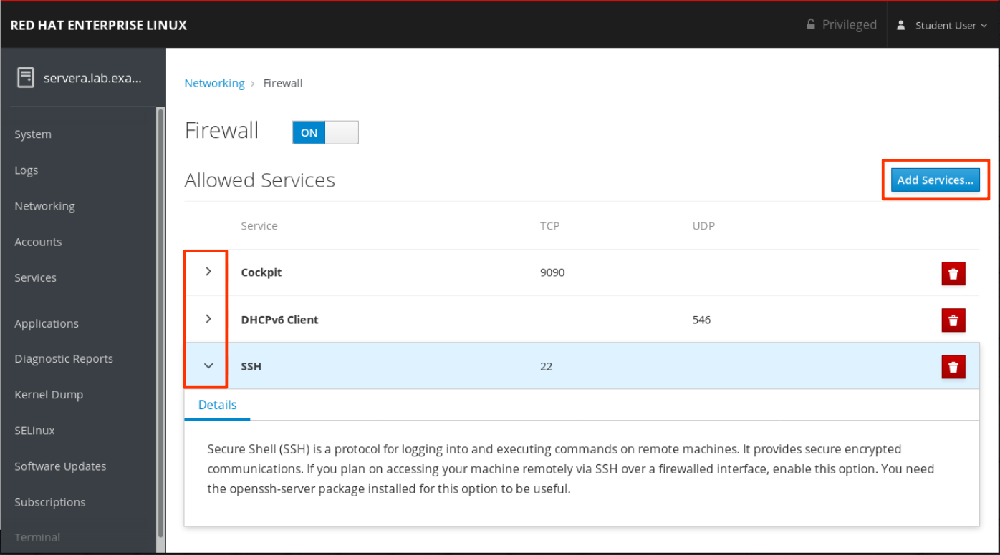

# Contents

---

-   [Contents](#contents)
-   [Basics of Linux](#basics-of-linux)
    -   [Introduction](#introduction)
        -   [Open Source](#open-source)
        -   [Linux History](#linux-history)
        -   [Linux principles](#linux-principles)
        -   [Why Linux?](#why-linux)
        -   [Linux Architecture](#linux-architecture)
        -   [Popular Linux distros](#popular-linux-distros)
        -   [Some Important Directories](#some-important-directories)
    -   [Basic File Directory and Related Commands](#basic-file-directory-and-related-commands)
    -   [Date Command](#date-command)
        -   [Syntax](#syntax)
        -   [options with Examples :](#options-with-examples-)
        -   [Format Specifiers](#format-specifiers)
    -   [Matching File Names with Shell Expansions](#matching-file-names-with-shell-expansions)
        -   [Command-line Expansions](#command-line-expansions)
            -   [Pattern Matching](#pattern-matching)
            -   [Tilde Expansion](#tilde-expansion)
            -   [Brace Expansion](#brace-expansion)
            -   [Variable Expansion](#variable-expansion)
            -   [Command Substitution](#command-substitution)
    -   [Getting Help in Linux](#getting-help-in-linux)
        -   [Man Command](#man-command)
            -   [Introduction](#introduction-1)
            -   [Navigate and Search Man Pages](#navigate-and-search-man-pages)
            -   [Reading Man pages](#reading-man-pages)
            -   [Searching for man pages by keyword](#searching-for-man-pages-by-keyword)
    -   [Vim Editor](#vim-editor)
        -   [Command Mode](#command-mode)
    -   [File Types](#file-types)
        -   [Symbolic links](#symbolic-links)
            -   [Soft link](#soft-link)
            -   [Hard link](#hard-link)
            -   [Creating symbolic links](#creating-symbolic-links)
    -   [Filters](#filters)
        -   [grep](#grep)
        -   [less](#less)
        -   [more](#more)
        -   [head](#head)
        -   [tail](#tail)
        -   [cut](#cut)
        -   [awk](#awk)
            -   [Built-In Variables in Awk](#built-in-variables-in-awk)
        -   [sed](#sed)
    -   [Redirections](#redirections)
    -   [Pipelines](#pipelines)
        -   [tee](#tee)
    -   [Users and Groups](#users-and-groups)
        -   [Users](#users)
            -   [Some Important Points](#some-important-points)
            -   [Types of User](#types-of-user)
            -   [id Command](#id-command)
            -   [`/etc/passwd` file](#etcpasswd-file)
        -   [Groups](#groups)
            -   [`/etc/group` file](#etcgroup-file)
            -   [Primary Groups and Supplementary Groups](#primary-groups-and-supplementary-groups)
        -   [Switching users](#switching-users)
        -   [Running Commands with Sudo](#running-commands-with-sudo)
            -   [Getting an Interactive Root Shell with Sudo](#getting-an-interactive-root-shell-with-sudo)
            -   [Configuring Sudo](#configuring-sudo)
        -   [Managing Local User Accounts](#managing-local-user-accounts)
            -   [Creating & Modifying Users](#creating--modifying-users)
            -   [Deleting Users](#deleting-users)
            -   [Setting Passwords](#setting-passwords)
        -   [Managing Local Groups](#managing-local-groups)
            -   [Creating and Modifying groups](#creating-and-modifying-groups)
            -   [Deleting Groups](#deleting-groups)
        -   [Managing User Passwords](#managing-user-passwords)
            -   [Shadow Passwords and Password Policy](#shadow-passwords-and-password-policy)
            -   [Format of an Encrypted Password](#format-of-an-encrypted-password)
            -   [Configuring Password Aging](#configuring-password-aging)
        -   [Additional commands](#additional-commands)
    -   [File Permissions](#file-permissions)
        -   [Changing Permissions](#changing-permissions)
            -   [Symbolic Method](#symbolic-method)
            -   [Numeric Method](#numeric-method)
        -   [Changing ownership](#changing-ownership)
        -   [Special Permissions](#special-permissions)
            -   [setuid permission](#setuid-permission)
            -   [setgid permission](#setgid-permission)
            -   [sticky permission](#sticky-permission)
        -   [Default File Permissions - umask](#default-file-permissions---umask)
    -   [Sudo](#sudo)
    -   [Processes](#processes)
        -   [Definition of a Process](#definition-of-a-process)
        -   [Process States](#process-states)
        -   [Listing Processes](#listing-processes)
            -   [ps Command](#ps-command)
            -   [top Command](#top-command)
        -   [Controlling Jobs](#controlling-jobs)
            -   [Describing Jobs and Sessions](#describing-jobs-and-sessions)
            -   [Running Jobs in the Background](#running-jobs-in-the-background)
        -   [Killing Processes](#killing-processes)
        -   [Real-time Process Monitoring](#real-time-process-monitoring)
    -   [Controling Services and Daemons](#controling-services-and-daemons)
        -   [Introduction to `systemd`](#introduction-to-systemd)
        -   [Describing Service Units](#describing-service-units)
        -   [Listing Service Units](#listing-service-units)
        -   [Viewing Service States](#viewing-service-states)
        -   [Verifying the Status of a Service](#verifying-the-status-of-a-service)
        -   [Controlling System Services](#controlling-system-services)
    -   [Configuring and Securing SSH](#configuring-and-securing-ssh)
        -   [OpenSSH](#openssh)
        -   [Identifying Remote Users](#identifying-remote-users)
        -   [SSH host keys](#ssh-host-keys)
            -   [SSH Known Hosts Key Management](#ssh-known-hosts-key-management)
        -   [Configuring SSH Key-based Authentication](#configuring-ssh-key-based-authentication)
            -   [Generating SSH Keys](#generating-ssh-keys)
            -   [Sharing the Public Key](#sharing-the-public-key)
            -   [Using ssh-agent for Non-interactive Authentication](#using-ssh-agent-for-non-interactive-authentication)
        -   [Customizing OpenSSH Service Configuration](#customizing-openssh-service-configuration)
            -   [Configuring the OpenSSH Server](#configuring-the-openssh-server)
            -   [Prohibit the Superuser From Logging in Using SSH](#prohibit-the-superuser-from-logging-in-using-ssh)
            -   [Prohibiting Password-Based Authentication for SSH](#prohibiting-password-based-authentication-for-ssh)
    -   [Analyzing and Storing Logs](#analyzing-and-storing-logs)
        -   [Describing System Log Architecture](#describing-system-log-architecture)
            -   [System Logging](#system-logging)
        -   [Reviewing Syslog Files](#reviewing-syslog-files)
            -   [Logging Events to the System](#logging-events-to-the-system)
            -   [Sample Rules of Rsyslog](#sample-rules-of-rsyslog)
            -   [Log File Rotation](#log-file-rotation)
            -   [Analyzing a Syslog Entry](#analyzing-a-syslog-entry)
            -   [Monitoring Logs](#monitoring-logs)
            -   [Sending Syslog Messages Manually](#sending-syslog-messages-manually)
        -   [Reviewing System Journal Entries](#reviewing-system-journal-entries)
            -   [Finding Events](#finding-events)
        -   [Preserving the System Journal](#preserving-the-system-journal)
        -   [Maintaining Accurate Time](#maintaining-accurate-time)
            -   [Setting Local Clocks and Time Zones](#setting-local-clocks-and-time-zones)
            -   [Configuring and Monnitoring Chronyd](#configuring-and-monnitoring-chronyd)
    -   [Managing Networking](#managing-networking)
        -   [Describing Networking Concepts](#describing-networking-concepts)
            -   [TCP/IP Network Model](#tcpip-network-model)
            -   [Describing Network Interface Names](#describing-network-interface-names)
            -   [IPv4 Networking](#ipv4-networking)
                -   [IPv4 Addresses](#ipv4-addresses)
                -   [Ipv4 Routing](#ipv4-routing)
                -   [IPv4 Address and Route Configuration](#ipv4-address-and-route-configuration)
            -   [IPv6 Networking](#ipv6-networking)
                -   [IPv6 Addresses](#ipv6-addresses)
                -   [IPv6 Subnetting](#ipv6-subnetting)
                -   [Link-local IPv6 Addresses](#link-local-ipv6-addresses)
                -   [Multicast IPv6 Addresses](#multicast-ipv6-addresses)
                -   [IPv6 Address Configuration](#ipv6-address-configuration)
            -   [Hosts Names and IP Addresses](#hosts-names-and-ip-addresses)
        -   [Validating Network Configuration](#validating-network-configuration)
            -   [Gathering Network Interface Information](#gathering-network-interface-information)
                -   [Identifying Network Interfaces](#identifying-network-interfaces)
                -   [Displaying IP Addresses](#displaying-ip-addresses)
                -   [Displaying Performance Statistics](#displaying-performance-statistics)
            -   [Checking Connectivity Between Hosts](#checking-connectivity-between-hosts)
            -   [Troubleshooting Routing](#troubleshooting-routing)
                -   [Displaying Routing Table](#displaying-routing-table)
                -   [Tracing Routes taken by Traffic](#tracing-routes-taken-by-traffic)
            -   [Troubleshooting ports and services](#troubleshooting-ports-and-services)
                -   [ss Command - Alternative to netstat](#ss-command---alternative-to-netstat)
                -   [nmap](#nmap)
                -   [dig](#dig)
        -   [Configuring Networking from the Command Line](#configuring-networking-from-the-command-line)
            -   [Describing Network Manager Concepts](#describing-network-manager-concepts)
            -   [Viewing Network Information](#viewing-network-information)
            -   [Adding a network connection](#adding-a-network-connection)
            -   [Controlling network connections](#controlling-network-connections)
            -   [Modifying Network Connection Settings](#modifying-network-connection-settings)
            -   [Deleting a network connection](#deleting-a-network-connection)
            -   [Summary of Commands](#summary-of-commands)
        -   [Editing Network Configuration Files](#editing-network-configuration-files)
            -   [Describing Connection Configuration Files](#describing-connection-configuration-files)
            -   [Modifying network configuration](#modifying-network-configuration)
        -   [Configuring Host Names and Name Resolution](#configuring-host-names-and-name-resolution)
            -   [Changing system host name](#changing-system-host-name)
            -   [Configuring name resolution](#configuring-name-resolution)
            -   [Testing DNS Name Resolution](#testing-dns-name-resolution)
    -   [Archiving and Transferring Files](#archiving-and-transferring-files)
        -   [Managing Compresses tar Archives](#managing-compresses-tar-archives)
            -   [The tar command](#the-tar-command)
            -   [Selected tar Options](#selected-tar-options)
            -   [Archiving Files and Directories](#archiving-files-and-directories)
            -   [Listing Contents of an Archive](#listing-contents-of-an-archive)
            -   [Extracting Files from an Archive](#extracting-files-from-an-archive)
            -   [Creating a Compressed Archive](#creating-a-compressed-archive)
            -   [Extracting a Compressed Archive](#extracting-a-compressed-archive)
        -   [Transferring Files Between Systems Securely](#transferring-files-between-systems-securely)
            -   [Transferring Files Using Secure Copy](#transferring-files-using-secure-copy)
            -   [Transferring Files Using the Secure File Transfer Program](#transferring-files-using-the-secure-file-transfer-program)
        -   [Synchronizing Files Betwwen Systems Securely](#synchronizing-files-betwwen-systems-securely)
            -   [Synchronizing Files and Directories with rsync](#synchronizing-files-and-directories-with-rsync)
    -   [Package Management](#package-management)
        -   [Registering Systems for Red Hat Support - For RHEL (topic for RHCSA exam)](#registering-systems-for-red-hat-support---for-rhel-topic-for-rhcsa-exam)
            -   [Red Hat Subscription Management](#red-hat-subscription-management)
            -   [Register from the Command Line](#register-from-the-command-line)
            -   [Entitlement Certificates](#entitlement-certificates)
        -   [Explaining and Investigating RPM Software Packages](#explaining-and-investigating-rpm-software-packages)
            -   [Software packages and RPM](#software-packages-and-rpm)
                -   [Updating Software with RPM Packages](#updating-software-with-rpm-packages)
            -   [Examining RPM Packages](#examining-rpm-packages)
            -   [Installing RPM Packages](#installing-rpm-packages)
        -   [Installing and Updating Software Packages with Yum](#installing-and-updating-software-packages-with-yum)
        -   [Enabling Yum Software Repositories](#enabling-yum-software-repositories)
            -   [Enabling Red Hat software repositories](#enabling-red-hat-software-repositories)
            -   [Creating Yum Repositories](#creating-yum-repositories)
            -   [RPM Configuration Packages for Local Repositories](#rpm-configuration-packages-for-local-repositories)
        -   [Managing Package Module Streams](#managing-package-module-streams)
            -   [Introduction to Application Stream](#introduction-to-application-stream)
                -   [BaseOS](#baseos)
                -   [Application Stream](#application-stream)
            -   [Modules](#modules)
                -   [Module Streams](#module-streams)
                -   [Module Profiles](#module-profiles)
            -   [Managing modules using Yum](#managing-modules-using-yum)
                -   [Listing Modules](#listing-modules)
                -   [Enabling Module Streams and Installing Modules](#enabling-module-streams-and-installing-modules)
            -   [Removing Modules and Disabling Module Streams](#removing-modules-and-disabling-module-streams)
                -   [Switching Module Streams](#switching-module-streams)
    -   [Accessing Linux File Systems](#accessing-linux-file-systems)
        -   [Identifying File Systems and Devices](#identifying-file-systems-and-devices)
            -   [Storage Management Concepts](#storage-management-concepts)
                -   [Files Systems and Mount Points](#files-systems-and-mount-points)
                -   [File Systems, Storage, and Block Devices](#file-systems-storage-and-block-devices)
                -   [Disk Partitions](#disk-partitions)
                -   [Logical Volumes](#logical-volumes)
            -   [Examining File Systems](#examining-file-systems)
        -   [Mounting and Unmounting File Systems](#mounting-and-unmounting-file-systems)
            -   [Mounting File Systems Manually](#mounting-file-systems-manually)
                -   [Identifying the Block Device](#identifying-the-block-device)
                -   [Mounting by Block Device Name](#mounting-by-block-device-name)
                -   [Mounting by File-system UUID](#mounting-by-file-system-uuid)
            -   [Automatic Mounting of Removable Storage Devices](#automatic-mounting-of-removable-storage-devices)
            -   [Unmounting File Systems](#unmounting-file-systems)
        -   [Locating Files on the System](#locating-files-on-the-system)
            -   [Searching for Files](#searching-for-files)
            -   [Locating Files by Name](#locating-files-by-name)
            -   [Searching for Files in Real Time](#searching-for-files-in-real-time)
                -   [Searching Files Based on Ownership or Permission](#searching-files-based-on-ownership-or-permission)
            -   [Searching Files Based on Size](#searching-files-based-on-size)
            -   [Searching Files Based on Modification Time](#searching-files-based-on-modification-time)
            -   [Searching Files Based on File Type](#searching-files-based-on-file-type)
    -   [Analyzing Servers and Getting Support in Red Hat Linux](#analyzing-servers-and-getting-support-in-red-hat-linux)
        -   [Analyzing and Managing Remote Servers](#analyzing-and-managing-remote-servers)
            -   [Describing the Web Console](#describing-the-web-console)
            -   [Enabling the Web Console](#enabling-the-web-console)
            -   [Logging into the Web Console](#logging-into-the-web-console)
            -   [Changing Passwords](#changing-passwords)
            -   [Troubleshooting with the Web Console](#troubleshooting-with-the-web-console)
                -   [Monitoring System Statistics in Real Time](#monitoring-system-statistics-in-real-time)
                -   [Inspecting and Filtering Syslog Events](#inspecting-and-filtering-syslog-events)
                -   [Running Commands from a Terminal Session](#running-commands-from-a-terminal-session)
                -   [Creating Diagnostic Reports](#creating-diagnostic-reports)
            -   [Managing System Services with the Web Console](#managing-system-services-with-the-web-console)
                -   [System Power Options](#system-power-options)
                -   [Controlling Running System Services](#controlling-running-system-services)
                -   [Configuring Network Interfaces and the Firewall](#configuring-network-interfaces-and-the-firewall)
                -   [Administering User Accounts](#administering-user-accounts)
    -   [Ubuntu Commands](#ubuntu-commands)
    -   [Scheduling Future Tasks](#scheduling-future-tasks)
        -   [Scheduling a Deferred User Job](#scheduling-a-deferred-user-job)
            -   [Describing Deferred Users Tasks](#describing-deferred-users-tasks)
                -   [Scheduling Deferred User Tasks](#scheduling-deferred-user-tasks)
            -   [Inspecting and Managing Deferred User Jobs](#inspecting-and-managing-deferred-user-jobs)
                -   [Removing Jobs](#removing-jobs)
        -   [Scheduling Recurring User Jobs](#scheduling-recurring-user-jobs)
            -   [Describing Recurring User Jobs](#describing-recurring-user-jobs)
            -   [Scheduling Recurring User Jobs](#scheduling-recurring-user-jobs-1)
            -   [Describing User Job Format](#describing-user-job-format)
                -   [Example Recurring User Jobs](#example-recurring-user-jobs)
        -   [Scheduling RecurringSystem Jobs](#scheduling-recurringsystem-jobs)
            -   [Describing Recurring System Jobs](#describing-recurring-system-jobs)
            -   [Introducing Systemd Timer](#introducing-systemd-timer)
                -   [Sample Timer Unit](#sample-timer-unit)
        -   [Managing Temporary Files](#managing-temporary-files)
            -   [Cleaning Temporary Files with a Systemd Timer](#cleaning-temporary-files-with-a-systemd-timer)
            -   [Cleaning Temporary Files Manually](#cleaning-temporary-files-manually)
            -   [Configuration File Precedence](#configuration-file-precedence)
    -   [Tuning System Performance](#tuning-system-performance)
        -   [Adjusting Tuning profiles](#adjusting-tuning-profiles)
            -   [Tuning Systems](#tuning-systems)
                -   [Configuring Static Tuning](#configuring-static-tuning)
                -   [Configuring Dynamic Tuning](#configuring-dynamic-tuning)
            -   [Installing and Enablined `tuned`](#installing-and-enablined-tuned)
            -   [Selecting a Tuning Profile](#selecting-a-tuning-profile)
            -   [Managing profiles from the command line](#managing-profiles-from-the-command-line)
        -   [Influencing Process Scheduling](#influencing-process-scheduling)
            -   [Linux Process Scheduling and Multitasking](#linux-process-scheduling-and-multitasking)
            -   [Relative Priorities](#relative-priorities)
            -   [Setting Nice Levels and Permissions](#setting-nice-levels-and-permissions)
            -   [Reporting Nice Levels](#reporting-nice-levels)
                -   [Displaying Nice Levels with Top](#displaying-nice-levels-with-top)
                -   [Displaying Nice Levels from the Command Line](#displaying-nice-levels-from-the-command-line)
            -   [Starting Processes with Different Nice Levels](#starting-processes-with-different-nice-levels)
            -   [Changing the Nice Level of an Existing Process](#changing-the-nice-level-of-an-existing-process)
    -   [Controlling Access to Files with ACLs](#controlling-access-to-files-with-acls)
        -   [Interpreting File ACLs](#interpreting-file-acls)
            -   [Acess Control List Concepts](#acess-control-list-concepts)
                -   [File System ACL Support](#file-system-acl-support)
            -   [Viewing and Interpreting ACL Information](#viewing-and-interpreting-acl-information)
                -   [View File ACLs](#view-file-acls)
                -   [View directory ACLs](#view-directory-acls)
                -   [The ACL Mask](#the-acl-mask)
                -   [ACL Permission Precedence](#acl-permission-precedence)
        -   [Securing Files with ACLs](#securing-files-with-acls)
            -   [Changing ACL File Permissions](#changing-acl-file-permissions)
                -   [Adding or Modifying ACLs](#adding-or-modifying-acls)
                -   [Using getfacl as input](#using-getfacl-as-input)
                -   [Setting an Explicit ACL Mask](#setting-an-explicit-acl-mask)
                -   [Recursive ACL Modifications](#recursive-acl-modifications)
                -   [Deleting ACLs](#deleting-acls)
            -   [Controlling Default ACL File Permissions](#controlling-default-acl-file-permissions)
    -   [Managing SELinux Security](#managing-selinux-security)
        -   [Changing the SELinux Enforcement Mode](#changing-the-selinux-enforcement-mode)
            -   [How SELinux Protects Resources](#how-selinux-protects-resources)
            -   [Why use Security Enhanced Linux?](#why-use-security-enhanced-linux)
            -   [Basic SELinux security concepts](#basic-selinux-security-concepts)
            -   [Changing the current SELinux mode](#changing-the-current-selinux-mode)
            -   [Setting the default SELinux mode](#setting-the-default-selinux-mode)
        -   [Controlling SELinux File Contexts](#controlling-selinux-file-contexts)
            -   [Initial SELinux Context](#initial-selinux-context)
            -   [Changing the SELinux context of a file](#changing-the-selinux-context-of-a-file)
            -   [Defining SELinux Default File Context Rules](#defining-selinux-default-file-context-rules)
                -   [Basic File Context Operations](#basic-file-context-operations)
        -   [Adjusting SELinux Policy with Booleans](#adjusting-selinux-policy-with-booleans)
            -   [SELinux booleans](#selinux-booleans)
        -   [Investigating and Resolving SELinux Issues](#investigating-and-resolving-selinux-issues)
            -   [Troubleshooting SELinux Issues](#troubleshooting-selinux-issues)
            -   [Monitoring SELinux Violations](#monitoring-selinux-violations)
    -   [Managing Basic Storage](#managing-basic-storage)
        -   [Adding Partitions, File Systems, and Persistent Mounts](#adding-partitions-file-systems-and-persistent-mounts)
            -   [Partitioning a Disk](#partitioning-a-disk)
                -   [MBR Partitioning Scheme](#mbr-partitioning-scheme)
                -   [GPT Partitioning Scheme](#gpt-partitioning-scheme)
            -   [Managing Partitions with Parted](#managing-partitions-with-parted)
                -   [Writing the Partition Table on a New Disk](#writing-the-partition-table-on-a-new-disk)
                -   [Creating MBR Partitions](#creating-mbr-partitions)
                -   [Creating GPT Partitions](#creating-gpt-partitions)
                -   [Deleting Partitions](#deleting-partitions)
            -   [Creating File Systems](#creating-file-systems)
            -   [Mounting File Systems](#mounting-file-systems)
                -   [Manually Mounting File Systems](#manually-mounting-file-systems)
            -   [Persistently Mounting File Systems](#persistently-mounting-file-systems)
        -   [Managing Swap Space](#managing-swap-space)
            -   [Introducing Swap Space Concepts](#introducing-swap-space-concepts)
                -   [Sizing the Swap Space](#sizing-the-swap-space)
            -   [Creating a Swap Space](#creating-a-swap-space)
                -   [Creating a Swap Partition](#creating-a-swap-partition)
                -   [Formatting the Device](#formatting-the-device)
            -   [Activating a Swap Space](#activating-a-swap-space)
                -   [Activating Swap Space Persistently](#activating-swap-space-persistently)
                -   [Setting the Swap Space Priority](#setting-the-swap-space-priority)
    -   [Managing Logical Volumes](#managing-logical-volumes)
        -   [Creating Logical Volumes](#creating-logical-volumes)
            -   [Logical Volume Management (LVM) Concepts](#logical-volume-management-lvm-concepts)
                -   [LVM Definitions](#lvm-definitions)
                    -   [Physical devices](#physical-devices)
                    -   [Physical volumes (PVs)](#physical-volumes-pvs)
                    -   [Volume groups (VGs)](#volume-groups-vgs)
                    -   [Logical volumes (LVs)](#logical-volumes-lvs)
            -   [Implementing LVM Storage](#implementing-lvm-storage)
                -   [Creating a Logical Volume](#creating-a-logical-volume)
                -   [Prepare the physical device.](#prepare-the-physical-device)
                -   [Create a Physical Volume](#create-a-physical-volume)
                -   [Create a Volume Group](#create-a-volume-group)
                -   [Create a Logical Volume](#create-a-logical-volume)
                -   [Add the File System](#add-the-file-system)
            -   [Removing a Logical Volume](#removing-a-logical-volume)
                -   [Prepare the file system.](#prepare-the-file-system)
                -   [Remove the Logical Volume](#remove-the-logical-volume)
                -   [Remove the Volume Group](#remove-the-volume-group)
                -   [Remove the Physical Volumes](#remove-the-physical-volumes)
            -   [Reviewing LVM Status Information](#reviewing-lvm-status-information)
                -   [Physical Volumes](#physical-volumes)
                -   [Volume Groups](#volume-groups)
                -   [Logical Volumes](#logical-volumes-1)
        -   [Extending Logical Volumes](#extending-logical-volumes)
            -   [Extending and Reducing a Volume Group](#extending-and-reducing-a-volume-group)
                -   [Extending a Volume Group](#extending-a-volume-group)
                    -   [Prepare the physical device and create the physical volume](#prepare-the-physical-device-and-create-the-physical-volume)
                    -   [Extend the volume group](#extend-the-volume-group)
                    -   [Verify that the new space is available](#verify-that-the-new-space-is-available)
                -   [Reducing a Volume Group](#reducing-a-volume-group)
                    -   [Move the physical extents](#move-the-physical-extents)
                -   [Reduce the volume group](#reduce-the-volume-group)
            -   [Extending a Logical Volume and XFS File System](#extending-a-logical-volume-and-xfs-file-system)
                -   [Extending a Logical Volume](#extending-a-logical-volume)
                    -   [Verify that the volume group has space available.](#verify-that-the-volume-group-has-space-available)
                    -   [Extend the Logical Volume](#extend-the-logical-volume)
                -   [Extend the File System](#extend-the-file-system)
                -   [Verify the new size of the mounted file system](#verify-the-new-size-of-the-mounted-file-system)
            -   [Extending a Logical Volume and EXT4 File System](#extending-a-logical-volume-and-ext4-file-system)
                -   [Extend the file system](#extend-the-file-system-1)
            -   [Extend a logical volume and swap space](#extend-a-logical-volume-and-swap-space)
                -   [Verify that volume group has space available](#verify-that-volume-group-has-space-available)
                -   [Deactivate the swap space](#deactivate-the-swap-space)
                -   [Extend the logical volume](#extend-the-logical-volume-1)
                -   [Format the logical volume as swap space](#format-the-logical-volume-as-swap-space)
                -   [Activate the swap space](#activate-the-swap-space)
    -   [Implementing Advanced Storage Features](#implementing-advanced-storage-features)
        -   [Managing Layered Storage with Stratis](#managing-layered-storage-with-stratis)
            -   [Describing the Architecture of Stratis](#describing-the-architecture-of-stratis)
            -   [Working with Stratis Storage](#working-with-stratis-storage)
                -   [Installing and Enabling Stratis](#installing-and-enabling-stratis)
                -   [Assembling Block Storage into Stratis Pools](#assembling-block-storage-into-stratis-pools)
                -   [Managing Stratis File Systems](#managing-stratis-file-systems)
                -   [Persistently Mounting Stratis File Systems](#persistently-mounting-stratis-file-systems)
        -   [Compressing and Deduplicating Storage with VDO](#compressing-and-deduplicating-storage-with-vdo)
            -   [Describing Virtual Data Optimizer](#describing-virtual-data-optimizer)
            -   [Implementing Virtual Data Optimizer](#implementing-virtual-data-optimizer)
                -   [Enabling VDO](#enabling-vdo)
                -   [Creating a VDO Volume](#creating-a-vdo-volume)
                -   [Analyzing a VDO Volume](#analyzing-a-vdo-volume)
    -   [Mounting Network-Attached Storage with NFS](#mounting-network-attached-storage-with-nfs)
        -   [Mounting and Unmounting NFS Shares](#mounting-and-unmounting-nfs-shares)
            -   [Mounting NFS Shares](#mounting-nfs-shares)
            -   [Unmounting NFS Shares](#unmounting-nfs-shares)
        -   [Automounting Network Attached Storage](#automounting-network-attached-storage)
            -   [Mounting NFS Shares with the Automounter](#mounting-nfs-shares-with-the-automounter)
                -   [Automounter Benefits](#automounter-benefits)
                -   [Create and Automount](#create-and-automount)
                -   [Direct Maps](#direct-maps)
                -   [Indirect Wildcard Maps](#indirect-wildcard-maps)
    -   [Controlling the Boot Process](#controlling-the-boot-process)
        -   [Selecting the Boot Target](#selecting-the-boot-target)
            -   [Describing the Red Hat Enterprise Linux 8 Boot Process](#describing-the-red-hat-enterprise-linux-8-boot-process)
            -   [Rebooting and Shutting Down](#rebooting-and-shutting-down)
                -   [Selecting a Systemd Target](#selecting-a-systemd-target)
                    -   [Selecting Target at Runtime](#selecting-target-at-runtime)
                    -   [Selecting a different Target at Boot Time](#selecting-a-different-target-at-boot-time)
        -   [Resetting Root Password](#resetting-root-password)
            -   [Resetting the Root Password from the Boot Loader](#resetting-the-root-password-from-the-boot-loader)
            -   [Inspecting Logs](#inspecting-logs)
            -   [Repairing Systemd Boot Issues](#repairing-systemd-boot-issues)
                -   [Enabling the Early Debug Shell](#enabling-the-early-debug-shell)
                -   [Using the Emergency and Rescue Targets](#using-the-emergency-and-rescue-targets)
                -   [Identifying Stuck Jobs](#identifying-stuck-jobs)
        -   [Repairing File System Issues at Boot](#repairing-file-system-issues-at-boot)
            -   [Diagnosing and Fixing File System Issues](#diagnosing-and-fixing-file-system-issues)
    -   [Managing Network Security](#managing-network-security)
        -   [Managing Server Firewalls](#managing-server-firewalls)
            -   [Firewall Architecture Concepts](#firewall-architecture-concepts)
                -   [Nftables enhances netfilter](#nftables-enhances-netfilter)
                -   [introducing firewalld](#introducing-firewalld)
                -   [Pre-defined Zones](#pre-defined-zones)
                -   [Pre-defined Services](#pre-defined-services)
            -   [Configuring the firewall](#configuring-the-firewall)
                -   [Configuring Firewall Services Using the Web Console](#configuring-firewall-services-using-the-web-console)
                -   [Configuring the Firewall from the Command Line](#configuring-the-firewall-from-the-command-line)
        -   [Controlling SELinux Port Laabelling](#controlling-selinux-port-laabelling)
            -   [SELinux Port Labelling](#selinux-port-labelling)
            -   [Managing SELinux Port Labelling](#managing-selinux-port-labelling)
                -   [Listing Port Labels](#listing-port-labels)
                -   [Managing Port Labels](#managing-port-labels)
                -   [Removing Port Labels](#removing-port-labels)
                -   [Modifying Port Labels](#modifying-port-labels)
    -   [Running Containers](#running-containers)
        -   [Introducing Containers](#introducing-containers)
            -   [Introducing Container Technology](#introducing-container-technology)
            -   [Comparing Containers to Virtual Machines](#comparing-containers-to-virtual-machines)
            -   [Exploring the Implementation of Containers](#exploring-the-implementation-of-containers)
            -   [Planning for Containers](#planning-for-containers)
            -   [Running Containers from Container Images](#running-containers-from-container-images)
            -   [Designing Container-based Architectures](#designing-container-based-architectures)
            -   [Managing Containers with Podman](#managing-containers-with-podman)
            -   [Running Rootless Containers](#running-rootless-containers)
            -   [Managing Containers at Scale](#managing-containers-at-scale)
        -   [Running a Basic Container](#running-a-basic-container)
            -   [Installing Container Management Tools](#installing-container-management-tools)
            -   [Selecting Container Images and Registries](#selecting-container-images-and-registries)
            -   [Container Naming Conventions](#container-naming-conventions)
            -   [Running Containers](#running-containers-1)
            -   [Analyzing Container Isolation](#analyzing-container-isolation)
        -   [Finding and Managing Container Images](#finding-and-managing-container-images)
            -   [Configuring Container Registries](#configuring-container-registries)
                -   [Registry Securiity](#registry-securiity)
            -   [Finding Container Images](#finding-container-images)
            -   [Using the Red Hat Container Catalog](#using-the-red-hat-container-catalog)
            -   [Inspecting Container Images](#inspecting-container-images)
            -   [Removing Local Container Images](#removing-local-container-images)
        -   [Performing Advanced Container Management](#performing-advanced-container-management)
            -   [Administering Containers with Podman](#administering-containers-with-podman)
            -   [Configuring Containers](#configuring-containers)
                -   [Mapping Conainer Host Ports to the Container](#mapping-conainer-host-ports-to-the-container)
            -   [Passing Environment Variables to Configure a Container](#passing-environment-variables-to-configure-a-container)
            -   [Managing Containers](#managing-containers)
            -   [Running Commands in a Container](#running-commands-in-a-container)
        -   [Attaching Persistent Storage to a Container](#attaching-persistent-storage-to-a-container)
            -   [Preparing Permanent Storage Locations](#preparing-permanent-storage-locations)
            -   [Providing Persistent Storage from the Container Host](#providing-persistent-storage-from-the-container-host)
            -   [Preparing the Host Directory](#preparing-the-host-directory)
            -   [Mounting a Volume](#mounting-a-volume)
        -   [Managing Containers as Services](#managing-containers-as-services)
            -   [Starting Containers Automatically with the Server](#starting-containers-automatically-with-the-server)
            -   [Running Systemd Services as a Regular User](#running-systemd-services-as-a-regular-user)
            -   [Creating and Managing Systemd User Services](#creating-and-managing-systemd-user-services)
            -   [Managing Containers Using Systemd Services](#managing-containers-using-systemd-services)
            -   [Creating a Dedicated User Account to Run Containers](#creating-a-dedicated-user-account-to-run-containers)
            -   [Creating the Systemd Unit File](#creating-the-systemd-unit-file)
            -   [Starting and Stopping Containers Using Systemd](#starting-and-stopping-containers-using-systemd)
            -   [Configuring Containers to Start When the Host Machine Starts](#configuring-containers-to-start-when-the-host-machine-starts)
            -   [Managing Containers Running as Root with Systemd](#managing-containers-running-as-root-with-systemd)
            -   [Orchestrating Containers at Scale](#orchestrating-containers-at-scale)
    -   [Server Management in Linux](#server-management-in-linux)
        -   [Setting up a website in CentOS7](#setting-up-a-website-in-centos7)
        -   [Automating the Static Website Setup - Infrastucture as a Code (IAAC)](#automating-the-static-website-setup---infrastucture-as-a-code-iaac)
        -   [Setting up a Wordpress Website using LAMP (Linux, Apache, MySQL, PHP) Stack](#setting-up-a-wordpress-website-using-lamp-linux-apache-mysql-php-stack)
            -   [Configuring VM and Installing Dependencies](#configuring-vm-and-installing-dependencies)
            -   [Installing WordPress](#installing-wordpress)
            -   [Configuring Apache for WordPress](#configuring-apache-for-wordpress)
            -   [Configuring database](#configuring-database)
            -   [Configuring Wordpress to connect to the database](#configuring-wordpress-to-connect-to-the-database)
        -   [Automating Wordpress Website Setup using IAAC](#automating-wordpress-website-setup-using-iaac)
        -   [Setting up a Nodejs Application](#setting-up-a-nodejs-application)
            -   [Using Apache2](#using-apache2)
                -   [Configuring VM](#configuring-vm)
                -   [Installing and Starting Apache server](#installing-and-starting-apache-server)
                -   [Installing Nodejs](#installing-nodejs)
                -   [Setting up MongoDb database](#setting-up-mongodb-database)
                    -   [Installing MongoDB](#installing-mongodb)
                    -   [Starting the MongoDB Service and Testing the Database](#starting-the-mongodb-service-and-testing-the-database)
                -   [Setting up the Node.js application](#setting-up-the-nodejs-application)
                    -   [Installing PM2](#installing-pm2)
                    -   [Configuring Apche Server for Node.js](#configuring-apche-server-for-nodejs)

---

# Basics of Linux

## Introduction

### Open Source

Open source software is a software which have its entire source code open, and anybody can inspect, modify, and enhance the software.

<div align="center">


</div>

### Linux History

-   **1984**: The GNU Project and the Free Software Foundation
    -   Creates open source version of UNIX utilities
    -   Creates the General Public License (GPL)
        -   Software license enforcing open source principles
-   **1991**: Linus Torvalds
    -   Creates open source, UNIX-like kernel, release under the GPL
    -   Ports some GNU utilities, solicits assistance online
-   **Today**:
    -   Linux kernel + GNU utilities = complete, open source, UNIX-like operating system
        -   Packaged for targeted audiences and distributions

### Linux principles

-   Everything is a file (including hardware)
-   Small Single purpose Programs
-   Ability to chain programs together for complex operations
-   Avoid Captive User Interfaces (GUI which waits for user interaction)
-   Configuration data stored in files

### Why Linux?

-   Opensource
-   Community Support
-   Support Wide Variety of hardware
-   Customization
-   Most Servers run on Linux
-   Automation
-   Security

### Linux Architecture

<div align="center">


</div>

### Popular Linux distros

-   **Desktop based**
    -   Ubuntu Linux
    -   Linux Mint
    -   Arch Linux
    -   Fedora
    -   Debian
    -   OpenSuse
-   **Server based**
    -   Red Hat Enterprise Linux
    -   Ubuntu Server
    -   Centos
    -   SUSE Enterprise Linux

### Some Important Directories

-   **Home Directories**: `/root`, `/home/username`
-   **User Executables**: `/bin`, `/usr/bin`, `usr/local/bin`
-   **System Executables**: `/sbin`, `/usr/sbin`, `/usr/local/sbin`
-   **Other Mountpoints**: `/media`, `/mnt`
-   **Configuration**: `/etc`
-   **Temporary Files**: `/tmp`
-   **Kernels and Bootloader**: `/boot`
-   **Server Data**: `/var`, `/srv`
-   **System Information**: `/proc`, `/sys`
-   **Shared Libraries**: `/lib`, `/usr/lib`, `/usr/local/lib`

## Basic File Directory and Related Commands

-   `$ whoami` - shows the current user
-   `$ pwd` - present working directory
-   `$ ls <filename>` - list files from current directory
    -   `-l` : long listing => `<filetype><permissions>. <link_count> <user_owner> <group_owner> <block_size> <last_modification_date&time> <filename>`
    -   `-t` : sort based on last updated
    -   `-r` : reverse sort
    -   `-R` : recursive
    -   `-h` : human readable format for the block size
    -   `-a`: all
-   `$ du <filename>` - Shows the disk usage of files and directories on a system. By default the size is in Kb.
    -   `-a` : List all files and directories size
    -   `-h` : Human readable format
    -   `-c` : Display grand total in the output
    -   `-s` : Display only total
    -   `-0/td>`: End output with null byte
    -   `--block-size=<size>` : Specify block size
    -   `--time` : display time modification
-   `file <filename>` : scans the beginning of a file's contents and displays what type it is.
-   `$ cat <filename>` - view the contents of a file
-   `$ sudo -i` - switch to root user
-   `$ cd <path>` - change directory
-   `$ mkdir [-p|--parents: no error if existing] <dirname>` - makes new directory
-   `$ touch <filename>` - makes new file
-   `$ touch file1{1..10}.txt` - makes 10 new files
-   `$ cp [-r|-R|--recursive: copy recursively] <src> <dest>` - copying files
-   `mv <src> <dest>` - move or rename files
-   `rm [-r|-R|--recursive: recursive] [-f|--force: force] <filename>` - remove file
-   `wc [-c: byte counts] [-m: char counts] [-l: lines count] [-L: max line length] [-w: words counts]` - print newline, word, and bytte counts for each file

## Date Command

-   `date` command is used to display the system date and time.
-   `date` command is also used to set date and time of the system.
-   By default the date command displays the date in the time zone on which unix/linux operating system is configured.
-   You must be the super-user (root) to change the date and time.

### Syntax

-   `$ date [OPTION]... [+++FORMAT]`

### options with Examples :

1. `date (no option)` : With no options, the date command displays the current date and time, including the abbreviated day name, abbreviated month name, day of the month, the time separated by colons, the time zone name, and the year.
    ```
    $ date
    Wed Jun  1 13:41:00 UTC 2022
    ```
2. `-u|--utc|--universal` : Displays the time in GMT(Greenwich Mean Time)/UTC(Coordinated Universal Time )time zone.
    ```
    $ date -u
    Wed Jun  1 13:42:53 UTC 2022
    ```
3. `-d|--date` : Displays the given date string in the format of date. But this will not affect the system’s actual date and time value.Rather it uses the date and time given in the form of string.

    ```
    $ date --date="2/02/2010"
    Tue Feb  2 00:00:00 UTC 2010

    $ date --date="Feb 2 2010"
    Tue Feb  2 00:00:00 UTC 2010

    # Past Dates
    $ date --date="2 year ago"
    Mon Jun  1 13:48:30 UTC 2020

    $ date --date="yesterday"
    Tue May 31 13:48:35 UTC 2022

    $ date --date="10 sec ago"
    Wed Jun  1 13:50:32 UTC 2022

    # Future Dates
    $ date --date="tomorrow"
    Thu Jun  2 13:48:46 UTC 2022

    $ date --date="next week"
    Wed Jun  8 13:51:15 UTC 2022

    $ date --date="2 day"
    Fri Jun  3 13:51:38 UTC 2022
    ```

4. `-s|--set` : To set the system date and time.
    ```
    $ date --set="Tue Nov 13 15:23:34 PDT 2018"
    Tue Nov 13 15:23:34 PDT 2018
    ```

### Format Specifiers

```
%D: Display date as mm/dd/yy.
%r: Displat time in 12-Hour Format
%d: Display the day of the month (01 to 31).
%a: Displays the abbreviated name for weekdays (Sun to Sat).
%A: Displays full weekdays (Sunday to Saturday).
%h: Displays abbreviated month name (Jan to Dec).
%b: Displays abbreviated month name (Jan to Dec).
%B: Displays full month name(January to December).
%m: Displays the month of year (01 to 12).
%y: Displays last two digits of the year(00 to 99).
%Y: Display four-digit year.
%T: Display the time in 24 hour format as HH:MM:SS.
%H: Display the hour.
%M: Display the minute.
%S: Display the seconds.
```

Examples :

```
$ date "+%D"
10/11/17

$ date "+%D %T"
10/11/17 16:13:27

$ date "+%Y-%m-%d"
2017-10-11

$ date "+%Y/%m/%d"
2017/10/11

$ date "+%A %B %d %T %y"
Thursday October 07:54:29 12 17
```

## Matching File Names with Shell Expansions

### Command-line Expansions

The Bash shell has multiple ways of expanding a command line including **pattern matching**, **home directory expansion**, **string expansion**, and **variable substitution**. Perhaps the most powerful of these is the **path name-matching capability**, historically called **globbing**.
The **Bash globbing** feature, sometimes called **“wildcards”**, makes managing large numbers of files easier. Using metacharacters that “expand” to match file and path names being sought, commands perform on a focused set of files at once.

#### Pattern Matching

**Globbing** is a shell command-parsing operation that expands a wildcard pattern into a list of matching path names. Command-line metacharacters are replaced by the match list prior to command execution. Patterns that do not return matches display the original pattern request as literal text. The following are common metacharacters and pattern classes.

| Pattern      | Matches                                                                                                    |
| ------------ | ---------------------------------------------------------------------------------------------------------- |
| \*           | Any string of zero or more characters                                                                      |
| ?            | Any single character                                                                                       |
| [abc...]     | Any one character in the enclosed class (between the square brackets)                                      |
| [!abc...]    | Any one character not in the enclosed class                                                                |
| [^abc...]    | Begins with any one character in the enclosed class                                                        |
| \[[:alpha:]] | Any alphabetic character                                                                                   |
| \[[:lower:]] | Any lowercase character                                                                                    |
| \[[:upper]]  | Any uppercase letter                                                                                       |
| \[[:alnum:]] | Any alphabetic character or digit                                                                          |
| \[[:punct:]] | Any printable character not a space or alphanumeric                                                        |
| \[[:digit:]] | Any single digit from 0 to 9                                                                               |
| \[[:space:]] | Any single white space character. This may include tabs, newlines, carriage returns, form feeds, or spaces |

For the next few examples, pretend that we have run the following commands to create some sample files.

```
$ mkdir glob; cd glob
$ touch alfa bravo charlie delta echo able baker cast dog easy
```

The first example will use simple pattern matches with the asterisk (\*) and question mark (?) characters, and a class of characters, to match some of those file names.

```
$ ls a*
able alfa
$ ls *a*
able alfa bravo cast charlie delta easy
$ ls [ac]*
able alfa cast charlie
$ ls ????
able alfa cast easy echo
$ ls ?????
baker bravo delta
```

#### Tilde Expansion

The tilde character (~), matches the current user's home directory. If it starts a string of characters other than a slash (/), the shell will interpret the string up to that slash as a user name, if one matches, and replace the string with the absolute path to that user's home directory. If no user name matches, then an actual tilde followed by the string of characters will be used instead.

```
$ echo ~root
/root
$ echo ~user
/home/user
$ echo ~/glob
/home/user/glob
```

#### Brace Expansion

-   Brace expansion is used to generate discretionary strings of characters.
-   Braces contain a comma-separated list of strings, or a sequence expression.
-   The result includes the text preceding or following the brace definition.
-   Brace expansions may be nested, one inside another.
-   Also double-dot syntax (`..`) expands to a sequence such that `{m..p}` will expand to `m n o p`.

```
$ echo {Sunday,Monday,Tuesday,Wednesday}.log
Sunday.log Monday.log Tuesday.log Wednesday.log
$ echo file{1..3}.txt
file1.txt file2.txt file3.txt
$ echo file{a..c}.txt
filea.txt fileb.txt filec.txt
$ echo file{a,b}{1,2}.txt
filea1.txt filea2.txt fileb1.txt fileb2.txt
$ echo file {a{1,2},b,c}.txt
filea1.txt filea2.txt fileb.txt filec.txt
```

#### Variable Expansion

-   A variable acts like a named container that can store a value in memory. Variables make it easy to access and modify the stored data either from the command line or within a shell script.
-   We can assign data as a value to a variable using the following syntax:
-   `$ VARIABLENAME=value`
-   We can use variable expansion to convert the variable name to its value on the command line. If a string starts with a dollar sign (`$`), then the shell will try to use the rest of that string as a variable name and replace it with whatever value the variable has.
    ```
    $ USERNAME=operator
    $ echo $USERNAME
    operator
    ```
-   To help avoid mistakes due to other shell expansions, you can put the name of the variable in curly braces, for example `${VARIABLENAME}`.
    ```
    $ USERNAME=operator
    $ echo ${USERNAME}
    operator
    ```

#### Command Substitution

-   Command substitution allows the output of a command to replace the command itself on the command line.
-   Command substitution occurs when a command is enclosed in parentheses, and preceded by a dollar sign (`$`).
-   The `$(command)` form can nest multiple command expansions inside each other.
    ```
    $ echo Today is $(date +%A).
    Today is Saturday.
    $ echo The time is $(date +%M) minutes past $(date +%l%p).
    The time is 50 minutes past 1PM.
    ```
    **NOTE**
-   An older form of command substitution uses backticks: \`command\`.
-   Disadvantages to the backticks form include:
    -   it can be easy to visually confuse backticks with single quote marks
    -   backticks cannot be nested.

## Getting Help in Linux

### Man Command

#### Introduction

-   One source of documentation that is generally available on the local system are system _manual pages_ or _man pages_.
-   These pages are shipped as part of the software packages for which they provide documentation, and can be accessed from the command line by using the `man` command.
-   Common Sections of the Linux Manual

| Section | Content Type                                                        |
| ------- | ------------------------------------------------------------------- |
| 1       | User Commands (both executable and shell programs)                  |
| 2       | System Calls (kernel routines invoked from user space)              |
| 3       | Library functions (provided by program libraries)                   |
| 4       | Special Files (such as device files)                                |
| 5       | File formats (for many configuration files and structures)          |
| 6       | Games (historical section for amusing programs)                     |
| 7       | Conventions, standards, and miscellaneous (protocols, file systems) |
| 8       | System administration and priviliged commands (maintenance tasks)   |
| 9       | Linux kernel API (internal kernel calls)                            |

-   To distinguish identical topic names in different sections, man page references include the section number in parentheses after the topic.
-   For example, **passwd(1)** describes the command to change passwords, while **passwd(5)** explains the `/etc/passwd` file format for storing local user accounts.
-   To read specific man pages, use `$ man topic`.
-   To display the man page topic from a specific section, include the section number argument: `$ man 5 passwd` displays **passwd(5)**.

#### Navigate and Search Man Pages

| Command   | Result                                                |
| --------- | ----------------------------------------------------- |
| Spacebar  | Scroll forward (down) one screen                      |
| PageDown  | Scroll forward (down) one sceeen                      |
| PageUp    | Scroll backward (up) one screen                       |
| DownArrow | Scroll forward (down) one line                        |
| UpArrow   | Scroll backward (up) one line                         |
| D         | Scroll forward (down) one half screen                 |
| U         | Scroll backward (up) one half-screen                  |
| /string   | Search forward (down) for `string` in the man page    |
| N         | Repeat previous search forward (down) in the man page |
| Shift + N | Repeat previous search backward (up) in the man page  |
| G         | Go to the start of the man page                       |
| Shift + G | Go to the end of the man page                         |
| Q         | Exit man and return to the command shell prompt       |

#### Reading Man pages

-   Each topic is separated into several parts. Most topics share the same headings and are presented in the same order. Typically a topic does not feature all headings, because not all headings apply for all topics.

| Headings    | Description                                                           |
| ----------- | --------------------------------------------------------------------- |
| NAME        | Subject name. Usually a command or file name. Very brief description  |
| SYNOPSIS    | Summary of the command syntax                                         |
| DESCRIPTION | In-depth description to provide a basic understanding of the topic    |
| OPTIONS     | Explanation of the command execution options                          |
| EXAMPLES    | Examples of how to use the command, function, or file                 |
| FILES       | A list of files and directories related to the man page               |
| SEE ALSO    | Related information, normally other man page topics                   |
| BUGS        | Known bugs in the software                                            |
| Author      | Information about who has contributed to the development of the topic |

#### Searching for man pages by keyword

-   A keyword search of man pages is performed with `$ man -k keyword`, which displays a list of keyword-matching man page topics with section numbers.

    ```
        $ man -k passwd
        checkPasswdAccess (3) - query the SELinux policy database in the kernel.
        chpasswd (8) - update passwords in batch mode
        ckpasswd (8) - nnrpd password authenticator
        fgetpwent_r (3) - get passwd file entry reentrantly
        getpwent_r (3) - get passwd file entry reentrantly
        ...
        passwd (1) - update user's authentication tokens
        sslpasswd (1ssl) - compute password hashes
        passwd (5) - password file
        passwd.nntp (5) - Passwords for connecting to remote NNTP servers
        passwd2des (3) - RFS password encryption
        ...
    ```

## Vim Editor

-   To install in centos: `sudo yum install vim -y`
-   To start the editor: `vim <filename>`
-   Thera are 3 modes in vim editor
    1. Command Mode
    2. Insert Mode (edit mode)
    3. Extended command mode (using `:`)
-   To set line numbers in vim: `:se nu #set numbers`

### Command Mode

|          |                                                      |
| -------- | ---------------------------------------------------- |
| gg       | To go to the beginning of the page                   |
| G        | To go to the end of the page                         |
| w        | To move the cursor forward, word by word             |
| b        | to move the cusor backward, word by word             |
| nw       | to move the cursor forward to n words (5w)           |
| nb       | To move the cursor backward to n words (5b)          |
| u        | To undo last change (word)                           |
| U        | To undo the previous changes (entire line)           |
| Ctrl + R | To redo the changes                                  |
| yy       | To copy a line                                       |
| nyy      | To copy n lines (5yy or 4yy)                         |
| p        | To paste line below the cursor position              |
| P        | To paste line above the cursor position              |
| dw       | To delete the word letter by letter (like Backspace) |
| x        | To delete the word letter by letter (like DEL key)   |
| dd       | To delete entire line                                |
| ndd      | To delete n no. of lines from cursor pointer (5dd)   |
| /        | To search a word in the file                         |

-   We can directly search in vim editor by writing forward slash(/) in **command mode**, eg: `/abcd`.
-   We can directly search and replace in vim editor in command mode by writing like this, `%s/coronavirus/covid19` (all coronavirus would be replaced by covid19).
-   It will be replaced once in every line, if you want to replace globally: `%s/coronavirus/covid19/g`

## File Types

-   `file <filename>`: command for checking the **file type**.

|              |     |                                                                                                            |
| ------------ | --- | ---------------------------------------------------------------------------------------------------------- |
| Regular File | -   | Normal files such as text, data, or executable files                                                       |
| Directory    | d   | Files that are lists of other files                                                                        |
| Link         | l   | A shortcut that points to the location of the actual file                                                  |
| Special File | c   | Mechanism used for input and output, such as files in /dev                                                 |
| Socket       | s   | A special file that provides inter-process networking protected by the file system's access control        |
| Pipe         | p   | A special file that allows processes to communicate with each other without using network socket semantics |

### Symbolic links

-   With symbolic links an administrator can assign a file or directory multiple identities.
-   Can be thought of as a pointer to original file. There are 2 types of symbolic links:
    1. hard links
    2. soft links

#### Soft link

-   Can cross the file system
-   Allows to link b/w directories
-   Has different inodes number and file permissions than original file
-   permissions will not be updated
-   has only the path of the original file, not the contents

#### Hard link

-   can't cross the filesystem boundaries
-   can't link directories
-   has the same inodes number and permissions of original file
-   permissions will be updated if we change the permissions of source file
-   has actual contents of original file, so that you can still view the contents, even if the original file moved or removed

#### Creating symbolic links

-   `ln -s <sourcefile> <soflink file>`: creates a **softlink**
-   `ln <sourcefile> <hardlink-file>`: creates a **hardlink**

## Filters

### grep

-   Used for searching the keywords of regexp in a file
-   > grep [-i : case insensitive] [-r|-R : recursive] [-v: don't show the given keyword] \<keyword | regexp> \<input>
-   Example
    -   Searching for a config in all files in afolder and its subfolders
    -   > grep -R SELINUX /etc/\*

### less

-   A reader to read the contents of 1 or more file and looks just like vim.
-   You can use up/down arrow to move, forward slash(/) to search, and q to quit.
-   > less \<filename>

### more

-   Just like less but have to press enter to move down.
-   Difference is that `more` allows us to view one or more files as a single file spearated by lines, whereas `less` allows us to switch between them.
-   > more \<filename>

### head

-   Shows the specified no. of lines from the beginning of a file
-   > head [-\<n>: no of lines to show, by default 10] \<filename>
-   For eg `$ head -20 anaconda-ks.cfg`

### tail

-   Shows the specified no. of lines from the bottom of a file
-   have very useful functionality of displaying the content in raltime by using `-f` option.
-   > tail [-\<n>: no o lines to show, by default 10] [-f : realtime changes to file] \<filename>

### cut

-   Used to separate the required content from a file in which content is separated by a fixed delimiter
-   > cut [-d\<d>: delimiter `d`] [-f\<n>: column `n`] \<file>
-   Example
    -   Getting all the usernames from /etc/passwd file
    -   `$ cut -d: f1 /etc/passwd`

### awk

-   Advanced pattern scanning and processing language
-   Operations:
    1. Scans a file line by line
    2. Splits each input line into fields
    3. Compares input line/fields to pattern
    4. Performs action(s) on matched lines
-   Useful for:
    1. Transform data files
    2. Produce formatted reports
-   Programming Constructs:
    1. Formal output lines
    2. Arithmetic and string operations
    3. Conditionals and loops
-   Syntax: `awk options 'selection_criteria {action}' input-file > output-file`
-   Options:
    ```
    -f program-file : Reads the AWK program source from the file program-file, instead of from the first command line argument.
    -F fs           : Use fs for the input field separator
    ```
-   Sample Commands
    -   **Example:** Consider the following text file as the input file for all cases below:
        `$ cat > employee.txt`
        <br>
        ```
        ajay manager account 45000
        sunil clerk account 25000
        varun manager sales 50000
        amit manager account 47000
        tarun peon sales 15000
        deepak clerk sales 23000
        sunil peon sales 13000
        satvik director purchase 80000
        ```
    1.  **Default behaviour of Awk:** By default Awk prints every line of data from the specified file.<br>`$ awk {print} employee.txt`<br>**Output:**
        ```
        ajay manager account 45000
        sunil clerk account 25000
        varun manager sales 50000
        amit manager account 47000
        tarun peon sales 15000
        deepak clerk sales 23000
        sunil peon sales 13000
        satvik director purchase 80000
        ```
    2.  Print the lines which match the given pattern<br>`$ awk '/manager/ {print}' employee.txt`<br>**Output:**
        ```
        ajay manager account 45000
        varun manager sales 50000
        amit manager account 47000
        ```
    3.  **Splitting a line into fields:** For each record, i.e, line, the awk command splits the record delimited by whitespace character by default and stores it in the `$n` variables.<br>Also, `$0` represents the whole line.<br>`$ awk '{print $1,$4}' employee.txt`<br>**Output:**
        ```
        ajay 45000
        sunil 25000
        varun 50000
        amit 47000
        tarun 15000
        deepak 23000
        sunil 13000
        satvik 80000
        ```

#### Built-In Variables in Awk

Awk's built-in variables include the field variables - `$1`, `$2`, `$3`, and so on (`$0` is the entire line) - that break a line of text into individual words or pieces called **fieds**.

-   **NR:** NR command keeps a current count of the number of input records (lines).
-   **NF:** NF command keeps a count of the number of fields within the current input record.
-   **FS:** FS command contains the field separator character which is used to divide fields on the input line. The default is “white space”, meaning space and tab characters. FS can be reassigned to another character (typically in BEGIN) to change the field separator.
-   **RS:** RS command stores the current record separator character. Since, by default, an input line is the input record, the default record separator character is a newline.
-   **OFS:** OFS command stores the output field separator, which separates the fields when Awk prints them. The default is a blank space. Whenever print has several parameters separated with commas, it will print the value of OFS in between each parameter.
-   **ORS:** ORS command stores the output record separator, which separates the output lines when Awk prints them. The default is a newline character. print automatically outputs the contents of ORS at the end of whatever it is given to print.
-   **Examples:**

    -   **Use of NR built-in variables (Display Line Number)**<br> `$ awk '{print NR,$0}' employee.txt`<br>**Output:**

        ```
            1 ajay manager account 45000
            2 sunil clerk account 25000
            3 varun manager sales 50000
            4 amit manager account 47000
            5 tarun peon sales 15000
            6 deepak clerk sales 23000
            7 sunil peon sales 13000
            8 satvik director purchase 80000
        ```

    -   **Use of NF built-in variables (Display Last Field)**<br>`$ awk '{print $1,$NF}' employee.txt`<br>**Output:**
        ```
        ajay 45000
        sunil 25000
        varun 50000
        amit 47000
        tarun 15000
        deepak 23000
        sunil 13000
        satvik 80000
        ```
    -   **Another use of NR built-in variables (Display Line From 3 to 6)**<br>`$ awk 'NR==3, NR==6 {print NR,$0}' employee.txt`<br>**Output:**
        ```
        3 varun manager sales 50000
        4 amit manager account 47000
        5 tarun peon sales 15000
        6 deepak clerk sales 23000
        ```
    -   **Practical Example:** Finding all the usernames from `/etc/passwd` file<br> `$ awk -F':' '{print $1}' /etc/passwd`

### sed

-   SED command in UNIX stands for stream editor and it can perform lots of functions on file like searching, find and replace, insertion or deletion.
-   Most common use of SED command is for find and replace.
-   By using SED we can edit files even without opening them.
-   **Syntax:**
    `$ sed OPTIONS... [SCRIPT] [INPUTFILE...]`
-   **Example:**<br>Consider the below text file as an input.<br>`$ cat > inputfile.txt`<br><br>

    ```
    unix is great os. unix is opensource. unix is free os.
    learn operating system.
    unix linux which one you choose.
    unix is easy to learn.unix is a multiuser os.Learn unix .unix is a powerful.
    ```

    1.  **Replacing or substituting string :** Sed command is mostly used to replace the text in a file. The below simple sed command replaces the word “unix” with “linux” in the file.<br>`$ sed 's/unix/linux' inputfile.txt #Changes the 1st occurence of 'unix' in every line `<br>**Output:**
        ```
        linux is great os. unix is opensource. unix is free os.
        learn operating system.
        linux linux which one you choose.
        linux is easy to learn.unix is a multiuser os.Learn unix .unix is a powerful
        ```
        Here the`s` specifies the substitution operation. The `/` are delimiters. The `unix` is the search pattern and the `linux` is the replacement string.
    2.  **Replacing the nth occurrence of a pattern in a line :** Use the /1, /2 etc flags to replace the first, second occurrence of a pattern in a line.<br>`$ sed 's/unix/linux/2' inputfile.txt`<br>**Output:**
        ```
        unix is great os. linux is opensource. unix is free os.
        learn operating system.
        unix linux which one you choose.
        unix is easy to learn.linux is a multiuser os.Learn unix .unix is a powerful.
        ```
    3.  **Replacing all the occurrence of the pattern in a line :** The substitute flag /g (global replacement) specifies the sed command to replace all the occurrences of the string in the line.<br>`$ sed 's/unix/linux/g' inputfile.txt`<br>**Output:**
        ```
        linux is great os. linux is opensource. linux is free os.
        learn operating system.
        linux linux which one you choose.
        linux is easy to learn.linux is a multiuser os.Learn linux .linux is a powerful.
        ```
    4.  **Replacing from nth occurrence to all occurrences in a line :** Use the combination of /1, /2 etc and /g to replace all the patterns from the nth occurrence of a pattern in a line. The following sed command replaces the third, fourth, fifth… “unix” word with “linux” word in a line.<br>`$ sed 's/unix/linux/3g' inputfile.txt`<br>**Output:**
        ```
        unix is great os. unix is opensource. linux is free os.
        learn operating system.
        unix linux which one you choose.
        unix is easy to learn.unix is a multiuser os.Learn linux .linux is a powerful.
        ```
    5.  **Parenthesize first character of each word**<br>`$ echo "Welocme To The Family" | sed 's/\(\b[A-Z]\)/\(\1\)/g'`<br>**Explaination:**

        ```
        sed 's/\b(pattern1)/pattern2/g' --- Does " A word by word search"

            sed 's/\(\b[A-Z]\)/pattern2/g'  --- Does " Matches a single uppercase letter"
            sed 's/\(\b[A-Z]\)/\(\1\)/g'     --- Does " sed 's/\(\b[A-Z]\)/\([A-Z]\)/g' "
                                            \1 is a back reference.
        ```

        **Output:**<br>`(W)elcome (T)o (T)he (G)eek (S)tuff`

    6.  **Replacing string on a specific line number :**<br>`$ sed '3 s/unix/linux' inputfile.txt`<br>**Output:**

        ```
        unix is great os. unix is opensource. unix is free os.
        learn operating system.
        linux linux which one you choose.
        unix is easy to learn.unix is a multiuser os.Learn unix .unix is a powerful.
        ```

    7.  **Duplicating the replaced line with /p flag :** The /p print flag prints the replaced line twice on the terminal. If a line does not have the search pattern and is not replaced, then the /p prints that line only once.<br>`$ sed 's/unix/linux/p' inputfile.txt`<br>**Output:**
        ```
        linux is great os. unix is opensource. unix is free os.
        linux is great os. unix is opensource. unix is free os.
        learn operating system.
        linux linux which one you choose.
        linux linux which one you choose.
        linux is easy to learn.unix is a multiuser os.Learn unix .unix is a powerful.
        linux is easy to learn.unix is a multiuser os.Learn unix .unix is a powerful.
        ```
    8.  **Printing only the replaced lines :** Use the -n option along with the /p print flag to display only the replaced lines. Here the -n option suppresses the duplicate rows generated by the /p flag and prints the replaced lines only one time.<br>`$ sed -n 's/unix/linux/p' inputfile.txt`<br>**Output:**
        ```
        linux is great os. unix is opensource. unix is free os.
        linux linux which one you choose.
        linux is easy to learn.unix is a multiuser os.Learn unix .unix is a powerful.
        ```
    9.  **Replacing string on a range of lines :**<br>`$ sed '1,3 s/unix/linux' inputfile.txt`<br>**Output:**
        ```
        linux is great os. unix is opensource. unix is free os.
        learn operating system.
        linux linux which one you choose.
        unix is easy to learn.unix is a multiuser os.Learn unix .unix is a powerful.
        ```
    10. **Deleting lines from a particular file :** SED command can also be used for deleting lines from a particular file. SED command is used for performing deletion operation without even opening the file<br>**Examples:**<br>1. **To Delete a particular line say n in this example**<br>&nbsp;&nbsp;&nbsp;&nbsp;**Syntax:** `$ sed 'nd' filename.txt`<br>&nbsp;&nbsp;&nbsp;&nbsp;**Example:** `$ sed '5d' filename.txt`<br>2. **To Delete a last line**<br>&nbsp;&nbsp;&nbsp;&nbsp;**Syntax:** `$ sed '$d' filename.txt`<br>3. **To Delete line from range x to y**<br>&nbsp;&nbsp;&nbsp;&nbsp;**Syntax:** `$ sed 'x,yd' filename.txt`<br>&nbsp;&nbsp;&nbsp;&nbsp;**Example:** `$ sed '3,6d' filename.txt`<br>4. **To Delete from nth to last line**<br>&nbsp;&nbsp;&nbsp;&nbsp;**Syntax:** `$ sed 'nth,$d' filename.txt`<br>&nbsp;&nbsp;&nbsp;&nbsp;**Example:** `$ sed '12,$d' filename.txt`<br>5. **To Delete pattern matching line**<br>&nbsp;&nbsp;&nbsp;&nbsp;**Syntax:** `$ sed '/pattern/d' filename.txt`<br>&nbsp;&nbsp;&nbsp;&nbsp;**Example:** `$ sed '/abc/d' filename.txt`

## Redirections

|                                                |                                                                 |
| ---------------------------------------------- | --------------------------------------------------------------- |
| `$ command > file`                             | redirect **stdout** to **overwrite** a file                     |
| `$ command >> file`                            | redirect **stdout** to **append** a file                        |
| `$ command 2> file`                            | redirect **stderr** to **overwrite** a file                     |
| `$ command 2>> file`                           | redirect **stderr** to **append** a file                        |
| `$ command > /dev/null`                        | discard / dump **stdout** messages                              |
| `$ command 2> /dev/null`                       | discard / dump **stderr** messages                              |
| `$ command &> file` or `command > file 2>&1`   | redirect both **stdout** and **stderr** to **overwrite** a file |
| `$ command &>> file` or `command >> file 2>&1` | redirect both **stdout** and **stderr** to **append** a file    |
| `$ command &>> /dev/null`                      | dump / discard all the output                                   |

-   `/dev/null` is a dump file. We can dump any content in it and it would always be empty.
-   `>file` is equivalent to `1>file` and `>>file` is equivalent to `1>>file`

## Pipelines

-   A **pipeline** is a sequence of one or more commands seperated by the pipe character `|`.
-   A pipe connects the standard output of the 1st command to the standard input of the next command.

<div align='center'>


</div>

-   **Examples:**
    -   `$ ls -l /usr/bin | less`
    -   `$ ls | wc -l`

### tee

-   **Limitation of pipelining:** When redirection is combined with a pipeline, the shell sets up the entire pipeline first, then it redirects input / output.
    If output redirection is used in the middle of a pipeline, the output will go to the file and **not** to the next command in the pipeline.

-   **Example:** `$ ls > /tmp/saved-output | less #output goes to the file and less displays nothing on the screen`
-   The **_tee_** command overcomes this limitation.
<div align='center'>


</div>

-   **Example:** `$ ls -l | tee /tmp/seved-output | less`

## Ubuntu Commands

-   In ubuntu `useradd` command don't create any home directory and many other things, so instead we can use `adduser` command.

## Scheduling Future Tasks

### Scheduling a Deferred User Job

#### Describing Deferred Users Tasks

-   Sometimes we might need to run a command, or set of commands, at a set point in the future. Examples include people who want to schedule an email to their boss, or a system administrator working on a firewall configuration who puts a “safety” job in place to reset the firewall settings in ten minutes' time, unless they deactivate the job beforehand.
    <br>

-   These scheduled commands are often called **tasks** or **jobs**, and the term deferred indicates that these tasks or jobs are going to run in the future.
    <br>

-   One of the solutions available for scheduling deferred tasks is `at`. The `at` package provides the (`atd`) system daemon along with a set of command-line tools to interact with the daemon (`at`, `atq`, and more). In a default Red Hat Enterprise Linux installation, the `atd` daemon is installed and enabled automatically.
    <br>

-   Users (including `root`) can queue up jobs for the `atd` daemon using the `at` command. The `atd` daemon provides **26 queues**, **a** to **z**, with jobs in alphabetically later queues getting lower system priority (higher `nice` values).

##### Scheduling Deferred User Tasks

-   Use the `at TIMESPEC` command to schedule a new job. The `at` command then reads the commands to execute from the stdin channel. While manually entering commands, we can finish our input by pressing `Ctrl+D`. For more complex commands that are prone to typographical errors, it is often easier to use input redirection from a script file, for example, `$ at now +5min < myscript`, rather than typing all the commands manually in a terminal window.
    <br>

-   The `TIMESPEC` argument with the at command accepts many powerful combinations, allowing users to describe exactly when a job should run. Typically, they start with a time, for example, `02:00pm`, `15:59`, or even `teatime`, followed by an optional date or number of days in the future. The following lists some examples of combinations that can be used.
    -   `now +5min`
    -   `teatime tomorrow (teatime is 16:00)`
    -   `noon +4 days`
    -   `5pm august 3 2021`

#### Inspecting and Managing Deferred User Jobs

-   To get an overview of the pending jobs for the current user, use the command `atq` or the `at -l` commands.
    `$ atq 28 Mon Feb 2 05:13:00 2015 a user 29 Mon Feb 3 16:00:00 2014 h user 27 Tue Feb 4 12:00:00 2014 a user`
    In the preceding output, every line represents a different job scheduled to run in the future. - The **unique job number** for this job. - The **execution date and time** for the scheduled job. - Indicates that the job is scheduled with the **default queue a**. Different jobs may be scheduled with different queues. - The **owner of the job** (and the user that the job will run as).
    <br>

-   **Important**

    -   Unprivileged users can only see and control their own jobs. The root user can see and manage all jobs.
        <br>

-   To inspect the actual commands that will run when a job is executed, use the `$ at -c JOBNUMBER` command. This command shows the environment for the job being set up to reflect the environment of the user who created the job at the time it was created, followed by the actual commands to be run.

##### Removing Jobs

-   The `$ atrm JOBNUMBER` command removes a scheduled job. Remove the scheduled job when it is no longer needed, for example, when a remote firewall configuration succeeded, and does not need to be reset.

### Scheduling Recurring User Jobs

#### Describing Recurring User Jobs

-   Jobs scheduled to run repeatedly are called **recurring jobs**. Linux systems ship with the `crond` daemon, provided by the `cronie` package, enabled and started by default specifically for recurring jobs. The `crond` daemon reads multiple configuration files: one per user (edited with the `crontab` command), and a set of system-wide files. These configuration files give users and administrators fine-grained control over when their recurring jobs should be executed.
    <br>

-   If a scheduled command produces any output or error that is not redirected, the `crond` daemon attempts to email that output or error to the user who owns that job (unless overridden) using the mail server configured on the system. Depending on the environment, this may need additional configuration. The output or error of the scheduled command can be redirected to different files.

#### Scheduling Recurring User Jobs

-   Normal users can use the `crontab` command to manage their jobs. This command can be called in four different ways:
    | Command | Intended Use
    | --- | ---
    | `crontab -l` | List the jobs for the current user.
    | `crontab -r` | Remove all the jobs for the current user.
    | `crontab -e` | Edit jobs for the current user.
    | `crontab filename` | Remove all jobs, and replace with the jobs read from `filename`. If no file is specified, `stdin` is used.

-   **Note**
    -   The superuser can use the `-u` option with the crontab command to manage jobs for another user.

#### Describing User Job Format

-   The `$ crontab -e` command invokes Vim by default, unless the EDITOR environment variable has been set to something different.
    -   Enter one job per line.
    -   Other valid entries include:
        -   **Empty lines** typically for ease of reading
        -   **Comments**, identified by lines starting with the number sign (`#`)
        -   **Environment variables** using the format `NAME=value`, which affects all lines below the line where they are declared.
            Common variable settings include the **`SHELL` variable**, which declares which shell to use to interpret the remaining lines of the crontab file; and the **`MAILTO` variable**, which determines who should receive any emailed output.
-   **Important**

    -   Sending email may require additional configuration of the local mail server or SMTP relay on a system.
        <br>

-   Fields in the `crontab` file appear in the following order:
    -   Minutes
    -   Hours
    -   Day of month
    -   Month
    -   Day of week
    -   Command
-   **Important**
    -   When the `Day of month` and `Day of week` fields are both other than `*`, the command is executed when either of these two fields are satisfied. For example, to run a command on the **15th of every month, and every Friday at 12:15**, use the following job format:
        ```
        15 12 15 * Fri command
        ```
-   The **first five fields** all use the same syntax rules:
    -   **`*`** for **“Do not Care”/always**.
    -   A **number** to specify a number of minutes or hours, a date, or a weekday. For weekdays, **0 equals Sunday**, 1 equals Monday, 2 equals Tuesday, and so on. **7 also equals Sunday**.
    -   **`x-y`** for a **range**, x to y **inclusive**.
    -   **`x,y`** for **lists**. Lists can include ranges as well, for example, `5,10-13,17` in the Minutes column to indicate that a job should run at 5, 10, 11, 12, 13, and 17 minutes past the hour.
    -   **`*/x`** to indicate an interval of x, for example, `*/7` in the Minutes column runs a job every seven minutes.
-   Additionally, 3-letter English abbreviations can be used for both months and weekdays, for example, `Jan`, `Feb`, and `Mon`, `Tue`.
    <br>
-   The last field contains the command to execute using the default shell. The `SHELL` environment variable can used to change the shell for the scheduled command. If the command contains an unescaped percentage sign (`%`), then that percentage sign is treated as a **newline character**, and everything after the percentage sign is passed to the command on stdin.

##### Example Recurring User Jobs

-   The following job executes the command `/usr/local/bin/yearly_backup` at exactly **9 a.m. on February 2nd, every year**.
    ```
    0 9 2 2 * /usr/local/bin/yearly_backup
    ```
-   The following job sends an email containing the word Chime to the owner of this job, **every five minutes between 9 a.m. and 5 p.m., on every Friday in July**.
    ```
    */5 9-16 * Jul 5 ehco "Chime"
    ```
    The preceding `9-16` range of hours means that the job timer starts at the ninth hour (`09:00`) and continues until the end of the sixteenth hour (`16:59`). The job starts executing at `09:00` with the last execution at `16:55` because five minutes from `16:55` is `17:00` which is beyond the given scope of hours.
-   The following job runs the command `/usr/local/bin/daily_report` **every weekday at two minutes before midnight**.
    ```
    58 11 * * 1-5 /usr/local/bin/daily_report
    ```
-   The following job executes the `mutt` command to send the mail message Checking in to the recipient `boss@example.com` on **every workday (Monday to Friday), at 9 a.m**.
    ```
    0 9 * * 1-5 mutt -s "Checking in" boss@example.com % Hi there boss, just checking in.
    ```

### Scheduling RecurringSystem Jobs

#### Describing Recurring System Jobs

-   System administrators often need to run recurring jobs. Best practice is to run these jobs from system accounts rather than from user accounts. That is, do not schedule to run these jobs using the `crontab` command, but instead use **system-wide crontab files**.
-   Job entries in the system-wide crontab files are similar to those of the users' crontab entries, excepting only that the system-wide crontab files have an extra field before the command field; the user under whose authority the command should run.
    <br>

-   The `/etc/crontab` file has a useful syntax diagram in the included comments.

    ```
     # For details see man 4 crontabs

    # Example of job definition:
    # .---------------- minute (0 - 59)
    # |  .------------- hour (0 - 23)
    # |  |  .---------- day of month (1 - 31)
    # |  |  |  .------- month (1 - 12) OR jan,feb,mar,apr ...
    # |  |  |  |  .---- day of week (0 - 6) (Sunday=0 or 7) OR sun,mon,tue ...
    # |  |  |  |  |
    # *  *  *  *  * user-name  command to be executed
    ```

-   Recurring system jobs are defined in two locations: the `/etc/crontab` file, and files within the `/etc/cron.d/` directory.
-   We should always create your custom crontab files under the `/etc/cron.d` directory to schedule recurring system jobs.
-   Place the custom crontab file in `/etc/cron.d` to protect it from being overwritten if any package update occurs to the provider of `/etc/crontab`, which may overwrite the existing contents in `/etc/crontab`.
-   Packages that require recurring system jobs place their crontab files in `/etc/cron.d/` containing the job entries. Administrators also use this location to group related jobs into a single file.
    <br>

-   The crontab system also includes repositories for scripts that need to run every hour, day, week, and month. These repositories are directories called `/etc/cron.hourly/`, `/etc/cron.daily/`, `/etc/cron.weekly/`, and `/etc/cron.monthly/`. Again, these directories contain executable shell scripts, not crontab files.
    <br>

-   **Important**
    -   Remember to make any script we place in these directories _executable_. If a script is not _executable_, it will not run. To make a script executable, use the `chmod +x script_name` command.
-   A command called `run-parts` called from the `/etc/cron.d/0hourly` file runs the `/etc/cron.hourly/*` scripts. The `run-parts` command also runs the daily, weekly, and monthly jobs, but it is called from a different configuration file called `/etc/anacrontab` .
    <br>

-   **Note**

    -   In the past, a separate service called **anacron** used to handle the `/etc/anacrontab` file, but in Red Hat Enterprise Linux 7 and later, the regular **crond** service parses this file.
        <br>

-   The purpose of `/etc/anacrontab` is to make sure that important jobs always run, and not skipped accidentally because the system was turned off or hibernating when the job should have been executed.
-   For example, if a system job that runs daily was not executed last time it was due because the system was rebooting, the job is executed when the system becomes ready. However, there may be a delay of several minutes in starting the job depending on the value of the Delay in minutes parameter specified for the job in `/etc/anacrontab`.
    <br>

-   There are different files in `/var/spool/anacron/` for each of the daily, weekly, and monthly jobs to determine if a particular job has run.
-   When **crond** starts a job from `/etc/anacrontab`, it updates the time stamps of those files. The same time stamp is used to determine when a job was last run. The syntax of `/etc/anacrontab` is different from the regular `crontab` configuration files. It contains exactly **four fields** per line, as follows.

    -   **Period in days**
        The interval in days for the job that runs on a repeating schedule. This field accepts an integer or a macro as its value. For example, the macro `@daily` is equivalent to the integer `1`, which means that the job is executed on a daily basis. Similarly, the macro `@weekly` is equivalent to the integer `7`, which means that the job is executed on a weekly basis.
    -   **Delay in minutes**
        The amount of time the `crond` daemon should wait before starting this job.
    -   **Job identifier**
        The unique name the job is identified as in the log messages.
    -   **Command**
        The command to be executed.

-   The `/etc/anacrontab` file also contains environment variable declarations using the syntax `NAME=value`.
-   Of special interest is the variable `START_HOURS_RANGE`, which specifies the time interval for the jobs to run. Jobs are not started outside of this range. If on a particular day, a job does not run within this time interval, the job has to wait until the next day for execution.

#### Introducing Systemd Timer

-   With the advent of `systemd` in Red Hat Enterprise Linux 7, a new scheduling function is now available: **_`systemd` timer units_**.
-   A `systemd` timer unit activates another unit of a different type (such as a service) whose unit name matches the timer unit name. The timer unit allows timer-based activation of other units. For easier debugging, `systemd` logs timer events in system journals.

##### Sample Timer Unit

-   The `sysstat` package provides a `systemd` timer unit called `sysstat-collect.timer` to collect system statistics every 10 minutes. The following output shows the configuration lines of `/usr/lib/systemd/system/sysstat-collect.timer`.

    ```
    ...output omitted...
    [Unit]
    Description=Run system activity accounting tool every 10 minutes

    [Timer]
    OnCalendar=*:00/10

    [Install]
    WantedBy=sysstat.service
    ```

    -   The parameter `OnCalendar=*:00/10` signifies that this timer unit activates the corresponding unit (`sysstat-collect.service`) every 10 minutes.
    -   However, we can specify more complex time intervals.
    -   For example, a value of `2019-03-* 12:35,37,39:16` against the `OnCalendar` parameter causes the timer unit to activate the corresponding service unit at `12:35:16`, `12:37:16`, and `12:39:16` every day throughout the entire month of `March, 2019`.
    -   We can also specify relative timers using parameters such as `OnUnitActiveSec`.
    -   For example, the `OnUnitActiveSec=15min` option causes the timer unit to trigger the corresponding unit 15 minutes after the last time the timer unit activated its corresponding unit.

-   **Important**

    -   Do not modify any unit configuration file under the `/usr/lib/systemd/system` directory because any update to the provider package of the configuration file may override the configuration changes we made in that file.
    -   So, make a copy of the unit configuration file we intend to change under the `/etc/systemd/system` directory and then modify the copy so that the configuration changes we make with respect to a unit does not get overridden by any update to the provider package.
    -   If two files exist with the same name under the `/usr/lib/systemd/system` and `/etc/systemd/system` directories, `systemd` parses the file under the `/etc/systemd/system` directory.
        <br>

-   After we change the timer unit configuration file, use the `systemctl daemon-reload` command to ensure that `systemd` is aware of the changes. This command reloads the `systemd` manager configuration.
    ```
    $ systemctl daemon-reload
    ```
-   After we reload the `systemd` manager configuration, use the following `systemctl command` to activate the timer unit.
    ```
    $ systemctl enable --now <unitname>.timer
    ```

### Managing Temporary Files

-   A modern system requires a large number of temporary files and directories. Some applications (and users) use the `/tmp` directory to hold temporary data, while others use a more task-specific location such as daemon and user-specific volatile directories under `/run`. In this context, volatile means that the file system storing these files only exists in memory. When the system reboots or loses power, all the contents of volatile storage will be gone.
    <br>

-   To keep a system running cleanly, it is necessary for these directories and files to be created when they do not exist, because daemons and scripts might rely on them being there, and for old files to be purged so that they do not fill up disk space or provide faulty information.
    <br>

-   Red Hat Enterprise Linux 7 and later include a new tool called `systemd-tmpfiles`, which provides a structured and configurable method to manage temporary directories and files.
    <br>

-   When `systemd` starts a system, one of the first service units launched is `systemd-tmpfiles-setup`. This service runs the command `$ systemd-tmpfiles --create --remove`.
-   This command reads configuration files from `/usr/lib/tmpfiles.d/*.conf`, `/run/tmpfiles.d/*.conf`, and `/etc/tmpfiles.d/*.conf`.
-   Any files and directories marked for deletion in those configuration files is removed, and any files and directories marked for creation (or permission fixes) will be created with the correct permissions if necessary.

#### Cleaning Temporary Files with a Systemd Timer

-   To ensure that long-running systems do not fill up their disks with stale data, a `systemd` timer unit called `systemd-tmpfiles-clean.timer` triggers `systemd-tmpfiles-clean.service` on a regular interval, which executes the `$ systemd-tmpfiles --clean` command.
    <br>

-   The `systemd` timer unit configuration files have a `[Timer]` section that indicates how often the service with the same name should be started.
    <br>

-   Use the following `systemctl` command to view the contents of the `systemd-tmpfiles-clean.timer` unit configuration file.

    ```
    $ systemctl cat systemd-tmpfiles-clean.timer
    # /usr/lib/systemd/system/systemd-tmpfiles-clean.timer
    #  SPDX-License-Identifier: LGPL-2.1+
    #
    #  This file is part of systemd.
    #
    #  systemd is free software; you can redistribute it and/or modify it
    #  under the terms of the GNU Lesser General Public License as published
    #  by
    #  the Free Software Foundation; either version 2.1 of the License, or
    #  (at your option) any later version.

    [Unit]
    Description=Daily Cleanup of Temporary Directories
    Documentation=man:tmpfiles.d(5) man:systemd-tmpfiles(8)

    [Timer]
    OnBootSec=15min
    OnUnitActiveSec=1d
    ```

-   In the preceding configuration the parameter `OnBootSec=15min` indicates that the service unit called `systemd-tmpfiles-clean.service` gets triggered 15 minutes after the system has booted up.
-   The parameter `OnUnitActiveSec=1d` indicates that any further trigger to the `systemd-tmpfiles-clean.service` service unit happens 24 hours after the service unit was activated last.
    <br>

-   Based on our requirement, we can change the parameters in the `systemd-tmpfiles-clean.timer` timer unit configuration file.
-   For example, the value `30min` for the parameter `OnUnitActiveSec` triggers the `systemd-tmpfiles-clean.service` service unit 30 minutes after the service unit was last activated. As a result, `systemd-tmpfiles-clean.service` gets triggered every 30 minutes after bringing the changes into effect.
    <br>

-   After changing the timer unit configuration file, use the `$ systemctl daemon-reload` command to ensure that systemd is aware of the change. This command reloads the `systemd` manager configuration.
    ```
    $ systemctl daemon-reload
    ```
-   After we reload the `systemd` manager configuration, use the following `systemctl` command to activate the `systemd-tmpfiles-clean.timer` unit.
    ```
    $ systemctl enable --now systemd-tmpfiles-clean.timer
    ```

#### Cleaning Temporary Files Manually

-   The command `systemd-tmpfiles --clean` parses the same configuration files as the `systemd-tmpfiles --create` command, but instead of creating files and directories, it will purge all files which have not been accessed, changed, or modified more recently than the maximum age defined in the configuration file.
    <br>

-   The format of the configuration files for `systemd-tmpfiles` is detailed in the `tmpfiles.d(5)` manual page.
-   The basic syntax consists of **seven columns** : **Type**, **Path**, **Mode**, **UID**, **GID**, **Age**, and **Argument**.
-   **Type** refers to the action that `systemd-tmpfiles` should take; for example, `d` to create a directory if it does not yet exist, or `Z` to recursively restore SELinux contexts and file permissions and ownership.
    <br>

-   The following are some examples with explanations.
    `d /run/systemd/seats 0755 root root -`
    When creating files and directories, create the `/run/systemd/seats` directory if it does not yet exist, owned by the user `root` and the group `root`, with permissions set to `rwxr-xr-x`. This directory will not be automatically purged.
    <br>
    `D /home/student 0700 student student 1d`
    Create the `/home/student` directory if it does not yet exist. If it does exist, empty it of all contents. When `systemd-tmpfiles --clean` is run, remove all files which have not been accessed, changed, or modified in more than one day.
    <br>

        ```
        L /run/fstablink - root root - /etc/fstab
        ```
        Create the symbolic link `/run/fstablink` pointing to `/etc/fstab`. Never automatically purge this line.

    <br>

#### Configuration File Precedence

-   Configuration files can exist in **three places** :

    -   `/etc/tmpfiles.d/*.conf`
    -   `/run/tmpfiles.d/*.conf`
    -   `/usr/lib/tmpfiles.d/*.conf`

-   The files in `/usr/lib/tmpfiles.d/` are provided by the relevant RPM packages, and we should not edit these files.
-   The files under `/run/tmpfiles.d/` are themselves volatile files, normally used by daemons to manage their own runtime temporary files.
-   The files under `/etc/tmpfiles.d/` are meant for administrators to configure custom temporary locations, and to override vendor-provided defaults.
    <br>

-   If a file in `/run/tmpfiles.d/` has the same file name as a file in `/usr/lib/tmpfiles.d/`, then the file in `/run/tmpfiles.d/` is used.
-   If a file in `/etc/tmpfiles.d/` has the same file name as a file in either `/run/tmpfiles.d/` or `/usr/lib/tmpfiles.d/`, then the file in `/etc/tmpfiles.d/` is used.
    <br>

-   Given these precedence rules, we can easily override vendor-provided settings by copying the relevant file to `/etc/tmpfiles.d/`, and then editing it.
-   Working in this fashion ensures that administrator-provided settings can be easily managed from a central configuration management system, and not be overwritten by an update to a package.
    <br>

-   **Note**
    -   When testing new or modified configurations, it can be useful to only apply the commands from one configuration file. This can be achieved by specifying the name of the configuration file on the command line.

## Tuning System Performance

### Adjusting Tuning profiles

#### Tuning Systems

-   System administrators can optimize the performance of a system by adjusting various device settings based on a variety of use case workloads. The `tuned` daemon applies tuning adjustments both statically and dynamically, using tuning profiles that reflect particular workload requirements.

##### Configuring Static Tuning

-   The `tuned` daemon applies system settings when the service starts or upon selection of a new tuning profile. **Static tuning** configures predefined kernel parameters in profiles that tuned applies at runtime. With static tuning, kernel parameters are set for overall performance expectations, and are not adjusted as activity levels change.

##### Configuring Dynamic Tuning

-   With **dynamic tuning**, the `tuned` daemon monitors system activity and adjusts settings depending on runtime behavior changes.
-   **Dynamic tuning** is continuously adjusting tuning to fit the current workload, starting with the initial settings declared in the chosen tuning profile.
    <br>

-   For example, storage devices experience high use during startup and login, but have minimal activity when user workloads consist of using web browsers and email clients.
-   Similarly, CPU and network devices experience activity increases during peak usage throughout a workday.
-   The `tuned` daemon monitors the activity of these components and adjusts parameter settings to maximize performance during high-activity times and reduce settings during low activity. The tuned daemon uses performance parameters provided in predefined tuning profiles.

#### Installing and Enablined `tuned`

    ```
    $ yum install tuned
    $ systemctl enable --now tuned
    Created symlink /etc/systemd/system/multi-user.target.wants/tuned.service → /usr/lib/systemd/system/tuned.service.
    ```

#### Selecting a Tuning Profile

-   The Tuned application provides profiles divided into the following categories :
    -   **Power-saving** profiles
    -   **Performance-boosting** profiles
-   The **performance-boosting** profiles include profiles that focus on the following aspects :

    -   **Low latency** for storage and network
    -   **High throughput** for storage and network
    -   **Virtual machine performance**
    -   **Virtualization host performance**

        | Tuned Profile            | Purpose                                                                                                                                 |
        | ------------------------ | --------------------------------------------------------------------------------------------------------------------------------------- |
        | `balanced`               | Ideal for systems that require a **compromise between power saving and performance**.                                                   |
        | `desktop`                | Derived from the `balanced` profile. Provides **faster response of interactive applications**.                                          |
        | `throughput-performance` | Tunes the system for **maximum throughput**.                                                                                            |
        | `latency-performance`    | Ideal for server systems that require **low latency at the expense of power consumption**.                                              |
        | `network-latency`        | Derived from the `latency-performance` profile. It enables additional network tuning parameters to provide **low network latency**.     |
        | `network-throughput`     | Derived from the `throughput-performance` profile. Additional network tuning parameters are applied for **maximum network throughput**. |
        | `powersave`              | Tunes the system for **maximum power saving**.                                                                                          |
        | `oracle`                 | **Optimized for Oracle database loads** based on the throughput-performance profile.                                                    |
        | `virtual-guest`          | Tunes the system for **maximum performance if it runs on a virtual machine**.                                                           |
        | `virtual-host`           | Tunes the system for **maximum performance if it acts as a host for virtual machines**.                                                 |

#### Managing profiles from the command line

-   The `tuned-adm` command is used to change settings of the `tuned` daemon. The `tuned-adm` command can query current settings, list available profiles, recommend a tuning profile for the system, change profiles directly, or turn off tuning.
    <br>

-   A system administrator identifies the currently active tuning profile with `$ tuned-adm active`.
    ```
    $ tuned-adm active
    Current active profile: virtual-guest
    ```
-   The `$ tuned-adm list` command lists all available tuning profiles, including both built-in profiles and custom tuning profiles created by a system administrator.
    ```
    $ tuned-adm list
    Available profiles:
    - balanced
    - desktop
    - latency-performance
    - network-latency
    - network-throughput
    - powersave
    - sap
    - throughput-performance
    - virtual-guest
    - virtual-host
    Current active profile: virtual-guest
    ```
-   Use `$ tuned-adm profile profilename` to switch the active profile to a different one that better matches the system's current tuning requirements.
    ```
    $ tuned-adm profile throughput-performance
    $ tuned-adm active
    Current active profile: throughput-performance
    ```
-   The `tuned-adm` command can recommend a tuning profile for the system. This mechanism is used to determine the default profile of a system after installation.
    `$ tuned-adm recommend virtual-guest`
    <br>

-   **Note**

    -   The `$ tuned-adm recommend` output is based on various system characteristics, including whether the system is a virtual machine and other predefined categories selected during system installation.
        <br>

-   To revert the setting changes made by the current profile, either switch to another profile or deactivate the `tuned` daemon. Turn off tuned tuning activity with `tuned-adm off`.
    ```
    $ tuned-adm off
    $ tuned-adm active
    No current active profile.
    ```

### Influencing Process Scheduling

#### Linux Process Scheduling and Multitasking

-   Modern computer systems range from low-end systems that have single CPUs that can only execute a single instruction at any instance of time, to high-performing supercomputers with hundreds of CPUs each and dozens or even hundreds of processing cores on each CPU, allowing the execution of huge numbers of instructions in parallel. All these systems still have one thing in common: **the need to run more process threads than they have CPUs**.
    <br>

-   Linux and other operating systems run more processes than there are processing units using a technique called **time-slicing** or **multitasking**.
-   The operating system **process scheduler** rapidly switches between processes on a single core, giving the impression that there are multiple processes running at the same time.

#### Relative Priorities

-   Different processes have different levels of importance. The process scheduler can be configured to use different scheduling policies for different processes.
-   The scheduling policy used for most processes running on a regular system is called `SCHED_OTHER` (also called `SCHED_NORMAL`), but other policies exist for various workload needs.
    <br>

-   Since not all processes are equally important, processes running with the `SCHED_NORMAL` policy can be given a relative priority.
-   This priority is called the **nice value of a process**, which are organized as **40 different levels** of niceness for any process.
    <br>

-   The **nice level** values range from `-20` (highest priority) to `19` (lowest priority).
-   By default, processes inherit their nice level from their parent, which is usually `0`.
-   **Higher nice levels indicate less priority** (the process easily gives up its CPU usage), while lower nice levels indicate a higher priority (the process is less inclined to give up the CPU).
    <br>

-   If there is no contention for resources, for example, when there are fewer active processes than available CPU cores, even processes with a high nice level will still use all available CPU resources they can.
-   However, when there are more processes requesting CPU time than available cores, the processes with a higher nice level will receive less CPU time than those with a lower nice level.

#### Setting Nice Levels and Permissions

-   Since setting a low nice level on a CPU-hungry process might negatively impact the performance of other processes running on the same system, **only the root user may reduce a process nice level**.
    <br>

-   **Unprivileged users are only permitted to increase nice levels on their own processes**. They cannot lower the nice levels on their processes, nor can they modify the nice level of other users' processes.

#### Reporting Nice Levels

-   Several tools display the nice levels of running processes. Process management tools, such as `top`, display the nice level by default. Other tools, such as the `ps` command, display nice levels when using the proper options.

##### Displaying Nice Levels with Top

-   Use the `top` command to interactively view and manage processes.
-   The default configuration displays two columns of interest about nice levels and priorities.
    -   The `NI` column displays the **process nice value** and the `PR` column displays its **scheduled priority**.
-   In the top interface, the nice level maps to an internal system priority queue as displayed in the following graphic.
-   For example, a nice level of `-20` maps to `0` in the `PR` column. A nice level of `19` maps to a priority of `39` in the `PR` column.

    

##### Displaying Nice Levels from the Command Line

-   The `ps` command displays process nice levels, but only by including the correct formatting options.
    <br>

-   The following `ps` command lists all processes with their `PID`, `process name`, `nice level`, and `scheduling class`, **sorted in descending order by nice level**.
-   Processes that display `TS` in the `CLS` scheduling class column, run under the `SCHED_NORMAL` scheduling policy.
-   Processes with a dash (`-`) as their nice level, run under other scheduling policies and are interpreted as a higher priority by the scheduler.
    ```
    ps axo pid,comm,nice,cls --sort=nice
    PID COMMAND          NI CLS
     30 khugepaged       19  TS
     29 ksmd              5  TS
        1 systemd         0  TS
        2 kthreadd        0  TS
        9 ksoftirqd/0     0  TS
     10 rcu_sched         0  TS
     11 migration/0       -  FF
     12 watchdog/0        -  FF
    ...output omitted...
    ```

#### Starting Processes with Different Nice Levels

-   During process creation, a process inherits its parent's nice level.
-   When a process is started from the command line, it will inherit its nice level from the shell process where it was started.
-   Typically, this results in new processes running with a nice level of `0`.
    <br>

-   The following example starts a process from the shell, and displays the process's nice value. Note the use of the `PID` option in the `ps` to specify the output requested.
    `$ sha1sum /dev/zero & [1] 3480 $ ps -o pid,comm,nice 3480 PID COMMAND NI 3480 sha1sum 0`
    <br>

-   The nice command can be used by all users to start commands with a default or higher nice level.
-   Without options, the nice command starts a process with the default nice value of `10`.
    <br>

-   The following example starts the `sha1sum` command as a background job with the default nice level and displays the process's nice level :
    `$ nice sha1sum /dev/zero & [1] 3517 $ ps -o pid,comm,nice 3517 PID COMMAND NI 3517 sha1sum 10`
    <br>

-   Use the `-n` option to apply a user-defined nice level to the starting process. The default is to add `10` to the process' current nice level.
-   The following example starts a command as a background job with a user-defined nice value and displays the process's nice level :
    `$ nice -n 15 sha1sum & [1] 3521 $ ps -o pid,comm,nice 3521 PID COMMAND NI 3521 sha1sum 15`
    <br>

-   **Important**
    -   Unprivileged users may only increase the nice level from its current value, to a maximum of `19`. Once increased, unprivileged users cannot reduce the value to return to the previous nice level. The root use may reduce the nice level from any current level, to a minimum of `-20`.

#### Changing the Nice Level of an Existing Process

-   The nice level of an existing process can be changed using the `renice` command.
-   This example uses the `PID` identifier from the previous example to change from the current nice level of `15` to the desired nice level of `19`.

    ```
    $ renice -n 19 3521
    3521 (process ID) old priority 15, new priority 19
    ```

      <br>

-   The `top` command can also be used to change the nice level on a process.
-   From within the `top` interactive interface, press the `r` option to access the `renice` command, followed by the `PID` to be changed and the new nice level.

## Controlling Access to Files with ACLs

### Interpreting File ACLs

#### Acess Control List Concepts

-   Standard Linux file permissions are satisfactory when files are used by only a single owner, and a single designated group of people. However, some use cases require that files are accessed with different file permission sets by multiple named users and groups. **Access Control Lists (ACLs)** provide this function.
    <br>

-   With ACLs, we can grant permissions to multiple users and groups, identified by user name, group name, UID, or GID, using the same permission flags used with regular file permissions: read, write, and execute. These additional users and groups, beyond the file owner and the file's group affiliation, are called **named users** and **named groups** respectively, because they are named not in a long listing, but rather within an ACL.
    <br>

-   Users can set ACLs on files and directories that they own.
-   Privileged users, assigned the `CAP_FOWNER` Linux capability, can set ACLs on any file or directory.
-   New files and subdirectories automatically inherit ACL settings from the parent directory's default ACL, if they are set.
-   Similar to normal file access rules, the parent directory hierarchy needs at least the other search (execute) permission set to enable named users and named groups to have access.

##### File System ACL Support

-   File systems need to be mounted with ACL support enabled.
-   XFS file systems have built-in ACL support.
-   Other file systems, such as ext3 or ext4 have the acl option enabled by default, although on earlier versions we should confirm that ACL support is enabled.
-   To enable file-system ACL support, use the ACL option with the `mount` command or in the file system's entry in `/etc/fstab` configuration file.

#### Viewing and Interpreting ACL Information

-   The `ls -l` command only outputs minimal ACL setting details :

    ```
    $ ls -l reports.txt
    -rwxrw----+ 1 user operators 130 Mar 19 23:56 reports.txt
    ```

    -   The **plus sign** (`+`) at the end of the 10-character permission string indicates that an extended ACL structure with entries exists on this file.
    -   **user :**
        -   Shows the user ACL settings, which are the same as the standard user file settings; `rwx`.
    -   **group :**
        -   Shows the current ACL mask settings, not the group owner settings; `rw`.
    -   **other :**
        -   Shows the other ACL settings, which are the same as the standard other file settings; `no access`.

-   **Important**
    -   Changing group permissions on a file with an ACL by using chmod does not change the group owner permissions, but does change the ACL mask. Use `setfacl -m g::perms file` if the intent is to update the file's group owner permissions.

##### View File ACLs

-   To display ACL settings on a file, use `getfacl file` :
    ```
    $ getfacl reports.txt
    # file: reports.txt
    # owner: user
    # group: operators
    user::rwx
    user:consultant3:---
    user:1005:rwx       #effective:rw-
    group::rwx          #effective:rw-
    group:consultant1:r--
    group:2210:rwx      #effective:rw-
    mask::rw-
    other::---
    ```
    Review each section of this example :
    -   **Commented entries :**
        ```
        # file: reports.txt
        # owner: user
        # group: operators
        ```
        -   The first three lines are comments that identify the file name, owner (user), and group owner (operators). If there are any additional file flags, such as setuid or setgid, then a fourth comment line will appear showing which flags are set.
    -   **User entries :**
        ```
        user::rwx
        user:consultant3:---
        user:1005:rwx        #effective:rw-
        ```
        1. **File owner permissions**. `user` has `rwx`.
        2. **Named user permissions**. One entry for each named user associated with this file. `consultant3` has `no permissions`.
        3. **Named user permissions**. `UID 1005` has `rwx`, but the mask limits the effective permissions to `rw` only.
    -   **Group Entries :**
        ```
        group::rwx              #effective:rw-
        group:consultant1:r--
        group:2210:rwx          #effective:rw-
        ```
        1. **Group owner permissions**. operators has `rwx`, but the mask limits the effective permissions to `rw` only.
        2. **Named group permissions**. One entry for each named group associated with this file. `consultant1` has `r` only.
        3. **Named group permissions**. `GID 2210` has `rwx`, but the mask limits the effective permissions to `rw` only.
    -   **Mask entry :**
        ```
        mask::rw-
        ```
        -   Mask settings show the maximum permissions possible for all named users, the group owner, and named groups. UID 1005, operators, and GID 2210 cannot execute this file, even though each entry has the execute permission set.
    -   **Other entry :**
        ```
        other::---
        ```
        -   Other or "world" permissions. All other UIDs and GIDs have NO permissions.

##### View directory ACLs

-   To display ACL settings on a directory, use the `getfacl directory` command :

    ```
    $ getfacl .
    # file: .
    # owner: user
    # group: operators
    # flags: -s-
    user::rwx
    user:consultant3:---
    user:1005:rwx
    group::rwx
    group:consultant1:r-x
    group:2210:rwx
    mask::rwx
    other::---
    default:user::rwx
    default:user:consultant3:---
    default:group::rwx
    default:group:consultant1:r-x
    default:mask::rwx
    default:other::---
    ```

    Review each section of the previous example :

    -   **Opening comment entries :**
        ```
        # file: .
        # owner: users
        # group: operators
        # flag: -s-
        ```
        -   The first three lines are comments that identify the directory name, owner (user), and group owner (operators). If there are any additional directory flags (setuid, setgid, sticky), then a fourth comment line shows which flags are set; in this case, setgid.
    -   **Standard ACL entries :**
        ```
        user::rwx
        user:consultant3:---
        user:1005:rwx
        group::rwx
        group:consultant1:r-x
        group:2210:rwx
        mask::rwx
        other::---
        ```
        -   The ACL permissions on this directory are the same as the file example shown above, but apply to the directory.
        -   The key difference is the inclusion of the execute permission on these entries (when appropriate) to allow directory search permission.
    -   **Default user entries :**
        ```
        default:user::rwx
        default:user:consultant3:---
        ```
        1. **Default file owner ACL permissions**. The file owner will get `rwx`, **read/write** on new files and **execute** on new subdirectories.
        2. **Default named user ACL permissions**. One entry for each named user who will automatically get the default ACL applied to new files or subdirectories. `consultant3` always defaults to `no permissions`.
    -   **Default group entries :**
        ```
        default:group::rwx
        default:group:consultant1:r-x
        ```
        1. **Default group owner ACL permissions**. The file group owner will get `rwx`, **read/write** on new files and **execute** on new subdirectories.
        2. **Default named group ACL permissions**. One entry for each named group which will automatically get the default ACL. `consultant1` will get `rx`, **read-only** on new files, and **execute** on new subdirectories.
    -   **Default ACL mask entry :**
        ```
        default:mask::rwx
        ```
        -   Default mask settings show the initial maximum permissions possible for all new files or directories created that have named user ACLs, the group owner ACL, or named group ACLs: read and write for new files and execute permission on new subdirectories. New files never get execute permission.
    -   **Default other entry :**
        ```
        default:other::---
        ```
        -   Default other or "world" permissions. All other UIDs and GIDs have no permissions to new files or new subdirectories.
        -   The default entries in the above example do not include the named user (UID 1005) and named group (GID 2210); consequently, they will not automatically get initial ACL entries added for them to any new files or new subdirectories. This effectively limits them to files and subdirectories that they already have ACLs on, or if the relevant file owner adds the ACL later using `setfacl`. They can still create their own files and subdirectories.

-   **Note**
    -   The output from `getfacl` command can be used as input to `setfacl` for restoring ACLs, or for copying ACLs from a source file or directory and save them into a new file.
    -   For example, to restore ACLs from a backup, use `$ getfacl -R /dir1 > file1` to generate a recursive ACL output dump file for the directory and its contents. The output can then be used for recovery of the original ACLs, passing the saved output as input to the `setfacl` command.
    -   For example, to perform a bulk update of the same directory in the current path use the following command : `$ setfacl --set-file=file1`

##### The ACL Mask

-   The ACL mask defines the maximum permissions that you can grant to named users, the group owner, and named groups. It does not restrict the permissions of the file owner or other users. All files and directories that implement ACLs will have an ACL mask.
    <br>

-   The mask can be viewed with `getfacl` and explicitly set with `setfacl`. It will be calculated and added automatically if it is not explicitly set, but it could also be inherited from a parent directory default mask setting.
-   By default, the mask is recalculated whenever any of the affected ACLs are added, modified, or deleted.

##### ACL Permission Precedence

-   When determining whether a process (a running program) can access a file, file permissions and ACLs are applied as follows:
    -   If the process is running as the user that owns the file, then the file's user ACL permissions apply.
    -   If the process is running as a user that is listed in a named user ACL entry, then the named user ACL permissions apply (as long as it is permitted by the mask).
    -   If the process is running as a group that matches the group owner of the file, or as a group with an explicitly named group ACL entry, then the matching ACL permissions apply (as long as it is permitted by the mask).
    -   Otherwise, the file's other ACL permissions apply.

### Securing Files with ACLs

#### Changing ACL File Permissions

-   Use `setfacl` to add, modify, or remove standard ACLs on files and directories.
    <br>

-   ACLs use the normal file system representation of permissions, "`r`" for read permission, "`w`" for write permission, and "`x`" for execute permission.
-   A "`-`" (dash) indicates that the relevant permission is absent.
-   When (recursively) setting ACLs, an uppercase "`X`" can be used to indicate that execute permission should only be set on directories and not regular files, unless the file already has the relevant execute permission. This is the same behavior as `chmod`.

##### Adding or Modifying ACLs

-   ACLs can be set via the command-line using the `-m` option, or passed in via a file using the `-M` option (use "`-`" (dash) instead of a file name for `stdin`).
-   These two options are the "`modify`" options; they add new ACL entries or replace specific existing ACL entries on a file or directory. Any other existing ACL entries on the file or directory remain untouched.

-   **Note**

    -   Use the `--set` or `--set-file` options to completely replace the ACL settings on a file.
        <br>

-   When first defining an ACL on a file, if the add operation does not include settings for the file owner, group owner, or other permissions, then these will be set based on the current standard file permissions (these are also known as the base ACL entries and cannot be deleted), and a new mask value will be calculated and added as well.
    <br>

-   To add or modify a user or named user ACL : <br> `$ setfacl -m u:name:rX file`

    -   If `name` is left blank, then it applies to the file owner, otherwise `name` can be a username or UID value.
    -   In this example, the permissions granted would be read-only, and if already set, execute (unless file was a directory, in which case the directory would get the execute permission set to allow directory search).
        <br>
    -   ACL file owner and standard file owner permissions are equivalent; consequently, using `chmod` on the file owner permissions is equivalent to using `setfacl` on the file owner permissions. `chmod` has no effect on named users.
        <br>

-   To add or modify a group or named group ACL : <br> `$ setfacl -m g:name:rw file`

    -   This follows the same pattern for adding or modifying a user ACL entry. If name is left blank, then it applies to the group owner. Otherwise, specify a group name or GID value for a named group. The permissions would be read and write in this example.
        <br>
    -   `chmod` has no effect on any group permissions for files with ACL settings, but it updates the ACL mask.
        <br>

-   To add or modify the other ACL : <br> `$ setfacl -m o::- file`

    -   other only accepts permission settings. Typical permission settings for others are: no permissions at all, set with a dash (`-`); and read-only permissions set as usual with `r`. Of course, we can set any of the standard permissions.
        <br>
    -   ACL other and standard other permissions are equivalent, so using `chmod` on the other permissions is equivalent to using `setfacl` on the other permissions.
        <br>

-   We can add multiple entries with the same command; use a comma-separated list of entries : <br> `$ setfacl -m u::rwx,g:consultants:rX,o::- file`

##### Using getfacl as input

-   We can use the output from `getfacl` as input to `setfacl` : <br> `$ getfacl file-A | setfacl --set-file=- file-B`
    -   The `--set-file` option accepts input from a file or from `stdin`. The dash character (`-`) specifies the use of `stdin`. In this case, file-B will have the same ACL settings as file-A.

##### Setting an Explicit ACL Mask

-   We can set an ACL mask explicitly on a file or directory to limit the maximum effective permissions for named users, the group owner, and named groups.
-   This restricts any existing permissions that exceed the mask, but does not affect permissions that are less permissive than the mask. <br> `$ setfacl -m m::r file`
    <br>

-   **Important**

    -   By default, each time one of the impacted ACL settings (named users, group owner, or named groups) is modified or deleted, the ACL mask is recalculated, potentially resetting a previous explicit mask setting.
        <br>

    -   To avoid the mask recalculation, use the `-n` option or include a mask setting (`-m m::perms`) with any `setfacl` operation that modifies mask-affected ACL settings.

##### Recursive ACL Modifications

-   When setting an ACL on a directory, use the `-R` option to apply the ACL recursively.
-   Remember that we are likely to want to use the "`X`" (capital X) permission with recursion so that files with the execute permission set retain the setting and directories get the execute permission set to allow directory search.
-   It is considered good practice to also use the uppercase "`X`" when non-recursively setting ACLs because it prevents administrators from accidentally adding execute permissions to a regular file. <br> `$ setfacl -R -m u:name:rX directory`
    -   This adds the user name to the directory directory and all existing files and subdirectories, setting read-only and conditional execute permissions.

##### Deleting ACLs

-   Deleting specific ACL entries follows the same basic format as the modify operation, except that "`:perms`" is not specified. <br> `$ setfacl -x u :name,g:name file`
    -   This removes only the named user and the named group from the file or directory ACL. Any other existing ACL entries remain active.
-   We can include both the delete (`-x`) and modify (`-m`) operations in the same setfacl operation.
    <br>

-   The mask can only be deleted if there are no other ACLs set (excluding the base ACL which cannot be deleted), so it must be deleted last. The file will no longer have any ACLs and `ls -l` will not show the plus sign (`+`) next to the permissions string.
-   Alternatively, to delete all ACL entries on a file or directory (including default ACL on directories), use the following command : <br> `setfacl -b file`

#### Controlling Default ACL File Permissions

-   To ensure that files and directories created within a directory inherit certain ACLs, use the default ACL on a directory.
-   We can set a default ACL and any of the standard ACL settings, including a default mask.
    <br>

-   The directory itself still requires standard ACLs for access control because the default ACLs do not implement access control for the directory; they only provide ACL permission inheritance support. For example: <br> `$ setfacl -m d:u:name:rx directory`
    -   This adds a default named user (`d:u:name`) with read-only permission and execute permission on subdirectories.
-   The `setfacl` command for adding a default ACL for each of the ACL types is exactly the same as for standard ACLs, but prefaced with `d:`.
-   Alternatively, use the `-d` option on the command line.
    <br>

-   **Important**

    -   When setting default ACLs on a directory, ensure that users will be able to access the contents of new subdirectories created in it by including the execute permission on the default ACL.
        <br>

    -   Users will not automatically get the execute permission set on newly created regular files because unlike new directories, the ACL mask of a new regular file is rw-.
        <br>

-   **Note**

    -   New files and new subdirectories continue to get their owner UID and primary group GID values set from the creating user, except when the parent directory setgid flag is enabled, in which case the primary group GID is the same as the parent directory GID.

-   **To Delete all _default_ ACL entries on a directory :** `$ setfacl -k directory`

## Managing SELinux Security

### Changing the SELinux Enforcement Mode

#### How SELinux Protects Resources

-   SELinux is an important security feature of Linux.
-   Access to files and other resources is controlled at a very granular level.
-   Processes are only permitted to access the resources specified by their policy, or SELinux boolean settings.
    <br>

-   File permissions control which users or groups of users can access which specific files.
-   However, a user given read or write access to any specific file can use that file in any way that user chooses, even if that use is not how the file should be used.
    <br>

-   For example, with write access to a file, should a structured data file designed to be written to using only a particular program, be allowed to be opened and modified by other editors that could result in corruption?
    <br>

-   File permissions cannot stop such undesired access. They were never designed to control how a file is used, but only who is allowed to read, write, or run a file.
    <br>

-   SELinux consists of sets of policies, defined by the application developers, that declare exactly what actions and accesses are proper and allowed for each binary executable, configuration file, and data file used by an application.
-   This is known as a **targeted policy** because one policy is written to cover the activities of a single application.
-   Policies declare predefined labels that are placed on individual programs, files, and network ports.

#### Why use Security Enhanced Linux?

-   Not all security issues can be predicted in advance.
-   SELinux enforces a set of access rules preventing a weakness in one application from affecting other applications or the underlying system.
-   SELinux provides an extra layer of security; it also adds a layer of complexity which can be off-putting to people new to this subsystem.
-   Learning to work with SELinux may take time but the enforcement policy means that a weakness in one part of the system does not spread to other parts.
-   If SELinux works poorly with a particular subsystem, we can turn off enforcement for that specific service until we find a solution to the underlying problem.
    <br>

-   SELinux has three modes:

    -   **Enforcing :** SELinux is enforcing access control rules. Computers generally run in this mode.
    -   **Permissive :** SELinux is active but instead of enforcing access control rules, it records warnings of rules that have been violated. This mode is used primarily for testing and troubleshooting.
    -   **Disabled :** SELinux is turned off entirely: no SELinux violations are denied, nor even recorded. Discouraged!

#### Basic SELinux security concepts

-   Security Enhanced Linux (SELinux) is an additional layer of system security.
-   The primary goal of SELinux is to protect user data from system services that have been compromised.
-   Most Linux administrators are familiar with the standard `user/group/other` permission security model. This is a user and group based model known as **discretionary access control**.
-   SELinux provides an additional layer of security that is object-based and controlled by more sophisticated rules, known as **mandatory access control**.
    <br>

-   To allow remote anonymous access to a web server, firewall ports must be opened.
-   However, this gives malicious people an opportunity to compromise the system through a vulnerability. If they succeed in compromising the web server process they gain its permissions. Specifically, the permissions of the apache user and the apache group.
-   That user and group has read access to the document root, `/var/www/html`. It also has access to `/tmp`, and `/var/tmp`, and any other files and directories that are world writable.
    <br>

-   SELinux is a set of security rules that determine which process can access which files, directories, and ports.
-   Every file, process, directory, and port has a special security label called an SELinux context.
-   A context is a name used by the SELinux policy to determine whether a process can access a file, directory, or port.
-   By default, the policy does not allow any interaction unless an explicit rule grants access. If there is no allow rule, no access is allowed.
    <br>

-   SELinux labels have several contexts: `user`, `role`, `type`, and `sensitivity`.
-   The targeted policy, which is the default policy enabled in Red Hat Enterprise Linux, bases its rules on the third context: the **type context**.
-   Type context names usually end with `_t`.
    
    <br>

-   The type context for a **web server** is `httpd_t`.
-   The type context for **files and directories** normally found in `/var/www/html` is `httpd_sys_content_t`.
-   The contexts for **files and directories** normally found in `/tmp` and `/var/tmp` is `tmp_t`.
-   The type context for **web server ports** is `http_port_t`.
    <br>

-   **Apache** has a type context of `httpd_t`.
-   There is a policy rule that permits Apache access to files and directories with the `httpd_sys_content_t` type context.
-   By default files found in `/var/www/html` and other web server directories have the `httpd_sys_content_t` type context.
-   There is no allow rule in the policy for files normally found in `/tmp` and `/var/tmp`, so access is not permitted.
-   With SELinux enabled, a malicious user who had compromised the web server process could not access the `/tmp` directory.
    <br>

-   The **MariaDB server** has a type context of `mysqld_t`.
-   By default, files found in `/data/mysql` have the `mysqld_db_t` type context.
-   This type context allows MariaDB access to those files but disables access by other services, such as the Apache web service.


-   Many commands that deal with files use the `-Z` option to display or set SELinux contexts.
-   For instance, `ps`, `ls`, `cp`, and `mkdir` all use the `-Z` option to display or set SELinux contexts.
    ```
    $ px axZ
    LABEL                             PID TTY      STAT   TIME COMMAND
    system_u:system_r:init_t:s0         1 ?        Ss     0:09 /usr/lib/systemd/...
    system_u:system_r:kernel_t:s0       2 ?        S      0:00 [kthreadd]
    system_u:system_r:kernel_t:s0       3 ?        S      0:00 [ksoftirqd/0]
    ...output omitted...
    $ systemctl start httpd
    $ ps -ZC httpd
    LABEL                             PID TTY          TIME CMD
    system_u:system_r:httpd_t:s0     1608 ?        00:00:05 httpd
    system_u:system_r:httpd_t:s0     1609 ?        00:00:00 httpd
    ...output omitted...
    $ ls -Z /home
    drwx------. root    root    system_u:object_r:lost_found_t:s0 lost+found
    drwx------. student student unconfined_u:object_r:user_home_dir_t:s0 student
    drwx------. visitor visitor unconfined_u:object_r:user_home_dir_t:s0 visitor
    $ ls -Z /var/www
    drwxr-xr-x. root root system_u:object_r:httpd_sys_script_exec_t:s0 cgi-bin
    drwxr-xr-x. root root system_u:object_r:httpd_sys_content_t:s0 error
    drwxr-xr-x. root root system_u:object_r:httpd_sys_content_t:s0 html
    drwxr-xr-x. root root system_u:object_r:httpd_sys_content_t:s0 icons
    ```

#### Changing the current SELinux mode

-   The SELinux subsystem provides tools to display and change modes.
-   To determine the current SELinux mode, run the `getenforce` command.
-   To set SELinux to a different mode, use the `setenforce` command :
    ```
    $ getenforce
    Enforcing
    $ setenforce
    usage:  setenforce [ Enforcing | Permissive | 1 | 0 ]
    $ setenforce 0
    $ getenforce
    Permissive
    $ setenforce Enforcing
    $ getenforce
    Enforcing
    ```
-   Alternatively, we can set the SELinux mode at boot time by passing a parameter to the kernel : the kernel argument of `enforcing=0` boots the system into **permissive mode**; a value of `enforcing=1` sets **enforcing mode**.
-   We can also **disable SELinux completely** by passing on the kernel parameter `selinux=0`.
-   A value of `selinux=1` **enables SELinux**.

#### Setting the default SELinux mode

-   We can also configure SELinux persistently using the `/etc/selinux/config` file.
-   In the example below (the default configuration), the configuration file sets SELinux to `enforcing`. The comments also show the other valid values : `permissive` and `disabled`.
    ```
    # This file controls the state of SELinux on the system.
    # SELINUX= can take one of these three values:
    #     enforcing - SELinux security policy is enforced.
    #     permissive - SELinux prints warnings instead of enforcing.
    #     disabled - No SELinux policy is loaded.
    SELINUX=enforcing
    # SELINUXTYPE= can take one of these two values:
    #     targeted - Targeted processes are protected,
    #     minimum - Modification of targeted policy. Only selected processes
    #               are protected.
    #     mls - Multi Level Security protection.
    SELINUXTYPE=targeted
    ```
-   The system reads this file at boot time and configures SELinux as shown. Kernel arguments (selinux=0|1 and enforcing=0|1) override this configuration.

### Controlling SELinux File Contexts

#### Initial SELinux Context

-   On systems running SELinux, all processes and files are labeled.
-   The label represents the security relevant information, known as the **SELinux context**.
    <br>

-   New files typically inherit their SELinux context from the parent directory, thus ensuring that they have the proper context.
    <br>

-   But this inheritance procedure can be undermined in two different ways.
-   First, if we create a file in a different location from the ultimate intended location and then move the file, the file still has the SELinux context of the directory where it was created, not the destination directory.
-   Second, if we copy a file preserving the SELinux context, as with the `cp -a` command, the SELinux context reflects the location of the original file.
    <br>

-   The following example demonstrates inheritance and its pitfalls.
-   Consider these two files created in `/tmp`, one moved to `/var/www/html` and the second one copied to the same directory.
-   Note the SELinux contexts on the files. The file that was moved to the `/var/www/html` directory retains the file context for the `/tmp` directory. The file that was copied to the `/var/www/html` directory inherited SELinux context from the `/var/www/html` directory.
    <br>

-   The `ls -Z` command displays the SELinux context of a file. Note the label of the file.
    ```
    $ ls -Z /var/www/html/index.html
    -rw-r--r--. root root unconfined_u:object_r:httpd_sys_content_t:s0 /var/www/html/index.html
    ```
-   And the `ls -Zd` command displays the SELinux context of a directory :
    ```
    $ ls -Zd /var/www/html
    drwxr-xr-x. root root system_u:object_r:httpd_sys_content_t:s0 /var/www/html/
    ```
-   Note that the `/var/www/html/index.html` has the same label as the parent directory `/var/www/html/`. Now, create files outside of the `/var/www/html` directory and note their file context :
    ```
    $ touch /tmp/file1 /tmp/file2
    $ ls -Z /tmp/file*
    unconfined_u:object_r:user_tmp_t:s0 /tmp/file1
    unconfined_u:object_r:user_tmp_t:s0 /tmp/file2
    ```
-   Move one of these files to the `/var/www/html` directory, copy another, and note the label of each :
    ```
    $ mv /tmp/file1 var/www/html/
    $ cp /tmp/file2 var/www/html/
    $ ls -Z /var/www/html/file
    unconfined_u:object_r:user_tmp_t:s0 /var/www/html/file1
    unconfined_u:object_r:httpd_sys_content_t:s0 /var/www/html/file2
    ```
-   The moved file maintains its original label while the copied file inherits the label from the `/var/www/html` directory. `unconfined_u:` is the user, `object_r:` denotes the role, and `s0` is the level. A sensitivity level of 0 is the lowest possible sensitivity level.

#### Changing the SELinux context of a file

-   Commands to change the SELinux context on files include `semanage fcontext`, `restorecon`, and `chcon`.
    <br>

-   The preferred method to set the SELinux context for a file is to declare the default labeling for a file using the `semanage fcontext` command and then applying that context to the file using the `restorecon` command.
-   This ensures that the labeling will be as desired even after a complete relabeling of the file system.
    <br>

-   The `chcon` command changes SELinux contexts.
-   `chcon` sets the security context on the file, stored in the file system. It is useful for testing and experimenting. However, it does not save context changes in the SELinux context database.
-   When a `restorecon` command runs, changes made by the `chcon` command also do not survive. Also, if the entire file system is relabeled, the SELinux context for files changed using `chcon` are reverted.
    <br>

-   The following screen shows a directory being created. The directory has a type value of `default_t`.
    ```
    $ mkdir /virtual
    $ ls -Zd /virtual
    drwxr-xr-x. root root unconfined_u:object_r:default_t:s0 /virtual
    ```
-   The `chcon` command changes the file context of the `/virtual` directory : the type value changes to `httpd_sys_content_t`.
    ```
    $ chcon -t httpd_sys_content_t /virtual
    $ ls -Zd /virtual
    drwxr-xr-x. root root unconfined_u:object_r:httpd_sys_content_t:s0 /virtual
    ```
-   The `restorecon` command runs and the type value returns to the value of `default_t`. Note the `Relabeled` message.
    ```
    $ restorecon -v /virtual
    Relabeled /virtual from unconfined_u:object_r:httpd_sys_content_t:s0 to unconfined_u:object_r:default_t:s0
    $ ls -Zd /virtual
    drwxr-xr-x. root root unconfined_u:object_r:default_t:s0 /virtual
    ```

#### Defining SELinux Default File Context Rules

-   The `semanage fcontext` command displays and modifies the rules that `restorecon` uses to set default file contexts.
-   It uses extended regular expressions to specify the path and file names.
-   The most common extended regular expression used in `fcontext` rules is `(/.*)?`, which means “optionally, match a / followed by any number of characters”. It matches the directory listed before the expression and everything in that directory recursively.

##### Basic File Context Operations

-   The following table is a reference for `semanage fcontext` options to add, remove or list SELinux file contexts.

| option           | description                                  |
| ---------------- | -------------------------------------------- |
| `-a`, `--add`    | Add a record of the specified object type    |
| `-d`, `--delete` | Delete a record of the specified object type |
| `-l`, `--list`   | List records of the specified object type    |

-   To ensure that we have the tools to manage SELinux contexts, install the `policycoreutils` package and the `policycoreutils-python` package if needed. These contain the `restorecon` command and `semanage` command, respectively.
    <br>

-   To ensure that all files in a directory have the correct file context run the `semanage fcontext -l` followed by the `restorecon` command.
-   In the following example, note the file context of each file before and after the `semanage` and `restorecon` commands run.
    ```
    $ ls -Z /var/www/html/file*
    unconfined_u:object_r:user_tmp_t:s0 /var/www/html/file1  unconfined_u:object_r:httpd_sys_content_t:s0 /var/www/html/file2
    $ semanage fcontext -l
    ...output omitted...
    /var/www(/.*)?       all files    system_u:object_r:httpd_sys_content_t:s0
    ...output omitted...
    $ restorecon -Rv /var/www/
    Relabeled /var/www/html/file1 from unconfined_u:object_r:user_tmp_t:s0 to unconfined_u:object_r:httpd_sys_content_t:s0
    [root@host ~]# ls -Z /var/www/html/file*
    unconfined_u:object_r:httpd_sys_content_t:s0 /var/www/html/file1  unconfined_u:object_r:httpd_sys_content_t:s0 /var/www/html/file2
    ```
-   The following example shows how to use `semanage` to add a context for a new directory.

    ```
    $  mkdir /virtual
    $ touch /virtual/index.html
    $ ls -Zd /virtual
    drwxr-xr-x. root root unconfined_u:object_r:default_t:s0 /virtual/

    $ semanage fcontext -a -t httpd_sys_content_t '/virtual/(/.*/)?'
    $ restorecon -RFvv /virtual;
    $ ls -Zd /virtual/
    drwxr-xr-x. root root system_u:object_r:httpd_sys_content_t:s0 /virtual/
    $ ls -Z /virtual/
    -rw-r--r--. root root system_u:object_r:httpd_sys_content_t:s0 index.html
    ```

### Adjusting SELinux Policy with Booleans

#### SELinux booleans

-   SELinux booleans are switches that change the behavior of the SELinux policy.
-   SELinux booleans are rules that can be enabled or disabled.
-   They can be used by security administrators to tune the policy to make selective adjustments.
    <br>

-   The SELinux man pages, provided with the selinux-policy-doc package, describe the purpose of the available booleans.
-   The `man -k '_selinux'` command lists these man pages.

-   Commands useful for managing SELinux booleans include `getsebool`, which lists booleans and their state, and `setsebool` which modifies booleans.
-   `setsebool -P` modifies the SELinux policy to make the modification persistent.
-   And `semanage boolean -l` reports on whether or not a boolean is persistent, along with a short description of the boolean.
    <br>

-   Non-privileged users can run the `getsebool` command, but we must be a superuser to run `semanage boolean -l` and `setsebool -P`.

    ```
    $ getsebool -a
    abrt_anon_write --> off
    abrt_handle_event --> off
    abrt_upload_watch_anon_write --> on
    antivirus_can_scan_system --> off
    antivirus_use_jit --> off
    ...output omitted...
    $ getsebool httpd_enable_homedirs
    httpd_enable_homedirs --> off

    $ setsebool httpd_enable_homedirs on
    Could not change active booleans. Please try as root: Permission denied
    $ sudo setsebool httpd_enable_homedirs on
    $ sudo semanage boolean -l | grep httpd_enable_homedirs
    httpd_enable_homedirs          (on   ,  off)  Allow httpd to enable homedirs
    $ getsebool httpd_enable_homedirs
    httpd_enable_homedirs --> on

    # The -P option writes all pending values to the policy, making them persistent across reboots.
    $ setsebool -P httpd_enable_homedirs on
    $ sudo semanage boolean -l | grep httpd_enable_homedirs
    httpd_enable_homedirs          (on   ,   on)  Allow httpd to enable homedirs
    ```

-   To list booleans in which the current state differs from the default state, run `$ semanage boolean -l -C`.

    ```
    $ sudo semanage boolean -l -c
    SELinux boolean                State  Default Description

    cron_can_relabel               (off   ,   on)  Allow cron to can relabel
    ```

### Investigating and Resolving SELinux Issues

#### Troubleshooting SELinux Issues

-   It is important to understand what actions we must take when SELinux prevents access to files on a server that we know should be accessible. Use the following steps as a guide to troubleshooting these issues:

    1. Before thinking of making any adjustments, consider that SELinux may be doing its job correctly by prohibiting the attempted access. If a web server tries to access files in `/home`, this could signal a compromise of the service if web content is not published by users. If access should have been granted, then additional steps need to be taken to solve the problem.

    2. The most common SELinux issue is an incorrect file context. This can occur when a file is created in a location with one file context and moved into a place where a different context is expected. In most cases, running `restorecon` will correct the issue. Correcting issues in this way has a very narrow impact on the security of the rest of the system.

    3. Another remedy for overly restrictive access could be the adjustment of a Boolean. For example, the `ftpd_anon_write` boolean controls whether anonymous FTP users can upload files. We must turn this boolean on to permit anonymous FTP users to upload files to a server. Adjusting booleans requires more care because they can have a broad impact on system security.

    4. It is possible that the SELinux policy has a bug that prevents a legitimate access. Since SELinux has matured, this is a rare occurrence. When it is clear that a policy bug has been identified, contact Red Hat support to report the bug so it can be resolved.

#### Monitoring SELinux Violations

-   Install the **setroubleshoot-server package** to send SELinux messages to `/var/log/messages`.
-   **setroubleshoot-server** listens for audit messages in `/var/log/audit/audit.log` and sends a short summary to `/var/log/messages`.
-   This summary includes unique identifiers (UUID) for SELinux violations that can be used to gather further information.
-   The `sealert -l UUID` command is used to produce a report for a specific incident.
-   Use `sealert -a /var/log/audit/audit.log` to produce reports for all incidents in that file.
    <br>

-   Consider the following sample sequence of commands on a standard Apache web server :
    ```
    $ touch /root/file3
    $ mv /root/file3 var/www/html
    $ systemctl start httpd
    $ curl http://localhost/file3
    <!DOCTYPE HTML PUBLIC "-//IETF//DTD HTML 2.0//EN">
    <html><head>
    <title>403 Forbidden</title>
    </head><body>
    <h1>Forbidden</h1>
    <p>You don't have permission to access /file3
    on this server.</p>
    </body></html>
    ```
-   We expect the web server to deliver the contents of file3 but instead it returns a permission denied error. Inspecting both `/var/log/audit/audit.log` and `/var/log/messages` reveals extra information about this error.
    ```
    $ tail /var/log/audit/audit.log
    ...output omitted...
    type=AVC msg=audit(1392944135.482:429): avc:  denied  { getattr } for
    pid=1609 comm="httpd" path="/var/www/html/file3" dev="vda1" ino=8980981
    scontext=system_u:system_r:httpd_t:s0
    tcontext=unconfined_u:object_r:admin_home_t:s0 tclass=file
    ...output omitted...
    $ tail /var/log/messages
    ...output omitted...
    Feb 20 19:55:42 host setroubleshoot: SELinux is preventing /usr/sbin/httpd
    from getattr access on the file . For complete SELinux messages. run
    sealert -l 613ca624-248d-48a2-a7d9-d28f5bbe2763
    ```
-   Both log files indicate that an SELinux denial is the culprit.
-   The `sealert` command that is part of the output in `/var/log/messages` provides extra information, including a possible fix.

    ```
    $ sealert -l 613ca624-248d-48a2-a7d9-d28f5bbe2763
    SELinux is preventing /usr/sbin/httpd from getattr access on the file .

    *****  Plugin catchall (100. confidence) suggests   **************************

    If you believe that httpd should be allowed getattr access on the
    file by default.
    Then you should report this as a bug.
    You can generate a local policy module to allow this access.
    Do
    allow this access for now by executing:
    # grep httpd /var/log/audit/audit.log | audit2allow -M mypol
    # semodule -i mypol.pp


    Additional Information:
    Source Context                system_u:system_r:httpd_t:s0
    Target Context                unconfined_u:object_r:admin_home_t:s0
    Target Objects                 [ file ]
    Source                        httpd
    Source Path                   /usr/sbin/httpd
    Port                          <Unknown>
    Host                          servera
    Source RPM Packages           httpd-2.4.6-14.el7.x86_64
    Target RPM Packages
    Policy RPM                    selinux-policy-3.12.1-124.el7.noarch
    Selinux Enabled               True
    Policy Type                   targeted
    Enforcing Mode                Enforcing
    Host Name                     servera
    Platform                      Linux servera 3.10.0-84.el7.x86_64 #1
                                SMP Tue Feb 4 16:28:19 EST 2014 x86_64 x86_64
    Alert Count                   2
    First Seen                    2014-02-20 19:55:35 EST
    Last Seen                     2014-02-20 19:55:35 EST
    Local ID                      613ca624-248d-48a2-a7d9-d28f5bbe2763

    Raw Audit Messages
    type=AVC msg=audit(1392944135.482:429): avc:  denied  { getattr } for
    pid=1609 comm="httpd" path="/var/www/html/file3" dev="vda1" ino=8980981
    scontext=system_u:system_r:httpd_t:s0
    tcontext=unconfined_u:object_r:admin_home_t:s0 tclass=file

    type=SYSCALL msg=audit(1392944135.482:429): arch=x86_64 syscall=lstat
    success=no exit=EACCES a0=7f9fed0edea8 a1=7fff7bffc770 a2=7fff7bffc770
    a3=0 items=0 ppid=1608 pid=1609 auid=4294967295 uid=48 gid=48 euid=48
    suid=48 fsuid=48 egid=48 sgid=48 fsgid=48 tty=(none) ses=4294967295
    comm=httpd exe=/usr/sbin/httpd subj=system_u:system_r:httpd_t:s0 key=(null)

    Hash: httpd,httpd_t,admin_home_t,file,getattr
    ```

-   **Note**

    -   The Raw Audit Messages section reveals the target file that is the problem, `/var/www/html/file3`. Also, the target context, `tcontext`, does not look like it belongs with a web server.
    -   Use the `$ restorecon /var/www/html/file3` command to fix the file context.
    -   If there are other files that need to be adjusted, `restorecon` can recursively reset the context : `$restorecon -R /var/www/`.

-   The Raw Audit Messages section of the `sealert` command contains information from `/var/log/audit.log`. To search the `/var/log/audit.log` file use the `ausearch` command. The `-m` searches on the message type. The `-ts` option searches based on time.
    ```
    $ ausearch -m AVC -ts recent
    ----
    time->Tue Apr  9 13:13:07 2019
    type=PROCTITLE msg=audit(1554808387.778:4002): proctitle=2F7573722F7362696E2F6874747064002D44464F524547524F554E44
    type=SYSCALL msg=audit(1554808387.778:4002): arch=c000003e syscall=49 success=no exit=-13 a0=3 a1=55620b8c9280 a2=10 a3=7ffed967661c items=0 ppid=1 pid=9340 auid=4294967295 uid=0 gid=0 euid=0 suid=0 fsuid=0 egid=0 sgid=0 fsgid=0 tty=(none) ses=4294967295 comm="httpd" exe="/usr/sbin/httpd" subj=system_u:system_r:httpd_t:s0 key=(null)
    type=AVC msg=audit(1554808387.778:4002): avc:  denied  { name_bind } for  pid=9340 comm="httpd" src=82 scontext=system_u:system_r:httpd_t:s0 tcontext=system_u:object_r:reserved_port_t:s0 tclass=tcp_socket permissive=0
    ```

## Managing Basic Storage

### Adding Partitions, File Systems, and Persistent Mounts

#### Partitioning a Disk

-   Disk partitioning allows system administrators to divide a hard drive into multiple logical storage units, referred to as partitions. By separating a disk into partitions, system administrators can use different partitions to perform different functions.
    <br>

-   For example, disk partitioning is necessary or beneficial in these situations :

    -   Limit available space to applications or users.

    -   Separate operating system and program files from user files.

    -   Create a separate area for memory swapping.

    -   Limit disk space use to improve the performance of diagnostic tools and backup imaging.

##### MBR Partitioning Scheme

-   Since 1982, the **Master Boot Record (MBR) partitioning scheme** has dictated how disks are partitioned on systems running BIOS firmware.
-   This scheme supports a **maximum of four primary partitions**.
-   On Linux systems, with the use of extended and logical partitions, administrators can create a **maximum of 15 partitions**.
-   Because partition size data is stored as **32-bit** values, disks partitioned with the MBR scheme have a **maximum disk and partition size of 2 TiB**.
    

-   Because physical disks are getting larger, and SAN-based volumes even larger than that, the 2 TiB disk and partition size limit of the MBR partitioning scheme is no longer a theoretical limit, but rather a real-world problem that system administrators encounter more and more frequently in production environments. As a result, the legacy MBR scheme is in the process of being superseded by the new **GUID Partition Table (GPT)** for disk partitioning.

##### GPT Partitioning Scheme

-   For systems running **Unified Extensible Firmware Interface (UEFI) firmware**, GPT is the standard for laying out partition tables on physical hard disks.
-   GPT is part of the UEFI standard and addresses many of the limitations that the old MBR-based scheme imposes.
    <br>

-   A GPT provides a **maximum of 128 partitions**.
-   Unlike an MBR, which uses 32 bits for storing logical block addresses and size information, a GPT allocates **64 bits** for logical block addresses. This allows a GPT to accommodate partitions and disks of up to **eight zebibytes (ZiB)** or **eight billion tebibytes**.
    <br>

-   In addition to addressing the limitations of the MBR partitioning scheme, a GPT also offers some additional features and benefits.
-   A GPT uses a **globally unique identifier (GUID)** to identify each disk and partition.
-   In contrast to an MBR, which has a single point of failure, a GPT offers redundancy of its partition table information.
-   The primary GPT resides at the head of the disk, while a backup copy, the secondary GPT, is housed at the end of the disk.
-   A GPT uses a checksum to detect errors and corruptions in the GPT header and partition table.
    

#### Managing Partitions with Parted

-   Partition editors are programs which allow administrators to make changes to a disk's partitions, such as creating partitions, deleting partitions, and changing partition types.
-   To perform these operations, administrators can use the **Parted partition editor** for both the MBR and the GPT partitioning scheme.
    <br>

-   The `parted` command takes the device name of the whole disk as the first argument and one or more subcommands.
-   The following example uses the `print` subcommand to display the partition table on the `/dev/vda` disk.

    ```
    $ parted /dev/vda print
    Model: Virtio Block Device (virtblk)
    Disk /dev/vda: 53.7GB
    Sector size (logical/physical): 512B/512B
    Partition Table: msdos
    Disk Flags:

    Number  Start   End     Size    Type     File system  Flags
    1      1049kB  10.7GB  10.7GB  primary  xfs          boot
    2      10.7GB  53.7GB  42.9GB  primary  xfs
    ```

-   If we do not provide a subcommand, parted opens an interactive session for issuing commands.

    ```
    $ parted /dev/vda
    GNU Parted 3.2
    Using /dev/vda
    Welcome to GNU Parted! Type 'help' to view a list of commands.
    (parted) print
    Model: Virtio Block Device (virtblk)
    Disk /dev/vda: 53.7GB
    Sector size (logical/physical): 512B/512B
    Partition Table: msdos
    Disk Flags:

    Number  Start   End     Size    Type     File system  Flags
    1      1049kB  10.7GB  10.7GB  primary  xfs          boot
    2      10.7GB  53.7GB  42.9GB  primary  xfs

    (parted) quit
    ```

-   By default, parted displays all the sizes in powers of 10 (KB, MB, GB). You can change that default with the `unit` subcommand which accepts the following parameters :

    -   `s` for sector

    -   `B` for byte

    -   `MiB`, `GiB`, or `TiB` (powers of 2)

    -   `MB`, `GB`, or `TB` (powers of 10)

        ```
        $ parted /dev/vda unit s print
        Model: Virtio Block Device (virtblk)
        Disk /dev/vda: 104857600s
        Sector size (logical/physical): 512B/512B
        Partition Table: msdos
        Disk Flags:

        Number  Start      End         Size       Type     File system  Flags
        1      2048s      20971486s   20969439s  primary  xfs          boot
        2      20971520s  104857535s  83886016s  primary  xfs
        ```

        As shown in the example above, we can also specify multiple subcommands (here, `unit` and `print`) on the same line.

##### Writing the Partition Table on a New Disk

-   To partition a new drive, we first have to write a **disk label** to it. The disk label indicates which partitioning scheme to use.
-   **Warning**
    -   Keep in mind that parted makes the changes immediately. A mistake with parted could lead to data loss.
-   As the root user, use the following command to write an MBR disk label to a disk.
    `$ parted /dev/vdb mklabel msdos`
-   To write a GPT disk label, use the following command.
    `$ parted /dev/vdb mklabel gpt`

-   **Warning**
    -   The `mklabel` subcommand wipes the existing partition table.
    -   Only use `mklabel` when the intent is to reuse the disk without regard to the existing data.
    -   If a new label changes the partition boundaries, all data in existing file systems will become inaccessible.

##### Creating MBR Partitions

-   Creating an MBR disk partition involves several steps :

    1.  Specify the disk device to create the partition on.
        <br>
        As the root user, execute the `parted` command and specify the disk device name as an argument. This starts the parted command in interactive mode and displays a command prompt.
        `$ parted /dev/vdb GNU Parted 3.2 Using /dev/vdb Welcome to GNU Parted! Type 'help' to view a list of commands. (parted)`
    2.  Use the `mkpart` subcommand to create a new primary or extended partition.
        ```
        (parted) mkpart
        Partition type?  primary/extended? primary
        ```
        **Note**
        -   For situations where we need more than four partitions on an MBR-partitioned disk, create three primary partitions and one extended partition. This extended partition serves as a container within which we can create multiple logical partitions.
    3.  Indicate the file-system type that we want to create on the partition, such as `xfs` or `ext4`. This does not create the file system on the partition; it is only an indication of the partition type. <br>
        `File system type? [ext2]? xfs`
        To get the list of the supported file-system types, use the following command :

        ````
        $ parted /dev/vdb help mkpart
        mkpart PART-TYPE [FS-TYPE] START END make a partition

             PART-TYPE is one of: primary, logical, extended
             FS-TYPE is one of: btrfs, nilfs2, ext4, ext3, ext2, fat32, fat16, hfsx,
             hfs+, hfs, jfs, swsusp, linux-swap(v1), linux-swap(v0), ntfs, reiserfs,
             hp-ufs, sun-ufs, xfs, apfs2, apfs1, asfs, amufs5, amufs4, amufs3,
             amufs2, amufs1, amufs0, amufs, affs7, affs6, affs5, affs4, affs3, affs2,
             affs1, affs0, linux-swap, linux-swap(new), linux-swap(old)
             START and END are disk locations, such as 4GB or 10%.  Negative values
             count from the end of the disk.  For example, -1s specifies exactly the
             last sector.

             'mkpart' makes a partition without creating a new file system on the
             partition.  FS-TYPE may
             ```

        ````

    4.  Specify the sector on the disk that the new partition starts on. <br>
        `Start? 2048s`
        Notice the `s` suffix to provide the value in sectors. We can also use the `MiB`, `GiB`, `TiB`, `MB`, `GB`, or `TB` suffixes.
        If we do not provide a suffix, `MB` is the default. `parted` may round the value we provide to satisfy disk constraints.
    5.  Specify the disk sector where the new partition should end. <br>
        `End? 1000MB`
        With `parted`, we cannot directly provide the size of our partition, but we can quickly compute it with the following formula : <br>
        `Size = End - Start`
        As soon as we provide the end position, `parted` updates the partition table on the disk with the new partition details.
    6.  Exit `parted`
        ```
        (parted) quit
        Information: You may need to update /etc/fstab.
        ```
    7.  Run the `udevadm settle` command. This command waits for the system to detect the new partition and to create the associated device file under the `/dev` directory. It only returns when it is done.<br>
        `$ udevadm settle`
        <br>

-   As an alternative to the interactive mode, we can also create the partition as follows : <br>
    `$ parted /dev/vdb mkpart primary xfs 2048s 1000MB`

##### Creating GPT Partitions

-   The GPT scheme also uses the `parted` command to create new partitions:

    1. Specify the disk device to create the partition on.<br>  
       As the root user, execute the `parted` command with the disk device as the only argument to start parted in interactive mode with a command prompt.
       `$ parted /dev/vdb GNU Parted 3.2 Using /dev/vdb Welcome to GNU Parted! Type 'help' to view a list of commands. (parted)`
    2. Use the `mkpart` subcommand to start creating the new partition.<br>
       With the GPT scheme, each partition is given a name.
       `(parted) mkpart Partition name? []? usersdata`
    3. Indicate the file system type that we want to create on the partition, such as `xfs` or `ext4`. This does not create the file system on the partition; it is only an indication of the partition type.<br> `Fle system type? [ext2]? xfs`
    4. Specify the sector on the disk that the new partition starts on. <br> `Start? 2048s`
    5. Specify the disk sector where the new partition should end. <br> `End? 1000MB`<br> As soon as we provide the end position, parted updates the partition table on the disk with the new partition details.
    6. Exit `parted`
        ```
        (parted) quit
        Information: You may need to update /etc/fstab.
        ```
    7. Run the `udevadm settle` command. This command waits for the system to detect the new partition and to create the associated device file under the `/dev` directory. It only returns when it is done. <br> `$ udevadm settle`

-   As an alternative to the interactive mode, we can also create the partition as follows : <br> `$ parted /dev/vdb mkpart usersdata xfs 2048s 1000MB`

##### Deleting Partitions

-   The following steps apply for both the MBR and GPT partitioning schemes.

    1. Specify the disk that contains the partition to be removed.<br>
       As the root user, execute the `parted` command with the disk device as the only argument to start parted in interactive mode with a command prompt.
       `$ parted /dev/vdb GNU Parted 3.2 Using /dev/vdb Welcome to GNU Parted! Type 'help' to view a list of commands. (parted)`
    2. Identify the partition number of the partition to delete.

        ```
        (parted) print
        Model: Virtio Block Device (virtblk)
        Disk /dev/vdb: 5369MB
        Sector size (logical/physical): 512B/512B
        Partition Table: gpt
        Disk Flags:

        Number  Start   End     Size   File system  Name       Flags
        1      1049kB  1000MB  999MB  xfs          usersdata
        ```

    3. Delete the partition.<br> `(parted) rm 1`<br> The `rm` subcommand immediately deletes the partition from the partition table on the disk.
    4. Exit `parted`.
        ```
        (parted) quit
        Information: You may need to update /etc/fstab.
        ```

#### Creating File Systems

-   After the creation of a block device, the next step is to add a file system to it.
-   Red Hat Enterprise Linux supports many different file system types, but two common ones are `XFS` and `ext4`.
-   Anaconda, the installer for Red Hat Enterprise Linux, uses `XFS` by default.
    <br>

-   As root, use the `mkfs.xfs` command to apply an `XFS` file system to a block device. For `ext4`, use `mkfs.ext4`.
    ```
    $  mkfs.xfs /dev/vdb1
    meta-data=/dev/vdb1              isize=512    agcount=4, agsize=60992 blks
             =                       sectsz=512   attr=2, projid32bit=1
             =                       crc=1        finobt=1, sparse=1, rmapbt=0
             =                       reflink=1
    data     =                       bsize=4096   blocks=243968, imaxpct=25
             =                       sunit=0      swidth=0 blks
    naming   =version 2              bsize=4096   ascii-ci=0, ftype=1
    log      =internal log           bsize=4096   blocks=1566, version=2
             =                       sectsz=512   sunit=0 blks, lazy-count=1
    realtime =none                   extsz=4096   blocks=0, rtextents=0
    ```

#### Mounting File Systems

-   After we have added the file system, the last step is to mount the file system to a directory in the directory structure.
-   When we mount a file system onto the directory hierarchy, user-space utilities can access or write files on the device.

##### Manually Mounting File Systems

-   Administrators use the `mount` command to manually attach the device onto a directory location, or mount point.
-   The `mount` command expects the device, the mount point, and optionally file system options as arguments.
-   The file-system options customize the behavior of the file system.
    `$ mount /dev/vdb1 /mnt`
    <br>

-   We also use the `mount` command to view currently mounted file systems, the mount points, and the options.
    ```
    $ mount | grep vdb1
    /dev/vdb1 on /mnt type xfs (rw,relatime,seclabel,attr2,inode64,noquota)
    ```

#### Persistently Mounting File Systems

-   Manually mounting a file system is a good way to verify that a formatted device is accessible and working as expected.
-   However, when the server reboots, the system does not automatically mount the file system onto the directory tree again; the data is intact on the file system, but users cannot access it.
    <br>

-   To make sure that the system automatically mounts the file system at system boot, add an entry to the `/etc/fstab` file. This configuration file lists the file systems to mount at system boot.
    <br>

-   `/etc/fstab` is a white-space-delimited file with six fields per line.

    ```
    $ cat /etc/fstab

    #
    # /etc/fstab
    # Created by anaconda on Wed Feb 13 16:39:59 2019
    #
    # Accessible filesystems, by reference, are maintained under '/dev/disk/'.
    # See man pages fstab(5), findfs(8), mount(8) and/or blkid(8) for more info.
    #
    # After editing this file, run 'systemctl daemon-reload' to update systemd
    # units generated from this file.
    #
    UUID=a8063676-44dd-409a-b584-68be2c9f5570   /        xfs   defaults   0 0
    UUID=7a20315d-ed8b-4e75-a5b6-24ff9e1f9838   /dbdata  xfs   defaults   0 0
    ```

-   When we add or remove an entry in the `/etc/fstab` file, run the `systemctl daemon-reload` command, or reboot the server, for `systemd` to register the new configuration. <br> `$ systemctl daemon-reload`
-   The first field specifies the device. This example uses the UUID to specify the device. File systems create and store the UUID in their super block at creation time. Alternatively, we could use the device file, such as `/dev/vdb1`.
    <br>

-   **Note**
    -   Using the UUID is preferable because block device identifiers can change in certain scenarios, such as a cloud provider changing the underlying storage layer of a virtual machine, or the disks being detected in a different order with each system boot. The block device file name may change, but the UUID remains constant in the file system's super block.
        <br>
        Use the `lsblk --fs` command to scan the block devices connected to a machine and retrieve the file system UUIDs.
        ```
        $ lsblk --fs
        NAME   FSTYPE LABEL UUID                                 MOUNTPOINT
        sr0
        vda
        └─vda1 xfs          a8063676-44dd-409a-b584-68be2c9f5570 /
        vdb
        └─vdb1 xfs          7a20315d-ed8b-4e75-a5b6-24ff9e1f9838 /dbdata
        ```
-   The **second field** is the directory mount point, from which the block device will be accessible in the directory structure.
-   The mount point must exist; if not, create it with the `mkdir` command.
    <br>

-   The **third field** contains the file-system type, such as `xfs` or `ext4`.
    <br>

-   The **fourth field** is the comma-separated list of options to apply to the device.
-   `defaults` is a set of commonly used options.
-   The `mount(8)` man page documents the other available options.
    <br>

-   The **fifth field** is used by the dump command to back up the device.
-   Other backup applications do not usually use this field.
    <br>

-   The **last field**, the **fsck order field**, determines if the `fsck` command should be run at system boot to verify that the file systems are clean.
-   The value in this field indicates the order in which `fsck` should run.
-   For `XFS` file systems, set this field to `0` because `XFS` does not use `fsck` to check its file-system status.
-   For `ext4` file systems, set it to `1` for the root file system and `2` for the other `ext4` file systems.
-   This way, `fsck` processes the root file system first and then checks file systems on separate disks concurrently, and file systems on the same disk in sequence.
    <br>

-   **Note**
    -   Having an incorrect entry in `/etc/fstab` may render the machine non-bootable.
    -   Administrators should verify that the entry is valid by unmounting the new file system and using `mount /mountpoint`, which reads `/etc/fstab`, to remount the file system.
    -   If the `mount` command returns an error, correct it before rebooting the machine.<br>
        As an alternative, we can use the `findmnt --verify` command to control the `/etc/fstab` file.

### Managing Swap Space

#### Introducing Swap Space Concepts

-   A swap space is an area of a disk under the control of the Linux kernel memory management subsystem.
-   The kernel uses swap space to supplement the system RAM by holding inactive pages of memory.
-   The combined system RAM plus swap space is called **virtual memory**.
    <br>

-   When the memory usage on a system exceeds a defined limit, the kernel searches through RAM looking for idle memory pages assigned to processes.
-   The kernel writes the idle pages to the swap area and reassigns the RAM pages to other processes.
-   If a program requires access to a page on disk, the kernel locates another idle page of memory, writes it to disk, then recalls the needed page from the swap area.
    <br>

-   Because swap areas reside on disk, swap is slow when compared with RAM.
-   While it is used to augment system RAM, we should not consider swap space as a sustainable solution for insufficient RAM for our workload.

##### Sizing the Swap Space

-   Administrators should size the swap space based on the memory workload on the system.
-   Application vendors sometimes provide recommendations on that subject. The following table provides some guidance based on the total amount of physical memory.

| RAM                      | Swap Space     | Swap Space If Allowing for Hibernation |
| ------------------------ | -------------- | -------------------------------------- |
| 2 GiB or less            | Twice the RAM  | Three times the RAM                    |
| Between 2 GiB and 8 GiB  | Same as RAM    | Twice the RAM                          |
| Between 8 GiB and 64 GiB | At least 4 GiB | 1.5 times the RAM                      |
| More than 64 GiB         | At least 4 GiB | Hibernation is not recommended         |

-   The laptop and desktop hibernation function uses the swap space to save the RAM contents before powering off the system.
-   When we turn the system back on, the kernel restores the RAM contents from the swap space and does not need a complete boot.
-   For those systems, the swap space needs to be greater than the amount of RAM.

#### Creating a Swap Space

-   To create a swap space, we need to perform the following :

    -   Create a partition with a file system type of `linux-swap`.

    -   Place a swap signature on the device.

##### Creating a Swap Partition

-   Use `parted` to create a partition of the desired size and set its file system type to `linux-swap`.
-   In the past, tools looked at the partition file system type to determine if the device should be activated; however, that is no longer the case.
-   Even though utilities no longer use the partition file system type, setting that type allows administrators to quickly determine the partition's purpose.
    <br>

-   The following example creates a 256 MB partition.

    ```
    $ parted /dev/vdb
    GNU Parted 3.2
    Using /dev/vdb
    Welcome to GNU Parted! Type 'help' to view a list of commands.
    (parted) print
    Model: Virtio Block Device (virtblk)
    Disk /dev/vdb: 5369MB
    Sector size (logical/physical): 512B/512B
    Partition Table: gpt
    Disk Flags:

    Number  Start   End     Size    File system  Name  Flags
    1      1049kB  1001MB  1000MB               data

    (parted) mkpart
    Partition name?  []? swap1
    File system type?  [ext2]? linux-swap
    Start? 1001MB
    End? 1257MB
    (parted) print
    Model: Virtio Block Device (virtblk)
    Disk /dev/vdb: 5369MB
    Sector size (logical/physical): 512B/512B
    Partition Table: gpt
    Disk Flags:

    Number  Start   End     Size    File system     Name   Flags
    1      1049kB  1001MB  1000MB                  data
    2      1001MB  1257MB  256MB   linux-swap(v1)  swap1

    (parted) quit
    Information: You may need to update /etc/fstab.
    ```

-   After creating the partition, run the `$ udevadm settle` command. This command waits for the system to detect the new partition and to create the associated device file in `/dev`. It only returns when it is done.

##### Formatting the Device

-   The `mkswap` command applies a swap signature to the device.
-   Unlike other formatting utilities, `mkswap` writes a single block of data at the beginning of the device, leaving the rest of the device unformatted so the kernel can use it for storing memory pages.
    ```
    $ mkswap /dev/vdb2
    Setting up swapspace version 1, size = 244 MiB (255848448 bytes)
    no label, UUID=39e2667a-9458-42fe-9665-c5c854605881
    ```

#### Activating a Swap Space

-   We can use the `swapon` command to activate a formatted swap space.
    <br>

-   Use `swapon` with the device as a parameter, or use `$ swapon -a` to activate all the swap spaces listed in the `/etc/fstab` file.
-   Use the `$ swapon --show` and `$ free` commands to inspect the available swap spaces.

    ```
    $ free
                  total        used        free      shared  buff/cache   available
    Mem:        1873036      134688     1536436       16748      201912     1576044
    Swap:             0           0           0

    $ swapon /dev/vdb2
    $ free
                  total        used        free      shared  buff/cache   available
    Mem:        1873036      135044     1536040       16748      201952     1575680
    Swap:        249852           0      249852
    ```

-   We can deactivate a swap space using the `swapoff` command.
-   If the swap space has pages written to it, `swapoff` tries to move those pages to other active swap spaces or back into memory.
-   If it cannot write data to other places, the `swapoff` command fails with an error, and the swap space stays active.

##### Activating Swap Space Persistently

-   To activate a swap space at every boot, place an entry in the `/etc/fstab` file.
-   The example below shows a typical line in `/etc/fstab` based on the swap space created above. <br> `UUID=39e2667a-9458-42fe-9665-c5c854605881 swap swap defaults 0 0`
-   The example uses the UUID as the **first field**.
-   When we format the device, the `mkswap` command displays that UUID.
-   If we lost the output of mkswap, use the `$ lsblk --fs` command.
-   As an alternative, we can also use the device name in the first field.
    <br>

-   The **second field** is typically reserved for the mount point.
-   However, for swap devices, which are not accessible through the directory structure, this field takes the placeholder value `swap`.
-   The `fstab(5)` man page uses a placeholder value of none, however using a value of swap allows for more informative error messages in the event that something goes wrong.
    <br>

-   The **third field** is the file system type. The file system type for swap space is swap.
    <br>

-   The **fourth field** is for options.
-   The example uses the `defaults` option.
-   The `defaults` option includes the mount option `auto`, which means activate the swap space automatically at system boot.
    <br>

-   The **final two fields** are the dump flag and `fsck` order.
-   Swap spaces require neither backing up nor file-system checking and so these fields should be set to zero.
    <br>

-   When we add or remove an entry in the `/etc/fstab` file, run the `$ systemctl daemon-reload` command, or reboot the server, for systemd to register the new configuration.

##### Setting the Swap Space Priority

-   By default, the system uses swap spaces in series, meaning that the kernel uses the first activated swap space until it is full, then it starts using the second swap space.
-   However, we can define a priority for each swap space to force that order.
    <br>

-   To set the priority, use the `pri` option in `/etc/fstab`.
-   The kernel uses the swap space with the **highest priority first**.
-   The default priority is `-2`.
    <br>

-   The following example shows three swap spaces defined in `/etc/fstab`.
-   The kernel uses the last entry first, with `pri=10`.
-   When that space is full, it uses the second entry, with `pri=4`.
-   Finally, it uses the first entry, which has a default priority of `-2`.
    ```
    UUID=af30cbb0-3866-466a-825a-58889a49ef33   swap   swap   defaults  0 0
    UUID=39e2667a-9458-42fe-9665-c5c854605881   swap   swap   pri=4     0 0
    UUID=fbd7fa60-b781-44a8-961b-37ac3ef572bf   swap   swap   pri=10    0 0
    ```
-   Use `$ swapon --show` to display the swap space priorities.
    <br>

-   When swap spaces have the same priority, the kernel writes to them in a round-robin fashion.

## Managing Logical Volumes

### Creating Logical Volumes

#### Logical Volume Management (LVM) Concepts

-   Logical volumes and logical volume management make it easier to manage disk space.
-   If a file system that hosts a logical volume needs more space, it can be allocated to its logical volume from the free space in its volume group and the file system can be resized.
-   If a disk starts to fail, a replacement disk can be registered as a physical volume with the volume group and the logical volume's extents can be migrated to the new disk.

##### LVM Definitions

###### Physical devices

-   Physical devices are the storage devices used to save data stored in a logical volume.
-   These are block devices and could be disk partitions, whole disks, RAID arrays, or SAN disks.
-   A device must be initialized as an LVM physical volume in order to be used with LVM.
-   The entire device will be used as a physical volume.

###### Physical volumes (PVs)

-   Physical volumes are the underlying "physical" storage used with LVM.
-   We must initialize a device as a physical volume before using it in an LVM system.
-   LVM tools segment physical volumes into **physical extents (PEs)**, which are small chunks of data that act as the smallest storage block on a physical volume.

###### Volume groups (VGs)

-   Volume groups are storage pools made up of one or more physical volumes.
-   This is the functional equivalent of a whole disk in basic storage.
-   A PV can only be allocated to a single VG.
-   A VG can consist of unused space and any number of logical volumes.

###### Logical volumes (LVs)

-   Logical volumes are created from free physical extents in a volume group and provide the "storage" device used by applications, users, and the operating system.
-   LVs are a collection of **logical extents (LEs)**, which map to physical extents, the smallest storage chunk of a PV.
-   By default, each LE maps to one PE.
-   Setting specific LV options changes this mapping; for example, mirroring causes each LE to map to two PEs.

#### Implementing LVM Storage

-   Creating LVM storage requires several steps. - The first step is to determine which **physical devices** to use. - After a set of suitable devices have been assembled, they are initialized as **physical volumes** so that they are recognized as belonging to LVM. - The physical volumes are then combined into a **volume group**. - This creates a pool of disk space out of which **logical volumes** can be allocated. - Logical volumes created from the available space in a volume group can be formatted with a file system, activated as swap space, and mounted or activated persistently.
    

-   LVM provides a comprehensive set of command-line tools for implementing and managing LVM storage.
-   These command-line tools can be used in scripts, making them suitable for automation.

-   **Important**
    -   The following examples use device `vdb` and its partitions to illustrate LVM commands.
    -   In practice, these examples would need to use the correct devices for the disk and disk partitions that are being used by the system.
    -   Use the `lsblk`, `blkid`, or `cat /proc/partitions` commands to identify the devices on our system.

##### Creating a Logical Volume

-   To create a logical volume, perform the following steps :

##### Prepare the physical device.

-   Use `parted`, `gdisk`, or `fdisk` to create a new partition for use with LVM.
-   Always set the partition type to `Linux LVM` on LVM partitions; use `0x8e` for MBR partitions.
-   If necessary, use `partprobe` to register the new partition with the kernel.
    <br>

-   Alternatively, use a whole disk, a RAID array, or a SAN disk.
    <br>

-   A physical device only needs to be prepared if there are none prepared already and a new physical volume is required to create or extend a volume group.
    ```
    $ parted -s /dev/vdb mkpart primary 1MiB 769MiB
    $ parted -s /dev/vdb mkpart primary 760MiB 1026MiB
    $ parted -s /dev/vdb set 1 lvm on
    $ parted -s /dev/vdb set 2 lvm on
    ```

##### Create a Physical Volume

-   Use `pvcreate` to label the partition (or other physical device) as a physical volume.
-   The `pvcreate` command divides the physical volume into physical extents (PEs) of a fixed size, for example, 4 MiB blocks.
-   We can label multiple devices at the same time by using space-delimited device names as arguments to `pvcreate`.
    ```
    $ pvcreate /dev/vdb1 /dev/vdb2
    ```
    This labels the devices `/dev/vdb2` and `/dev/vdb1` as PVs, ready for allocation into a volume group.
    <br>
    A PV only needs to be created if there are no PVs free to create or extend a VG.

##### Create a Volume Group

-   Use `vgcreate` to collect one or more physical volumes into a volume group.
-   A volume group is the functional equivalent of a hard disk; we will create logical volumes from the pool of free physical extents in the volume group.
    <br>

-   The `vgcreate` command-line consists of a volume group name followed by one or more physical volumes to allocate to this volume group.

    ```
    $ vgcreate vg01 /dev/vdb1 /dev/vdb2
    ```

    This creates a VG called `vg01` that is the combined size, in PE units, of the two PVs `/dev/vdb2` and `/dev/vdb1`.

-   A VG only needs to be created if none already exist. Additional VGs may be created for administrative reasons to manage the use of PVs and LVs. Otherwise, existing VGs can be extended to accommodate new LVs when needed.

##### Create a Logical Volume

-   Use `lvcreate` to create a new logical volume from the available physical extents in a volume group.
-   At a minimum, the `lvcreate` command includes the `-n` option to set the LV name, either the `-L` option to set the LV size in bytes or the `-l` option to set the LV size in extents, and the name of the volume group hosting this logical volume.

    ```
    $ lvcreate -n lv01 -L 700M vg01
    ```

    This creates an LV called `lv01`, 700 MiB in size, in the VG `vg01`.
    This command will fail if the volume group does not have a sufficient number of free physical extents for the requested size.
    Note also that the size will be rounded to a factor of the physical extent size if the size cannot match exactly.

-   We can specify the size using the `-L` option, which expects sizes in bytes, mebibytes (binary megabytes, 1048576 bytes), gibibytes (binary gigabytes), or similar.
-   Alternatively, we can use the `-l` option, which expects sizes specified as a number of physical extents.
    <br>

-   The following list provides some examples of creating LVs :

    -   `$ lvcreate -L 128M` : Size the logical volume to exactly 128 MiB.

    -   `$ lvcreate -l 128` : Size the logical volume to exactly 128 extents. The total number of bytes depends on the size of the physical extent block on the underlying physical volume.

-   **Important**
    -   Different tools display the logical volume name using either the traditional name, `/dev/vgname/lvname`, or the kernel device mapper name, `/dev/mapper/vgname-lvname`.

##### Add the File System

-   Use `mkfs` to create an XFS file system on the new logical volume.
-   Alternatively, create a file system based on your preferred file system, for example, `ext4`.
    ```
    $ mkfs -t xfs /dev/vg01/lv01
    ```
-   To make the file system available across reboots, perform the following steps :

    -   Use `mkdir` to create a mount point. <br> `$ mkidr /mnt/data`
    -   Add an entry to the `/etc/fstab` file : <br> `/dev/vg01/lv01 /mnt/data xfs defaults 1 2`
        **Note**
        -   Mounting a logical volume by name is equivalent to mounting by UUID because LVM finds its physical volumes based on a UUID even if we initially add them to the volume group by name.
            <br>
    -   Run `$ mount /mnt/data` to mount the file system that we just added in `/etc/fstab`.

#### Removing a Logical Volume

-   To remove all logical volume components, perform the following steps :

##### Prepare the file system.

-   Move all data that must be kept to another file system. Use the `umount` command to unmount the file system and then remove any `/etc/fstab` entries associated with this file system. <br> `$ umount /mnt/data`
    <br>

-   **Warning**
    -   Removing a logical volume destroys any data stored on the logical volume. Back up or move your data before you remove the logical volume.

##### Remove the Logical Volume

-   Use `lvremove DEVICE_NAME` to remove a logical volume that is no longer needed.<br> `$ lvremove /dev/vg01/lv01`
    Unmount the LV file system before running this command. The command prompts for confirmation before removing the LV.

-   The LV's physical extents are freed and made available for assignment to existing or new LVs in the volume group.

##### Remove the Volume Group

-   Use `vgremove VG_NAME` to remove a volume group that is no longer needed. <br> `vgremove vg01`
    The VG's physical volumes are freed and made available for assignment to existing or new VGs on the system.

##### Remove the Physical Volumes

-   Use `pvremove` to remove physical volumes that are no longer needed.
-   Use a space-delimited list of PV devices to remove more than one at a time.
-   This command deletes the PV metadata from the partition (or disk).
-   The partition is now free for reallocation or reformatting.<br> `$ pvremove /dev/vdb1 /dev/vdb2`

#### Reviewing LVM Status Information

##### Physical Volumes

-   Use `pvdisplay` to display information about physical volumes.
-   To list information about all physical volumes, use the command without arguments.
-   To list information about a specific physical volume, pass that device name to the command.

    ```
    $ pvdisplay /dev/vdb1
      --- Physical volume ---
    PV Name               /dev/vdb1
    VG Name               vg01
    PV Size               768.00 MiB / not usable 4.00 MiB
    Allocatable           yes
    PE Size               4.00 MiB
    Total PE              191
    Free PE               16
    Allocated PE          175
    PV UUID               JWzDpn-LG3e-n2oi-9Etd-VT2H-PMem-1ZXwP1
    ```

    -   `PV Name` maps to the **device name**.

    -   `VG Name` shows the **volume group** where the PV is allocated.

    -   `PV Size` shows the **physical size** of the PV, including any unusable space.

    -   `PE Size` is the **physical extent size**, which is the smallest size a logical volume can be allocated.
        <br>
        It is also the multiplying factor when calculating the size of any value reported in PE units, such as `Free PE`; for example: 26 PEs x 4 MiB (the PE Size) equals 104 MiB of free space. A logical volume size is rounded to a factor of PE units.
        <br>
        LVM sets the `PE size` automatically, although it is possible to specify it.
        <br>
    -   `Free PE` shows how many PE units are available for allocation to new logical volumes.

##### Volume Groups

-   Use `vgdisplay` to display information about volume groups.
-   To list information about all volume groups, use the command without arguments.
-   To list information about a specific volume group, pass that VG name to the command.

    ```
    $  vgdisplay vg01
    --- Volume group ---
    VG Name               vg01
    System ID
    Format                lvm2
    Metadata Areas        2
    Metadata Sequence No  2
    VG Access             read/write
    VG Status             resizable
    MAX LV                0
    Cur LV                1
    Open LV               1
    Max PV                0
    Cur PV                2
    Act PV                2
    VG Size               1016.00 MiB
    PE Size               4.00 MiB
    Total PE              254
    Alloc PE / Size       175 / 700.00 MiB
    Free  PE / Size       79 / 316.00 MiB
    VG UUID               3snNw3-CF71-CcYG-Llk1-p6EY-rHEv-xfUSez
    ```

    -   `VG Name` is the **name** of the volume group.

    -   `VG Size` is the **total size** of the storage pool available for logical volume allocation.

    -   `Total PE` is the **total size** expressed in PE units.

    -   `Free PE / Size` shows how much space is free in the VG for allocating to new LVs or to extend existing LVs.

##### Logical Volumes

-   Use `lvdisplay` to display information about logical volumes.
-   If we provide no argument to the command, it displays information about all LVs
-   If we provide an LV device name as an argument, the command displays information about that specific device.

    ```
    $ lvdisplay /dev/vg01/lv01
    --- Logical volume ---
    LV Path                /dev/vg01/lv01
    LV Name                lv01
    VG Name                vg01
    LV UUID                5IyRea-W8Zw-xLHk-3h2a-IuVN-YaeZ-i3IRrN
    LV Write Access        read/write
    LV Creation host, time host.lab.example.com, 2019-03-28 17:17:47 -0400
    LV Status              available
    # open                 1
    LV Size                700 MiB
    Current LE             175
    Segments               1
    Allocation             inherit
    Read ahead sectors     auto
    - current set to       256
    Block device           252:0
    ```

    -   `LV Path` shows the **device name** of the logical volume.
        <br>
        Some tools may report the device name as `/dev/mapper/vgname-lvname`; both represent the same LV.

    -   `VG Name` shows the **volume group** that the LV is allocated from.

    -   `LV Size` shows the **total size** of the LV. Use file-system tools to determine the free space and used space for storage of data.

    -   `Current LE` shows the **number of logical extents** used by this LV. An LE usually maps to a physical extent in the VG, and therefore the physical volume.

### Extending Logical Volumes

#### Extending and Reducing a Volume Group

-   We can add more disk space to a volume group by adding additional physical volumes.
-   This is called **extending the volume group**.
-   Then, we can assign the new physical extents from the additional physical volumes to logical volumes.
    <br>

-   We can remove unused physical volumes from a volume group.
-   This is called **reducing the volume group**.
-   First, use the `pvmove` command to move data from extents on one physical volume to extents on other physical volumes in the volume group.
-   In this way, a new disk can be added to an existing volume group, data can be moved from an older or slower disk to a new disk, and the old disk removed from the volume group.
-   We can perform these actions while the logical volumes in the volume group are in use.
    <br>

-   **Important**
    -   The following examples use the device `vdb` and its partitions to illustrate LVM commands.
    -   In practice, use the appropriate devices for the disk and disk partitions on your own system.

##### Extending a Volume Group

To extend a volume group, perform the following steps :

###### Prepare the physical device and create the physical volume

    ```
    $ parted -s /dev/vdb mkpart primary 1027MiB 1539MiB
    $ parted -s /dev/vdb set 3 lvm on
    $ pvcreate /dev/vdb3
    ```
    A PV only needs to be created if there are no PVs free to extend the VG.

###### Extend the volume group

-   Use `vgextend` to add the new physical volume to the volume group. Use the VG name and PV device name as arguments to `vgextend`. <br> `$ vgextend vg01 /dev/vdb3`
    This extends the `vg01` VG by the size of the `/dev/vdb3` PV.

###### Verify that the new space is available

-   Use `vgdisplay` to confirm the additional physical extents are available. Inspect the `Free PE / Size` in the output. It should not be zero.
    ```
    $ vgdisplay vg01
     --- Volume group ---
    VG Name               vg01
    ...output omitted...
    Free  PE / Size       178 / 712.00 MiB
    ...output omitted...
    ```

##### Reducing a Volume Group

To reduce a volume group, perform the following steps :

###### Move the physical extents

-   Use `pvmove PV_DEVICE_NAME` to relocate any physical extents from the physical volume we want to remove to other physical volumes in the volume group.
-   The other physical volumes must have a sufficient number of free extents to accommodate this move.
-   This is only possible if there are enough free extents in the VG and if all of those come from other PVs.

    ```
    $ pvmove /dev/vdb3
    ```

    This command moves the PEs from `/dev/vdb3` to other PVs with free PEs in the same VG.

-   **Warning**
    -   Before using `pvmove`, back up data stored on all logical volumes in the volume group.
    -   An unexpected power loss during the operation may leave the volume group in an inconsistent state.
    -   This could cause loss of data on logical volumes in the volume group.

##### Reduce the volume group

-   Use `vgreduce VG_NAME PV_DEVICE_NAME` to remove a physical volume from a volume group.<br> `$ vgreduce vg01 /dev/vdb3`
    This removes the `/dev/vdb3` PV from the `vg01` VG and it can now be added to another VG.
    Alternatively, `pvremove` can be used to permanently stop using the device as a PV.

#### Extending a Logical Volume and XFS File System

-   One benefit of logical volumes is the ability to increase their size without experiencing downtime.
-   Free physical extents in a volume group can be added to a logical volume to extend its capacity, which can then be used to extend the file system it contains.

##### Extending a Logical Volume

-   To extend a logical volume, perform the following steps :

###### Verify that the volume group has space available.

-   Use `vgdisplay` to verify that there are sufficient physical extents available.
    ```
    vgdisplay vg01
      --- Volume group ---
    VG Name               vg01
    ...output omitted...
    Free  PE / Size       178 / 712.00 MiB
    ...output omitted...
    ```
    Inspect the `Free PE / Size` in the output.
    Confirm that the volume group has sufficient free space for the LV extension.
    If insufficient space is available, then extend the volume group appropriately.

###### Extend the Logical Volume

-   Use `lvextend LV_DEVICE_NAME` to extend the logical volume to a new size.<br> `$ lvextend -L +300M /dev/vg01/lv01`
    This increases the size of the logical volume `lv01` by 300 MiB.
    Notice the plus sign (`+`) in front of the size, which means add this value to the existing size; otherwise, the value defines the final size of the LV.
    <br>

-   As with `lvcreate`, different methods exist to specify the size: the `-l` option expects the number of physical extents as the argument. The `-L` option expects sizes in bytes, mebibytes, gibibytes, and similar.
    <br>

-   The following list provides some examples of extending LVs.

| Command                | Results                                                       |
| ---------------------- | ------------------------------------------------------------- |
| `vextend -l 128`       | Resize the logical volume to exactly 128 extents in size.     |
| `lvextend -l +128`     | Add 128 extents to the current size of the logical volume.    |
| `lvextend -L 128M`     | Resize the logical volume to exactly 128 MiB.                 |
| `lvextend -L +128M`    | Add 128 MiB to the current size of the logical volume.        |
| `lvextend -l +50%FREE` | Add 50 percent of the current free space in the VG to the LV. |

##### Extend the File System

-   Use `xfs_growfs mountpoint` to expand the file system to occupy the extended LV.
-   The target file system must be mounted when we use the `xfs_growfs` command.
-   We can continue to use the file system while it is being resized.<br> `$ xfs_growfs /mnt/data`
    <br>

-   **Note**
    -   A common mistake is to run `lvextend` but to forget to run `xfs_growfs`.
    -   An alternative to running the two steps consecutively is to include the `-r` option with the `lvextend` command. This resizes the file system after the LV is extended, using `fsadm(8)`. It works with a number of different file systems.

##### Verify the new size of the mounted file system

`$ df -h /mnt/data`

#### Extending a Logical Volume and EXT4 File System

-   The steps for extending an ext4-based logical volume are essentially the same as for an XFS-based LV, except for the step that resizes the file system.

##### Extend the file system

-   Use `resize2fs /dev/vgname/lvname` to expand the file system to occupy the new extended LV.
-   The file system can be mounted and in use while the extension command is running.
-   We can include the `-p` option to monitor the progress of the resize operation.<br> `$ resize2fs /dev/vg01/lv01`
    <br>

-   **Note**
    -   The primary difference between `xfs_growfs` and `resize2fs` is the argument passed to identify the file system.
    -   `xfs_growfs` takes the mount point and `resize2fs` takes the logical volume name.

#### Extend a logical volume and swap space

-   Logical volumes formatted as swap space can be extended as well, however the process is different than the one for extending a file system, such as `ext4` or `XFS`.
-   Logical volumes formatted with a file system can be extended dynamically with no downtime.
-   Logical volumes formatted with swap space must be taken offline in order to extend them.

##### Verify that volume group has space available

-   Use `vgdisplay vgname` to verify that a sufficient number of free physical extents are available.

##### Deactivate the swap space

-   Use `swapoff -v /dev/vgname/lvname` to deactivate the swap space on the logical volume.
    <br>

-   **Warning**
    -   Our system must have enough free memory or swap space to accept anything that needs to page in when the swap space on the logical volume is deactivated.

##### Extend the logical volume

-   `lvextend -l +extents /dev/vgname/lvname` extends the logical volume `/dev/vgname/lvname` by the extents value.

##### Format the logical volume as swap space

-   `mkswap /dev/vgname/lvname` formats the entire logical volume as swap space.

##### Activate the swap space

-   Use `swapon -va /dev/vgname/lvname` to activate the swap space on the logical volume.

## Implementing Advanced Storage Features

### Managing Layered Storage with Stratis

#### Describing the Architecture of Stratis

-   Stratis is a new local storage-management solution for Linux.
-   Stratis is designed to make it easier to perform initial configuration of storage, make changes to the storage configuration, and use advanced storage features.
    <br>

-   **Important**

    -   Stratis is available as a Technology Preview only.
    -   Customers deploying Stratis are encouraged to provide feedback to Red Hat.
        <br>

-   Stratis runs as a service that manages pools of physical storage devices and transparently creates and manages volumes for the newly created file systems.
    <br>

-   In Stratis, file systems are built from shared pools of disk devices using a concept known as **thin provisioning**.
-   Instead of immediately allocating physical storage space to the file system when it is created, Stratis dynamically allocates that space from the pool as the file system stores more data.
-   Therefore, the file system might appear to be 1 TiB in size, but might only have 100 GiB of real storage actually allocated to it from the pool.
    <br>

-   We can create multiple pools from different storage devices.
-   From each pool, we can create one or more file systems.
-   Currently, we can create up to 224 file systems per pool.
    <br>

-   The components that make up a Stratis-managed file system are built from standard Linux components.
-   Internally, Stratis is implemented using the Device Mapper infrastructure that is also used to implement LVM, and Stratis-managed file systems are formatted using XFS.
    <br>

-   The following diagram illustrates how the elements of the Stratis storage management solution are assembled.
-   Block storage devices such as hard disks or SSDs are assigned to pools, each contributing some physical storage to the pool.
-   File systems are created from the pools, and physical storage is mapped to each file system as it is needed.
    

#### Working with Stratis Storage

-   To manage file systems with the Stratis storage management solution, install the `stratis-cli` and `stratisd` packages.
-   The `stratis-cli` package provides the `stratis` command, which sends reconfiguration requests to the `stratisd` system daemon.
-   The `stratisd` package provides the `stratisd` service, which handles reconfiguration requests and manages and monitors block devices, pools, and file systems that Stratis uses.
    <br>

-   **Warning**

    -   File systems created by Stratis should only be reconfigured with Stratis tools and commands.
        <br>

-   Stratis uses stored metadata to recognize managed pools, volumes, and file systems.
-   Manually configuring Stratis file systems with non-Stratis commands can cause the loss of that metadata and prevent Stratis from recognizing the file systems it created.

##### Installing and Enabling Stratis

-   To use Stratis, make sure that the software is installed and the `stratisd` service is running.

    -   Install `stratis-cli` and `stratisd` using the `yum install` command. <br> `$ yum install stratis-cli stratisd`
    -   Activate the `stratisd` service using the `systemctl` command. <br> `systemctl enable --now stratisd`

##### Assembling Block Storage into Stratis Pools

-   The following are common management operations performed using the Stratis storage management solution.

    -   Create pools of one or more block devices using the `stratis pool create` command.
        ```
        $ stratis pool create pool1 /dev/vdb
        ```
        Each pool is a subdirectory under the `/stratis` directory.
    -   Use the `stratis pool list` command to view the list of available pools.
        ```
        $ stratis pool list
        Name     Total Physical Size  Total Physical Used
        pool1                  5 GiB               52 MiB
        ```
        **Warning**
        -   The `stratis pool list` command is very important because it shows us how much storage space is in use (and therefore how much is still available) in the pools.
        -   If a pool runs out of storage, further data written to file systems belonging to that pool is quietly lost.
    -   Use the `stratis pool add-data` command to add additional block devices to a pool.<br> `$ stratis pool add-data pool1 /dev/vdc`
    -   Use the `stratis blockdev list` command to view the block devices of a pool.
        ```
        $ stratis blockdev list
        Pool Name  Device Node    Physical Size   State  Tier
        pool1      /dev/vdb               5 GiB  In-use  Data
        pool1      /dev/vdc               5 GiB  In-use  Data
        ```

##### Managing Stratis File Systems

-   Use the `stratis filesystem create` command to create a file system from a pool. <br> `$ stratis filesystem create pool1 fs1`
    The links to the Stratis file systems are in the `/stratis/pool1` directory.
-   Use the `stratis filesystem list` command to view the list of available file systems.
    ```
    $ stratis filesystem list
    Pool Name  Name  Used     Created            Device              UUID
      pool1      fs1   546 MiB  Sep 23 2020 13:11  /stratis/pool1/fs1  31b9363badd...
    ```
    **Warning**
    -   The `df` command will report that any new Stratis-managed XFS file systems are 1 TiB in size, no matter how much physical storage is currently allocated to the file system.
    -   Because the file system is thinly provisioned, the pool might not have enough real storage to back the entire file system, especially if other file systems in the pool use up all the available storage.
        <br>
    -   Therefore, it is possible to use up all the space in the storage pool, while `df` is still reporting that the file system has space available.
    -   If the pool has no storage available for the file system, further attempts to write to that file system might fail, resulting in data loss.
        <br>
    -   Use `stratis pool list` to monitor the remaining real storage available to the Stratis pools.
-   We can create a snapshot of a Stratis-managed file system with the `stratis filesystem snapshot` command. Snapshots are independent of the source file systems. <br> `$ stratis filesystem snapshot pool1 fs1 snapshot1`

##### Persistently Mounting Stratis File Systems

-   To ensure that the Stratis file systems are persistently mounted, edit `/etc/fstab` and specify the details of the file system.
-   The following command displays the UUID of the file system that we should use in `/etc/fstab` to identify the file system.
    ```
    $ lsblk --output=UUID /stratis/pool1/fs1
    UUID
    31b9363b-add8-4b46-a4bf-c199cd478c55
    ```
-   The following is an example entry in the `/etc/fstab` file to persistently mount a Stratis file system. This example entry is a single long line in the file. <br> `UUID=31b9363b-add8-4b46-a4bf-c199cd478c55 /dir1 xfs defaults,x-systemd.requires=stratisd.service 0 0`
    <br>
    The `x-systemd.requires=stratisd.service` mount option delays mounting the file system until after `systemd` starts the `stratisd.service` during the boot process.
    <br>

-   **Important**
    -   If we do not include the `x-systemd.requires=stratisd.service` mount option in `/etc/fstab` for each Stratis file system, the machine will fail to start properly and will abort to `emergency.target` the next time it is rebooted.

### Compressing and Deduplicating Storage with VDO

#### Describing Virtual Data Optimizer

-   Red Hat Enterprise Linux 8 includes the **Virtual Data Optimizer (VDO)** driver, which optimizes the data footprint on block devices.
-   VDO is a Linux device mapper driver that reduces disk space usage on block devices, and minimizes the replication of data, saving disk space and even increasing data throughput.
-   VDO includes two kernel modules : the `kvdo` module to transparently control data compression, and the `uds` module for deduplication.
    <br>

-   The VDO layer is placed on top of an existing block storage device, such as a RAID device or a local disk.
-   Those block devices can also be encrypted devices.
-   The storage layers, such as LVM logical volumes and file systems, are placed on top of a VDO device.
-   The following diagram shows the placement of VDO in an infrastructure consisting of KVM virtual machines that are using optimized storage devices.
    

-   VDO applies three phases to data in the following order to reduce the footprint on storage devices :

    1. **Zero-Block Elimination** filters out data blocks that contain only zeroes (0) and records the information of those blocks only in the metadata. The nonzero data blocks are then passed to the next phase of processing. This phase enables the thin provisioning feature in the VDO devices.
       <br>
    2. **Deduplication** eliminates redundant data blocks. When we create multiple copies of the same data, VDO detects the duplicate data blocks and updates the metadata to use those duplicate blocks as references to the original data block without creating redundant data blocks. The **universal deduplication service (UDS)** kernel module checks redundancy of the data through the metadata it maintains. This kernel module ships as part of the VDO.
       <br>
    3. **Compression** is the last phase. The `kvdo` kernel module compresses the data blocks using LZ4 compression and groups them on 4 KB blocks.

#### Implementing Virtual Data Optimizer

-   The logical devices that we create using VDO are called VDO volumes.
-   VDO volumes are similar to disk partitions; we can format the volumes with the desired file-system type and mount it like a regular file system.
-   We can also use a VDO volume as an LVM physical volume.
    <br>

-   To create a VDO volume, specify a block device and the name of the logical device that VDO presents to the user.
-   We can optionally specify the logical size of the VDO volume.
-   The logical size of the VDO volume can be more than the physical size of the actual block device.
    <br>

-   Because the VDO volumes are thinly provisioned, users can only see the logical space in use and are unaware of the actual physical space available.
-   If we do not specify the logical size while creating the volume, VDO assumes the actual physical size as the logical size of the volume.
-   This 1:1 ratio of mapping logical size to physical size gives better performance but provides less efficient use of storage space.
-   Based on our infrastructure requirements, we should prioritize either performance or space efficiency.
    <br>

-   When the logical size of a VDO volume is more than the actual physical size, we should proactively monitor the volume statistics to view the actual usage using the `vdostats --verbose` command.

##### Enabling VDO

-   Install the `vdo` and `kmod-kvdo` packages to enable VDO in the system.<br> `$ yum install vdo kmod-kvdo`

##### Creating a VDO Volume

-   To create a VDO volume, run the `vdo create` command. <br> `$ vdo create --name=vdo1 --device=/dev/vdd --vdoLogicalSize=50G`
    If we omit the logical size, the resulting VDO volume gets the same size as its physical device.
    <br>
    When the VDO volume is in place, we can format it with the file-system type of our choice and mount it under the file-system hierarchy on our system.

##### Analyzing a VDO Volume

-   To analyze a VDO volume, run the `vdo status` command.
-   This command displays a report on the VDO system, and the status of the VDO volume in YAML format.
-   It also displays attributes of the VDO volume.
-   Use the `--name= option` to specify the name of a particular volume.
-   If we omit the name of the specific volume, the output of the `vdo status` command displays the status of all the VDO volumes.
    ```
    $ vdo status --name=vdo1
    ...output omitted...
    ```
    The `$ vdo list` command displays the list of VDO volumes that are currently started.
    We can start and stop a VDO volume using the `$ vdo start` and `$ vdo stop` commands, respectively.

## Mounting Network-Attached Storage with NFS

### Mounting and Unmounting NFS Shares

-   NFS, the **Network File System**, is an internet standard protocol used by Linux, UNIX, and similar operating systems as their native network file system.
-   It is an open standard, still being actively enhanced, which supports native Linux permissions and file-system features.
    <br>

-   The default NFS version in Red Hat Enterprise Linux 8 is 4.2.
-   NFSv4 and NFSv3 major versions are supported.
-   NFSv2 is no longer supported.
-   NFSv4 uses only the TCP protocol to communicate with the server; earlier NFS versions could use either TCP or UDP.
    <br>

-   NFS servers export shares (directories).
-   NFS clients mount an exported share to a local mount point (directory), which must exist.
-   NFS shares can be mounted a number of ways :

    -   Manually, using the `mount` command.

    -   Automatically at boot time using `/etc/fstab` entries.
    -   On demand, using either the `autofs` service or the `systemd.automount` facility.

#### Mounting NFS Shares

-   To mount an NFS share, follow these three steps :

    1. **Identify :** The administrator of the NFS client system can identify available NFS shares in various ways :

        - The administrator for the NFS server may provide export details, including security requirements.

        - Alternatively, the client administrator can identify NFSv4 shares by mounting the root directory of the NFS server and exploring the exported directories.
          Do this as the root user. Access to shares that use Kerberos security will be denied, but the share (directory) name will be visible. Other shared directories will be browsable.

        ```
        $ sudo mkdir /mountpoint
        $ sudo mount serverb:/ /mountpoint
        $ sudo ls mountpoint
        ```

    2. **Mount point :** Use mkdir to create a mount point in a suitable location. <br> `$ mkdir -p mountpoint`
    3. **Mount :** As with file systems on partitions, NFS shares must be mounted to be available. To mount an NFS share, select from the following. In each case, we must run these commands as a superuser either by logging in as root or by using the `sudo` command.

        - **Mount temporarily :** Mount the NFS share using the mount command : <br> `$ sudo mount -t nfs -o rw,sync serverb:/share mountpoint`
          <br>
          The `-t` nfs option is the file-system type for NFS shares (not strictly required but shown for completeness).
          The `-o` sync option tells mount to immediately synchronize write operations with the NFS server (the default is asynchronous).
          <br>
          This command mounts the share immediately but not persistently; the next time the system boots, this NFS share will not be available.
          This is useful for one-time access to data.
          It is also useful for test mounting an NFS share before making the share available persistently.

        - **Mount persistently :** To ensure that the NFS share is mounted at boot time, edit the `/etc/fstab` file to add the mount entry.
            ```
            $ sudo vim /etc/fstab
            ...
            serverb:/share /mountpoint nfs rw,soft 0 0
            ```
            Then, mount the NFS share :<br> `$ sudo mount /mountpoint`

#### Unmounting NFS Shares

-   As root (or using sudo), unmount an NFS share using the umount command.<br> `$ sudo umount /mountpoint`
    <br>
-   **Note**
    -   Unmounting a share does not remove its `/etc/fstab` entry.
    -   Unless we remove or comment out the entry, the NFS share will be remounted either at the next system boot or when the NFS client service is restarted.

### Automounting Network Attached Storage

#### Mounting NFS Shares with the Automounter

-   The automounter is a service (`autofs`) that automatically mounts NFS shares "on-demand," and will automatically unmount NFS shares when they are no longer being used.

##### Automounter Benefits

-   Users do not need to have root privileges to run the `mount` and `umount` commands.

-   NFS shares configured in the automounter are available to all users on the machine, subject to access permissions.

-   NFS shares are not permanently connected like entries in `/etc/fstab`, freeing network and system resources.

-   The automounter is configured on the client side; no server-side configuration is required.

-   The automounter uses the same options as the `mount` command, including security options.

-   The automounter supports both direct and indirect mount-point mapping, for flexibility in mount-point locations.

-   `autofs` creates and removes indirect mount points, eliminating manual management.

-   NFS is the default automounter network file system, but other network file systems can be automatically mounted.

-   `autofs` is a service that is managed like other system services.

##### Create and Automount

-   Configuring an automount is a multiple step process :

    1. Install the `autofs` package.<br> `$ yum install autofs`<br>This package contains everything needed to use the automounter for NFS shares.
    2. Add a master map file to `/etc/auto.master.d`. This file identifies the base directory used for mount points and identifies the mapping file used for creating the automounts.<br> `$ vim /etc/auto.master.d/demo.autofs`
       <br>
       The name of the master map file is arbitrary (although typically meaningful), but it must have an extension of `.autofs` for the subsystem to recognize it.
       We can place multiple entries in a single master map file; alternatively, we can create multiple master map files each with its own entries grouped logically.
       <br>
       Add the master map entry, in this case, for indirectly mapped mounts : <br> `/shares /etc/auto.demo`
       This entry uses the `/shares` directory as the base for indirect automounts.
       The `/etc/auto.demo` file contains the mount details.
       Use an absolute file name.
       The `auto.demo` file needs to be created before starting the `autofs` service.
    3. Create the mapping files. Each mapping file identifies the mount point, mount options, and source location to mount for a set of automounts.<br> `$ sudo vim /etc/auto.demo`
       <br>
       The mapping file-naming convention is `/etc/auto.name`, where `name` reflects the content of the map.<br> `work -rw,sync serverb:/shares/work`
       <br>
       The format of an entry is mount point, mount options, and source location. This example shows a basic indirect mapping entry.
       Direct maps and indirect maps using wildcards are covered later in this section.
       <br>
       Known as the key in the man pages, the mount point is created and removed automatically by the `autofs` service.
       In this case, the fully qualified mount point is `/shares/work` (see the master map file).
       The `/shares` directory and the `/shares/work` directories are created and removed as needed by the `autofs` service.
       <br>
       In this example, the local mount point mirrors the server's directory structure, however this is not required; the local mount point can be named anything.
       The `autofs` service does not enforce a specific naming structure on the client.
       <br>
       Mount options start with a dash character (`-`) and are comma-separated with no white space.
       Mount options available to a manual mounting of a file system are available when automounting.
       In this example, the automounter mounts the share with read/write access (`rw` option), and the server is synchronized immediately during write operations (`sync` option).
       <br>
       Useful automounter-specific options include `-fstype=` and `-strict`.
       Use `fstype` to specify the file system type, for example, `nfs4` or `xfs`, and use `strict` to treat errors when mounting file systems as fatal.
       <br>
       The source location for NFS shares follows the `host:/pathname` pattern; in this example, `serverb:/shares/work`.
       For this automount to succeed, the NFS server, serverb, must export the directory with read/write access and the user requesting access must have standard Linux file permissions on the directory. If serverb exports the directory with read/only access, then the client will get read/only access even though it requested read/write access.

    4. Start and enable the automounter service.<br> `$ systemctl enable --now autofs`

##### Direct Maps

-   Direct maps are used to map an NFS share to an existing absolute path mount point.
    <br>

-   To use directly mapped mount points, the master map file might appear as follows : <br> `/- /etc/auto.direct`
    All direct map entries use `/-` as the base directory. In this case, the mapping file that contains the mount details is `/etc/auto.direct`.
    <br>

-   The content for the `/etc/auto.direct` file might appear as follows :<br> `/mnt/docs -rw,sync serverb:/shares/docs`
    The mount point (or key) is always an absolute path. The rest of the mapping file uses the same structure.
-   In this example the `/mnt` directory exists, and it is not managed by `autofs`. The full directory `/mnt/docs` will be created and removed automatically by the `autofs` service.

##### Indirect Wildcard Maps

-   When an NFS server exports multiple subdirectories within a directory, then the automounter can be configured to access any one of those subdirectories using a single mapping entry.
    <br>

-   Continuing the previous example, if `serverb:/shares` exports two or more subdirectories and they are accessible using the same mount options, then the content for the `/etc/auto.demo` file might appear as follows :<br>`* -rw,sync serverb:/shares/&`<br>
    The mount point (or key) is an asterisk character (`*`), and the subdirectory on the source location is an ampersand character (`&`). Everything else in the entry is the same.
    <br>

-   When a user attempts to access `/shares/work`, the key `*` (which is work in this example) replaces the ampersand in the source location and `serverb:/shares/work` is mounted. As with the indirect example, the work directory is created and removed automatically by `autofs`.

## Controlling the Boot Process

### Selecting the Boot Target

#### Describing the Red Hat Enterprise Linux 8 Boot Process

-   Modern computer systems are complex combinations of hardware and software.
-   Starting from an undefined, powered-down state to a running system with a login prompt requires a large number of pieces of hardware and software to work together.
-   The following list gives a high-level overview of the tasks involved for a physical `x86_64` system booting Red Hat Enterprise Linux 8. The list for `x86_64` virtual machines is roughly the same, but the hypervisor handles some of the hardware-specific steps in software.

    -   The machine is powered on. The system firmware, either modern **UEFI** or older **BIOS**, runs a **Power On Self Test (POST)** and starts to initialize some of the hardware.
        <br>
        Configured using the system BIOS or UEFI configuration screens that we typically reach by pressing a specific key combination, such as `F2`, early during the boot process.
        <br>
    -   The system firmware searches for a bootable device, either configured in the UEFI boot firmware or by searching for a **Master Boot Record (MBR)** on all disks, in the order configured in the BIOS.
        <br>
        Configured using the system BIOS or UEFI configuration screens that we typically reach by pressing a specific key combination, such as `F2`, early during the boot process.
        <br>
    -   The system firmware reads a boot loader from disk and then passes control of the system to the boot loader. On a Red Hat Enterprise Linux 8 system, the boot loader is the **GRand Unified Bootloader version 2 (GRUB2)**.
        <br>
        Configured using the `grub2-install` command, which installs GRUB2 as the boot loader on the disk.
        <br>
    -   GRUB2 loads its configuration from the `/boot/grub2/grub.cfg` file and displays a menu where we can select which kernel to boot.
        <br>
    -   Configured using the `/etc/grub.d/` directory, the `/etc/default/grub` file, and the `$ grub2-mkconfig` command to generate the `/boot/grub2/grub.cfg` file.
        <br>
    -   After we select a kernel, or the timeout expires, the boot loader loads the kernel and initramfs from disk and places them in memory. An **initramfs** is an archive containing the kernel modules for all the hardware required at boot, initialization scripts, and more. On Red Hat Enterprise Linux 8, the initramfs contains an entire usable system by itself.
        <br>
        Configured using the `/etc/dracut.conf.d/` directory, the `dracut` command, and the `lsinitrd` command to inspect the `initramfs` file.
        <br>
    -   The boot loader hands control over to the kernel, passing in any options specified on the kernel command line in the boot loader, and the location of the `initramfs` in memory.
        <br>
        Configured using the `/etc/grub.d/` directory, the `/etc/default/grub` file, and the `$ grub2-mkconfig` command to generate the `/boot/grub2/grub.cfg` file.
        <br>
    -   The kernel initializes all hardware for which it can find a driver in the `initramfs`, then executes `/sbin/init` from the initramfs as PID 1. On Red Hat Enterprise Linux 8, `/sbin/init` is a link to `systemd`.
        <br>
        Configured using the `init=` command-line parameter.
        <br>
    -   The `systemd` instance from the `initramfs` executes all units for the `initrd.target` target. This includes mounting the root file system on disk on to the `/sysroot` directory.
        <br>
        Configured using `/etc/fstab`
        <br>
    -   The kernel switches (pivots) the root file system from `initramfs` to the root file system in `/sysroot`. `systemd` then re-executes itself using the copy of `systemd` installed on the disk.
        <br>
    -   `systemd` looks for a default target, either passed in from the kernel command line or configured on the system, then starts (and stops) units to comply with the configuration for that target, solving dependencies between units automatically. In essence, a `systemd` target is a set of units that the system should activate to reach the desired state. These targets typically start a text-based login or a graphical login screen.
        <br>
        Configured using `/etc/systemd/system/default.target` and `/etc/systemd/system/`.

#### Rebooting and Shutting Down

-   To power off or reboot a running system from the command line, we can use the `systemctl` command.
    <br>

-   `$ systemctl poweroff` stops all running services, unmounts all file systems (or remounts them read-only when they cannot be unmounted), and then powers down the system.
    <br>

-   `$ systemctl reboot` stops all running services, unmounts all file systems, and then reboots the system.
    <br>

-   We can also use the shorter version of these commands, `$ poweroff` and `$ reboot`, which are symbolic links to their `systemctl` equivalents.
    <br>

-   **Note**
    -   `$ systemctl halt` and `$ halt` are also available to stop the system, but unlike `$ poweroff`, these commands do not power off the system; they bring a system down to a point where it is safe to power it off manually.

##### Selecting a Systemd Target

-   A `systemd` target is a set of `systemd` units that the system should start to reach a desired state. The following table lists the most important targets.

    | Target              | Purpose                                                                                   |
    | ------------------- | ----------------------------------------------------------------------------------------- |
    | `graphical.target`  | System supports multiple users, graphical- and text-based logins.                         |
    | `multi-user.target` | System supports multiple users, text-based logins only.                                   |
    | `rescue.target`     | **sulogin** prompt, basic system initialization completed.                                |
    | `emergency.target`  | **sulogin** prompt, `initramfs` pivot complete, and system root mounted on `/` read only. |

-   A target can be a part of another target. For example, the `graphical.target` includes `multi-user.target`, which in turn depends on `basic.target` and others.
-   We can view these dependencies with the following command.
    ```
    $ systemctl list-dependencies graphical.target | grep target
    graphical.target
    * └─multi-user.target
    *   ├─basic.target
    *   │ ├─paths.target
    *   │ ├─slices.target
    *   │ ├─sockets.target
    *   │ ├─sysinit.target
    *   │ │ ├─cryptsetup.target
    *   │ │ ├─local-fs.target
    *   │ │ └─swap.target
    ...output omitted..
    ```
-   To list the available targets, use the following command.
    ```
    $ systemctl list-units --type=target --all
    UNIT                      LOAD      ACTIVE   SUB    DESCRIPTION
    ---------------------------------------------------------------------------
    basic.target              loaded    active   active Basic System
    cryptsetup.target         loaded    active   active Local Encrypted Volumes
    emergency.target          loaded    inactive dead   Emergency Mode
    getty-pre.target          loaded    inactive dead   Login Prompts (Pre)
    getty.target              loaded    active   active Login Prompts
    graphical.target          loaded    inactive dead   Graphical Interface
    ...output omitted...
    ```

###### Selecting Target at Runtime

-   On a running system, administrators can switch to a different target using the `systemctl isolate` command. <br> `systemctl isolate multi-user.target`
    <br>
    Isolating a target stops all services not required by that target (and its dependencies), and starts any required services not yet started.

-   Not all targets can be isolated. We can only isolate targets that have `AllowIsolate=yes` set in their unit files. For example, we can isolate the graphical target, but not the cryptsetup target.

    ```
    $ systemctl cat graphical.target
    # /usr/lib/systemd/system/graphical.target
    ...output omitted...
    [Unit]
    Description=Graphical Interface
    Documentation=man:systemd.special(7)
    Requires=multi-user.target
    Wants=display-manager.service
    Conflicts=rescue.service rescue.target
    After=multi-user.target rescue.service rescue.target display-manager.service
    AllowIsolate=yes

    $ systemctl cat cryptsetup.target
    # /usr/lib/systemd/system/cryptsetup.target
    ...output omitted...
    [Unit]
    Description=Local Encrypted Volumes
    Documentation=man:systemd.special(7)
    ```

-   When the system starts, `systemd` activates the `default.target` target.
-   Normally the default target in `/etc/systemd/system/` is a symbolic link to either `graphical.target` or `multi-user.target`.
-   Instead of editing this symbolic link by hand, the `systemctl` command provides two subcommands to manage this link : `get-default` and `set-default`.
    ```
    $ systemctl get-default
    multi-user.target
    $ systemctl set-default graphical.target
    Removed /etc/systemd/system/default.target.
    Created symlink /etc/systemd/system/default.target -> /usr/lib/systemd/system/graphical.target.
    $ systemctl get-default
    graphical.target
    ```

###### Selecting a different Target at Boot Time

-   To select a different target at boot time, append the `systemd.unit=target.target` option to the kernel command line from the boot loader.
    <br>

-   For example, to boot the system into a rescue shell where we can change the system configuration with almost no services running, append the following option to the kernel command line from the boot loader.
    ```
    systemd.unit=rescue.target
    ```
    This configuration change only affects a single boot, making it a useful tool for troubleshooting the boot process.
    <br>
    To use this method of selecting a different target, use the following procedure :
    -   Boot or reboot the system.
    -   Interrupt the boot loader menu countdown by pressing any key (except Enter which would initiate a normal boot).
    -   Move the cursor to the kernel entry that we want to start.
    -   Press `e` to edit the current entry.
    -   Move the cursor to the line that starts with linux. This is the kernel command line.
    -   Append `systemd.unit=target.target`. For example, `systemd.unit=emergency.target`.
    -   Press `Ctrl+x` to boot with these changes.

### Resetting Root Password

#### Resetting the Root Password from the Boot Loader

-   One task that every system administrator should be able to accomplish is resetting a lost root password.
-   If the administrator is still logged in, either as an unprivileged user but with full sudo access, or as root, this task is trivial.
-   When the administrator is not logged in, this task becomes slightly more involved.
    <br>

-   Several methods exist to set a new root password.
-   A system administrator could, for example, boot the system using a Live CD, mount the root file system from there, and edit `/etc/shadow`.
-   In this section, we explore a method that does not require the use of external media.
    <br>

-   **Note**

    -   On Red Hat Enterprise Linux 6 and earlier, administrators can boot the system into runlevel 1 to get a root prompt.
    -   The closest analogs to runlevel 1 on a Red Hat Enterprise Linux 8 machine are the `rescue` and `emergency` targets, both of which require the root password to log in.
        <br>

-   On Red Hat Enterprise Linux 8, it is possible to have the scripts that run from the `initramfs` pause at certain points, provide a root shell, and then continue when that shell exits.
-   This is mostly meant for debugging, but we can also use this method to reset a lost root password.
    <br>

-   To access that `root` shell, follow these steps :

    1. Reboot the system.
    2. Interrupt the boot loader countdown by pressing any key, except Enter.
    3. Move the cursor to the kernel entry to boot.
    4. Press `e` to edit the selected entry.
    5. Move the cursor to the kernel command line (the line that starts with linux).
    6. Append `rd.break`. With that option, the system breaks just before the system hands control from the `initramfs` to the actual system.
    7. Press `Ctrl+x` to boot with the changes.
       <br>

-   At this point, the system presents a root shell, with the actual root file system on the disk mounted read-only on `/sysroot`.
-   Because troubleshooting often requires modification to the root file system, we need to change the root file system to read/write.
-   The following step shows how the `remount,rw` option to the `mount` command remounts the file system with the new option (`rw`) set.
    <br>

-   **Note**

    -   Prebuilt images may place multiple `console=` arguments to the kernel to support a wide array of implementation scenarios. Those `console=` arguments indicate the devices to use for console output.
    -   The caveat with `rd.break` is that even though the system sends the kernel messages to all the consoles, the prompt ultimately uses whichever console is given last.
    -   If we do not get our prompt, we may want to temporarily reorder the `console=` arguments when we edit the kernel command line from the boot loader.
        <br>

-   **Important**

    -   The system has not yet enabled SELinux, so any file we create does not have an SELinux context.
    -   Some tools, such as the `passwd` command, first create a temporary file, then move it in place of the file they are intended to edit, effectively creating a new file without an SELinux context.
    -   For this reason, when we use the `passwd` command with `rd.break`, the `/etc/shadow` file does not get an SELinux context.
        <br>

-   To reset the root password from this point, use the following procedure :

    1. Remount `/sysroot` as read/write.<br> `switch_root:/# mount -o remount,rw /sysroot`
    2. Switch into a `chroot` jail, where `/sysroot` is treated as the root of the file-system tree. <br> `switch_root:/# chroot /sysroot`
    3. Set a new root password. <br> `switch_root:/# passwd root`
    4. Make sure that all unlabeled files, including `/etc/shadow` at this point, get relabeled during boot. `switch_root:/# touch ./autorelabel`
    5. Type `exit` twice. The first command exits the `chroot` jail, and the second command exits the `initramfs` debug shell.
       <br>

-   At this point, the system continues booting, performs a full SELinux relabel, and then reboots again.

#### Inspecting Logs

-   Looking at the logs of previously failed boots can be useful.
-   If the system journals are persistent across reboots, we can use the `journalctl` tool to inspect those logs.
    <br>

-   Remember that by default, the system journals are kept in the `/run/log/journal` directory, which means the journals are cleared when the system reboots.
-   To store journals in the `/var/log/journal` directory, which persists across reboots, set the `Storage` parameter to `persistent` in `/etc/systemd/journald.conf`.
    ```
    $ vim /etc/systemd/journald.conf
    ...output omitted...
    [Journal]
    Storage=persistent
    ...output omitted...
    $ systemctl restart systemd-journald.service
    ```
-   To inspect the logs of a previous boot, use the `-b` option of `journalctl`.
-   Without any arguments, the `-b` option only displays messages since the last boot.
-   With a negative number as an argument, it displays the logs of previous boots.
    `$ journalctl -b -1 -p err`
    This command shows all messages rated as an error or worse from the previous boot.

#### Repairing Systemd Boot Issues

-   To troubleshoot service startup issues at boot time, Red Hat Enterprise Linux 8 makes the following tools available.

##### Enabling the Early Debug Shell

-   By enabling the `debug-shell` service with `$ systemctl enable debug-shell`.service, the system spawns a `root` shell on `TTY9` (Ctrl+Alt+F9) early during the boot sequence.
-   This shell is automatically logged in as `root`, so that administrators can debug the system while the operating system is still booting.
    <br>

-   **Warning**
    -   Do not forget to disable the `debug-shell.service` service when we are done debugging, because it leaves an unauthenticated root shell open to anyone with local console access.

##### Using the Emergency and Rescue Targets

-   By appending either `systemd.unit=rescue.target` or `systemd.unit=emergency.target` to the kernel command line from the boot loader, the system spawns into a rescue or emergency shell instead of starting normally. Both of these shells require the root password.
    <br>

-   The **emergency target** keeps the root file system mounted read-only, while the **rescue target** waits for `sysinit.target` to complete, so that more of the system is initialized, such as the logging service or the file systems. The root user at this point can not make changes to `/etc/fstab` until the drive is remounted in a read write state `mount -o remount,rw /`
    <br>

-   Administrators can use these shells to fix any issues that prevent the system from booting normally; for example, a dependency loop between services, or an incorrect entry in `/etc/fstab`. Exiting from these shells continues with the regular boot process.

##### Identifying Stuck Jobs

-   During startup, `systemd` spawns a number of jobs. If some of these jobs cannot complete, they block other jobs from running.
-   To inspect the current job list, administrators can use the `systemctl list-jobs` command. Any jobs listed as running must complete before the jobs listed as waiting can continue.

### Repairing File System Issues at Boot

#### Diagnosing and Fixing File System Issues

-   Errors in `/etc/fstab` and corrupt file systems can stop a system from booting.
-   In most cases, `systemd` drops to an emergency repair shell that requires the `root` password.
    <br>

-   The following table lists some common errors and their results.
    | Problem | Result
    | --- | ---
    | Corrupt file system | `systemd` attempts to repair the file system. If the problem is too severe for an automatic fix, the system drops the user to an emergency shell.
    | Nonexistent device or UUID referenced in `/etc/fstab` | `systemd` waits for a set amount of time, waiting for the device to become available. If the device does not become available, the system drops the user to an emergency shell after the timeout.
    | Nonexistent mount point in `/etc/fstab` | The system drops the user to an emergency shell.
    | Incorrect mount option specified in `/etc/fstab` | The system drops the user to an emergency shell.

-   In all cases, administrators can also use the emergency target to diagnose and fix the issue, because no file systems are mounted before the emergency shell is displayed.
    <br>

-   **Note**

    -   When using the emergency shell to address file-system issues, do not forget to run `systemctl daemon-reload` after editing `/etc/fstab`.
    -   Without this reload, `systemd` may continue using the old version.
        <br>

-   The `nofail` option in an entry in the `/etc/fstab` file permits the system to boot even if the mount of that file system is not successful.
-   Do not use this option under normal circumstances.
-   With `nofail`, an application can start with its storage missing, with possibly severe consequences.

## Managing Network Security

### Managing Server Firewalls

#### Firewall Architecture Concepts

-   The Linux kernel includes `netfilter`, a framework for network traffic operations such as packet filtering, network address translation and port translation.
-   By implementing handlers in the kernel that intercept function calls and messages, `netfilter` allows other kernel modules to interface directly with the kernel's networking stack.
-   Firewall software uses these hooks to register filter rules and packet-modifying functions, allowing every packet going through the network stack to be processed.
-   Any incoming, outgoing, or forwarded network packet can be inspected, modified, dropped, or routed programmatically before reaching user space components or applications.
-   `Netfilter` is the primary component in Red Hat Enterprise Linux 8 firewalls.

##### Nftables enhances netfilter

-   The Linux kernel also includes `nftables`, a new filter and packet classification subsystem that has enhanced portions of `netfilter's` code, but retaining the `netfilter` architecture such as networking stack hooks, connection tracking system, and the logging facility.
-   The advantages of the `nftables` update is faster packet processing, faster ruleset updates, and simultaneous IPv4 and IPv6 processing from the same rules.
-   Another major difference between `nftables` and the original `netfilter` are their interfaces.
-   `Netfilter` is configured through multiple utility frameworks, including `iptables`, `ip6tables`, `arptables`, and `ebtables`, which are now deprecated.
-   `Nftables` uses the single `nft user-space` utility, allowing all protocol management to occur through a single interface, eliminating historical contention caused by diverse front ends and multiple `netfilter` interfaces.

##### introducing firewalld

-   `Firewalld` is a dynamic firewall manager, a front end to the `nftables` framework using the `nft` command.
-   Until the introduction of `nftables`, `firewalld` used the `iptables` command to configure `netfilter` directly, as an improved alternative to the `iptables` service.
-   In RHEL 8, `firewalld` remains the recommended front end, managing firewall rulesets using `nft`.
-   `Firewalld` remains capable of reading and managing `iptables` configuration files and rulesets, using `xtables-nft-multi` to translate `iptables` objects directly into `nftables` rules and objects.
-   Although strongly discouraged, `firewalld` can be configured to revert to the `iptables` back-end for complex use cases where existing `iptables` rulesets cannot be properly processed by `nft` translations.
    <br>

-   Applications query the subsystem using the `D-Bus` interface.
-   The `firewalld` subsystem, available from the firewalld RPM package, is not included in a minimal install, but is included in a base installation.
-   With `firewalld`, firewall management is simplified by classifying all network traffic into zones.
-   Based on criteria such as the source IP address of a packet or the incoming network interface, traffic is diverted into the firewall rules for the appropriate zone.
-   Each zone has its own list of ports and services that are either open or closed.
    <br>

-   **Note**
    -   For laptops or other machines that regularly change networks, NetworkManager can be used to automatically set the firewall zone for a connection.
    -   The zones are customized with rules appropriate for particular connections.
        <br>
    -   This is especially useful when traveling between home, work, and public wireless networks.
    -   A user might want their system's `sshd` service to be reachable when connected to their home and corporate networks, but not when connected to the public wireless network in the local coffee shop.

##### Pre-defined Zones

-   `Firewalld` has pre-defined zones, each of which we can customize.
-   By default, all zones permit any incoming traffic which is part of a communication initiated by the system, and all outgoing traffic.
-   The following table details these **initial zone configuration**.

| Zone name  | Default configuration                                                                                                                                                                                                                                           |
| ---------- | --------------------------------------------------------------------------------------------------------------------------------------------------------------------------------------------------------------------------------------------------------------- |
| `trusted`  | Allow all incoming traffic.                                                                                                                                                                                                                                     |
| `home`     | Reject incoming traffic unless related to outgoing traffic or matching the `ssh`, `mdns`, `ipp-client`, `samba-client`, or `dhcpv6-client` pre-defined services.                                                                                                |
| `internal` | Reject incoming traffic unless related to outgoing traffic or matching the `ssh`, `mdns`, `ipp-client`, `samba-client`, or `dhcpv6-client` pre-defined services (same as the home zone to start with).                                                          |
| `work`     | Reject incoming traffic unless related to outgoing traffic or matching the `ssh`, `ipp-client`, or `dhcpv6-client` pre-defined services.                                                                                                                        |
| `public`   | Reject incoming traffic unless related to outgoing traffic or matching the `ssh` or `dhcpv6-client` pre-defined services.<br> The default zone for newly added network interfaces.                                                                              |
| `external` | Reject incoming traffic unless related to outgoing traffic or matching the `ssh` pre-defined service. <br> Outgoing IPv4 traffic forwarded through this zone is masqueraded to look like it originated from the IPv4 address of the outgoing network interface. |
| `dmz`      | Reject incoming traffic unless related to outgoing traffic or matching the `ssh` pre-defined service.                                                                                                                                                           |
| `block`    | Reject all incoming traffic unless related to outgoing traffic.                                                                                                                                                                                                 |
| `drop`     | Drop all incoming traffic unless related to outgoing traffic (do not even respond with ICMP errors).                                                                                                                                                            |

For a list of available pre-defined zones and intended use, see `firewalld.zones(5)`.

##### Pre-defined Services

-   Firewalld has a number of pre-defined services.
-   These service definitions help us identify particular network services to configure.
-   Instead of having to research relevant ports for the `samba-client` service, for example, specify the pre-built `samba-client` service to configure the correct ports and protocols.
-   The following table lists the **pre-defined services** used in the initial firewall zones configuration.

| Service name    | Configuration                                                                                                                          |
| --------------- | -------------------------------------------------------------------------------------------------------------------------------------- |
| `ssh`           | Local SSH server. Traffic to 22/tcp                                                                                                    |
| `dhcpv6-client` | Local DHCPv6 client. Traffic to 546/udp on the fe80::/64 IPv6 network                                                                  |
| `ipp-client`    | Local IPP printing. Traffic to 631/udp.                                                                                                |
| `samba-client`  | Local Windows file and print sharing client. Traffic to 137/udp and 138/udp.                                                           |
| `mdns`          | Multicast DNS (mDNS) local-link name resolution. Traffic to 5353/udp to the 224.0.0.251 (IPv4) or ff02::fb (IPv6) multicast addresses. |

<br>

-   **Note**
    -   Many pre-defined services are included in the `firewalld` package.
    -   Use `firewall-cmd --get-services` to list them.
    -   Configuration files for pre-defined services are found in `/usr/lib/firewalld/services`, in a format defined by `firewalld.zone(5)`.
        <br>
    -   Either use the pre-defined services or directly specify the port and protocol required.
    -   The Web Console graphical interface is used to review pre-defined services and to define additional services.

#### Configuring the firewall

-   System administrators interact with `firewalld` in three ways :

    -   Directly edit configuration files in `/etc/firewalld/` (not discussed here)

    -   The Web Console graphical interface

    -   The `firewall-cmd` command-line tool

##### Configuring Firewall Services Using the Web Console

-   To configure firewall services with Web Console, log in with privileged access by clicking the **Reuse my password for privileged tasks** option. This permits the user to execute commands with sudo privileges to modify firewall services.
    

-   Click the **Networking** option in the left navigation menu to display the **Firewall** section in the main networking page. Click the **Firewall** link to access the allowed services list.
    

-   The allowed services listed are those that are currently permitted by the firewall. Click the arrow (`>`) to the left of the service name to view service details. To add a service, click the **Add Services...** button in the upper right corner of the **Firewall Allowed Services** page.
    

-   The **Add Services** page displays the available pre-defined services.
    

-   To select a service, scroll through the list or enter a selection in the **Filter Services** text box. In the following example, the string `http` is entered into the search text box to find services containing that string; that is, web related services. Select the check box to the left of the services to allow through the firewall. Click the **Add Services** button to complete the process.
    

-   The interface returns to the **Firewall Allowed Services** page, where we can review the updated allowed services list.
    

##### Configuring the Firewall from the Command Line

-   The `firewall-cmd` command interacts with the `firewalld` dynamic firewall manager.
-   It is installed as part of the main `firewalld` package and is available for administrators who prefer to work on the command line, for working on systems without a graphical environment, or for scripting a firewall setup.
    <br>

-   The following table lists a number of frequently used `firewall-cmd` commands, along with an explanation.
-   Note that unless otherwise specified, almost all commands will work on the runtime configuration, unless the `--permanent` option is specified.
-   If the `--permanent` option is specified, we must activate the setting by also running the `firewall-cmd --reload` command, which reads the current permanent configuration and applies it as the new runtime configuration.
-   Many of the commands listed take the `--zone=ZONE` option to determine which zone they affect. Where a netmask is required, use CIDR notation, such as `192.168.1/24`.

    | `firewall-cmd commands`                      | Explanation                                                                                                                                                            |
    | -------------------------------------------- | ---------------------------------------------------------------------------------------------------------------------------------------------------------------------- |
    | `--get-default-zone`                         | Query the current default zone.                                                                                                                                        |
    | `--set-default-zone=ZONE`                    | Set the default zone. This changes both the runtime and the permanent configuration.                                                                                   |
    | `--get-zones`                                | List all available zones.                                                                                                                                              |
    | `--get-active-zones`                         | List all zones currently in use (have an interface or source tied to them), along with their interface and source information.                                         |
    | `--add-source=CIDR [--zone=ZONE]`            | Route all traffic coming from the IP address or network/netmask to the specified zone. If no `--zone=` option is provided, the default zone is used.                   |
    | `--remove-source=CIDR [--zone=ZONE]`         | Remove the rule routing all traffic from the zone coming from the IP address or network/netmask network. If no `--zone=` option is provided, the default zone is used. |
    | `--add-interface=INTERFACE [--zone=ZONE]`    | Route all traffic coming from INTERFACE to the specified zone. If no `--zone=` option is provided, the default zone is used.                                           |
    | `--change-interface=INTERFACE [--zone=ZONE]` | Associate the interface with `ZONE` instead of its current zone. If no `--zone=` option is provided, the default zone is used.                                         |
    | `--list-all [--zone=ZONE]`                   | List all configured interfaces, sources, services, and ports for ZONE. If no `--zone=` option is provided, the default zone is used.                                   |
    | `--list-all-zones`                           | Retrieve all information for all zones (interfaces, sources, ports, services).                                                                                         |
    | `--add-service=SERVICE [--zone=ZONE]`        | Allow traffic to SERVICE. If no `--zone=` option is provided, the default zone is used.                                                                                |
    | `--add-port=PORT/PROTOCOL [--zone=ZONE]`     | Allow traffic to the PORT/PROTOCOL port(s). If no `--zone=` option is provided, the default zone is used.                                                              |
    | `--remove-service=SERVICE [--zone=ZONE]`     | Remove SERVICE from the allowed list for the zone. If no `--zone=` option is provided, the default zone is used.                                                       |
    | `--remove-port=PORT/PROTOCOL [--zone=ZONE]`  | Remove the PORT/PROTOCOL port(s) from the allowed list for the zone. If no `--zone=` option is provided, the default zone is used.                                     |
    | `--reload`                                   | Drop the runtime configuration and apply the persistent configuration.                                                                                                 |

-   The example commands below set the default zone to `dmz`, assign all traffic coming from the `192.168.0.0/24` network to the `internal` zone, and open the network ports for the `mysql` service on the `internal` zone.
    ```
    $ firewall-cmd --set-default-zone=dmz
    $ firewall-cmd --permanent --zone=internal --add-source=192.168.0.0/24
    $ firewall-cmd --permanent --zone=internal --add-service=mysql
    $ firewall-cmd reload
    ```
    **Note**
    -   For situations where the basic syntax of `firewalld` is not enough, we can also add rich-rules, a more expressive syntax, to write complex rules.
    -   If even the rich-rules syntax is not enough, we can also use Direct Configuration rules, raw `nft` syntax mixed in with `firewalld` rules.

### Controlling SELinux Port Laabelling

#### SELinux Port Labelling

-   SELinux does more than just file and process labeling.
-   Network traffic is also tightly enforced by the SELinux policy.
-   One of the methods that SELinux uses for controlling network traffic is labeling network ports; for example, in the targeted policy, port `22/TCP` has the label `ssh_port_t` associated with it.
-   The default HTTP ports, `80/TCP` and `443/TCP`, have the label `http_port_t` associated with them.
    <br>

-   Whenever a process wants to listen on a port, SELinux checks to see whether the label associated with that process (the domain) is allowed to bind that port label.
-   This can stop a rogue service from taking over ports otherwise used by other (legitimate) network services.

#### Managing SELinux Port Labelling

-   If we decide to run a service on a nonstandard port, SELinux almost certainly will block the traffic.
-   In this case, we must update SELinux port labels.
-   In some cases, the targeted policy has already labeled the port with a type that can be used; for example, since port `8008/TCP` is often used for web applications, that port is already labeled with `http_port_t`, the default port type for the web server.

##### Listing Port Labels

-   To get an overview of all the current port label assignments, run the `$ semanage port -l` command. The `-l` option lists all current assignments in this form :
    ```
    port_label_t     tcp|udp    comma,separated,list,of,ports
    ```
    Example Output :
    ```
    $ semanage port -l
    ...output omitted...
    http_cache_port_t       tcp   8080, 8118, 8123, 10001-10010
    http_cache_port_t       udp   3130
    http_port_t             tcp   80, 81, 443, 488, 8008, 8009, 8443, 9000
    ...output omitted...
    ```
    To refine the search, use the `grep` command :
    ```
    $ semanage port -l | grep ftp
    ftp_data_port_t                tcp      20
    ftp_port_t                     tcp      21, 989, 990
    ftp_port_t                     udp      989, 990
    tftp_port_t                    udp      69
    ```
    Note that a port label can appear twice in the output, once for TCP and once for UDP.

##### Managing Port Labels

-   Use the `semanage` command to assign new port labels, remove port labels, or modify existing ones.
    <br>

-   **Important**

    -   Most standard services available in the Linux distribution provide an SELinux policy module that sets labels on ports.
    -   We cannot change the labels on those ports using semanage; to change those, we need to replace the policy module.
        <br>

-   To add a port to an existing port label (type), use the following syntax. The `-a` adds a new port label, the `-t` denotes the type, the `-p` denotes the protocol.

    ```
    $ semanage -a -t port_label -p tcp|udp PORTNUMBER
    ```

    For example, to allow a `gopher` service to listen on port `71/TCP` :

    ```
    $ semanage -a -t gopher_port_t -p tcp 71
    ```

    To view local changes to the default policy, administrators can add the `-C` option to the semanage command.

    ```
    $ semanage port -l -C
    SELinux Port Type              Proto    Port Number

    gopher_port_t                  tcp      71
    ```

    **Note**

    -   The targeted policy ships with a large number of port types.
        <br>
    -   Service specific SELinux man pages found in the `selinux-policy-doc` package include documentation on SELinux types, booleans, and port types.
    -   If these man pages are not yet installed on your system, follow this procedure :
        ```
        $ yum install selinux-policy-doc -y
        $ man -k _selinux
        ```

##### Removing Port Labels

-   The syntax for removing a custom port label is the same as the syntax for adding a port label, but instead of using the `-a` option (for Add), use the `-d` option (for Delete).
    <br>

-   For example, to remove the binding of port `71/TCP` to `gopher_port_t` :
    ```
    $ semanage -d -t gopher_port_t -p tcp 71
    ```

##### Modifying Port Labels

-   To change a port binding, perhaps because requirements changed, use the `-m` (Modify) option. This is a more efficient process than removing the old binding and adding a new one.
    <br>

-   For example, to modify port `71/TCP` from `gopher_port_t` to `http_port_t`, an administrator can use the following command :

    ```
    $ semanage -m -t http_port_t -p tcp 71

    $ semanage port -l -C
    SELinux Port Type              Proto    Port Number

    http_port_t                    tcp      71

    $ semanage port -l | grep http
    http_cache_port_t              tcp      8080, 8118, 8123, 10001-10010
    http_cache_port_t              udp      3130
    http_port_t                    tcp      71, 80, 81, 443, 488, 8008, 8009, 8443, 9000
    pegasus_http_port_t            tcp      5988
    pegasus_https_port_t           tcp      5989
    ```

## Running Containers

### Introducing Containers

#### Introducing Container Technology

-   Software applications typically depend on other libraries, configuration files, or services provided by their runtime environment.
-   Traditionally, the runtime environment for a software application is installed in an operating system running on a physical host or virtual machine.
-   Any application dependencies are installed along with that operating system on the host.
    <br>

-   In Red Hat Enterprise Linux, packaging systems like RPM are used to help manage application dependencies.
-   When we install the `httpd` package, the RPM system ensures that the correct libraries and other dependencies for that package are also installed.
    <br>

-   The major drawback to traditionally deployed software applications is that these dependencies are entangled with the runtime environment.
-   An application might require versions of supporting software that are older or newer than the software provided with the operating system.
-   Similarly, two applications on the same system might require different versions of the same software that are incompatible with each other.
    <br>

-   One way to resolve these conflicts is to package and deploy the application as a container.
-   A **container** is a set of one or more processes that are isolated from the rest of the system.
    <br>

-   Think of a physical shipping container.
-   A shipping container is a standard way to package and ship goods.
-   It is labeled, loaded, unloaded, and transported from one location to another as a single box.
-   The container's contents are isolated from the contents of other containers so that they do not affect each other.
    <br>

-   Software containers are a way to package applications to simplify deployment and management.

#### Comparing Containers to Virtual Machines

-   Containers provide many of the same benefits as virtual machines, such as security, storage, and network isolation.
    <br>

-   Both technologies isolate their application libraries and runtime resources from the host operating system or hypervisor and vice versa.
    
    <br>

-   Containers and Virtual Machines are different in the way they interact with hardware and the underlying operating system.
    <br>

-   **Virtualization :**

    -   Enables multiple operating systems to run simultaneously on a single hardware platform.
    -   Uses a **hypervisor** to divide hardware into multiple virtual hardware systems, allowing multiple operating systems to run side by side.
    -   Requires a complete operating system environment to support the application.
        <br>

-   Compare and contrast this with **Containers**, which :

    -   Run directly on the operating system, sharing hardware and OS resources across all containers on the system. This enables applications to stay lightweight and run swiftly in parallel.
    -   Share the same operating system kernel, isolate the containerized application processes from the rest of the system, and use any software compatible with that kernel.
    -   Require far fewer hardware resources than virtual machines, which also makes them quick to start and stop and reduces storage requirements.
        <br>

-   **Note**
    -   Some applications might not be suitable to run as a container. For example, applications accessing low-level hardware information might need more direct hardware access than containers generally provide.

#### Exploring the Implementation of Containers

-   Red Hat Enterprise Linux implements containers using core technologies such as :

    -   **Control Groups** (cgroups) for resource management.
    -   **Namespaces** for process isolation.
    -   **SELinux** and **Seccomp** (Secure Computing mode) to enforce security boundaries.

#### Planning for Containers

-   Containers are an efficient way to provide reusability and portability of hosted applications.
-   They can be easily moved from one environment to another, such as from development to production.
-   We can save multiple versions of a container and quickly access each one as needed.
    <br>

-   Containers are typically temporary, or ephemeral.
-   We can permanently save data generated by a running container in persistent storage, but the containers themselves usually run when needed, and then stop and are removed.
-   A new container process is started the next time that particular container is needed.

#### Running Containers from Container Images

-   Containers are run from container images. Container images serve as blueprints for creating containers.
    <br>

-   Container images package an application together with all its dependencies, such as :

    -   System libraries
    -   Programming language runtimes
    -   Programming language libraries
    -   Configuration settings
    -   Static data files

-   Container images are unchangeable, or immutable, files that include all the required code and dependencies to run a container.
    <br>

-   Container images are built according to specifications, such as the **Open Container Initiative (OCI)** image format specification.
-   These specifications define the format for container images, as well as the metadata about the container host operating systems and hardware architectures that the image supports.

#### Designing Container-based Architectures

-   We could install a complex software application made up of multiple services in a single container.
-   For example, we might have a web server that needs to use a database and a messaging system. But using one container for multiple services is hard to manage.
    <br>

-   A better design runs each component, the web server, the database, and the messaging system, in separate containers.
-   This way, updates and maintenance to individual application components do not affect other components or the application stack.

#### Managing Containers with Podman

-   A good way to start learning about containers is to work with individual containers on a single server acting as a container host.
-   Red Hat Enterprise Linux provides a set of container tools that we can use to do this, including :
    -   `podman`, which directly manages containers and container images.
    -   `skopeo`, which we can use to inspect, copy, delete, and sign images.
    -   `buildah`, which we can use to create new container images.
-   These tools are compatible with the **Open Container Initiative (OCI)**.
-   They can be used to manage any Linux containers created by OCI-compatible container engines, such as Docker.
-   These tools are specifically designed to run containers under Red Hat Enterprise Linux on a single-node container host.
    <br>

-   In this chapter, we will use `podman` and `skopeo` commands to run and manage containers and existing container images.

#### Running Rootless Containers

-   On the container host, we can run containers as the root user or as a regular, unprivileged user.
-   Containers run by non-privileged users are called **rootless containers**.
    <br>

-   Rootless containers are more secure, but have some restrictions.
-   For example, rootless containers cannot publish their network services through the container host's privileged ports (those below port 1024).
    <br>

-   We can run containers directly as root, if necessary, but this somewhat weakens the security of the system if a bug allows an attacker to compromise the container.

#### Managing Containers at Scale

-   New applications increasingly implement functional components using containers.
-   Those containers provide services that other parts of the application consume.
-   In an organization, managing a growing number of containers may quickly become an overwhelming task.
    <br>

-   Deploying containers at scale in production requires an environment that can adapt to some of the following challenges :

    -   The platform must ensure the availability of containers that provide essential services to customers.
    -   The environment must respond to application usage spikes by increasing or decreasing the running containers and load balancing the traffic.
    -   The platform should detect the failure of a container or a host and react accordingly.
    -   Developers might need an automated workflow to transparently and securely deliver new application versions to customers.
        <br>

-   **Kubernetes** is an orchestration service that makes it easier for us to deploy, manage, and scale container-based applications across a cluster of container hosts.
-   It helps manage DNS updates when we start new containers.
-   It helps redirect traffic to our containers using a load balancer, which also allows us to scale up and down the number of containers providing a service manually or automatically.
-   It also supports user-defined health checks to monitor our containers and to restart them if they fail.
    <br>

-   Red Hat provides a distribution of Kubernetes called **Red Hat OpenShift**.
-   OpenShift is a set of modular components and services built on top of the Kubernetes infrastructure.
-   It adds additional features, such as remote web-based management, multitenancy, monitoring and auditing, application life cycle management, and self-service instances for developers, among others.

-   **Note**

    -   In the enterprise, individual containers are not generally run from the command line.
    -   Instead, it is preferable to run containers in production using a Kubernetes-based platform, such as Red Hat OpenShift.
        <br>

    -   However, we might need to use commands to work with containers and images manually or at a small scale.
    -   To do this, we can install a set of container tools on a Red Hat Enterprise Linux 8 system.
        <br>
    -   This chapter focuses on this use case to help us better understand the core concepts behind containers, how they work, and how they can be useful.

### Running a Basic Container

#### Installing Container Management Tools

-   To get started with running and managing containers on our system, we must install the necessary command-line tools. Install the `container-tools` module with the `yum` command.<br> `$ yum module install container-tools`
    <br>
-   The `container-tools` module includes software packages that install several tools.
    <br>

-   **Note**

    -   By default, the system installs the fast stream tools, `container-tools:rhel8` that rebase on the latest, stable upstream version of the container tools every three months.
        <br>

    -   Alternative stable streams that lock in a particular version of the tools do not get feature updates. Red Hat plans to release new stable streams once a year that are supported for two years.

#### Selecting Container Images and Registries

-   A container registry is a repository for storing and retrieving container images.
-   Container images are uploaded, or pushed, to a container registry by a developer.
-   We download, or pull, those container images from the registry to a local system so that we can use them to run containers.
    <br>

-   we might use a public registry containing third-party images, or we might use a private registry controlled by our organization.
-   The source of our container images matters.
-   Just like any other software package, we must know whether we can trust the code in the container image.
-   Different registries have different policies about whether and how they provide, evaluate, and test container images submitted to them.
    <br>

-   Red Hat distributes certified container images through two main container registries that we can access with our Red Hat log in credentials.

    -   `registry.redhat.io` for containers based on official Red Hat products.
    -   `registry.connect.redhat.com` for containers based on third-party products.
        <br>

-   Red Hat is gradually phasing out an older registry, `registry.access.redhat.com`.
    <br>

-   The Red Hat Container Catalog (https://access.redhat.com/containers) provides a web-based interface that we can use to search these registries for certified content.

#### Container Naming Conventions

-   Container images are named based on the following fully qualified image name syntax :

-   `registry_name/user_name/image_name:tag`

    -   The `registry_name` is the name of the registry storing the image. It is usually the fully qualified domain name of the registry.

    -   The `user_name` represents the user or organization to which the image belongs.

    -   The `image_name` must be unique in the user namespace.

    -   The `tag` identifies the image version. If the image name includes no image tag, then latest is assumed.

#### Running Containers

-   To run a container on our local system, we must first pull a container image.
-   Use Podman to pull an image from a registry.
-   We should always use the fully qualified image name when pulling images.
-   The `podman pull` command pulls the image we specify from the registry and saves it locally :
    ```
    $ podman pull registry.access.redhat.com/ubi8/ubi:latest
    Trying to pull registry.access.redhat.com/ubi8/ubi:latest...Getting image source signatures
    Copying blob 77c58f19bd6e: 70.54 MiB / 70.54 MiB [=========================] 10s
    Copying blob 47db82df7f3f: 1.68 KiB / 1.68 KiB [===========================] 10s
    Copying config a1f8c9699786: 4.26 KiB / 4.26 KiB [==========================] 0s
    Writing manifest to image destination
    Storing signatures
    a1f8c969978652a6d1b2dfb265ae0c6c346da69000160cd3ecd5f619e26fa9f3
    ```
-   After retrieval, Podman stores images locally and we can list them using the `podman images` command :
    ```
    $ podman images
    REPOSITORY                            TAG      IMAGE ID       CREATED      SIZE
    registry.access.redhat.com/ubi8/ubi   latest   a1f8c9699786   5 weeks ago  211 MB
    ```
-   The preceding output shows that the image tag is `latest` and that the image ID is `a1f8c96699786`.
    <br>

-   To run a container from this image, use the `podman run` command.
-   When we execute a `podman run` command, we create and start a new container from a container image.
-   Use the `-it` options to interact with the container, if required. The `-it` options allocate a terminal to the container and allow us to send keystrokes to it.<br> `$ podman run -it registry.access.redhat.com/ubi8/ubi:latest`

-   **Important**
    -   If we run a container using the fully qualified image name, but the image is not yet stored locally, then the `podman run` command first pulls the image from the registry, and then runs.
-   **Note**

    -   Many Podman flags also have an alternative long form; some of these are explained below.

            - `-t` is equivalent to `--tty`, meaning a `pseudo-tty` (pseudo-terminal) is allocated for the container.

            - `-i` is the same as `--interactive`. When this option is used, the container accepts standard input.

            - `-d`, or its long form `--detach`, means the container runs in the background (detached). When this option is used, Podman runs the container in the background and displays its generated container ID.

        <br>

-   When referencing a container, Podman recognizes either the container name or the generated container ID.
-   Use the `--name` option to set the container name when running the container with Podman.
-   Container names must be unique. If the podman run command includes no container name, Podman generates a unique random name.
    <br>

-   The following example assigns the container a name, explicitly starts a Bash terminal inside the container, and interactively runs a command in it :

    ````
    [user@host ~]$ podman run -it --name=rhel8 registry.access.redhat.com/ubi8/ubi /bin/bash
    [root@c20631116955 /]# cat /etc/os-release
    NAME="Red Hat Enterprise Linux"
    VERSION="8.2 (Ootpa)"
    ID="rhel"
    ID_LIKE="fedora"
    VERSION_ID="8.2"
    PLATFORM_ID="platform:el8"
    PRETTY_NAME="Red Hat Enterprise Linux 8.2 (Ootpa)"
    ANSI_COLOR="0;31"
    CPE_NAME="cpe:/o:redhat:enterprise_linux:8.2:GA"
    HOME_URL="https://www.redhat.com/"
    BUG_REPORT_URL="https://bugzilla.redhat.com/"

        REDHAT_BUGZILLA_PRODUCT="Red Hat Enterprise Linux 8"
        REDHAT_BUGZILLA_PRODUCT_VERSION=8.2
        REDHAT_SUPPORT_PRODUCT="Red Hat Enterprise Linux"
        REDHAT_SUPPORT_PRODUCT_VERSION="8.2"
        [root@c20631116955 /]# exit
        exit
        [user@host ~]$
        ```

    <br>

    ````

-   **Note**
    -   Note that the `latest` tag is assumed when no tag is explicitly specified.

<br>

-   We can also run a quick command in a container without interacting with it, and then remove the container once the command is completed.
-   To do this, use `podman run --rm` followed by the container image and a command.

    ```
    $ podman run -rm registry.access.redhat.com/ubi8/ubi cat/etc/os-release
    NAME="Red Hat Enterprise Linux"
    VERSION="8.2 (Ootpa)"
    ID="rhel"
    ID_LIKE="fedora"
    VERSION_ID="8.2"
    PLATFORM_ID="platform:el8"
    PRETTY_NAME="Red Hat Enterprise Linux 8.2 (Ootpa)"
    ANSI_COLOR="0;31"
    CPE_NAME="cpe:/o:redhat:enterprise_linux:8.2:GA"
    HOME_URL="https://www.redhat.com/"
    BUG_REPORT_URL="https://bugzilla.redhat.com/"

    REDHAT_BUGZILLA_PRODUCT="Red Hat Enterprise Linux 8"
    REDHAT_BUGZILLA_PRODUCT_VERSION=8.2
    REDHAT_SUPPORT_PRODUCT="Red Hat Enterprise Linux"
    REDHAT_SUPPORT_PRODUCT_VERSION="8.2"
    ```

#### Analyzing Container Isolation

-   Containers provide run time isolation of resources.
-   Containers utilize Linux namespaces to provide separate, isolated environments for resources, such as processes, network communications, and volumes.
-   Processes running within a container are isolated from all other processes on the host machine.
    <br>

-   View the processes running inside the container :
    ```
    [user@host ~]$ podman run -it registry.access.redhat.com/ubi8/ubi /bin/bash
    [root@ef2550ed815d /]# ps aux
    USER         PID %CPU %MEM    VSZ   RSS TTY      STAT START   TIME COMMAND
    root           1  4.5  0.1  11840  2904 pts/0    Ss   22:10   0:00 /bin/bash
    root          15  0.0  0.1  51768  3388 pts/0    R+   22:10   0:00 ps aux
    ```
-   Note that the user name and ID inside the container is different from the user name and ID on the host machine :
    ```
    [root@ef2550ed815d /]# id
    uid=0(root) gid=0(root) groups=0(root)
    [root@ef2550ed815d /]# exit
    exit
    [user@host ~]$ id
    uid=1000(user) gid=1000(user) groups=1000(user),10(wheel)
    ```

### Finding and Managing Container Images

#### Configuring Container Registries

-   Podman uses a `registries.conf` file on your host system to get information about the container registries it can use.

    ```
    $  cat /etc/containers/registries.conf
    # This is a system-wide configuration file used to
    # keep track of registries for various container backends.
    # It adheres to TOML format and does not support recursive
    # lists of registries.

    # The default location for this configuration file is /etc/containers/registries.conf.

    # The only valid categories are: 'registries.search', 'registries.insecure',
    # and 'registries.block'.

    [registries.search]
    registries = ['registry.redhat.io', 'quay.io', 'docker.io']

    # If you need to access insecure registries, add the registry's fully-qualified name.
    # An insecure registry is one that does not have a valid SSL certificate or only does HTTP.
    [registries.insecure]
    registries = []

    # If you need to block pull access from a registry, uncomment the section below
    # and add the registries fully-qualified name.
    #
    [registries.block]
    registries = []
    ```

-   **Important**

    -   For a regular (rootless) user of Podman, this file is stored in the `$HOME/.config/`containers directory.
    -   Configuration settings in this file override the system-wide settings in the `/etc/containers/registries.conf` file.
        <br>

    -   The list of registries that Podman can search are configured in the `[registries.search]` section of this file.
    -   If we do not specify a fully qualified image on the command line, then Podman will search this section in the order listed to determine how to form a complete image path.
        <br>

    -   The `podman info` command displays configuration information for Podman, including its configured registries.
        ```
        $ podman info
        ...output omitted...
        insecure registries:
        registries: []
        registries:
        registries:
        - registry.redhat.io
        - quay.io
        - docker.io
        ...output omitted...
        ```

##### Registry Securiity

-   Insecure registries are listed in the `[registries.insecure]` section of the `registries.conf` file.
-   If a registry is listed as insecure, then connections to that registry are not protected with TLS encryption.
-   If a registry is both searchable and insecure, then it can be listed in both `[registries.search]` and `[registries.insecure]`.
    <br>

-   Container registries can also be configured to require authentication.
-   As previously discussed, we use the `$ podman login` command to log in to a container registry that requires authentication.

#### Finding Container Images

-   Use the `podman search` command to search container registries for a specific container image.
-   The following example shows how to search the container registry `registry.redhat.io` for all images that include the name `rhel8` :
    ```
    $ podman search registry.redhat.io/rhel8
    INDEX       NAME          DESCRIPTION                STARS   OFFICIAL   AUTOMATED
    redhat.io   registry.redhat.io/openj9/openj9-8-rhel8      OpenJ9 1.8 OpenShift S2I image for Java Appl...   0
    redhat.io   registry.redhat.io/openjdk/openjdk-8-rhel8    OpenJDK 1.8 Image for Java Applications base...   0
    redhat.io   registry.redhat.io/openj9/openj9-11-rhel8     OpenJ9 11 OpenShift S2I image for Java Appli...   0
    redhat.io   registry.redhat.io/openjdk/openjdk-11-rhel8   OpenJDK S2I image for Java Applications on U...   0
    redhat.io   registry.redhat.io/rhel8/memcached            Free and open source, high-performance, dist...   0
    redhat.io   registry.redhat.io/rhel8/llvm-toolset         The LLVM back-end compiler and core librarie...   0
    redhat.io   registry.redhat.io/rhel8/rust-toolset         Rust and Cargo, which is a build system and ...   0
    redhat.io   registry.redhat.io/rhel8/go-toolset           Golang compiler which will replace the curre...   0
    ...output omitted...
    ```
-   Run the same command with the `--no-trunc` option to see longer image descriptions :

    ```
    $ podman search --no-trunc registry.access.redhat.com/rhel8
    INDEX       NAME          DESCRIPTION                STARS   OFFICIAL   AUTOMATED
    ...output omitted...
    redhat.io   registry.redhat.io/rhel8/nodejs-10            Node.js 10 available as container is a base platform for building and running various Node.js 10 applications and frameworks. Node.js is a platform built on Chrome's JavaScript runtime for easily building fast, scalable network applications. Node.js uses an event-driven, non-blocking I/O model that makes it lightweight and efficient, perfect for data-intensive real-time applications that run across distributed devices.          0

    redhat.io   registry.redhat.io/rhel8/python-36            Python 3.6 available as container is a base platform for building and running various Python 3.6 applications and frameworks. Python is an easy to learn, powerful programming language. It has efficient high-level data structures and a simple but effective approach to object-oriented programming.          0

    redhat.io   registry.redhat.io/rhel8/perl-526             Perl 5.26 available as container is a base platform for building and running various Perl 5.26 applications and frameworks. Perl is a high-level programming language with roots in C, sed, awk and shell scripting. Perl is good at handling processes and files, and is especially good at handling text.         0
    ...output omitted...
    ```

-   The following table shows some other useful options for the `podman search` command :

| Option                    | Description                                                                                                                                                                       |
| ------------------------- | --------------------------------------------------------------------------------------------------------------------------------------------------------------------------------- | ---------------------------------------------------------------------------------------- | ---------------------------------------------- |
| `--limit <number>`        | Limits the number of listed images per registry                                                                                                                                   |
| `--filter <filter=value>` | Filters output based on conditions provided. Supported filters include : <br> - `stars=<number>` : Show only images with at least this number of stars <br> - `is-automated=<true | false>`: Show only images automatically built. <br> -`is-official=<true                  | false>` : Show only images flagged as official |
| `--tls-verify <true       | false>`                                                                                                                                                                           | Enables or disables HTTPS certificate validation for all used registries. Default=`true` |

#### Using the Red Hat Container Catalog

-   Red Hat maintains repositories containing certified container images. We can access a web interface to search them at https://access.redhat.com/containers.
    <br>

-   Using this repository provides customers with a layer of protection and reliability against known vulnerabilities that could potentially be caused by untested images.
-   The standard `podman` command is compatible with the repositories referenced by the Red Hat Container Catalog.

#### Inspecting Container Images

-   We can view information about an image before downloading it to our system.
-   The `skopeo inspect` command can inspect a remote container image in a registry and display information about it.
    <br>

-   The following example inspects a container image and returns image information without pulling the image to the local system :
    ```
    $ skopeo inspect docker://registry.redhat.io/rhel8/python-36
    ...output omitted...
                    "name": "ubi8/python-36",
                    "release": "107",
                    "summary": "Platform for building and running Python 3.6 applications",
    ...output omitted...
    ```
-   **Note**

    -   The `skopeo inspect` command can inspect different image formats from different sources, such as remote registries or local directories.
    -   The `docker://` transport mechanism instructs `skopeo` to query a container image registry.
        <br>

-   We can also inspect locally stored image information using the `podman inspect` command.
-   This command might provide more information than the `skopeo inspect` command.
    <br>

-   List locally stored images :
    ```
    $ podman images
    REPOSITORY                            TAG      IMAGE ID       CREATED       SIZE
    quay.io/generic/rhel7                 latest   1d3b6b7d01e4   3 weeks ago   688 MB
    registry.redhat.io/rhel8/python-36    latest   e55cd9a2e0ca   6 weeks ago   811 MB
    registry.redhat.io/ubi8/ubi           latest   a1f8c9699786   6 weeks ago   211 MB
    ```
-   Inspect a locally stored image and return information :
    ```
    $ podman inspect registry.redhat.io/rhel8/python-36
    ...output omitted...
            "Config": {
                "User": "1001",
                "ExposedPorts": {
                    "8080/tcp": {}
    ...output omitted...
                    "name": "ubi8/python-36",
                    "release": "107",
                    "summary": "Platform for building and running Python 3.6 applications",
    ...output omitted...
    ```

#### Removing Local Container Images

-   Container images are immutable; they do not change.
-   This means that old images are not updated, so updating software in a container requres a new image that replaces the old one.
    <br>

-   When an updated image is made available, the publisher changes the latest tag to associate it with the new image.
-   We can still access an older image by referencing its specific version tag, and we can run containers from it.
-   We can also remove the older image, pull the latest image, and only use the latest (updated) image to run containers.
    <br>

-   For example, images provided by Red Hat benefit from the long experience Red Hat has in managing security vulnerabilities and defects in Red Hat Enterprise Linux and other products.
-   The Red Hat security team hardens and controls these high quality images.
-   They are rebuilt when new vulnerabilities are discovered and go through a quality assurance process.
    <br>

-   To remove a locally stored image, use the `podman rmi` command.
    <br>

-   List locally stored images :
    ```
    $ podman images
    REPOSITORY                            TAG      IMAGE ID       CREATED       SIZE
    quay.io/generic/rhel7                 latest   1d3b6b7d01e4   3 weeks ago   688 MB
    registry.redhat.io/rhel8/python-36    latest   e55cd9a2e0ca   6 weeks ago   811 MB
    registry.redhat.io/ubi8/ubi           latest   a1f8c9699786   6 weeks ago   211 MB
    ```
-   Remove the `registry.redhat.io/rhel8/python-36:latest` image.
    ```
    $ podman rmi registry.redhat.io/rhel8/python-36:latest
    e55cd9a2e0ca5f0f4e0249404d1abe3a69d4c6ffa5103d0512dd4263374063ad
    ```
-   List locally stored images and verify that it was removed :
    ```
    $ podman images
    REPOSITORY                            TAG      IMAGE ID       CREATED       SIZE
    quay.io/generic/rhel7                 latest   1d3b6b7d01e4   3 weeks ago   688 MB
    registry.redhat.io/ubi8/ubi           latest   a1f8c9699786   6 weeks ago   211 MB
    ```

### Performing Advanced Container Management

#### Administering Containers with Podman

We can use Podman to run containers with more advanced configuration options and manage running or stopped containers.

#### Configuring Containers

-   We used the `podman run` command to start containers from container images in another exercise.
-   When we run a container, it starts a process inside the new container.
-   The process could be an application such as a web or database server.
-   This application might need to communicate with other systems over the network, and therefore might need configuration.
    <br>

-   To provide network access to the container, clients must connect to ports on the container host that pass the network traffic through to ports in the container.
-   To configure the container, we can often pass the container some environment variables with custom settings instead of modifying the container image.

##### Mapping Conainer Host Ports to the Container

-   When we map a network port on the container host to a port in the container, network traffic sent to the host network port is received by the container.
    <br>

-   For example, we could map `port 8000` on the container host to `port 8080` on the container.
-   The container might be running an `httpd` process that is listening on `port 8080`.
-   Therefore, traffic sent to the container host `port 8000` would be received by the web server running in the container.
    <br>

-   Set up a port mapping with `podman run` by using the `-p` option.
-   It takes two colon-separated port numbers, the port on the container host, followed by the port in the container.
    <br>

-   The following example uses the `-d` option to run the container in detached mode (as a daemon).
-   When using the `-d` option, podman returns only the container ID to the screen.
-   The `-p 8000:8080` option maps `port 8000` on the container host to `port 8080` in the container.
-   The container image `registry.redhat.io/rhel8/httpd-24` runs an Apache HTTP Server that listens for connections on `port 8080`.
    ```
    $ podman run -d -p 8000:8080 registry.redhat.io/rhel8/httpd-24
    4a24ee199b909cc7900f2cd73c07e6fce9bd3f53b14e6757e91368c561a8edf4
    ```
-   We can use the `podman port` command with a container ID or name to list its port mappings, or with the `-a` option to list all port mappings in use.
-   The following example lists all port mappings defined on the container host, and the output shows that `port 8000` on the container host is mapped to `port 8080/tcp` on the container that has the ID starting with `4a24ee199b90`.
    ```
    $ podman port -a
    4a24ee199b90    8080/tcp -> 0.0.0.0:8000
    ```
-   We must also make sure that the firewall on our container host allows external clients to connect to its mapped port.
-   In the preceding example, we might also have to add `port 8000/tcp` to our current firewall rules on the container host :

    ```
    $ firewall-cmd -add-port=8000/tcp
    success
    ```

-   **Important**

    -   A rootless container cannot open a port on the container host below `port 1024` (a "privileged port").
    -   That is, `-p 80:8080` will not normally work for a container being run by a user other than root.
    -   This is a restriction for users other than root on a Linux system.
    -   To map a port on the container host below `1024` to a container port, we must run `podman` as `root` or make other adjustments to the system.
        <br>

    -   We can map a port above `1024` on the container host to a privileged port on the container, even if we are running a rootless container.
    -   The mapping `-p 8080:80` works if the container provides a service listening on `port 80`.

#### Passing Environment Variables to Configure a Container

-   Configuring a container can be complex because we usually do not want to modify the container image in order to configure.
-   However, we can pass environment variables to the container, and the container can use the values of these environment variables to configure its application.
    <br>

-   To get information on what variables are available and what they do, use the `podman inspect` command to inspect the container image.
-   For example, here is a container image from one of the Red Hat registries :

    ```
    $ podman inspect registry.redhat.io/rhel8/mariadb-103:1-102
    [
        {
        ...output omitted...
            "Labels": {
        ...output omitted...
            "name": "rhel8/mariadb-103",
            "release": "102",
            "summary": "MariaDB 10.3 SQL database server",
            "url": "https://access.redhat.com/containers/#/registry.access.redhat.com/rhel8/mariadb-103/images/1-102",
            "usage": "podman run -d -e MYSQL_USER=user -e MYSQL_PASSWORD=pass -e MYSQL_DATABASE=db -p 3306:3306 rhel8/mariadb-103",
            "vcs-ref": "ab3c3f15b6180b967a312c93e82743e842a4ac7c",
            "vcs-type": "git",
            "vendor": "Red Hat, Inc.",
            "version": "1"
        },
        ...output omitted...
    ```

    -   The `url` label points to a web page in the Red Hat Container Catalog that documents environment variables and other information about how to use the container image. The `usage` label provides an example of a typical `podman` command to run the image.
        <br>

    -   The page provided in the `url` label documents for this image shows that the container uses `port 3306` for the database server, and that the following environment variables are available to configure the database service :
        <br>

        -   `MYSQL_USER` : User name for the MySQL account to be created
        -   `MYSQL_PASSWORD` : Password for the user account
        -   `MYSQL_DATABASE` : Database name
        -   `MYSQL_ROOT_PASSWORD` : Password for the root user (optional)

    -   Use the `podman run` command with the `-e` option to pass environment variables to a process inside the container. In the following example, environment and port options apply configuration settings to the container.
        ```
        $ podman run -d --name container_name -e MYSQL_USER=user_name -e MYSQL_PASSWORD=user_password -e MYSQL_DATABASE=database_name -e MYSQL_ROOT_PASSWORD=mysql_root_password -p 3306:3306 registry.redhat.io/rhel8/mariadb-103:1-102
        abcb42ef2ff1b85a50e3cd9bc15877ef823979c8166d0076ce5ebc5ea19c0815
        ```

#### Managing Containers

-   Creating and starting a container is just the first step of the container's life cycle.
-   This life cycle also includes stopping, restarting, or removing the container.
-   Users can also examine the container status and metadata for debugging, updating, or reporting purposes.
    <br>

-   The `$ podman ps` command lists running containers :

    ````
    $ podman ps
    CONTAINER ID IMAGE COMMAND
    89dd9b6354ba registry.redhat.io/rhel8/mariadb-103:1-102 run-mysqld

        CREATED          STATUS                   PORTS                     NAMES
        10 minutes ago Up 10 seconds          0.0.0.0:3306->3306/tcp  my-database
        ```
        1. Each container, when created, is assigned a unique hexadecimal container ID. The container ID is unrelated to the image ID.
        2. Container image that was used to start the container.
        3. Command executed when the container started.
        4. Date and time the container was started.
        5. Total container uptime, if still running, or time since terminated.
        6. Ports that were exposed by the container or any port forwarding that might be configured.
        7. The container name.

    <br>

    ````

-   By default, Podman does not discard stopped containers immediately.
-   Podman preserves the local file systems and other states for facilitating postmortem analysis unless we restart the container.
-   If we start a container using the `--rm` option with `podman run`, then the container will be automatically removed when it exits.
    <br>

-   The `$ podman ps -a` command lists all containers, including stopped ones :

    ````
    $ podman ps -a
    CONTAINER ID IMAGE COMMAND
    30b743973e98 registry.redhat.io/rhel8/httpd-24:1-105 /bin/bash

        CREATED          STATUS                    PORTS                  NAMES
        17 minutes ago   Exited (0) 18 minutes ago 80/tcp                 my-httpd
        ```
        **Note**
        - When creating a container, podman aborts if the container name is already in use, even if the container is in a stopped state. This safeguard prevents duplicate container names.

    <br>

    ````

-   The `podman stop` command stops a running container gracefully.
-   The `stop` command sends a `SIGTERM` signal to terminate a running container.
-   If the container does not stop after a grace period (10 seconds by default), Podman sends a `SIGKILL` signal.
    `podman stop my-httpd-container 77d4b7b8ed1fd57449163bcb0b78d205e70d2314273263ab941c0c371ad56412`
    **Important** - If a container image is used by a container that is stopped, the image cannot be deleted with `podman rmi` or `podman image rm`, unless we include the `-f` option, which will remove all containers using the image first.
    <br>

-   The `podman rm` command removes a container from the host.
-   The container must be stopped unless we include the `-f` option, which also removes running containers.
-   The command `podman rm -a` removes all stopped containers from the host.
-   The container IDs of any containers that are removed are printed out.
    ```
    $ podman rm my-database
    abcb42ef2ff1b85a50e3cd9bc15877ef823979c8166d0076ce5ebc5ea19c0815
    ```
-   The `podman restart` command restarts a stopped container.
-   The command creates a new container with the same container ID as the stopped container, reusing its state and file system.
    ```
    $ podman restart my-httpd-container
    77d4b7b8ed1fd57449163bcb0b78d205e70d2314273263ab941c0c371ad56412
    ```
-   The `podman kill` command sends UNIX signals to the main process in the container. These are the same signals used by the kill command.
    <br>

-   This can be useful if the main process in the container can take actions when it receives certain signals, or for troubleshooting purposes.
-   If no signal is specified, podman kill sends the `SIGKILL` signal, terminating the main process and the container.
    ```
    $ podman kill my-httpd-container
    77d4b7b8ed1fd57449163bcb0b78d205e70d2314273263ab941c0c371ad56412
    ```
-   We specify the signal with the `-s` option :
    ```
    $ podman kill -s SIGKILL my-httpd-container
    77d4b7b8ed1fd57449163bcb0b78d205e70d2314273263ab941c0c371ad56412
    ```

#### Running Commands in a Container

-   When a container starts, it executes the container image's entry point command.
-   However, we might need to execute other commands to manage the running container.
-   For example, we might want to attach an interactive shell to a running container in order to inspect or debug it.
    <br>

-   The `podman exec` command starts an additional process inside an already running container :
    ```
    $ podman exec 7ed6e671a600 cat /etc/redhat-release
    Red Hat Enterprise Linux release 8.2 (Ootpa)
    ```
-   The previous example uses the container ID to execute the command. It is often easier to use the container name instead.
-   If we want to attach an interactive shell, then we must specify the `-i` and `-t` options to open an interactive session and allocate a pseudo-terminal for the shell.
    ```
    $ podman exec -it my_webserver /bin/bash
    bash-4.4$ hostname
    7ed6e671a600
    bash-4.4$ exit
    $
    ```
-   Podman remembers the last container used in any command.
-   We can use the `-l` option to replace the former container ID or name in the latest Podman command.
    ```
    $ podman exec -l cat /etc/redhat-release
    Red Hat Enterprise Linux release 8.2 (Ootpa)
    ```

### Attaching Persistent Storage to a Container

#### Preparing Permanent Storage Locations

-   Storage in the container is ephemeral, meaning that its contents are lost after we remove the container.
    <br>

-   If data used by our container must be preserved when the container is restarted, then ephemeral storage is not sufficient.
-   For example, our container might be a database server and we must preserve the database itself when the container restarts.
-   To support containerized applications with this requirement, we must provide the container with persistent storage.

#### Providing Persistent Storage from the Container Host

-   One easy way to provide a container with persistent storage is to use a directory on the container host to store the data.
-   Podman can mount a host directory inside a running container.
-   The containerized application sees these host directories as part of the container storage, much like regular applications see a remote network volume as part of the host file system.
-   When we remove the container, the system does not reclaim the contents of the container host's directory.
-   A new container can mount it to access the data.
    <br>

-   For example, a database container can use a host directory to store database files.
-   If this database container fails, we can create a new container using the same host directory, keeping the database data available to client applications.
-   It does not matter to the database container where we store this host directory. It can reside anywhere, from a local hard disk partition to a remote networked file system.

#### Preparing the Host Directory

-   When we prepare a host directory, we must configure it so that the processes inside the container can access it. Directory configuration involves :

    -   Configuring the ownership and permissions of the directory.
    -   Setting the appropriate SELinux context.
        <br>

-   The user account that the application inside the container uses must have access to the host directory.
-   Make sure to set the correct permissions on the host directory so that the application can access it.
    <br>

-   We must also configure the host directory with the appropriate SELinux context type, which is `container_file_t`.
-   Podman uses the SELinux `container_file_t` context type to control which files on the host system the container is allowed to access.
-   If there is a security bug in the containerization layer, that extra protection prevents the application running inside the container from accessing host files outside the shared directory.
-   This protection is particularly important for applications running as the root user inside a root container.
    <br>

-   Without that additional protection from SELinux, these applications would have root access to all the files on the host system, and would be able to compromise both the host and the other containers.
-   Podman can set the SELinux context of the host directory for us when we start the container.

#### Mounting a Volume

-   After creating and configuring the host directory, the next step is to mount this directory to a container.
-   To mount a host directory to a container, add the `--volume` (or `-v`) option to the `podman run` command, specifying the host directory path and the container storage path, separated by a colon :
    ```
    --volume host_dir:container_dir:Z
    ```
    With the `Z` option, Podman automatically applies the SELinux `container_file_t` context type to the host directory.
    <br>
-   For example, to use the `/home/user/dbfiles` host directory for MariaDB database files as `/var/lib/mysql` inside the container, use the following command.
    ```
    $ podman run -d --name mydb -v /home/user/dbfiles:/var/lib/mysql:Z -e MYSQL_USER=user -e MYSQL_PASSWORD=redhat -e MYSQL_DATABASE=inventory registry.redhat.io/rhel8/mariadb-103:1-102
    ```

### Managing Containers as Services

#### Starting Containers Automatically with the Server

-   When we deploy services such as databases or web servers as containers, we usually want those containers to start automatically with the server.
    <br>

-   By creating `systemd` user unit files for our rootless containers, we can manage them with `systemctl` commands, similar to regular services.
-   By enabling those services, we ensure that the associated containers start when the host machine starts.
-   If our container runs in "rootless" mode, we can manage these services from a non-privileged user account for increased security.
    <br>

-   For more sophisticated scaling and orchestration of many container-based applications and services, we can use an enterprise orchestration platform based on Kubernetes, such as Red Hat OpenShift Container Platform.

#### Running Systemd Services as a Regular User

-   In addition to managing system services, `systemd` can also manage user services.
-   With `systemd` user services, users can create unit files for their own services and manage those services with `systemctl` commands, without requiring root access.
    <br>

-   When we enable a user service as a non-root user, that service automatically starts when we open our first session through the text or graphical consoles or using SSH.
-   The service stops when we close our last session.
-   This behavior differs from the system services, which start when the system starts and stop when the system shuts down.
    <br>

-   However, we can change this default behavior and force our enabled services to start with the server and stop during the shutdown by running the `$ loginctl enable-linger` command.
-   To revert the operation, use the `$ loginctl disable-linger` command.
-   To view the current status, use the `$ loginctl show-user username` command with our user name as parameter.
    ```
    $ loginctl enable-linger
    $ loginctl show-user user
    ...output omitted...
    Linger=yes
    $ loginctl disable-linger
    $ loginctl show-user user
    ...output omitted...
    Linger=no
    ```

#### Creating and Managing Systemd User Services

-   To define `systemd` user services, create the `~/.config/systemd/user/` directory to store our unit files.
-   The syntax of those files is the same as the system unit files.
-   For more details, review the `systemd.unit(5)` and `systemd.service(5)` man pages.
    <br>

-   To control our new user services, use the `systemctl` command with the `--user` option.
-   The following example lists the unit files in the `~/.config/systemd/user/` directory, forces `systemd` to reload its configuration, and then enables and starts the `myapp` user service.
    `$ ls ~/.config/systemd/user/ myapp.service $ systemctl --user daemon-reload $ systemctl --user enable myapp.service $ systemctl --user start myapp.service`
    **Note** - To use `systemctl --user` commands, we must log in at the console or directly through SSH. Using the `sudo` or `su` commands does not work.
    <br>

        - The `systemctl` command interacts with a per user `systemd --user` process. The system only starts that process when the user logs in for the first time from the console or SSH.

    <br>

-   The following table summarizes the differences between `systemd` system and user services.

    |                                            |                                      |                                                                                                                              |
    | ------------------------------------------ | ------------------------------------ | ---------------------------------------------------------------------------------------------------------------------------- |
    | Storing custom unit files                  | System services<br><br>User Services | `/etc/systemd/system/unit.service`<br><br>`~/.config/systemd/user/unit.service`                                              |
    | Reloading unit files                       | System services<br><br>User Services | `# systemctl daemon-reload`<br><br>`$ systemctl --user daemon-reload`                                                        |
    | Starting and stopping a service            | System services<br><br>User Services | `# systemctl start UNIT`<br>`# systemctl stop UNIT`<br><br>`$ systemctl --user start UNIT`<br>`$ systemctl --user stop UNIT` |
    | Starting a service when the machine starts | System services<br><br>User Services | `# systemctl enable UNIT`<br><br>`$ loginctl enable-linger`<br>`$ systemctl --user enable UNIT`                              |

#### Managing Containers Using Systemd Services

-   If we have a single container host running a small number of containers, then we can set up user-based `systemd` unit files and configure them to start the containers automatically with the server.
-   This is a simple approach, mainly useful for very basic and small deployments that do not need to scale.
-   For more practical production installations, consider using Red Hat OpenShift Container Platform, which will be discussed briefly at the end of this section.

#### Creating a Dedicated User Account to Run Containers

-   To simplify the management of the rootless containers, we can create a dedicated user account that you use for all our containers.
-   This way, we can manage them from a single user account.
    <br>

-   **Note**
    -   The account that we create to group all our containers must be a regular user account.
    -   When we create an account with `useradd`, the command reserves a range of user IDs for the user's containers in the `/etc/subuid` file.
    -   However, when we create a system account, with the `--system` (or `-r`) option of `useradd`, the command does not reserve a range.
    -   As a consequence, we cannot start rootless containers with system accounts.

#### Creating the Systemd Unit File

-   From an existing container, the podman command can generate the systemd unit file for us.
-   The following example uses the `podman generate systemd` command to create the unit file for the existing `web` container :
    ```
    $ cd ~/.config/systemd/user
    $ podman generate systemd --name web --files --new
    ```
    -   The `podman generate systemd` command uses a container as a model to create the configuration file.
    -   After the file is created, we must delete the container because `systemd` expects the container to be absent initially.
        <br>
-   The `podman generate systemd` command accepts the following options :

    -   `--name container_name` : The `--name` option specifies the name of an existing container to use as a model to generate the unit file. Podman also uses that name to build the name of the unit file: `container-container_name.service`.
        <br>

    -   `--files` : The `--files` option instructs Podman to generates the unit file in the current directory. Without the option, Podman displays the file in its standard output.
        <br>

    -   `--new` : The `--new` option instructs Podman to configure the `systemd` service to create the container when the service starts and delete it when the service stops. In this mode, the container is ephemeral, and we usually need persistent storage to preserve the data. Without the `--new` option, Podman configures the service to start and stop the existing container without deleting it.
        <br>

-   The following example shows the start and stop directives in the unit file when we run the `podman generate systemd` command with the `--new` option :

    ```
    $ podman run -d --name web -v /home/user/www:/var/www:Z registry.redhat.io/rhel8/httpd-24:1-105
    $ podman generate systemd --name web --new
    ...output omitted...
    ExecStart=/usr/bin/podman run --conmon-pidfile %t/%n-pid --cidfile %t/%n-cid --cgroups=no-conmon -d --name web -v /home/user/webcontent:/var/www:Z registry.redhat.io/rhel8/httpd-24:1-105
    ExecStop=/usr/bin/podman stop --ignore --cidfile %t/%n-cid -t 10
    ExecStopPost=/usr/bin/podman rm --ignore -f --cidfile %t/%n-cid
    ...output omitted...
    ```

    1. On start, `systemd` executes the `podman run` command to create and then start a new container.
    2. On stop, `systemd` executes the `podman stop` command to stop the container.
    3. After `systemd` has stopped the container, `systemd` removes it using the `podman rm` command.
       <br>

-   In contrast, the following example shows the start and stop directives when we run the `podman generate systemd` command without the `--new` option :
    ```
    $ podman run -d --name web -v /home/user/www:/var/www:Z registry.redhat.io/rhel8/httpd-24:1-105
    $ podman generate systemd --name web
    ExecStart=/usr/bin/podman start web
    ExecStop=/usr/bin/podman stop -t 10 web
    ...output omitted...
    ```
    1. On start, `systemd` executes the `podman start` command to start the existing container.
    2. On stop, `systemd` executes the `podman stop` command to stop the container. Notice that `systemd` does not delete the container.

#### Starting and Stopping Containers Using Systemd

-   Use the `systemctl` command to control our containers
    -   Starting the container : <br>`$ systemctl --user start container-web`
    -   Stopping the container : <br>`$ systemctl --user stop container-web`
    -   Getting the status of the container : <br>`$ systemctl --user status container-web`
        **Important**
        -   Containers managed with the `systemctl` command are controlled by `systemd`. `systemd` monitors container status and restarts them if they fail.
            <br>
        -   Do not use the `podman` command to start or stop these containers. Doing so may interfere with `systemd` monitoring.

#### Configuring Containers to Start When the Host Machine Starts

-   By default, enabled `systemd` user services start when a user opens the first session, and stop when the user closes the last session.
-   For the user services to start automatically with the server, run the `loginctl enable-linger` command : <br> `$ loginctl enable-linger`
-   To enable a container to start when the host machine starts, use the `systemctl` command : <br> `$ systemctl --user enable container-web`
-   To disable the start of a container when the host machine starts, use the `systemctl` command with the disable option : <br> `$ systemctl --user disable container-web`

#### Managing Containers Running as Root with Systemd

-   We can also configure containers that we want to run as root to be managed with `Systemd` unit files.
-   One advantage of this approach is that we can configure those unit files to work exactly like normal system unit files, rather than as a particular user.
    <br>

-   The procedure to set these up is similar to the one previously outlined for rootless containers, except :
    -   We do not need to set up a dedicated user.
    -   When we create the unit file with `podman generate systemd`, do it in the `/etc/systemd/system` directory instead of in the `~/.config/systemd/user` directory.
    -   When configuring the container's service with `systemctl`, we will not use the `--user` option.
    -   We do not need to run `loginctl enable-linger` as root.

#### Orchestrating Containers at Scale

-   In this chapter, we learned how to manually configure and manage containers from the command line on a single host, and how to configure `Systemd` so that containers start automatically with the server.
-   This is useful at a very small scale and to learn more about containers.
    <br>

-   However, in practice most enterprise deployments need more.
-   The introduction to this chapter mentioned that **Kubernetes** is generally used to manage complex applications that consist of multiple cooperating containers.
    <br>

-   **Red Hat OpenShift** is a Kubernetes platform that adds a web-based user interface, monitoring, the ability to run containers anywhere in a cluster of container hosts, autoscaling, logging and auditing, and much more.

## Server Management in Linux

**NOTE, Before going forward to this section make sure :**

-   You have learnt about **vagrant** from the [vagrant branch](https://github.com/CoderChirag/DevOps-Learning/tree/vagrant)
-   Have learnt about **apache** from the [apache2 branch](https://github.com/CoderChirag/DevOps-Learning/tree/apache2)
-   Have learnt about **nginx** from the [nginx branch](https://github.com/CoderChirag/DevOps-Learning/tree/nginx)

### Setting up a website in CentOS7

```
$ mkdir crispy_kitchen
$ cd crispy_kitchen/
$ vagrant init geerlingguy/centos7
$ vim Vagrantfile
```

-   Give Bridged IP and required RAM by uncommenting and changing the following blocks in **Vagrantfile** accordingly :
    ```
    ...
    config.vm.network "public_network"
    ...
     config.vm.provider "virtualbox" do |vb|
    #    # Display the VirtualBox GUI when bootin the machine
    #    vb.gui = true
    #
    #    # Customize the amount of memory on tthe VM:
        vb.memory = "1024"
    end
    ...
    ```

```
$ vagrant up
$ vagrant ssh
$ sudo -i
$ yum install httpd wget unzip -y
$ systemctl start httpd
$ systemctl enable httpd
```

-   Now run `$ ifconfig` command, copy the bridged network IP and paste in the browser to check if default page appears.

<div align='center'>


</div>

-   Now go to the `/var/www` directory and creat an `index.html` file to show the content you want, instead of the default page.

**Serving a website by downloading a template**

```
$ cd /tmp/
$ wget https://www.tooplate.com/zip-templates/2129_crispy_kitchen.zip
$ unzip 2129_crispy_kitchen.zip
$ cd 2129_crispy_kitchen
$ cp -r * /var/www/html
$ systemctl restart httpd
```

-   And with this we have hosted a website :sunglasses: . Go to browser, type the bridged IP and check if it shows the website.

### Automating the Static Website Setup - Infrastucture as a Code (IAAC)

-   We can use Vagrant provisioning to automate the setup
-   `vim Vagrantfile`
-   ```
    Vagrant.configure("2") do |config|

      config.vm.box = "geerlingguy/centos7"

      config.vm.network "private_network", ip: "192.168.33.10"

      config.vm.network "public_network"

      config.vm.provision "shell", inline: <<-SHELL
          yum install httpd wget unzip -y
          systemctl start httpd
          systemctl enable httpd
          cd /tmp/
          wget https://www.tooplate.com/zip-templates/2129_crispy_kitchen.zip
          unzip -o 2129_crispy_kitchen.zip
          cp -r 2129_crispy_kitchen.zip/* /var/www/html
          systemctl restart httpd
      SHELL
    end
    ```

-   Now, just do `vagrant up`, and our website would be hosted automatically
-   This process is called **Infrastructure as a Code (IAAC)**.

### Setting up a Wordpress Website using LAMP (Linux, Apache, MySQL, PHP) Stack

#### Configuring VM and Installing Dependencies

```
$ mkdir wordpress
$ cd wordpress
$ vagrant init ubuntu/bionic64
$ vim Vagrantfile
```

-   Give Static IP and bridged IP by uncommenting and changing the following blocks in **Vagrantfile** accordingly :
    ```
    ...
    config.vm.network "private_network", ip: "192.168.33.11"
    config.vm.network "public_network"
    ...
    ```

```
$ vagrant up
$ vagrant ssh
$ sudo -i
$ apt update
$ apt install apache2 \
              ghostscript \
              libapache2-mod-php \
              mysql-server \
              php \
              php-bcmath \
              php-curl \
              php-imagick \
              php-intl \
              php-json \
              php-mbstring \
              php-mysql \
              php-xml \
              php-zip -y
```

#### Installing WordPress

```
$ mkdir -p /srv/www
$ chown www-data: /srv/www
$ curl https://wordpress.org/latest.tar.gz | sudo -u www-data tar zx -C /srv/www
```

#### Configuring Apache for WordPress

-   Create Apache site for Wordpress. Create `/etc/apache2/sites-available/wordpress.conf` with following lines :
    ```
    <VirtualHost *:80>
        DocumentRoot /srv/www/wordpress
        <Directory /srv/www/wordpress>
            Options FollowSymLinks
            AllowOverride Limit Options FileInfo
            DirectoryIndex index.php
            Require all granted
        </Directory>
        <Directory /srv/www/wordpress/wp-content>
            Options FollowSymLinks
            Require all granted
        </Directory>
    </VirtualHost>
    ```
-   Enable the site with `$ sudo a2ensite wordpress`. Now if we check there will be a link in `/etc/apache2/sites-enabled` to the `wordpess.conf` file present in the `/etc/apache2/sites-available` directory.
-   Enable URL rewriting with : `$ sudo a2enmod rewrite`. This will enable the URL rewriting rules.
-   Disable the default "It Works site with : `$ sudo a2dissite 000-default`. Now the link of file `000-default.conf` file would be gone from `/etc/apache2/sites-enabled` directory, which means we have disabled the default page of apache2.
-   Finally reload apache2 to apply the changes `$ sudo service apache2 reload`

#### Configuring database

```
$ sudo mysql -u root
Welcome to the MySQL monitor. Commands end with ; or \g.
Your MySQL connection id is 7
Server version: 5.7.20-0ubuntu0.16.04.1 (Ubuntu)

Copyright (c) 2000, 2017, Oracle and/or it affiliates. All rights reserved.

Oracle is a registered trademark of oracle Corporation and/or its affiliates. Other names may be trademarks of thier respective owners.

Type 'help;' or '\h' for help. type '\c' to clear the current input statement.

mysql> CREATE DATABASE wordpress;
Query Ok, 1 row affected (0,00 sec)

mysql> CREATE USER wordpress@localhost IDENTIFIED by '<your-password>';
Query OK, 1 row affected (0,00 sec)

mysql> GRANT SELECT,INSERT,UPDATE,DELETE,CREATE,DROP,ALTER
    -> ON wordpress.*
    -> TO wordpress@localhost;
Query OK, 1 row affected (0,00 sec)

mysql> FLUSH PRIVILEGES;
Query OK, 1 row affected (0,00 sec)

mysql> quit
Bye
```

#### Configuring Wordpress to connect to the database

-   First, copy the sample configuration file to wp-config.php : <br> `$ sudo -u www-data cp /srv/www/wordpress/wp-config-sample.php /srv/www/wordpress/wp-config.php`
-   Now, set the database credentials in the configuration file (do not replace **database_name_here** or **username_here** in the commands below.) Do replace **\<your-password>** with your database password :
    ```
    $ sudo -u www-data sed -i 's/database_name_here/wordpress/' /srv/www/wordpress/wp-config.php
    $ sudo -u www-data sed -i 's/username_here/wordpress/' /srv/www/wordpress/wp-config.php
    $ sudo -u www-data sed -i 's/password_here/<your-password>/' /srv/www/wordpress/wp-config.php
    ```
-   Finally, in a terminal session open the connfig file in vim : `$ sudo -u www-data nano /srv/www/wordpress/wp-config.php`
-   Find the following :
    ```
    define('AUTH_KEY',         'put your unique phrase here');
    define('SECURE_AUTH_KEY',  'put your unique phrase here');
    define('LOGGED_IN_KEY',    'put your unique phrase here');
    define('NONCE_KEY',        'put your unique phrase here');
    define('AUTH_SALT',        'put your unique phrase here');
    define('SECURE_AUTH_SALT', 'put your unique phrase here');
    define('LOGGED_IN_SALT',   'put your unique phrase here');
    define('NONCE_SALT',       'put your unique phrase here');
    ```
    Delete those line (8dd will delete all lines). Then replace with the content of [this](https://api.wordpress.org/secret-key/1.1/salt). (This adress is a randomiser that returns completely random keys each time it is opened.) This step is impoortant to ensure that our site is not vulnerable to "known secrets" attacks.
    <br><br>
    Save and close the configuration file by hitting `esc` and then writing `:wq` and pressing `enter`.
    <br><br>
-   Now go to the bridged IP or static IP in the browser and configure the owrdpress there.
    <br><br>

With this we have hosted wordpress in a VM server successfuly :sunglasses:.

### Automating Wordpress Website Setup using IAAC

-   `vim Vagrantfile`
-   ```
    Vagrant.configure("2") do |config|

      config.vm.box = "ubuntu/bionic64"

      config.vm.network "private_network", ip: "192.168.33.11"

      config.vm.network "public_network"

      config.vm.provision "shell", inline: <<-SHELL
          sudo apt update
          sudo apt install apache2 \
                           ghostscript \
                           libapache2-mod-php \
                           mysql-server \
                           php \
                           php-bcmath \
                           php-curl \
                           php-imagick \
                           php-intl \
                           php-json \
                           php-mbstring \
                           php-mysql \
                           php-xml \
                           php-zip -y

          sudo mkdir -p /srv/www
          sudo chown www-data: /srv/www
          curl https://wordpress.org/latest.tar.gz | sudo -u www-data tar zx -C /srv/www

          cp /vagrant/wordpress.conf /etc/apache2/sites-available/wordpress.conf
          sudo a2ensite wordpress
          sudo a2enmod rewrite
          sudo a2dissite 000-default
          sudo service apache2 reload

          mysql -u root -e 'CREATE DATABASE wordpress;'
          mysql -u root -e 'CREATE USER wordpress@localhost IDENTIFIED BY "admin123";'
          mysql -u root -e 'GRANT SELECT, INSERT, UPDATE, DELETE, CREATE, DROP, ALTER ON wordpress.* TO wordpress@localhost;'
          mysql -u root -e 'FLUSH PRIVILEGES;'

          sudo -u www-data cp /srv/www/wordpress/wp-config-sample.php /srv/www/wordpress/wp-config.php
          sudo -u www-data sed -i 's/database_name_here/wordpress/' /srv/www/wordpress/wp-config.php
          sudo -u www-data sed -i 's/username_here/wordpress/' /srv/www/wordpress/wp-config.php
          sudo -u www-data sed -i 's/password_here/admin123/' /srv/www/wordpress/wp-config.php
      SHELL
    end
    ```

-   Now simply do `vagrant up` and you are good to go :sunglasses:

### Setting up a Nodejs Application

#### Using Apache2

##### Configuring VM

```
$ mkdir nodejs
$ cd nodejs
$ vagrant init ubuntu/bionic64
$ vim VagrantFile       # Configure the bridged and static IP address
$ vagrant up
$ vagrant ssh
```

##### Installing and Starting Apache server

```
$ sudo -i
$ apt-get update
$ apt-get install apache2
```

-   Open the browser and go to bridged or static IP and check if default page of apache2 is showing.
-   Confirm the status of apache2 : `$ systemctl status apache2`

##### Installing Nodejs

-   First, install the NodeSource PPA in order to get access to its contents. Make sure you’re in your home directory, and use `curl` to retrieve the installation script for the Node.js 16.x archives:
    ```
    $ cd ~
    $ curl -sL https://deb.nodesource.com/setup_16.x -o nodesource_setup.sh
    ```
-   We can inspect the contents of this script with `vim` : `$ vim nodesource_setup.sh`
-   Run the script : `$ bash nodesource_setup.sh`
-   The PPA will be added to our configuration and our local package cache will be updated automatically. After running the setup script from Nodesource, we can install the Node.js package : `$ apt install nodejs`.
-   To check which version of Node.js you have installed after these initial steps, type :
    ```
    $ nodejs -v
    v8.11.3
    ```
-   In order for some npm packages to work (those that require compiling code from source, for example), we will need to install the build-essential package: <br> `$ apt install build-essential`

##### Setting up MongoDb database

###### Installing MongoDB

-   To obtain the most recent version of this software, we must include MongoDB’s dedicated package repository to our APT sources. Then, we’ll be able to install `mongodb-org`, a meta-package that always points to the latest version of MongoDB.
-   To start, import the public GPG key for the latest stable version of MongoDB by running the following command.
    `$ curl -fsSL https://www.mongodb.org/static/pgp/server-4.4.asc | apt-key add -`
    -   cURL prints the content of the GPG key file and then pipes it into the following `sudo apt-key add -` command, thereby adding the GPG key to our list of trusted keys.
    -   Also, note that this `curl` command uses the options `-fsSL` which, together, essentially tell cURL to fail silently. This means that if for some reason cURL isn’t able to contact the GPG server or the GPG server is down, it won’t accidentally add the resulting error code to your list of trusted keys.
    -   If you’d like to double check that the key was added correctly, you can do so with the following command:
        `$ apt-key list`
-   At this point, our APT installation still doesn’t know where to find the `mongodb-org` package we need to install the latest version of MongoDB.
-   There are two places on our server where APT looks for online sources of packages to download and install: the `sources.list` file and the `sources.list.d` directory. `sources.list` is a file that lists active sources of APT data, with one source per line and the most preferred sources listed first. The `sources.list.d` directory allows us to add such `sources.list` entries as separate files.
    `$ echo "deb [ arch=amd64,arm64 ] https://repo.monoodb.org/apt/ubuntu bionic/mongodb-org/4.4 multiverse"`
    This single line tells APT everything it needs to know about what the source is and where to find it
-   ```
    $ apt update
    $ apt install mongodb-org -y
    ```

###### Starting the MongoDB Service and Testing the Database

```
$ systemctl start mongod.service
$ systemctl status mongod       # Check if mongod is running
```

-   If it is showing the following error :

    ```
    ● mongod.service - MongoDB Database Server
     Loaded: loaded (/lib/systemd/system/mongod.service; disabled; vendor preset: enabled)
     Active: failed (Result: exit-code) since Sat 2022-05-21 17:30:45 UTC; 4min 10s ago
       Docs: https://docs.mongodb.org/manual
    Process: 2887 ExecStart=/usr/bin/mongod --config /etc/mongod.conf (code=exited, status=14)
    Main PID: 2887 (code=exited, status=14)

    May 21 17:30:45 ubuntu-bionic systemd[1]: Started MongoDB Database Server.
    May 21 17:30:45 ubuntu-bionic systemd[1]: mongod.service: Main process exited, code=exited, status=14/n/a
    May 21 17:30:45 ubuntu-bionic systemd[1]: mongod.service: Failed with result 'exit-code'.
    ```

    Change the owner of `.sock` file to `mongodb` user :

    ```
    $ chown -R mongodb:mongodb /var/lib/mongodb
    $ chown mongodb:mongodb /tmp/mongodb-27017.sock
    ```

-   `$ systemctl enable mongod`
-   We can further verify that the database is operational by connecting to the database server and executing a diagnostic command. The following command will connect to the database and output its current version, server address, and port. It will also return the result of MongoDB’s internal connectionStatus command:
    `$ mongo --eval 'db.runCommand({connectionStatus: 1})'`

##### Setting up the Node.js application

-   `$ cd /srv/www/`
-   Clone the repository from GitHub : `$ git clone https://github.com/debemenitammy/API_for_a_Store.git`
-   `cd API_for_a_Store`
-   Run `$ npm install` command
-   Make a new `.env` file and write `DB_CONNECTION=mongodb://127.0.0.1:27017`

###### Installing PM2

-   **PM2** is a process manager for Node.js applications. PM2 makes it possible to daemonize applications so that they will run in the background as a service.
-   ```
    $ npm install pm2@latest -g
    $ pm2 start app.js
    $ pm2 startup sytemd
    ```

###### Configuring Apche Server for Node.js

-   `$ cd /etc/apache2/sites-available`
-   Open the `000-default.conf` default configuration file in order to make edits:
    `$ vim 000-default.conf`
-   We’ll configure the `000-default.conf` file so that all requests coming in via `port 80` will be proxied, or forwarded, to the Node application running on `port 3000`. We use `ProxyPass` to map the root URL at the specified address: `http://localhost:3000/`
-   Copy the following into the `000-default.conf` file inside `VirtualHost` tag: `ProxyPass / http://localhost:3000/`
-   Enable `proxy` and `proxy_http` modules :
    ```
    $ a2enmod proxy
    $ a2enmod proxy_http
    ```
-   Restart apache2 to apply the config : `$ systemctl reload apche2`
-   To check ifApche config is configured correctly, go to bbrowser and paste bridged or static IP, you'll see the node application redirecting you to postman documentation page.
    <br><br><br>

With this we have configure Node.js application for the apache server successfully :sunglasses:.
